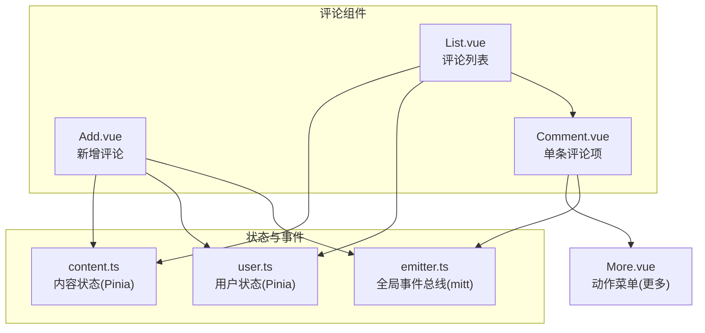
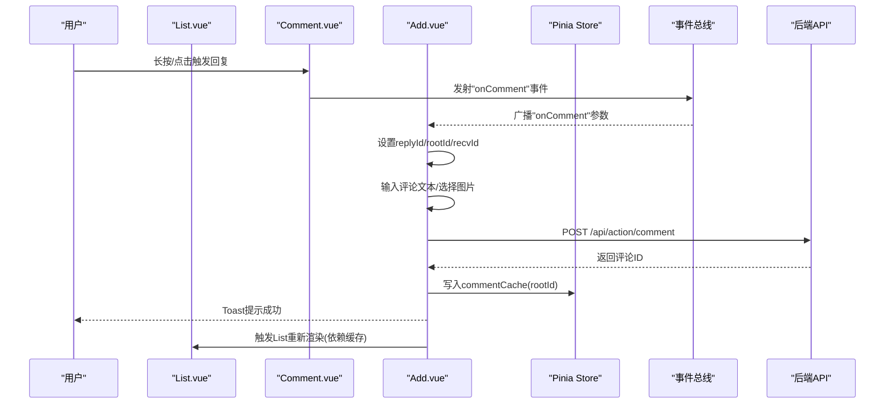
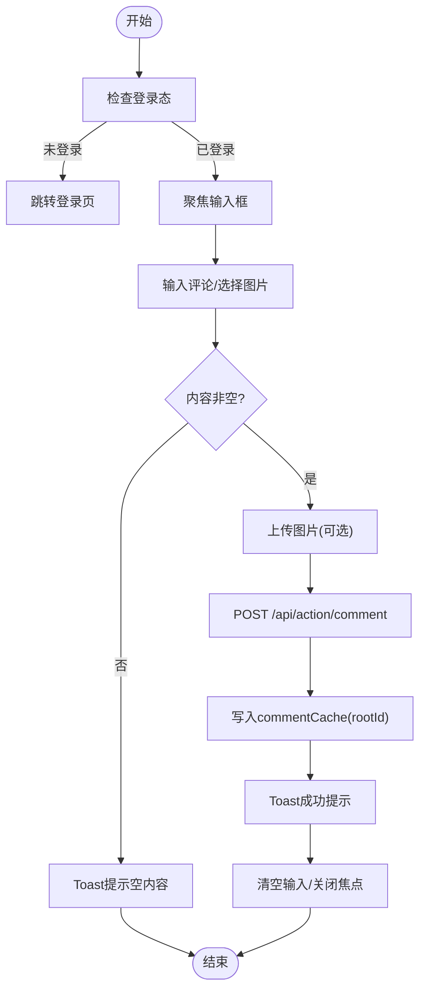
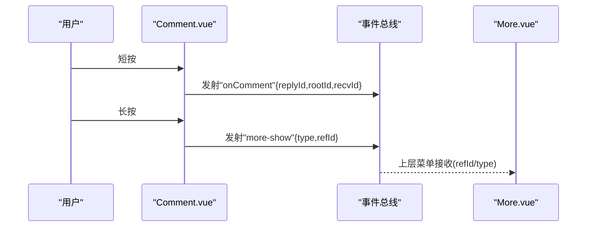
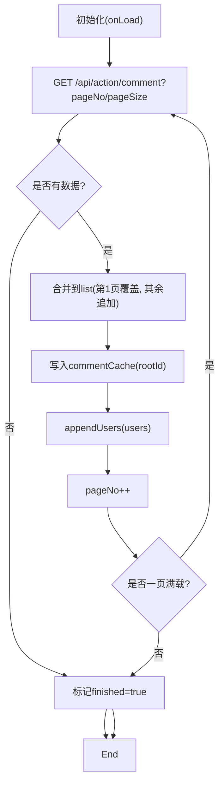
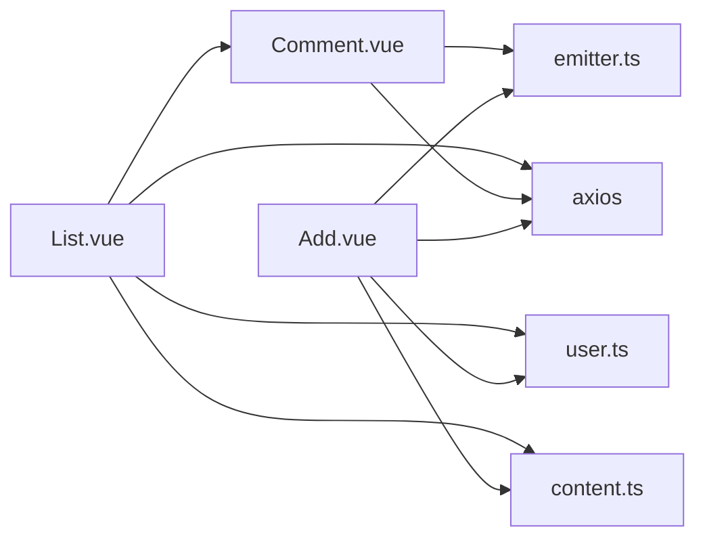

# 评论组件

<cite>
**本文引用的文件**
- [Add.vue](file://client/web/src/components/comment/Add.vue)
- [Comment.vue](file://client/web/src/components/comment/Comment.vue)
- [List.vue](file://client/web/src/components/comment/List.vue)
- [content.ts](file://client/web/src/store/content.ts)
- [user.ts](file://client/web/src/store/user.ts)
- [emitter.ts](file://client/web/src/plugin/emitter.ts)
- [More.vue](file://client/web/src/components/action/More.vue)
</cite>

## 目录
1. [简介](#简介)
2. [项目结构](#项目结构)
3. [核心组件](#核心组件)
4. [架构总览](#架构总览)
5. [详细组件分析](#详细组件分析)
6. [依赖关系分析](#依赖关系分析)
7. [性能考虑](#性能考虑)
8. [故障排查指南](#故障排查指南)
9. [结论](#结论)
10. [附录](#附录)

## 简介
本文件面向Hoper Vue3评论子系统，围绕Add（新增）、Comment（单条评论）、List（评论列表）三大组件，系统梳理其设计模式、数据流、嵌套与回复机制、实时更新策略、状态管理、数据校验与错误处理，并给出虚拟滚动、懒加载与性能优化建议，以及国际化、内容安全与用户体验最佳实践。

## 项目结构
评论子系统位于Web前端工程的组件目录下，采用“按功能域”组织方式：评论相关UI组件集中于comment目录，配套的全局事件总线与业务状态分别由plugin与store模块提供。

图示来源
- [Add.vue:1-131](file://client/web/src/components/comment/Add.vue#L1-L131)
- [Comment.vue:1-165](file://client/web/src/components/comment/Comment.vue#L1-L165)
- [List.vue:1-88](file://client/web/src/components/comment/List.vue#L1-L88)
- [emitter.ts:1-4](file://client/web/src/plugin/emitter.ts#L1-L4)
- [user.ts:1-92](file://client/web/src/store/user.ts#L1-L92)
- [content.ts:1-48](file://client/web/src/store/content.ts#L1-L48)
- [More.vue](file://client/web/src/components/action/More.vue)

章节来源
- [Add.vue:1-131](file://client/web/src/components/comment/Add.vue#L1-L131)
- [Comment.vue:1-165](file://client/web/src/components/comment/Comment.vue#L1-L165)
- [List.vue:1-88](file://client/web/src/components/comment/List.vue#L1-L88)
- [emitter.ts:1-4](file://client/web/src/plugin/emitter.ts#L1-L4)
- [user.ts:1-92](file://client/web/src/store/user.ts#L1-L92)
- [content.ts:1-48](file://client/web/src/store/content.ts#L1-L48)

## 核心组件
- Add.vue：负责评论输入、图片上传、权限校验、调用后端接口并推送至缓存；通过全局事件触发“回复”场景。
- Comment.vue：渲染单条评论，支持长按显示“更多”菜单、短按进入回复流程、点赞/取消点赞、图片预览。
- List.vue：基于Vant List实现无限滚动加载，拉取评论列表，维护页码与完成态，将用户数据写入用户缓存。

章节来源
- [Add.vue:33-119](file://client/web/src/components/comment/Add.vue#L33-L119)
- [Comment.vue:42-108](file://client/web/src/components/comment/Comment.vue#L42-L108)
- [List.vue:22-85](file://client/web/src/components/comment/List.vue#L22-L85)

## 架构总览
评论子系统的控制流以“事件驱动 + Pinia状态 + HTTP API”为核心，形成如下交互闭环：

图示来源
- [Comment.vue:85-107](file://client/web/src/components/comment/Comment.vue#L85-L107)
- [Add.vue:58-71](file://client/web/src/components/comment/Add.vue#L58-L71)
- [Add.vue:73-96](file://client/web/src/components/comment/Add.vue#L73-L96)
- [content.ts:14-27](file://client/web/src/store/content.ts#L14-L27)

## 详细组件分析

### Add 组件分析
- 设计模式
  - 事件驱动：通过mitt事件总线接收来自Comment的回复请求，自动填充回复上下文。
  - 状态管理：依赖Pinia用户认证与评论缓存，避免重复请求。
  - 表单校验：基于Vant Field规则进行必填校验。
- 数据流
  - 输入 -> 校验 -> 图片上传 -> 提交 -> 更新缓存 -> 成功提示。
- 回复机制
  - 接收事件后，从事件参数中提取replyId/rootId/recvId，聚焦输入框并唤起键盘。
- 错误处理
  - 空内容提示、上传失败提示、登录态缺失时跳转登录页。
- 性能与体验
  - 上传状态loading反馈；评论成功后清空输入并关闭焦点。

图示来源
- [Add.vue:58-119](file://client/web/src/components/comment/Add.vue#L58-L119)
- [content.ts:14-27](file://client/web/src/store/content.ts#L14-L27)

章节来源
- [Add.vue:33-119](file://client/web/src/components/comment/Add.vue#L33-L119)
- [emitter.ts:1-4](file://client/web/src/plugin/emitter.ts#L1-L4)
- [content.ts:14-27](file://client/web/src/store/content.ts#L14-L27)

### Comment 组件分析
- 设计模式
  - 事件驱动：短按触发回复，长按触发“更多”菜单。
  - 只读展示：评论内容只读，避免二次编辑。
- 数据流
  - 渲染用户头像/昵称/时间 -> 渲染内容/图片 -> 点赞/取消点赞 -> 预览图片。
- 回复机制
  - 短按：发射“onComment”，携带当前评论的replyId/rootId/recvId。
  - 长按：发射“more-show”，携带评论类型与ID，供上层菜单使用。
- 点赞逻辑
  - 已点赞则删除点赞记录，否则创建点赞记录，双向同步UI与服务端状态。

图示来源
- [Comment.vue:85-107](file://client/web/src/components/comment/Comment.vue#L85-L107)
- [More.vue](file://client/web/src/components/action/More.vue)

章节来源
- [Comment.vue:42-108](file://client/web/src/components/comment/Comment.vue#L42-L108)
- [emitter.ts:1-4](file://client/web/src/plugin/emitter.ts#L1-L4)

### List 组件分析
- 设计模式
  - 无限滚动：基于Vant List的load/finished机制，分页拉取。
  - 缓存策略：将每棵根评论树的列表写入Pinia缓存，减少重复请求。
  - 用户聚合：批量写入用户缓存，避免重复查询。
- 数据流
  - 初始化 -> 请求第一页 -> 追加到列表 -> 写入缓存 -> 用户聚合 -> 下次请求第二页。
- 性能特性
  - 骨架屏占位，提升感知性能；仅在有数据时渲染列表，避免空渲染。
- 与Add/Comment的协作
  - Add成功后写入缓存，List通过缓存驱动局部刷新；Comment通过事件触发Add的回复上下文。

图示来源
- [List.vue:61-84](file://client/web/src/components/comment/List.vue#L61-L84)
- [content.ts:14-27](file://client/web/src/store/content.ts#L14-L27)
- [user.ts:67-84](file://client/web/src/store/user.ts#L67-L84)

章节来源
- [List.vue:22-85](file://client/web/src/components/comment/List.vue#L22-L85)
- [content.ts:14-27](file://client/web/src/store/content.ts#L14-L27)
- [user.ts:67-84](file://client/web/src/store/user.ts#L67-L84)

## 依赖关系分析
- 组件耦合
  - List依赖Comment进行渲染；Add与Comment通过事件总线解耦联动。
  - 三者均依赖Pinia用户与内容状态，实现跨组件共享。
- 外部依赖
  - Vant UI组件库（Field、List、Skeleton、Image、Uploader、Loading、Button、Icon等）。
  - Axios用于HTTP请求。
  - mitt用于轻量事件总线。

图示来源
- [List.vue:22-28](file://client/web/src/components/comment/List.vue#L22-L28)
- [Comment.vue:42-48](file://client/web/src/components/comment/Comment.vue#L42-L48)
- [Add.vue:34-41](file://client/web/src/components/comment/Add.vue#L34-L41)
- [emitter.ts:1-4](file://client/web/src/plugin/emitter.ts#L1-L4)
- [user.ts:1-92](file://client/web/src/store/user.ts#L1-L92)
- [content.ts:1-48](file://client/web/src/store/content.ts#L1-L48)

章节来源
- [List.vue:22-28](file://client/web/src/components/comment/List.vue#L22-L28)
- [Comment.vue:42-48](file://client/web/src/components/comment/Comment.vue#L42-L48)
- [Add.vue:34-41](file://client/web/src/components/comment/Add.vue#L34-L41)
- [emitter.ts:1-4](file://client/web/src/plugin/emitter.ts#L1-L4)
- [user.ts:1-92](file://client/web/src/store/user.ts#L1-L92)
- [content.ts:1-48](file://client/web/src/store/content.ts#L1-L48)

## 性能考虑
- 虚拟滚动
  - 当前List使用Vant List的无限滚动，适合中低密度场景。若评论量极大，建议引入虚拟列表方案（如基于固定高度的窗口化渲染），以降低DOM节点数量与重排成本。
- 懒加载
  - 图片已启用懒加载与预览能力；可进一步对列表骨架屏与首屏关键路径做资源优先级优化。
- 缓存与去重
  - 使用Pinia Map缓存每棵根评论树的列表，避免重复请求；用户信息通过批量写入缓存，减少重复查询。
- 渲染优化
  - 列表项使用骨架屏占位，提升感知性能；仅在有数据时渲染列表容器。
- 网络与并发
  - 上传与提交评论串行，避免并发冲突；可在上传阶段增加防抖或节流，减少频繁请求。

## 故障排查指南
- 登录态缺失
  - 现象：输入框聚焦时被重定向至登录页。
  - 排查：确认本地token是否存在，后端鉴权接口返回是否正常。
  - 参考
    - [Add.vue:105-115](file://client/web/src/components/comment/Add.vue#L105-L115)
    - [user.ts:23-32](file://client/web/src/store/user.ts#L23-L32)
- 空内容提交
  - 现象：提交按钮无响应或Toast提示。
  - 排查：检查表单校验规则与trim后的长度判断。
  - 参考
    - [Add.vue:73-77](file://client/web/src/components/comment/Add.vue#L73-L77)
- 上传失败
  - 现象：上传中状态持续或失败提示。
  - 排查：检查上传工具函数与后端文件服务可用性。
  - 参考
    - [Add.vue:97-101](file://client/web/src/components/comment/Add.vue#L97-L101)
- 评论未显示
  - 现象：新增评论后列表未刷新。
  - 排查：确认Add成功后是否写入commentCache；List是否读取同一rootId缓存。
  - 参考
    - [Add.vue:90-91](file://client/web/src/components/comment/Add.vue#L90-L91)
    - [List.vue:69-79](file://client/web/src/components/comment/List.vue#L69-L79)
    - [content.ts:14-27](file://client/web/src/store/content.ts#L14-L27)

章节来源
- [Add.vue:73-115](file://client/web/src/components/comment/Add.vue#L73-L115)
- [user.ts:23-32](file://client/web/src/store/user.ts#L23-L32)
- [Add.vue:97-101](file://client/web/src/components/comment/Add.vue#L97-L101)
- [Add.vue:90-91](file://client/web/src/components/comment/Add.vue#L90-L91)
- [List.vue:69-79](file://client/web/src/components/comment/List.vue#L69-L79)
- [content.ts:14-27](file://client/web/src/store/content.ts#L14-L27)

## 结论
该评论子系统以事件总线解耦组件、以Pinia集中状态、以HTTP API连接后端，形成清晰的数据流与职责边界。回复机制通过事件参数传递上下文，新增评论后写入缓存，配合List的懒加载与用户聚合，具备良好的扩展性与性能表现。后续可在超大规模场景引入虚拟滚动与更细粒度的缓存失效策略，以进一步提升稳定性与体验。

## 附录
- 国际化支持
  - 文案（如“请输入评论”、“发送”、“上传中”、“没有更多了”）建议统一抽取至i18n资源，便于多语言切换与维护。
- 内容安全
  - 建议在服务端对评论内容与图片进行安全扫描与合规校验；前端可增加字符长度限制与敏感词过滤提示。
- 用户体验优化
  - 增加“正在输入”提示、输入字数统计、粘贴图片自动上传、键盘收起时的布局适配等细节优化。