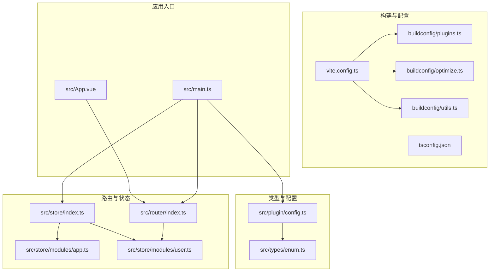
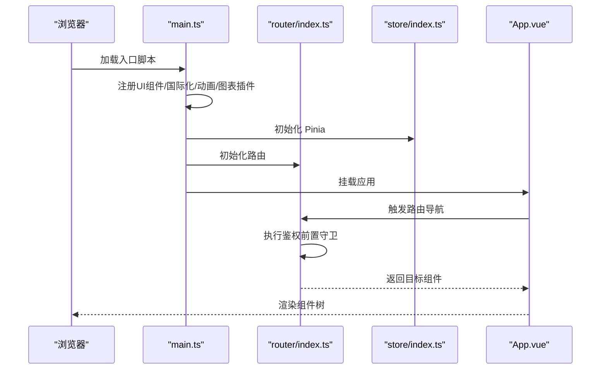
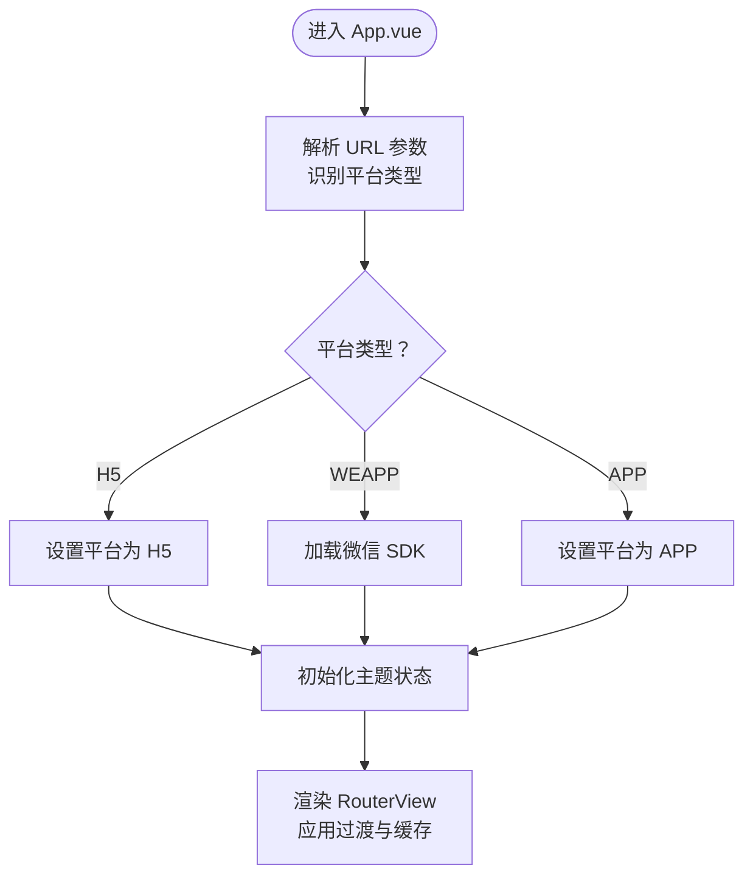
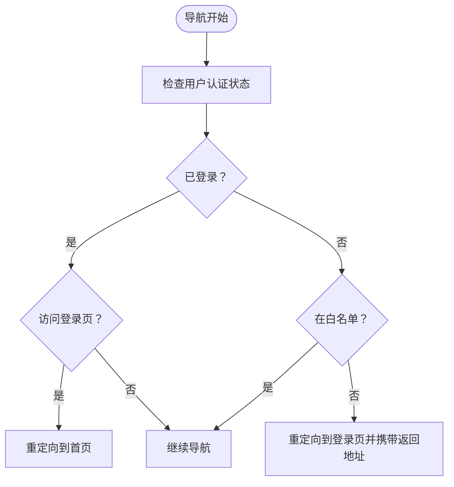
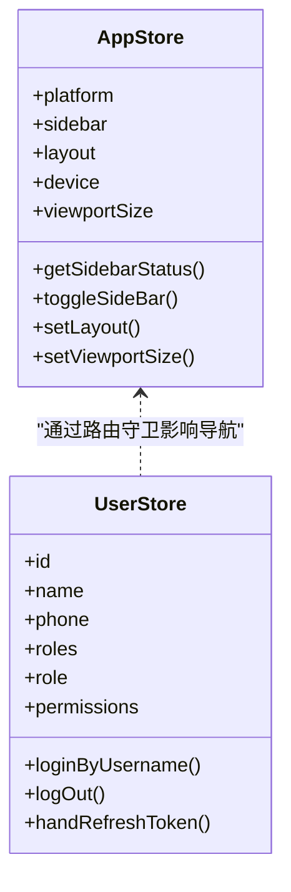
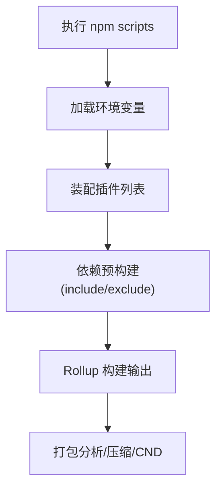
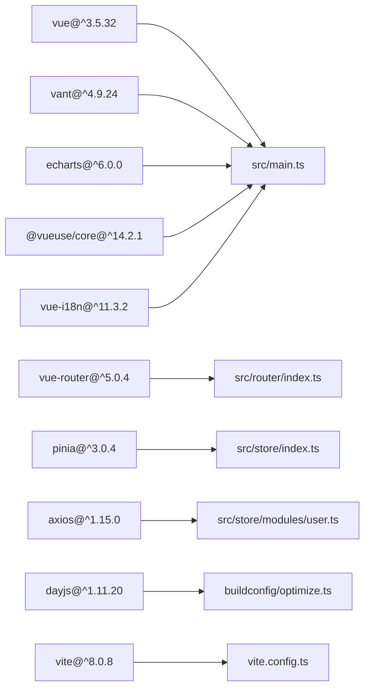

# Vue3 Web 应用

<cite>
**本文档引用的文件**
- [package.json](file://client/web/package.json)
- [vite.config.ts](file://client/web/vite.config.ts)
- [main.ts](file://client/web/src/main.ts)
- [tsconfig.json](file://client/web/tsconfig.json)
- [App.vue](file://client/web/src/App.vue)
- [utils.ts](file://client/web/buildconfig/utils.ts)
- [plugins.ts](file://client/web/buildconfig/plugins.ts)
- [optimize.ts](file://client/web/buildconfig/optimize.ts)
- [router/index.ts](file://client/web/src/router/index.ts)
- [store/index.ts](file://client/web/src/store/index.ts)
- [store/modules/app.ts](file://client/web/src/store/modules/app.ts)
- [store/modules/user.ts](file://client/web/src/store/modules/user.ts)
- [types/enum.ts](file://client/web/src/types/enum.ts)
- [plugin/config.ts](file://client/web/src/plugin/config.ts)
</cite>

## 目录
1. [简介](#简介)
2. [项目结构](#项目结构)
3. [核心组件](#核心组件)
4. [架构概览](#架构概览)
5. [详细组件分析](#详细组件分析)
6. [依赖关系分析](#依赖关系分析)
7. [性能考虑](#性能考虑)
8. [故障排查指南](#故障排查指南)
9. [结论](#结论)
10. [附录](#附录)

## 简介
本文件为 Hoper Vue3 Web 应用的全面技术文档，聚焦以下主题：
- Vue3 组合式 API 的使用与最佳实践
- TypeScript 集成与类型安全
- Vite 构建与开发体验优化
- Pinia 状态管理、Vue Router 路由管理与组件化开发模式
- 响应式数据绑定、生命周期钩子与性能优化策略
- 生产环境优化、热重载机制与替代构建工具
- 组件设计模式、API 集成与用户体验优化

## 项目结构
客户端 Web 应用位于 client/web 目录，采用 Vite + Vue3 + TypeScript 技术栈，结合 Pinia、Vue Router、Element Plus/Vant 等生态组件库，形成现代化前端工程化体系。

**图表来源**
- [vite.config.ts:1-69](file://client/web/vite.config.ts#L1-L69)
- [plugins.ts:1-59](file://client/web/buildconfig/plugins.ts#L1-L59)
- [optimize.ts:1-25](file://client/web/buildconfig/optimize.ts#L1-L25)
- [utils.ts:1-106](file://client/web/buildconfig/utils.ts#L1-L106)
- [main.ts:1-63](file://client/web/src/main.ts#L1-L63)
- [App.vue:1-90](file://client/web/src/App.vue#L1-L90)
- [router/index.ts:1-62](file://client/web/src/router/index.ts#L1-L62)
- [store/index.ts:1-10](file://client/web/src/store/index.ts#L1-L10)
- [store/modules/app.ts:1-86](file://client/web/src/store/modules/app.ts#L1-L86)
- [store/modules/user.ts:1-93](file://client/web/src/store/modules/user.ts#L1-L93)
- [types/enum.ts:1-11](file://client/web/src/types/enum.ts#L1-L11)
- [plugin/config.ts:1-6](file://client/web/src/plugin/config.ts#L1-L6)

**章节来源**
- [package.json:1-95](file://client/web/package.json#L1-L95)
- [vite.config.ts:1-69](file://client/web/vite.config.ts#L1-L69)
- [main.ts:1-63](file://client/web/src/main.ts#L1-L63)
- [tsconfig.json:1-12](file://client/web/tsconfig.json#L1-L12)

## 核心组件
- 应用入口与插件注册：在应用启动时集中注册 UI 组件库、国际化、动画、图表等插件，并根据平台动态加载配置。
- 路由系统：基于 Vue Router 的哈希历史模式，支持异步路由组件与前置守卫鉴权。
- 状态管理：基于 Pinia 的模块化 Store，分别管理应用配置、用户信息等状态。
- 构建配置：通过 Vite 插件体系实现开发与生产环境的差异化优化、CDN 引入、压缩与可视化分析。

**章节来源**
- [main.ts:1-63](file://client/web/src/main.ts#L1-L63)
- [router/index.ts:1-62](file://client/web/src/router/index.ts#L1-L62)
- [store/index.ts:1-10](file://client/web/src/store/index.ts#L1-L10)
- [store/modules/app.ts:1-86](file://client/web/src/store/modules/app.ts#L1-L86)
- [store/modules/user.ts:1-93](file://client/web/src/store/modules/user.ts#L1-L93)
- [vite.config.ts:1-69](file://client/web/vite.config.ts#L1-L69)

## 架构概览
下图展示从应用启动到路由导航的关键流程，包括插件初始化、鉴权守卫与状态同步。

**图表来源**
- [main.ts:1-63](file://client/web/src/main.ts#L1-L63)
- [router/index.ts:1-62](file://client/web/src/router/index.ts#L1-L62)
- [store/index.ts:1-10](file://client/web/src/store/index.ts#L1-L10)
- [App.vue:1-90](file://client/web/src/App.vue#L1-L90)

## 详细组件分析

### 组合式 API 与响应式数据
- 响应式与计算属性：在 App.vue 中使用 ref 定义主题状态，配合路由视图与 KeepAlive/Suspense 实现页面级缓存与异步加载占位。
- 生命周期钩子：在 App.vue 中进行平台检测与微信 SDK 加载，体现 onMounted 类似行为的逻辑组织方式。
- 组合式风格：store/modules/app.ts 使用 defineStore 定义状态、getter 与 action，便于在组件中以组合式 API 形式消费。

**图表来源**
- [App.vue:29-66](file://client/web/src/App.vue#L29-L66)
- [store/modules/app.ts:12-81](file://client/web/src/store/modules/app.ts#L12-L81)

**章节来源**
- [App.vue:1-90](file://client/web/src/App.vue#L1-L90)
- [store/modules/app.ts:1-86](file://client/web/src/store/modules/app.ts#L1-L86)

### Vue Router 路由管理
- 路由定义：采用哈希历史模式，支持动态平台视图路径与异步组件加载。
- 鉴权守卫：在 beforeEach 中检查用户认证状态，白名单放行，未登录重定向至登录页并携带返回地址。
- 动态路由：通过 concat 合并用户与瞬间模块路由，保持模块化扩展性。

**图表来源**
- [router/index.ts:39-59](file://client/web/src/router/index.ts#L39-L59)

**章节来源**
- [router/index.ts:1-62](file://client/web/src/router/index.ts#L1-L62)
- [types/enum.ts:1-11](file://client/web/src/types/enum.ts#L1-L11)

### Pinia 状态管理
- 应用状态：app.ts 管理平台、侧边栏、布局、设备类型与视口尺寸，提供切换侧边栏、设置布局等动作。
- 用户状态：user.ts 管理用户基本信息、角色与权限，提供登录、登出与 Token 刷新等动作。
- 存储持久化：通过工具函数与响应式存储命名空间实现布局状态与用户信息的本地持久化。

**图表来源**
- [store/modules/app.ts:12-81](file://client/web/src/store/modules/app.ts#L12-L81)
- [store/modules/user.ts:13-87](file://client/web/src/store/modules/user.ts#L13-L87)

**章节来源**
- [store/index.ts:1-10](file://client/web/src/store/index.ts#L1-L10)
- [store/modules/app.ts:1-86](file://client/web/src/store/modules/app.ts#L1-L86)
- [store/modules/user.ts:1-93](file://client/web/src/store/modules/user.ts#L1-L93)

### Vite 构建与开发体验
- 插件体系：通过 getPluginsList 统一装配 Vue、JSX、I18n、TailwindCSS、SVG Loader、CDN、压缩、打包分析与控制台清理等插件。
- 依赖预构建：optimize.ts 明确 include/exclude 列表，确保开发时模块缓存命中与避免不必要的预构建。
- 环境变量：utils.ts 提供 wrapperEnv 与 __APP_INFO__，统一处理端口、CDN、压缩等配置。
- 构建输出：vite.config.ts 配置目标浏览器、资源分包策略与 Rollup 输出规则，减少大包告警。

**图表来源**
- [plugins.ts:16-58](file://client/web/buildconfig/plugins.ts#L16-L58)
- [optimize.ts:7-24](file://client/web/buildconfig/optimize.ts#L7-L24)
- [utils.ts:46-73](file://client/web/buildconfig/utils.ts#L46-L73)
- [vite.config.ts:14-67](file://client/web/vite.config.ts#L14-L67)

**章节来源**
- [package.json:12-24](file://client/web/package.json#L12-L24)
- [plugins.ts:1-59](file://client/web/buildconfig/plugins.ts#L1-L59)
- [optimize.ts:1-25](file://client/web/buildconfig/optimize.ts#L1-L25)
- [utils.ts:1-106](file://client/web/buildconfig/utils.ts#L1-L106)
- [vite.config.ts:1-69](file://client/web/vite.config.ts#L1-L69)

### TypeScript 集成与类型安全
- 多项目引用：tsconfig.json 通过 references 引入 app 与 node 两套配置，隔离编译上下文。
- 类型枚举：types/enum.ts 定义平台与操作系统枚举，约束路由与平台相关逻辑。
- 插件配置：plugin/config.ts 暴露 import.meta.env 与静态资源目录、API 主机等常量，便于类型推断。

**章节来源**
- [tsconfig.json:1-12](file://client/web/tsconfig.json#L1-L12)
- [types/enum.ts:1-11](file://client/web/src/types/enum.ts#L1-L11)
- [plugin/config.ts:1-6](file://client/web/src/plugin/config.ts#L1-L6)

### 组件化开发模式与用户体验
- 组件注册：main.ts 集中注册 Vant 组件与插件，减少重复导入，提升开发效率。
- 平台适配：App.vue 根据 URL 参数切换平台，动态加载微信 SDK，保证多端一致性。
- 过渡与缓存：App.vue 使用 Transition + KeepAlive + Suspense 提升页面切换体验与异步内容加载反馈。

**章节来源**
- [main.ts:1-63](file://client/web/src/main.ts#L1-L63)
- [App.vue:1-90](file://client/web/src/App.vue#L1-L90)

## 依赖关系分析
- 应用依赖：Vue3、Vue Router、Pinia、Element Plus、Vant、Axios、Dayjs、ECharts、VueUse 等。
- 构建依赖：Vite、@vitejs/plugin-vue、@vitejs/plugin-vue-jsx、rollup-plugin-visualizer、vite-plugin-compression、vite-plugin-pwa 等。
- 类型与工具：TypeScript、vue-tsc、@types/*、@intlify/unplugin-vue-i18n、unplugin-vue-components 等。

**图表来源**
- [package.json:25-47](file://client/web/package.json#L25-L47)
- [main.ts:1-63](file://client/web/src/main.ts#L1-L63)
- [router/index.ts:1-62](file://client/web/src/router/index.ts#L1-L62)
- [store/index.ts:1-10](file://client/web/src/store/index.ts#L1-L10)
- [store/modules/user.ts:1-93](file://client/web/src/store/modules/user.ts#L1-L93)
- [optimize.ts:7-18](file://client/web/buildconfig/optimize.ts#L7-L18)
- [vite.config.ts:14-67](file://client/web/vite.config.ts#L14-L67)

**章节来源**
- [package.json:1-95](file://client/web/package.json#L1-L95)

## 性能考虑
- 依赖预构建：通过 include/exclude 控制预构建范围，避免不必要的模块缓存与网络请求。
- 资源分包：Rollup 输出规则将 JS 与资产分离，降低缓存失效概率。
- CDN 引入：可通过 VITE_CDN 开关启用外部 CDN，减少首屏体积与加载时间。
- 压缩与分析：生产环境启用压缩与打包分析，持续监控包体变化。
- 缓存与懒加载：KeepAlive 与 Lazyload 结合，减少重复渲染与首屏压力。

**章节来源**
- [optimize.ts:1-25](file://client/web/buildconfig/optimize.ts#L1-L25)
- [vite.config.ts:44-61](file://client/web/vite.config.ts#L44-L61)
- [plugins.ts:49-56](file://client/web/buildconfig/plugins.ts#L49-L56)
- [main.ts:38-40](file://client/web/src/main.ts#L38-L40)

## 故障排查指南
- 路由白名单问题：若出现“未匹配路由”警告，确认白名单数组与路由名称一致，或在开发环境启用 removeNoMatch 插件。
- 平台初始化失败：检查 URL 参数与平台枚举，确保平台分支正确执行 SDK 加载。
- 鉴权异常：核对 beforeEach 中的鉴权逻辑与用户状态，确保登录后不会被重定向到登录页。
- 构建体积告警：关注 chunkSizeWarningLimit 配置，结合打包分析报告定位大体积模块。

**章节来源**
- [router/index.ts:10-11](file://client/web/src/router/index.ts#L10-L11)
- [router/index.ts:39-59](file://client/web/src/router/index.ts#L39-L59)
- [App.vue:46-61](file://client/web/src/App.vue#L46-L61)
- [vite.config.ts:48-49](file://client/web/vite.config.ts#L48-L49)

## 结论
本项目以 Vite 为核心构建工具，结合 Vue3 组合式 API、TypeScript、Pinia 与 Vue Router，形成了高可维护性的前端工程化方案。通过模块化的路由与状态管理、完善的构建优化与插件体系，以及针对多端平台的适配策略，能够有效提升开发效率与用户体验。

## 附录
- 开发与构建命令参考：见 package.json scripts 字段。
- 环境变量与平台配置：通过 env 目录与 import.meta.env 配置，结合 utils.ts 的 wrapperEnv 统一处理。
- 国际化与主题：App.vue 使用 ConfigProvider 主题能力，结合 i18n 插件实现多语言支持。

**章节来源**
- [package.json:12-24](file://client/web/package.json#L12-L24)
- [utils.ts:46-73](file://client/web/buildconfig/utils.ts#L46-L73)
- [App.vue:2-26](file://client/web/src/App.vue#L2-L26)