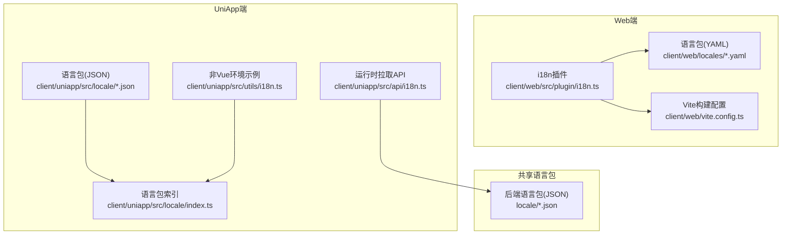
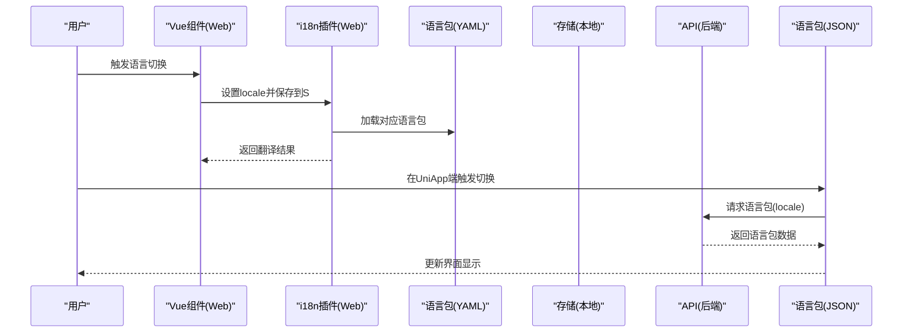
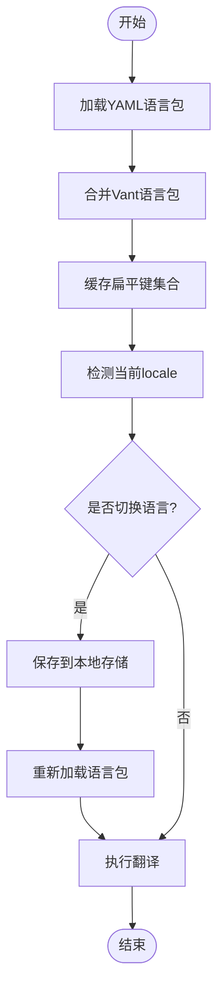
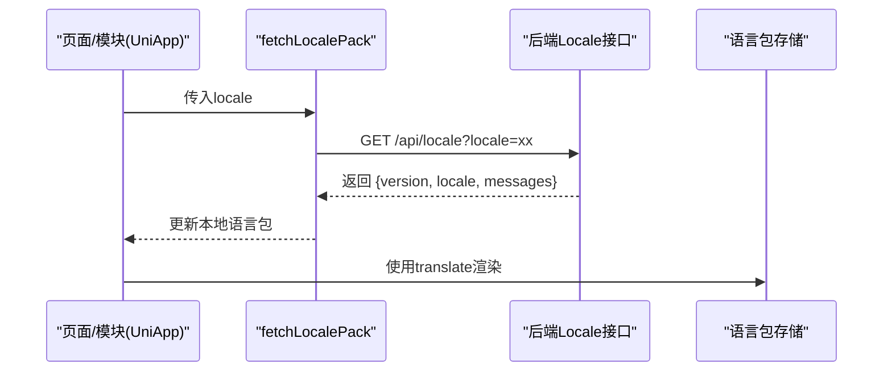
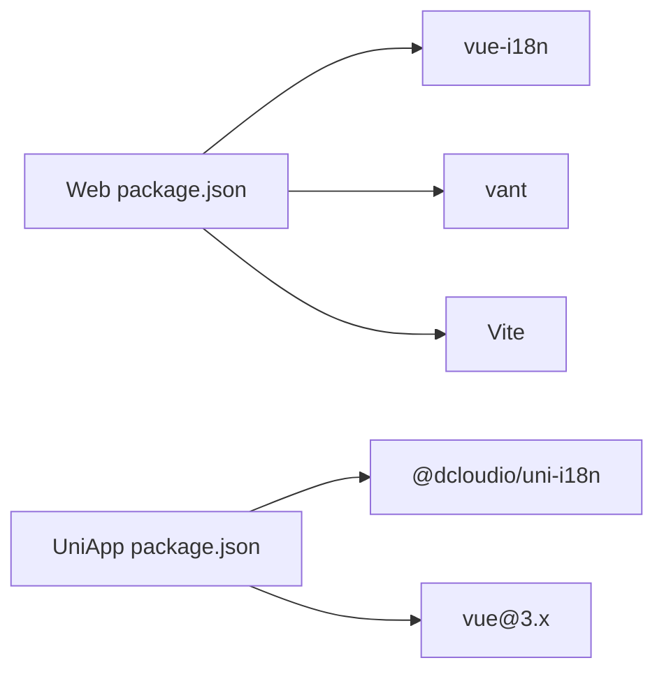

# 国际化支持

<cite>
**本文档引用的文件**
- [client/web/src/plugin/i18n.ts](file://client/web/src/plugin/i18n.ts)
- [client/web/locales/en.yaml](file://client/web/locales/en.yaml)
- [client/web/locales/zh-CN.yaml](file://client/web/locales/zh-CN.yaml)
- [client/uniapp/src/locale/index.ts](file://client/uniapp/src/locale/index.ts)
- [client/uniapp/src/locale/en.json](file://client/uniapp/src/locale/en.json)
- [client/uniapp/src/locale/zh-CN.json](file://client/uniapp/src/locale/zh-CN.json)
- [client/uniapp/src/api/i18n.ts](file://client/uniapp/src/api/i18n.ts)
- [client/uniapp/src/utils/i18n.ts](file://client/uniapp/src/utils/i18n.ts)
- [locale/en.json](file://locale/en.json)
- [locale/zh-CN.json](file://locale/zh-CN.json)
- [client/web/package.json](file://client/web/package.json)
- [client/uniapp/package.json](file://client/uniapp/package.json)
- [client/web/vite.config.ts](file://client/web/vite.config.ts)
</cite>

## 目录
1. [简介](#简介)
2. [项目结构](#项目结构)
3. [核心组件](#核心组件)
4. [架构总览](#架构总览)
5. [详细组件分析](#详细组件分析)
6. [依赖关系分析](#依赖关系分析)
7. [性能考虑](#性能考虑)
8. [故障排查指南](#故障排查指南)
9. [结论](#结论)
10. [附录](#附录)

## 简介
本文件面向Hoper Vue3应用的国际化支持，系统性梳理i18n插件配置、语言包管理与动态切换机制，深入解释多语言资源管理、文本提取与翻译维护流程，阐述语言检测、本地化配置与文化适配策略，并提供国际化最佳实践、翻译工具集成与性能优化方案，以及多语言开发规范、测试策略与部署注意事项。

## 项目结构
Hoper项目在Web端与UniApp端分别实现了国际化能力：
- Web端：基于vue-i18n，采用YAML语言包，结合Vite按需加载与缓存策略，支持组件库（Vant）语言包合并与动态切换。
- UniApp端：基于@uni-i18n与自定义语言包，支持运行时拉取语言包，兼容非Vue环境下的翻译调用。

图表来源
- [client/web/src/plugin/i18n.ts:1-115](file://client/web/src/plugin/i18n.ts#L1-L115)
- [client/web/locales/en.yaml](file://client/web/locales/en.yaml)
- [client/web/locales/zh-CN.yaml](file://client/web/locales/zh-CN.yaml)
- [client/uniapp/src/locale/index.ts](file://client/uniapp/src/locale/index.ts)
- [client/uniapp/src/locale/en.json](file://client/uniapp/src/locale/en.json)
- [client/uniapp/src/locale/zh-CN.json](file://client/uniapp/src/locale/zh-CN.json)
- [client/uniapp/src/api/i18n.ts:1-15](file://client/uniapp/src/api/i18n.ts#L1-L15)
- [client/uniapp/src/utils/i18n.ts:1-12](file://client/uniapp/src/utils/i18n.ts#L1-L12)
- [locale/en.json](file://locale/en.json)
- [locale/zh-CN.json](file://locale/zh-CN.json)
- [client/web/vite.config.ts:1-69](file://client/web/vite.config.ts#L1-L69)

章节来源
- [client/web/src/plugin/i18n.ts:1-115](file://client/web/src/plugin/i18n.ts#L1-L115)
- [client/web/locales/en.yaml](file://client/web/locales/en.yaml)
- [client/web/locales/zh-CN.yaml](file://client/web/locales/zh-CN.yaml)
- [client/uniapp/src/locale/index.ts](file://client/uniapp/src/locale/index.ts)
- [client/uniapp/src/locale/en.json](file://client/uniapp/src/locale/en.json)
- [client/uniapp/src/locale/zh-CN.json](file://client/uniapp/src/locale/zh-CN.json)
- [client/uniapp/src/api/i18n.ts:1-15](file://client/uniapp/src/api/i18n.ts#L1-L15)
- [client/uniapp/src/utils/i18n.ts:1-12](file://client/uniapp/src/utils/i18n.ts#L1-L12)
- [locale/en.json](file://locale/en.json)
- [locale/zh-CN.json](file://locale/zh-CN.json)
- [client/web/vite.config.ts:1-69](file://client/web/vite.config.ts#L1-L69)

## 核心组件
- Web端i18n插件与语言包管理
  - 插件入口：通过createI18n创建实例，启用组合式API（legacy: false），默认语言从本地存储读取，回退语言为英语。
  - 语言包加载：使用Vite的glob按需加载locales目录下的YAML文件，自动解析语言代码并合并到localesConfigs。
  - 组件库语言包：合并Vant的中英文语言包，确保UI组件文案同步。
  - 动态切换：通过transformI18n与tr函数实现运行时文本转换与翻译调用。
- UniApp端语言包与运行时拉取
  - 语言包：在src/locale目录下维护JSON格式语言包，包含基础文案与组件库文案。
  - 运行时拉取：通过fetchLocalePack接口按语言代码拉取后端语言包，实现动态更新。
  - 非Vue环境：提供translate函数在非Vue模块中直接使用。

章节来源
- [client/web/src/plugin/i18n.ts:104-115](file://client/web/src/plugin/i18n.ts#L104-L115)
- [client/web/src/plugin/i18n.ts:27-36](file://client/web/src/plugin/i18n.ts#L27-L36)
- [client/web/src/plugin/i18n.ts:77-99](file://client/web/src/plugin/i18n.ts#L77-L99)
- [client/uniapp/src/api/i18n.ts:10-15](file://client/uniapp/src/api/i18n.ts#L10-L15)
- [client/uniapp/src/locale/index.ts](file://client/uniapp/src/locale/index.ts)

## 架构总览
Web端与UniApp端的国际化架构相互独立又可互补：
- Web端：静态语言包（YAML）+ 组件库语言包合并 + 运行时切换。
- UniApp端：静态语言包（JSON）+ 后端语言包动态拉取 + 非Vue环境翻译。

图表来源
- [client/web/src/plugin/i18n.ts:104-115](file://client/web/src/plugin/i18n.ts#L104-L115)
- [client/web/locales/en.yaml](file://client/web/locales/en.yaml)
- [client/web/locales/zh-CN.yaml](file://client/web/locales/zh-CN.yaml)
- [client/uniapp/src/api/i18n.ts:10-15](file://client/uniapp/src/api/i18n.ts#L10-L15)
- [client/uniapp/src/locale/index.ts](file://client/uniapp/src/locale/index.ts)

## 详细组件分析

### Web端i18n插件与语言包管理
- 配置要点
  - 实例创建：legacy关闭，启用组合式API；locale与fallbackLocale分别来自本地存储与默认值。
  - 语言包合并：将YAML语言包与Vant语言包合并，避免重复与遗漏。
  - 缓存策略：对扁平化的键集合进行缓存，减少递归遍历开销。
- 动态切换机制
  - transformI18n：支持对象形式的多语言路由标题与普通键值翻译，自动识别当前locale。
  - tr函数：简化翻译调用，便于全局使用。
- 语言检测与本地化
  - 默认语言来源于本地存储的响应式命名空间，确保刷新后保持一致。
  - 回退语言为英语，保证缺失翻译时的可用性。

图表来源
- [client/web/src/plugin/i18n.ts:12-25](file://client/web/src/plugin/i18n.ts#L12-L25)
- [client/web/src/plugin/i18n.ts:37-70](file://client/web/src/plugin/i18n.ts#L37-L70)
- [client/web/src/plugin/i18n.ts:77-99](file://client/web/src/plugin/i18n.ts#L77-L99)
- [client/web/src/plugin/i18n.ts:104-115](file://client/web/src/plugin/i18n.ts#L104-L115)

章节来源
- [client/web/src/plugin/i18n.ts:1-115](file://client/web/src/plugin/i18n.ts#L1-L115)
- [client/web/locales/en.yaml](file://client/web/locales/en.yaml)
- [client/web/locales/zh-CN.yaml](file://client/web/locales/zh-CN.yaml)

### UniApp端语言包与运行时拉取
- 语言包组织
  - JSON格式语言包位于src/locale，包含基础文案与组件库文案。
  - index.ts作为语言包索引，统一导出翻译函数。
- 运行时拉取
  - fetchLocalePack根据locale参数请求后端语言包，返回包含版本、语言与消息体的数据结构。
- 非Vue环境使用
  - utils/i18n展示在非Vue模块中如何调用translate函数进行翻译。

图表来源
- [client/uniapp/src/api/i18n.ts:10-15](file://client/uniapp/src/api/i18n.ts#L10-L15)
- [client/uniapp/src/locale/index.ts](file://client/uniapp/src/locale/index.ts)
- [client/uniapp/src/utils/i18n.ts:1-12](file://client/uniapp/src/utils/i18n.ts#L1-L12)

章节来源
- [client/uniapp/src/locale/index.ts](file://client/uniapp/src/locale/index.ts)
- [client/uniapp/src/locale/en.json](file://client/uniapp/src/locale/en.json)
- [client/uniapp/src/locale/zh-CN.json](file://client/uniapp/src/locale/zh-CN.json)
- [client/uniapp/src/api/i18n.ts:1-15](file://client/uniapp/src/api/i18n.ts#L1-L15)
- [client/uniapp/src/utils/i18n.ts:1-12](file://client/uniapp/src/utils/i18n.ts#L1-L12)

### 共享语言包与后端集成
- 后端语言包
  - 位于locale目录的JSON文件，包含基础文案与错误信息等。
  - Web端与UniApp端均可通过运行时拉取或静态引入的方式使用。
- 文本提取与翻译维护
  - Web端通过transformI18n支持对象多语言路由标题与键值翻译，便于统一维护。
  - UniApp端通过fetchLocalePack实现后端驱动的语言包更新。

章节来源
- [locale/en.json](file://locale/en.json)
- [locale/zh-CN.json](file://locale/zh-CN.json)
- [client/web/src/plugin/i18n.ts:77-99](file://client/web/src/plugin/i18n.ts#L77-L99)
- [client/uniapp/src/api/i18n.ts:10-15](file://client/uniapp/src/api/i18n.ts#L10-L15)

## 依赖关系分析
- Web端依赖
  - vue-i18n：提供国际化核心能力。
  - vant：提供UI组件的中英文语言包。
  - Vite：通过glob按需加载语言包，提升构建效率。
- UniApp端依赖
  - @dcloudio/uni-i18n：提供UniApp平台的国际化能力。
  - 自定义语言包与后端API：实现动态语言包更新。

图表来源
- [client/web/package.json:44-46](file://client/web/package.json#L44-L46)
- [client/web/package.json](file://client/web/package.json#L43)
- [client/uniapp/package.json:94-103](file://client/uniapp/package.json#L94-L103)
- [client/uniapp/package.json](file://client/uniapp/package.json#L161)

章节来源
- [client/web/package.json:1-95](file://client/web/package.json#L1-L95)
- [client/uniapp/package.json:1-174](file://client/uniapp/package.json#L1-L174)

## 性能考虑
- 语言包加载
  - Web端使用Vite的glob按需加载，避免一次性引入全部语言包，降低首屏体积。
  - 对扁平键集合进行缓存，减少递归遍历带来的计算开销。
- 构建优化
  - Vite配置中关闭生产环境devtools标记，减少额外开销。
  - Rollup输出策略按类型分离文件名，便于CDN与缓存优化。
- 运行时切换
  - 本地存储读取locale，避免每次重新计算，默认回退语言为英语，保证稳定性。

章节来源
- [client/web/src/plugin/i18n.ts:12-25](file://client/web/src/plugin/i18n.ts#L12-L25)
- [client/web/src/plugin/i18n.ts:62-70](file://client/web/src/plugin/i18n.ts#L62-L70)
- [client/web/vite.config.ts:62-66](file://client/web/vite.config.ts#L62-L66)

## 故障排查指南
- 语言包未生效
  - 检查语言包文件是否存在且命名正确（Web端为YAML，UniApp端为JSON）。
  - 确认localesConfigs中是否包含对应语言包，或fetchLocalePack返回的数据是否正确。
- 切换语言无效
  - 确认本地存储的locale键是否正确，以及i18n实例的locale设置逻辑。
  - 检查fallbackLocale配置，确保缺失翻译时有回退文案。
- 非Vue环境无法翻译
  - 确保translate函数已正确导入并初始化语言包。
  - 检查fetchLocalePack调用是否成功返回语言包数据。

章节来源
- [client/web/src/plugin/i18n.ts:104-115](file://client/web/src/plugin/i18n.ts#L104-L115)
- [client/uniapp/src/api/i18n.ts:10-15](file://client/uniapp/src/api/i18n.ts#L10-L15)
- [client/uniapp/src/utils/i18n.ts:1-12](file://client/uniapp/src/utils/i18n.ts#L1-L12)

## 结论
Hoper项目的国际化体系在Web端与UniApp端分别实现了稳健的静态与动态语言包管理。Web端通过YAML语言包与组件库语言包合并，结合Vite按需加载与键集合缓存，提供了高效的运行时切换体验；UniApp端通过运行时拉取后端语言包，满足多端与多场景的动态需求。建议在后续迭代中完善翻译工具链与自动化校验流程，持续优化性能与可维护性。

## 附录
- 开发规范
  - 语言包命名：Web端使用YAML，UniApp端使用JSON；键名采用层级点号分隔，避免重复。
  - 文本提取：优先使用键值而非硬编码文本，确保可翻译性。
  - 错误文案：统一放置于共享语言包，便于复用与维护。
- 测试策略
  - 单元测试：针对transformI18n与tr函数进行覆盖，验证键存在性与回退逻辑。
  - 集成测试：模拟语言切换与运行时拉取，验证UI文案一致性。
- 部署注意事项
  - Web端：确保构建产物包含所需语言包，避免CDN缓存导致的旧文案问题。
  - UniApp端：确保后端Locale接口稳定可用，语言包版本号用于强制更新。