# 应用架构设计

<cite>
**本文引用的文件**
- [main.ts](file://client/web/src/main.ts)
- [vite.config.ts](file://client/web/vite.config.ts)
- [package.json](file://client/web/package.json)
- [plugin.js](file://client/web/src/plugin/plugin.js)
- [i18n.ts](file://client/web/src/plugin/i18n.ts)
- [echarts.ts](file://client/web/src/plugin/echarts.ts)
- [store/index.ts](file://client/web/src/store/index.ts)
- [router/index.ts](file://client/web/src/router/index.ts)
- [utils/env.ts](file://client/web/src/utils/env.ts)
- [plugins.ts](file://client/web/buildconfig/plugins.ts)
- [config.ts](file://client/web/src/plugin/config.ts)
- [global.d.ts](file://client/web/src/types/global.d.ts)
- [tsconfig.json](file://client/web/tsconfig.json)
</cite>

## 目录
1. [引言](#引言)
2. [项目结构](#项目结构)
3. [核心组件](#核心组件)
4. [架构总览](#架构总览)
5. [详细组件分析](#详细组件分析)
6. [依赖关系分析](#依赖关系分析)
7. [性能考量](#性能考量)
8. [故障排查指南](#故障排查指南)
9. [结论](#结论)
10. [附录](#附录)

## 引言
本文件面向Hoper Vue3 Web应用的架构设计，聚焦应用初始化流程、插件系统集成、全局配置管理、国际化初始化、Vant UI组件库按需引入策略，以及Hoper自定义插件的设计与实现。文档通过架构图与代码级分析，帮助开发者快速理解启动顺序、平台配置加载机制与最佳实践。

## 项目结构
客户端Web应用位于 client/web，采用Vite + Vue3 + TypeScript技术栈，核心入口为 main.ts；插件体系集中于 src/plugin；状态管理使用 Pinia；路由基于 Vue Router；构建配置位于 buildconfig；类型声明集中在 src/types/global.d.ts。

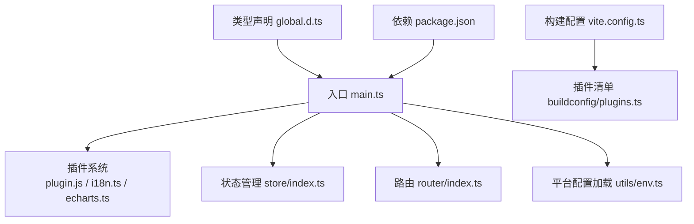

图表来源
- [main.ts:16-60](file://client/web/src/main.ts#L16-L60)
- [vite.config.ts:14-68](file://client/web/vite.config.ts#L14-L68)
- [plugins.ts:16-58](file://client/web/buildconfig/plugins.ts#L16-L58)
- [global.d.ts:1-182](file://client/web/src/types/global.d.ts#L1-L182)
- [package.json:1-95](file://client/web/package.json#L1-L95)

章节来源
- [main.ts:1-63](file://client/web/src/main.ts#L1-L63)
- [vite.config.ts:1-69](file://client/web/vite.config.ts#L1-L69)
- [plugins.ts:1-59](file://client/web/buildconfig/plugins.ts#L1-L59)
- [global.d.ts:1-182](file://client/web/src/types/global.d.ts#L1-L182)
- [package.json:1-95](file://client/web/package.json#L1-L95)

## 核心组件
- 应用入口与初始化：负责创建Vue应用实例、挂载插件、加载平台配置、注册路由与状态管理后挂载DOM。
- 插件系统：包含Hoper自定义插件（指令与全局方法）、国际化（vue-i18n + Vant语言包）、ECharts按需引入。
- 平台配置：从 public 下的 platform-config.json 动态注入全局配置，供全应用使用。
- 路由与鉴权：基于 beforeEnter 的鉴权中间件与白名单控制。
- 构建与插件管线：Vite插件清单、CDN与压缩、I18n预处理等。

章节来源
- [main.ts:1-63](file://client/web/src/main.ts#L1-L63)
- [plugin.js:1-39](file://client/web/src/plugin/plugin.js#L1-L39)
- [i18n.ts:1-115](file://client/web/src/plugin/i18n.ts#L1-L115)
- [echarts.ts:1-45](file://client/web/src/plugin/echarts.ts#L1-L45)
- [utils/env.ts:1-56](file://client/web/src/utils/env.ts#L1-L56)
- [router/index.ts:1-62](file://client/web/src/router/index.ts#L1-L62)

## 架构总览
下图展示应用启动的关键调用序列：入口创建应用 → 加载平台配置 → 注册插件（状态、路由、国际化、ECharts、Motion）→ 挂载DOM。

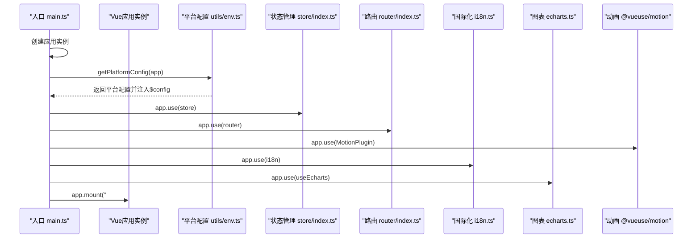

图表来源
- [main.ts:54-60](file://client/web/src/main.ts#L54-L60)
- [utils/env.ts:30-50](file://client/web/src/utils/env.ts#L30-L50)
- [store/index.ts:5-7](file://client/web/src/store/index.ts#L5-L7)
- [router/index.ts:1-62](file://client/web/src/router/index.ts#L1-L62)
- [i18n.ts:104-115](file://client/web/src/plugin/i18n.ts#L104-L115)
- [echarts.ts:40-42](file://client/web/src/plugin/echarts.ts#L40-L42)

## 详细组件分析

### 应用初始化与启动顺序
- 初始化阶段：创建Vue应用实例，按序注册Vant组件（按需引入）、Hoper自定义插件、Lazyload、Overlay、Loading、PullRefresh、ActionSheet、ShareSheet、Calendar、DatePicker、Checkbox、Popover、ConfigProvider等。
- 平台配置加载：通过 getPlatformConfig 从 public 目录拉取 platform-config.json，合并到全局配置并注入到 app.config.globalProperties.$config。
- 插件注册：在获取配置后，再注册 Pinia、Vue Router、@vueuse/motion、vue-i18n、ECharts。
- 挂载：完成上述步骤后挂载到DOM。

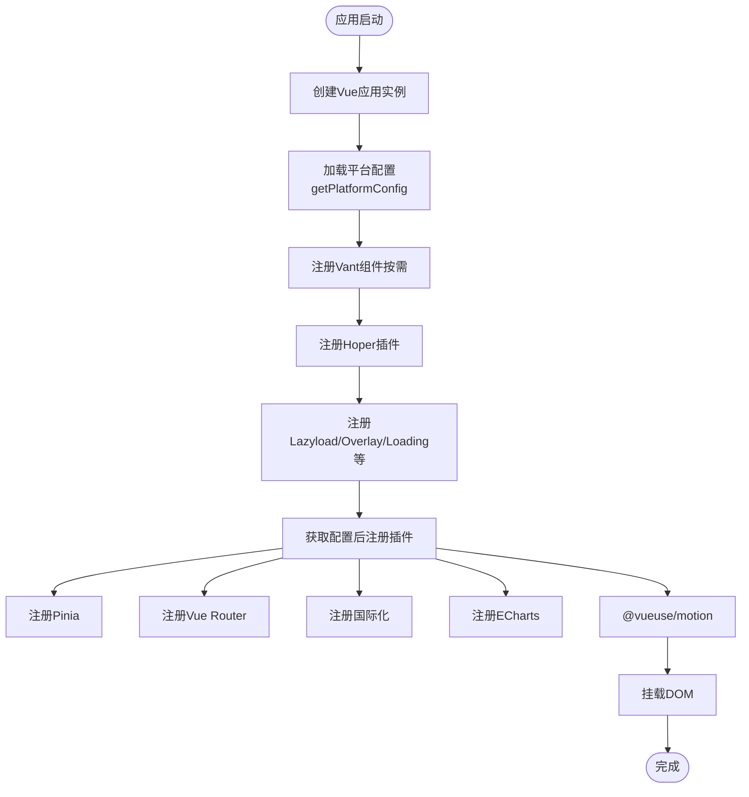

图表来源
- [main.ts:16-60](file://client/web/src/main.ts#L16-L60)
- [utils/env.ts:30-50](file://client/web/src/utils/env.ts#L30-L50)

章节来源
- [main.ts:1-63](file://client/web/src/main.ts#L1-L63)

### 插件系统与自定义插件
- Hoper自定义插件：提供日期格式化指令与全局方法（如 $toDayjs、$dateFmtDateTime、$dateFmt），以及统一上传方法 $customUpload。
- 插件安装：在 main.ts 中以 app.use(HoperPlugin) 方式注册，随后在模板中可使用 v-datefmt 指令与全局方法。
- 设计理念：通过 app.directive 与 app.config.globalProperties 提供一致的全局能力，避免重复封装，便于维护。

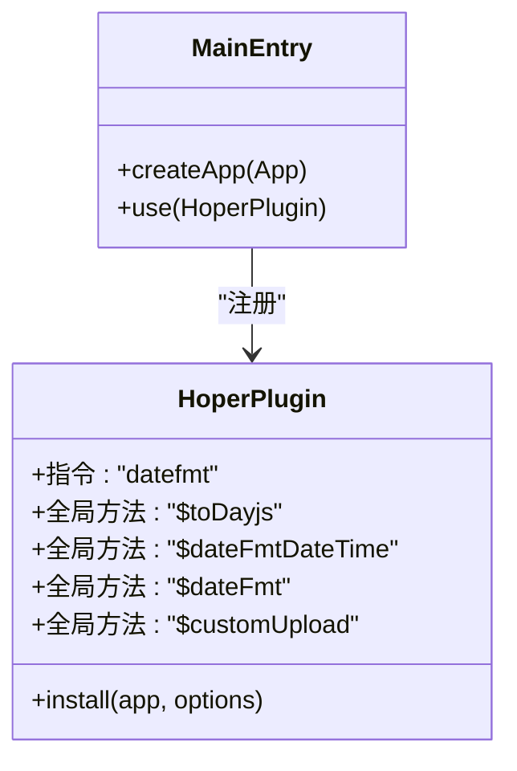

图表来源
- [plugin.js:8-38](file://client/web/src/plugin/plugin.js#L8-L38)
- [main.ts:35-35](file://client/web/src/main.ts#L35-L35)

章节来源
- [plugin.js:1-39](file://client/web/src/plugin/plugin.js#L1-L39)
- [main.ts:1-63](file://client/web/src/main.ts#L1-L63)

### Vant UI 组件库按需引入策略
- 引入范围：在入口文件中显式引入常用组件与功能模块（如 Col、Row、NavBar、Tabbar、Button、Form、Field、Uploader、Popup、Radio、Checkbox、Calendar、DatePicker、Popover、ConfigProvider 等）。
- 样式按需：对 Toast、Dialog、Notify、ImagePreview 等组件样式进行单独引入，避免全量样式造成体积膨胀。
- Lazyload：启用懒加载与懒组件支持，优化首屏与长列表性能。
- 策略收益：减少打包体积、提升初始化速度，同时保持组件可用性。

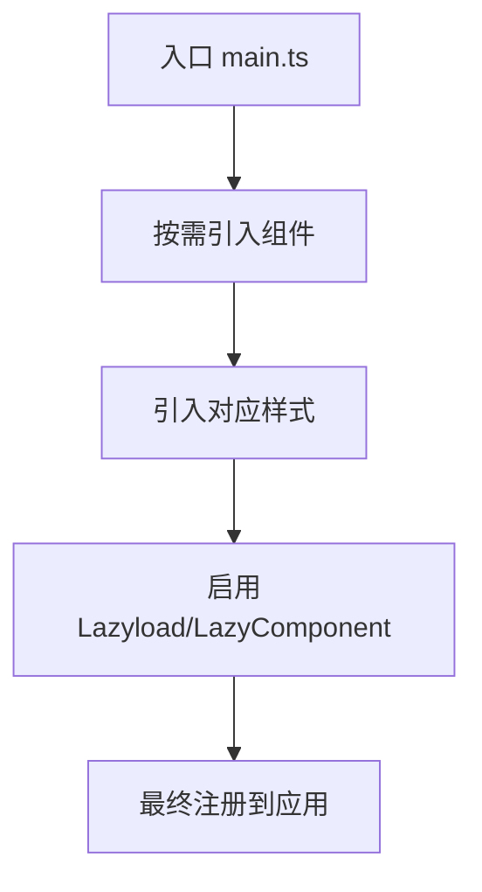

图表来源
- [main.ts:17-52](file://client/web/src/main.ts#L17-L52)

章节来源
- [main.ts:1-63](file://client/web/src/main.ts#L1-L63)

### 国际化初始化流程
- 消息源：项目根部 locales 目录下的 YAML 文件作为项目级消息源；同时引入 Vant 的语言包以覆盖UI文案。
- 配置合并：localesConfigs 合并项目消息与 Vant 语言包，形成 zh/en 两套配置。
- 运行时选择：根据本地存储的 locale 决定当前语言，默认回退到英文。
- 辅助工具：transformI18n 支持嵌套键查找与兼容非嵌套写法；$t 用于IDE智能提示。
- 注册时机：在平台配置加载完成后注册 i18n 插件。

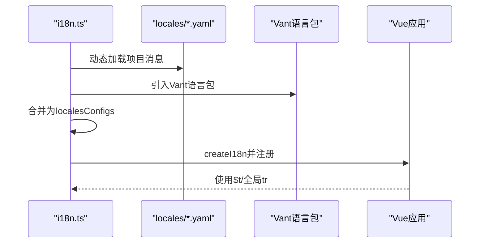

图表来源
- [i18n.ts:12-36](file://client/web/src/plugin/i18n.ts#L12-L36)
- [i18n.ts:104-115](file://client/web/src/plugin/i18n.ts#L104-L115)

章节来源
- [i18n.ts:1-115](file://client/web/src/plugin/i18n.ts#L1-L115)

### 平台配置加载机制
- 配置来源：public/platform-config.json 作为动态全局配置，包含标题、主题、布局、暗色模式、语言等。
- 加载流程：入口先创建应用，再调用 getPlatformConfig，通过 axios 拉取配置并合并到 app.config.globalProperties.$config。
- 使用方式：全局可通过 $config 访问；响应式存储命名空间来自配置项，用于持久化用户偏好。
- 错误处理：若无法获取配置则抛出提示，确保开发期及时发现缺失。

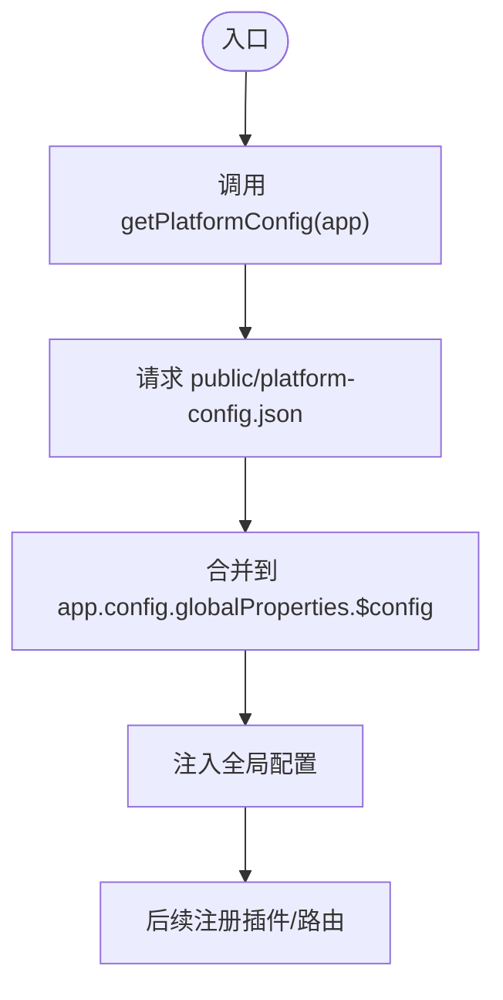

图表来源
- [utils/env.ts:30-50](file://client/web/src/utils/env.ts#L30-L50)
- [main.ts:54-60](file://client/web/src/main.ts#L54-L60)

章节来源
- [utils/env.ts:1-56](file://client/web/src/utils/env.ts#L1-L56)
- [main.ts:1-63](file://client/web/src/main.ts#L1-L63)

### 路由与鉴权
- 路由结构：基础路由（首页、聊天、我的主页）结合异步加载与平台视图目录切换。
- 鉴权中间件：beforeEach 中检查用户认证状态，白名单放行，未登录强制跳转登录页并携带回跳地址。
- 平台切换：路由路径根据 APP_PLATFORM 动态指向不同平台视图目录。

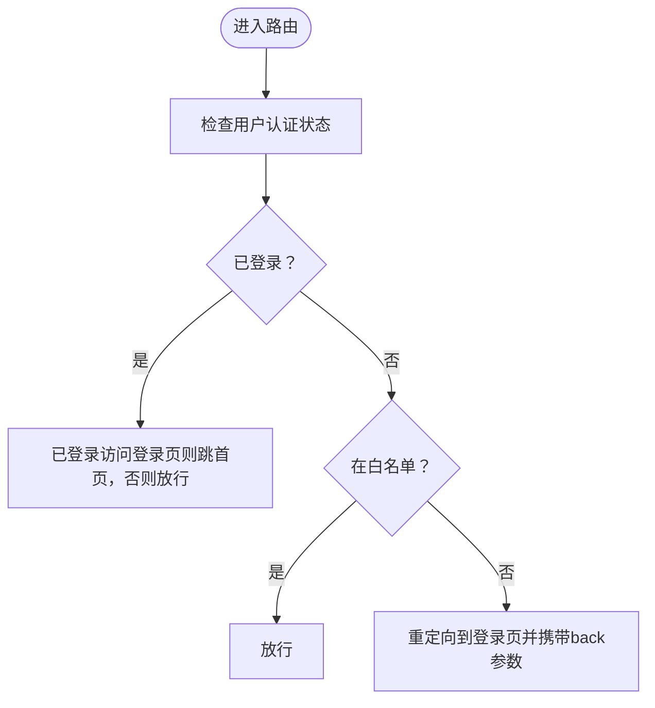

图表来源
- [router/index.ts:39-59](file://client/web/src/router/index.ts#L39-L59)

章节来源
- [router/index.ts:1-62](file://client/web/src/router/index.ts#L1-L62)

### 构建与插件管线
- 插件清单：getPluginsList 统一管理 Vite 插件，包括 Vue、JSX、TailwindCSS、SVG组件化、I18n预处理、CDN、压缩、打包分析、控制台清理等。
- 环境变量：wrapperEnv 从 env 目录加载，支持端口、CDN开关、压缩格式、公共路径等。
- 依赖优化：optimizeDeps.include/exclude 控制预打包范围，减少冷启动时间。
- 定义常量：define 中注入 __APP_INFO__ 与 __APP_PLATFORM__，供运行时使用。

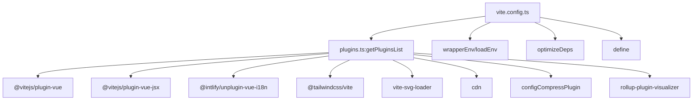

图表来源
- [vite.config.ts:14-68](file://client/web/vite.config.ts#L14-L68)
- [plugins.ts:16-58](file://client/web/buildconfig/plugins.ts#L16-L58)

章节来源
- [vite.config.ts:1-69](file://client/web/vite.config.ts#L1-L69)
- [plugins.ts:1-59](file://client/web/buildconfig/plugins.ts#L1-L59)

### TypeScript 类型定义与全局状态注入
- 全局类型：global.d.ts 定义 __APP_INFO__、__APP_PLATFORM__、ViteEnv、PlatformConfigs、StorageConfigs、ResponsiveStorage、GlobalPropertiesApi 等。
- 全局属性：通过 GlobalPropertiesApi 将 $echarts、$storage、$config 注入到全局，使任意组件可直接访问。
- 引用关系：入口 main.ts 与 utils/env.ts 通过 define 注入全局常量，类型声明为运行时提供强类型保障。

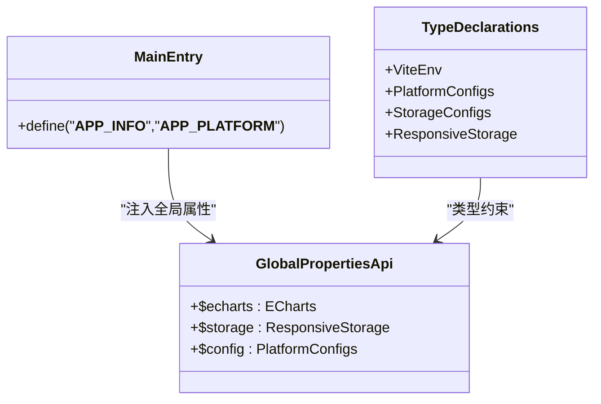

图表来源
- [global.d.ts:114-179](file://client/web/src/types/global.d.ts#L114-L179)
- [main.ts:62-66](file://client/web/src/main.ts#L62-L66)

章节来源
- [global.d.ts:1-182](file://client/web/src/types/global.d.ts#L1-L182)
- [main.ts:1-63](file://client/web/src/main.ts#L1-L63)

## 依赖关系分析
- 入口依赖：main.ts 依赖插件、路由、状态、国际化、ECharts、Motion 与平台配置加载。
- 插件依赖：i18n.ts 依赖 vue-i18n 与 Vant 语言包；echarts.ts 依赖 ECharts 核心与渲染器/组件；plugin.js 依赖 dayjs 与上传工具。
- 构建依赖：vite.config.ts 依赖 buildconfig/plugins.ts 与环境变量；plugins.ts 依赖各类 Vite 插件。
- 类型依赖：global.d.ts 为入口与工具模块提供类型支撑。

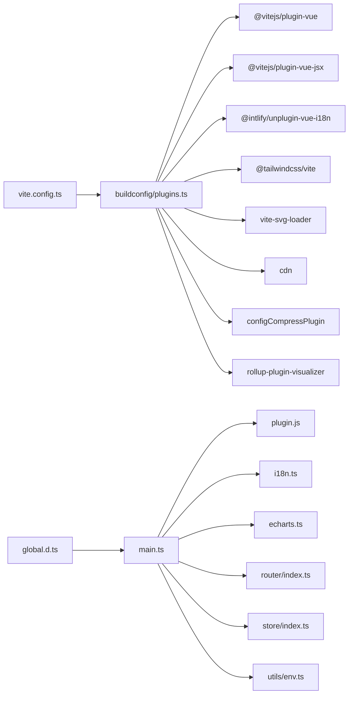

图表来源
- [main.ts:1-63](file://client/web/src/main.ts#L1-L63)
- [plugins.ts:1-59](file://client/web/buildconfig/plugins.ts#L1-L59)
- [global.d.ts:1-182](file://client/web/src/types/global.d.ts#L1-L182)

章节来源
- [main.ts:1-63](file://client/web/src/main.ts#L1-L63)
- [plugins.ts:1-59](file://client/web/buildconfig/plugins.ts#L1-L59)
- [global.d.ts:1-182](file://client/web/src/types/global.d.ts#L1-L182)

## 性能考量
- 依赖预优化：optimizeDeps.include/exclude 显著缩短冷启动时间。
- 按需引入：Vant 与 ECharts 均采用按需引入，减少打包体积。
- 图片懒加载：Lazyload 与懒组件提升长列表与首屏性能。
- 构建分析：打包可视化工具辅助识别大体积模块与依赖。
- CDN与压缩：可选CDN与多种压缩格式，平衡加载速度与带宽成本。

章节来源
- [vite.config.ts:37-61](file://client/web/vite.config.ts#L37-L61)
- [plugins.ts:16-58](file://client/web/buildconfig/plugins.ts#L16-L58)
- [main.ts:38-40](file://client/web/src/main.ts#L38-L40)

## 故障排查指南
- 平台配置缺失：若 public/platform-config.json 不存在，将抛出错误提示，请补齐该文件。
- 国际化键缺失：transformI18n 会回退原键，建议在 locales 与 Vant 语言包中补充缺失键值。
- 路由白名单：未登录用户访问受保护路由会被重定向至登录页，确认白名单配置与鉴权逻辑。
- 插件注册顺序：确保在 getPlatformConfig 成功后再注册 i18n、ECharts、Motion 等插件，避免运行时异常。

章节来源
- [utils/env.ts:47-49](file://client/web/src/utils/env.ts#L47-L49)
- [i18n.ts:77-99](file://client/web/src/plugin/i18n.ts#L77-L99)
- [router/index.ts:39-59](file://client/web/src/router/index.ts#L39-L59)
- [main.ts:54-60](file://client/web/src/main.ts#L54-L60)

## 结论
Hoper Vue3 Web应用通过清晰的初始化流程、按需引入的UI与图表库、完善的平台配置加载与国际化机制，以及可扩展的插件体系，实现了高性能、可维护与可扩展的前端架构。遵循本文档的最佳实践，可在保证开发体验的同时，持续优化应用性能与用户体验。

## 附录
- 环境变量与构建：参考 vite.config.ts 与 buildconfig/plugins.ts 的配置项与插件清单。
- 类型声明：参考 global.d.ts 的全局类型与接口定义。
- 依赖清单：参考 package.json 的运行时与开发时依赖。

章节来源
- [vite.config.ts:1-69](file://client/web/vite.config.ts#L1-L69)
- [plugins.ts:1-59](file://client/web/buildconfig/plugins.ts#L1-L59)
- [global.d.ts:1-182](file://client/web/src/types/global.d.ts#L1-L182)
- [package.json:1-95](file://client/web/package.json#L1-L95)
- [tsconfig.json:1-12](file://client/web/tsconfig.json#L1-L12)