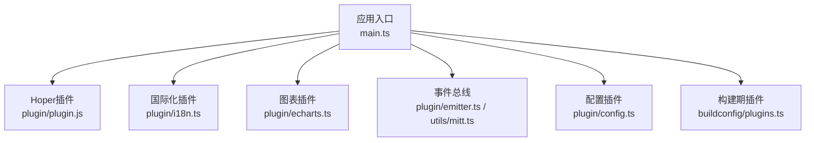
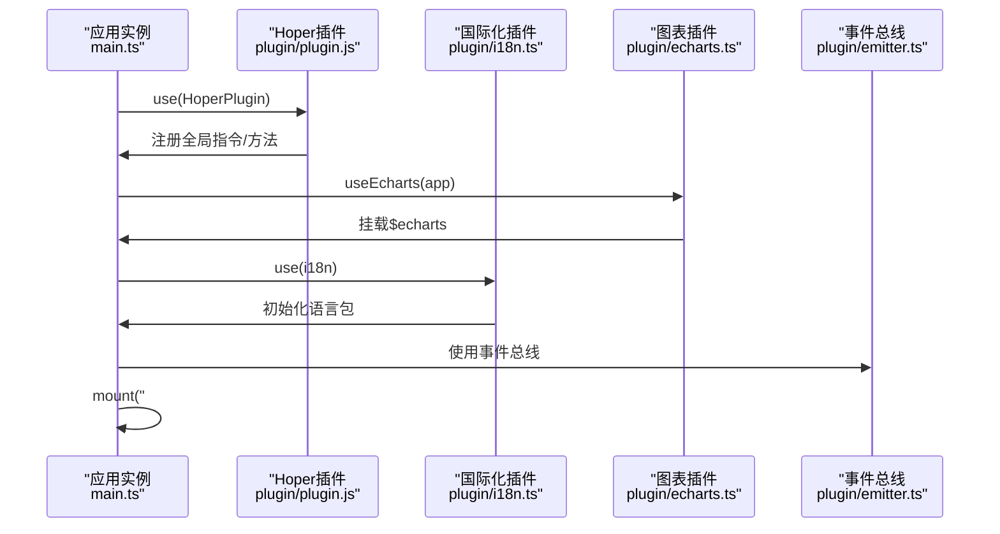
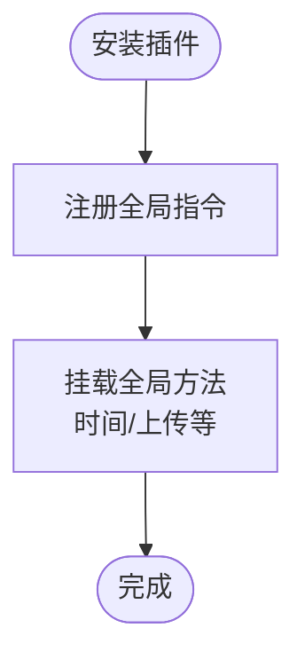
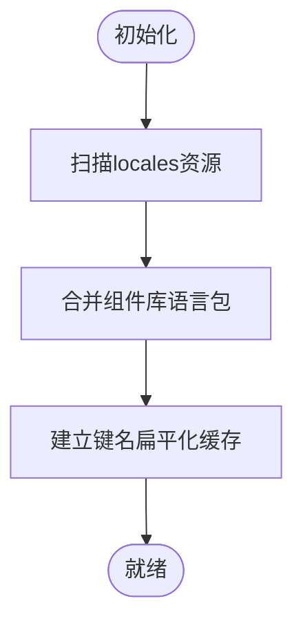
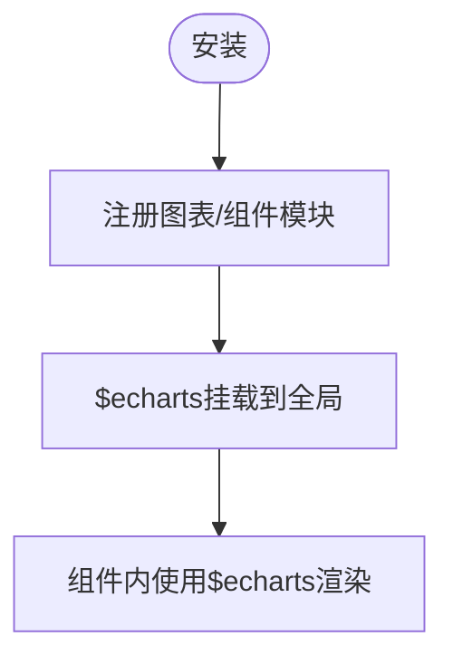
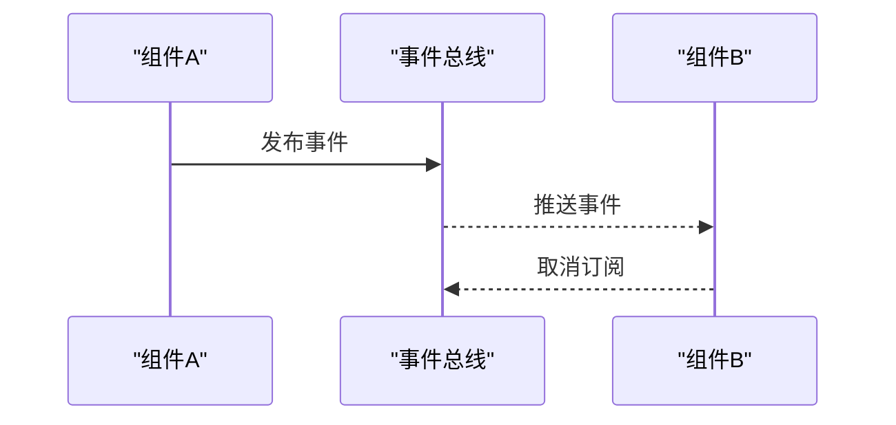
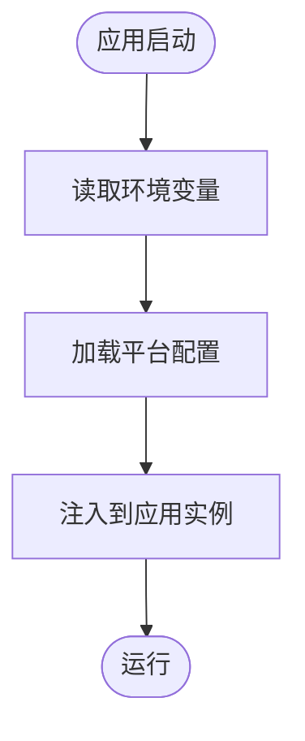
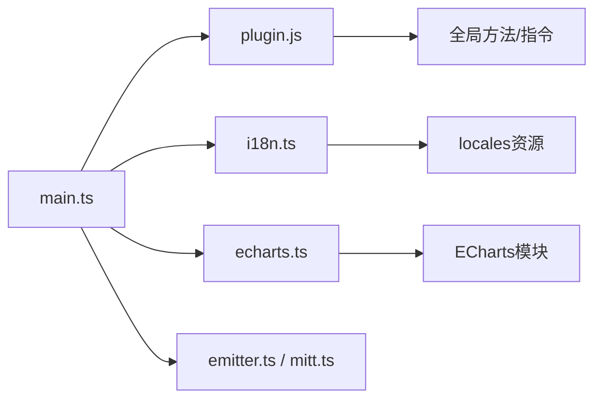

# 插件系统

<cite>
**本文引用的文件**
- [main.ts](file://client/web/src/main.ts)
- [plugin.js](file://client/web/src/plugin/plugin.js)
- [plugin.d.ts](file://client/web/src/plugin/plugin.d.ts)
- [i18n.ts](file://client/web/src/plugin/i18n.ts)
- [echarts.ts](file://client/web/src/plugin/echarts.ts)
- [emitter.ts](file://client/web/src/plugin/emitter.ts)
- [mitt.ts](file://client/web/src/utils/mitt.ts)
- [event.ts](file://client/web/src/utils/service/event.ts)
- [plugins.ts](file://client/web/buildconfig/plugins.ts)
- [config.ts](file://client/web/src/plugin/config.ts)
- [global_config.go](file://thirdparty/initialize/global_config.go)
- [inject.go](file://thirdparty/initialize/inject.go)
- [08.全面的注入conf&dao.md](file://thirdparty/cherry/_readme/08.全面的注入conf&dao.md)
</cite>

## 目录
1. [引言](#引言)
2. [项目结构](#项目结构)
3. [核心组件](#核心组件)
4. [架构总览](#架构总览)
5. [详细组件分析](#详细组件分析)
6. [依赖分析](#依赖分析)
7. [性能考量](#性能考量)
8. [故障排查指南](#故障排查指南)
9. [结论](#结论)
10. [附录](#附录)

## 引言
本文件面向Hoper Vue3前端插件系统，系统性阐述插件的开发模式、注册机制与生命周期管理；详解自定义插件的实现、配置管理与依赖注入；并给出事件总线、配置中心与国际化插件的设计思路与最佳实践。同时提供插件开发规范、测试策略与发布流程建议，帮助团队在保持一致性的同时实现高扩展性与可维护性。

## 项目结构
Hoper前端采用Vite+Vue3技术栈，插件体系围绕应用实例的use注册机制组织，核心插件包括：
- Hoper插件：提供全局指令与全局方法（如日期格式化、上传封装等）
- 国际化插件：基于vue-i18n，整合组件库与项目本地化资源
- 图表插件：按需注册ECharts图表与组件，统一挂载到全局属性
- 事件总线：基于mitt的轻量事件通道，支持强类型事件定义
- 配置插件：提供运行时环境变量访问与平台配置加载

**图示来源**
- [main.ts:16-60](file://client/web/src/main.ts#L16-L60)
- [plugin.js:8-38](file://client/web/src/plugin/plugin.js#L8-L38)
- [i18n.ts:104-115](file://client/web/src/plugin/i18n.ts#L104-L115)
- [echarts.ts:40-44](file://client/web/src/plugin/echarts.ts#L40-L44)
- [emitter.ts:1-4](file://client/web/src/plugin/emitter.ts#L1-L4)
- [mitt.ts:1-13](file://client/web/src/utils/mitt.ts#L1-L13)
- [config.ts:1-6](file://client/web/src/plugin/config.ts#L1-L6)
- [plugins.ts:16-58](file://client/web/buildconfig/plugins.ts#L16-L58)

**章节来源**
- [main.ts:1-63](file://client/web/src/main.ts#L1-L63)
- [plugins.ts:16-58](file://client/web/buildconfig/plugins.ts#L16-L58)

## 核心组件
- Hoper插件（全局指令与全局方法）
  - 提供日期格式化指令与全局时间处理方法
  - 提供统一上传封装，简化业务调用
- 国际化插件（vue-i18n）
  - 自动扫描本地locales资源，合并组件库语言包
  - 支持动态键名转换与回退语言
- 图表插件（ECharts）
  - 按需注册常用图表与组件，统一挂载到全局属性
- 事件总线（mitt）
  - 提供弱耦合通信通道，支持强类型事件定义
- 配置插件（环境变量与平台配置）
  - 统一导出静态资源目录、API主机、平台标识等
  - 应用启动时异步加载平台配置并注入

**章节来源**
- [plugin.js:8-38](file://client/web/src/plugin/plugin.js#L8-L38)
- [i18n.ts:12-115](file://client/web/src/plugin/i18n.ts#L12-L115)
- [echarts.ts:19-44](file://client/web/src/plugin/echarts.ts#L19-L44)
- [emitter.ts:1-4](file://client/web/src/plugin/emitter.ts#L1-L4)
- [mitt.ts:4-11](file://client/web/src/utils/mitt.ts#L4-L11)
- [config.ts:1-6](file://client/web/src/plugin/config.ts#L1-L6)

## 架构总览
Hoper插件系统以“应用实例.use(...)”为核心注册入口，通过插件导出的install函数完成：
- 全局指令注册
- 全局方法挂载
- 第三方库初始化与全局属性注入
- 事件总线与国际化等子系统的集成

**图示来源**
- [main.ts:16-60](file://client/web/src/main.ts#L16-L60)
- [plugin.js:8-38](file://client/web/src/plugin/plugin.js#L8-L38)
- [echarts.ts:40-42](file://client/web/src/plugin/echarts.ts#L40-L42)
- [i18n.ts:104-115](file://client/web/src/plugin/i18n.ts#L104-L115)
- [emitter.ts:1-4](file://client/web/src/plugin/emitter.ts#L1-L4)

## 详细组件分析

### Hoper插件（全局指令与全局方法）
- 设计要点
  - 通过install钩子向应用注入全局指令与全局方法
  - 指令用于视图层快速格式化显示
  - 全局方法用于统一处理时间与上传等常见场景
- 生命周期
  - 安装阶段：注册指令与方法
  - 运行阶段：由组件直接调用
- 复杂度与性能
  - 指令与方法均为轻量逻辑，对性能影响可忽略
- 错误处理
  - 对外部输入进行格式校验，避免异常传播至视图层

**图示来源**
- [plugin.js:8-38](file://client/web/src/plugin/plugin.js#L8-L38)

**章节来源**
- [plugin.js:8-38](file://client/web/src/plugin/plugin.js#L8-L38)
- [plugin.d.ts:3-13](file://client/web/src/plugin/plugin.d.ts#L3-L13)

### 国际化插件（vue-i18n）
- 设计要点
  - 自动扫描locales目录下的YAML/JSON资源
  - 合并组件库语言包，保证UI文案一致
  - 提供transformI18n与$t/$tr等工具函数
- 生命周期
  - 初始化阶段：读取本地存储的语言偏好，设置locale/fallbackLocale/messages
  - 运行阶段：组件内通过$t或i18n.global.t进行翻译
- 复杂度与性能
  - 采用扁平化键缓存，减少递归遍历开销
- 错误处理
  - 未命中键时回退原文，避免渲染异常

**图示来源**
- [i18n.ts:12-115](file://client/web/src/plugin/i18n.ts#L12-L115)

**章节来源**
- [i18n.ts:12-115](file://client/web/src/plugin/i18n.ts#L12-L115)

### 图表插件（ECharts）
- 设计要点
  - 按需引入常用图表与组件，避免全量打包
  - 将echarts实例挂载到全局属性，便于各组件直接使用
- 生命周期
  - 安装阶段：注册所需模块
  - 运行阶段：通过$echarts进行图表渲染
- 复杂度与性能
  - 模块按需引入，减小首屏体积
- 错误处理
  - 无特殊错误处理逻辑，确保渲染失败时能捕获并上报

**图示来源**
- [echarts.ts:19-44](file://client/web/src/plugin/echarts.ts#L19-L44)

**章节来源**
- [echarts.ts:19-44](file://client/web/src/plugin/echarts.ts#L19-L44)

### 事件总线（mitt）
- 设计要点
  - 提供全局事件通道，支持跨组件解耦通信
  - 在utils中定义强类型事件映射，提升开发体验
- 生命周期
  - 应用启动时即可用，贯穿整个应用生命周期
- 复错处理
  - 事件订阅/取消需成对管理，避免内存泄漏

**图示来源**
- [emitter.ts:1-4](file://client/web/src/plugin/emitter.ts#L1-L4)
- [mitt.ts:4-11](file://client/web/src/utils/mitt.ts#L4-L11)

**章节来源**
- [emitter.ts:1-4](file://client/web/src/plugin/emitter.ts#L1-L4)
- [mitt.ts:1-13](file://client/web/src/utils/mitt.ts#L1-L13)

### 配置插件（环境变量与平台配置）
- 设计要点
  - 统一导出静态资源目录、API主机、平台标识等
  - 应用启动时异步加载平台配置，确保运行时参数可用
- 生命周期
  - 启动前：读取环境变量
  - 启动中：加载平台配置并注入
  - 运行中：全局可访问
- 复杂度与性能
  - 配置读取为常量时间，对性能影响可忽略

**图示来源**
- [config.ts:1-6](file://client/web/src/plugin/config.ts#L1-L6)
- [main.ts:54-60](file://client/web/src/main.ts#L54-L60)

**章节来源**
- [config.ts:1-6](file://client/web/src/plugin/config.ts#L1-L6)
- [main.ts:54-60](file://client/web/src/main.ts#L54-L60)

### 构建期插件（Vite）
- 设计要点
  - 集成vue、jsx、i18n资源扫描、svg组件化、CDN、压缩、打包分析等
  - 通过条件开关控制不同环境下的插件启用
- 生命周期
  - 构建阶段：按需启用对应插件
- 复杂度与性能
  - 插件数量较多，需关注构建时间与产物体积

**章节来源**
- [plugins.ts:16-58](file://client/web/buildconfig/plugins.ts#L16-L58)

## 依赖分析
- 组件耦合
  - Hoper插件与应用实例强耦合，负责注入全局能力
  - 国际化与图表插件均依赖第三方库，需注意版本兼容
  - 事件总线独立于业务，但被广泛使用
- 外部依赖
  - dayjs、mitt、echarts、vue-i18n等
- 循环依赖
  - 插件间无直接循环依赖，通过应用实例间接协作

**图示来源**
- [main.ts:16-60](file://client/web/src/main.ts#L16-L60)
- [i18n.ts:12-115](file://client/web/src/plugin/i18n.ts#L12-L115)
- [echarts.ts:19-44](file://client/web/src/plugin/echarts.ts#L19-L44)
- [emitter.ts:1-4](file://client/web/src/plugin/emitter.ts#L1-L4)
- [mitt.ts:1-13](file://client/web/src/utils/mitt.ts#L1-L13)

**章节来源**
- [main.ts:16-60](file://client/web/src/main.ts#L16-L60)

## 性能考量
- 按需引入
  - 图表插件按需注册模块，降低首屏体积
  - 国际化资源按需扫描，避免全量加载
- 全局方法与指令
  - 保持轻量实现，避免在渲染热路径中执行重计算
- 事件总线
  - 控制事件粒度与频率，避免高频事件造成卡顿
- 构建优化
  - 合理启用CDN与压缩插件，结合打包分析持续优化

## 故障排查指南
- 国际化不生效
  - 检查locales资源命名与路径是否正确
  - 确认transformI18n使用的键是否存在
- 图表渲染异常
  - 确认$echarts是否已挂载到全局
  - 检查容器尺寸与初始化时机
- 事件总线无效
  - 确认事件名称拼写与订阅/发布是否成对
  - 检查事件类型定义是否一致
- 上传功能异常
  - 检查全局上传方法参数与回调触发时机
- 配置未生效
  - 确认环境变量与平台配置加载顺序
  - 检查配置项命名与类型

**章节来源**
- [i18n.ts:77-99](file://client/web/src/plugin/i18n.ts#L77-L99)
- [echarts.ts:40-42](file://client/web/src/plugin/echarts.ts#L40-L42)
- [mitt.ts:4-11](file://client/web/src/utils/mitt.ts#L4-L11)
- [plugin.js:21-36](file://client/web/src/plugin/plugin.js#L21-L36)
- [config.ts:1-6](file://client/web/src/plugin/config.ts#L1-L6)

## 结论
Hoper Vue3插件系统以“应用实例.use(...)”为核心，围绕全局指令/方法、国际化、图表、事件总线与配置五大能力构建。通过按需引入与强类型约束，既保证了扩展性，又兼顾了性能与可维护性。建议在后续实践中进一步完善插件间通信协议与生命周期钩子，以支撑更复杂的业务场景。

## 附录

### 插件开发规范
- 插件命名与导出
  - 插件类或模块需提供install(app)方法
  - 若为组件型插件，建议提供静态name与install
- 全局能力
  - 仅在install阶段注入全局指令/方法/属性
  - 避免在install外修改全局状态
- 类型安全
  - 为事件总线定义明确的事件类型
  - 为全局属性提供类型声明
- 文档与示例
  - 每个插件提供简要使用说明与示例

**章节来源**
- [plugin.d.ts:3-13](file://client/web/src/plugin/plugin.d.ts#L3-L13)
- [mitt.ts:4-11](file://client/web/src/utils/mitt.ts#L4-L11)

### 测试策略
- 单元测试
  - 对全局方法与指令进行行为验证
  - 对国际化键值转换函数进行边界测试
- 集成测试
  - 在应用实例中集成插件，验证生命周期与依赖关系
  - 验证事件总线在组件间的通信效果
- 性能测试
  - 构建前后对比体积与首屏渲染时间
  - 高频事件与图表渲染的稳定性测试

### 发布流程
- 版本管理
  - 遵循语义化版本，变更记录清晰
- 构建与校验
  - 在CI中执行构建、测试与打包分析
- 文档更新
  - 更新插件使用说明与变更日志
- 回滚预案
  - 保留上一版本产物，确保可快速回滚

### 依赖注入与配置中心（Go侧参考）
- 依赖注入
  - 通过反射与接口约定实现配置与DAO的自动注入
  - 支持AfterInject钩子与延迟清理
- 配置中心
  - 可插拔的配置中心注册机制，支持本地文件与远端中心
  - 支持跳过特定DAO注入与根配置回调

**章节来源**
- [global_config.go:63-106](file://thirdparty/initialize/global_config.go#L63-L106)
- [inject.go:211-290](file://thirdparty/initialize/inject.go#L211-L290)
- [08.全面的注入conf&dao.md:97-266](file://thirdparty/cherry/_readme/08.全面的注入conf&dao.md#L97-L266)