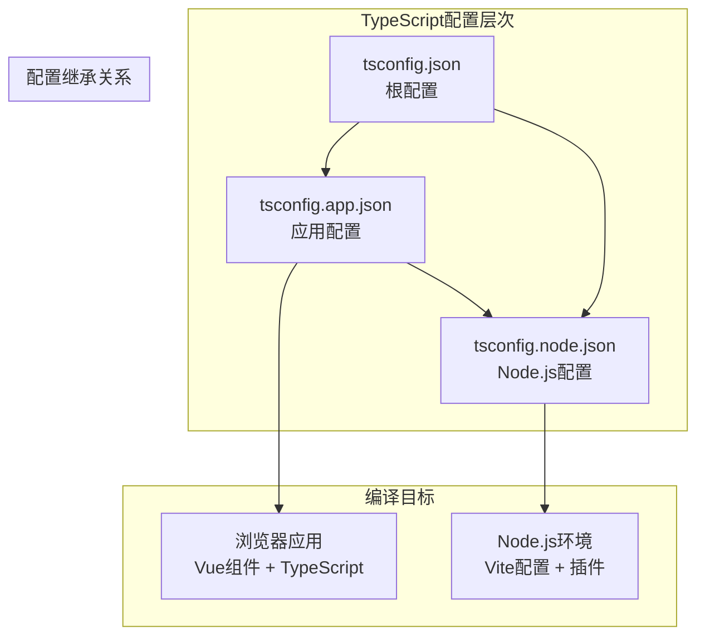
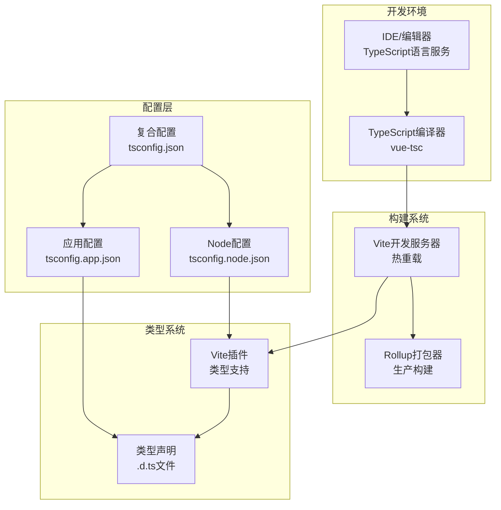
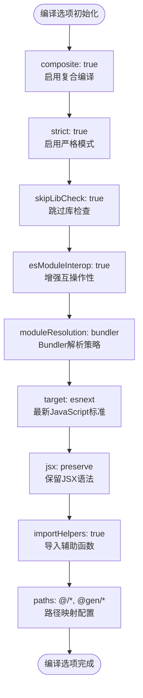
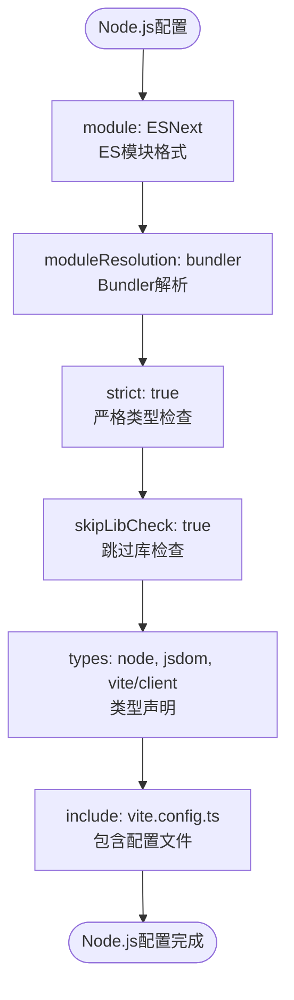
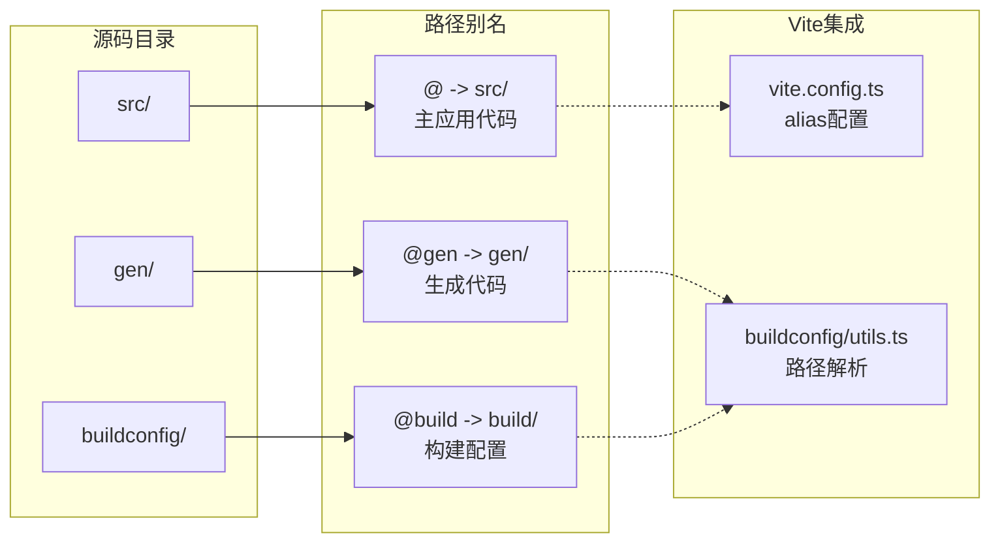
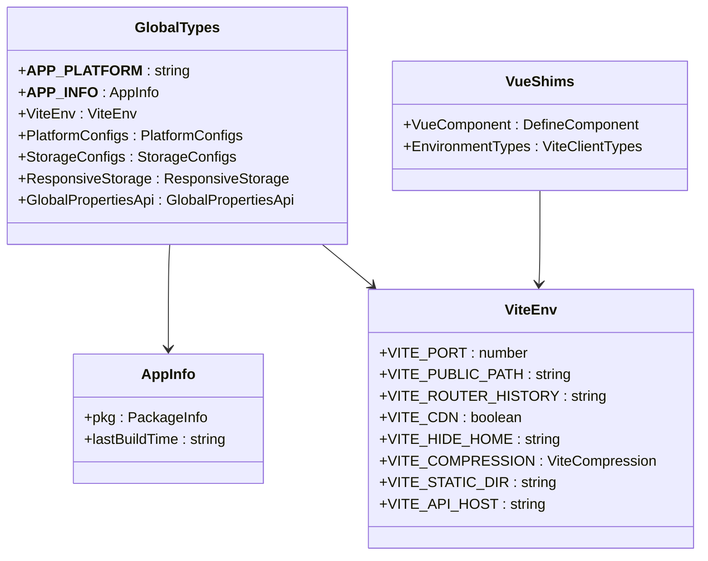
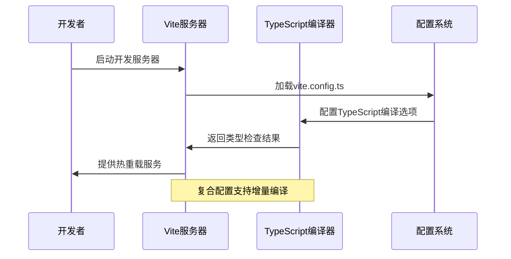
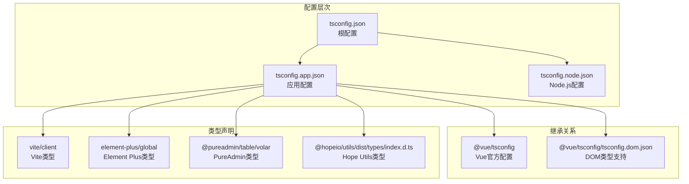

# TypeScript配置

<cite>
**本文档引用的文件**
- [tsconfig.app.json](file://client/web/tsconfig.app.json)
- [tsconfig.json](file://client/web/tsconfig.json)
- [tsconfig.node.json](file://client/web/tsconfig.node.json)
- [vite.config.ts](file://client/web/vite.config.ts)
- [utils.ts](file://client/web/buildconfig/utils.ts)
- [optimize.ts](file://client/web/buildconfig/optimize.ts)
- [plugins.ts](file://client/web/buildconfig/plugins.ts)
- [components.d.ts](file://client/web/components.d.ts)
- [volar.config.js](file://client/web/volar.config.js)
- [global.d.ts](file://client/web/src/types/global.d.ts)
- [shims-vue.d.ts](file://client/web/src/types/shims-vue.d.ts)
- [env.d.ts](file://client/web/src/types/env.d.ts)
- [package.json](file://client/web/package.json)
</cite>

## 目录
1. [简介](#简介)
2. [项目结构](#项目结构)
3. [核心组件](#核心组件)
4. [架构概览](#架构概览)
5. [详细组件分析](#详细组件分析)
6. [依赖关系分析](#依赖关系分析)
7. [性能考虑](#性能考虑)
8. [故障排除指南](#故障排除指南)
9. [结论](#结论)

## 简介

本文档深入解析Hoper Vue3项目的TypeScript配置体系，涵盖应用配置、根配置和Node.js配置三个层面。该配置体系采用Vue官方推荐的复合配置模式，结合Vite构建工具实现了现代化的TypeScript开发体验。配置重点包括模块解析策略、路径映射、类型检查规则以及与Vite的深度集成。

## 项目结构

Hoper Vue3项目的TypeScript配置采用三层复合结构，通过引用关系实现配置继承和共享：

**图表来源**
- [tsconfig.json:1-12](file://client/web/tsconfig.json#L1-L12)
- [tsconfig.app.json:1-46](file://client/web/tsconfig.app.json#L1-L46)
- [tsconfig.node.json:1-13](file://client/web/tsconfig.node.json#L1-L13)

**章节来源**
- [tsconfig.json:1-12](file://client/web/tsconfig.json#L1-L12)
- [tsconfig.app.json:1-46](file://client/web/tsconfig.app.json#L1-L46)
- [tsconfig.node.json:1-13](file://client/web/tsconfig.node.json#L1-L13)

## 核心组件

### 应用配置 (tsconfig.app.json)

应用配置是整个TypeScript配置的核心，负责浏览器端Vue应用的编译设置：

**主要特性：**
- **复合编译**：启用composite模式支持增量编译
- **路径映射**：配置@和@gen别名指向src和gen目录
- **严格模式**：启用严格类型检查
- **模块解析**：使用bundler解析策略支持现代模块系统
- **装饰器支持**：启用实验性装饰器功能

**关键编译选项：**
- `target`: esnext - 最新JavaScript标准
- `module`: esnext - 现代模块格式
- `strict`: true - 启用所有严格检查
- `skipLibCheck`: true - 跳过库文件类型检查
- `esModuleInterop`: true - 增强ES模块互操作性

**章节来源**
- [tsconfig.app.json:9-44](file://client/web/tsconfig.app.json#L9-L44)

### 根配置 (tsconfig.json)

根配置作为复合配置的入口点，协调应用配置和Node.js配置：

**核心功能：**
- **引用管理**：通过references字段管理配置依赖关系
- **复合配置**：支持多配置文件协同工作
- **文件组织**：避免重复配置，保持配置一致性

**配置结构：**
- 引用应用配置：`"./tsconfig.app.json"`
- 引用Node.js配置：`"./tsconfig.node.json"`

**章节来源**
- [tsconfig.json:1-12](file://client/web/tsconfig.json#L1-L12)

### Node.js配置 (tsconfig.node.json)

Node.js配置专门处理Vite构建工具和开发服务器的TypeScript需求：

**专用功能：**
- **开发工具支持**：支持Vite配置文件的TypeScript编译
- **类型声明**：包含Node.js和Vite客户端类型
- **模块解析**：针对Node.js环境优化模块解析

**关键类型：**
- `node`: Node.js全局类型
- `jsdom`: 浏览器DOM类型
- `vite/client`: Vite客户端类型

**章节来源**
- [tsconfig.node.json:1-13](file://client/web/tsconfig.node.json#L1-L13)

## 架构概览

TypeScript配置与Vite构建系统的集成架构体现了现代化前端开发的最佳实践：

**图表来源**
- [vite.config.ts:14-68](file://client/web/vite.config.ts#L14-L68)
- [tsconfig.app.json:1-46](file://client/web/tsconfig.app.json#L1-L46)
- [tsconfig.node.json:1-13](file://client/web/tsconfig.node.json#L1-L13)

## 详细组件分析

### 编译选项详解

#### 应用配置编译选项

应用配置采用了平衡严格性和开发效率的编译策略：

**图表来源**
- [tsconfig.app.json:9-44](file://client/web/tsconfig.app.json#L9-L44)

#### Node.js配置编译选项

Node.js配置专注于开发环境的类型支持：

**图表来源**
- [tsconfig.node.json:2-12](file://client/web/tsconfig.node.json#L2-L12)

**章节来源**
- [tsconfig.app.json:9-44](file://client/web/tsconfig.app.json#L9-L44)
- [tsconfig.node.json:2-12](file://client/web/tsconfig.node.json#L2-L12)

### 路径映射与模块解析

#### 路径映射策略

项目采用统一的路径映射策略，确保代码的一致性和可维护性：

**图表来源**
- [tsconfig.app.json:13-16](file://client/web/tsconfig.app.json#L13-L16)
- [utils.ts:32-37](file://client/web/buildconfig/utils.ts#L32-L37)

#### 模块解析策略

项目采用现代的模块解析策略，支持多种模块格式：

**模块解析流程：**
1. **路径映射检查**：优先检查tsconfig中的路径映射
2. **Node解析**：遵循Node.js模块解析规则
3. **Bundler解析**：支持现代打包器的解析策略
4. **类型声明解析**：处理.d.ts文件和类型声明

**章节来源**
- [tsconfig.app.json:13-16](file://client/web/tsconfig.app.json#L13-L16)
- [utils.ts:32-37](file://client/web/buildconfig/utils.ts#L32-L37)

### 类型声明系统

#### 全局类型声明

项目建立了完善的全局类型声明体系：

**图表来源**
- [global.d.ts:7-181](file://client/web/src/types/global.d.ts#L7-L181)
- [shims-vue.d.ts:1-5](file://client/web/src/types/shims-vue.d.ts#L1-L5)

#### 组件类型声明

项目使用unplugin-vue-components自动生成组件类型声明：

**组件类型生成流程：**
1. **组件扫描**：自动扫描项目中的Vue组件
2. **类型提取**：从组件导出类型中提取接口
3. **声明生成**：生成对应的TypeScript声明文件
4. **类型集成**：与Vue类型系统无缝集成

**章节来源**
- [global.d.ts:7-181](file://client/web/src/types/global.d.ts#L7-L181)
- [components.d.ts:1-38](file://client/web/components.d.ts#L1-L38)
- [shims-vue.d.ts:1-5](file://client/web/src/types/shims-vue.d.ts#L1-L5)

### Vite集成最佳实践

#### 构建配置集成

Vite配置与TypeScript配置深度集成，实现了高效的开发体验：

**图表来源**
- [vite.config.ts:14-68](file://client/web/vite.config.ts#L14-L68)
- [tsconfig.app.json:10](file://client/web/tsconfig.app.json#L10)

#### 依赖预构建优化

项目通过optimizeDeps配置优化TypeScript依赖的预构建：

**预构建策略：**
- **包含列表**：预构建常用依赖如axios、vue-i18n等
- **排除策略**：排除图标库等按需引入的模块
- **缓存机制**：利用Vite的依赖缓存提高启动速度

**章节来源**
- [vite.config.ts:14-68](file://client/web/vite.config.ts#L14-L68)
- [optimize.ts:7-24](file://client/web/buildconfig/optimize.ts#L7-L24)

## 依赖关系分析

### 配置依赖图

TypeScript配置之间的依赖关系体现了清晰的层次结构：

**图表来源**
- [tsconfig.json:3-10](file://client/web/tsconfig.json#L3-L10)
- [tsconfig.app.json:2-36](file://client/web/tsconfig.app.json#L2-L36)

### 依赖管理策略

项目采用多层次的依赖管理策略：

**开发依赖层次：**
1. **核心框架**：Vue 3、TypeScript、Vite
2. **UI组件**：Element Plus、Vant
3. **工具库**：@vueuse、axios、pinia
4. **构建工具**：各种Vite插件和TypeScript相关工具

**类型安全保证：**
- 严格的类型检查规则
- 完整的类型声明覆盖
- 自动化的类型生成
- 编译时错误检测

**章节来源**
- [package.json:25-89](file://client/web/package.json#L25-L89)
- [tsconfig.app.json:30-36](file://client/web/tsconfig.app.json#L30-L36)

## 性能考虑

### 编译性能优化

项目在多个层面实现了TypeScript编译性能优化：

**复合编译优化：**
- 启用composite模式支持增量编译
- 分离应用配置和Node.js配置减少编译负担
- 使用references实现配置复用

**模块解析优化：**
- 路径映射减少模块解析开销
- bundler模块解析策略提高解析效率
- 类型声明预编译减少运行时开销

**开发体验优化：**
- 依赖预构建减少首次启动时间
- 热重载配合TypeScript增量编译
- 智能类型检查避免全量重编译

### 构建性能优化

**生产构建优化：**
- 按需加载和代码分割
- 资源压缩和优化
- 缓存策略优化

**开发构建优化：**
- 增量编译支持
- 模块热替换
- 类型检查分离

## 故障排除指南

### 常见配置问题

#### 类型检查失败

**问题症状：**
- 编译时报类型错误
- IDE中出现类型警告

**解决方案：**
1. 检查tsconfig.app.json中的strict设置
2. 验证类型声明文件的完整性
3. 确认模块解析路径正确

#### 模块解析错误

**问题症状：**
- 导入模块时报错
- 路径别名无法解析

**解决方案：**
1. 验证tsconfig.json中的路径映射
2. 检查vite.config.ts中的alias配置
3. 确认文件路径大小写

#### Vite集成问题

**问题症状：**
- 开发服务器启动失败
- 热重载功能异常

**解决方案：**
1. 检查vite.config.ts的配置语法
2. 验证TypeScript配置与Vite的兼容性
3. 确认插件配置正确

### 类型错误诊断

#### 编译时错误

**诊断步骤：**
1. 查看具体的错误信息和行号
2. 检查相关类型的定义
3. 验证导入导出的正确性

#### 运行时类型错误

**预防措施：**
1. 启用严格的类型检查
2. 使用TypeScript进行静态分析
3. 定期更新类型声明文件

**章节来源**
- [tsconfig.app.json:19](file://client/web/tsconfig.app.json#L19)
- [tsconfig.app.json:24](file://client/web/tsconfig.app.json#L24)

## 结论

Hoper Vue3项目的TypeScript配置展现了现代前端开发的最佳实践。通过采用复合配置模式、精心设计的路径映射策略、完善的类型声明体系以及与Vite的深度集成，项目实现了高效、可靠的TypeScript开发体验。

**关键优势：**
- **模块化配置**：清晰的配置层次结构便于维护
- **类型安全**：完整的类型声明覆盖确保代码质量
- **开发效率**：优化的编译和构建流程提升开发体验
- **扩展性**：灵活的配置体系支持项目规模增长

**未来改进方向：**
- 持续优化编译性能
- 扩展类型声明覆盖范围
- 改进开发工具集成
- 增强类型检查的准确性

这套TypeScript配置体系为Vue3项目提供了坚实的技术基础，为后续的功能开发和维护奠定了良好的技术条件。