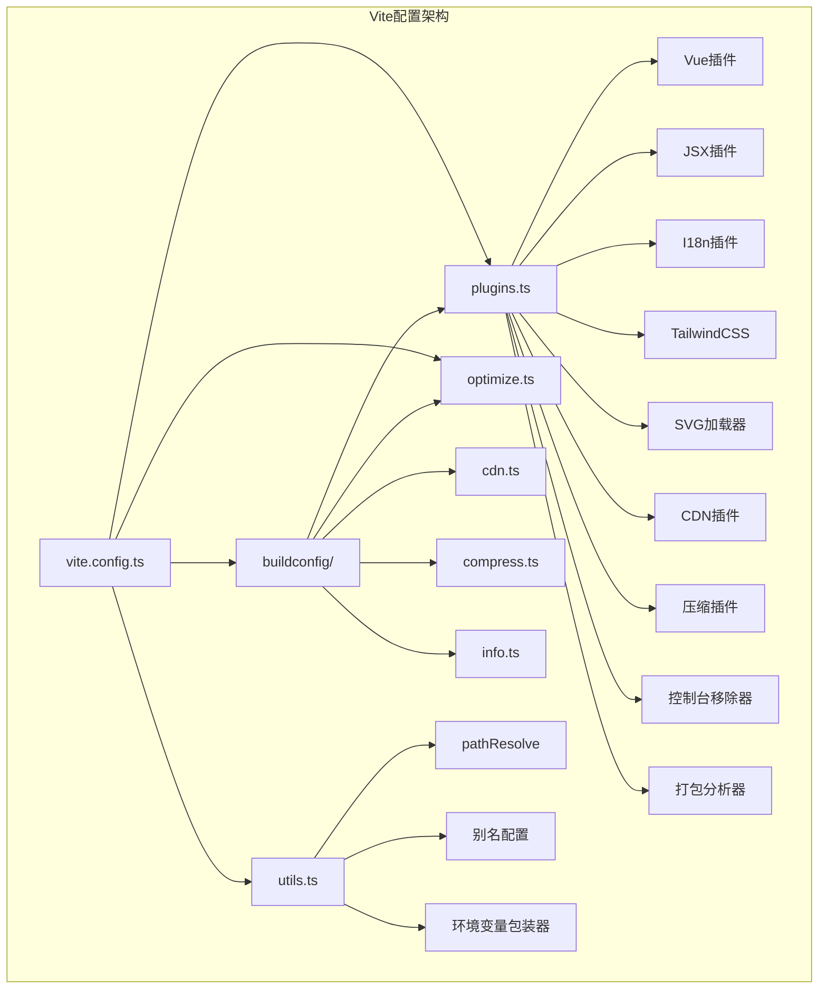
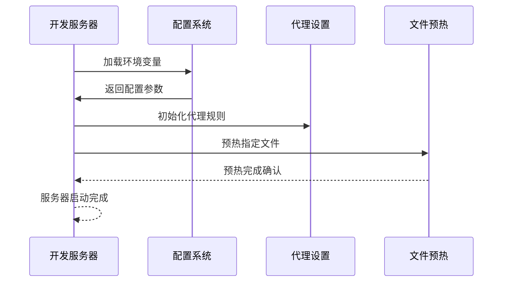
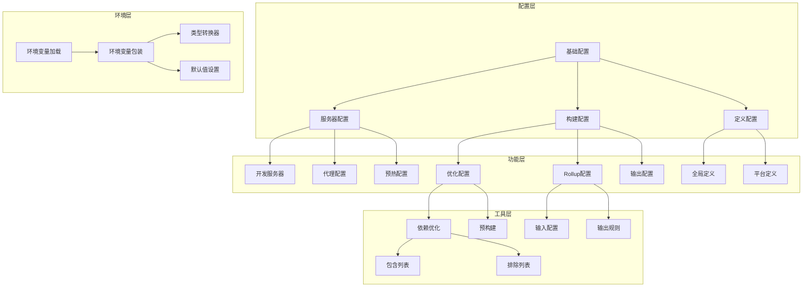
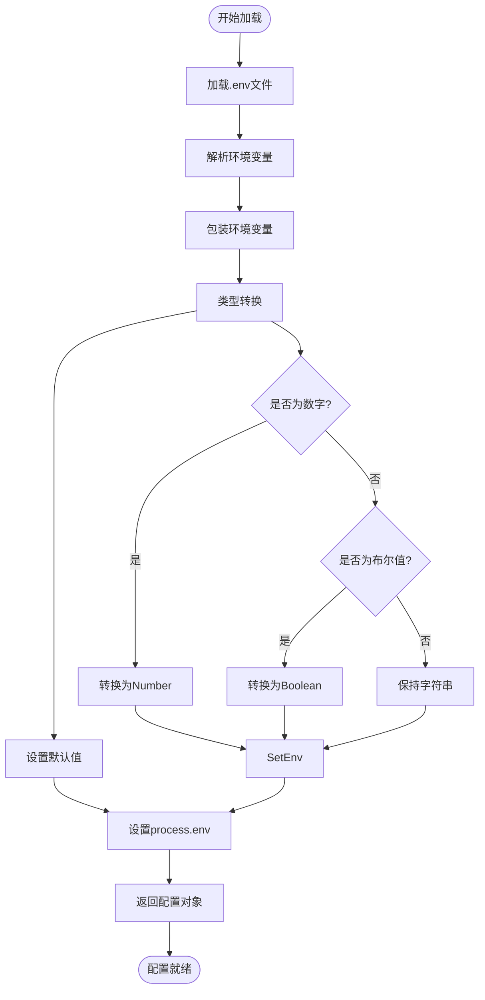
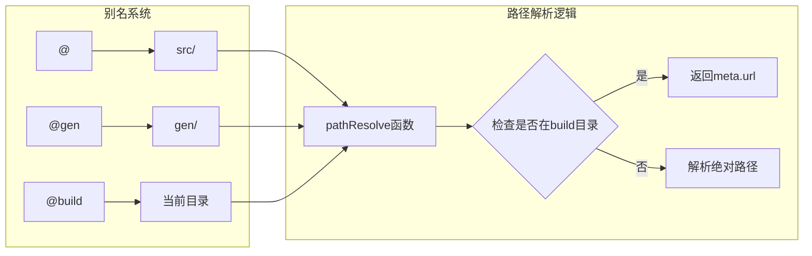
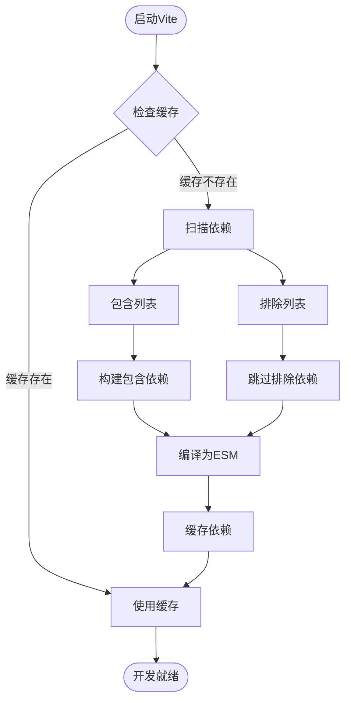
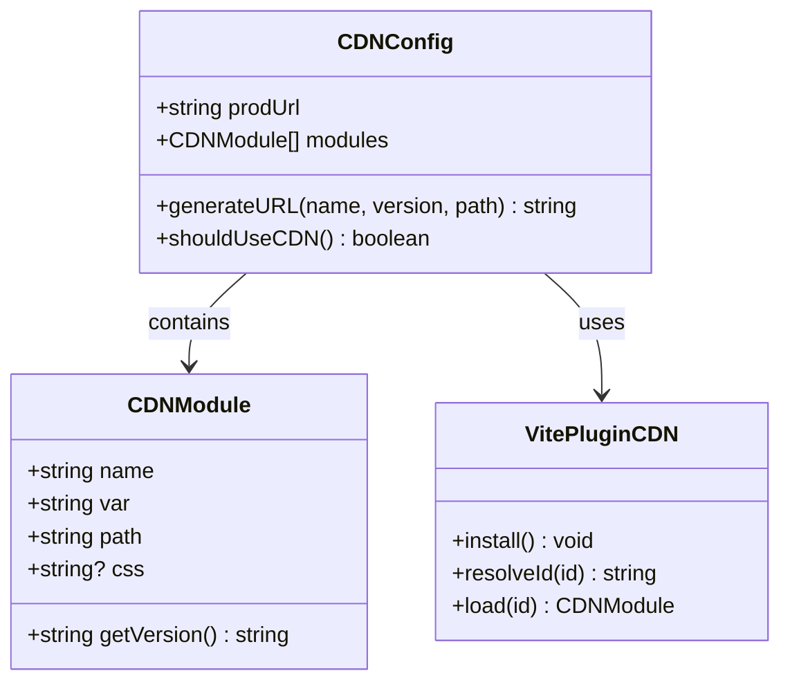
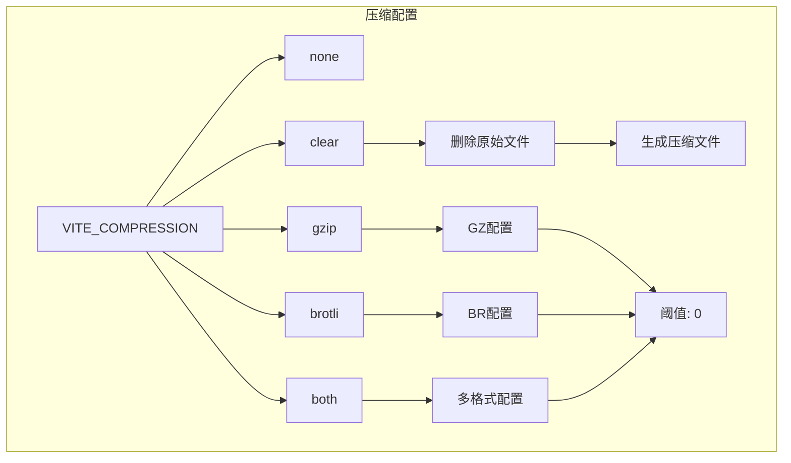
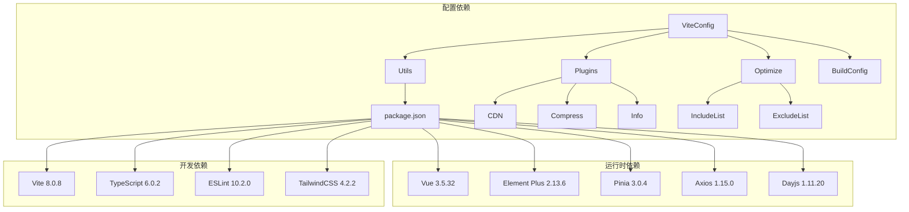
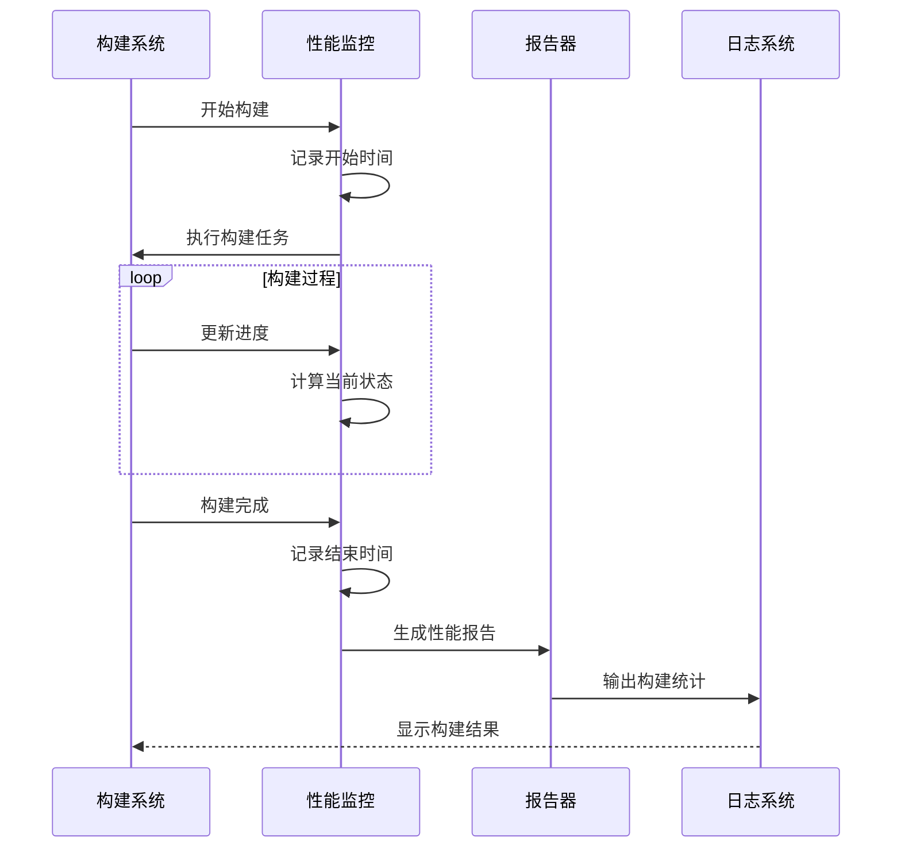

# Vite构建配置

<cite>
**本文档引用的文件**
- [vite.config.ts](file://client/web/vite.config.ts)
- [utils.ts](file://client/web/buildconfig/utils.ts)
- [plugins.ts](file://client/web/buildconfig/plugins.ts)
- [optimize.ts](file://client/web/buildconfig/optimize.ts)
- [cdn.ts](file://client/web/buildconfig/cdn.ts)
- [compress.ts](file://client/web/buildconfig/compress.ts)
- [info.ts](file://client/web/buildconfig/info.ts)
- [package.json](file://client/web/package.json)
- [tsconfig.app.json](file://client/web/tsconfig.app.json)
</cite>

## 目录
1. [简介](#简介)
2. [项目结构](#项目结构)
3. [核心组件](#核心组件)
4. [架构概览](#架构概览)
5. [详细组件分析](#详细组件分析)
6. [依赖关系分析](#依赖关系分析)
7. [性能考虑](#性能考虑)
8. [故障排除指南](#故障排除指南)
9. [结论](#结论)

## 简介

Hoper Vue3项目的Vite构建配置是一个高度模块化的构建系统，专为现代前端开发而设计。该配置文件位于client/web/vite.config.ts，采用了分层架构设计，将配置逻辑分解为多个专门的功能模块。

该项目的核心特点包括：
- 动态环境变量管理
- 智能依赖预构建优化
- CDN集成支持
- 多种压缩格式支持
- 完整的开发工具链集成
- 性能监控和报告功能

## 项目结构

Hoper Vue3项目的Vite配置采用模块化架构，将不同功能的配置分离到独立的文件中：



**图表来源**
- [vite.config.ts:14-68](file://client/web/vite.config.ts#L14-L68)
- [utils.ts:105](file://client/web/buildconfig/utils.ts#L105)
- [plugins.ts:16-58](file://client/web/buildconfig/plugins.ts#L16-L58)

**章节来源**
- [vite.config.ts:1-69](file://client/web/vite.config.ts#L1-L69)
- [utils.ts:1-106](file://client/web/buildconfig/utils.ts#L1-L106)

## 核心组件

### 基础配置组件

Vite配置的核心由以下几个关键组件构成：

#### 1. 环境变量管理系统
配置系统通过wrapperEnv函数实现了智能的环境变量处理机制，支持多种数据类型的自动转换和默认值设置。

#### 2. 路径解析系统
pathResolve函数提供了灵活的路径解析能力，支持相对路径、绝对路径和构建目录内的特殊处理。

#### 3. 插件生态系统
getPluginsList函数统一管理所有Vite插件，根据环境变量动态启用或禁用特定功能。

**章节来源**
- [utils.ts:45-73](file://client/web/buildconfig/utils.ts#L45-L73)
- [utils.ts:16-30](file://client/web/buildconfig/utils.ts#L16-L30)
- [plugins.ts:16-58](file://client/web/buildconfig/plugins.ts#L16-L58)

### 开发服务器配置

开发服务器配置提供了完整的开发环境支持，包括端口设置、跨域代理和文件预热功能。



**图表来源**
- [vite.config.ts:25-34](file://client/web/vite.config.ts#L25-L34)

**章节来源**
- [vite.config.ts:25-34](file://client/web/vite.config.ts#L25-L34)

## 架构概览

Hoper Vue3项目的Vite配置采用分层架构设计，每个层级都有明确的职责分工：



**图表来源**
- [vite.config.ts:14-68](file://client/web/vite.config.ts#L14-L68)
- [utils.ts:45-73](file://client/web/buildconfig/utils.ts#L45-L73)

## 详细组件分析

### 环境变量系统

环境变量系统是整个配置的核心，负责管理开发和生产环境的各种配置参数。

#### 环境变量加载流程



**图表来源**
- [utils.ts:45-73](file://client/web/buildconfig/utils.ts#L45-L73)

#### 支持的环境变量类型

| 环境变量 | 类型 | 默认值 | 用途 |
|---------|------|--------|------|
| VITE_PORT | Number | 8848 | 开发服务器端口 |
| VITE_PUBLIC_PATH | String | "" | 基础路径 |
| VITE_ROUTER_HISTORY | String | "" | 路由历史模式 |
| VITE_CDN | Boolean | false | CDN启用开关 |
| VITE_HIDE_HOME | String | "false" | 首页隐藏配置 |
| VITE_COMPRESSION | String | "none" | 压缩格式配置 |

**章节来源**
- [utils.ts:45-73](file://client/web/buildconfig/utils.ts#L45-L73)

### 路径别名系统

路径别名系统提供了灵活的模块导入支持，简化了复杂的目录结构访问。

#### 别名映射规则



**图表来源**
- [utils.ts:32-37](file://client/web/buildconfig/utils.ts#L32-L37)
- [utils.ts:16-30](file://client/web/buildconfig/utils.ts#L16-L30)

**章节来源**
- [utils.ts:32-37](file://client/web/buildconfig/utils.ts#L32-L37)
- [utils.ts:16-30](file://client/web/buildconfig/utils.ts#L16-L30)

### 插件生态系统

插件系统是Vite配置的核心扩展点，支持多种开发和构建功能。

#### 插件配置矩阵

| 插件类别 | 插件名称 | 条件启用 | 功能描述 |
|---------|----------|----------|----------|
| 核心插件 | @vitejs/plugin-vue |  stant | Vue单文件组件支持 |
| 核心插件 | @vitejs/plugin-vue-jsx | 始终启用 | JSX/TSX语法支持 |
| 国际化 | @intlify/unplugin-vue-i18n | 始终启用 | Vue i18n支持 |
| 样式框架 | @tailwindcss/vite | 始终启用 | TailwindCSS集成 |
| 开发工具 | code-inspector-plugin | 开发环境 | 代码检查器 |
| 路由工具 | vite-plugin-router-warn | 开发环境 | 路由警告移除 |
| 图标支持 | vite-svg-loader | 始终启用 | SVG组件化 |
| CDN支持 | vite-plugin-cdn-import | VITE_CDN=true | CDN资源加载 |
| 压缩功能 | vite-plugin-compression | VITE_COMPRESSION | 资源压缩 |
| 生产优化 | vite-plugin-remove-console | 生产环境 | 控制台移除 |
| 分析报告 | rollup-plugin-visualizer | report脚本 | 打包分析 |

**章节来源**
- [plugins.ts:16-58](file://client/web/buildconfig/plugins.ts#L16-L58)

### 依赖预构建优化

依赖预构建是Vite性能优化的关键机制，通过预编译第三方依赖来提升开发体验。

#### 预构建策略



**图表来源**
- [optimize.ts:7-24](file://client/web/buildconfig/optimize.ts#L7-L24)

#### 预构建配置详解

| 依赖类别 | 包名 | 用途 | 预构建原因 |
|---------|------|------|-----------|
| 核心框架 | vue, vue-router, pinia | 应用基础 | 频繁使用，需要快速加载 |
| 工具库 | dayjs, axios, qs | 数据处理 | 大型库，预构建提升性能 |
| UI组件 | element-plus, vant | 界面组件 | 复杂组件，预构建减少初始化时间 |
| 状态管理 | @vueuse/core | 响应式工具 | 实用性强，使用频繁 |
| 协议支持 | @bufbuild/protobuf, grpc-web | 通信协议 | 体积较大，预构建优化加载 |

**章节来源**
- [optimize.ts:7-24](file://client/web/buildconfig/optimize.ts#L7-L24)

### CDN集成配置

CDN集成提供了外部资源加载优化，特别适用于生产环境的性能提升。

#### CDN配置架构



**图表来源**
- [cdn.ts:8-54](file://client/web/buildconfig/cdn.ts#L8-L54)

#### CDN模块配置

| 模块名称 | 全局变量 | JS文件 | CSS文件 | CDN源 |
|---------|----------|--------|---------|-------|
| vue | Vue | vue.global.prod.min.js | - | BootCDN |
| vue-router | VueRouter | vue-router.global.min.js | - | BootCDN |
| vue-i18n | VueI18n | vue-i18n.runtime.global.prod.min.js | - | BootCDN |
| pinia | Pinia | pinia.iife.min.js | - | BootCDN |
| element-plus | ElementPlus | index.full.min.js | index.min.css | BootCDN |
| axios | axios | axios.min.js | - | BootCDN |
| dayjs | dayjs | dayjs.min.js | - | BootCDN |
| echarts | echarts | echarts.min.js | - | BootCDN |

**章节来源**
- [cdn.ts:8-54](file://client/web/buildconfig/cdn.ts#L8-L54)

### 压缩配置系统

压缩系统支持多种压缩格式，可根据部署需求灵活配置。

#### 压缩策略配置



**图表来源**
- [compress.ts:4-62](file://client/web/buildconfig/compress.ts#L4-L62)

#### 压缩配置参数

| 参数 | Gzip配置 | Brotli配置 | 说明 |
|------|----------|------------|------|
| ext | .gz | .br | 压缩文件扩展名 |
| threshold | 0 | 0 | 压缩阈值（字节） |
| filter | () => true | () => true | 过滤函数 |
| deleteOriginFile | false | false | 是否删除原始文件 |
| algorithm | - | brotliCompress | 压缩算法 |

**章节来源**
- [compress.ts:4-62](file://client/web/buildconfig/compress.ts#L4-L62)

### 构建目标和兼容性

构建配置针对现代浏览器进行了优化，确保最佳的兼容性和性能表现。

#### 浏览器兼容性矩阵

| 浏览器 | ES2017支持 | 特性支持 | 兼容性状态 |
|--------|------------|----------|------------|
| Chrome 60+ | ✅ | 完全支持 | 最佳 |
| Firefox 54+ | ✅ | 完全支持 | 最佳 |
| Safari 11+ | ✅ | 完全支持 | 最佳 |
| Edge 79+ | ✅ | 完全支持 | 最佳 |
| IE 11 | ❌ | 不支持 | 需要polyfill |
| IE 10及以下 | ❌ | 不支持 | 不建议使用 |

**章节来源**
- [vite.config.ts:46](file://client/web/vite.config.ts#L46)

## 依赖关系分析

### 核心依赖关系图



**图表来源**
- [vite.config.ts:1-12](file://client/web/vite.config.ts#L1-L12)
- [package.json:25-89](file://client/web/package.json#L25-L89)

### 插件依赖关系

```mermaid
graph LR
subgraph "插件依赖链"
VuePlugin[@vitejs/plugin-vue] --> Vue
VuePlugin --> VueTemplate
VueTemplate --> VueCompiler
JSXPlugin[@vitejs/plugin-vue-jsx] --> Vue
JSXPlugin --> JSXTransformer
I18nPlugin[@intlify/unplugin-vue-i18n] --> VueI18n
I18nPlugin --> LocaleFiles
TailwindCSSPlugin[@tailwindcss/vite] --> TailwindCSS
TailwindCSSPlugin --> PostCSS
CDNPlugin[vite-plugin-cdn-import] --> CDNLib
CDNPlugin --> ExternalCDN
CompressPlugin[vite-plugin-compression] --> CompressLib
CompressPlugin --> FileFilter
ConsoleRemover[vite-plugin-remove-console] --> ConsoleLib
ConsoleRemover --> FilterRules
Visualizer[rollup-plugin-visualizer] --> BundleAnalyzer
Visualizer --> ReportGenerator
end
```

**图表来源**
- [plugins.ts:1-14](file://client/web/buildconfig/plugins.ts#L1-L14)
- [package.json:48-89](file://client/web/package.json#L48-L89)

**章节来源**
- [vite.config.ts:1-12](file://client/web/vite.config.ts#L1-L12)
- [package.json:25-89](file://client/web/package.json#L25-L89)

## 性能考虑

### 性能优化策略

Hoper Vue3项目的Vite配置实施了多项性能优化策略：

#### 1. 依赖预构建优化
- 预构建大型第三方库
- 智能排除本地图标模块
- 缓存编译结果减少重复构建

#### 2. CDN集成优化
- 外部资源CDN加载
- 减少主包体积
- 提升全球访问速度

#### 3. 压缩策略优化
- 多格式压缩支持
- 智能阈值控制
- 可选的原始文件删除

#### 4. 开发体验优化
- 文件预热机制
- 快速热更新
- 智能错误处理

### 性能监控

构建系统集成了完整的性能监控功能：



**图表来源**
- [info.ts:15-52](file://client/web/buildconfig/info.ts#L15-L52)

**章节来源**
- [info.ts:15-52](file://client/web/buildconfig/info.ts#L15-L52)

## 故障排除指南

### 常见问题及解决方案

#### 1. 环境变量加载失败

**问题症状**：配置无法正确加载，使用默认值

**解决方案**：
- 检查.env文件格式和编码
- 验证环境变量命名规范
- 确认文件权限设置

#### 2. 路径别名解析错误

**问题症状**：模块导入失败，路径解析异常

**解决方案**：
- 验证别名映射配置
- 检查路径解析函数参数
- 确认文件存在性

#### 3. 插件冲突问题

**问题症状**：构建失败，插件执行异常

**解决方案**：
- 检查插件加载顺序
- 验证插件兼容性
- 确认插件配置参数

#### 4. 依赖预构建问题

**问题症状**：开发服务器启动缓慢，模块加载失败

**解决方案**：
- 清理node_modules/.vite缓存
- 检查include/exclude配置
- 验证网络连接状态

#### 5. CDN加载失败

**问题症状**：外部资源加载超时

**解决方案**：
- 检查CDN可用性
- 验证网络连接
- 考虑使用备用CDN源

**章节来源**
- [utils.ts:45-73](file://client/web/buildconfig/utils.ts#L45-L73)
- [optimize.ts:7-24](file://client/web/buildconfig/optimize.ts#L7-L24)

### 调试技巧

#### 1. 启用详细日志
- 使用`--debug`标志启动Vite
- 检查控制台输出信息
- 分析构建过程日志

#### 2. 插件诊断
- 逐个禁用可疑插件
- 检查插件版本兼容性
- 验证插件配置参数

#### 3. 性能分析
- 使用`npm run report`生成分析报告
- 检查bundle大小分布
- 识别性能瓶颈

## 结论

Hoper Vue3项目的Vite构建配置展现了现代前端工程化的最佳实践。通过模块化的设计理念、完善的性能优化策略和灵活的配置管理，该配置系统为Vue3应用提供了高效、可靠的构建基础。

### 主要优势

1. **模块化架构**：清晰的职责分离，便于维护和扩展
2. **智能配置**：动态环境变量处理，适应多环境部署
3. **性能优化**：全面的优化策略，确保最佳用户体验
4. **开发友好**：丰富的开发工具集成，提升开发效率
5. **可扩展性**：灵活的插件系统，支持自定义扩展

### 未来改进方向

1. **自动化测试集成**：增强测试覆盖率和质量保证
2. **CI/CD优化**：完善持续集成流程和部署策略
3. **性能监控**：增加实时性能监控和分析功能
4. **文档完善**：补充详细的配置说明和使用指南
5. **安全加固**：增强安全配置和漏洞防护机制

该配置系统为Hoper Vue3项目奠定了坚实的构建基础，为后续的功能扩展和技术演进提供了良好的支撑。