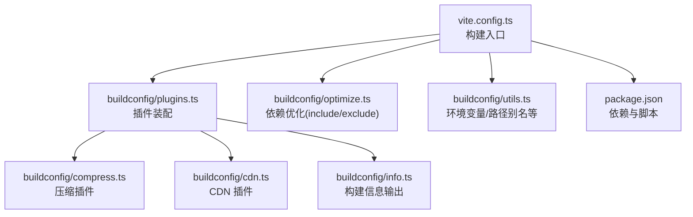
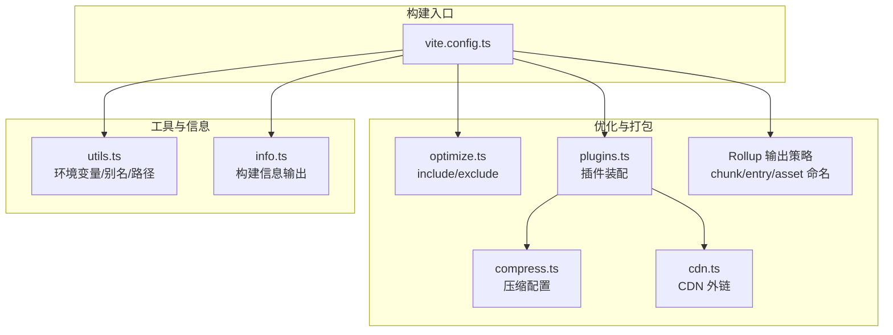
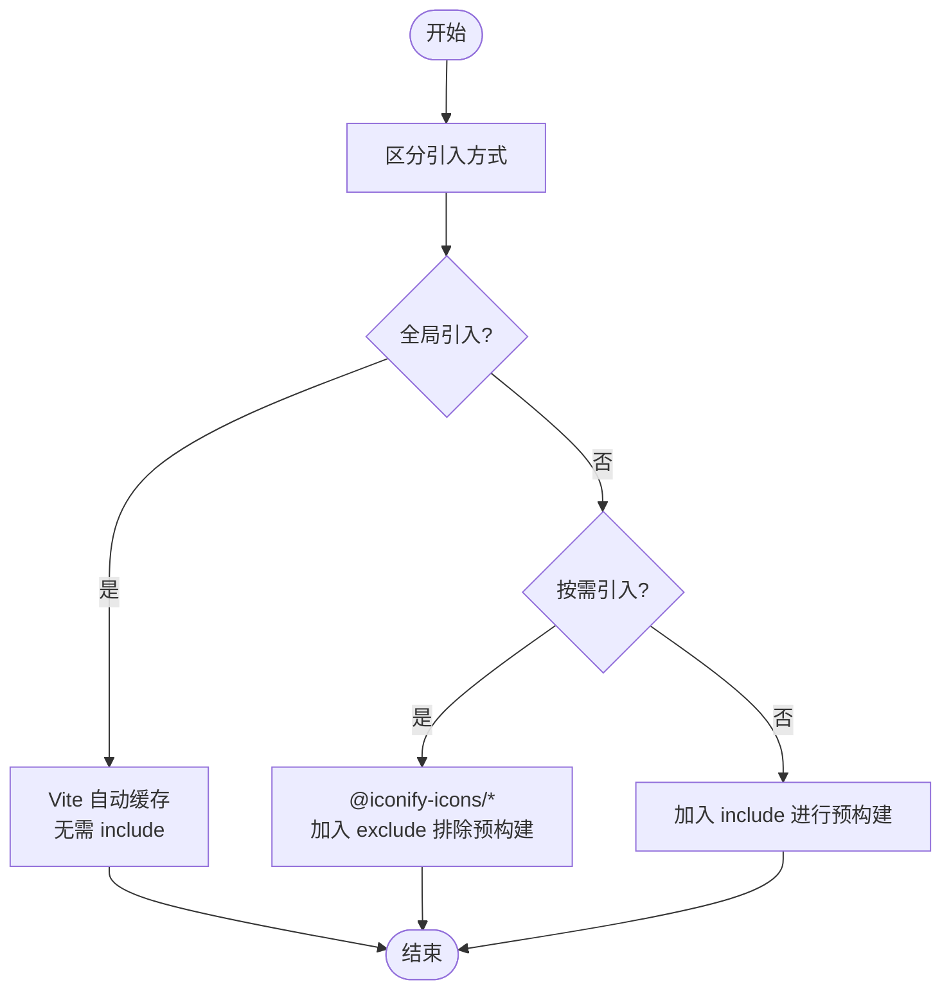
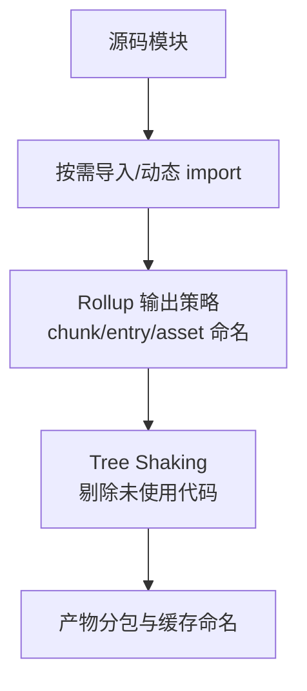
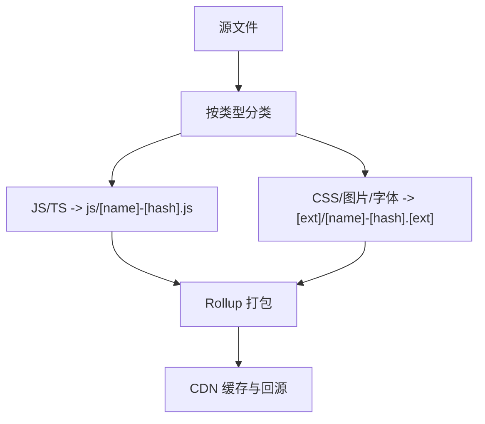
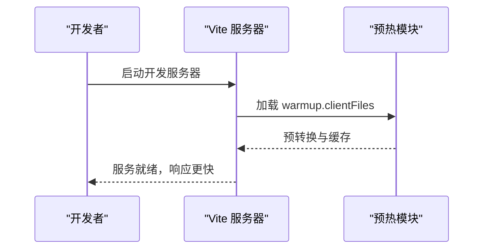
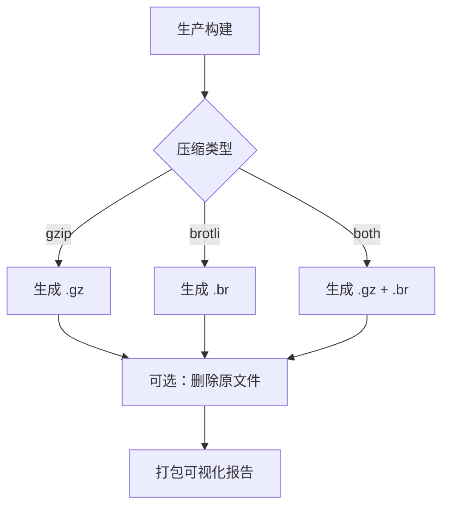
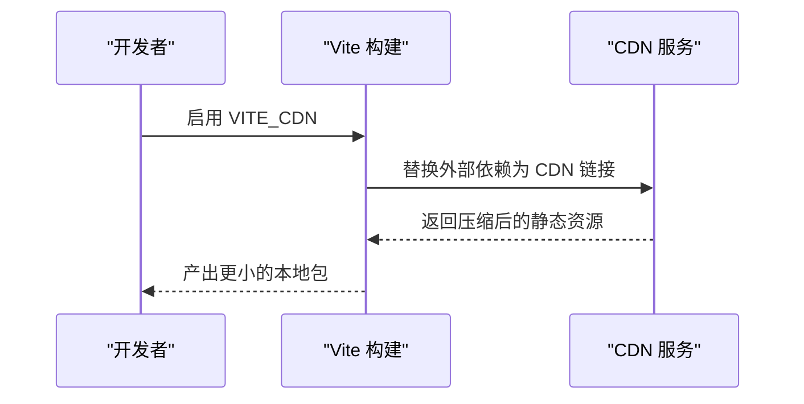
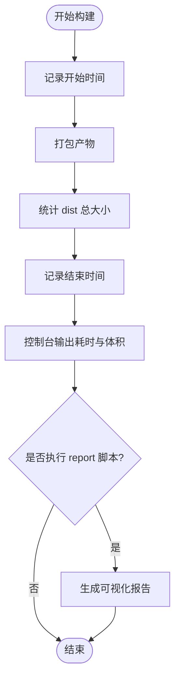
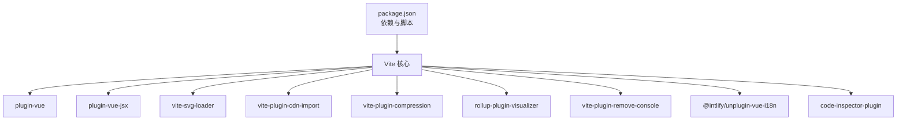

# 性能优化

<cite>
**本文引用的文件**
- [client/web/vite.config.ts](file://client/web/vite.config.ts)
- [client/web/buildconfig/optimize.ts](file://client/web/buildconfig/optimize.ts)
- [client/web/buildconfig/compress.ts](file://client/web/buildconfig/compress.ts)
- [client/web/buildconfig/cdn.ts](file://client/web/buildconfig/cdn.ts)
- [client/web/buildconfig/plugins.ts](file://client/web/buildconfig/plugins.ts)
- [client/web/buildconfig/utils.ts](file://client/web/buildconfig/utils.ts)
- [client/web/buildconfig/info.ts](file://client/web/buildconfig/info.ts)
- [client/web/package.json](file://client/web/package.json)
</cite>

## 目录
1. [简介](#简介)
2. [项目结构](#项目结构)
3. [核心组件](#核心组件)
4. [架构总览](#架构总览)
5. [详细组件分析](#详细组件分析)
6. [依赖分析](#依赖分析)
7. [性能考量](#性能考量)
8. [故障排查指南](#故障排查指南)
9. [结论](#结论)
10. [附录](#附录)

## 简介
本技术文档聚焦于 Hoper Vue3 项目的前端性能优化，围绕依赖优化、代码分割与 Tree Shaking、chunk 大小控制、静态资源分类打包与命名策略、开发环境预热文件、生产环境压缩与 CDN 集成、性能监控与构建分析工具的使用，以及性能瓶颈识别与解决方法展开。文档基于实际仓库中的 Vite 构建配置与配套插件进行系统性梳理，并提供可视化图示帮助理解。

## 项目结构
Hoper Vue3 前端位于 client/web 目录，采用 Vite 作为构建工具，通过模块化的构建配置拆分为多个子模块：
- 构建入口与基础配置：vite.config.ts
- 依赖优化与排除：buildconfig/optimize.ts
- 压缩与产物分析：buildconfig/compress.ts、buildconfig/plugins.ts
- CDN 引入与外部化：buildconfig/cdn.ts
- 工具与环境变量封装：buildconfig/utils.ts、buildconfig/info.ts
- 依赖与脚本定义：package.json

图表来源
- [client/web/vite.config.ts:14-68](file://client/web/vite.config.ts#L14-L68)
- [client/web/buildconfig/plugins.ts:16-58](file://client/web/buildconfig/plugins.ts#L16-L58)
- [client/web/buildconfig/optimize.ts:1-25](file://client/web/buildconfig/optimize.ts#L1-L25)
- [client/web/buildconfig/compress.ts:1-63](file://client/web/buildconfig/compress.ts#L1-L63)
- [client/web/buildconfig/cdn.ts:1-55](file://client/web/buildconfig/cdn.ts#L1-L55)
- [client/web/buildconfig/info.ts:15-52](file://client/web/buildconfig/info.ts#L15-L52)
- [client/web/buildconfig/utils.ts:105](file://client/web/buildconfig/utils.ts#L105)
- [client/web/package.json:12-24](file://client/web/package.json#L12-L24)

章节来源
- [client/web/vite.config.ts:14-68](file://client/web/vite.config.ts#L14-L68)
- [client/web/package.json:12-24](file://client/web/package.json#L12-L24)

## 核心组件
- 依赖优化与预构建：通过 optimizeDeps.include 与 exclude 控制第三方依赖的预构建与排除，减少开发时的重复转换与页面切换卡顿。
- 代码分割与 Tree Shaking：结合 Rollup 输出策略与按需引入，最大化利用 Tree Shaking；通过 chunkFileNames/entryFileNames/assetFileNames 实现清晰的产物组织。
- 静态资源分类与命名：对 JS、CSS、媒体等资源进行分类打包与带哈希的命名，便于浏览器缓存与版本管理。
- 开发环境预热：warmup.clientFiles 提前转换与缓存，降低首次启动与页面切换的等待。
- 生产环境压缩：按 gzip/brotli/两者同时开启，支持清理原文件的选项。
- CDN 集成：将常用框架与 UI 库从 CDN 引入，减少本地打包体积与首屏加载时间。
- 性能监控与分析：构建信息输出与打包可视化报告，辅助定位体积与耗时问题。

章节来源
- [client/web/vite.config.ts:37-61](file://client/web/vite.config.ts#L37-L61)
- [client/web/buildconfig/optimize.ts:1-25](file://client/web/buildconfig/optimize.ts#L1-L25)
- [client/web/buildconfig/plugins.ts:16-58](file://client/web/buildconfig/plugins.ts#L16-L58)
- [client/web/buildconfig/compress.ts:4-62](file://client/web/buildconfig/compress.ts#L4-L62)
- [client/web/buildconfig/cdn.ts:8-54](file://client/web/buildconfig/cdn.ts#L8-L54)
- [client/web/buildconfig/info.ts:15-52](file://client/web/buildconfig/info.ts#L15-L52)

## 架构总览
下图展示了从构建入口到各优化模块的交互关系，以及关键参数如何影响最终产物与性能表现。

图表来源
- [client/web/vite.config.ts:14-68](file://client/web/vite.config.ts#L14-L68)
- [client/web/buildconfig/optimize.ts:1-25](file://client/web/buildconfig/optimize.ts#L1-L25)
- [client/web/buildconfig/plugins.ts:16-58](file://client/web/buildconfig/plugins.ts#L16-L58)
- [client/web/buildconfig/compress.ts:1-63](file://client/web/buildconfig/compress.ts#L1-L63)
- [client/web/buildconfig/cdn.ts:1-55](file://client/web/buildconfig/cdn.ts#L1-L55)
- [client/web/buildconfig/utils.ts:105](file://client/web/buildconfig/utils.ts#L105)
- [client/web/buildconfig/info.ts:15-52](file://client/web/buildconfig/info.ts#L15-L52)

## 详细组件分析

### 依赖优化与预构建
- include 列表：将高频且稳定的第三方库纳入预构建，避免开发时重复转换与页面跳转卡顿。
- exclude 列表：对按需引入的图标库等模块进行排除，避免不必要的预构建，直接由浏览器按需加载。
- 适用场景：全局引入的库无需显式 include，Vite 会自动缓存；按需引入的图标库必须排除，以充分利用 Tree Shaking。

图表来源
- [client/web/buildconfig/optimize.ts:1-25](file://client/web/buildconfig/optimize.ts#L1-L25)

章节来源
- [client/web/buildconfig/optimize.ts:1-25](file://client/web/buildconfig/optimize.ts#L1-L25)

### 代码分割与 Tree Shaking
- 代码分割：通过 Rollup 的 output 配置对 chunk、entry、asset 分类命名，配合按需导入与动态 import，实现更细粒度的分包。
- Tree Shaking：确保第三方库导出为 ESM，避免打包未使用代码；结合按需引入与 exclude 排除，进一步减少冗余。
- chunk 大小限制：通过 chunkSizeWarningLimit 调整告警阈值，平衡体积与可维护性。

图表来源
- [client/web/vite.config.ts:44-61](file://client/web/vite.config.ts#L44-L61)

章节来源
- [client/web/vite.config.ts:44-61](file://client/web/vite.config.ts#L44-L61)

### 静态资源分类打包与文件命名策略
- JS 入口与分片：统一命名为“js/[name]-[hash].js”，便于缓存与版本控制。
- 静态资源：按扩展名分类，如“[ext]/[name]-[hash].[ext]”，利于 CDN 缓存与回源策略。
- 建议：对图片、字体、媒体等大体积资源单独分包，结合 CDN 与缓存策略优化加载。

图表来源
- [client/web/vite.config.ts:54-59](file://client/web/vite.config.ts#L54-L59)

章节来源
- [client/web/vite.config.ts:54-59](file://client/web/vite.config.ts#L54-L59)

### 开发环境预热文件配置
- warmup.clientFiles：在启动时预热 HTML 与视图/组件目录，提前转换与缓存，减少首次访问与页面切换的等待。
- 适用：首次启动、频繁切换页面、调试阶段。

图表来源
- [client/web/vite.config.ts:31-34](file://client/web/vite.config.ts#L31-L34)

章节来源
- [client/web/vite.config.ts:31-34](file://client/web/vite.config.ts#L31-L34)

### 生产环境压缩与产物分析
- 压缩策略：支持 gzip、brotli 或两者同时开启；可选删除原文件，进一步减小产物体积。
- 产物分析：通过生命周期检测决定是否启用可视化报告，结合 brotli 大小统计定位体积热点。

图表来源
- [client/web/buildconfig/compress.ts:4-62](file://client/web/buildconfig/compress.ts#L4-L62)
- [client/web/buildconfig/plugins.ts:54-56](file://client/web/buildconfig/plugins.ts#L54-L56)

章节来源
- [client/web/buildconfig/compress.ts:4-62](file://client/web/buildconfig/compress.ts#L4-L62)
- [client/web/buildconfig/plugins.ts:54-56](file://client/web/buildconfig/plugins.ts#L54-L56)

### CDN 集成方案
- 外链策略：将 Vue、Vue Router、Element Plus、Axios、Dayjs、ECharts 等常用库从 CDN 引入，减少本地打包体积。
- 版本管理：CDN URL 使用本地依赖版本号自动替换，保证一致性。
- 注意：CDN 模式需在生产环境启用，且确保网络可达。

图表来源
- [client/web/buildconfig/cdn.ts:8-54](file://client/web/buildconfig/cdn.ts#L8-L54)
- [client/web/buildconfig/plugins.ts:49](file://client/web/buildconfig/plugins.ts#L49)

章节来源
- [client/web/buildconfig/cdn.ts:8-54](file://client/web/buildconfig/cdn.ts#L8-L54)
- [client/web/buildconfig/plugins.ts:49](file://client/web/buildconfig/plugins.ts#L49)

### 性能监控指标与构建分析工具
- 构建时长与体积：通过自定义插件记录开始/结束时间，计算总耗时，并统计 dist 目录总大小，输出到控制台。
- 可视化报告：在执行 report 脚本时生成打包可视化报告，按模块维度展示依赖关系与体积占比，辅助识别大体积模块与重复依赖。

图表来源
- [client/web/buildconfig/info.ts:15-52](file://client/web/buildconfig/info.ts#L15-L52)
- [client/web/buildconfig/plugins.ts:54-56](file://client/web/buildconfig/plugins.ts#L54-L56)

章节来源
- [client/web/buildconfig/info.ts:15-52](file://client/web/buildconfig/info.ts#L15-L52)
- [client/web/buildconfig/plugins.ts:54-56](file://client/web/buildconfig/plugins.ts#L54-L56)

## 依赖分析
- 构建工具链：Vite 作为核心构建工具，配合 @vitejs/plugin-vue、@vitejs/plugin-vue-jsx、vite-svg-loader 等生态插件。
- 压缩与分析：vite-plugin-compression、rollup-plugin-visualizer。
- CDN 与路由：vite-plugin-cdn-import、vite-plugin-router-warn。
- 开发体验：code-inspector-plugin、vite-plugin-remove-console、@intlify/unplugin-vue-i18n。
- 依赖优化：optimizeDeps.include/exclude 与 exclude 对图标库的处理。

图表来源
- [client/web/package.json:25-89](file://client/web/package.json#L25-L89)
- [client/web/buildconfig/plugins.ts:16-58](file://client/web/buildconfig/plugins.ts#L16-L58)

章节来源
- [client/web/package.json:25-89](file://client/web/package.json#L25-L89)

## 性能考量
- 依赖优化
  - 将稳定、高频的第三方库纳入 include，减少开发时重复转换。
  - 对按需引入的图标库等模块 exclude，避免预构建带来的体积与缓存压力。
- 代码分割与 Tree Shaking
  - 使用动态 import 与按需引入，结合 exclude 与 ESM 导出，最大化剔除未使用代码。
  - 合理设置 chunkSizeWarningLimit，平衡体积与可维护性。
- 静态资源与命名
  - 统一分包命名策略，结合 CDN 与浏览器缓存，提升二次加载性能。
- 开发体验
  - warmup 预热显著降低首次启动与页面切换等待。
- 生产优化
  - 启用 gzip/brotli 压缩，必要时删除原文件以进一步减小体积。
  - CDN 外链减少本地包体，加速首屏加载。
- 监控与分析
  - 使用构建信息插件与可视化报告，持续追踪体积与耗时变化，及时发现回归。

## 故障排查指南
- 开发时页面切换卡顿
  - 检查是否将按需引入的图标库加入 include；确认 exclude 是否包含对应图标库。
  - 确认是否启用了 warmup 预热。
- 首屏加载慢
  - 检查是否启用 CDN 与压缩；核对 CDN 链接可用性与缓存命中。
  - 使用可视化报告定位大体积模块与重复依赖。
- 构建体积异常增大
  - 审核 include 列表，避免将过大的库纳入预构建。
  - 检查是否误将按需引入的模块纳入 include。
- 构建耗时过长
  - 减少 include 中的库数量；优化 exclude 规则；关闭不必要的插件。
  - 使用可视化报告分析瓶颈模块。

章节来源
- [client/web/buildconfig/optimize.ts:1-25](file://client/web/buildconfig/optimize.ts#L1-L25)
- [client/web/buildconfig/plugins.ts:54-56](file://client/web/buildconfig/plugins.ts#L54-L56)
- [client/web/vite.config.ts:31-34](file://client/web/vite.config.ts#L31-L34)

## 结论
通过对依赖优化、代码分割、Tree Shaking、chunk 与资源命名策略、开发预热、生产压缩与 CDN 集成的系统化配置，Hoper Vue3 项目在开发体验与生产性能之间取得了良好平衡。建议持续使用构建信息与可视化报告进行监控，结合业务演进不断调整优化策略，确保长期的性能稳定性与可维护性。

## 附录
- 关键配置要点速览
  - 依赖优化：optimizeDeps.include/exclude
  - 代码分割：Rollup output 命名策略
  - 预热文件：server.warmup.clientFiles
  - 压缩：vite-plugin-compression 配置
  - CDN：vite-plugin-cdn-import 配置
  - 监控：viteBuildInfo 与可视化报告