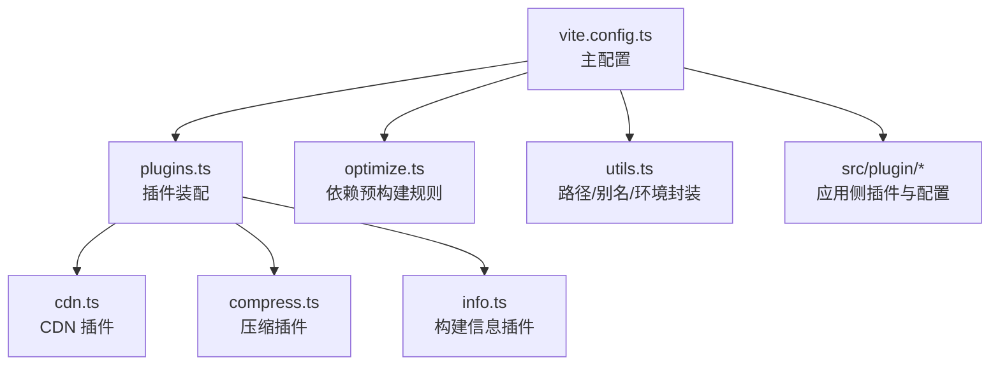
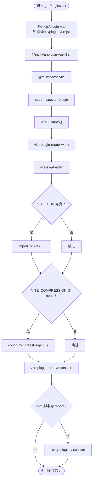
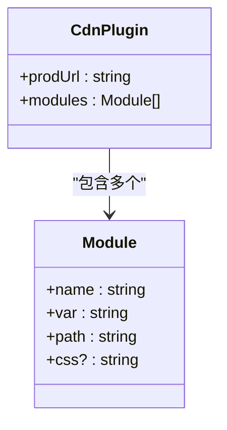
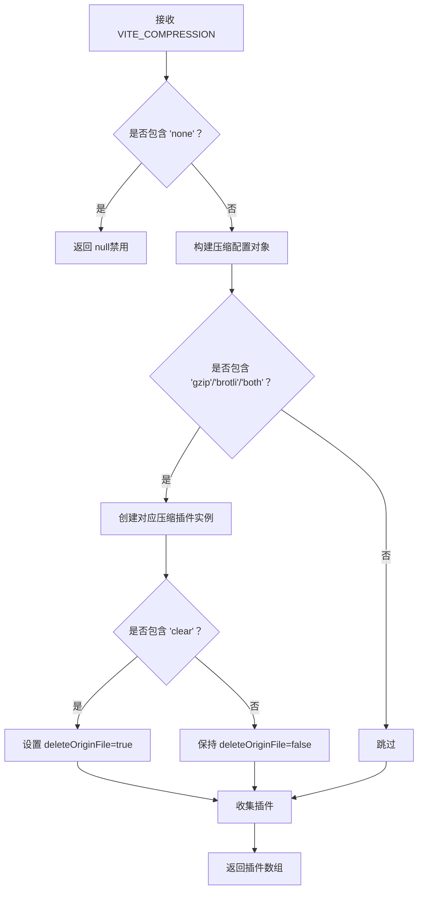
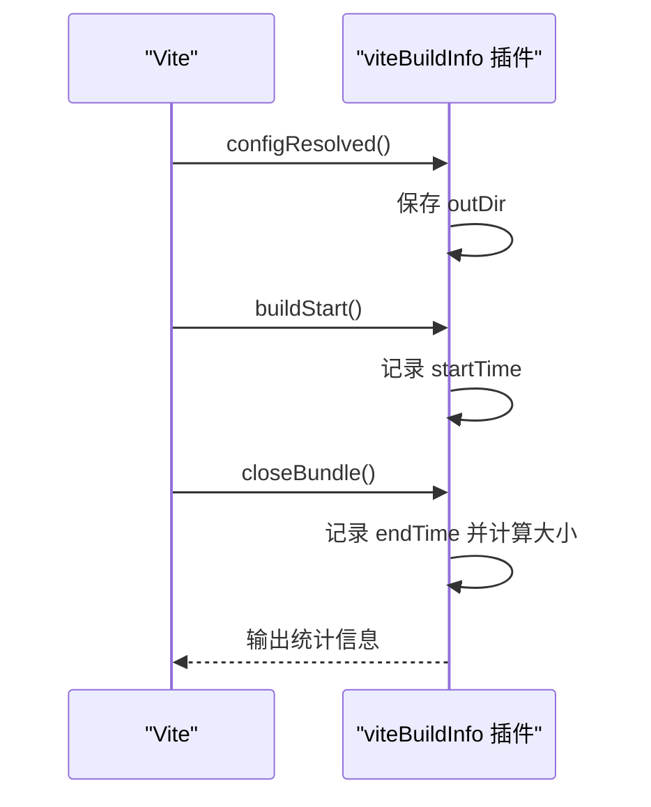
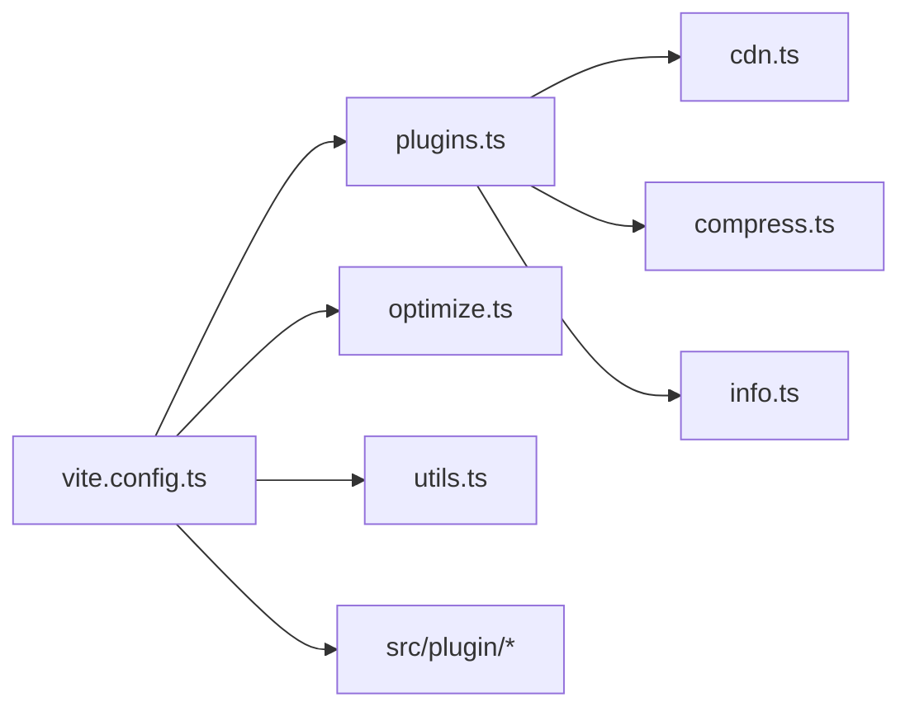

# 插件系统

<cite>
**本文引用的文件**
- [client/web/vite.config.ts](file://client/web/vite.config.ts)
- [client/web/buildconfig/plugins.ts](file://client/web/buildconfig/plugins.ts)
- [client/web/buildconfig/cdn.ts](file://client/web/buildconfig/cdn.ts)
- [client/web/buildconfig/compress.ts](file://client/web/buildconfig/compress.ts)
- [client/web/buildconfig/info.ts](file://client/web/buildconfig/info.ts)
- [client/web/buildconfig/optimize.ts](file://client/web/buildconfig/optimize.ts)
- [client/web/buildconfig/utils.ts](file://client/web/buildconfig/utils.ts)
- [client/web/src/plugin/config.ts](file://client/web/src/plugin/config.ts)
- [client/web/src/plugin/i18n.ts](file://client/web/src/plugin/i18n.ts)
- [client/web/src/plugin/plugin.js](file://client/web/src/plugin/plugin.js)
- [client/web/package.json](file://client/web/package.json)
</cite>

## 目录
1. [简介](#简介)
2. [项目结构](#项目结构)
3. [核心组件](#核心组件)
4. [架构总览](#架构总览)
5. [详细组件分析](#详细组件分析)
6. [依赖分析](#依赖分析)
7. [性能考量](#性能考量)
8. [故障排查指南](#故障排查指南)
9. [结论](#结论)
10. [附录](#附录)

## 简介
本文件面向 Hoper Vue3 项目的 Vite 插件体系，系统性梳理插件清单的组织与管理方式，涵盖 CDN 插件、压缩插件与自定义插件的配置与行为；深入解释插件的加载顺序、执行时机与相互依赖关系；阐述开发与生产环境下的差异化行为及动态启停策略；并提供插件开发指南与最佳实践，帮助读者快速理解并扩展该插件系统。

## 项目结构
Hoper Web 侧的 Vite 配置集中于 client/web/vite.config.ts，通过 buildconfig 子目录将插件装配逻辑拆分为多个职责清晰的模块：
- plugins.ts：统一装配入口，按条件拼装插件数组
- cdn.ts：CDN 插件配置，基于 vite-plugin-cdn-import
- compress.ts：压缩插件配置，基于 vite-plugin-compression
- info.ts：自定义构建信息插件，输出打包耗时与产物大小
- optimize.ts：依赖预构建 include/exclude 规则
- utils.ts：路径解析、别名、环境变量封装等通用能力
- src/plugin：应用侧插件与配置（如 i18n、全局指令与工具）



图表来源
- [client/web/vite.config.ts:14-68](file://client/web/vite.config.ts#L14-L68)
- [client/web/buildconfig/plugins.ts:16-58](file://client/web/buildconfig/plugins.ts#L16-L58)
- [client/web/buildconfig/cdn.ts:8-54](file://client/web/buildconfig/cdn.ts#L8-L54)
- [client/web/buildconfig/compress.ts:4-62](file://client/web/buildconfig/compress.ts#L4-L62)
- [client/web/buildconfig/info.ts:15-52](file://client/web/buildconfig/info.ts#L15-L52)
- [client/web/buildconfig/optimize.ts:7-24](file://client/web/buildconfig/optimize.ts#L7-L24)
- [client/web/buildconfig/utils.ts:16-37](file://client/web/buildconfig/utils.ts#L16-L37)

章节来源
- [client/web/vite.config.ts:14-68](file://client/web/vite.config.ts#L14-L68)
- [client/web/buildconfig/plugins.ts:16-58](file://client/web/buildconfig/plugins.ts#L16-L58)

## 核心组件
- 插件装配器 getPluginsList：根据环境变量动态决定是否启用 CDN 与压缩策略，并串联 Vue 生态、SVG 加载、I18n、TailwindCSS、代码检查、构建信息、路由警告清理、控制台清理与打包分析等插件。
- CDN 插件：将指定依赖从 CDN 引入，减少打包体积，适合外网访问场景。
- 压缩插件：支持 gzip/brotli/两者同时，可选“清除原始文件”策略。
- 构建信息插件：记录构建开始与结束时间，计算总耗时与产物大小并在控制台以彩色盒状输出。
- 依赖预构建：include/exclude 明确哪些第三方库参与预构建，避免开发期频繁重载。
- 应用侧插件与配置：包含 i18n、全局指令与工具方法、环境变量读取等。

章节来源
- [client/web/buildconfig/plugins.ts:16-58](file://client/web/buildconfig/plugins.ts#L16-L58)
- [client/web/buildconfig/cdn.ts:8-54](file://client/web/buildconfig/cdn.ts#L8-L54)
- [client/web/buildconfig/compress.ts:4-62](file://client/web/buildconfig/compress.ts#L4-L62)
- [client/web/buildconfig/info.ts:15-52](file://client/web/buildconfig/info.ts#L15-L52)
- [client/web/buildconfig/optimize.ts:7-24](file://client/web/buildconfig/optimize.ts#L7-L24)
- [client/web/src/plugin/config.ts:1-6](file://client/web/src/plugin/config.ts#L1-L6)
- [client/web/src/plugin/i18n.ts:104-115](file://client/web/src/plugin/i18n.ts#L104-L115)
- [client/web/src/plugin/plugin.js:8-38](file://client/web/src/plugin/plugin.js#L8-L38)

## 架构总览
下图展示 Vite 启动时插件装配与执行的关键流程，以及各模块之间的依赖关系：

```mermaid
sequenceDiagram
participant CLI as "命令行"
participant VC as "vite.config.ts"
participant PL as "plugins.ts"
participant CDN as "cdn.ts"
participant CMP as "compress.ts"
participant INFO as "info.ts"
participant OPT as "optimize.ts"
participant UTL as "utils.ts"
CLI->>VC : 读取配置并解析环境变量
VC->>UTL : wrapperEnv/loadEnv/pathResolve
VC->>OPT : 读取 optimizeDeps.include/exclude
VC->>PL : getPluginsList(VITE_CDN, VITE_COMPRESSION)
PL->>CDN : 条件启用 importToCDN
PL->>CMP : 根据 VITE_COMPRESSION 生成压缩插件
PL->>INFO : 注册构建信息插件
PL-->>VC : 返回插件数组
VC-->>CLI : 完成插件装配并启动服务/构建
```

图表来源
- [client/web/vite.config.ts:14-68](file://client/web/vite.config.ts#L14-L68)
- [client/web/buildconfig/plugins.ts:16-58](file://client/web/buildconfig/plugins.ts#L16-L58)
- [client/web/buildconfig/cdn.ts:8-54](file://client/web/buildconfig/cdn.ts#L8-L54)
- [client/web/buildconfig/compress.ts:4-62](file://client/web/buildconfig/compress.ts#L4-L62)
- [client/web/buildconfig/info.ts:15-52](file://client/web/buildconfig/info.ts#L15-L52)
- [client/web/buildconfig/optimize.ts:7-24](file://client/web/buildconfig/optimize.ts#L7-L24)
- [client/web/buildconfig/utils.ts:46-73](file://client/web/buildconfig/utils.ts#L46-L73)

## 详细组件分析

### 组件一：插件装配器 getPluginsList
- 职责：统一装配所有 Vite 插件，按环境变量与生命周期动态启用/禁用。
- 关键点：
  - Vue 生态与 JSX 支持优先注册，确保模板与组件编译正常。
  - I18n 插件限定扫描路径，避免无关文件被处理。
  - TailwindCSS 插件用于样式自动扫描与按需生成。
  - 代码检查插件在开发期提供交互式提示，生产期关闭控制台输出。
  - 构建信息插件在构建阶段输出统计信息。
  - 路由警告清理插件仅在开发期启用，避免生产期开销。
  - SVG Loader 提供组件化 SVG 支持。
  - CDN 插件与压缩插件通过环境变量开关，便于在不同网络/性能需求下灵活切换。
  - 控制台清理插件支持外部白名单，避免误删业务日志。
  - 打包分析插件仅在特定 npm 生命周期下启用，避免日常开发干扰。



图表来源
- [client/web/buildconfig/plugins.ts:16-58](file://client/web/buildconfig/plugins.ts#L16-L58)
- [client/web/buildconfig/cdn.ts:8-54](file://client/web/buildconfig/cdn.ts#L8-L54)
- [client/web/buildconfig/compress.ts:4-62](file://client/web/buildconfig/compress.ts#L4-L62)
- [client/web/buildconfig/info.ts:15-52](file://client/web/buildconfig/info.ts#L15-L52)

章节来源
- [client/web/buildconfig/plugins.ts:16-58](file://client/web/buildconfig/plugins.ts#L16-L58)

### 组件二：CDN 插件（cdn.ts）
- 功能：将指定依赖从 CDN 引入，减少打包体积，适合外网访问场景。
- 配置要点：
  - prodUrl 指定 CDN 基础地址与占位符替换规则。
  - modules 列表定义包名、全局变量名与路径映射。
  - 仅在 VITE_CDN 为真时启用，避免内网或离线环境的兼容问题。



图表来源
- [client/web/buildconfig/cdn.ts:8-54](file://client/web/buildconfig/cdn.ts#L8-L54)

章节来源
- [client/web/buildconfig/cdn.ts:8-54](file://client/web/buildconfig/cdn.ts#L8-L54)

### 组件三：压缩插件（compress.ts）
- 功能：按需生成 gzip/brotli 压缩包，支持“清除原始文件”策略。
- 配置要点：
  - 支持 "gzip"、"brotli"、"both" 与 "clear" 组合。
  - threshold 与 filter 控制压缩触发条件。
  - deleteOriginFile 决定是否删除原始文件，影响产物体积与回退策略。



图表来源
- [client/web/buildconfig/compress.ts:4-62](file://client/web/buildconfig/compress.ts#L4-L62)

章节来源
- [client/web/buildconfig/compress.ts:4-62](file://client/web/buildconfig/compress.ts#L4-L62)

### 组件四：构建信息插件（info.ts）
- 功能：在构建阶段记录开始/结束时间，计算总耗时与产物大小，并以彩色盒状输出。
- 配置要点：
  - 通过 configResolved 获取 outDir。
  - buildStart 记录开始时间。
  - closeBundle 计算耗时与大小并输出。



图表来源
- [client/web/buildconfig/info.ts:15-52](file://client/web/buildconfig/info.ts#L15-L52)

章节来源
- [client/web/buildconfig/info.ts:15-52](file://client/web/buildconfig/info.ts#L15-L52)

### 组件五：依赖预构建（optimize.ts）
- 功能：明确哪些第三方库参与预构建，避免开发期频繁重载。
- include：建议加入常用库，确保首次加载体验。
- exclude：排除无需预构建的图标库等模块，减少缓存压力。

章节来源
- [client/web/buildconfig/optimize.ts:7-24](file://client/web/buildconfig/optimize.ts#L7-L24)

### 组件六：环境变量与路径工具（utils.ts）
- 功能：封装路径解析、别名、环境变量处理与打包大小统计。
- 关键点：
  - wrapperEnv 将字符串布尔值转为布尔，数字转为数值。
  - pathResolve 支持在 build 目录内外正确解析绝对路径。
  - __APP_INFO__ 提供构建元信息，便于注入到 define 中。

章节来源
- [client/web/buildconfig/utils.ts:46-73](file://client/web/buildconfig/utils.ts#L46-L73)
- [client/web/buildconfig/utils.ts:16-37](file://client/web/buildconfig/utils.ts#L16-L37)
- [client/web/buildconfig/utils.ts:78-103](file://client/web/buildconfig/utils.ts#L78-L103)

### 组件七：应用侧插件与配置
- 环境变量读取：src/plugin/config.ts 读取 import.meta.env 与全局常量。
- 国际化：src/plugin/i18n.ts 提供多语言消息合并、键扁平化与 $t 辅助。
- 全局插件：src/plugin/plugin.js 提供日期格式化指令与上传工具方法。

章节来源
- [client/web/src/plugin/config.ts:1-6](file://client/web/src/plugin/config.ts#L1-L6)
- [client/web/src/plugin/i18n.ts:104-115](file://client/web/src/plugin/i18n.ts#L104-L115)
- [client/web/src/plugin/plugin.js:8-38](file://client/web/src/plugin/plugin.js#L8-L38)

## 依赖分析
- 插件间耦合度低，主要通过环境变量与生命周期钩子解耦。
- CDN 插件与压缩插件受环境变量控制，彼此独立。
- 构建信息插件与打包分析插件仅在构建阶段生效，互不影响。
- 依赖预构建规则与插件装配器共同影响开发期性能与稳定性。



图表来源
- [client/web/vite.config.ts:14-68](file://client/web/vite.config.ts#L14-L68)
- [client/web/buildconfig/plugins.ts:16-58](file://client/web/buildconfig/plugins.ts#L16-L58)
- [client/web/buildconfig/cdn.ts:8-54](file://client/web/buildconfig/cdn.ts#L8-L54)
- [client/web/buildconfig/compress.ts:4-62](file://client/web/buildconfig/compress.ts#L4-L62)
- [client/web/buildconfig/info.ts:15-52](file://client/web/buildconfig/info.ts#L15-L52)
- [client/web/buildconfig/optimize.ts:7-24](file://client/web/buildconfig/optimize.ts#L7-L24)
- [client/web/buildconfig/utils.ts:46-73](file://client/web/buildconfig/utils.ts#L46-L73)

章节来源
- [client/web/vite.config.ts:14-68](file://client/web/vite.config.ts#L14-L68)
- [client/web/buildconfig/plugins.ts:16-58](file://client/web/buildconfig/plugins.ts#L16-L58)

## 性能考量
- CDN 插件：减少首屏打包体积，但需考虑 CDN 可用性与回退策略；仅在 VITE_CDN 为真时启用。
- 压缩插件：brotli 压缩率更高但 CPU 开销更大；gzip 更通用且开销更低；可按需选择。
- 依赖预构建：include/exclude 精准控制缓存命中与重载频率，避免不必要的重编译。
- 构建信息插件：仅在构建阶段输出统计，不影响开发期性能。
- 打包分析插件：仅在 report 生命周期启用，避免日常开发干扰。

## 故障排查指南
- CDN 引用失败
  - 确认 VITE_CDN 为真且 CDN 地址可达。
  - 检查 modules 中包名与版本是否与 package.json 一致。
- 压缩包未生成
  - 确认 VITE_COMPRESSION 非 none，且包含期望的算法标识。
  - 若启用 "clear"，确认目标服务器支持压缩回退。
- 开发期频繁重载
  - 将常用库加入 optimize.include，或将无需预构建的模块加入 optimize.exclude。
- 构建时间过长
  - 使用打包分析插件（report 生命周期）定位大体积模块，优化依赖或拆分代码。
- 控制台日志未清理
  - 检查 remove-console 的 external 白名单是否误伤业务日志。

章节来源
- [client/web/buildconfig/cdn.ts:8-54](file://client/web/buildconfig/cdn.ts#L8-L54)
- [client/web/buildconfig/compress.ts:4-62](file://client/web/buildconfig/compress.ts#L4-L62)
- [client/web/buildconfig/optimize.ts:7-24](file://client/web/buildconfig/optimize.ts#L7-L24)
- [client/web/buildconfig/plugins.ts:44-56](file://client/web/buildconfig/plugins.ts#L44-L56)

## 结论
该插件系统通过环境变量与生命周期钩子实现了高可配置性与低耦合性，CDN 与压缩插件按需启用，构建信息与分析插件辅助性能优化。结合依赖预构建与应用侧插件，整体在开发体验与生产性能之间取得良好平衡。建议在团队内统一环境变量命名与启用策略，并定期使用打包分析插件进行优化。

## 附录
- 环境变量与脚本
  - VITE_CDN：控制是否启用 CDN 插件
  - VITE_COMPRESSION：控制压缩算法与策略
  - npm scripts：dev/build/preview/report 等
- 参考文件
  - [client/web/package.json:12-24](file://client/web/package.json#L12-L24)

章节来源
- [client/web/package.json:12-24](file://client/web/package.json#L12-L24)