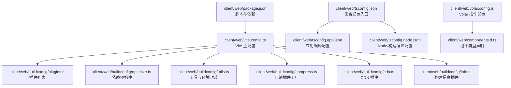
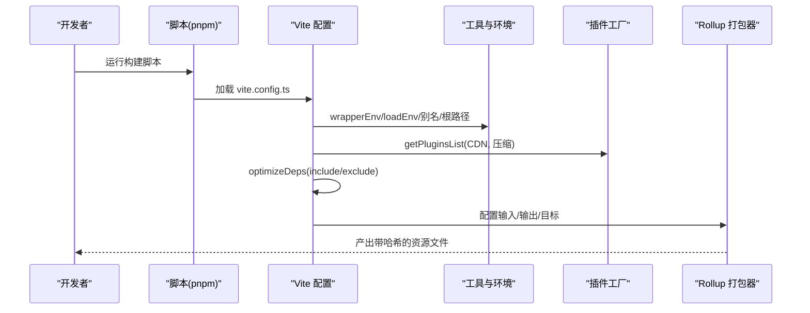
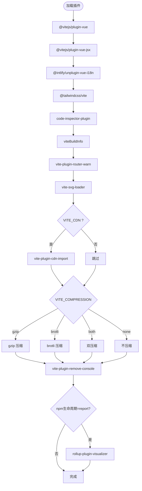
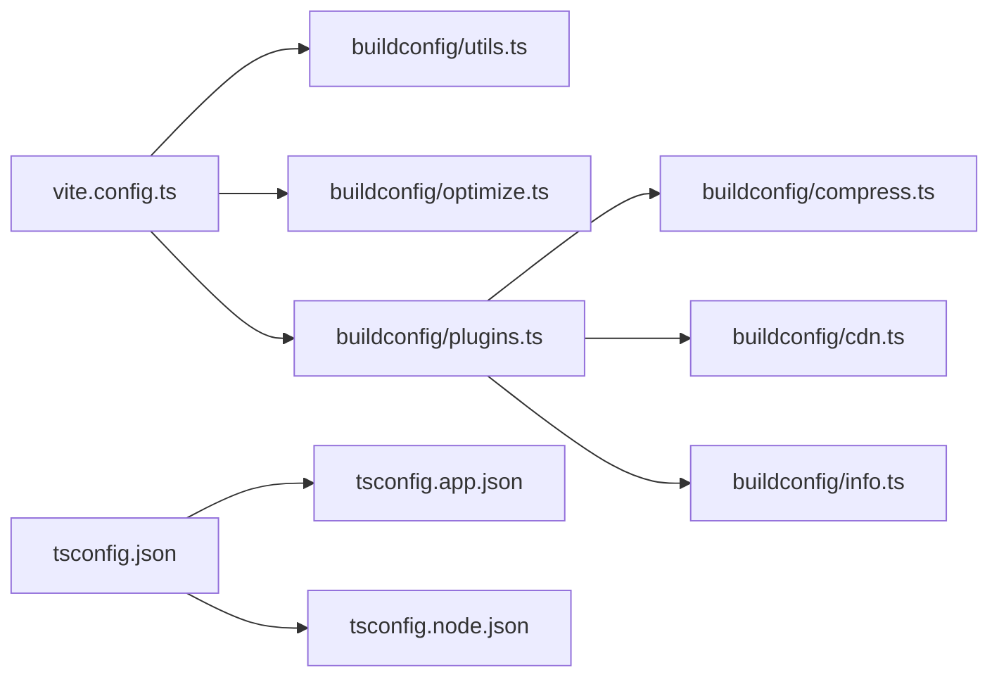

# 构建与优化

<cite>
**本文引用的文件**
- [client/web/package.json](file://client/web/package.json)
- [client/web/vite.config.ts](file://client/web/vite.config.ts)
- [client/web/tsconfig.json](file://client/web/tsconfig.json)
- [client/web/tsconfig.app.json](file://client/web/tsconfig.app.json)
- [client/web/tsconfig.node.json](file://client/web/tsconfig.node.json)
- [client/web/buildconfig/plugins.ts](file://client/web/buildconfig/plugins.ts)
- [client/web/buildconfig/optimize.ts](file://client/web/buildconfig/optimize.ts)
- [client/web/buildconfig/utils.ts](file://client/web/buildconfig/utils.ts)
- [client/web/buildconfig/compress.ts](file://client/web/buildconfig/compress.ts)
- [client/web/buildconfig/cdn.ts](file://client/web/buildconfig/cdn.ts)
- [client/web/buildconfig/info.ts](file://client/web/buildconfig/info.ts)
- [client/web/volar.config.js](file://client/web/volar.config.js)
- [client/web/components.d.ts](file://client/web/components.d.ts)
</cite>

## 目录
1. [引言](#引言)
2. [项目结构](#项目结构)
3. [核心组件](#核心组件)
4. [架构总览](#架构总览)
5. [详细组件分析](#详细组件分析)
6. [依赖关系分析](#依赖关系分析)
7. [性能考量](#性能考量)
8. [故障排查指南](#故障排查指南)
9. [结论](#结论)
10. [附录](#附录)

## 引言
本文件面向 Hoper Vue3 Web 应用的构建与优化，围绕 Vite 构建配置、插件体系与优化策略展开，系统阐述代码分割、懒加载与 Tree Shaking 的实现方式；深入解释 TypeScript 编译配置、类型声明与构建产物优化；覆盖开发环境配置、生产环境优化与性能监控方案，并提供构建脚本、打包分析与部署优化的最佳实践。

## 项目结构
该前端工程位于 client/web 目录，采用 Vite + Vue3 + TypeScript 技术栈，通过多份 tsconfig 实现应用与 Node 环境的分离编译，配合 buildconfig 下的工具与插件模块化管理构建流程。

图表来源
- [client/web/package.json:1-95](file://client/web/package.json#L1-L95)
- [client/web/vite.config.ts:1-69](file://client/web/vite.config.ts#L1-L69)
- [client/web/tsconfig.json:1-12](file://client/web/tsconfig.json#L1-L12)
- [client/web/tsconfig.app.json:1-46](file://client/web/tsconfig.app.json#L1-L46)
- [client/web/tsconfig.node.json:1-13](file://client/web/tsconfig.node.json#L1-L13)
- [client/web/buildconfig/plugins.ts:1-59](file://client/web/buildconfig/plugins.ts#L1-L59)
- [client/web/buildconfig/optimize.ts:1-25](file://client/web/buildconfig/optimize.ts#L1-L25)
- [client/web/buildconfig/utils.ts:1-106](file://client/web/buildconfig/utils.ts#L1-L106)
- [client/web/buildconfig/compress.ts:1-63](file://client/web/buildconfig/compress.ts#L1-L63)
- [client/web/buildconfig/cdn.ts:1-55](file://client/web/buildconfig/cdn.ts#L1-L55)
- [client/web/buildconfig/info.ts:1-53](file://client/web/buildconfig/info.ts#L1-L53)
- [client/web/volar.config.js:1-5](file://client/web/volar.config.js#L1-L5)
- [client/web/components.d.ts:1-38](file://client/web/components.d.ts#L1-L38)

章节来源
- [client/web/package.json:1-95](file://client/web/package.json#L1-L95)
- [client/web/vite.config.ts:1-69](file://client/web/vite.config.ts#L1-L69)
- [client/web/tsconfig.json:1-12](file://client/web/tsconfig.json#L1-L12)
- [client/web/tsconfig.app.json:1-46](file://client/web/tsconfig.app.json#L1-L46)
- [client/web/tsconfig.node.json:1-13](file://client/web/tsconfig.node.json#L1-L13)

## 核心组件
- Vite 主配置：集中定义基础路径、别名、服务器、插件、依赖预优化、构建目标与输出命名规则、define 常量等。
- 插件体系：通过 getPluginsList 统一装配，包括 Vue/JSX 支持、i18n、TailwindCSS、SVG 组件化、CDN、压缩、控制台清理、打包可视化等。
- 依赖预优化：optimizeDeps.include 显式声明需要预构建的依赖，optimizeDeps.exclude 排除无需预构建的图标库等。
- TypeScript 配置：复合 tsconfig，分别约束应用与 Node/构建环境，确保严格类型检查与模块解析一致性。
- 构建信息与压缩：viteBuildInfo 输出构建耗时与产物大小；configCompressPlugin 提供 gzip/brotli 双通道压缩。
- CDN 与产物命名：CDN 插件按外部依赖映射至公共 CDN；Rollup 输出按 JS/CSS/静态资源分类命名，便于缓存与分发。

章节来源
- [client/web/vite.config.ts:14-68](file://client/web/vite.config.ts#L14-L68)
- [client/web/buildconfig/plugins.ts:16-58](file://client/web/buildconfig/plugins.ts#L16-L58)
- [client/web/buildconfig/optimize.ts:7-24](file://client/web/buildconfig/optimize.ts#L7-L24)
- [client/web/tsconfig.app.json:9-44](file://client/web/tsconfig.app.json#L9-L44)
- [client/web/tsconfig.node.json:2-12](file://client/web/tsconfig.node.json#L2-L12)
- [client/web/buildconfig/compress.ts:4-62](file://client/web/buildconfig/compress.ts#L4-L62)
- [client/web/buildconfig/cdn.ts:8-54](file://client/web/buildconfig/cdn.ts#L8-L54)

## 架构总览
下图展示从命令行到最终产物的关键流程：脚本触发 Vite，加载环境变量与工具，装配插件，执行依赖预优化与构建，输出带哈希命名的资源文件。

图表来源
- [client/web/package.json:12-24](file://client/web/package.json#L12-L24)
- [client/web/vite.config.ts:14-68](file://client/web/vite.config.ts#L14-L68)
- [client/web/buildconfig/utils.ts:46-73](file://client/web/buildconfig/utils.ts#L46-L73)
- [client/web/buildconfig/plugins.ts:16-58](file://client/web/buildconfig/plugins.ts#L16-L58)
- [client/web/buildconfig/optimize.ts:7-24](file://client/web/buildconfig/optimize.ts#L7-L24)

## 详细组件分析

### Vite 主配置与环境变量
- 基础路径与别名：通过 utils.ts 中的 pathResolve 与 alias，统一管理根路径与模块别名，保证开发与构建一致。
- 服务器与预热：开启本地代理占位、warmup 预热关键页面与组件，减少首屏等待。
- 依赖预优化：include 显式列出常用库，exclude 排除图标库等按需引入模块，避免不必要的预构建。
- 构建目标与输出：目标为 ES2017，输出按 JS/CSS/静态资源分类命名，chunkSizeWarningLimit 提升大包容忍度。
- define 常量：注入应用信息与平台标识，便于运行时判断。

章节来源
- [client/web/vite.config.ts:14-68](file://client/web/vite.config.ts#L14-L68)
- [client/web/buildconfig/utils.ts:8-37](file://client/web/buildconfig/utils.ts#L8-L37)
- [client/web/buildconfig/optimize.ts:7-24](file://client/web/buildconfig/optimize.ts#L7-L24)

### 插件系统与优化策略
- Vue/JSX/i18n/Tailwind：提供语法与样式支持，按需启用。
- SVG 组件化：将 SVG 转换为 Vue 组件，便于复用与主题化。
- CDN：在生产模式下将部分外部依赖指向 CDN，降低主包体积。
- 压缩：支持 gzip 与 brotli，可同时启用或清理原文件。
- 控制台清理：线上环境移除 console，保留特定文件。
- 打包可视化：通过生命周期检测决定是否生成报告，辅助体积分析。
- 构建信息：记录开始与结束时间，统计产物大小并格式化输出。

图表来源
- [client/web/buildconfig/plugins.ts:16-58](file://client/web/buildconfig/plugins.ts#L16-L58)
- [client/web/buildconfig/compress.ts:4-62](file://client/web/buildconfig/compress.ts#L4-L62)
- [client/web/buildconfig/cdn.ts:8-54](file://client/web/buildconfig/cdn.ts#L8-L54)
- [client/web/buildconfig/info.ts:15-52](file://client/web/buildconfig/info.ts#L15-L52)

章节来源
- [client/web/buildconfig/plugins.ts:16-58](file://client/web/buildconfig/plugins.ts#L16-L58)
- [client/web/buildconfig/compress.ts:4-62](file://client/web/buildconfig/compress.ts#L4-L62)
- [client/web/buildconfig/cdn.ts:8-54](file://client/web/buildconfig/cdn.ts#L8-L54)
- [client/web/buildconfig/info.ts:15-52](file://client/web/buildconfig/info.ts#L15-L52)

### 依赖预优化与懒加载
- 预优化 include：将高频依赖纳入预构建，避免开发时重复转换与页面卡顿。
- 预优化 exclude：对图标库等按需引入模块排除，减少缓存压力与网络请求。
- 懒加载：通过路由与组件层面的动态导入实现按需加载，结合代码分割策略降低首屏体积。
- Tree Shaking：配合 ESModule 模块化与严格类型配置，确保未使用代码被移除。

章节来源
- [client/web/buildconfig/optimize.ts:7-24](file://client/web/buildconfig/optimize.ts#L7-L24)

### TypeScript 编译配置与类型声明
- 复合配置：tsconfig.json 引用应用与 Node 两套配置，隔离编译上下文。
- 应用配置：启用严格模式、ESNext 目标、Bundler 模块解析、装饰器实验特性、DOM/Worker 类库等。
- Node 配置：限定 Vite/TS 在 Node 环境的类型范围。
- 类型声明：Volar 配置与自动生成的 components.d.ts 提升组件智能感知与类型安全。

章节来源
- [client/web/tsconfig.json:1-12](file://client/web/tsconfig.json#L1-L12)
- [client/web/tsconfig.app.json:9-44](file://client/web/tsconfig.app.json#L9-L44)
- [client/web/tsconfig.node.json:2-12](file://client/web/tsconfig.node.json#L2-L12)
- [client/web/volar.config.js:1-5](file://client/web/volar.config.js#L1-L5)
- [client/web/components.d.ts:1-38](file://client/web/components.d.ts#L1-L38)

### 构建脚本与打包分析
- 脚本职责：dev/preview/build/build-only/type-check/lint/test:unit 等，覆盖开发、预览、构建、类型检查与单元测试。
- 打包分析：通过 report 生命周期触发可视化报告，结合压缩与 CDN 评估收益。
- PWA 与 Wasm：预留 PWA 插件与 wasm-pack 集成点，便于后续扩展。

章节来源
- [client/web/package.json:12-24](file://client/web/package.json#L12-L24)
- [client/web/buildconfig/plugins.ts:54-56](file://client/web/buildconfig/plugins.ts#L54-L56)

## 依赖关系分析
- 配置耦合：vite.config.ts 依赖 utils.ts 提供的环境封装与路径解析；optimize.ts 作为 optimizeDeps 的数据源；plugins.ts 统一装配各插件。
- 插件内聚：压缩、CDN、构建信息等插件通过工厂函数按条件启用，降低分支复杂度。
- 类型解耦：tsconfig.app.json 与 tsconfig.node.json 分离应用与构建类型边界，避免相互污染。

图表来源
- [client/web/vite.config.ts:14-68](file://client/web/vite.config.ts#L14-L68)
- [client/web/buildconfig/utils.ts:105-106](file://client/web/buildconfig/utils.ts#L105-L106)
- [client/web/buildconfig/optimize.ts:1-25](file://client/web/buildconfig/optimize.ts#L1-L25)
- [client/web/buildconfig/plugins.ts:1-59](file://client/web/buildconfig/plugins.ts#L1-L59)
- [client/web/buildconfig/compress.ts:1-63](file://client/web/buildconfig/compress.ts#L1-L63)
- [client/web/buildconfig/cdn.ts:1-55](file://client/web/buildconfig/cdn.ts#L1-L55)
- [client/web/buildconfig/info.ts:1-53](file://client/web/buildconfig/info.ts#L1-L53)
- [client/web/tsconfig.json:1-12](file://client/web/tsconfig.json#L1-L12)
- [client/web/tsconfig.app.json:1-46](file://client/web/tsconfig.app.json#L1-L46)
- [client/web/tsconfig.node.json:1-13](file://client/web/tsconfig.node.json#L1-L13)

## 性能考量
- 代码分割与懒加载：结合路由与组件动态导入，配合 Rollup 输出命名策略，最大化缓存命中与并行加载。
- Tree Shaking：保持 ESModule 导出、严格类型与无副作用模块标记，减少冗余代码。
- 依赖预优化：将高频依赖纳入 optimizeDeps.include，避免开发时重复转换。
- CDN 与压缩：生产环境启用 CDN 与压缩，显著降低传输体积；按需开启清理原文件策略。
- 构建监控：通过 viteBuildInfo 输出构建耗时与产物大小，指导持续优化。

## 故障排查指南
- 开发时页面切换卡顿：确认高频依赖是否已加入 optimizeDeps.include，避免禁用浏览器缓存时的重复预构建。
- i18n 资源未生效：检查 VueI18nPlugin 的 include 路径与 locales 结构是否匹配。
- SVG 组件无法识别：确认 vite-svg-loader 是否正确安装与启用。
- 压缩无效：核对 VITE_COMPRESSION 值与 configCompressPlugin 的参数组合。
- CDN 生效性：确认 VITE_CDN=true 且 CDN 源可用，注意 CSS 与 JS 的路径映射。
- 打包报告缺失：确保 npm 生命周期为 report 时才生成可视化报告。

章节来源
- [client/web/buildconfig/optimize.ts:7-24](file://client/web/buildconfig/optimize.ts#L7-L24)
- [client/web/buildconfig/plugins.ts:25-27](file://client/web/buildconfig/plugins.ts#L25-L27)
- [client/web/buildconfig/plugins.ts:47-47](file://client/web/buildconfig/plugins.ts#L47-L47)
- [client/web/buildconfig/compress.ts:4-62](file://client/web/buildconfig/compress.ts#L4-L62)
- [client/web/buildconfig/cdn.ts:8-54](file://client/web/buildconfig/cdn.ts#L8-L54)
- [client/web/buildconfig/plugins.ts:54-56](file://client/web/buildconfig/plugins.ts#L54-L56)

## 结论
本项目通过模块化的 Vite 配置与插件体系，实现了开发体验与生产性能的平衡。结合依赖预优化、CDN、压缩与可视化分析，能够有效控制首屏与整体体积；严格的 TypeScript 配置与类型声明进一步提升了可维护性与安全性。建议在后续迭代中持续关注打包报告与缓存策略，配合懒加载与 Tree Shaking，实现更优的用户体验与可观测性。

## 附录
- 最佳实践清单
  - 开发：启用 optimizeDeps.include，合理使用 warmup 与预热；关闭压缩与 CDN，聚焦功能验证。
  - 预览/生产：开启 CDN 与压缩，按需清理原文件；定期生成打包报告，识别体积回归。
  - 构建：统一使用 build-only 与 type-check，确保类型安全与产物质量。
  - 部署：基于 Rollup 输出命名策略进行静态资源缓存与分发；结合 PWA 与 CDN 提升访问速度。