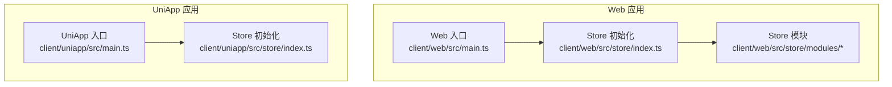
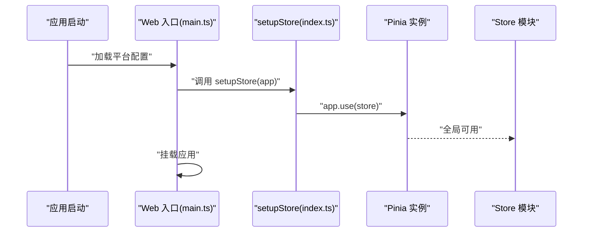
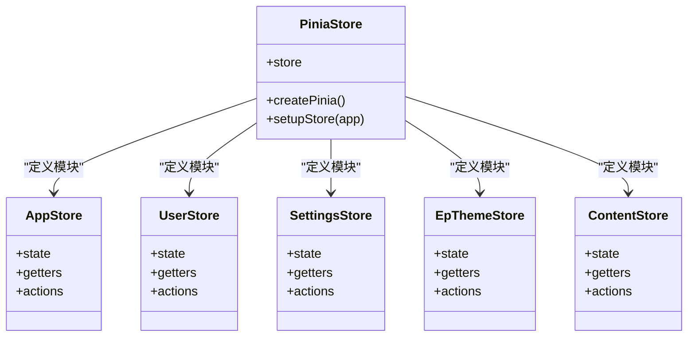
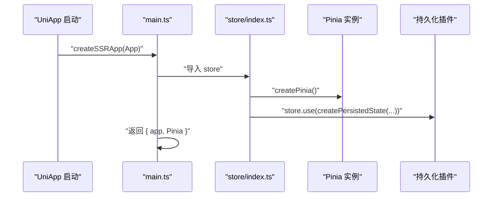
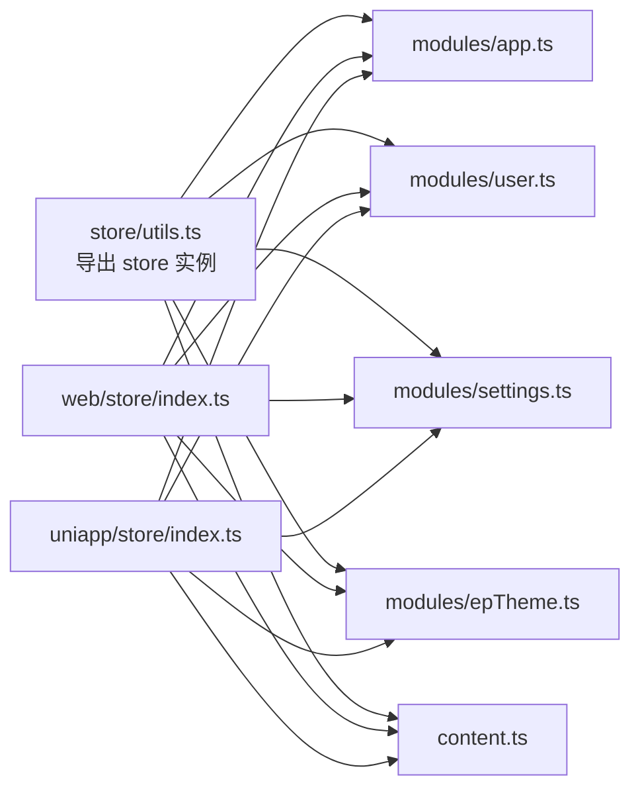

# Pinia Store 初始化配置

<cite>
**本文档引用的文件**
- [client/web/src/store/index.ts](file://client/web/src/store/index.ts)
- [client/web/src/main.ts](file://client/web/src/main.ts)
- [client/uniapp/src/store/index.ts](file://client/uniapp/src/store/index.ts)
- [client/uniapp/src/main.ts](file://client/uniapp/src/main.ts)
- [client/web/src/store/modules/app.ts](file://client/web/src/store/modules/app.ts)
- [client/web/src/store/modules/user.ts](file://client/web/src/store/modules/user.ts)
- [client/web/src/store/modules/settings.ts](file://client/web/src/store/modules/settings.ts)
- [client/web/src/store/modules/epTheme.ts](file://client/web/src/store/modules/epTheme.ts)
- [client/web/src/store/content.ts](file://client/web/src/store/content.ts)
- [client/web/src/store/utils.ts](file://client/web/src/store/utils.ts)
</cite>

## 目录
1. [简介](#简介)
2. [项目结构](#项目结构)
3. [核心组件](#核心组件)
4. [架构总览](#架构总览)
5. [详细组件分析](#详细组件分析)
6. [依赖关系分析](#依赖关系分析)
7. [性能考虑](#性能考虑)
8. [故障排除指南](#故障排除指南)
9. [结论](#结论)
10. [附录](#附录)

## 简介
本文件聚焦于 Hoper 项目中基于 Pinia 的前端状态管理初始化与配置，系统性阐述以下主题：
- createPinia() 的创建过程与全局状态管理器的设置
- setupStore 函数在 Vue 应用中的注册机制
- store 实例的生命周期管理与应用启动时的状态初始化流程
- 针对 Web 与 UniApp 平台的差异化配置策略
- 开发与生产环境的最佳实践与配置建议

## 项目结构
Hoper 项目包含两套前端应用：Web 应用与 UniApp 应用。两者均采用 Pinia 进行状态管理，但存在平台差异化的初始化方式。

- Web 应用（Vue 3）
  - store 初始化位于 [client/web/src/store/index.ts](file://client/web/src/store/index.ts)，通过 createPinia() 创建全局状态管理器，并导出 setupStore(app) 用于在应用启动时注册。
  - 应用入口 [client/web/src/main.ts](file://client/web/src/main.ts) 在平台配置加载完成后，调用 setupStore 注册 Pinia 插件并挂载应用。
  - store 模块按功能拆分，如应用状态、用户状态、主题与设置等，分别位于 [client/web/src/store/modules/](file://client/web/src/store/modules/)。

- UniApp 应用
  - store 初始化位于 [client/uniapp/src/store/index.ts](file://client/uniapp/src/store/index.ts)，在 createPinia() 基础上启用持久化插件，配置存储后端为 uni 的本地存储 API。
  - 应用入口 [client/uniapp/src/main.ts](file://client/uniapp/src/main.ts) 使用 SSR 入口创建应用，显式调用 app.use(store) 注册 Pinia，并返回 Pinia 对象供框架使用。

**图表来源**
- [client/web/src/main.ts:1-63](file://client/web/src/main.ts#L1-L63)
- [client/web/src/store/index.ts:1-10](file://client/web/src/store/index.ts#L1-L10)
- [client/uniapp/src/main.ts:1-22](file://client/uniapp/src/main.ts#L1-L22)
- [client/uniapp/src/store/index.ts:1-13](file://client/uniapp/src/store/index.ts#L1-L13)

**章节来源**
- [client/web/src/store/index.ts:1-10](file://client/web/src/store/index.ts#L1-L10)
- [client/web/src/main.ts:1-63](file://client/web/src/main.ts#L1-L63)
- [client/uniapp/src/store/index.ts:1-13](file://client/uniapp/src/store/index.ts#L1-L13)
- [client/uniapp/src/main.ts:1-22](file://client/uniapp/src/main.ts#L1-L22)

## 核心组件
本节聚焦于 Pinia Store 的初始化与注册流程，涵盖 createPinia() 的创建、全局状态管理器的配置、以及在不同平台上的注册方式。

- createPinia() 创建过程
  - Web 平台：在 [client/web/src/store/index.ts:2-3](file://client/web/src/store/index.ts#L2-L3) 中调用 createPinia() 创建全局状态管理器实例，并导出 store。
  - UniApp 平台：在 [client/uniapp/src/store/index.ts:1-4](file://client/uniapp/src/store/index.ts#L1-L4) 同样调用 createPinia() 创建实例；随后通过 store.use(...) 安装持久化插件。

- setupStore 函数机制
  - Web 平台：在 [client/web/src/store/index.ts:5-7](file://client/web/src/store/index.ts#L5-L7) 定义 setupStore(app)，接收 Vue 应用实例并调用 app.use(store) 完成插件注册。
  - 应用入口：在 [client/web/src/main.ts:54-59](file://client/web/src/main.ts#L54-L59) 中，平台配置加载完成后调用 setupStore(app) 注册 Pinia 插件，确保在路由与国际化等其他插件之前完成注册。

- 生命周期与启动流程
  - Web 启动顺序：入口文件先获取平台配置，再注册 Pinia，最后挂载应用，保证 store 在整个应用生命周期内可用。
  - UniApp 启动顺序：入口函数返回 app 与 Pinia 对象，由框架负责后续注册与运行时管理。

**章节来源**
- [client/web/src/store/index.ts:1-10](file://client/web/src/store/index.ts#L1-L10)
- [client/web/src/main.ts:54-59](file://client/web/src/main.ts#L54-L59)
- [client/uniapp/src/store/index.ts:1-13](file://client/uniapp/src/store/index.ts#L1-L13)
- [client/uniapp/src/main.ts:11-21](file://client/uniapp/src/main.ts#L11-L21)

## 架构总览
下图展示了 Web 与 UniApp 两种平台下 Pinia 初始化与注册的关键交互：

**图表来源**
- [client/web/src/main.ts:54-59](file://client/web/src/main.ts#L54-L59)
- [client/web/src/store/index.ts:5-7](file://client/web/src/store/index.ts#L5-L7)

**章节来源**
- [client/web/src/main.ts:54-59](file://client/web/src/main.ts#L54-L59)
- [client/web/src/store/index.ts:5-7](file://client/web/src/store/index.ts#L5-L7)

## 详细组件分析

### Web 平台 Store 初始化与注册
- 初始化文件 [client/web/src/store/index.ts:1-10](file://client/web/src/store/index.ts#L1-L10)
  - createPinia() 创建全局状态管理器
  - 导出 setupStore(app) 用于在应用启动时注册 Pinia 插件
  - 导出 store 实例供模块与入口文件使用

- 入口文件 [client/web/src/main.ts:1-63](file://client/web/src/main.ts#L1-L63)
  - 平台配置加载完成后，调用 app.use(store) 注册 Pinia
  - 在注册路由与国际化等插件之前完成 Pinia 注册，确保模块可访问全局 store

- 模块化 store 设计
  - 应用状态：[client/web/src/store/modules/app.ts:12-81](file://client/web/src/store/modules/app.ts#L12-L81)
  - 用户状态：[client/web/src/store/modules/user.ts:13-92](file://client/web/src/store/modules/user.ts#L13-L92)
  - 设置状态：[client/web/src/store/modules/settings.ts:5-32](file://client/web/src/store/modules/settings.ts#L5-L32)
  - 主题状态：[client/web/src/store/modules/epTheme.ts:9-43](file://client/web/src/store/modules/epTheme.ts#L9-L43)
  - 内容状态：[client/web/src/store/content.ts:30-34](file://client/web/src/store/content.ts#L30-L34)

**图表来源**
- [client/web/src/store/index.ts:1-10](file://client/web/src/store/index.ts#L1-L10)
- [client/web/src/store/modules/app.ts:12-81](file://client/web/src/store/modules/app.ts#L12-L81)
- [client/web/src/store/modules/user.ts:13-92](file://client/web/src/store/modules/user.ts#L13-L92)
- [client/web/src/store/modules/settings.ts:5-32](file://client/web/src/store/modules/settings.ts#L5-L32)
- [client/web/src/store/modules/epTheme.ts:9-43](file://client/web/src/store/modules/epTheme.ts#L9-L43)
- [client/web/src/store/content.ts:30-34](file://client/web/src/store/content.ts#L30-L34)

**章节来源**
- [client/web/src/store/index.ts:1-10](file://client/web/src/store/index.ts#L1-L10)
- [client/web/src/main.ts:54-59](file://client/web/src/main.ts#L54-L59)
- [client/web/src/store/modules/app.ts:12-81](file://client/web/src/store/modules/app.ts#L12-L81)
- [client/web/src/store/modules/user.ts:13-92](file://client/web/src/store/modules/user.ts#L13-L92)
- [client/web/src/store/modules/settings.ts:5-32](file://client/web/src/store/modules/settings.ts#L5-L32)
- [client/web/src/store/modules/epTheme.ts:9-43](file://client/web/src/store/modules/epTheme.ts#L9-L43)
- [client/web/src/store/content.ts:30-34](file://client/web/src/store/content.ts#L30-L34)

### UniApp 平台 Store 初始化与持久化
- 初始化文件 [client/uniapp/src/store/index.ts:1-13](file://client/uniapp/src/store/index.ts#L1-L13)
  - createPinia() 创建全局状态管理器
  - 通过 store.use(createPersistedState(...)) 安装持久化插件，存储后端使用 uni 的本地存储 API

- 入口文件 [client/uniapp/src/main.ts:1-22](file://client/uniapp/src/main.ts#L1-L22)
  - 使用 SSR 入口创建应用，显式调用 app.use(store) 注册 Pinia
  - 返回 Pinia 对象供框架使用

**图表来源**
- [client/uniapp/src/store/index.ts:1-13](file://client/uniapp/src/store/index.ts#L1-L13)
- [client/uniapp/src/main.ts:11-21](file://client/uniapp/src/main.ts#L11-L21)

**章节来源**
- [client/uniapp/src/store/index.ts:1-13](file://client/uniapp/src/store/index.ts#L1-L13)
- [client/uniapp/src/main.ts:11-21](file://client/uniapp/src/main.ts#L11-L21)

### Store 模块生命周期与状态初始化
- 状态初始化策略
  - Web 平台：store 模块通过 defineStore 定义 state、getters 与 actions，在应用启动时由 Pinia 自动初始化。部分模块从本地存储或配置中心读取初始值，例如应用侧边栏状态、布局与主题颜色等。
  - UniApp 平台：由于已启用持久化插件，store 状态在页面刷新或应用重启后可从本地存储恢复。

- 生命周期管理
  - Web 平台：store 实例随应用实例创建而创建，随应用卸载而销毁；模块内部通过 actions 与 getters 维护状态变更与派生状态。
  - UniApp 平台：store 实例同样随应用生命周期管理，持久化插件确保跨会话状态恢复。

**章节来源**
- [client/web/src/store/modules/app.ts:13-32](file://client/web/src/store/modules/app.ts#L13-L32)
- [client/web/src/store/modules/epTheme.ts:10-17](file://client/web/src/store/modules/epTheme.ts#L10-L17)
- [client/uniapp/src/store/index.ts:5-12](file://client/uniapp/src/store/index.ts#L5-L12)

## 依赖关系分析
- 模块间依赖
  - store/utils.ts 将 store 实例导出，供各模块通过统一入口使用，避免循环依赖。
  - 各模块通过 defineStore 定义自身状态与行为，彼此解耦。

- 平台差异依赖
  - Web 平台：通过 setupStore 注册 Pinia，无需额外插件即可使用。
  - UniApp 平台：通过持久化插件实现跨会话状态保持。

**图表来源**
- [client/web/src/store/utils.ts:1-4](file://client/web/src/store/utils.ts#L1-L4)
- [client/web/src/store/modules/app.ts:1-10](file://client/web/src/store/modules/app.ts#L1-L10)
- [client/web/src/store/modules/user.ts:1-10](file://client/web/src/store/modules/user.ts#L1-L10)
- [client/web/src/store/modules/settings.ts:1-5](file://client/web/src/store/modules/settings.ts#L1-L5)
- [client/web/src/store/modules/epTheme.ts:1-7](file://client/web/src/store/modules/epTheme.ts#L1-L7)
- [client/web/src/store/content.ts:1-12](file://client/web/src/store/content.ts#L1-L12)
- [client/web/src/store/index.ts:1-10](file://client/web/src/store/index.ts#L1-L10)
- [client/uniapp/src/store/index.ts:1-13](file://client/uniapp/src/store/index.ts#L1-L13)

**章节来源**
- [client/web/src/store/utils.ts:1-4](file://client/web/src/store/utils.ts#L1-L4)
- [client/web/src/store/index.ts:1-10](file://client/web/src/store/index.ts#L1-L10)
- [client/uniapp/src/store/index.ts:1-13](file://client/uniapp/src/store/index.ts#L1-L13)

## 性能考虑
- 持久化策略
  - UniApp 平台已启用持久化插件，减少重复初始化成本；Web 平台可根据业务需求引入持久化以提升用户体验。
- 模块拆分
  - 将状态按功能拆分为多个模块，降低单个 store 的复杂度，便于维护与性能优化。
- 初始化时机
  - 在平台配置加载完成后注册 Pinia，避免不必要的等待时间；确保在路由与国际化等插件之前完成注册。

## 故障排除指南
- Pinia 未注册问题
  - 确认入口文件中已调用 setupStore 或 app.use(store)，且在挂载前完成注册。
  - 参考路径：[client/web/src/main.ts:54-59](file://client/web/src/main.ts#L54-L59)、[client/web/src/store/index.ts:5-7](file://client/web/src/store/index.ts#L5-L7)

- 持久化失效
  - 检查持久化插件安装与存储后端配置是否正确。
  - 参考路径：[client/uniapp/src/store/index.ts:5-12](file://client/uniapp/src/store/index.ts#L5-L12)

- 模块状态未初始化
  - 确认 defineStore 的 state 是否正确返回初始值，必要时从本地存储或配置中心读取默认值。
  - 参考路径：[client/web/src/store/modules/app.ts:13-32](file://client/web/src/store/modules/app.ts#L13-L32)、[client/web/src/store/modules/epTheme.ts:10-17](file://client/web/src/store/modules/epTheme.ts#L10-L17)

**章节来源**
- [client/web/src/main.ts:54-59](file://client/web/src/main.ts#L54-L59)
- [client/web/src/store/index.ts:5-7](file://client/web/src/store/index.ts#L5-L7)
- [client/uniapp/src/store/index.ts:5-12](file://client/uniapp/src/store/index.ts#L5-L12)
- [client/web/src/store/modules/app.ts:13-32](file://client/web/src/store/modules/app.ts#L13-L32)
- [client/web/src/store/modules/epTheme.ts:10-17](file://client/web/src/store/modules/epTheme.ts#L10-L17)

## 结论
Hoper 项目在 Web 与 UniApp 平台上均采用 Pinia 进行状态管理，通过 createPinia() 创建全局状态管理器，并在应用启动阶段完成注册。Web 平台通过 setupStore 提供统一注册入口，UniApp 平台则通过持久化插件增强跨会话状态保持能力。模块化设计使状态管理清晰、可维护，并可根据业务场景扩展持久化与性能优化策略。

## 附录
- 配置示例与最佳实践
  - 开发环境
    - Web：保持现有初始化流程，确保在入口文件中尽早注册 Pinia。
    - UniApp：维持持久化插件配置，确保本地存储 API 正常工作。
  - 生产环境
    - Web：根据业务需要引入持久化插件，避免敏感信息被持久化；对大对象状态进行分片存储。
    - UniApp：结合平台特性，合理设置持久化键名与过期策略，减少存储占用。