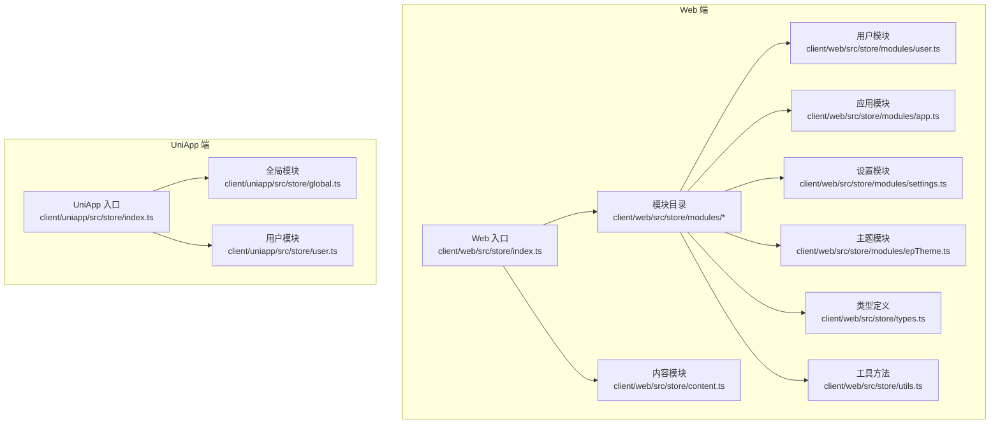
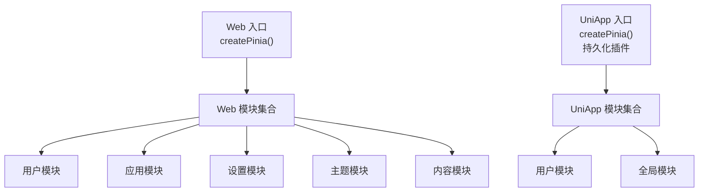
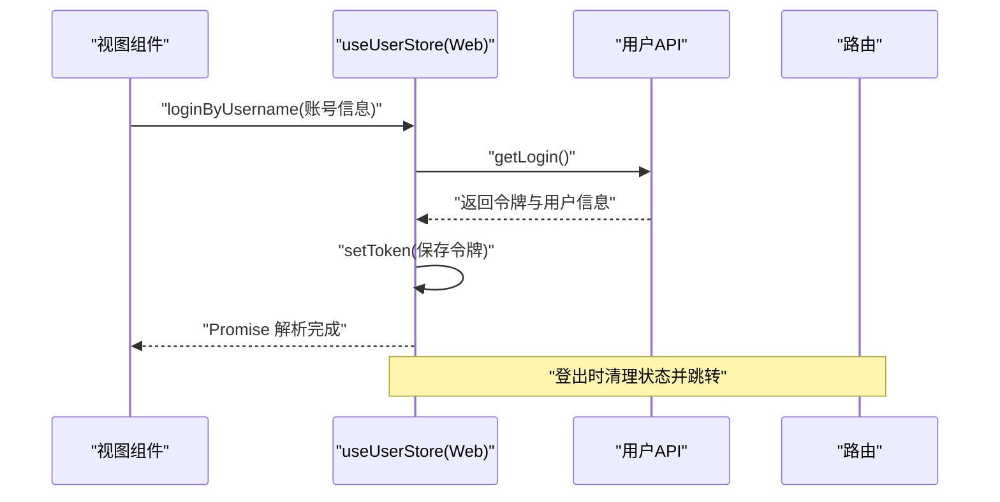
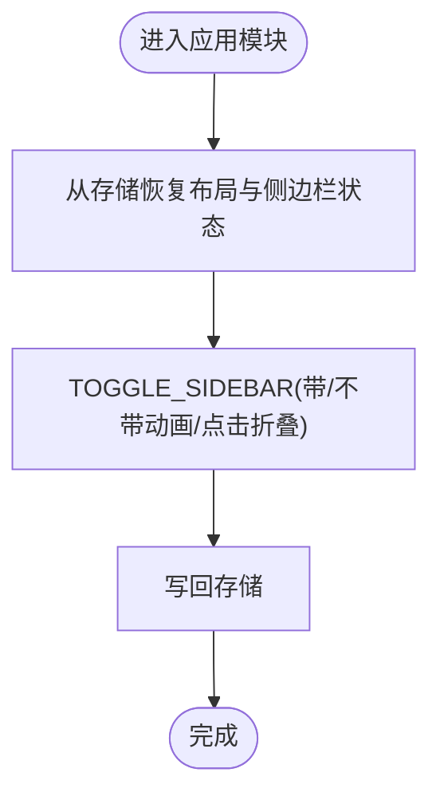
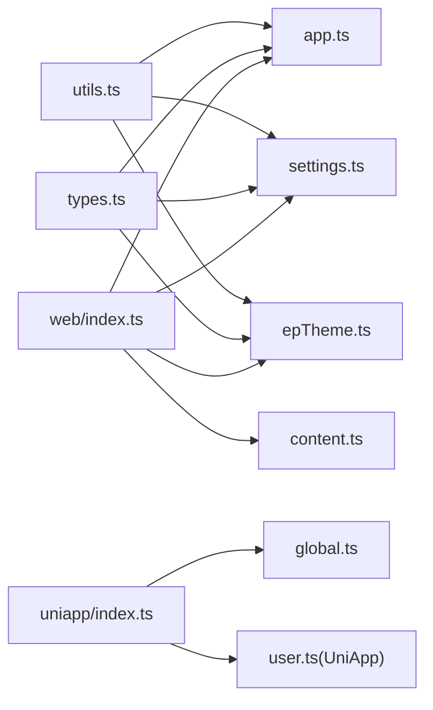

# Store 模块化设计

<cite>
**本文档引用的文件**
- [index.ts](file://client/web/src/store/index.ts)
- [index.ts](file://client/uniapp/src/store/index.ts)
- [user.ts](file://client/web/src/store/modules/user.ts)
- [app.ts](file://client/web/src/store/modules/app.ts)
- [settings.ts](file://client/web/src/store/modules/settings.ts)
- [epTheme.ts](file://client/web/src/store/modules/epTheme.ts)
- [content.ts](file://client/web/src/store/content.ts)
- [user.ts](file://client/web/src/store/user.ts)
- [types.ts](file://client/web/src/store/types.ts)
- [utils.ts](file://client/web/src/store/utils.ts)
- [user.ts](file://client/uniapp/src/store/user.ts)
- [global.ts](file://client/uniapp/src/store/global.ts)
</cite>

## 目录
1. [简介](#简介)
2. [项目结构](#项目结构)
3. [核心组件](#核心组件)
4. [架构总览](#架构总览)
5. [详细组件分析](#详细组件分析)
6. [依赖关系分析](#依赖关系分析)
7. [性能考量](#性能考量)
8. [故障排查指南](#故障排查指南)
9. [结论](#结论)
10. [附录](#附录)

## 简介
本文件面向 Hoper 项目的前端 Store 模块化设计，系统性阐述基于 Pinia 的模块化架构：如何通过模块边界实现解耦、如何进行状态隔离、如何在多端（Web/UniApp）统一管理状态，并给出模块命名规范、文件组织结构、模块间通信方式以及最佳实践（状态定义、Action 设计、Getters 实现）。文档同时结合实际源码位置，提供可直接定位到实现的参考路径。

## 项目结构
Hoper 前端在 Web 与 UniApp 两端均采用 Pinia 管理全局状态，并按功能域拆分为多个模块。Web 端采用模块化目录组织，UniApp 端同样提供模块化 store；两者共享统一的初始化入口与部分工具方法。

**图表来源**
- [index.ts:1-10](file://client/web/src/store/index.ts#L1-L10)
- [index.ts:1-13](file://client/uniapp/src/store/index.ts#L1-L13)
- [user.ts:1-93](file://client/web/src/store/modules/user.ts#L1-L93)
- [app.ts:1-86](file://client/web/src/store/modules/app.ts#L1-L86)
- [settings.ts:1-37](file://client/web/src/store/modules/settings.ts#L1-L37)
- [epTheme.ts:1-48](file://client/web/src/store/modules/epTheme.ts#L1-L48)
- [content.ts:1-48](file://client/web/src/store/content.ts#L1-L48)
- [types.ts:1-38](file://client/web/src/store/types.ts#L1-L38)
- [utils.ts:1-7](file://client/web/src/store/utils.ts#L1-L7)
- [global.ts:1-28](file://client/uniapp/src/store/global.ts#L1-L28)
- [user.ts:1-86](file://client/uniapp/src/store/user.ts#L1-L86)

**章节来源**
- [index.ts:1-10](file://client/web/src/store/index.ts#L1-L10)
- [index.ts:1-13](file://client/uniapp/src/store/index.ts#L1-L13)

## 核心组件
- Web 入口与初始化
  - Web 端通过入口文件创建 Pinia 实例并挂载至应用，确保全局状态可用。
  - UniApp 端在入口处启用 Pinia 并配置持久化插件，以实现跨页面/重启的数据保留。
- 模块化目录
  - Web 端将通用业务模块置于 modules 目录，如 user、app、settings、epTheme 等，便于按功能域维护。
- 类型与工具
  - 统一的类型定义文件与工具方法，保证模块间契约一致与复用。

**章节来源**
- [index.ts:1-10](file://client/web/src/store/index.ts#L1-L10)
- [index.ts:1-13](file://client/uniapp/src/store/index.ts#L1-L13)
- [types.ts:1-38](file://client/web/src/store/types.ts#L1-L38)
- [utils.ts:1-7](file://client/web/src/store/utils.ts#L1-L7)

## 架构总览
Hoper Store 采用“入口统一、模块自治”的架构：入口负责实例化与插件装配，模块各自封装状态、Getter、Action，并通过 Pinia 的模块注册机制实现解耦与隔离。Web 与 UniApp 在入口与持久化策略上存在差异，但模块化思想一致。

**图表来源**
- [index.ts:1-10](file://client/web/src/store/index.ts#L1-L10)
- [index.ts:1-13](file://client/uniapp/src/store/index.ts#L1-L13)
- [user.ts:1-93](file://client/web/src/store/modules/user.ts#L1-L93)
- [app.ts:1-86](file://client/web/src/store/modules/app.ts#L1-L86)
- [settings.ts:1-37](file://client/web/src/store/modules/settings.ts#L1-L37)
- [epTheme.ts:1-48](file://client/web/src/store/modules/epTheme.ts#L1-L48)
- [content.ts:1-48](file://client/web/src/store/content.ts#L1-L48)
- [user.ts:1-86](file://client/uniapp/src/store/user.ts#L1-L86)
- [global.ts:1-28](file://client/uniapp/src/store/global.ts#L1-L28)

## 详细组件分析

### 用户模块（Web）
- 功能定位
  - 负责用户登录态、角色与权限、头像与姓名等信息的存储与更新。
- 状态定义
  - 使用类型安全的 UserInfo 结构，初始值从本地存储恢复，保障刷新后状态不丢失。
- Getters
  - 提供派生状态访问，如用户 ID、角色列表、权限集合等。
- Action
  - 登录、登出、刷新 Token 等核心流程，均通过异步 Action 封装网络请求与状态变更。
- 与路由/鉴权联动
  - 登出后重定向至登录页，刷新 Token 成功后更新本地令牌。

**图表来源**
- [user.ts:50-86](file://client/web/src/store/modules/user.ts#L50-L86)

**章节来源**
- [user.ts:1-93](file://client/web/src/store/modules/user.ts#L1-L93)

### 应用模块（Web）
- 功能定位
  - 管理侧边栏开关、布局模式、设备类型、视口尺寸等应用级状态。
- 状态与持久化
  - 侧边栏状态与布局配置通过本地存储持久化，启动时从存储恢复。
- Getters
  - 提供侧边栏开关状态、设备类型、视口宽高等只读派生状态。
- Action
  - 提供切换侧边栏、设置布局、设置设备类型、设置视口尺寸等动作。

**图表来源**
- [app.ts:47-80](file://client/web/src/store/modules/app.ts#L47-L80)

**章节来源**
- [app.ts:1-86](file://client/web/src/store/modules/app.ts#L1-L86)
- [types.ts:13-23](file://client/web/src/store/types.ts#L13-L23)
- [utils.ts:1-7](file://client/web/src/store/utils.ts#L1-L7)

### 设置模块（Web）
- 功能定位
  - 管理标题、固定头部、隐藏侧边栏等界面设置项。
- 设计要点
  - 通过统一的 CHANGE_SETTING 动作批量修改设置，避免分散的状态更新点。

**章节来源**
- [settings.ts:1-37](file://client/web/src/store/modules/settings.ts#L1-L37)
- [types.ts:33-38](file://client/web/src/store/types.ts#L33-L38)

### 主题模块（Web）
- 功能定位
  - 管理 Element Plus 主题色与主题风格，并根据主题自动计算 SVG 填充色。
- 设计要点
  - 主题色与主题风格从存储或配置恢复，支持运行时更新并持久化。

**章节来源**
- [epTheme.ts:1-48](file://client/web/src/store/modules/epTheme.ts#L1-L48)

### 内容模块（Web）
- 功能定位
  - 集中管理 moment、note、diary、收藏、评论等与内容相关状态。
- 设计要点
  - 提供基础的 Getter 与占位的 mutations 数组，便于后续扩展。

**章节来源**
- [content.ts:1-48](file://client/web/src/store/content.ts#L1-L48)

### 用户模块（Web 旧版）
- 功能定位
  - 早期用户态管理，包含认证缓存、登录/注册、用户批量加载等。
- 设计要点
  - 使用 Map 缓存用户信息，减少重复请求；通过 axios 默认头传递令牌。

**章节来源**
- [user.ts:1-92](file://client/web/src/store/user.ts#L1-L92)

### 用户模块（UniApp）
- 功能定位
  - 适配 UniApp 平台的用户态管理，使用平台存储与网络客户端。
- 设计要点
  - 使用平台存储 API 保存令牌；通过服务层封装登录/注册流程。

**章节来源**
- [user.ts:1-86](file://client/uniapp/src/store/user.ts#L1-L86)

### 全局模块（UniApp）
- 功能定位
  - 提供计数器与平台信息等基础全局状态，演示最小化模块设计。

**章节来源**
- [global.ts:1-28](file://client/uniapp/src/store/global.ts#L1-L28)

## 依赖关系分析
- 入口依赖
  - Web 与 UniApp 的入口分别负责创建 Pinia 实例与插件装配。
- 模块内聚
  - 各模块围绕单一职责聚合状态、Getter、Action，降低耦合度。
- 工具与类型
  - 模块通过 utils 与 types 获取配置与类型约束，保持一致性。
- 外部集成
  - Web 用户模块依赖路由与鉴权工具；UniApp 用户模块依赖平台存储与服务层。

**图表来源**
- [utils.ts:1-7](file://client/web/src/store/utils.ts#L1-L7)
- [types.ts:1-38](file://client/web/src/store/types.ts#L1-L38)
- [index.ts:1-10](file://client/web/src/store/index.ts#L1-L10)
- [index.ts:1-13](file://client/uniapp/src/store/index.ts#L1-L13)
- [app.ts:1-86](file://client/web/src/store/modules/app.ts#L1-L86)
- [settings.ts:1-37](file://client/web/src/store/modules/settings.ts#L1-L37)
- [epTheme.ts:1-48](file://client/web/src/store/modules/epTheme.ts#L1-L48)
- [content.ts:1-48](file://client/web/src/store/content.ts#L1-L48)
- [global.ts:1-28](file://client/uniapp/src/store/global.ts#L1-L28)
- [user.ts:1-86](file://client/uniapp/src/store/user.ts#L1-L86)

**章节来源**
- [utils.ts:1-7](file://client/web/src/store/utils.ts#L1-L7)
- [types.ts:1-38](file://client/web/src/store/types.ts#L1-L38)
- [index.ts:1-10](file://client/web/src/store/index.ts#L1-L10)
- [index.ts:1-13](file://client/uniapp/src/store/index.ts#L1-L13)

## 性能考量
- 状态粒度
  - 将高频更新与低频更新拆分到不同模块或子状态，避免不必要的响应式开销。
- 缓存与去重
  - 对用户、评论等可复用数据采用 Map 缓存，结合批量加载减少重复请求。
- 持久化策略
  - 仅对必要状态启用持久化，控制存储体积与读写频率。
- 异步 Action
  - 将网络请求与状态更新封装在 Action 中，避免在组件中直接发起副作用。

## 故障排查指南
- 登录后状态未更新
  - 检查登录 Action 是否正确保存令牌与用户信息，确认路由跳转逻辑。
- 侧边栏状态未持久化
  - 核对存储键名与命名空间，确认切换动作是否写回存储。
- 主题色不生效
  - 检查主题模块是否正确读取存储与配置，确认更新后是否写回存储。
- UniApp 登录失败
  - 核对平台存储 API 使用与服务层返回码，检查默认请求头设置。

**章节来源**
- [user.ts:50-86](file://client/web/src/store/modules/user.ts#L50-L86)
- [app.ts:47-80](file://client/web/src/store/modules/app.ts#L47-L80)
- [epTheme.ts:31-42](file://client/web/src/store/modules/epTheme.ts#L31-L42)
- [user.ts:38-54](file://client/uniapp/src/store/user.ts#L38-L54)

## 结论
Hoper 的 Store 模块化设计以 Pinia 为核心，通过入口统一、模块自治、类型与工具支撑，实现了良好的解耦与可维护性。Web 与 UniApp 在入口与持久化策略上各有侧重，但模块化思想一致。建议在新增模块时遵循本文档的命名规范、文件组织与设计原则，确保状态定义清晰、Action 设计稳健、Getters 提供高效派生。

## 附录

### 命名规范与文件组织
- 模块命名
  - 使用领域名称（如 user、app、settings、epTheme、content）作为模块名，语义明确。
- 文件组织
  - Web：modules 目录集中存放业务模块；根目录存放通用模块与入口。
  - UniApp：模块文件与入口同目录，便于平台适配。
- 类型与工具
  - types.ts 统一导出模块所需类型；utils.ts 提供跨模块共享的工具方法。

**章节来源**
- [types.ts:1-38](file://client/web/src/store/types.ts#L1-L38)
- [utils.ts:1-7](file://client/web/src/store/utils.ts#L1-L7)

### 模块间通信方式
- 直接依赖
  - 模块内部通过 defineStore 返回的 Hook 直接访问自身状态与方法。
- 入口注入
  - 通过入口文件创建并注入 Pinia 实例，确保模块可被应用使用。
- 平台差异
  - UniApp 通过持久化插件实现跨页面/重启状态保留；Web 端通过本地存储恢复。

**章节来源**
- [index.ts:1-10](file://client/web/src/store/index.ts#L1-L10)
- [index.ts:1-13](file://client/uniapp/src/store/index.ts#L1-L13)

### 最佳实践清单
- 状态定义
  - 明确初始值来源（本地存储/配置），保证刷新后状态一致。
- Action 设计
  - 将网络请求与状态更新封装在 Action 中，提供错误处理与回滚策略。
- Getters 实现
  - 优先使用派生状态，避免在组件中重复计算。
- 模块拆分
  - 按功能域拆分模块，避免“上帝模块”；对跨模块共享逻辑抽取为工具或服务。
- 持久化策略
  - 仅对必要状态持久化，控制键名与命名空间，避免存储污染。