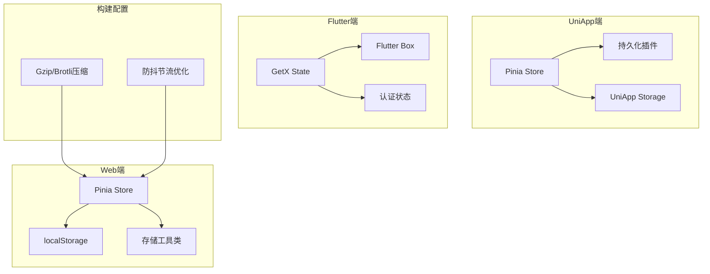
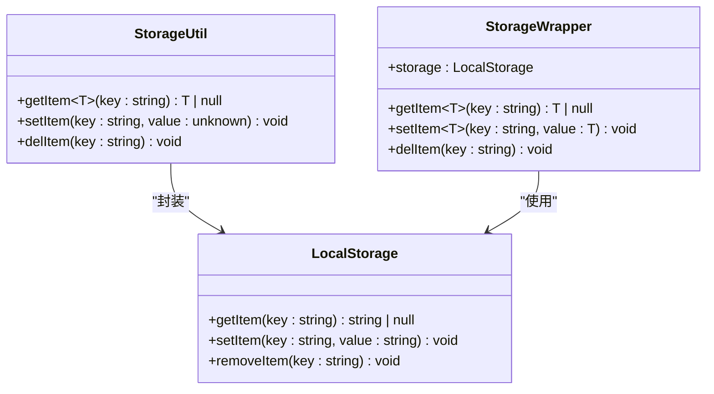
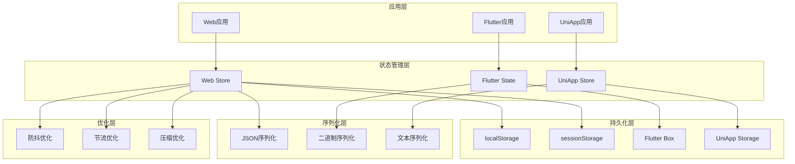
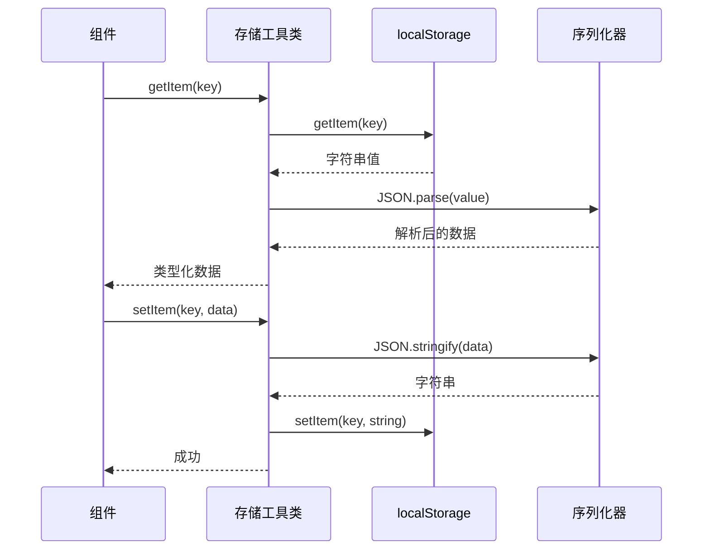
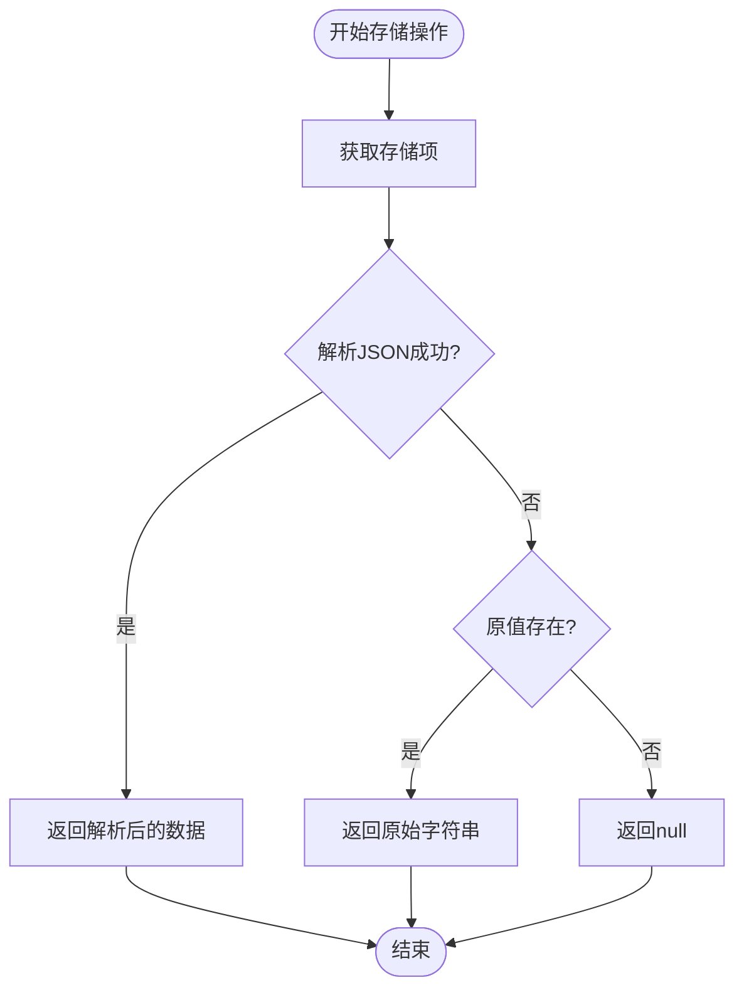
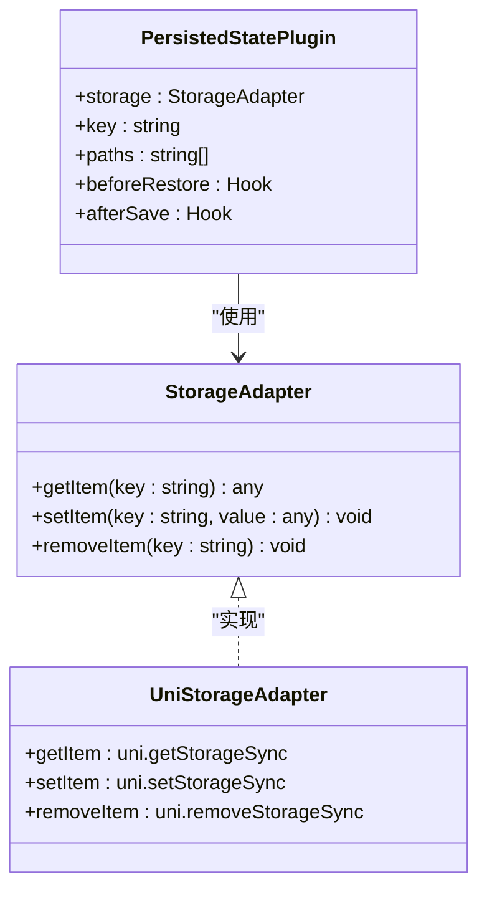
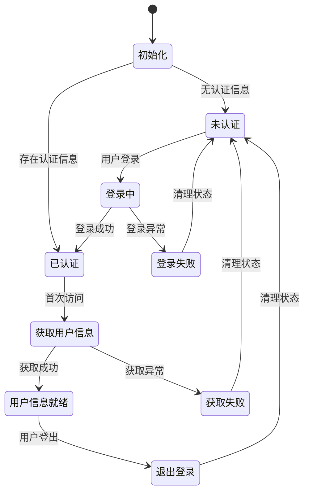
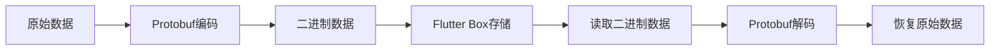
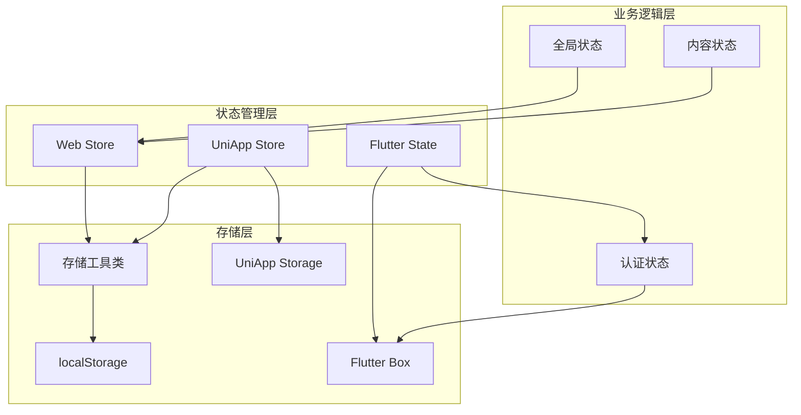
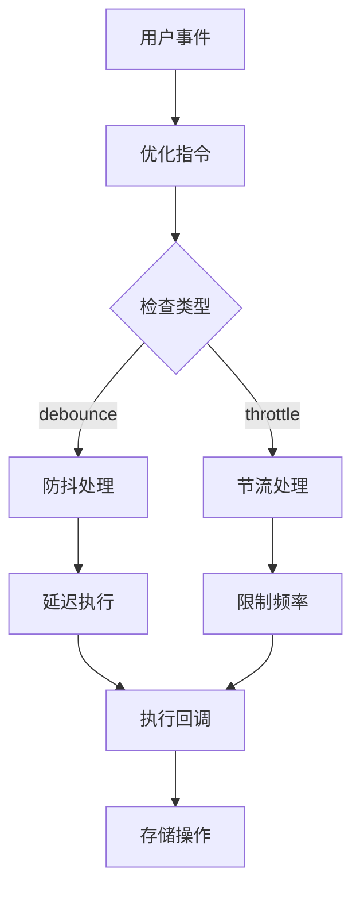

# 状态持久化策略

<cite>
**本文档引用的文件**
- [stroge.ts](file://client/web/src/utils/stroge.ts)
- [index.ts](file://client/web/src/store/index.ts)
- [index.ts](file://client/uniapp/src/store/index.ts)
- [global.ts](file://client/uniapp/src/store/global.ts)
- [content.ts](file://client/web/src/store/content.ts)
- [auth.dart](file://client/app/lib/global/state/auth.dart)
- [compress.ts](file://client/web/buildconfig/compress.ts)
- [optimize/index.ts](file://thirdparty/diamond/src/vue/directives/optimize/index.ts)
</cite>

## 目录
1. [简介](#简介)
2. [项目结构](#项目结构)
3. [核心组件](#核心组件)
4. [架构概览](#架构概览)
5. [详细组件分析](#详细组件分析)
6. [依赖关系分析](#依赖关系分析)
7. [性能考虑](#性能考虑)
8. [故障排除指南](#故障排除指南)
9. [结论](#结论)

## 简介

Hoper项目采用多层次的状态持久化策略，结合了浏览器本地存储、移动端本地存储和服务器端存储等多种技术手段。本文档深入分析了项目的状态持久化实现，包括localStorage和sessionStorage的使用场景、状态序列化和反序列化机制、持久化时机选择以及性能优化策略。

## 项目结构

Hoper项目在多个平台实现了状态持久化功能：

**图表来源**
- [stroge.ts:1-23](file://client/web/src/utils/stroge.ts#L1-L23)
- [index.ts:1-10](file://client/web/src/store/index.ts#L1-L10)
- [index.ts:1-13](file://client/uniapp/src/store/index.ts#L1-L13)
- [auth.dart:1-113](file://client/app/lib/global/state/auth.dart#L1-L113)

## 核心组件

### 存储工具类

项目提供了统一的存储工具类，封装了localStorage的操作：

**图表来源**
- [stroge.ts:2-20](file://client/web/src/utils/stroge.ts#L2-L20)

### Pinia状态管理

项目在不同平台采用了不同的状态管理方案：

**Web端（Vue + Pinia）**
- 使用Pinia作为状态管理库
- 未启用自动持久化插件
- 通过自定义存储工具类进行数据持久化

**UniApp端（Vue + Pinia）**
- 使用pinia-plugin-persistedstate插件
- 配置了自定义存储适配器
- 支持跨页面状态持久化

**Flutter端（GetX）**
- 使用Flutter Box进行本地数据存储
- 实现了完整的认证状态管理
- 支持键值对存储和对象序列化

**章节来源**
- [stroge.ts:1-23](file://client/web/src/utils/stroge.ts#L1-L23)
- [index.ts:1-10](file://client/web/src/store/index.ts#L1-L10)
- [index.ts:1-13](file://client/uniapp/src/store/index.ts#L1-L13)
- [auth.dart:1-113](file://client/app/lib/global/state/auth.dart#L1-L113)

## 架构概览

Hoper项目的状态持久化架构采用分层设计，确保了不同平台的一致性和可维护性：

**图表来源**
- [stroge.ts:1-23](file://client/web/src/utils/stroge.ts#L1-L23)
- [index.ts:1-10](file://client/web/src/store/index.ts#L1-L10)
- [index.ts:1-13](file://client/uniapp/src/store/index.ts#L1-L13)
- [auth.dart:1-113](file://client/app/lib/global/state/auth.dart#L1-L113)

## 详细组件分析

### Web端存储实现

#### 存储工具类分析

Web端的存储工具类提供了类型安全的数据访问接口：

**图表来源**
- [stroge.ts:4-14](file://client/web/src/utils/stroge.ts#L4-L14)

#### 错误处理机制

存储工具类实现了robust的错误处理策略：

**图表来源**
- [stroge.ts:7-11](file://client/web/src/utils/stroge.ts#L7-L11)

**章节来源**
- [stroge.ts:1-23](file://client/web/src/utils/stroge.ts#L1-L23)

### UniApp端持久化实现

#### Pinia持久化插件配置

UniApp端使用pinia-plugin-persistedstate插件实现自动持久化：

**图表来源**
- [index.ts:5-12](file://client/uniapp/src/store/index.ts#L5-L12)

**章节来源**
- [index.ts:1-13](file://client/uniapp/src/store/index.ts#L1-L13)

### Flutter端状态管理

#### 认证状态管理

Flutter端实现了完整的认证状态管理机制：

**图表来源**
- [auth.dart:31-47](file://client/app/lib/global/state/auth.dart#L31-L47)

**章节来源**
- [auth.dart:1-113](file://client/app/lib/global/state/auth.dart#L1-L113)

### 状态序列化和反序列化

#### Web端序列化策略

Web端采用JSON序列化作为主要的数据持久化格式：

| 数据类型 | 序列化方法 | 反序列化方法 | 错误处理 |
|---------|-----------|-------------|----------|
| 基本类型 | JSON.stringify | JSON.parse | 返回原始值 |
| 对象类型 | JSON.stringify | JSON.parse | 返回原始值 |
| 数组类型 | JSON.stringify | JSON.parse | 返回原始值 |
| 复杂对象 | JSON.stringify | JSON.parse | 异常时降级 |

#### Flutter端序列化策略

Flutter端使用protobuf进行高效的数据序列化：

**图表来源**
- [auth.dart:33-34](file://client/app/lib/global/state/auth.dart#L33-L34)

**章节来源**
- [auth.dart:1-113](file://client/app/lib/global/state/auth.dart#L1-L113)

## 依赖关系分析

### 组件耦合度分析

**图表来源**
- [stroge.ts:1-23](file://client/web/src/utils/stroge.ts#L1-L23)
- [index.ts:1-10](file://client/web/src/store/index.ts#L1-L10)
- [index.ts:1-13](file://client/uniapp/src/store/index.ts#L1-L13)
- [auth.dart:1-113](file://client/app/lib/global/state/auth.dart#L1-L113)

### 外部依赖分析

项目依赖的关键外部库：

| 库名称 | 版本 | 用途 | 依赖关系 |
|-------|------|------|----------|
| pinia | 最新版本 | 状态管理 | Vue生态 |
| pinia-plugin-persistedstate | 最新版本 | 自动持久化 | Pinia |
| @vueuse/core | 最新版本 | 事件监听 | Vue生态 |
| grpc | 最新版本 | 服务通信 | Flutter |
| protobuf | 最新版本 | 数据序列化 | Flutter |

**章节来源**
- [index.ts:1-13](file://client/uniapp/src/store/index.ts#L1-L13)
- [optimize/index.ts:1-68](file://thirdparty/diamond/src/vue/directives/optimize/index.ts#L1-L68)

## 性能考虑

### 防抖和节流优化

项目实现了基于指令的性能优化机制：

**图表来源**
- [optimize/index.ts:25-56](file://thirdparty/diamond/src/vue/directives/optimize/index.ts#L25-L56)

### 压缩优化

构建阶段实现了多种压缩策略：

| 压缩算法 | 适用场景 | 性能特点 | 启用条件 |
|---------|---------|---------|---------|
| Gzip | 文本资源 | 高压缩比 | 开启gzip |
| Brotli | 现代浏览器 | 更优压缩率 | 开启brotli |
| Both | 最佳效果 | 最优压缩比 | 开启both |
| None | 开发环境 | 无压缩 | 开启none |

**章节来源**
- [compress.ts:1-62](file://client/web/buildconfig/compress.ts#L1-L62)

### 内存管理策略

不同平台采用了不同的内存管理策略：

**Web端优化策略**
- 使用localStorage进行长期存储
- 实现类型安全的序列化机制
- 提供错误降级处理

**Flutter端优化策略**
- 使用Flutter Box进行高效存储
- 实现protobuf序列化减少存储空间
- 支持异步操作避免阻塞主线程

**章节来源**
- [stroge.ts:1-23](file://client/web/src/utils/stroge.ts#L1-L23)
- [auth.dart:1-113](file://client/app/lib/global/state/auth.dart#L1-L113)

## 故障排除指南

### 常见问题及解决方案

#### 存储容量问题

**问题描述**: 浏览器存储容量限制导致数据丢失

**解决方案**:
- 实现存储容量检测机制
- 采用渐进式存储策略
- 提供存储清理功能

#### 序列化错误处理

**问题描述**: JSON序列化失败导致应用异常

**解决方案**:
- 实现try-catch错误捕获
- 提供原始数据降级方案
- 记录错误日志便于调试

#### 平台兼容性问题

**问题描述**: 不同平台存储API差异导致兼容性问题

**解决方案**:
- 封装统一的存储接口
- 实现平台特定的适配器
- 提供回退机制

**章节来源**
- [stroge.ts:7-11](file://client/web/src/utils/stroge.ts#L7-L11)
- [auth.dart:43-45](file://client/app/lib/global/state/auth.dart#L43-L45)

### 调试和监控

#### 存储操作监控

建议实现以下监控机制：
- 记录存储操作日志
- 监控存储容量使用情况
- 捕获序列化异常信息
- 追踪持久化性能指标

#### 错误恢复机制

实现自动错误恢复：
- 检测存储异常并自动重试
- 提供数据备份和恢复功能
- 实现优雅降级策略

## 结论

Hoper项目的状态持久化策略展现了现代前端开发的最佳实践。通过多平台适配、类型安全的序列化机制、性能优化和完善的错误处理，项目实现了可靠的状态管理。

### 主要优势

1. **多平台一致性**: 统一的存储接口适配不同平台特性
2. **类型安全**: 泛型支持确保运行时类型安全
3. **性能优化**: 防抖节流和压缩策略提升用户体验
4. **错误处理**: 完善的异常捕获和降级机制
5. **可维护性**: 清晰的架构分离和模块化设计

### 改进建议

1. **版本兼容性**: 实现数据格式版本控制机制
2. **增量更新**: 支持部分字段的增量持久化
3. **加密存储**: 对敏感数据实现客户端加密
4. **同步机制**: 实现跨标签页的状态同步
5. **缓存策略**: 添加智能缓存和失效机制

通过持续优化这些方面，Hoper项目的状态持久化策略将更加完善，为用户提供更好的应用体验。