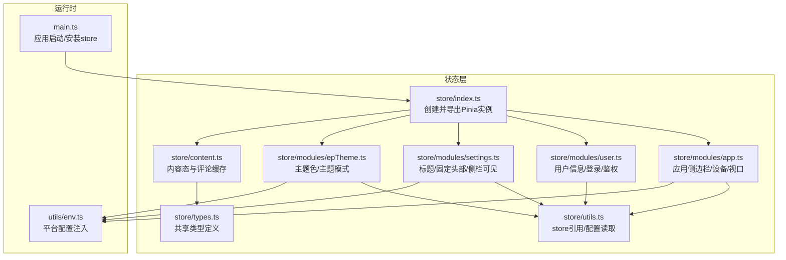
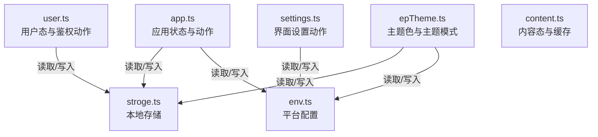
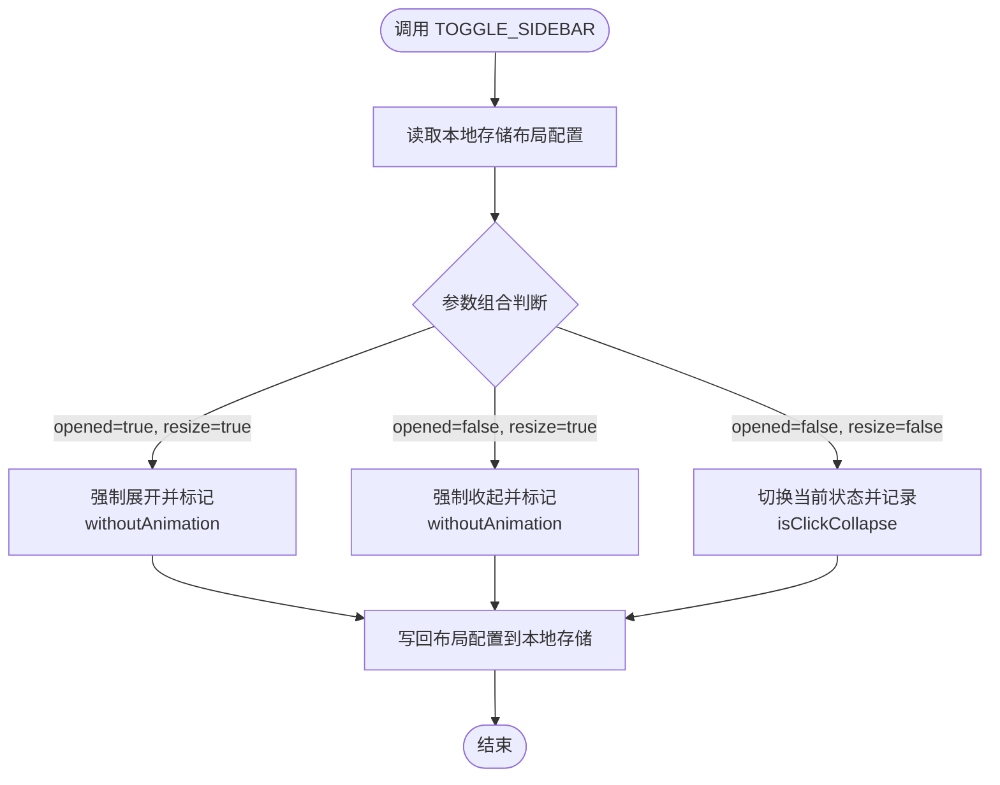
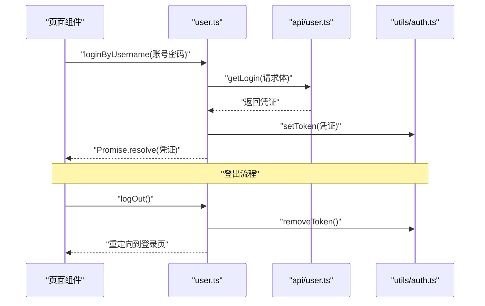
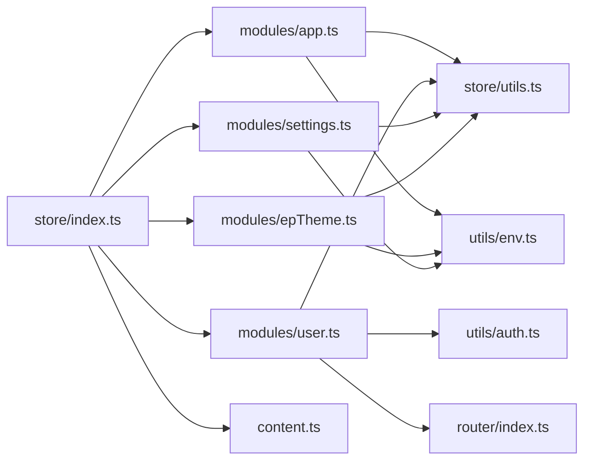

# 状态管理系统

<cite>
**本文档引用的文件**
- [index.ts](file://client/web/src/store/index.ts)
- [types.ts](file://client/web/src/store/types.ts)
- [utils.ts](file://client/web/src/store/utils.ts)
- [app.ts](file://client/web/src/store/modules/app.ts)
- [user.ts](file://client/web/src/store/modules/user.ts)
- [settings.ts](file://client/web/src/store/modules/settings.ts)
- [epTheme.ts](file://client/web/src/store/modules/epTheme.ts)
- [content.ts](file://client/web/src/store/content.ts)
- [main.ts](file://client/web/src/main.ts)
- [env.ts](file://client/web/src/utils/env.ts)
</cite>

## 目录
1. [简介](#简介)
2. [项目结构](#项目结构)
3. [核心组件](#核心组件)
4. [架构总览](#架构总览)
5. [详细组件分析](#详细组件分析)
6. [依赖关系分析](#依赖关系分析)
7. [性能考量](#性能考量)
8. [故障排查指南](#故障排查指南)
9. [结论](#结论)
10. [附录](#附录)

## 简介
本文件面向Hoper Vue3前端（Web客户端）的状态管理子系统，系统基于Pinia进行模块化状态管理，覆盖应用配置、用户态、主题与布局、内容缓存等模块，并提供持久化策略、类型定义、工具函数与最佳实践指导。文档将从架构、组件、数据流、持久化策略、订阅与响应式更新机制等方面进行深入剖析，并给出可直接落地的模块化开发建议。

## 项目结构
Web客户端状态管理位于 client/web/src/store 目录，采用“模块化Store + 全局配置注入 + 类型约束”的组织方式：
- store/index.ts：Pinia实例初始化与安装入口
- store/modules/*：按功能域拆分的模块化Store（app、user、settings、epTheme）
- store/content.ts：内容类状态（如动态、笔记、日记、收藏、评论缓存）
- store/types.ts：跨模块共享的类型定义
- store/utils.ts：Store内部工具函数与全局配置访问器
- utils/env.ts：平台配置注入与运行时配置读取
- main.ts：应用启动流程，确保在路由与插件之后挂载store

图表来源
- [index.ts:1-10](file://client/web/src/store/index.ts#L1-L10)
- [app.ts:1-86](file://client/web/src/store/modules/app.ts#L1-L86)
- [user.ts:1-93](file://client/web/src/store/modules/user.ts#L1-L93)
- [settings.ts:1-37](file://client/web/src/store/modules/settings.ts#L1-L37)
- [epTheme.ts:1-48](file://client/web/src/store/modules/epTheme.ts#L1-L48)
- [content.ts:1-48](file://client/web/src/store/content.ts#L1-L48)
- [types.ts:1-38](file://client/web/src/store/types.ts#L1-L38)
- [utils.ts:1-7](file://client/web/src/store/utils.ts#L1-L7)
- [main.ts:1-63](file://client/web/src/main.ts#L1-L63)
- [env.ts:1-56](file://client/web/src/utils/env.ts#L1-L56)

章节来源
- [index.ts:1-10](file://client/web/src/store/index.ts#L1-L10)
- [main.ts:1-63](file://client/web/src/main.ts#L1-L63)

## 核心组件
- Pinia实例与安装
  - 在 store/index.ts 中创建Pinia实例并通过 setupStore 安装到Vue应用，保证全局可用
  - main.ts 在路由与插件之后再安装store，确保依赖顺序正确
- 类型系统
  - store/types.ts 定义了多处共享类型（如cacheType、positionType、appType、multiType、setType），统一跨模块的数据契约
- 配置与持久化工具
  - store/utils.ts 提供 store 引用与配置读取方法（getConfig、responsiveStorageNameSpace）
  - utils/env.ts 提供平台配置注入（getPlatformConfig），并在运行时合并环境变量与静态配置

章节来源
- [index.ts:1-10](file://client/web/src/store/index.ts#L1-L10)
- [types.ts:1-38](file://client/web/src/store/types.ts#L1-L38)
- [utils.ts:1-7](file://client/web/src/store/utils.ts#L1-L7)
- [env.ts:1-56](file://client/web/src/utils/env.ts#L1-L56)
- [main.ts:1-63](file://client/web/src/main.ts#L1-L63)

## 架构总览
Pinia模块化架构遵循“单一职责、按域拆分”的原则，每个模块聚焦自身业务域的状态与行为；通过共享类型与配置工具形成低耦合高内聚的设计。

图表来源
- [app.ts:1-86](file://client/web/src/store/modules/app.ts#L1-L86)
- [user.ts:1-93](file://client/web/src/store/modules/user.ts#L1-L93)
- [settings.ts:1-37](file://client/web/src/store/modules/settings.ts#L1-L37)
- [epTheme.ts:1-48](file://client/web/src/store/modules/epTheme.ts#L1-L48)
- [env.ts:1-56](file://client/web/src/utils/env.ts#L1-L56)

## 详细组件分析

### 应用状态模块（app）
- 职责
  - 维护侧边栏开关、布局模式、设备类型、视口尺寸等应用级状态
  - 提供切换侧边栏、设置布局、设置设备类型、设置视口尺寸等动作
- 状态与持久化
  - 侧边栏状态与布局信息通过本地存储读取与写回，命名空间来自平台配置
- Getters
  - 提供侧边栏状态、设备类型、视口宽高等只读派生状态
- Actions
  - TOGGLE_SIDEBAR：根据传参决定是否动画、是否强制展开/收起，同时更新本地存储
  - toggleSideBar：异步封装TOGGLE_SIDEBAR
  - toggleDevice/setLayout/setViewportSize：直接更新对应状态字段

图表来源
- [app.ts:48-67](file://client/web/src/store/modules/app.ts#L48-L67)

章节来源
- [app.ts:1-86](file://client/web/src/store/modules/app.ts#L1-L86)

### 用户状态模块（user）
- 职责
  - 维护用户基本信息（id、name、phone）、角色列表、按钮级权限等
  - 提供登录、登出、刷新token等动作
- 状态与持久化
  - 用户信息从本地存储读取，写入时同步到本地存储；token通过鉴权工具写入/移除
- 动作模式
  - loginByUsername：调用登录接口，成功后写入token并返回凭证
  - logOut：清空用户态并移除token，跳转登录页
  - handRefreshToken：调用刷新token接口，成功后写入新token

图表来源
- [user.ts:50-86](file://client/web/src/store/modules/user.ts#L50-L86)

章节来源
- [user.ts:1-93](file://client/web/src/store/modules/user.ts#L1-L93)

### 设置模块（settings）
- 职责
  - 维护标题、固定头部、侧栏可见性等界面设置
- 动作
  - CHANGE_SETTING：通过反射动态设置键值
  - changeSetting：对外暴露的便捷方法

章节来源
- [settings.ts:1-37](file://client/web/src/store/modules/settings.ts#L1-L37)

### 主题模块（epTheme）
- 职责
  - 维护主题色与主题模式，提供fill计算属性以适配不同主题下的图标颜色
- 动作
  - setEpThemeColor：更新主题色并写回本地存储

章节来源
- [epTheme.ts:1-48](file://client/web/src/store/modules/epTheme.ts#L1-L48)

### 内容模块（content）
- 职责
  - 维护内容态（如动态、笔记、日记、收藏、评论）以及评论缓存（Map）
- 设计要点
  - 使用接口与常量数组定义内容变更的“突变映射”，便于集中维护与扩展
  - getter支持按房间ID获取评论缓存

章节来源
- [content.ts:1-48](file://client/web/src/store/content.ts#L1-L48)

## 依赖关系分析
- 模块间依赖
  - 各模块均通过 store/utils.ts 获取全局store引用与配置读取能力
  - app与epTheme模块依赖平台配置（env.ts）与本地存储（stroge.ts）
  - user模块依赖鉴权工具（utils/auth.ts）与路由（router）
- 外部依赖
  - Pinia：提供状态定义与生命周期
  - Vue Router：用于登出后的路由跳转
  - Axios：用于平台配置注入时的HTTP请求

图表来源
- [index.ts:1-10](file://client/web/src/store/index.ts#L1-L10)
- [app.ts:1-86](file://client/web/src/store/modules/app.ts#L1-L86)
- [user.ts:1-93](file://client/web/src/store/modules/user.ts#L1-L93)
- [settings.ts:1-37](file://client/web/src/store/modules/settings.ts#L1-L37)
- [epTheme.ts:1-48](file://client/web/src/store/modules/epTheme.ts#L1-L48)
- [content.ts:1-48](file://client/web/src/store/content.ts#L1-L48)
- [utils.ts:1-7](file://client/web/src/store/utils.ts#L1-L7)
- [env.ts:1-56](file://client/web/src/utils/env.ts#L1-L56)

章节来源
- [index.ts:1-10](file://client/web/src/store/index.ts#L1-L10)
- [utils.ts:1-7](file://client/web/src/store/utils.ts#L1-L7)
- [env.ts:1-56](file://client/web/src/utils/env.ts#L1-L56)

## 性能考量
- 状态粒度与响应式开销
  - 将大对象拆分为多个模块（如app、user、settings、epTheme），避免单点状态膨胀导致的全量响应式追踪
- 持久化策略
  - 仅对必要字段进行本地存储（如侧边栏状态、布局、主题色），减少IO与序列化成本
- 异步动作
  - 登录/刷新token等动作采用Promise封装，避免阻塞UI线程
- 计算属性与派生状态
  - 使用getters提供轻量派生状态，避免重复计算与冗余状态

## 故障排查指南
- 平台配置未加载
  - 现象：模块读取默认配置而非实际配置
  - 排查：确认 public/platform-config.json 是否存在且可访问；检查 getPlatformConfig 的网络请求是否成功
- 本地存储命名空间不一致
  - 现象：侧边栏状态/主题色未生效或被覆盖
  - 排查：核对 responsiveStorageNameSpace 返回值与实际存储键前缀是否一致
- 登录后状态未更新
  - 现象：token已写入但用户信息未同步
  - 排查：确认登录成功后是否调用了用户态写入动作；检查本地存储键名与读取逻辑
- 主题色更新无效
  - 现象：切换主题色后未持久化
  - 排查：确认 setEpThemeColor 是否触发写回本地存储；检查storage接口可用性

章节来源
- [env.ts:29-50](file://client/web/src/utils/env.ts#L29-L50)
- [app.ts:48-67](file://client/web/src/store/modules/app.ts#L48-L67)
- [epTheme.ts:32-41](file://client/web/src/store/modules/epTheme.ts#L32-L41)
- [user.ts:50-86](file://client/web/src/store/modules/user.ts#L50-L86)

## 结论
本状态管理方案以Pinia为核心，结合模块化设计、类型约束与平台配置注入，实现了清晰的职责划分与良好的可维护性。通过本地存储与运行时配置的双轨持久化策略，兼顾了用户体验与系统稳定性。建议在后续迭代中持续细化类型体系、完善错误处理与日志埋点，并探索状态快照与回放能力以增强可观测性。

## 附录

### 状态定义与类型
- appType：应用侧边栏、布局、设备、视口尺寸等
- setType：界面设置项（标题、固定头部、侧栏可见）
- cacheType/positionType/multiType：缓存与位置相关类型

章节来源
- [types.ts:1-38](file://client/web/src/store/types.ts#L1-L38)

### Store配置与安装
- 在 main.ts 中先完成平台配置注入，再安装store，最后挂载应用，确保全局配置可用
- store/index.ts 提供setupStore方法，统一安装Pinia实例

章节来源
- [main.ts:54-60](file://client/web/src/main.ts#L54-L60)
- [index.ts:5-7](file://client/web/src/store/index.ts#L5-L7)

### 模块化开发指导
- 新增模块步骤
  - 在 store/modules 下新增模块文件，使用 defineStore 定义 state/getters/actions
  - 如需持久化，优先考虑本地存储键与平台配置命名空间的一致性
  - 通过 store/utils.ts 获取全局store引用与配置读取能力
- 状态共享与订阅
  - 使用 storeToRefs 或直接解构在组件中订阅状态变化
  - 对于跨模块共享的类型，统一在 store/types.ts 中定义
- 最佳实践
  - 动作内部尽量保持幂等与可测试性，必要时拆分为更细的动作
  - 对外暴露简洁的action名称与参数，避免过度嵌套
  - 对复杂计算使用getter，避免在模板中进行复杂表达式