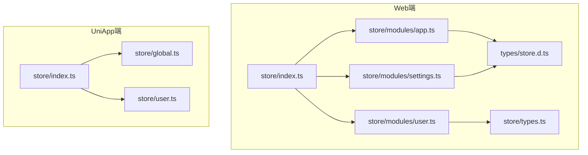
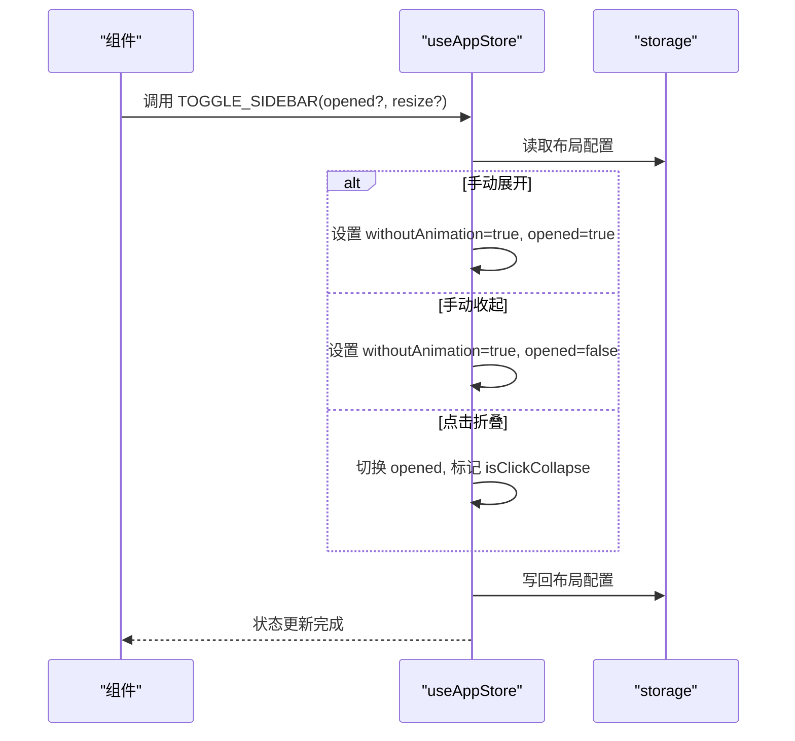
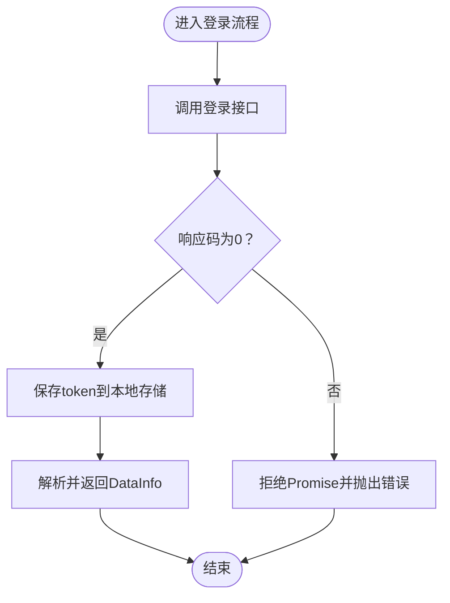
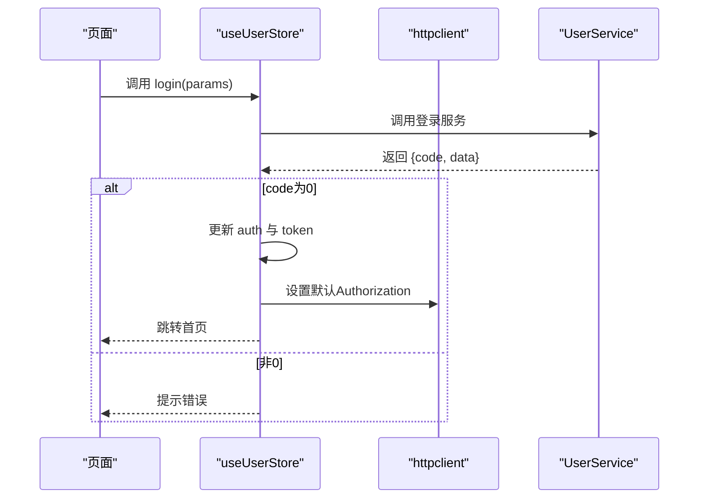
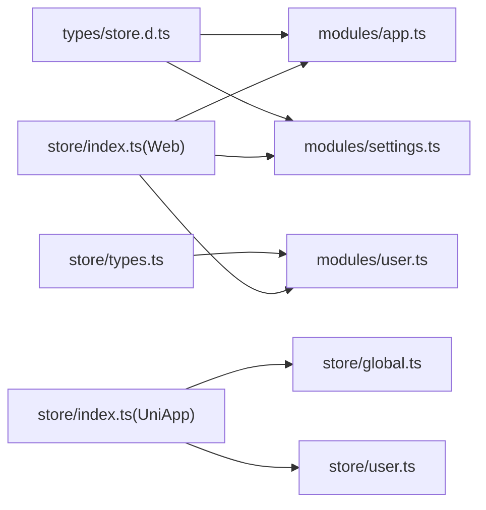

# 状态类型定义

<cite>
**本文档引用的文件**
- [client/web/src/store/types.ts](file://client/web/src/store/types.ts)
- [client/web/src/types/store.d.ts](file://client/web/src/types/store.d.ts)
- [client/web/src/store/index.ts](file://client/web/src/store/index.ts)
- [client/web/src/store/modules/app.ts](file://client/web/src/store/modules/app.ts)
- [client/web/src/store/modules/user.ts](file://client/web/src/store/modules/user.ts)
- [client/web/src/store/modules/settings.ts](file://client/web/src/store/modules/settings.ts)
- [client/uniapp/src/store/global.ts](file://client/uniapp/src/store/global.ts)
- [client/uniapp/src/store/user.ts](file://client/uniapp/src/store/user.ts)
- [client/uniapp/src/store/index.ts](file://client/uniapp/src/store/index.ts)
</cite>

## 目录
1. [简介](#简介)
2. [项目结构](#项目结构)
3. [核心组件](#核心组件)
4. [架构总览](#架构总览)
5. [详细组件分析](#详细组件分析)
6. [依赖关系分析](#依赖关系分析)
7. [性能考量](#性能考量)
8. [故障排查指南](#故障排查指南)
9. [结论](#结论)
10. [附录](#附录)

## 简介
本文件聚焦于Hoper项目在前端（Web与UniApp）中基于TypeScript的状态类型定义与类型安全实现。内容涵盖：
- State接口与类型定义：如何通过明确的类型约束描述状态结构
- Action类型约束：如何在动作签名中体现输入输出类型
- Getters返回值类型：如何确保派生状态的类型一致性
- 类型安全的状态管理：编译期类型检查与运行时类型验证策略
- 模块化类型设计：公共类型共享与模块内类型隔离
- 复杂类型示例：嵌套对象、联合类型、泛型类型的使用
- 类型推导最佳实践：提升开发效率与可维护性

## 项目结构
本项目的前端状态管理采用Pinia作为状态容器，并在Web与UniApp两端分别组织store模块与类型定义：
- Web端：统一在src/store下按功能模块拆分，类型定义集中在src/types与src/store/types.ts
- UniApp端：store位于src/store，类型定义分散在各模块或全局类型文件中，同时引入持久化插件



**图表来源**
- [client/web/src/store/index.ts:1-10](file://client/web/src/store/index.ts#L1-L10)
- [client/web/src/types/store.d.ts:1-40](file://client/web/src/types/store.d.ts#L1-L40)
- [client/web/src/store/modules/app.ts:1-86](file://client/web/src/store/modules/app.ts#L1-L86)
- [client/web/src/store/modules/user.ts:1-93](file://client/web/src/store/modules/user.ts#L1-L93)
- [client/web/src/store/modules/settings.ts:1-37](file://client/web/src/store/modules/settings.ts#L1-L37)
- [client/web/src/store/types.ts:1-38](file://client/web/src/store/types.ts#L1-L38)
- [client/uniapp/src/store/index.ts:1-13](file://client/uniapp/src/store/index.ts#L1-L13)
- [client/uniapp/src/store/global.ts:1-28](file://client/uniapp/src/store/global.ts#L1-L28)
- [client/uniapp/src/store/user.ts:1-87](file://client/uniapp/src/store/user.ts#L1-L87)

**章节来源**
- [client/web/src/store/index.ts:1-10](file://client/web/src/store/index.ts#L1-L10)
- [client/uniapp/src/store/index.ts:1-13](file://client/uniapp/src/store/index.ts#L1-L13)

## 核心组件
本节从类型系统角度梳理状态类型定义的关键点：
- 公共类型共享：将跨模块复用的类型集中于types目录，避免重复定义与不一致
- 模块内类型隔离：每个store模块内部的State与局部类型尽量保持模块边界内
- 明确的State结构：通过接口或类型别名定义state初始形态，便于IDE提示与编译期校验
- 动作签名约束：Action参数与返回值类型明确，减少隐式any带来的风险
- Getters返回值类型：通过箭头函数或普通方法显式标注返回类型，保证派生状态类型稳定

**章节来源**
- [client/web/src/types/store.d.ts:1-40](file://client/web/src/types/store.d.ts#L1-L40)
- [client/web/src/store/types.ts:1-38](file://client/web/src/store/types.ts#L1-L38)
- [client/web/src/store/modules/app.ts:1-86](file://client/web/src/store/modules/app.ts#L1-L86)
- [client/web/src/store/modules/user.ts:1-93](file://client/web/src/store/modules/user.ts#L1-L93)
- [client/web/src/store/modules/settings.ts:1-37](file://client/web/src/store/modules/settings.ts#L1-L37)
- [client/uniapp/src/store/global.ts:1-28](file://client/uniapp/src/store/global.ts#L1-L28)
- [client/uniapp/src/store/user.ts:1-87](file://client/uniapp/src/store/user.ts#L1-L87)

## 架构总览
下面以类图形式展示Web端与UniApp端的核心类型与Store之间的关系，突出State、Getters与Actions的类型约束。

```mermaid
classDiagram
class WebAppStore {
+state : appType
+getters
+TOGGLE_SIDEBAR(opened?, resize?)
+toggleSideBar(opened?, resize?)
+toggleDevice(device)
+setLayout(layout)
+setViewportSize(size)
}
class WebUserStore {
+state : UserInfo
+SET_Id(id)
+SET_AVATAR(avatar)
+SET_NAME(name)
+SET_ROLES(roles)
+SET_ROLE(role)
+SET_PERMS(permissions)
+loginByUsername(data) Promise~DataInfo~Date~~
+logOut()
+handRefreshToken(data) Promise~DataInfo~Date~~
}
class WebSettingStore {
+state : setType
+CHANGE_SETTING({key, value})
+changeSetting(data)
}
class UniGlobalStore {
+state : GlobalState
+doubleCount(state) number
+increment()
+setPlatform(platform)
}
class UniUserStore {
+state : UserState
+getAuth()
+login(params)
+signup(params)
+appendUsersById(ids)
+appendUsers(users)
}
WebAppStore --> "使用" appType
WebUserStore --> "使用" UserInfo
WebSettingStore --> "使用" setType
UniGlobalStore --> "使用" GlobalState
UniUserStore --> "使用" UserState
```

**图表来源**
- [client/web/src/store/modules/app.ts:12-81](file://client/web/src/store/modules/app.ts#L12-L81)
- [client/web/src/store/modules/user.ts:13-87](file://client/web/src/store/modules/user.ts#L13-L87)
- [client/web/src/store/modules/settings.ts:5-31](file://client/web/src/store/modules/settings.ts#L5-L31)
- [client/uniapp/src/store/global.ts:14-27](file://client/uniapp/src/store/global.ts#L14-L27)
- [client/uniapp/src/store/user.ts:82-86](file://client/uniapp/src/store/user.ts#L82-L86)

## 详细组件分析

### Web端应用状态（app）
- State结构：包含平台信息、侧边栏状态、布局、设备类型与视口尺寸等字段，均具备明确类型
- Getters：提供对侧边栏开关、设备类型、视口宽高等派生状态的访问
- Actions：封装侧边栏切换、设备类型切换、布局设置、视口尺寸更新等业务逻辑，并与本地存储交互



**图表来源**
- [client/web/src/store/modules/app.ts:48-67](file://client/web/src/store/modules/app.ts#L48-L67)

**章节来源**
- [client/web/src/store/modules/app.ts:1-86](file://client/web/src/store/modules/app.ts#L1-L86)
- [client/web/src/types/store.d.ts:14-25](file://client/web/src/types/store.d.ts#L14-L25)

### Web端用户状态（user）
- State结构：基于UserInfo类型，包含用户标识、名称、手机号、角色与权限等字段
- Actions：提供设置各类用户信息的方法、登录流程（Promise<DataInfo<Date>>）、登出与刷新token等



**图表来源**
- [client/web/src/store/modules/user.ts:51-63](file://client/web/src/store/modules/user.ts#L51-L63)

**章节来源**
- [client/web/src/store/modules/user.ts:1-93](file://client/web/src/store/modules/user.ts#L1-L93)

### Web端设置状态（settings）
- State结构：标题、固定头部、隐藏侧边栏等配置项
- Getters：提供对各项配置的只读访问
- Actions：支持动态修改配置项，利用反射检测键是否存在再赋值

**章节来源**
- [client/web/src/store/modules/settings.ts:1-37](file://client/web/src/store/modules/settings.ts#L1-L37)
- [client/web/src/types/store.d.ts:35-39](file://client/web/src/types/store.d.ts#L35-L39)

### UniApp端全局状态（global）
- State结构：计数器与平台类型
- Getters：提供派生状态doubleCount
- Actions：支持自增与平台设置

**章节来源**
- [client/uniapp/src/store/global.ts:1-28](file://client/uniapp/src/store/global.ts#L1-L28)

### UniApp端用户状态（user）
- State结构：认证状态、token与用户缓存（Map）
- Getters：根据用户ID从缓存中获取用户基础信息
- Actions：获取认证信息、登录、注册、批量补充用户缓存等



**图表来源**
- [client/uniapp/src/store/user.ts:39-55](file://client/uniapp/src/store/user.ts#L39-L55)

**章节来源**
- [client/uniapp/src/store/user.ts:1-87](file://client/uniapp/src/store/user.ts#L1-L87)

## 依赖关系分析
- Web端类型依赖：app与settings模块直接依赖types/store.d.ts中的公共类型；user模块依赖本地类型定义
- UniApp端类型依赖：global模块使用接口定义；user模块使用生成的protobuf类型与通用响应类型
- Pinia集成：Web端通过store/index.ts创建Pinia实例；UniApp端通过store/index.ts创建Pinia并挂载持久化插件



**图表来源**
- [client/web/src/types/store.d.ts:1-40](file://client/web/src/types/store.d.ts#L1-L40)
- [client/web/src/store/types.ts:1-38](file://client/web/src/store/types.ts#L1-L38)
- [client/web/src/store/modules/app.ts:1-86](file://client/web/src/store/modules/app.ts#L1-L86)
- [client/web/src/store/modules/settings.ts:1-37](file://client/web/src/store/modules/settings.ts#L1-L37)
- [client/web/src/store/modules/user.ts:1-93](file://client/web/src/store/modules/user.ts#L1-L93)
- [client/web/src/store/index.ts:1-10](file://client/web/src/store/index.ts#L1-L10)
- [client/uniapp/src/store/index.ts:1-13](file://client/uniapp/src/store/index.ts#L1-L13)
- [client/uniapp/src/store/global.ts:1-28](file://client/uniapp/src/store/global.ts#L1-L28)
- [client/uniapp/src/store/user.ts:1-87](file://client/uniapp/src/store/user.ts#L1-L87)

**章节来源**
- [client/web/src/store/index.ts:1-10](file://client/web/src/store/index.ts#L1-L10)
- [client/uniapp/src/store/index.ts:1-13](file://client/uniapp/src/store/index.ts#L1-L13)

## 性能考量
- 类型推导与编译期检查：明确的类型定义有助于TS编译器进行更精准的类型推导，减少运行时错误，提高构建阶段的稳定性
- 派生状态缓存：Getters应避免不必要的重复计算，必要时结合缓存策略降低渲染成本
- 动作粒度控制：将大动作拆分为多个小动作，有利于类型约束细化与单元测试覆盖
- 持久化策略：UniApp端通过持久化插件减少重复加载，但需注意类型兼容性与序列化/反序列化的一致性

## 故障排查指南
- 类型不匹配：当Action或Getters的返回值类型与预期不符时，优先检查对应类型定义文件是否与实现一致
- 状态字段缺失：若出现运行时报错“属性不存在”，检查State初始化与Getter/Action中对该字段的访问是否受条件分支影响
- 平台类型问题：Web端appType包含Platform枚举，UniApp端global模块同样使用Platform，需确保导入路径与枚举值一致
- 持久化异常：UniApp端登录后设置Authorization头，若请求失败，检查token存储与httpclient默认配置是否同步

**章节来源**
- [client/web/src/types/store.d.ts:2-7](file://client/web/src/types/store.d.ts#L2-L7)
- [client/uniapp/src/store/user.ts:49-51](file://client/uniapp/src/store/user.ts#L49-L51)

## 结论
Hoper项目在前端状态管理中通过明确的TypeScript类型定义实现了良好的类型安全与模块化设计：
- 公共类型集中管理，模块内类型隔离，提升了可维护性
- State、Getters与Actions的类型约束清晰，便于编译期检查与IDE智能提示
- 在Web与UniApp两端分别采用Pinia与持久化插件，兼顾功能与性能
建议持续完善类型定义的覆盖面，强化运行时校验与错误处理，进一步提升系统的健壮性与开发效率。

## 附录
- 类型定义示例要点
  - 嵌套对象：appType中的sidebar与viewportSize字段体现了层级结构的类型约束
  - 联合类型：多模块中存在可选字段（如name、query、params），通过可选属性表达不确定性
  - 泛型类型：Promise<T>用于异步动作的返回值类型约束，确保调用方能够正确处理异步结果
- 类型推导最佳实践
  - 将公共类型抽离至独立文件，避免重复定义
  - 使用接口（interface）定义可扩展的State结构
  - 对Getters与Actions显式标注返回类型，减少隐式any
  - 在模块间传递复杂对象时，优先使用已定义的类型别名或接口，避免字面量散落各处