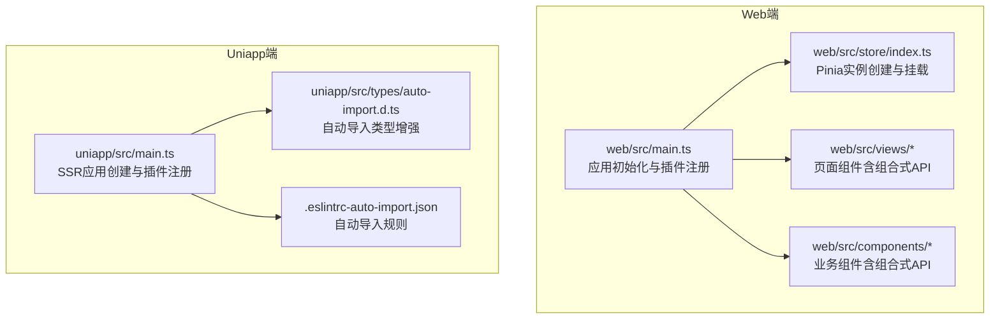
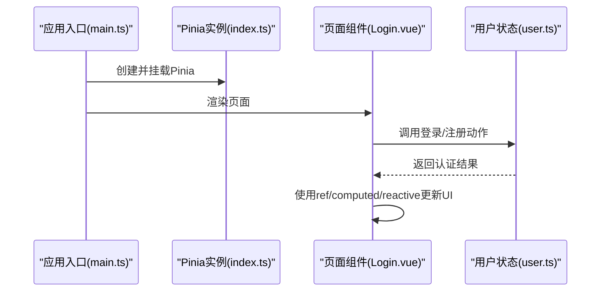
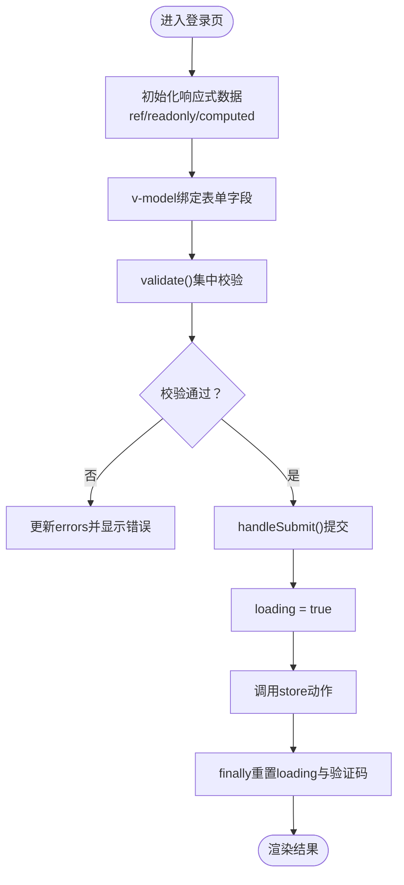
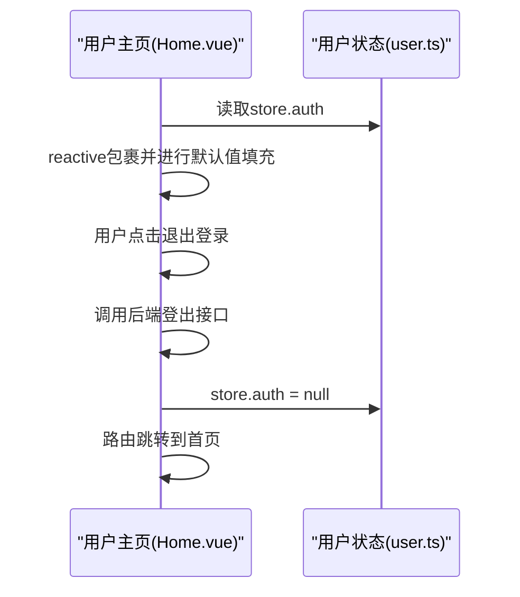
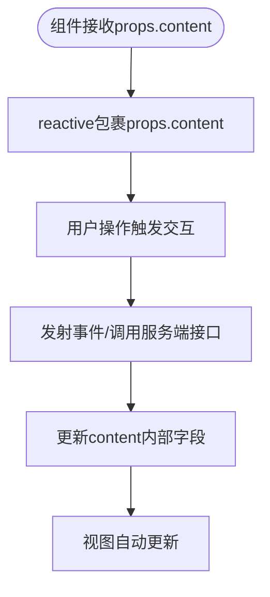
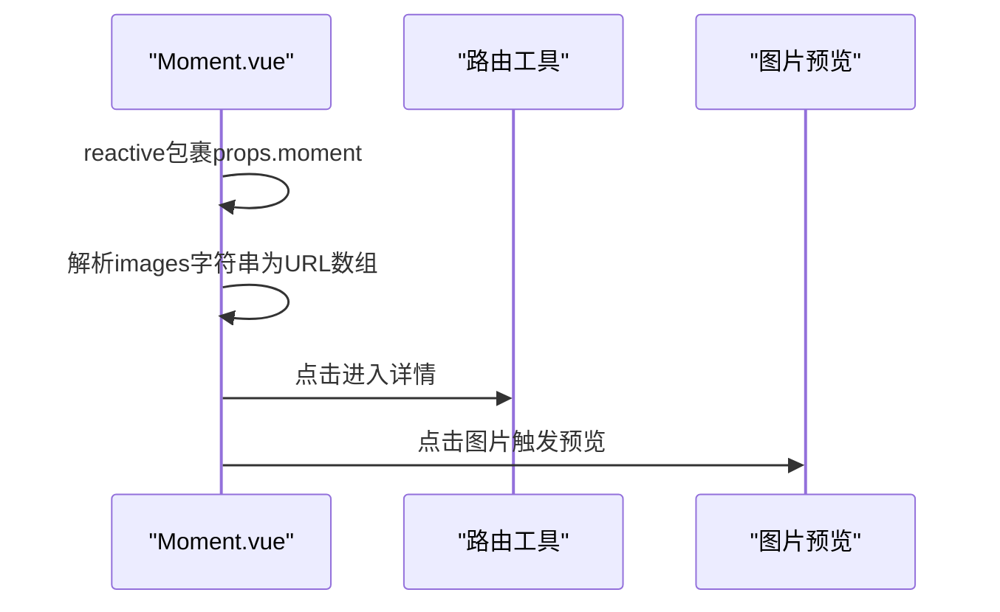
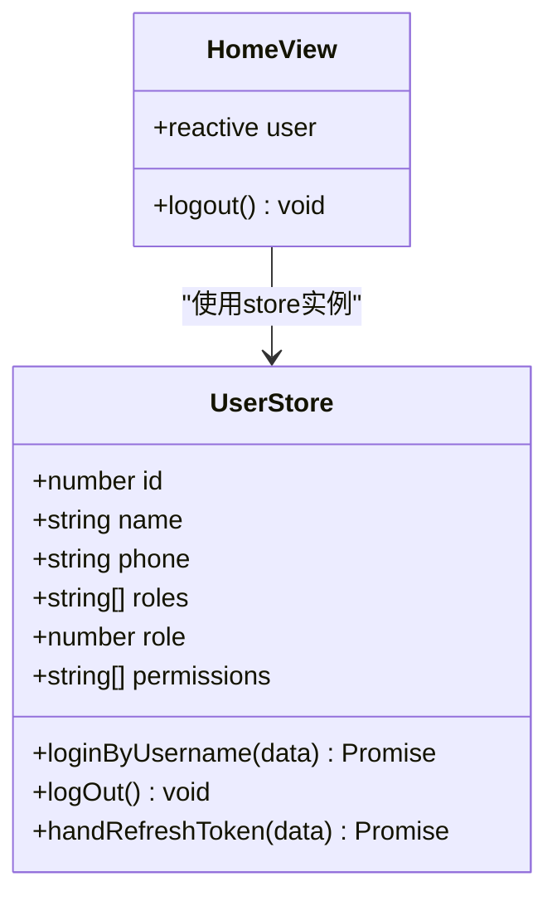
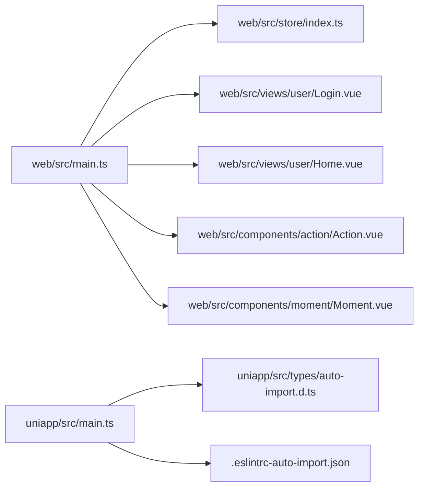

# 响应式系统

<cite>
**本文档引用的文件**
- [client/web/src/main.ts](file://client/web/src/main.ts)
- [client/web/src/store/index.ts](file://client/web/src/store/index.ts)
- [client/web/src/store/modules/user.ts](file://client/web/src/store/modules/user.ts)
- [client/web/src/views/user/Login.vue](file://client/web/src/views/user/Login.vue)
- [client/web/src/views/user/Home.vue](file://client/web/src/views/user/Home.vue)
- [client/web/src/components/action/Action.vue](file://client/web/src/components/action/Action.vue)
- [client/web/src/components/moment/Moment.vue](file://client/web/src/components/moment/Moment.vue)
- [client/web/src/utils/responsive.ts](file://client/web/src/utils/responsive.ts)
- [client/uniapp/src/main.ts](file://client/uniapp/src/main.ts)
- [client/uniapp/src/types/auto-import.d.ts](file://client/uniapp/src/types/auto-import.d.ts)
- [client/uniapp/.eslintrc-auto-import.json](file://client/uniapp/.eslintrc-auto-import.json)
</cite>

## 目录
1. [简介](#简介)
2. [项目结构](#项目结构)
3. [核心组件](#核心组件)
4. [架构总览](#架构总览)
5. [详细组件分析](#详细组件分析)
6. [依赖关系分析](#依赖关系分析)
7. [性能考量](#性能考量)
8. [故障排查指南](#故障排查指南)
9. [结论](#结论)
10. [附录](#附录)

## 简介
本文件聚焦于Hoper项目中的Vue3响应式系统，系统性梳理并讲解组合式API中ref、reactive、computed与watch的使用方式、最佳实践与性能优化策略，并结合项目内真实组件与状态管理场景，给出可直接参考的实践范式。同时对比组合式API与传统选项式API在本项目中的差异与迁移建议。

## 项目结构
Hoper前端由Web端与Uniapp端构成，均采用Vue3生态，其中：
- Web端通过Vite构建，使用Pinia进行状态管理，广泛使用组合式API。
- Uniapp端通过Vite+Vant+Pinia构建，同样大量使用组合式API与自动导入类型增强开发体验。

**图表来源**
- [client/web/src/main.ts:1-63](file://client/web/src/main.ts#L1-L63)
- [client/web/src/store/index.ts:1-10](file://client/web/src/store/index.ts#L1-L10)
- [client/uniapp/src/main.ts:1-22](file://client/uniapp/src/main.ts#L1-L22)
- [client/uniapp/src/types/auto-import.d.ts:66-189](file://client/uniapp/src/types/auto-import.d.ts#L66-L189)
- [client/uniapp/.eslintrc-auto-import.json:52-103](file://client/uniapp/.eslintrc-auto-import.json#L52-L103)

**章节来源**
- [client/web/src/main.ts:1-63](file://client/web/src/main.ts#L1-L63)
- [client/web/src/store/index.ts:1-10](file://client/web/src/store/index.ts#L1-L10)
- [client/uniapp/src/main.ts:1-22](file://client/uniapp/src/main.ts#L1-L22)
- [client/uniapp/src/types/auto-import.d.ts:66-189](file://client/uniapp/src/types/auto-import.d.ts#L66-L189)
- [client/uniapp/.eslintrc-auto-import.json:52-103](file://client/uniapp/.eslintrc-auto-import.json#L52-L103)

## 核心组件
- 组合式API基础能力
  - ref：用于创建可变的、可被响应式的标量或对象引用；在模板中通过v-model双向绑定时，常与表单输入配合使用。
  - reactive：用于将普通对象转为响应式对象，适合封装复杂数据结构。
  - computed：用于基于响应式依赖派生的计算属性，具备缓存与惰性求值特性。
  - watch/watchEffect：用于监听响应式数据变化，watch支持更细粒度的监听策略（如深度监听、立即执行、侦测器清理等）。
- 在本项目中的落地
  - 登录页(Login.vue)：大量使用ref(ref、shallowRef)与computed，配合v-model实现表单校验与密码强度展示。
  - 用户主页(Home.vue)：使用reactive包裹store.auth，实现视图与状态的解耦。
  - 动作组件(Action.vue)：使用reactive包裹props传入的对象，便于在组件内部直接修改统计计数等字段。
  - 动态内容组件(Moment.vue)：使用reactive包裹props.moment，实现内容编辑与预览联动。
  - 状态管理(Pinia)：用户模块(user.ts)使用defineStore定义状态与动作，结合响应式数据完成认证与权限管理。

**章节来源**
- [client/web/src/views/user/Login.vue:261-367](file://client/web/src/views/user/Login.vue#L261-L367)
- [client/web/src/views/user/Home.vue:81-102](file://client/web/src/views/user/Home.vue#L81-L102)
- [client/web/src/components/action/Action.vue:32-81](file://client/web/src/components/action/Action.vue#L32-L81)
- [client/web/src/components/moment/Moment.vue:39-72](file://client/web/src/components/moment/Moment.vue#L39-L72)
- [client/web/src/store/modules/user.ts:13-87](file://client/web/src/store/modules/user.ts#L13-L87)

## 架构总览
下图展示了Web端应用启动、状态管理与组件响应式数据流的关键交互：

**图表来源**
- [client/web/src/main.ts:1-63](file://client/web/src/main.ts#L1-L63)
- [client/web/src/store/index.ts:1-10](file://client/web/src/store/index.ts#L1-L10)
- [client/web/src/views/user/Login.vue:261-367](file://client/web/src/views/user/Login.vue#L261-L367)
- [client/web/src/store/modules/user.ts:13-87](file://client/web/src/store/modules/user.ts#L13-L87)

## 详细组件分析

### 组合式API在登录页的应用
- 数据创建与更新
  - 使用ref创建表单字段与交互状态（如isRegister、loading、focusedField、showPassword等），并在模板中通过v-model双向绑定。
  - 使用computed派生密码强度与强度标签，避免在模板中重复计算。
  - 使用reactive封装错误信息对象，便于集中管理校验结果。
- 错误处理与生命周期
  - 在onMounted中根据平台逻辑触发弹窗或路由跳转。
  - 在handleSubmit中统一校验与调用store动作，最终重置验证码状态。
- 最佳实践
  - 将“纯数据”与“UI状态”分离，避免在模板中直接调用复杂逻辑。
  - 对频繁访问的数据使用computed缓存，减少重复计算。
  - 使用nextTick确保DOM更新后再进行需要DOM的操作。

**图表来源**
- [client/web/src/views/user/Login.vue:261-367](file://client/web/src/views/user/Login.vue#L261-L367)

**章节来源**
- [client/web/src/views/user/Login.vue:261-367](file://client/web/src/views/user/Login.vue#L261-L367)

### 用户主页中的响应式数据绑定
- 数据绑定
  - 使用reactive包裹store.auth，使视图能够直接读取与展示用户信息。
  - 对空字段进行兜底赋值，保证视图渲染稳定性。
- 生命周期与副作用
  - 在退出登录时，调用后端接口并重置store.auth，随后路由跳转。
- 最佳实践
  - 将store中的持久化状态与组件内的临时状态解耦，避免污染全局状态。
  - 对可能为空的字段进行防御式编程，减少运行时异常。

**图表来源**
- [client/web/src/views/user/Home.vue:81-102](file://client/web/src/views/user/Home.vue#L81-L102)
- [client/web/src/store/modules/user.ts:13-87](file://client/web/src/store/modules/user.ts#L13-L87)

**章节来源**
- [client/web/src/views/user/Home.vue:81-102](file://client/web/src/views/user/Home.vue#L81-L102)
- [client/web/src/store/modules/user.ts:13-87](file://client/web/src/store/modules/user.ts#L13-L87)

### 动作组件中的响应式对象更新
- 数据更新
  - 使用reactive包裹props.content，使组件内部可以直接修改收藏数、点赞数等字段。
  - 通过事件发射器与服务端交互，再同步更新本地状态。
- 最佳实践
  - 对props传入的对象使用reactive时，需明确其生命周期与来源，避免意外共享。
  - 在组件内部对可变字段进行默认初始化，防止未定义字段导致的渲染问题。

**图表来源**
- [client/web/src/components/action/Action.vue:32-81](file://client/web/src/components/action/Action.vue#L32-L81)

**章节来源**
- [client/web/src/components/action/Action.vue:32-81](file://client/web/src/components/action/Action.vue#L32-L81)

### 动态内容组件中的响应式文本与图片
- 数据绑定
  - 使用reactive包裹props.moment，实现内容编辑与预览联动。
  - 将图片字符串按逗号拆分为数组并拼接静态资源前缀，供图片组件使用。
- 最佳实践
  - 对props中的复杂对象使用reactive，避免在模板中进行多次转换。
  - 图片预览时使用懒加载与预览组件，提升用户体验与性能。

**图表来源**
- [client/web/src/components/moment/Moment.vue:39-72](file://client/web/src/components/moment/Moment.vue#L39-L72)

**章节来源**
- [client/web/src/components/moment/Moment.vue:39-72](file://client/web/src/components/moment/Moment.vue#L39-L72)

### 状态管理与响应式数据的协同
- Pinia状态管理
  - 使用defineStore定义用户状态，包含state、actions与持久化存储。
  - 在组件中通过store实例读取与更新状态，保持视图与状态的一致性。
- 最佳实践
  - 将跨组件共享的状态放入Pinia，局部状态留在组件内。
  - 对异步动作进行try/catch与finally处理，确保UI状态一致。

**图表来源**
- [client/web/src/store/modules/user.ts:13-87](file://client/web/src/store/modules/user.ts#L13-L87)
- [client/web/src/views/user/Home.vue:81-102](file://client/web/src/views/user/Home.vue#L81-L102)

**章节来源**
- [client/web/src/store/modules/user.ts:13-87](file://client/web/src/store/modules/user.ts#L13-L87)
- [client/web/src/views/user/Home.vue:81-102](file://client/web/src/views/user/Home.vue#L81-L102)

## 依赖关系分析
- 应用初始化
  - Web端通过main.ts创建应用并依次注册UI库、国际化、路由、Pinia等插件。
  - Uniapp端通过SSR入口创建应用，导出Pinia以供运行时使用。
- 自动导入与类型增强
  - uniapp/types/auto-import.d.ts与.eslintrc-auto-import.json确保在模板与脚本中无需显式import即可使用ref、reactive、computed、watch等API。
- 状态管理
  - store/index.ts负责创建Pinia实例并挂载至应用；用户模块(user.ts)定义具体状态与动作。

**图表来源**
- [client/web/src/main.ts:1-63](file://client/web/src/main.ts#L1-L63)
- [client/web/src/store/index.ts:1-10](file://client/web/src/store/index.ts#L1-L10)
- [client/web/src/views/user/Login.vue:261-367](file://client/web/src/views/user/Login.vue#L261-L367)
- [client/web/src/views/user/Home.vue:81-102](file://client/web/src/views/user/Home.vue#L81-L102)
- [client/web/src/components/action/Action.vue:32-81](file://client/web/src/components/action/Action.vue#L32-L81)
- [client/web/src/components/moment/Moment.vue:39-72](file://client/web/src/components/moment/Moment.vue#L39-L72)
- [client/uniapp/src/main.ts:1-22](file://client/uniapp/src/main.ts#L1-L22)
- [client/uniapp/src/types/auto-import.d.ts:66-189](file://client/uniapp/src/types/auto-import.d.ts#L66-L189)
- [client/uniapp/.eslintrc-auto-import.json:52-103](file://client/uniapp/.eslintrc-auto-import.json#L52-L103)

**章节来源**
- [client/web/src/main.ts:1-63](file://client/web/src/main.ts#L1-L63)
- [client/web/src/store/index.ts:1-10](file://client/web/src/store/index.ts#L1-L10)
- [client/uniapp/src/main.ts:1-22](file://client/uniapp/src/main.ts#L1-L22)
- [client/uniapp/src/types/auto-import.d.ts:66-189](file://client/uniapp/src/types/auto-import.d.ts#L66-L189)
- [client/uniapp/.eslintrc-auto-import.json:52-103](file://client/uniapp/.eslintrc-auto-import.json#L52-L103)

## 性能考量
- 计算属性缓存
  - 使用computed缓存昂贵的派生逻辑，避免每次渲染都重新计算。
- 深度监听与浅层监听
  - 对大型对象优先使用watchEffect或浅层监听，减少不必要的深度遍历。
- 异步与批处理
  - 将多个状态更新合并到一次事件循环中，减少重渲染次数。
- 模板绑定优化
  - v-model与v-if/v-for配合时注意顺序，避免在渲染过程中频繁创建/销毁响应式节点。
- 组件级缓存
  - 对频繁切换但开销较大的组件使用keep-alive缓存，降低响应式重建成本。

## 故障排查指南
- 常见问题
  - 表单校验不生效：检查v-model绑定的ref是否在validate中被正确读取与覆盖。
  - 计算属性未更新：确认依赖的响应式数据是否在computed外部被直接修改，应通过setter或action更新。
  - 组件内字段未渲染：确认reactive包裹的对象是否包含该字段，必要时提供默认值。
  - Pinia状态未同步：检查store动作是否在finally中重置loading，以及store实例是否正确挂载。
- 排查步骤
  - 在关键位置添加日志输出，定位响应式数据变更点。
  - 使用浏览器开发者工具的Vue DevTools观察响应式树变化。
  - 对watch回调进行简化，逐步定位是数据源还是回调逻辑的问题。

**章节来源**
- [client/web/src/views/user/Login.vue:261-367](file://client/web/src/views/user/Login.vue#L261-L367)
- [client/web/src/views/user/Home.vue:81-102](file://client/web/src/views/user/Home.vue#L81-L102)
- [client/web/src/store/modules/user.ts:13-87](file://client/web/src/store/modules/user.ts#L13-L87)

## 结论
Hoper项目在Web端与Uniapp端均充分运用了Vue3组合式API的响应式能力，通过ref、reactive、computed与watch实现了清晰的数据流与良好的开发体验。结合Pinia的状态管理与自动导入类型增强，项目在可维护性、性能与扩展性方面均表现良好。建议在后续开发中继续坚持“状态外置、局部状态内聚”的原则，并持续利用computed与watchEffect优化渲染性能。

## 附录
- 组合式API与选项式API的区别
  - 组合式API：逻辑复用更灵活，生命周期钩子与响应式API在同一作用域内组织，便于按功能分组代码。
  - 选项式API：结构清晰、学习成本低，但在复杂场景下逻辑分散、复用困难。
- 在本项目中的迁移建议
  - 新功能优先采用组合式API，逐步将历史选项式组件迁移至组合式。
  - 对公共逻辑抽离为composables，统一管理响应式数据与副作用。