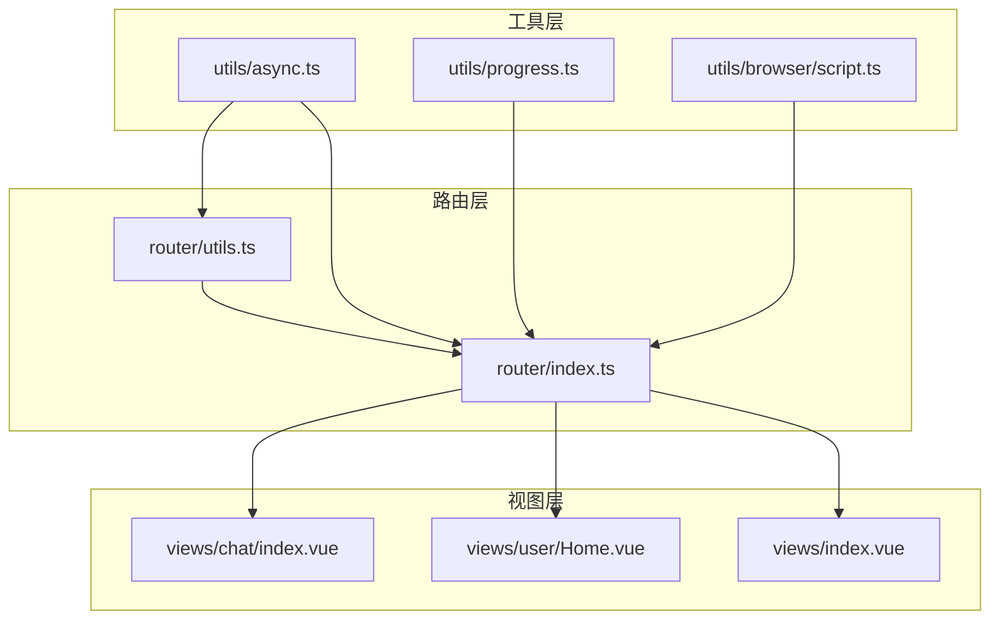
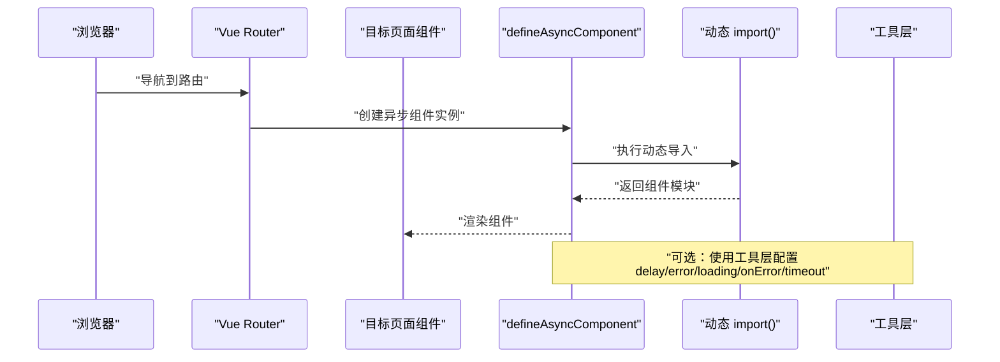
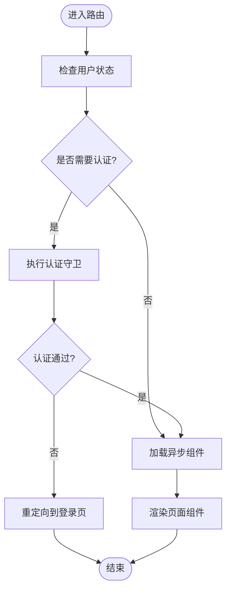
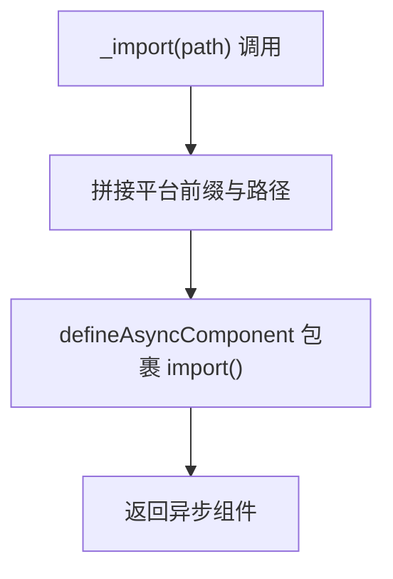
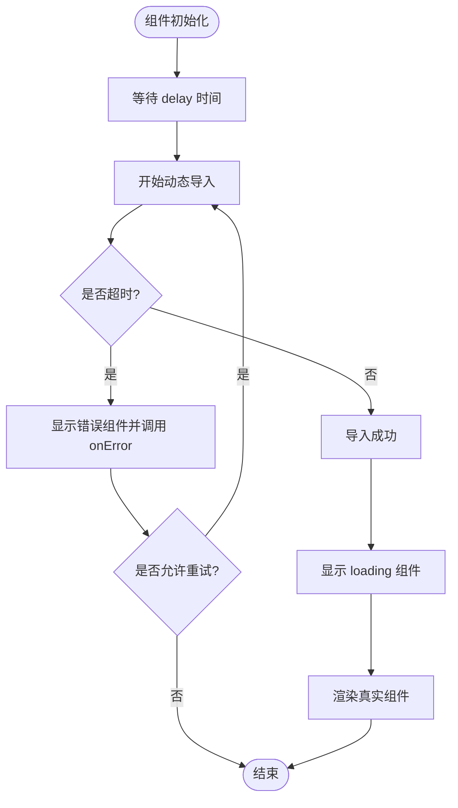
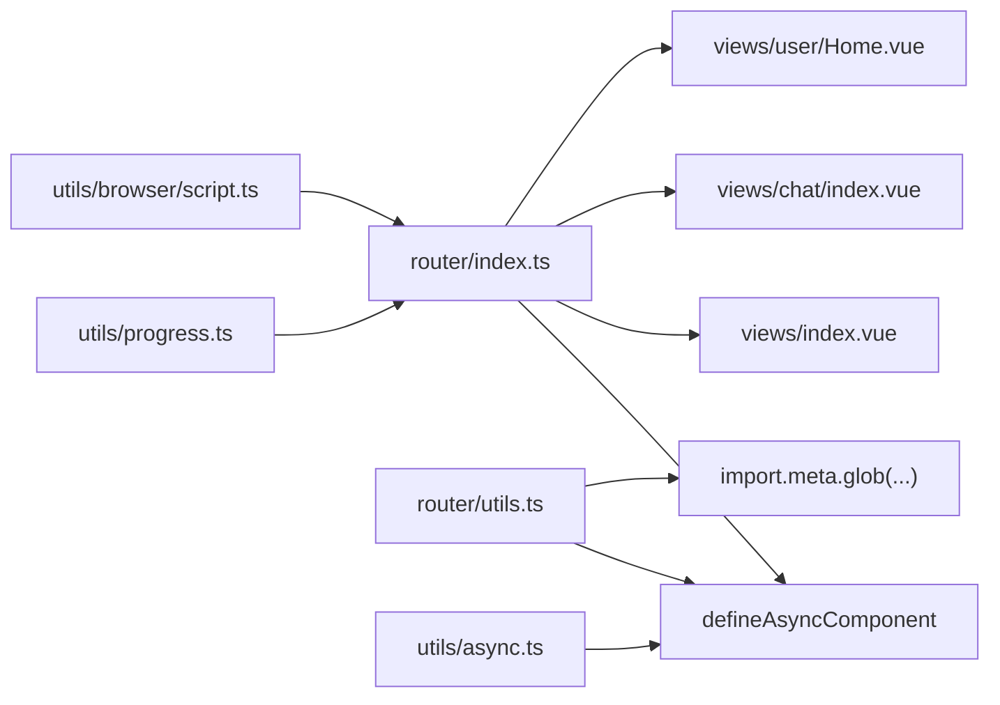

# 异步组件与动态导入

<cite>
**本文引用的文件**
- [router/index.ts](file://client/web/src/router/index.ts)
- [router/utils.ts](file://client/web/src/router/utils.ts)
- [utils/async.ts](file://client/web/src/utils/async.ts)
- [views/chat/index.vue](file://client/web/src/views/chat/index.vue)
- [views/user/Home.vue](file://client/web/src/views/user/Home.vue)
- [views/index.vue](file://client/web/src/views/index.vue)
- [utils/progress.ts](file://client/web/src/utils/progress.ts)
- [utils/browser/script.ts](file://thirdparty/diamond/src/utils/browser/script.ts)
- [utils/async/sleep.ts](file://thirdparty/diamond/src/utils/async/sleep.ts)
- [utils/httpclient/fetch.ts](file://thirdparty/diamond/src/utils/httpclient/fetch.ts)
</cite>

## 目录
1. [简介](#简介)
2. [项目结构](#项目结构)
3. [核心组件](#核心组件)
4. [架构总览](#架构总览)
5. [详细组件分析](#详细组件分析)
6. [依赖关系分析](#依赖关系分析)
7. [性能考量](#性能考量)
8. [故障排查指南](#故障排查指南)
9. [结论](#结论)
10. [附录](#附录)

## 简介
本指南聚焦于 Hoper 项目中的异步组件与动态导入实践，围绕 defineAsyncComponent 的使用方法与配置项（加载延迟、错误处理、超时控制）展开，并结合路由级异步加载、条件加载与懒加载策略，给出代码示例路径与最佳实践建议。同时覆盖性能优化与调试方法，帮助开发者在大型应用中合理拆分组件边界，提升首屏与交互性能。

## 项目结构
本项目的前端位于 client/web/src，异步组件与动态导入主要分布在以下位置：
- 路由层：通过 defineAsyncComponent 实现页面级懒加载
- 工具层：封装异步组件工厂与动态导入工具
- 视图层：具体业务组件，部分组件体量较大，适合异步加载
- 进度与脚本加载：提供加载进度与动态 JS 加载能力，辅助异步组件体验

图表来源
- [router/index.ts:1-62](file://client/web/src/router/index.ts#L1-L62)
- [router/utils.ts:1-79](file://client/web/src/router/utils.ts#L1-L79)
- [utils/async.ts:1-87](file://client/web/src/utils/async.ts#L1-L87)
- [views/chat/index.vue:1-162](file://client/web/src/views/chat/index.vue#L1-L162)
- [views/user/Home.vue:1-114](file://client/web/src/views/user/Home.vue#L1-L114)
- [views/index.vue:1-9](file://client/web/src/views/index.vue#L1-L9)
- [utils/progress.ts:1-17](file://client/web/src/utils/progress.ts#L1-L17)
- [utils/browser/script.ts:1-15](file://thirdparty/diamond/src/utils/browser/script.ts#L1-L15)

章节来源
- [router/index.ts:1-62](file://client/web/src/router/index.ts#L1-L62)
- [router/utils.ts:1-79](file://client/web/src/router/utils.ts#L1-L79)
- [utils/async.ts:1-87](file://client/web/src/utils/async.ts#L1-L87)

## 核心组件
- 路由级异步加载
  - 在路由定义中直接使用 defineAsyncComponent 包裹动态 import，实现页面级懒加载
  - 示例路径：[router/index.ts:22-24](file://client/web/src/router/index.ts#L22-L24)
- 动态导入工具
  - 封装 _import 函数，统一平台前缀与路径拼接，便于复用
  - 示例路径：[router/utils.ts:29-30](file://client/web/src/router/utils.ts#L29-L30)
- 异步组件工厂
  - 提供 defineAsyncComponent 的基础配置封装，便于统一管理 delay、errorComponent、loadingComponent、onError、suspensible、timeout 等
  - 示例路径：[utils/async.ts:71-83](file://client/web/src/utils/async.ts#L71-L83)
- 组件边界划分
  - 大型聊天组件（聊天视图）适合异步加载，减少初始包体
  - 用户主页等组件可按需加载或条件加载
  - 示例路径：[views/chat/index.vue:1-162](file://client/web/src/views/chat/index.vue#L1-L162)，[views/user/Home.vue:1-114](file://client/web/src/views/user/Home.vue#L1-L114)

章节来源
- [router/index.ts:22-24](file://client/web/src/router/index.ts#L22-L24)
- [router/utils.ts:29-30](file://client/web/src/router/utils.ts#L29-L30)
- [utils/async.ts:71-83](file://client/web/src/utils/async.ts#L71-L83)
- [views/chat/index.vue:1-162](file://client/web/src/views/chat/index.vue#L1-L162)
- [views/user/Home.vue:1-114](file://client/web/src/views/user/Home.vue#L1-L114)

## 架构总览
下图展示了从路由到异步组件的调用链路，以及与工具层的协作关系：

图表来源
- [router/index.ts:22-24](file://client/web/src/router/index.ts#L22-L24)
- [utils/async.ts:71-83](file://client/web/src/utils/async.ts#L71-L83)

## 详细组件分析

### 路由级异步加载
- 使用场景
  - 页面级懒加载，降低首屏资源压力
  - 需要鉴权的页面，可在进入前完成认证逻辑
- 实现要点
  - 在路由配置中将 component 替换为 defineAsyncComponent 包裹的动态 import
  - 结合全局前置守卫进行权限校验
- 示例路径
  - [router/index.ts:13-32](file://client/web/src/router/index.ts#L13-L32)
  - [router/index.ts:39-59](file://client/web/src/router/index.ts#L39-L59)

图表来源
- [router/index.ts:39-59](file://client/web/src/router/index.ts#L39-L59)
- [router/index.ts:22-24](file://client/web/src/router/index.ts#L22-L24)

章节来源
- [router/index.ts:13-32](file://client/web/src/router/index.ts#L13-L32)
- [router/index.ts:39-59](file://client/web/src/router/index.ts#L39-L59)

### 动态导入工具与统一入口
- 工具函数
  - _import：统一平台前缀与路径，返回 defineAsyncComponent
  - 支持基于 glob 的批量导入，便于生成动态路由
- 示例路径
  - [router/utils.ts:29-30](file://client/web/src/router/utils.ts#L29-L30)
  - [router/utils.ts:35](file://client/web/src/router/utils.ts#L35)

图表来源
- [router/utils.ts:29-30](file://client/web/src/router/utils.ts#L29-L30)
- [router/utils.ts:35](file://client/web/src/router/utils.ts#L35)

章节来源
- [router/utils.ts:29-30](file://client/web/src/router/utils.ts#L29-L30)
- [router/utils.ts:35](file://client/web/src/router/utils.ts#L35)

### defineAsyncComponent 配置详解与最佳实践
- 关键配置项
  - delay：显示加载态之前的延迟时间，避免闪烁
  - errorComponent：错误时显示的组件
  - loadingComponent：加载时显示的组件
  - onError：错误回调，支持 retry/fail/attempts
  - suspensible：是否可挂起
  - timeout：超时时间，超时触发错误
- 最佳实践
  - 为大组件设置合理的 delay，避免短暂白屏
  - 提供 loadingComponent，改善用户体验
  - 使用 onError 执行重试或降级策略
  - 合理设置 timeout，避免长时间等待
- 示例路径
  - [utils/async.ts:71-83](file://client/web/src/utils/async.ts#L71-L83)

图表来源
- [utils/async.ts:71-83](file://client/web/src/utils/async.ts#L71-L83)

章节来源
- [utils/async.ts:71-83](file://client/web/src/utils/async.ts#L71-L83)

### 条件加载与懒加载策略
- 条件加载
  - 根据用户状态或权限决定是否加载某页面
  - 示例路径：[router/index.ts:39-59](file://client/web/src/router/index.ts#L39-L59)
- 懒加载
  - 将大型组件（如聊天页）改为异步组件，仅在访问时加载
  - 示例路径：[router/index.ts:22-24](file://client/web/src/router/index.ts#L22-L24)，[views/chat/index.vue:1-162](file://client/web/src/views/chat/index.vue#L1-L162)
- 组件边界划分建议
  - 将重型业务组件（图表、富文本、多媒体）拆分为独立模块
  - 将第三方库封装为异步组件，按需引入
  - 将非首屏可见区域组件延迟加载

章节来源
- [router/index.ts:22-24](file://client/web/src/router/index.ts#L22-L24)
- [router/index.ts:39-59](file://client/web/src/router/index.ts#L39-L59)
- [views/chat/index.vue:1-162](file://client/web/src/views/chat/index.vue#L1-L162)

### 第三方库与脚本的动态加载
- 动态加载 JS
  - 通过动态插入 script 标签按需加载第三方脚本
  - 示例路径：[utils/browser/script.ts:1-15](file://thirdparty/diamond/src/utils/browser/script.ts#L1-L15)
- 与异步组件配合
  - 在异步组件的 onError 中触发动态加载，再重试渲染
  - 或在组件生命周期内按需加载外部脚本

章节来源
- [utils/browser/script.ts:1-15](file://thirdparty/diamond/src/utils/browser/script.ts#L1-L15)

### 性能与加载体验优化
- 加载进度
  - 使用 NProgress 展示页面切换进度，提升感知速度
  - 示例路径：[utils/progress.ts:1-17](file://client/web/src/utils/progress.ts#L1-L17)
- 请求超时与节流
  - HTTP 客户端支持 timeout 配置，避免阻塞渲染
  - 示例路径：[utils/httpclient/fetch.ts:43](file://thirdparty/diamond/src/utils/httpclient/fetch.ts#L43)，[utils/httpclient/fetch.ts:103-105](file://thirdparty/diamond/src/utils/httpclient/fetch.ts#L103-L105)
- 休眠与节流工具
  - 在异步流程中使用 sleep 控制节奏，避免过于频繁的请求
  - 示例路径：[utils/async/sleep.ts:1-4](file://thirdparty/diamond/src/utils/async/sleep.ts#L1-L4)

章节来源
- [utils/progress.ts:1-17](file://client/web/src/utils/progress.ts#L1-L17)
- [utils/httpclient/fetch.ts:43](file://thirdparty/diamond/src/utils/httpclient/fetch.ts#L43)
- [utils/httpclient/fetch.ts:103-105](file://thirdparty/diamond/src/utils/httpclient/fetch.ts#L103-L105)
- [utils/async/sleep.ts:1-4](file://thirdparty/diamond/src/utils/async/sleep.ts#L1-L4)

## 依赖关系分析
- 路由依赖 defineAsyncComponent，实现页面级懒加载
- 工具层提供 _import 与 defineAsyncComponent 封装，统一动态导入策略
- 视图层组件体量较大，适合异步加载，减少首屏负担
- 进度与脚本加载工具为异步组件提供更好的用户体验

图表来源
- [router/index.ts:1-62](file://client/web/src/router/index.ts#L1-L62)
- [router/utils.ts:1-79](file://client/web/src/router/utils.ts#L1-L79)
- [utils/async.ts:1-87](file://client/web/src/utils/async.ts#L1-L87)
- [utils/progress.ts:1-17](file://client/web/src/utils/progress.ts#L1-L17)
- [utils/browser/script.ts:1-15](file://thirdparty/diamond/src/utils/browser/script.ts#L1-L15)

章节来源
- [router/index.ts:1-62](file://client/web/src/router/index.ts#L1-L62)
- [router/utils.ts:1-79](file://client/web/src/router/utils.ts#L1-L79)
- [utils/async.ts:1-87](file://client/web/src/utils/async.ts#L1-L87)

## 性能考量
- 合理设置 delay 与 timeout，避免短暂白屏与长时间等待
- 为大组件提供 loadingComponent，改善感知速度
- 使用 NProgress 展示页面切换进度
- 对第三方库采用动态加载，在需要时再引入
- 通过工具层统一管理动态导入，减少重复代码与配置漂移

## 故障排查指南
- 错误处理
  - 在 defineAsyncComponent 的 onError 回调中记录错误并提供重试机制
  - 示例路径：[utils/async.ts:77-79](file://client/web/src/utils/async.ts#L77-L79)
- 超时问题
  - 设置合理 timeout，避免长时间等待；必要时在 onError 中降级
  - 示例路径：[utils/async.ts:80-82](file://client/web/src/utils/async.ts#L80-L82)
- 资源加载失败
  - 使用动态 JS 加载工具在异步组件中按需补救
  - 示例路径：[utils/browser/script.ts:1-15](file://thirdparty/diamond/src/utils/browser/script.ts#L1-L15)
- 调试建议
  - 在 onError 中打印错误信息与尝试次数，定位问题根因
  - 使用浏览器网络面板观察动态 chunk 加载情况

章节来源
- [utils/async.ts:77-79](file://client/web/src/utils/async.ts#L77-L79)
- [utils/async.ts:80-82](file://client/web/src/utils/async.ts#L80-L82)
- [utils/browser/script.ts:1-15](file://thirdparty/diamond/src/utils/browser/script.ts#L1-L15)

## 结论
通过在路由层使用 defineAsyncComponent 实现页面级懒加载，并结合工具层的统一封装与动态导入策略，Hoper 项目能够在保证功能完整性的同时显著优化首屏性能与交互体验。配合加载进度、错误处理与超时控制，可进一步提升系统的稳定性与可维护性。

## 附录
- 示例路径索引
  - 路由级异步加载：[router/index.ts:22-24](file://client/web/src/router/index.ts#L22-L24)
  - 动态导入工具：[router/utils.ts:29-30](file://client/web/src/router/utils.ts#L29-L30)
  - 异步组件配置：[utils/async.ts:71-83](file://client/web/src/utils/async.ts#L71-L83)
  - 大型组件示例：[views/chat/index.vue:1-162](file://client/web/src/views/chat/index.vue#L1-L162)
  - 加载进度：[utils/progress.ts:1-17](file://client/web/src/utils/progress.ts#L1-L17)
  - 动态 JS 加载：[utils/browser/script.ts:1-15](file://thirdparty/diamond/src/utils/browser/script.ts#L1-L15)
  - 请求超时与节流：[utils/httpclient/fetch.ts:43](file://thirdparty/diamond/src/utils/httpclient/fetch.ts#L43)，[utils/httpclient/fetch.ts:103-105](file://thirdparty/diamond/src/utils/httpclient/fetch.ts#L103-L105)
  - 休眠工具：[utils/async/sleep.ts:1-4](file://thirdparty/diamond/src/utils/async/sleep.ts#L1-L4)