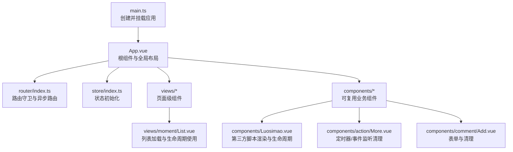
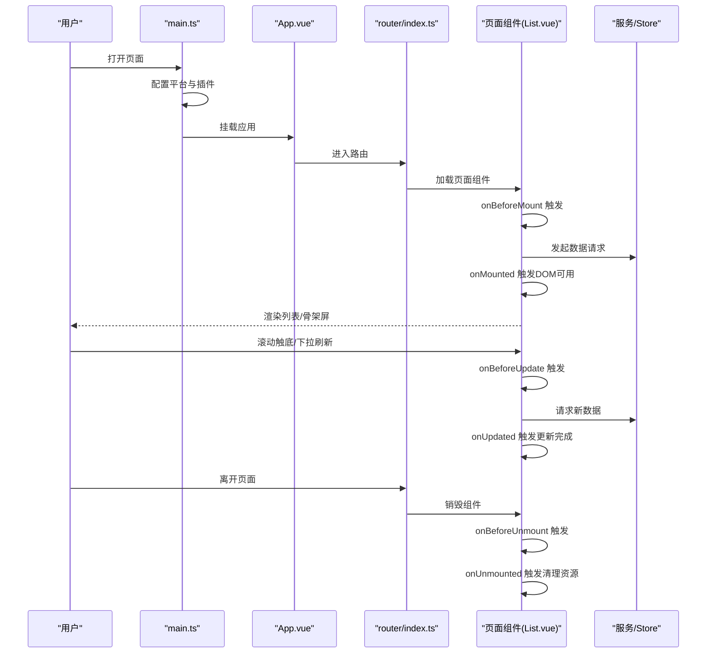
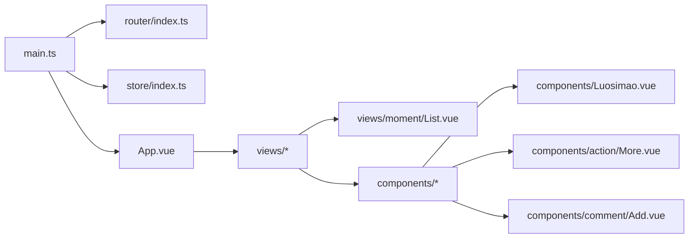

# 生命周期钩子

<cite>
**本文引用的文件**
- [README.md](file://README.md)
- [main.ts](file://client/web/src/main.ts)
- [App.vue](file://client/web/src/App.vue)
- [List.vue](file://client/web/src/views/moment/List.vue)
- [Luosimao.vue](file://client/web/src/components/Luosimao.vue)
- [More.vue](file://client/web/src/components/action/More.vue)
- [Add.vue](file://client/web/src/components/comment/Add.vue)
- [cache.vue](file://client/web/src/views/service/cache.vue)
- [db.vue](file://client/web/src/views/service/db.vue)
- [indexDB.vue](file://client/web/src/views/service/indexDB.vue)
- [sse.vue](file://client/web/src/views/service/sse.vue)
- [woker.vue](file://client/web/src/views/service/woker.vue)
- [Login.vue](file://client/web/src/views/user/Login.vue)
- [index.ts](file://client/web/src/router/index.ts)
- [index.ts](file://client/web/src/store/index.ts)
</cite>

## 目录
1. [简介](#简介)
2. [项目结构](#项目结构)
3. [核心组件](#核心组件)
4. [架构总览](#架构总览)
5. [详细组件分析](#详细组件分析)
6. [依赖分析](#依赖分析)
7. [性能考虑](#性能考虑)
8. [故障排查指南](#故障排查指南)
9. [结论](#结论)
10. [附录](#附录)

## 简介
本指南围绕 Hoper Web 客户端（Vue3 + Vite + TypeScript）中的生命周期钩子使用进行系统性梳理，重点覆盖组合式 API 中的 onBeforeMount、onMounted、onBeforeUpdate、onUpdated、onBeforeUnmount、onUnmounted 的使用时机、典型场景与最佳实践，并给出与选项式 API 的对应关系、常见错误与规避建议。文档同时结合仓库中真实组件示例，帮助读者在实际项目中正确落地。

## 项目结构
Hoper Web 客户端采用模块化组织，根组件负责全局主题、路由视图与底部导航；应用通过 main.ts 创建并挂载应用实例；路由与状态管理分别在 router 与 store 中配置；业务组件分布在 views 与 components 目录下，大量使用组合式 API 与生命周期钩子。

图表来源
- [main.ts:16-60](file://client/web/src/main.ts#L16-L60)
- [App.vue:1-90](file://client/web/src/App.vue#L1-L90)
- [index.ts:1-62](file://client/web/src/router/index.ts#L1-L62)
- [index.ts:1-10](file://client/web/src/store/index.ts#L1-L10)
- [List.vue:28-96](file://client/web/src/views/moment/List.vue#L28-L96)
- [Luosimao.vue:13-40](file://client/web/src/components/Luosimao.vue#L13-L40)
- [More.vue](file://client/web/src/components/action/More.vue#L55)
- [Add.vue](file://client/web/src/components/comment/Add.vue#L36)

章节来源
- [README.md:35-40](file://README.md#L35-L40)
- [main.ts:16-60](file://client/web/src/main.ts#L16-L60)
- [App.vue:1-90](file://client/web/src/App.vue#L1-L90)

## 核心组件
- 应用入口与挂载：在 main.ts 中创建应用实例、安装插件、读取平台配置后挂载到 DOM。
- 根组件：App.vue 使用 RouterView、KeepAlive、Suspense 组合实现页面切换与缓存，同时处理微信 SDK 初始化等逻辑。
- 页面组件：List.vue 在 onMounted 中触发首次数据拉取，配合 onBeforeUpdate/onUpdated 进行数据变更后的副作用处理。
- 业务组件：Luosimao.vue 在 onMounted 中渲染第三方验证码组件；More.vue 与 Add.vue 在 onMounted 中绑定事件/定时器，在 onBeforeUnmount/onUnmounted 中清理。

章节来源
- [main.ts:16-60](file://client/web/src/main.ts#L16-L60)
- [App.vue:29-66](file://client/web/src/App.vue#L29-L66)
- [List.vue:28-96](file://client/web/src/views/moment/List.vue#L28-L96)
- [Luosimao.vue:13-40](file://client/web/src/components/Luosimao.vue#L13-L40)
- [More.vue](file://client/web/src/components/action/More.vue#L55)
- [Add.vue](file://client/web/src/components/comment/Add.vue#L36)

## 架构总览
下图展示从应用挂载到页面渲染、数据加载与生命周期执行的关键流程：

图表来源
- [main.ts:54-60](file://client/web/src/main.ts#L54-L60)
- [App.vue:3-17](file://client/web/src/App.vue#L3-L17)
- [index.ts:39-59](file://client/web/src/router/index.ts#L39-L59)
- [List.vue:64-96](file://client/web/src/views/moment/List.vue#L64-L96)

## 详细组件分析

### onMounted：组件挂载后的数据与DOM操作
- 典型场景
  - 首次数据拉取与滚动加载：List.vue 在 onMounted 后触发首次加载，避免在组件还未挂载到 DOM 时访问节点。
  - 第三方脚本渲染：Luosimao.vue 在 onMounted 中确保容器存在后再渲染验证码组件。
  - 服务类初始化：cache.vue、db.vue、indexDB.vue、sse.vue、woker.vue 在 onMounted 中初始化缓存、数据库、推送或 Worker。
- 最佳实践
  - 将异步请求放在 onMounted 内部，避免 SSR 或提前渲染阶段的副作用。
  - 对第三方脚本采用条件加载与幂等渲染策略，避免重复初始化。
- 常见错误
  - 在 setup 中直接访问 DOM 节点（未挂载），应使用 nextTick 或在 onMounted 中访问。
  - 忘记在卸载钩子中清理定时器/事件监听，导致内存泄漏。

章节来源
- [List.vue:28-96](file://client/web/src/views/moment/List.vue#L28-L96)
- [Luosimao.vue:13-40](file://client/web/src/components/Luosimao.vue#L13-L40)
- [cache.vue](file://client/web/src/views/service/cache.vue#L8)
- [db.vue](file://client/web/src/views/service/db.vue#L8)
- [indexDB.vue](file://client/web/src/views/service/indexDB.vue#L6)
- [sse.vue](file://client/web/src/views/service/sse.vue#L18)
- [woker.vue](file://client/web/src/views/service/woker.vue#L9)

### onBeforeMount：挂载前的准备工作
- 典型场景
  - 计算初始状态、准备外部资源（如微信 SDK、第三方脚本），但不进行 DOM 操作。
  - 在 App.vue 中根据 URL 参数决定平台与 SDK 加载时机。
- 最佳实践
  - 将仅需在挂载前计算的状态与资源准备放在此钩子内，避免与 DOM 强耦合。
- 常见错误
  - 在此钩子中进行异步请求或依赖 DOM 的操作，应移至 onMounted。

章节来源
- [App.vue:42-65](file://client/web/src/App.vue#L42-L65)

### onBeforeUpdate / onUpdated：响应式数据变更后的处理
- 典型场景
  - 数据更新后需要同步到外部系统或执行副作用（如日志上报、统计）。
  - 列表组件在数据更新前后进行必要的 UI 适配或滚动位置保持。
- 最佳实践
  - onBeforeUpdate 用于“即将更新”的预处理；onUpdated 用于“已更新”后的收尾。
  - 避免在更新钩子中修改响应式状态，防止无限循环。
- 常见错误
  - 在更新钩子中频繁重排 DOM 或发起大量请求，影响性能。

章节来源
- [List.vue:64-96](file://client/web/src/views/moment/List.vue#L64-L96)

### onBeforeUnmount / onUnmounted：销毁前的清理工作
- 典型场景
  - 清理定时器、事件监听、WebSocket 连接、Worker、缓存句柄等。
  - 在 More.vue 与 Add.vue 中，onMounted 绑定事件/定时器，onBeforeUnmount/onUnmounted 统一清理。
- 最佳实践
  - 将“绑定”与“解绑”成对出现，保证组件销毁时无残留。
  - 对于第三方库的实例，务必遵循其提供的销毁/释放接口。
- 常见错误
  - 忘记清理，导致内存泄漏或后台任务持续运行。

章节来源
- [More.vue](file://client/web/src/components/action/More.vue#L55)
- [Add.vue](file://client/web/src/components/comment/Add.vue#L36)

### 与选项式 API 的对应关系
- 组合式 API 的生命周期钩子与选项式 API 的同名生命周期一一对应：
  - onBeforeMount ↔ beforeMount
  - onMounted ↔ mounted
  - onBeforeUpdate ↔ beforeUpdate
  - onUpdated ↔ updated
  - onBeforeUnmount ↔ beforeDestroy
  - onUnmounted ↔ destroyed
- 在组合式 API 中，所有逻辑以函数形式组织，更利于逻辑复用与测试。

## 依赖分析
- 应用启动依赖
  - main.ts 依赖 router、store、i18n、echarts、MotionPlugin 等插件，最终通过 app.mount 完成挂载。
- 页面渲染依赖
  - App.vue 通过 RouterView 动态渲染页面组件，配合 KeepAlive 与 Suspense 提升用户体验。
- 组件生命周期依赖
  - List.vue 依赖 axios 与 Pinia Store 进行数据加载与用户信息聚合。
  - Luosimao.vue 依赖浏览器动态加载脚本能力与第三方 SDK。

图表来源
- [main.ts:16-60](file://client/web/src/main.ts#L16-L60)
- [index.ts:1-62](file://client/web/src/router/index.ts#L1-L62)
- [index.ts:1-10](file://client/web/src/store/index.ts#L1-L10)
- [App.vue:3-17](file://client/web/src/App.vue#L3-L17)
- [List.vue:28-96](file://client/web/src/views/moment/List.vue#L28-L96)
- [Luosimao.vue:13-40](file://client/web/src/components/Luosimao.vue#L13-L40)
- [More.vue](file://client/web/src/components/action/More.vue#L55)
- [Add.vue](file://client/web/src/components/comment/Add.vue#L36)

章节来源
- [main.ts:16-60](file://client/web/src/main.ts#L16-L60)
- [index.ts:1-62](file://client/web/src/router/index.ts#L1-L62)
- [index.ts:1-10](file://client/web/src/store/index.ts#L1-L10)
- [App.vue:3-17](file://client/web/src/App.vue#L3-L17)

## 性能考虑
- 避免在更新钩子中进行昂贵操作，减少不必要的重渲染与副作用。
- 对第三方脚本与外部资源的加载采用懒加载与缓存策略，降低首屏压力。
- 在列表组件中合理使用骨架屏与分页，控制一次性渲染的数据量。
- 使用 KeepAlive 缓存页面组件，减少重复挂载/卸载带来的开销。

## 故障排查指南
- 症状：组件未渲染或第三方脚本报错
  - 排查：确认 onMounted 是否在 DOM 可用后执行；检查动态加载脚本的回调与幂等性。
  - 参考：[Luosimao.vue:37-40](file://client/web/src/components/Luosimao.vue#L37-L40)
- 症状：离开页面后仍占用资源或内存泄漏
  - 排查：检查是否在 onBeforeUnmount/onUnmounted 中清理定时器、事件监听与订阅。
  - 参考：[More.vue](file://client/web/src/components/action/More.vue#L55)、[Add.vue](file://client/web/src/components/comment/Add.vue#L36)
- 症状：数据未及时更新或更新后 UI 未反映
  - 排查：确认响应式数据是否被正确修改；避免在更新钩子中修改状态；必要时使用 nextTick。
  - 参考：[List.vue:64-96](file://client/web/src/views/moment/List.vue#L64-L96)
- 症状：路由切换时页面状态异常
  - 排查：检查路由守卫与 KeepAlive 配置；确保页面组件在卸载时正确清理。
  - 参考：[index.ts:39-59](file://client/web/src/router/index.ts#L39-L59)、[App.vue:3-17](file://client/web/src/App.vue#L3-L17)

## 结论
在 Hoper Web 客户端中，生命周期钩子是连接组件状态、DOM 与外部资源的关键桥梁。通过在 onMounted 中进行数据与脚本初始化、在更新钩子中处理副作用、在卸载钩子中统一清理，可以构建稳定、高性能且易于维护的前端应用。建议在新功能开发中遵循本文的最佳实践，避免常见陷阱，确保生命周期钩子的正确使用。

## 附录
- 实战案例索引
  - 列表加载与分页：[List.vue:28-96](file://client/web/src/views/moment/List.vue#L28-L96)
  - 第三方验证码渲染：[Luosimao.vue:13-40](file://client/web/src/components/Luosimao.vue#L13-L40)
  - 事件与定时器清理：[More.vue](file://client/web/src/components/action/More.vue#L55)、[Add.vue](file://client/web/src/components/comment/Add.vue#L36)
  - 登录页挂载时机：[Login.vue](file://client/web/src/views/user/Login.vue#L261)