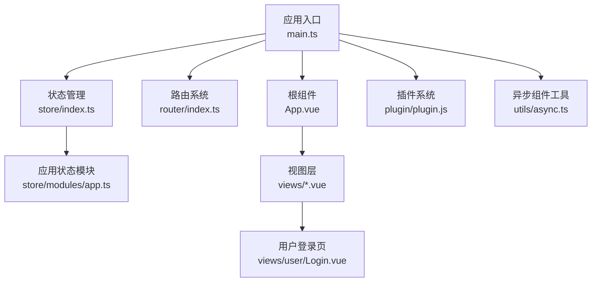
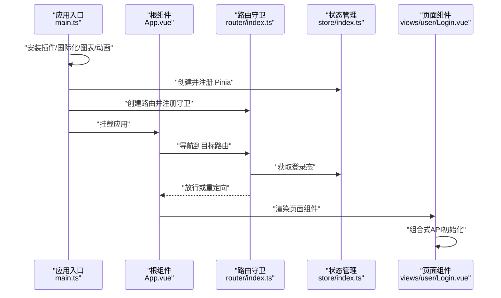
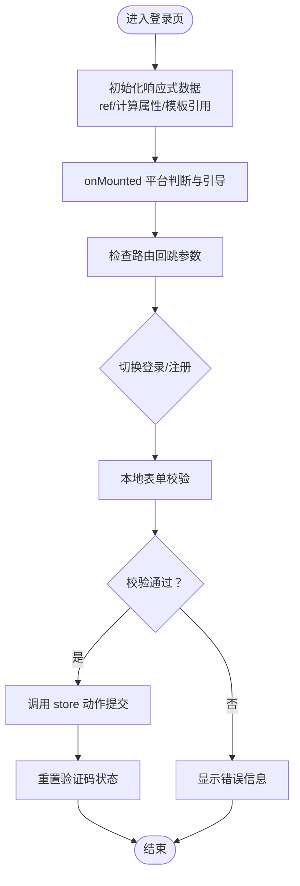
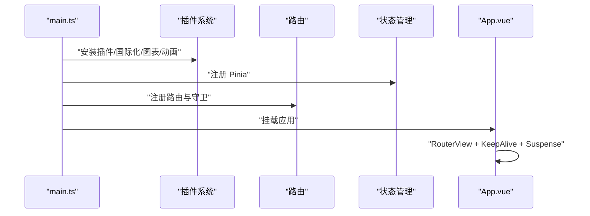
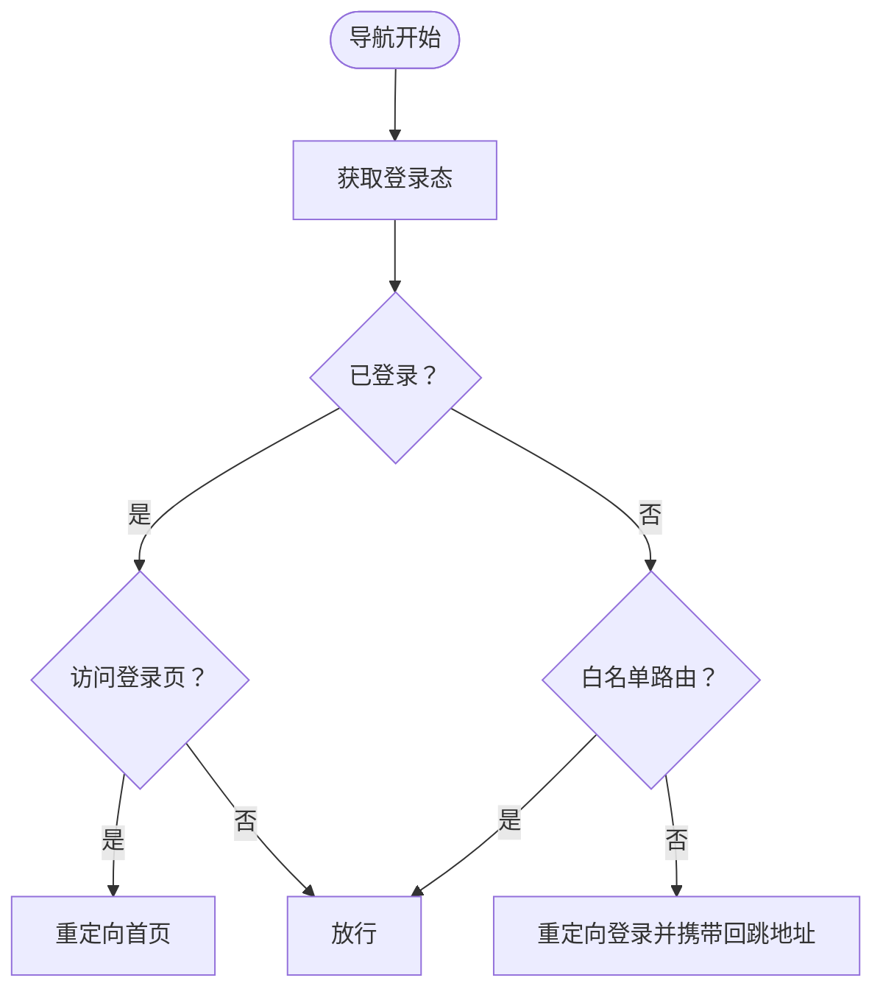
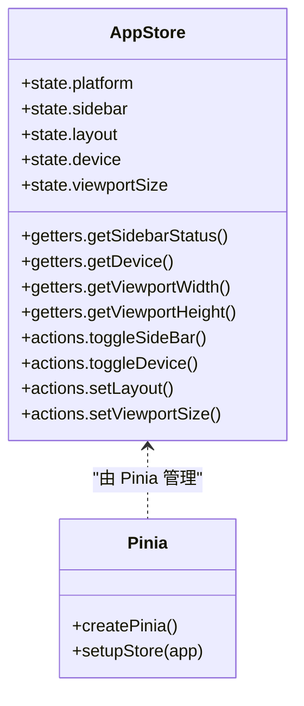
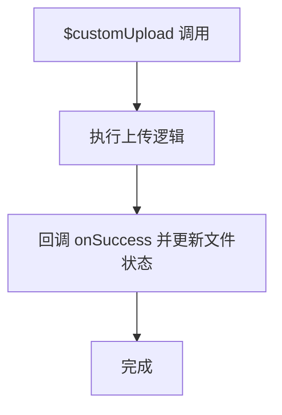
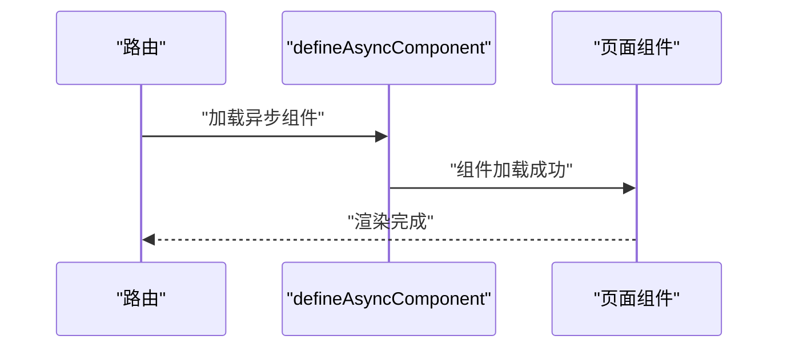
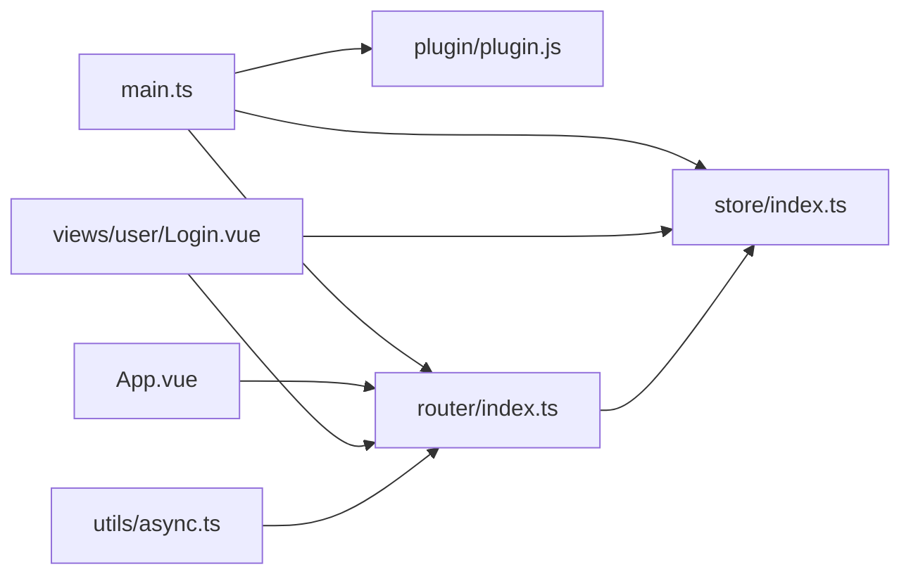

# 组合式API开发

<cite>
**本文档引用的文件**
- [main.ts](file://client/web/src/main.ts)
- [App.vue](file://client/web/src/App.vue)
- [Login.vue](file://client/web/src/views/user/Login.vue)
- [index.ts（路由）](file://client/web/src/router/index.ts)
- [app.ts（应用状态模块）](file://client/web/src/store/modules/app.ts)
- [index.ts（全局状态入口）](file://client/web/src/store/index.ts)
- [plugin.js（插件）](file://client/web/src/plugin/plugin.js)
- [async.ts（异步组件工具）](file://client/web/src/utils/async.ts)
- [async.tsx（异步组件示例）](file://client/web/src/components/async.tsx)
</cite>

## 目录
1. [简介](#简介)
2. [项目结构](#项目结构)
3. [核心组件](#核心组件)
4. [架构总览](#架构总览)
5. [详细组件分析](#详细组件分析)
6. [依赖关系分析](#依赖关系分析)
7. [性能考量](#性能考量)
8. [故障排查指南](#故障排查指南)
9. [结论](#结论)
10. [附录](#附录)

## 简介
本技术文档围绕 Hoper Web 前端（Vue3 + 组合式API）展开，聚焦以下主题：
- setup 函数的使用与最佳实践
- 响应式数据定义、计算属性与侦听器
- 生命周期钩子在组合式API中的使用
- 模板引用与自定义 Hook 的开发模式
- 异步组件加载、动态导入与代码分割策略
- 实际项目中的组件开发模式、状态管理集成与性能优化技巧
- 具体的代码示例与最佳实践指引

## 项目结构
该前端工程采用基于功能域的组织方式，核心入口位于 client/web/src，包含应用启动、路由、状态管理、插件、组件与视图等模块。

图表来源
- [main.ts:16-60](file://client/web/src/main.ts#L16-L60)
- [App.vue:1-27](file://client/web/src/App.vue#L1-L27)
- [index.ts（路由）:1-62](file://client/web/src/router/index.ts#L1-L62)
- [index.ts（全局状态入口）:1-10](file://client/web/src/store/index.ts#L1-L10)
- [app.ts（应用状态模块）:1-86](file://client/web/src/store/modules/app.ts#L1-L86)
- [plugin.js:1-39](file://client/web/src/plugin/plugin.js#L1-L39)
- [async.ts:1-87](file://client/web/src/utils/async.ts#L1-L87)

章节来源
- [main.ts:1-63](file://client/web/src/main.ts#L1-L63)
- [App.vue:1-90](file://client/web/src/App.vue#L1-L90)
- [index.ts（路由）:1-62](file://client/web/src/router/index.ts#L1-L62)
- [index.ts（全局状态入口）:1-10](file://client/web/src/store/index.ts#L1-L10)
- [app.ts（应用状态模块）:1-86](file://client/web/src/store/modules/app.ts#L1-L86)
- [plugin.js:1-39](file://client/web/src/plugin/plugin.js#L1-L39)
- [async.ts:1-87](file://client/web/src/utils/async.ts#L1-L87)

## 核心组件
- 应用启动与插件注册：在应用入口完成插件、国际化、图表、动画等能力的安装，并按平台配置初始化。
- 根组件与路由容器：根组件通过 RouterView + KeepAlive + Suspense 实现页面切换与异步加载骨架。
- 用户登录页：展示组合式API在表单校验、模板引用、生命周期钩子、状态管理与异步交互中的综合应用。
- 路由与鉴权：基于 beforeEach 的全局守卫实现登录态校验与白名单控制，结合 defineAsyncComponent 实现路由级懒加载。
- 状态管理：Pinia Store 定义应用状态与动作，模块化拆分，便于扩展与维护。
- 插件系统：提供全局指令与方法，统一日期格式化与上传行为。
- 异步组件工具：封装 defineAsyncComponent 与 Suspense，支持错误重试、超时与加载占位。

章节来源
- [main.ts:16-60](file://client/web/src/main.ts#L16-L60)
- [App.vue:29-66](file://client/web/src/App.vue#L29-L66)
- [Login.vue:261-367](file://client/web/src/views/user/Login.vue#L261-L367)
- [index.ts（路由）:39-59](file://client/web/src/router/index.ts#L39-L59)
- [app.ts（应用状态模块）:12-81](file://client/web/src/store/modules/app.ts#L12-L81)
- [plugin.js:8-38](file://client/web/src/plugin/plugin.js#L8-L38)
- [async.ts:71-83](file://client/web/src/utils/async.ts#L71-L83)

## 架构总览
下图展示了从应用启动到页面渲染的关键流程，包括插件安装、路由守卫、状态获取与页面挂载。

图表来源
- [main.ts:16-60](file://client/web/src/main.ts#L16-L60)
- [index.ts（路由）:39-59](file://client/web/src/router/index.ts#L39-L59)
- [index.ts（全局状态入口）:1-10](file://client/web/src/store/index.ts#L1-L10)
- [App.vue:29-66](file://client/web/src/App.vue#L29-L66)
- [Login.vue:261-367](file://client/web/src/views/user/Login.vue#L261-L367)

## 详细组件分析

### 组件一：用户登录页（Login.vue）
该组件是组合式API在实际业务中的集中体现，涵盖响应式数据、计算属性、模板引用、生命周期钩子、状态管理与异步交互。

- 响应式数据与模板引用
  - 使用 ref 定义表单字段与状态，如账号、密码、性别、手机号、邮箱、聚焦字段、显示密码等。
  - 使用 ref 获取子组件实例（验证码组件），并通过其公开方法获取值。
- 计算属性
  - 密码强度评分与标签：根据长度、字符类型与特殊字符计算强度等级。
- 侦听器与副作用
  - 在 onMounted 中根据平台弹出引导或跳转小程序登录。
  - 路由参数携带回跳逻辑：已登录且存在回跳参数时自动跳转。
- 状态管理集成
  - 使用 useUserStore 与 useAppStore，调用登录/注册动作并处理成功提示。
- 异步交互
  - 表单提交前进行本地校验，再调用 store 动作发起网络请求；最终重置验证码状态。
- 模板与过渡
  - 使用 Transition + KeepAlive + Suspense 实现页面切换与异步加载骨架。

图表来源
- [Login.vue:261-367](file://client/web/src/views/user/Login.vue#L261-L367)

章节来源
- [Login.vue:261-367](file://client/web/src/views/user/Login.vue#L261-L367)

### 组件二：应用入口与根组件（main.ts、App.vue）
- 应用入口
  - 创建应用实例，批量注册 Vant 组件，安装插件、国际化、图表与动画插件，最后挂载。
  - 平台配置完成后才注册路由与状态，确保运行环境一致。
- 根组件
  - 使用 RouterView + KeepAlive + Suspense 渲染页面内容与加载骨架。
  - 通过 ConfigProvider 设置主题，适配多端主题一致性。

图表来源
- [main.ts:16-60](file://client/web/src/main.ts#L16-L60)
- [App.vue:1-27](file://client/web/src/App.vue#L1-L27)

章节来源
- [main.ts:16-60](file://client/web/src/main.ts#L16-L60)
- [App.vue:1-27](file://client/web/src/App.vue#L1-L27)

### 组件三：路由与鉴权（router/index.ts）
- 路由定义
  - 使用动态导入按平台选择视图组件，实现平台差异化构建。
  - 对聊天等受保护页面使用 defineAsyncComponent 进行路由级懒加载。
- 全局守卫
  - beforeEach 中优先获取登录态，已登录访问登录页则重定向首页；未登录仅允许白名单路由，否则重定向至登录页并携带回跳地址。

图表来源
- [index.ts（路由）:39-59](file://client/web/src/router/index.ts#L39-L59)

章节来源
- [index.ts（路由）:1-62](file://client/web/src/router/index.ts#L1-L62)

### 组件四：状态管理（store/modules/app.ts、store/index.ts）
- 应用状态模块
  - 定义平台、侧边栏状态、布局、设备类型与视口尺寸等状态。
  - 提供 getters 与 actions，支持侧边栏切换、设备切换、布局设置与视口尺寸更新。
- 全局状态入口
  - 创建并导出 Pinia 实例，统一注册到应用。

图表来源
- [app.ts（应用状态模块）:12-81](file://client/web/src/store/modules/app.ts#L12-L81)
- [index.ts（全局状态入口）:1-10](file://client/web/src/store/index.ts#L1-L10)

章节来源
- [app.ts（应用状态模块）:1-86](file://client/web/src/store/modules/app.ts#L1-L86)
- [index.ts（全局状态入口）:1-10](file://client/web/src/store/index.ts#L1-L10)

### 组件五：插件系统（plugin/plugin.js）
- 自定义指令
  - 提供日期格式化指令，统一时间展示格式。
- 全局方法
  - 提供日期格式化与上传封装，统一业务调用入口。
- 上传策略
  - 通过全局方法 $customUpload 统一封装上传流程，回调中触发 onSuccess 并更新文件状态。

图表来源
- [plugin.js:8-38](file://client/web/src/plugin/plugin.js#L8-L38)

章节来源
- [plugin.js:1-39](file://client/web/src/plugin/plugin.js#L1-L39)

### 组件六：异步组件与动态导入（utils/async.ts、router/index.ts、components/async.tsx）
- 路由级异步组件
  - 使用 defineAsyncComponent 对聊天页等受保护页面进行懒加载，减少首屏体积。
- 工具函数封装
  - 封装 defineAsyncComponent 与 Suspense 包裹器，支持错误处理与加载占位。
- JSX/TSX 异步组件示例
  - 展示如何以 defineComponent 形式定义可复用的异步交互组件。

图表来源
- [index.ts（路由）:23-23](file://client/web/src/router/index.ts#L23-L23)
- [async.ts:71-83](file://client/web/src/utils/async.ts#L71-L83)
- [async.tsx:1-29](file://client/web/src/components/async.tsx#L1-L29)

章节来源
- [index.ts（路由）:1-62](file://client/web/src/router/index.ts#L1-L62)
- [async.ts:1-87](file://client/web/src/utils/async.ts#L1-L87)
- [async.tsx:1-29](file://client/web/src/components/async.tsx#L1-L29)

## 依赖关系分析
- 入口依赖
  - main.ts 依赖插件、路由、状态管理与平台配置，形成应用启动闭环。
- 组件依赖
  - App.vue 依赖路由与 KeepAlive/Suspense 实现页面切换与异步加载。
  - Login.vue 依赖 i18n、路由、状态管理、第三方 UI 与模板引用。
- 路由与状态
  - 路由守卫依赖状态管理获取登录态，实现鉴权与重定向。
- 异步加载
  - 路由与工具函数共同实现代码分割与懒加载，降低首屏负担。

图表来源
- [main.ts:16-60](file://client/web/src/main.ts#L16-L60)
- [App.vue:1-27](file://client/web/src/App.vue#L1-L27)
- [Login.vue:261-367](file://client/web/src/views/user/Login.vue#L261-L367)
- [index.ts（路由）:1-62](file://client/web/src/router/index.ts#L1-L62)
- [index.ts（全局状态入口）:1-10](file://client/web/src/store/index.ts#L1-L10)
- [async.ts:1-87](file://client/web/src/utils/async.ts#L1-L87)

章节来源
- [main.ts:1-63](file://client/web/src/main.ts#L1-L63)
- [App.vue:1-90](file://client/web/src/App.vue#L1-L90)
- [Login.vue:261-367](file://client/web/src/views/user/Login.vue#L261-L367)
- [index.ts（路由）:1-62](file://client/web/src/router/index.ts#L1-L62)
- [index.ts（全局状态入口）:1-10](file://client/web/src/store/index.ts#L1-L10)
- [async.ts:1-87](file://client/web/src/utils/async.ts#L1-L87)

## 性能考量
- 代码分割与懒加载
  - 路由级异步组件与 defineAsyncComponent 降低首屏包体，提升首屏速度。
  - 动态导入按平台选择视图组件，避免不必要的资源加载。
- 页面缓存与切换体验
  - KeepAlive 缓存页面实例，Suspense 提供加载骨架，改善切换体验。
- 状态持久化与响应式
  - 将布局与视口尺寸等状态持久化到存储，减少重复计算与 DOM 查询。
- 图标与样式
  - 按需引入 Vant 样式，避免全量样式引入造成体积膨胀。

## 故障排查指南
- 登录页无法切换或表单异常
  - 检查模板引用是否正确绑定子组件实例，确认子组件公开方法可用。
  - 校验本地校验规则与错误对象更新逻辑。
- 路由跳转异常或白名单失效
  - 确认 beforeEach 中登录态获取顺序与白名单列表。
  - 检查回跳参数传递与目标路径有效性。
- 异步组件加载失败
  - 查看 defineAsyncComponent 的 onError 回调与错误堆栈。
  - 确认动态导入路径与打包产物是否存在。
- 主题或平台配置不生效
  - 确认平台配置在挂载前完成，且 ConfigProvider 的主题设置正确。

章节来源
- [Login.vue:261-367](file://client/web/src/views/user/Login.vue#L261-L367)
- [index.ts（路由）:39-59](file://client/web/src/router/index.ts#L39-L59)
- [async.ts:71-83](file://client/web/src/utils/async.ts#L71-L83)
- [App.vue:29-66](file://client/web/src/App.vue#L29-L66)

## 结论
本项目在 Vue3 组合式API实践中，通过清晰的模块划分与合理的异步加载策略，实现了良好的可维护性与性能表现。建议在后续开发中持续遵循：
- 明确响应式数据边界，合理使用 ref/computed/watch
- 将跨页面逻辑抽象为自定义 Hook 或工具函数
- 严格区分路由级懒加载与组件级懒加载场景
- 保持状态管理模块职责单一，动作幂等与可追踪
- 在复杂页面中优先采用 Suspense + KeepAlive 提升用户体验

## 附录
- 最佳实践清单
  - 使用 defineStore 定义模块化状态，避免全局状态污染
  - 将平台差异与环境变量收敛到入口与插件层
  - 对受保护页面统一使用路由守卫与白名单机制
  - 对大组件与第三方依赖采用异步组件与动态导入
  - 在组合式API中尽量将副作用集中在 onMounted/onUnmounted 等生命周期钩子内