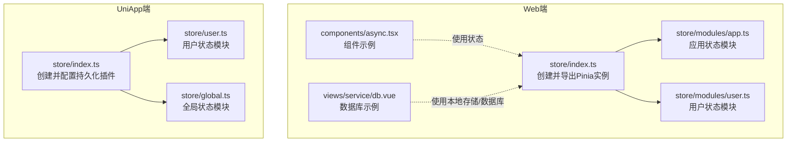
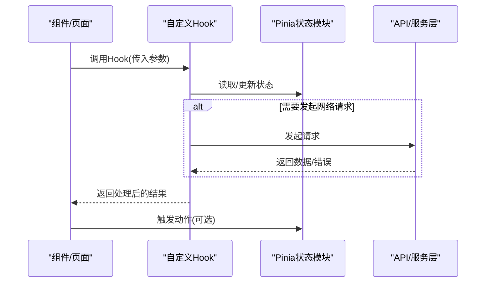
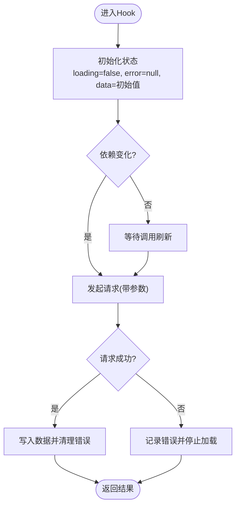
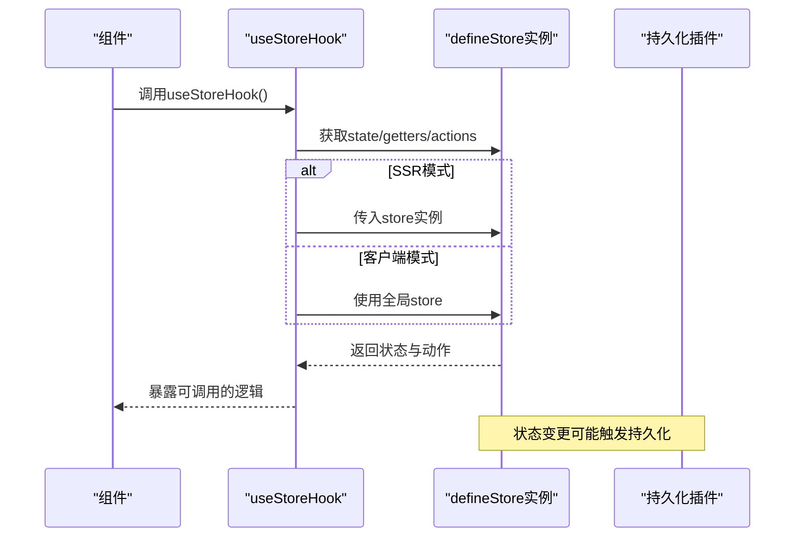
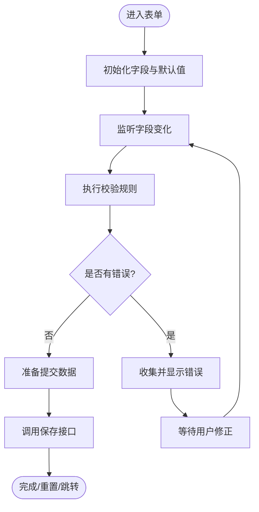
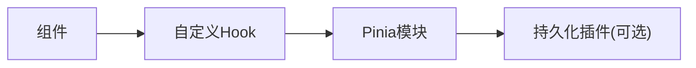

# 自定义Hook开发

<cite>
**本文档引用的文件**
- [client/web/src/store/index.ts](file://client/web/src/store/index.ts)
- [client/web/src/store/modules/app.ts](file://client/web/src/store/modules/app.ts)
- [client/web/src/store/modules/user.ts](file://client/web/src/store/modules/user.ts)
- [client/uniapp/src/store/index.ts](file://client/uniapp/src/store/index.ts)
- [client/uniapp/src/store/user.ts](file://client/uniapp/src/store/user.ts)
- [client/uniapp/src/store/global.ts](file://client/uniapp/src/store/global.ts)
- [client/web/src/components/async.tsx](file://client/web/src/components/async.tsx)
- [client/web/src/views/service/db.vue](file://client/web/src/views/service/db.vue)
</cite>

## 目录
1. [简介](#简介)
2. [项目结构](#项目结构)
3. [核心组件](#核心组件)
4. [架构总览](#架构总览)
5. [详细组件分析](#详细组件分析)
6. [依赖分析](#依赖分析)
7. [性能考虑](#性能考虑)
8. [故障排查指南](#故障排查指南)
9. [结论](#结论)
10. [附录](#附录)

## 简介
本文件面向Hoper项目的前端工程，聚焦“自定义Hook”的设计与实现，帮助开发者构建可复用的逻辑封装，覆盖数据获取、状态管理、表单处理等常见场景。文档从设计原则、命名规范、跨组件共享策略出发，结合现有Pinia Store与组件实践，给出可落地的实现模式与最佳实践，并提供测试、性能优化与错误处理建议。

## 项目结构
Hoper前端由Web端与UniApp端组成，均采用Pinia进行状态管理；同时存在部分原生浏览器能力的直接使用示例。下图展示了与Hook开发相关的核心模块关系：

图表来源
- [client/web/src/store/index.ts:1-10](file://client/web/src/store/index.ts#L1-L10)
- [client/web/src/store/modules/app.ts:1-86](file://client/web/src/store/modules/app.ts#L1-L86)
- [client/web/src/store/modules/user.ts:1-93](file://client/web/src/store/modules/user.ts#L1-L93)
- [client/uniapp/src/store/index.ts:1-13](file://client/uniapp/src/store/index.ts#L1-L13)
- [client/uniapp/src/store/user.ts:1-87](file://client/uniapp/src/store/user.ts#L1-L87)
- [client/uniapp/src/store/global.ts:1-27](file://client/uniapp/src/store/global.ts#L1-L27)
- [client/web/src/components/async.tsx:1-29](file://client/web/src/components/async.tsx#L1-L29)
- [client/web/src/views/service/db.vue:1-70](file://client/web/src/views/service/db.vue#L1-L70)

章节来源
- [client/web/src/store/index.ts:1-10](file://client/web/src/store/index.ts#L1-L10)
- [client/uniapp/src/store/index.ts:1-13](file://client/uniapp/src/store/index.ts#L1-L13)

## 核心组件
本节梳理与Hook开发密切相关的状态管理与组件层，便于抽象出可复用的逻辑封装。

- Web端Pinia初始化与挂载
  - 在Web端通过集中初始化Pinia实例并挂载到应用，确保全局状态可用。
  - 参考：[client/web/src/store/index.ts:1-10](file://client/web/src/store/index.ts#L1-L10)

- 应用状态模块（app）
  - 提供平台、侧边栏、布局、设备类型、视口尺寸等状态与动作，适合抽取为“UI行为”类Hook。
  - 参考：[client/web/src/store/modules/app.ts:12-86](file://client/web/src/store/modules/app.ts#L12-L86)

- 用户状态模块（user）
  - 提供用户信息、登录、登出、刷新token等动作，适合抽取为“认证与用户态”类Hook。
  - 参考：[client/web/src/store/modules/user.ts:13-93](file://client/web/src/store/modules/user.ts#L13-L93)

- UniApp端Pinia与持久化
  - 通过插件实现数据持久化，适合作为“跨页面/重启保持”的状态Hook基础。
  - 参考：[client/uniapp/src/store/index.ts:1-13](file://client/uniapp/src/store/index.ts#L1-L13)

- UniApp用户状态模块
  - 集成HTTP客户端、鉴权、缓存与用户列表追加逻辑，适合抽取为“网络请求+缓存”类Hook。
  - 参考：[client/uniapp/src/store/user.ts:16-87](file://client/uniapp/src/store/user.ts#L16-L87)

- 组件示例
  - 组件内直接使用响应式数据与事件，体现“逻辑内聚、渲染分离”的Hook思想。
  - 参考：[client/web/src/components/async.tsx:3-29](file://client/web/src/components/async.tsx#L3-L29)

- 视图层数据库示例
  - 展示了对浏览器数据库的直接使用，可作为“本地持久化”类Hook的参考实现。
  - 参考：[client/web/src/views/service/db.vue:15-67](file://client/web/src/views/service/db.vue#L15-L67)

章节来源
- [client/web/src/store/index.ts:1-10](file://client/web/src/store/index.ts#L1-L10)
- [client/web/src/store/modules/app.ts:12-86](file://client/web/src/store/modules/app.ts#L12-L86)
- [client/web/src/store/modules/user.ts:13-93](file://client/web/src/store/modules/user.ts#L13-L93)
- [client/uniapp/src/store/index.ts:1-13](file://client/uniapp/src/store/index.ts#L1-L13)
- [client/uniapp/src/store/user.ts:16-87](file://client/uniapp/src/store/user.ts#L16-L87)
- [client/web/src/components/async.tsx:3-29](file://client/web/src/components/async.tsx#L3-L29)
- [client/web/src/views/service/db.vue:15-67](file://client/web/src/views/service/db.vue#L15-L67)

## 架构总览
下图展示了“组件—Hook—Store”的典型交互路径，强调Hook作为“逻辑封装”的桥梁作用。

图表来源
- [client/web/src/store/modules/app.ts:47-80](file://client/web/src/store/modules/app.ts#L47-L80)
- [client/web/src/store/modules/user.ts:50-86](file://client/web/src/store/modules/user.ts#L50-L86)
- [client/uniapp/src/store/user.ts:28-80](file://client/uniapp/src/store/user.ts#L28-L80)

## 详细组件分析

### 设计原则与命名规范
- 原则
  - 单一职责：每个Hook专注于一类业务或一类能力（如认证、列表加载、表单校验）。
  - 无副作用：Hook内部避免直接操作DOM或全局状态，通过返回值与回调暴露变更。
  - 可组合：多个Hook可按需组合，形成复杂逻辑。
  - 可测试：通过参数注入与返回值，便于单元测试。
- 命名
  - useXxx：统一以use开头，语义清晰，如useAppStoreHook、useUserStoreHook、useAsyncState等。
  - 避免与Vue内置API冲突，如不要命名为useStore。

### 数据获取Hook（useApi）
- 目标
  - 封装异步数据获取、加载状态、错误处理与重试机制。
- 实现要点
  - 输入：请求参数、依赖数组、配置项（如缓存策略、超时）。
  - 输出：数据、loading、error、刷新函数、取消函数。
  - 错误处理：区分网络错误、业务错误，统一上报与提示。
  - 缓存策略：基于URL与参数生成key，命中则返回缓存，未命中则请求并写入缓存。
- 示例参考
  - Web端用户登录流程与错误分支：[client/web/src/store/modules/user.ts:50-63](file://client/web/src/store/modules/user.ts#L50-L63)
  - UniApp用户登录与鉴权写入：[client/uniapp/src/store/user.ts:39-55](file://client/uniapp/src/store/user.ts#L39-L55)

图表来源
- [client/web/src/store/modules/user.ts:50-63](file://client/web/src/store/modules/user.ts#L50-L63)
- [client/uniapp/src/store/user.ts:39-55](file://client/uniapp/src/store/user.ts#L39-L55)

章节来源
- [client/web/src/store/modules/user.ts:50-63](file://client/web/src/store/modules/user.ts#L50-L63)
- [client/uniapp/src/store/user.ts:39-55](file://client/uniapp/src/store/user.ts#L39-L55)

### 状态管理Hook（useStore）
- 目标
  - 将Pinia模块的状态与动作封装为易用的Hook，支持SSR与非SSR两种模式。
- 实现要点
  - 读取：从store中解构state与getters。
  - 写入：调用actions，必要时同步本地存储或缓存。
  - SSR兼容：提供带store参数的工厂函数，避免在服务端直接访问全局实例。
- 示例参考
  - Web端应用状态模块与SSR工厂函数：[client/web/src/store/modules/app.ts:83-86](file://client/web/src/store/modules/app.ts#L83-L86)
  - Web端用户状态模块与SSR工厂函数：[client/web/src/store/modules/user.ts:90-93](file://client/web/src/store/modules/user.ts#L90-L93)
  - UniApp端Pinia持久化配置：[client/uniapp/src/store/index.ts:5-12](file://client/uniapp/src/store/index.ts#L5-L12)

图表来源
- [client/web/src/store/modules/app.ts:83-86](file://client/web/src/store/modules/app.ts#L83-L86)
- [client/web/src/store/modules/user.ts:90-93](file://client/web/src/store/modules/user.ts#L90-L93)
- [client/uniapp/src/store/index.ts:5-12](file://client/uniapp/src/store/index.ts#L5-L12)

章节来源
- [client/web/src/store/modules/app.ts:83-86](file://client/web/src/store/modules/app.ts#L83-L86)
- [client/web/src/store/modules/user.ts:90-93](file://client/web/src/store/modules/user.ts#L90-L93)
- [client/uniapp/src/store/index.ts:5-12](file://client/uniapp/src/store/index.ts#L5-L12)

### 表单处理Hook（useForm）
- 目标
  - 封装表单字段、校验规则、提交流程与错误收集。
- 实现要点
  - 字段模型：字段值、是否必填、默认值。
  - 校验：支持同步与异步校验，返回错误消息。
  - 提交：合并字段值，调用保存接口，处理成功/失败。
  - 重置：一键清空或回滚到初始值。
- 示例参考
  - 组件内事件与输入绑定：[client/web/src/components/async.tsx:8-22](file://client/web/src/components/async.tsx#L8-L22)
  - 视图层数据库事务与状态更新：[client/web/src/views/service/db.vue:34-67](file://client/web/src/views/service/db.vue#L34-L67)

图表来源
- [client/web/src/components/async.tsx:8-22](file://client/web/src/components/async.tsx#L8-L22)
- [client/web/src/views/service/db.vue:34-67](file://client/web/src/views/service/db.vue#L34-L67)

章节来源
- [client/web/src/components/async.tsx:8-22](file://client/web/src/components/async.tsx#L8-L22)
- [client/web/src/views/service/db.vue:34-67](file://client/web/src/views/service/db.vue#L34-L67)

### 本地持久化Hook（useStorage）
- 目标
  - 封装本地存储（localStorage/sessionStorage/IndexedDB/SQLite）的读写与过期控制。
- 实现要点
  - 读取：优先从内存缓存，再从持久化存储读取。
  - 写入：原子性更新，必要时触发序列化/反序列化。
  - 清理：定时清理过期项，避免无限增长。
- 示例参考
  - Web端数据库事务与插入：[client/web/src/views/service/db.vue:35-47](file://client/web/src/views/service/db.vue#L35-L47)
  - UniApp持久化插件配置：[client/uniapp/src/store/index.ts:5-12](file://client/uniapp/src/store/index.ts#L5-L12)

章节来源
- [client/web/src/views/service/db.vue:35-47](file://client/web/src/views/service/db.vue#L35-L47)
- [client/uniapp/src/store/index.ts:5-12](file://client/uniapp/src/store/index.ts#L5-L12)

### 集成方式与最佳实践
- 组件内集成
  - 在setup中调用Hook，解构返回值并绑定到模板。
  - 对于需要SSR的场景，使用带store参数的工厂函数。
- 跨组件共享
  - 将公共逻辑下沉至Hook，避免重复复制粘贴。
  - 通过参数化配置（如命名空间、缓存键）实现多实例隔离。
- 与路由/拦截器协作
  - 在路由守卫中调用认证Hook，确保访问受控。
  - 在拦截器中统一处理错误码与自动刷新token。

## 依赖分析
- 组件与Hook
  - 组件通过Hook暴露的API与状态进行交互，降低耦合度。
- Hook与Store
  - Hook内部依赖Pinia模块，读取state与调用actions。
- Store与持久化
  - UniApp端通过插件实现持久化，影响Hook的初始化与数据恢复。

图表来源
- [client/uniapp/src/store/index.ts:5-12](file://client/uniapp/src/store/index.ts#L5-L12)

章节来源
- [client/uniapp/src/store/index.ts:5-12](file://client/uniapp/src/store/index.ts#L5-L12)

## 性能考虑
- 避免不必要的重渲染
  - 使用computed与浅比较，减少依赖变更。
  - 将稳定的数据放入常量或静态资源。
- 请求去抖与节流
  - 对高频输入（如搜索框）使用防抖/节流。
- 缓存策略
  - 合理设置TTL与LRU淘汰，避免缓存膨胀。
- 并发控制
  - 对同一接口的并发请求进行去重或队列化。
- SSR友好
  - 避免在服务端直接访问window/document等全局对象，使用条件判断或工厂函数。

## 故障排查指南
- 登录失败
  - 检查错误分支与日志输出，确认是否抛出业务错误或网络异常。
  - 参考：[client/web/src/store/modules/user.ts:59-62](file://client/web/src/store/modules/user.ts#L59-L62)
  - 参考：[client/uniapp/src/store/user.ts:52-55](file://client/uniapp/src/store/user.ts#L52-L55)
- 状态未持久化
  - 确认持久化插件已正确安装与配置。
  - 参考：[client/uniapp/src/store/index.ts:5-12](file://client/uniapp/src/store/index.ts#L5-L12)
- 数据库事务失败
  - 检查SQL语法与事务回调，确保错误回调被正确处理。
  - 参考：[client/web/src/views/service/db.vue:63-66](file://client/web/src/views/service/db.vue#L63-L66)

章节来源
- [client/web/src/store/modules/user.ts:59-62](file://client/web/src/store/modules/user.ts#L59-L62)
- [client/uniapp/src/store/user.ts:52-55](file://client/uniapp/src/store/user.ts#L52-L55)
- [client/uniapp/src/store/index.ts:5-12](file://client/uniapp/src/store/index.ts#L5-L12)
- [client/web/src/views/service/db.vue:63-66](file://client/web/src/views/service/db.vue#L63-L66)

## 结论
通过将通用逻辑封装为可复用的Hook，Hoper项目能够显著提升组件间的代码复用率与可维护性。结合Pinia的状态管理与持久化能力，开发者可以快速构建数据获取、状态管理、表单处理与本地持久化等常见场景的Hook，并在组件中以声明式的方式进行集成与扩展。

## 附录
- 测试建议
  - 使用Jest/Vitest模拟API与Store，断言Hook的返回值与副作用。
  - 对错误分支与边界条件进行覆盖，如网络异常、空数据、过期缓存等。
- 性能监控
  - 对关键Hook的调用次数、耗时与内存占用进行埋点统计。
- 文档与规范
  - 统一Hook命名与参数风格，提供README示例与变更日志。