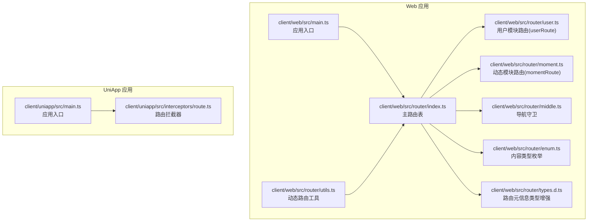
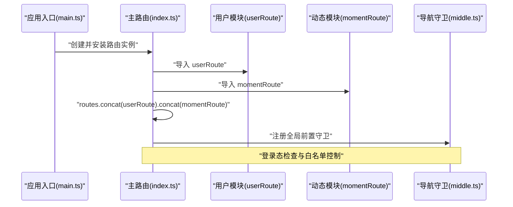
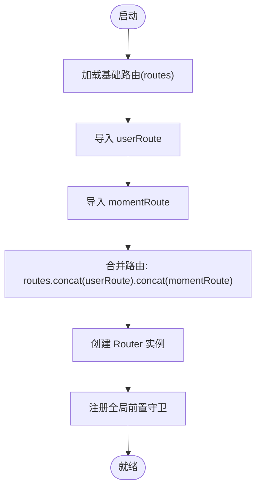
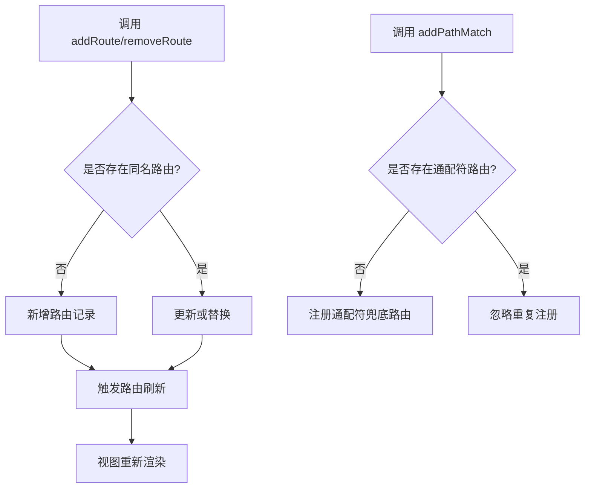
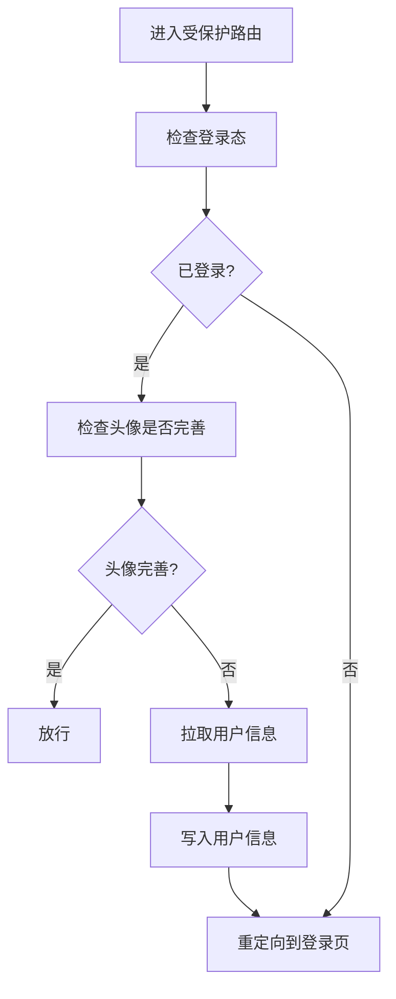
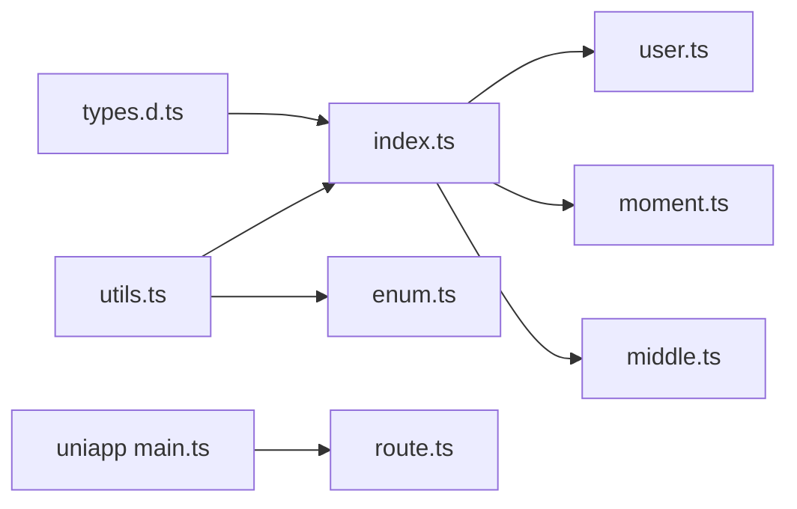

# 动态路由与模块化

<cite>
**本文引用的文件**
- [client/web/src/main.ts](file://client/web/src/main.ts)
- [client/web/src/router/index.ts](file://client/web/src/router/index.ts)
- [client/web/src/router/user.ts](file://client/web/src/router/user.ts)
- [client/web/src/router/moment.ts](file://client/web/src/router/moment.ts)
- [client/web/src/router/utils.ts](file://client/web/src/router/utils.ts)
- [client/web/src/router/middle.ts](file://client/web/src/router/middle.ts)
- [client/web/src/router/enum.ts](file://client/web/src/router/enum.ts)
- [client/web/src/router/types.d.ts](file://client/web/src/router/types.d.ts)
- [client/uniapp/src/main.ts](file://client/uniapp/src/main.ts)
- [client/uniapp/src/interceptors/route.ts](file://client/uniapp/src/interceptors/route.ts)
</cite>

## 目录
1. [简介](#简介)
2. [项目结构](#项目结构)
3. [核心组件](#核心组件)
4. [架构总览](#架构总览)
5. [详细组件分析](#详细组件分析)
6. [依赖分析](#依赖分析)
7. [性能考量](#性能考量)
8. [故障排查指南](#故障排查指南)
9. [结论](#结论)
10. [附录](#附录)

## 简介
本文件面向 Hoper Vue3 前端（web）与 UniApp（多端）场景，系统化阐述“动态路由与模块化”的设计与实现。重点包括：
- 动态路由的合并机制：如何在运行时将模块化路由拼接到主路由表中
- 模块化路由的组织方式：用户模块(userRoute)与动态模块(momentRoute)的定义与导入
- 路由模块的独立管理：模块间低耦合、可插拔
- 运行时路由增删改：基于 addRoute/removeRoute 的能力与注意事项
- 代码分割与按需加载：异步组件与 glob 导入策略
- 中间件与鉴权：导航守卫与登录状态校验
- 扩展性与设计模式：可复用的路由工厂、历史模式配置、类型增强

## 项目结构
前端采用多入口/多平台策略：
- Web 应用位于 client/web，使用 Vue3 + vue-router + Vite
- UniApp 应用位于 client/uniapp，支持多端运行
- 路由相关代码集中在 client/web/src/router 下

图表来源
- [client/web/src/main.ts:1-63](file://client/web/src/main.ts#L1-L63)
- [client/web/src/router/index.ts:1-62](file://client/web/src/router/index.ts#L1-L62)
- [client/web/src/router/user.ts:1-23](file://client/web/src/router/user.ts#L1-L23)
- [client/web/src/router/moment.ts:1-15](file://client/web/src/router/moment.ts#L1-L15)
- [client/web/src/router/utils.ts:1-79](file://client/web/src/router/utils.ts#L1-L79)
- [client/web/src/router/middle.ts:1-24](file://client/web/src/router/middle.ts#L1-L24)
- [client/web/src/router/enum.ts:1-12](file://client/web/src/router/enum.ts#L1-L12)
- [client/web/src/router/types.d.ts:1-11](file://client/web/src/router/types.d.ts#L1-L11)
- [client/uniapp/src/main.ts:1-22](file://client/uniapp/src/main.ts#L1-L22)
- [client/uniapp/src/interceptors/route.ts:1-54](file://client/uniapp/src/interceptors/route.ts#L1-L54)

章节来源
- [client/web/src/main.ts:1-63](file://client/web/src/main.ts#L1-L63)
- [client/web/src/router/index.ts:1-62](file://client/web/src/router/index.ts#L1-L62)

## 核心组件
- 主路由表与合并机制：在主路由 index.ts 中通过 concat 将 userRoute 与 momentRoute 合并到 routes，并在构造 Router 实例时一次性注入
- 用户模块路由(userRoute)：集中定义用户相关页面（编辑、登录、激活），统一使用异步组件按需加载
- 动态模块路由(momentRoute)：集中定义动态内容相关页面（新增、详情），同样采用异步组件
- 动态路由工具(utils.ts)：提供 addRoute/ removeRoute 的封装、通配符兜底路由、历史模式切换等
- 导航守卫(middle.ts)：完成登录态与资料完整性校验
- 类型增强(types.d.ts)：为每个路由 record 提供 requiresAuth 元信息
- 内容类型枚举(enum.ts)：用于动态跳转的目标路径生成
- UniApp 路由拦截：在多端环境下对导航进行统一拦截与重定向

章节来源
- [client/web/src/router/index.ts:1-62](file://client/web/src/router/index.ts#L1-L62)
- [client/web/src/router/user.ts:1-23](file://client/web/src/router/user.ts#L1-L23)
- [client/web/src/router/moment.ts:1-15](file://client/web/src/router/moment.ts#L1-L15)
- [client/web/src/router/utils.ts:1-79](file://client/web/src/router/utils.ts#L1-L79)
- [client/web/src/router/middle.ts:1-24](file://client/web/src/router/middle.ts#L1-L24)
- [client/web/src/router/enum.ts:1-12](file://client/web/src/router/enum.ts#L1-L12)
- [client/web/src/router/types.d.ts:1-11](file://client/web/src/router/types.d.ts#L1-L11)
- [client/uniapp/src/interceptors/route.ts:1-54](file://client/uniapp/src/interceptors/route.ts#L1-L54)

## 架构总览
下图展示 Web 端路由初始化与模块化合并的整体流程。

图表来源
- [client/web/src/main.ts:54-60](file://client/web/src/main.ts#L54-L60)
- [client/web/src/router/index.ts:34-59](file://client/web/src/router/index.ts#L34-L59)
- [client/web/src/router/user.ts:5-22](file://client/web/src/router/user.ts#L5-L22)
- [client/web/src/router/moment.ts:4-14](file://client/web/src/router/moment.ts#L4-L14)
- [client/web/src/router/middle.ts:7-23](file://client/web/src/router/middle.ts#L7-L23)

## 详细组件分析

### 组件一：主路由表与合并机制
- 初始化：通过 createRouter 创建路由实例，传入 routes 数组
- 合并策略：将 userRoute 与 momentRoute 通过 concat 追加到基础 routes，形成最终路由表
- 全局守卫：beforeEach 中处理已登录/未登录分支，结合白名单控制访问
- 异步组件：基础路由与模块路由均采用异步组件，实现按需加载

图表来源
- [client/web/src/router/index.ts:13-37](file://client/web/src/router/index.ts#L13-L37)
- [client/web/src/router/index.ts:39-59](file://client/web/src/router/index.ts#L39-L59)

章节来源
- [client/web/src/router/index.ts:1-62](file://client/web/src/router/index.ts#L1-L62)

### 组件二：用户模块路由(userRoute)
- 定义位置：独立文件导出 userRoute
- 页面覆盖：编辑资料、登录、账号激活
- 加载策略：异步组件按需加载
- 鉴权策略：部分路由使用 completedAuthenticated 导航守卫

章节来源
- [client/web/src/router/user.ts:1-23](file://client/web/src/router/user.ts#L1-L23)
- [client/web/src/router/middle.ts:12-23](file://client/web/src/router/middle.ts#L12-L23)

### 组件三：动态模块路由(momentRoute)
- 定义位置：独立文件导出 momentRoute
- 页面覆盖：动态内容新增、详情
- 加载策略：异步组件按需加载
- 鉴权策略：当前未强制登录，后续可按需接入守卫

章节来源
- [client/web/src/router/moment.ts:1-15](file://client/web/src/router/moment.ts#L1-L15)

### 组件四：动态路由工具与运行时增删改
- addRoute：向路由器动态添加路由记录
- removeRoute：移除指定路由记录
- addPathMatch：确保通配符兜底路由仅注册一次
- getHistoryMode：根据字符串配置切换 hash 或 h5 历史模式
- jump：基于内容类型枚举生成目标路径并跳转

图表来源
- [client/web/src/router/utils.ts:40-48](file://client/web/src/router/utils.ts#L40-L48)
- [client/web/src/router/utils.ts:52-73](file://client/web/src/router/utils.ts#L52-L73)

章节来源
- [client/web/src/router/utils.ts:1-79](file://client/web/src/router/utils.ts#L1-L79)

### 组件五：导航守卫与鉴权
- authenticated：仅校验登录态
- completedAuthenticated：校验登录且头像已完善，否则尝试拉取用户信息并重定向登录

图表来源
- [client/web/src/router/middle.ts:7-23](file://client/web/src/router/middle.ts#L7-L23)

章节来源
- [client/web/src/router/middle.ts:1-24](file://client/web/src/router/middle.ts#L1-L24)

### 组件六：类型增强与内容类型枚举
- 类型增强：为 RouteMeta 增加 requiresAuth 字段，保证路由元信息一致性
- 内容类型枚举：contentRoute 映射内容类型到路径前缀，配合 jump 使用

章节来源
- [client/web/src/router/types.d.ts:1-11](file://client/web/src/router/types.d.ts#L1-L11)
- [client/web/src/router/enum.ts:1-12](file://client/web/src/router/enum.ts#L1-L12)
- [client/web/src/router/utils.ts:20-27](file://client/web/src/router/utils.ts#L20-L27)

### 组件七：UniApp 路由拦截
- 在多端环境下，通过拦截 navigateTo/reLaunch/redirectTo 实现登录拦截
- 白名单/黑名单策略：根据 needLoginPages 列表决定是否放行
- 未登录时自动跳转至登录页并携带 redirect 参数

章节来源
- [client/uniapp/src/interceptors/route.ts:1-54](file://client/uniapp/src/interceptors/route.ts#L1-L54)
- [client/uniapp/src/main.ts:15-16](file://client/uniapp/src/main.ts#L15-L16)

## 依赖分析
- 模块耦合度：主路由仅依赖 userRoute 与 momentRoute 的导出，彼此独立，耦合度低
- 运行时依赖：动态路由工具依赖 vue-router 的 addRoute/removeRoute；jump 依赖 contentRoute 枚举与 store mutation
- 平台差异：Web 与 UniApp 分别维护各自的路由拦截与入口，避免相互干扰

图表来源
- [client/web/src/router/index.ts:1-62](file://client/web/src/router/index.ts#L1-L62)
- [client/web/src/router/user.ts:1-23](file://client/web/src/router/user.ts#L1-L23)
- [client/web/src/router/moment.ts:1-15](file://client/web/src/router/moment.ts#L1-L15)
- [client/web/src/router/utils.ts:1-79](file://client/web/src/router/utils.ts#L1-L79)
- [client/web/src/router/enum.ts:1-12](file://client/web/src/router/enum.ts#L1-L12)
- [client/web/src/router/types.d.ts:1-11](file://client/web/src/router/types.d.ts#L1-L11)
- [client/uniapp/src/main.ts:1-22](file://client/uniapp/src/main.ts#L1-L22)
- [client/uniapp/src/interceptors/route.ts:1-54](file://client/uniapp/src/interceptors/route.ts#L1-L54)

章节来源
- [client/web/src/router/index.ts:1-62](file://client/web/src/router/index.ts#L1-L62)
- [client/web/src/router/utils.ts:1-79](file://client/web/src/router/utils.ts#L1-L79)

## 性能考量
- 异步组件与代码分割：所有路由组件均采用 defineAsyncComponent/import 形式，按需加载，降低首屏体积
- 路由懒加载：基础路由与模块路由均采用懒加载，减少初始包体
- 历史模式选择：通过 getHistoryMode 支持 hash 与 h5 模式切换，便于部署与兼容
- 通配符兜底：addPathMatch 仅注册一次，避免重复注册带来的开销

章节来源
- [client/web/src/router/index.ts:17-24](file://client/web/src/router/index.ts#L17-L24)
- [client/web/src/router/user.ts:10-15](file://client/web/src/router/user.ts#L10-L15)
- [client/web/src/router/moment.ts:8-12](file://client/web/src/router/moment.ts#L8-L12)
- [client/web/src/router/utils.ts:29-30](file://client/web/src/router/utils.ts#L29-L30)
- [client/web/src/router/utils.ts:52-73](file://client/web/src/router/utils.ts#L52-L73)
- [client/web/src/router/utils.ts:40-48](file://client/web/src/router/utils.ts#L40-L48)

## 故障排查指南
- 登录后仍被重定向到登录页
  - 检查 completedAuthenticated 是否正确拉取用户信息并写入 store
  - 确认 beforeEnter 钩子执行顺序与条件
- 新增的动态路由不生效
  - 确认 addRoute 调用时未与已有路由名称冲突
  - 确保 addPathMatch 仅注册一次，避免重复
- 通配符路由未生效
  - 检查 addPathMatch 是否被调用
  - 确认通配符路由未被其他路由覆盖
- UniApp 导航拦截无效
  - 检查 needLoginPages 列表与实际页面路径是否一致
  - 确认拦截器已通过 install 注册

章节来源
- [client/web/src/router/middle.ts:12-23](file://client/web/src/router/middle.ts#L12-L23)
- [client/web/src/router/utils.ts:40-48](file://client/web/src/router/utils.ts#L40-L48)
- [client/uniapp/src/interceptors/route.ts:20-44](file://client/uniapp/src/interceptors/route.ts#L20-L44)

## 结论
该方案通过“模块化路由 + 运行时动态合并”的方式，实现了路由的高内聚、低耦合与强扩展性。用户模块与动态模块各自独立定义与维护，主路由仅负责聚合与守卫，既保证了开发效率，又兼顾了运行时性能与可维护性。配合异步组件与历史模式切换，能够满足多端与多部署场景的需求。

## 附录
- 设计模式建议
  - 路由工厂：将 addRoute 的调用封装为统一工厂方法，便于集中治理
  - 条件注册：对通配符与兜底路由采用“存在即止”的注册策略
  - 类型安全：通过 RouteMeta 类型增强，确保每个路由的元信息一致
- 扩展性建议
  - 模块化：新增模块时仅需在对应模块文件中定义路由数组，再在主路由中引入即可
  - 动态化：结合 jump 与 contentRoute，可快速生成内容类路由跳转
  - 多端：Web 与 UniApp 可分别维护拦截策略，保持平台隔离