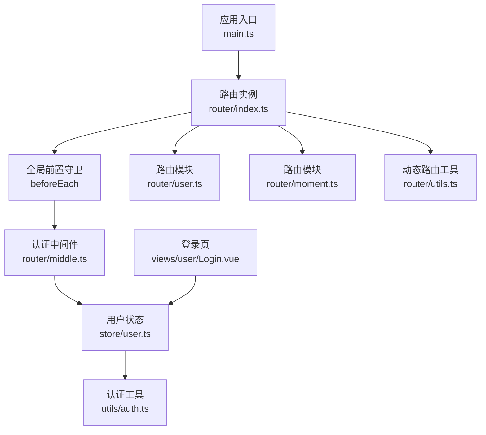
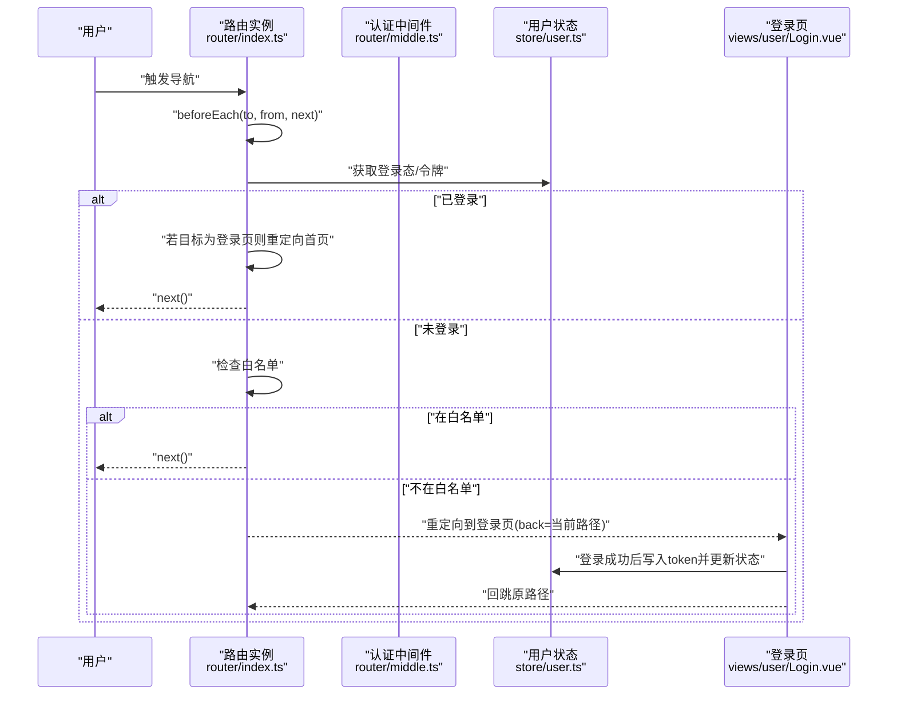
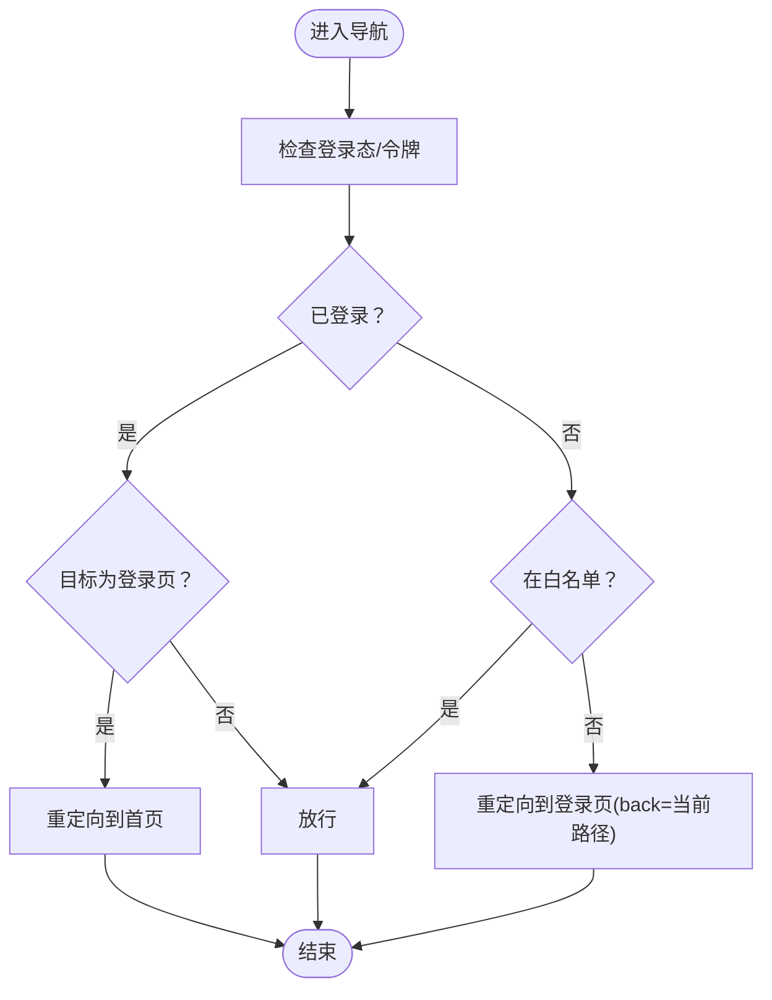
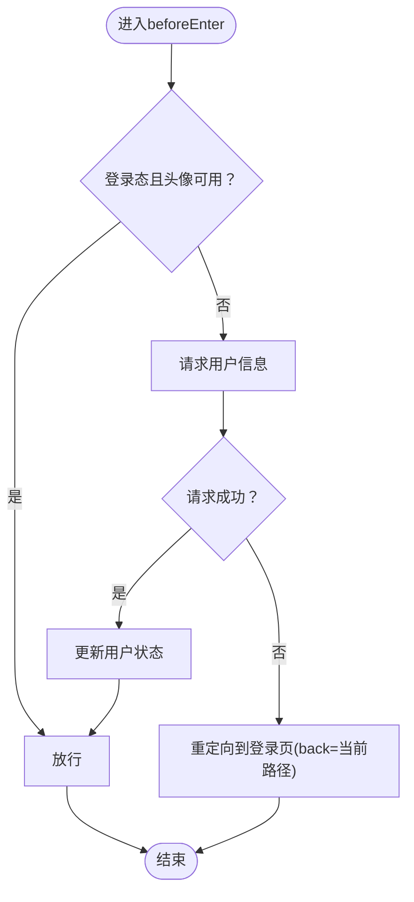
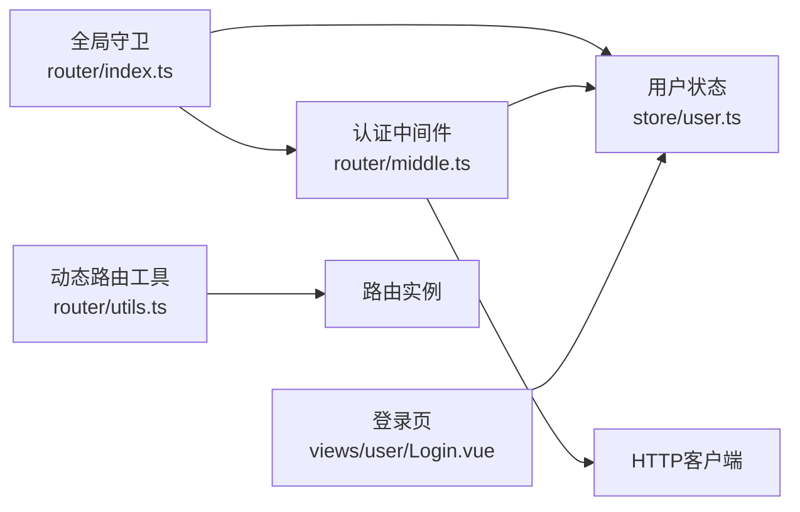

# 路由守卫与导航拦截

<cite>
**本文引用的文件**   
- [client/web/src/router/index.ts](file://client/web/src/router/index.ts)
- [client/web/src/router/middle.ts](file://client/web/src/router/middle.ts)
- [client/web/src/router/user.ts](file://client/web/src/router/user.ts)
- [client/web/src/router/moment.ts](file://client/web/src/router/moment.ts)
- [client/web/src/router/utils.ts](file://client/web/src/router/utils.ts)
- [client/web/src/store/user.ts](file://client/web/src/store/user.ts)
- [client/web/src/store/modules/user.ts](file://client/web/src/store/modules/user.ts)
- [client/web/src/utils/auth.ts](file://client/web/src/utils/auth.ts)
- [client/web/src/plugin/config.ts](file://client/web/src/plugin/config.ts)
- [client/web/src/main.ts](file://client/web/src/main.ts)
- [client/web/src/views/user/Login.vue](file://client/web/src/views/user/Login.vue)
</cite>

## 目录
1. [引言](#引言)
2. [项目结构](#项目结构)
3. [核心组件](#核心组件)
4. [架构总览](#架构总览)
5. [详细组件分析](#详细组件分析)
6. [依赖关系分析](#依赖关系分析)
7. [性能考量](#性能考量)
8. [故障排查指南](#故障排查指南)
9. [结论](#结论)
10. [附录](#附录)

## 引言
本文件面向Hoper Vue3前端工程中的“路由守卫与导航拦截”主题，系统性阐述：
- 全局前置守卫beforeEach的工作原理与执行顺序
- 路由元信息meta的使用场景与扩展思路
- 导航解析流程与白名单机制
- 认证中间件的实现与权限校验逻辑
- 导航取消、重定向与条件跳转的处理方式
- 导航完成后的行为、错误处理与用户体验优化
- 调试技巧与常见问题的解决方案

## 项目结构
围绕路由守卫与导航拦截的关键文件分布如下：
- 路由定义与全局守卫：router/index.ts
- 守卫中间件：router/middle.ts
- 路由模块拆分：router/user.ts、router/moment.ts
- 路由工具与动态路由：router/utils.ts
- 用户状态与认证：store/user.ts、store/modules/user.ts、utils/auth.ts
- 平台配置：plugin/config.ts
- 应用入口：main.ts
- 登录页与返回跳转：views/user/Login.vue

**图表来源**
- [client/web/src/main.ts:1-63](file://client/web/src/main.ts#L1-L63)
- [client/web/src/router/index.ts:1-62](file://client/web/src/router/index.ts#L1-L62)
- [client/web/src/router/middle.ts:1-24](file://client/web/src/router/middle.ts#L1-L24)
- [client/web/src/router/user.ts:1-23](file://client/web/src/router/user.ts#L1-L23)
- [client/web/src/router/moment.ts:1-15](file://client/web/src/router/moment.ts#L1-L15)
- [client/web/src/router/utils.ts:1-79](file://client/web/src/router/utils.ts#L1-L79)
- [client/web/src/store/user.ts:1-92](file://client/web/src/store/user.ts#L1-L92)
- [client/web/src/utils/auth.ts:1-125](file://client/web/src/utils/auth.ts#L1-L125)
- [client/web/src/views/user/Login.vue:1-833](file://client/web/src/views/user/Login.vue#L1-L833)

**章节来源**
- [client/web/src/main.ts:1-63](file://client/web/src/main.ts#L1-L63)
- [client/web/src/router/index.ts:1-62](file://client/web/src/router/index.ts#L1-L62)

## 核心组件
- 全局前置守卫：负责在每次导航前统一处理登录态、白名单放行与重定向
- 认证中间件：
  - 基础认证：authenticated（仅检查登录态）
  - 完整认证：completedAuthenticated（拉取用户信息并确保头像等字段可用）
- 路由模块：
  - 用户模块：包含登录、激活等页面
  - 动态内容模块：Moment相关内容路由
- 用户状态与认证：
  - Pinia用户仓库：维护登录态、token与用户缓存
  - 认证工具：Cookie与本地存储的token管理与权限判断
- 登录页：处理登录/注册、验证码、返回地址回跳

**章节来源**
- [client/web/src/router/index.ts:39-59](file://client/web/src/router/index.ts#L39-L59)
- [client/web/src/router/middle.ts:7-23](file://client/web/src/router/middle.ts#L7-L23)
- [client/web/src/router/user.ts:5-22](file://client/web/src/router/user.ts#L5-L22)
- [client/web/src/store/user.ts:22-32](file://client/web/src/store/user.ts#L22-L32)
- [client/web/src/utils/auth.ts:26-99](file://client/web/src/utils/auth.ts#L26-L99)
- [client/web/src/views/user/Login.vue:322-325](file://client/web/src/views/user/Login.vue#L322-L325)

## 架构总览
以下序列图展示“全局前置守卫”在导航时的调用链路与决策分支。

**图表来源**
- [client/web/src/router/index.ts:39-59](file://client/web/src/router/index.ts#L39-L59)
- [client/web/src/router/middle.ts:7-23](file://client/web/src/router/middle.ts#L7-L23)
- [client/web/src/store/user.ts:22-32](file://client/web/src/store/user.ts#L22-L32)
- [client/web/src/views/user/Login.vue:322-325](file://client/web/src/views/user/Login.vue#L322-L325)

## 详细组件分析

### 全局前置守卫 beforeEach
- 触发时机：每次导航开始前
- 主要职责：
  - 初始化登录态：若未加载登录态则尝试从本地或后端拉取
  - 登录态判断：已登录时对“登录页”做保护性重定向；否则仅允许白名单
  - 白名单：Login、Active
  - 重定向策略：未登录访问非白名单路由时，重定向至登录页并携带back查询参数

**图表来源**
- [client/web/src/router/index.ts:39-59](file://client/web/src/router/index.ts#L39-L59)

**章节来源**
- [client/web/src/router/index.ts:10-11](file://client/web/src/router/index.ts#L10-L11)
- [client/web/src/router/index.ts:39-59](file://client/web/src/router/index.ts#L39-L59)

### 认证中间件
- authenticated：仅检查登录态，适合对“已登录即可访问”的页面
- completedAuthenticated：在登录态基础上，进一步拉取用户信息并确保头像等字段可用，适合需要完整用户资料的页面

**图表来源**
- [client/web/src/router/middle.ts:12-23](file://client/web/src/router/middle.ts#L12-L23)

**章节来源**
- [client/web/src/router/middle.ts:7-23](file://client/web/src/router/middle.ts#L7-L23)

### 路由元信息 meta 的使用
- 在部分路由上使用meta标记requiresAuth，可用于后续扩展“基于meta的权限控制”
- 当前实现主要依赖beforeEach与白名单策略，meta可作为未来权限增强的标识

**章节来源**
- [client/web/src/router/index.ts:24](file://client/web/src/router/index.ts#L24)

### 路由模块与动态路由
- 用户模块：登录、激活等页面
- 动态内容模块：Moment相关内容路由
- 动态路由工具：提供跳转、异步组件导入、通配符路由与历史模式切换等能力

**章节来源**
- [client/web/src/router/user.ts:5-22](file://client/web/src/router/user.ts#L5-L22)
- [client/web/src/router/moment.ts:4-14](file://client/web/src/router/moment.ts#L4-L14)
- [client/web/src/router/utils.ts:20-27](file://client/web/src/router/utils.ts#L20-L27)
- [client/web/src/router/utils.ts:40-48](file://client/web/src/router/utils.ts#L40-L48)
- [client/web/src/router/utils.ts:52-73](file://client/web/src/router/utils.ts#L52-L73)

### 用户状态与认证工具
- 用户状态仓库：
  - getAuth：从本地或后端拉取登录态
  - login/signup：登录/注册成功后写入token并更新状态，随后跳转首页
- 认证工具：
  - setToken/removeToken：统一管理Cookie与本地存储
  - hasPerms：基于角色/权限判断按钮级权限

**章节来源**
- [client/web/src/store/user.ts:22-32](file://client/web/src/store/user.ts#L22-L32)
- [client/web/src/store/user.ts:33-66](file://client/web/src/store/user.ts#L33-L66)
- [client/web/src/utils/auth.ts:26-99](file://client/web/src/utils/auth.ts#L26-L99)
- [client/web/src/utils/auth.ts:113-124](file://client/web/src/utils/auth.ts#L113-L124)

### 登录页与返回跳转
- 登录页在挂载时读取back查询参数，若已登录则回跳原路径
- 登录成功后由store写入token并触发路由跳转

**章节来源**
- [client/web/src/views/user/Login.vue:322-325](file://client/web/src/views/user/Login.vue#L322-L325)
- [client/web/src/store/user.ts:33-42](file://client/web/src/store/user.ts#L33-L42)

## 依赖关系分析
- 全局守卫依赖用户状态仓库以判断登录态
- 认证中间件依赖axios与用户状态仓库
- 登录页依赖store完成登录并回跳
- 动态路由工具提供通配符与历史模式切换能力

**图表来源**
- [client/web/src/router/index.ts:39-59](file://client/web/src/router/index.ts#L39-L59)
- [client/web/src/router/middle.ts:12-23](file://client/web/src/router/middle.ts#L12-L23)
- [client/web/src/store/user.ts:22-32](file://client/web/src/store/user.ts#L22-L32)
- [client/web/src/views/user/Login.vue:322-325](file://client/web/src/views/user/Login.vue#L322-L325)
- [client/web/src/router/utils.ts:40-48](file://client/web/src/router/utils.ts#L40-L48)

**章节来源**
- [client/web/src/router/index.ts:39-59](file://client/web/src/router/index.ts#L39-L59)
- [client/web/src/router/middle.ts:12-23](file://client/web/src/router/middle.ts#L12-L23)
- [client/web/src/router/utils.ts:40-48](file://client/web/src/router/utils.ts#L40-L48)

## 性能考量
- 避免重复拉取登录态：全局守卫与store.getAuth均会尝试拉取，建议在守卫中仅在必要时发起请求
- 中间件请求：completedAuthenticated会发起额外HTTP请求，建议结合缓存与超时策略
- 组件懒加载：使用defineAsyncComponent与按平台导入，减少首屏体积
- 通配符路由：仅在需要兜底时启用，避免过多动态路由影响匹配性能

[本节为通用指导，不直接分析具体文件]

## 故障排查指南
- 无法登录或反复跳转登录页
  - 检查store.login/signup是否正确写入token并更新状态
  - 确认utils/auth.ts中setToken与removeToken的调用与Cookie/Storage一致性
- 登录后仍被重定向到登录页
  - 确认全局守卫逻辑与白名单配置
  - 检查登录页back参数回跳逻辑
- 未登录访问受保护页面
  - 确认beforeEach与认证中间件的执行顺序
  - 检查meta与白名单策略是否冲突
- 权限不足或按钮不可见
  - 使用hasPerms进行按钮级权限判断
  - 确认后端返回的权限列表与前端一致

**章节来源**
- [client/web/src/store/user.ts:33-66](file://client/web/src/store/user.ts#L33-L66)
- [client/web/src/utils/auth.ts:26-99](file://client/web/src/utils/auth.ts#L26-L99)
- [client/web/src/router/index.ts:39-59](file://client/web/src/router/index.ts#L39-L59)
- [client/web/src/views/user/Login.vue:322-325](file://client/web/src/views/user/Login.vue#L322-L325)
- [client/web/src/utils/auth.ts:113-124](file://client/web/src/utils/auth.ts#L113-L124)

## 结论
本项目通过“全局前置守卫 + 认证中间件 + 白名单机制”的组合，实现了简洁而可靠的导航拦截体系。meta可作为未来权限增强的扩展点；completedAuthenticated中间件确保了对完整用户信息的依赖场景。建议在实际业务中结合动态路由与权限工具，持续完善导航体验与安全性。

[本节为总结性内容，不直接分析具体文件]

## 附录
- 调试技巧
  - 在beforeEach中打印to/from路径与白名单命中情况
  - 在store.getAuth中增加日志，定位token拉取失败原因
  - 在登录页监听back参数并在登录成功后显式回跳
- 最佳实践
  - 将“已登录即可访问”的页面使用authenticated中间件
  - 对需要头像等字段的页面使用completedAuthenticated中间件
  - 为重要页面添加meta标识，便于后续权限扩展
  - 使用动态路由工具统一对通配符与历史模式的处理

[本节为通用指导，不直接分析具体文件]