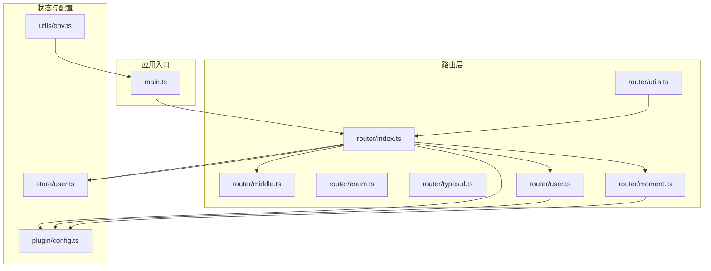
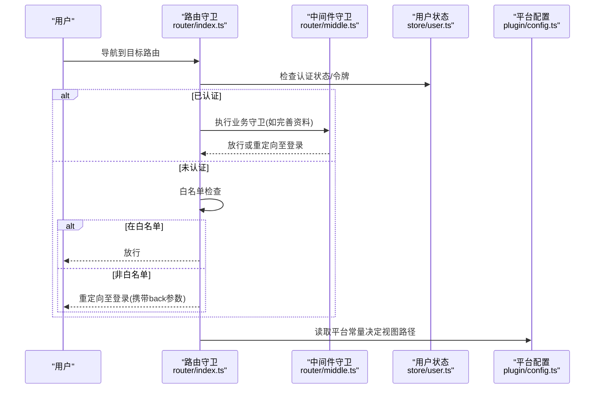
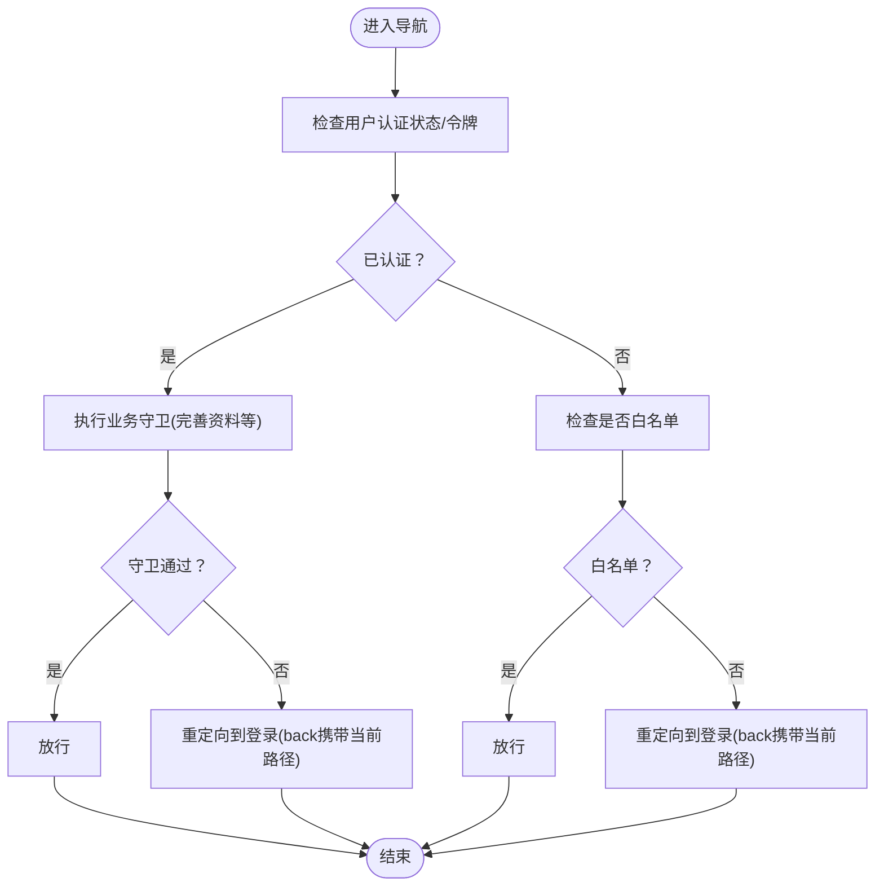
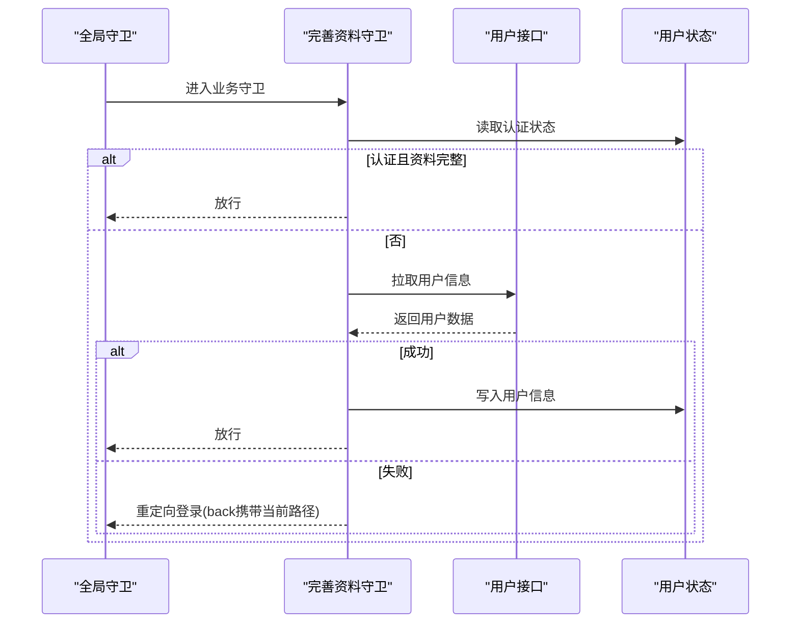
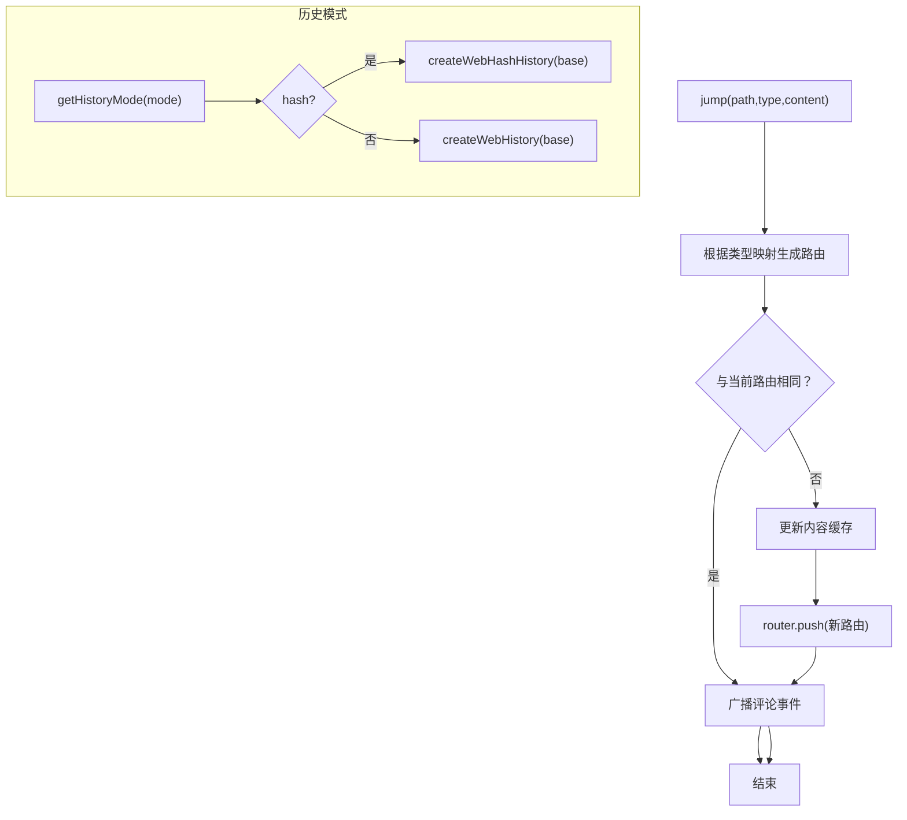
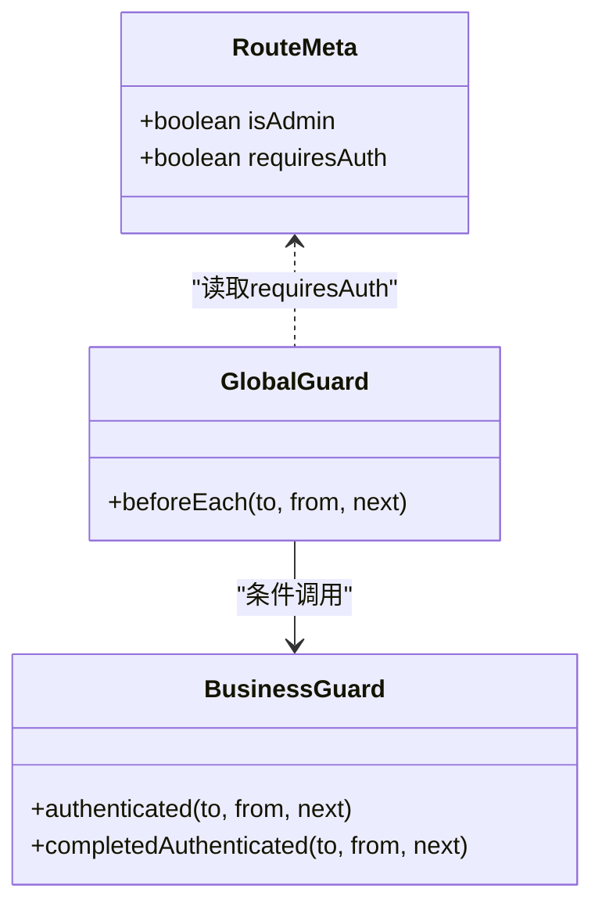
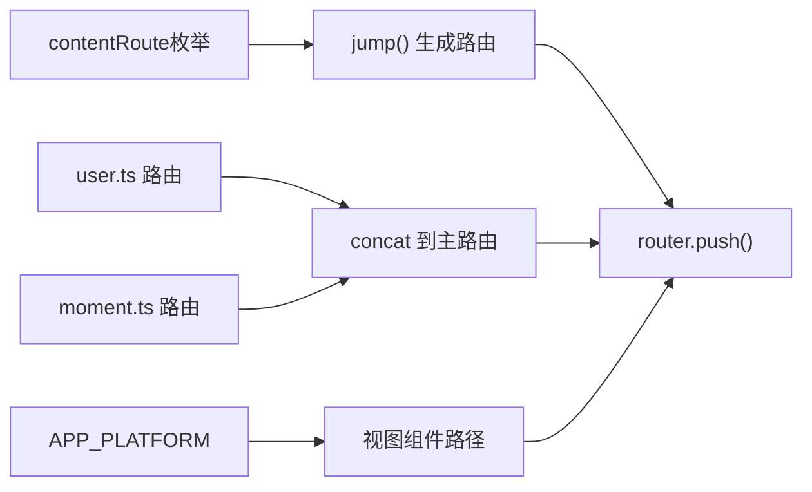
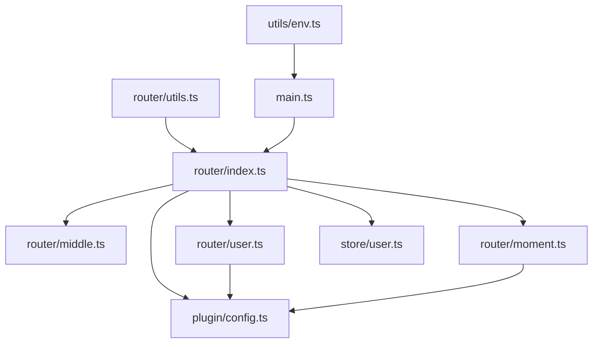

# 路由管理系统

<cite>
**本文档引用的文件**
- [client/web/src/router/index.ts](file://client/web/src/router/index.ts)
- [client/web/src/router/middle.ts](file://client/web/src/router/middle.ts)
- [client/web/src/router/enum.ts](file://client/web/src/router/enum.ts)
- [client/web/src/router/types.d.ts](file://client/web/src/router/types.d.ts)
- [client/web/src/router/utils.ts](file://client/web/src/router/utils.ts)
- [client/web/src/router/user.ts](file://client/web/src/router/user.ts)
- [client/web/src/router/moment.ts](file://client/web/src/router/moment.ts)
- [client/web/src/store/user.ts](file://client/web/src/store/user.ts)
- [client/web/src/plugin/config.ts](file://client/web/src/plugin/config.ts)
- [client/web/src/utils/env.ts](file://client/web/src/utils/env.ts)
- [client/web/src/main.ts](file://client/web/src/main.ts)
</cite>

## 目录
1. [简介](#简介)
2. [项目结构](#项目结构)
3. [核心组件](#核心组件)
4. [架构总览](#架构总览)
5. [详细组件分析](#详细组件分析)
6. [依赖关系分析](#依赖关系分析)
7. [性能考虑](#性能考虑)
8. [故障排查指南](#故障排查指南)
9. [结论](#结论)
10. [附录](#附录)

## 简介
本文件面向Hoper Vue3路由管理系统，围绕Vue Router配置、路由守卫与导航拦截、路由元信息、权限控制、动态路由、懒加载与预加载策略、路由缓存、路由枚举、中间件与工具函数进行系统性技术说明，并提供流程图与时序图帮助理解。目标是让开发者快速掌握从路由定义到运行期拦截、从权限校验到性能优化的完整闭环。

## 项目结构
路由系统位于客户端Web工程的router目录，采用“按功能模块拆分”的组织方式：
- 根路由与全局守卫：index.ts
- 中间件（导航守卫）：middle.ts
- 路由枚举：enum.ts
- 元信息类型扩展：types.d.ts
- 动态路由与工具：utils.ts
- 用户相关路由：user.ts
- 时刻（moment）相关路由：moment.ts
- 平台配置：plugin/config.ts
- 应用启动与平台配置注入：main.ts、utils/env.ts

图表来源
- [client/web/src/router/index.ts:1-62](file://client/web/src/router/index.ts#L1-L62)
- [client/web/src/router/middle.ts:1-24](file://client/web/src/router/middle.ts#L1-L24)
- [client/web/src/router/user.ts:1-23](file://client/web/src/router/user.ts#L1-L23)
- [client/web/src/router/moment.ts:1-15](file://client/web/src/router/moment.ts#L1-L15)
- [client/web/src/router/utils.ts:1-79](file://client/web/src/router/utils.ts#L1-L79)
- [client/web/src/store/user.ts:1-92](file://client/web/src/store/user.ts#L1-L92)
- [client/web/src/plugin/config.ts:1-6](file://client/web/src/plugin/config.ts#L1-L6)
- [client/web/src/utils/env.ts:1-56](file://client/web/src/utils/env.ts#L1-L56)
- [client/web/src/main.ts:1-63](file://client/web/src/main.ts#L1-L63)

章节来源
- [client/web/src/router/index.ts:1-62](file://client/web/src/router/index.ts#L1-L62)
- [client/web/src/router/middle.ts:1-24](file://client/web/src/router/middle.ts#L1-L24)
- [client/web/src/router/user.ts:1-23](file://client/web/src/router/user.ts#L1-L23)
- [client/web/src/router/moment.ts:1-15](file://client/web/src/router/moment.ts#L1-L15)
- [client/web/src/router/utils.ts:1-79](file://client/web/src/router/utils.ts#L1-L79)
- [client/web/src/store/user.ts:1-92](file://client/web/src/store/user.ts#L1-L92)
- [client/web/src/plugin/config.ts:1-6](file://client/web/src/plugin/config.ts#L1-L6)
- [client/web/src/utils/env.ts:1-56](file://client/web/src/utils/env.ts#L1-L56)
- [client/web/src/main.ts:1-63](file://client/web/src/main.ts#L1-L63)

## 核心组件
- 路由注册与全局守卫：在根路由文件中完成基础路由拼装、白名单与全局前置守卫逻辑。
- 导航守卫中间件：提供“已登录即可访问”和“需完善资料后访问”的两类守卫。
- 动态路由与工具：支持根据内容类型生成路由、懒加载组件、通配符路由与历史模式切换。
- 权限状态与缓存：通过Pinia用户状态管理获取认证信息并持久化token。
- 平台配置：通过构建期常量与运行时配置注入，决定视图组件路径与运行环境。

章节来源
- [client/web/src/router/index.ts:10-59](file://client/web/src/router/index.ts#L10-L59)
- [client/web/src/router/middle.ts:7-23](file://client/web/src/router/middle.ts#L7-L23)
- [client/web/src/router/utils.ts:17-79](file://client/web/src/router/utils.ts#L17-L79)
- [client/web/src/store/user.ts:22-32](file://client/web/src/store/user.ts#L22-L32)
- [client/web/src/plugin/config.ts:1-6](file://client/web/src/plugin/config.ts#L1-L6)

## 架构总览
路由系统围绕“路由定义—守卫拦截—状态同步—动态渲染—平台适配”展开，形成清晰的职责边界与调用链路。

图表来源
- [client/web/src/router/index.ts:39-59](file://client/web/src/router/index.ts#L39-L59)
- [client/web/src/router/middle.ts:7-23](file://client/web/src/router/middle.ts#L7-L23)
- [client/web/src/store/user.ts:22-32](file://client/web/src/store/user.ts#L22-L32)
- [client/web/src/plugin/config.ts:5](file://client/web/src/plugin/config.ts#L5)

## 详细组件分析

### 路由注册与全局守卫
- 基础路由：首页、聊天、个人中心等，均通过懒加载组件实现按需加载。
- 白名单：登录、激活等无需登录即可访问。
- 全局前置守卫：统一处理登录态与白名单逻辑；对已登录访问登录页进行回跳，未登录仅放行白名单。
- 守卫注入：部分路由挂载业务守卫（如“完善资料后访问”），增强用户体验与数据完整性。

图表来源
- [client/web/src/router/index.ts:39-59](file://client/web/src/router/index.ts#L39-L59)

章节来源
- [client/web/src/router/index.ts:13-32](file://client/web/src/router/index.ts#L13-L32)
- [client/web/src/router/index.ts:10-11](file://client/web/src/router/index.ts#L10-L11)
- [client/web/src/router/index.ts:39-59](file://client/web/src/router/index.ts#L39-L59)

### 导航守卫中间件
- 已登录守卫：若用户已认证则放行，否则重定向至登录并携带目标路径。
- 完善资料守卫：若认证且头像信息齐全则放行；否则拉取用户信息，失败则重定向至登录。
- 与全局守卫配合：避免重复逻辑，集中处理“是否需要登录”和“是否需要完善资料”。

图表来源
- [client/web/src/router/middle.ts:12-23](file://client/web/src/router/middle.ts#L12-L23)
- [client/web/src/store/user.ts:22-32](file://client/web/src/store/user.ts#L22-L32)

章节来源
- [client/web/src/router/middle.ts:7-23](file://client/web/src/router/middle.ts#L7-L23)

### 动态路由与工具函数
- 跳转工具：根据内容类型与ID生成目标路由，触发内容缓存更新并跳转，同时广播评论事件。
- 组件懒加载：统一通过defineAsyncComponent与平台路径组合实现按需加载。
- 通配符路由：确保未匹配路径统一跳转到404错误页。
- 历史模式：支持hash与h5两种历史模式，可带base参数，便于部署与兼容。

图表来源
- [client/web/src/router/utils.ts:20-27](file://client/web/src/router/utils.ts#L20-L27)
- [client/web/src/router/utils.ts:29-30](file://client/web/src/router/utils.ts#L29-L30)
- [client/web/src/router/utils.ts:40-48](file://client/web/src/router/utils.ts#L40-L48)
- [client/web/src/router/utils.ts:52-73](file://client/web/src/router/utils.ts#L52-L73)

章节来源
- [client/web/src/router/utils.ts:17-79](file://client/web/src/router/utils.ts#L17-L79)

### 路由元信息与权限控制
- 元信息扩展：在类型声明中扩展RouteMeta，强制每个路由声明requiresAuth字段，便于统一校验。
- 权限控制：结合全局守卫与业务守卫，实现“是否需要登录”和“是否需要完善资料”的双重控制。
- 白名单策略：对无需登录的页面（如登录、激活）直接放行，减少不必要的鉴权开销。

图表来源
- [client/web/src/router/types.d.ts:3-10](file://client/web/src/router/types.d.ts#L3-L10)
- [client/web/src/router/index.ts:39-59](file://client/web/src/router/index.ts#L39-L59)
- [client/web/src/router/middle.ts:7-23](file://client/web/src/router/middle.ts#L7-L23)

章节来源
- [client/web/src/router/types.d.ts:3-10](file://client/web/src/router/types.d.ts#L3-L10)
- [client/web/src/router/index.ts:10-11](file://client/web/src/router/index.ts#L10-L11)
- [client/web/src/router/index.ts:39-59](file://client/web/src/router/index.ts#L39-L59)

### 路由枚举与动态路由
- 路由枚举：将内容类型映射为路由前缀，用于动态生成内容详情页路由。
- 动态路由：将用户与时刻模块的路由作为外部数组合并到主路由表，便于模块化维护与扩展。
- 平台适配：通过平台常量决定视图组件路径，支持多端渲染。

图表来源
- [client/web/src/router/enum.ts:1-11](file://client/web/src/router/enum.ts#L1-L11)
- [client/web/src/router/user.ts:5-22](file://client/web/src/router/user.ts#L5-L22)
- [client/web/src/router/moment.ts:4-14](file://client/web/src/router/moment.ts#L4-L14)
- [client/web/src/router/utils.ts:20-27](file://client/web/src/router/utils.ts#L20-L27)
- [client/web/src/plugin/config.ts:5](file://client/web/src/plugin/config.ts#L5)

章节来源
- [client/web/src/router/enum.ts:1-11](file://client/web/src/router/enum.ts#L1-L11)
- [client/web/src/router/user.ts:1-23](file://client/web/src/router/user.ts#L1-L23)
- [client/web/src/router/moment.ts:1-15](file://client/web/src/router/moment.ts#L1-L15)
- [client/web/src/plugin/config.ts:5](file://client/web/src/plugin/config.ts#L5)

### 路由懒加载与预加载策略
- 懒加载：所有页面组件通过defineAsyncComponent与import动态导入，实现按需加载，降低首屏体积。
- 预加载：可通过路由级的prefetch或在交互前预取数据的方式优化体验（建议结合业务场景在上层组件中实现）。
- 组件缓存：结合keep-alive与Pinia缓存策略，减少重复渲染与请求。

章节来源
- [client/web/src/router/index.ts:17](file://client/web/src/router/index.ts#L17)
- [client/web/src/router/index.ts:23](file://client/web/src/router/index.ts#L23)
- [client/web/src/router/utils.ts:29-30](file://client/web/src/router/utils.ts#L29-L30)
- [client/web/src/store/user.ts:67-84](file://client/web/src/store/user.ts#L67-L84)

### 路由缓存机制
- Pinia用户缓存：提供用户ID到用户对象的Map缓存，批量拉取与去重，减少重复请求。
- 内容缓存：jump函数在跳转前更新对应类型的内容缓存，保证详情页渲染一致性。

章节来源
- [client/web/src/store/user.ts:67-84](file://client/web/src/store/user.ts#L67-L84)
- [client/web/src/router/utils.ts:20-27](file://client/web/src/router/utils.ts#L20-L27)

### 中间件处理与路由工具函数
- 中间件：提供两类守卫，分别处理“是否登录”和“是否完善资料”，避免在各路由重复校验。
- 工具函数：统一路由跳转、懒加载、通配符路由与历史模式切换，提升可维护性。

章节来源
- [client/web/src/router/middle.ts:7-23](file://client/web/src/router/middle.ts#L7-L23)
- [client/web/src/router/utils.ts:17-79](file://client/web/src/router/utils.ts#L17-L79)

## 依赖关系分析
- 路由依赖：index.ts依赖中间件、用户与时刻模块路由、用户状态与平台配置。
- 中间件依赖：中间件依赖用户状态与HTTP客户端。
- 工具函数依赖：动态路由与历史模式切换依赖Vue Router与平台配置。
- 应用入口：main.ts负责平台配置注入与路由安装，确保运行期配置可用。

图表来源
- [client/web/src/router/index.ts:1-62](file://client/web/src/router/index.ts#L1-L62)
- [client/web/src/router/middle.ts:1-24](file://client/web/src/router/middle.ts#L1-L24)
- [client/web/src/router/user.ts:1-23](file://client/web/src/router/user.ts#L1-L23)
- [client/web/src/router/moment.ts:1-15](file://client/web/src/router/moment.ts#L1-L15)
- [client/web/src/router/utils.ts:1-79](file://client/web/src/router/utils.ts#L1-L79)
- [client/web/src/store/user.ts:1-92](file://client/web/src/store/user.ts#L1-L92)
- [client/web/src/plugin/config.ts:1-6](file://client/web/src/plugin/config.ts#L1-L6)
- [client/web/src/utils/env.ts:1-56](file://client/web/src/utils/env.ts#L1-L56)
- [client/web/src/main.ts:1-63](file://client/web/src/main.ts#L1-L63)

章节来源
- [client/web/src/router/index.ts:1-62](file://client/web/src/router/index.ts#L1-L62)
- [client/web/src/router/middle.ts:1-24](file://client/web/src/router/middle.ts#L1-L24)
- [client/web/src/router/user.ts:1-23](file://client/web/src/router/user.ts#L1-L23)
- [client/web/src/router/moment.ts:1-15](file://client/web/src/router/moment.ts#L1-L15)
- [client/web/src/router/utils.ts:1-79](file://client/web/src/router/utils.ts#L1-L79)
- [client/web/src/store/user.ts:1-92](file://client/web/src/store/user.ts#L1-L92)
- [client/web/src/plugin/config.ts:1-6](file://client/web/src/plugin/config.ts#L1-L6)
- [client/web/src/utils/env.ts:1-56](file://client/web/src/utils/env.ts#L1-L56)
- [client/web/src/main.ts:1-63](file://client/web/src/main.ts#L1-L63)

## 性能考虑
- 懒加载优先：所有页面组件采用动态导入，减少初始包体。
- 缓存策略：利用Pinia缓存用户与内容，避免重复请求与渲染。
- 白名单放行：未登录仅放行必要页面，减少鉴权与网络请求。
- 历史模式选择：在静态部署或不支持H5 History的环境下使用hash模式，确保兼容性。
- keep-alive：在上层布局中对关键页面启用缓存，进一步降低切换成本。

## 故障排查指南
- 登录后仍被重定向到登录页
  - 检查全局守卫逻辑与白名单配置。
  - 确认用户状态是否正确写入与token是否持久化。
- 完善资料守卫一直失败
  - 检查用户接口返回与守卫中的状态判断。
  - 确保用户信息写入成功后再放行。
- 路由跳转无效或404
  - 检查动态路由生成规则与通配符路由是否生效。
  - 确认平台常量与视图路径拼接是否正确。
- 历史模式异常
  - 检查历史模式配置与base参数，确认与部署路径一致。

章节来源
- [client/web/src/router/index.ts:39-59](file://client/web/src/router/index.ts#L39-L59)
- [client/web/src/router/middle.ts:12-23](file://client/web/src/router/middle.ts#L12-L23)
- [client/web/src/router/utils.ts:40-48](file://client/web/src/router/utils.ts#L40-L48)
- [client/web/src/store/user.ts:22-32](file://client/web/src/store/user.ts#L22-L32)

## 结论
该路由系统通过模块化的路由定义、清晰的中间件守卫、完善的权限控制与动态路由能力，实现了高可维护性的前端路由架构。结合懒加载、缓存与历史模式策略，兼顾了性能与兼容性。建议在后续迭代中补充预加载策略与更细粒度的缓存失效机制，持续优化用户体验。

## 附录
- 路由配置示例
  - 基础路由与懒加载：参见 [client/web/src/router/index.ts:13-32](file://client/web/src/router/index.ts#L13-L32)
  - 白名单与全局守卫：参见 [client/web/src/router/index.ts:10-11](file://client/web/src/router/index.ts#L10-L11), [client/web/src/router/index.ts:39-59](file://client/web/src/router/index.ts#L39-L59)
- 权限验证流程
  - 中间件守卫：参见 [client/web/src/router/middle.ts:7-23](file://client/web/src/router/middle.ts#L7-L23)
  - 用户状态与登录：参见 [client/web/src/store/user.ts:22-49](file://client/web/src/store/user.ts#L22-L49)
- 性能优化方案
  - 懒加载与缓存：参见 [client/web/src/router/utils.ts:29-30](file://client/web/src/router/utils.ts#L29-L30), [client/web/src/store/user.ts:67-84](file://client/web/src/store/user.ts#L67-L84)
  - 历史模式切换：参见 [client/web/src/router/utils.ts:52-73](file://client/web/src/router/utils.ts#L52-L73)