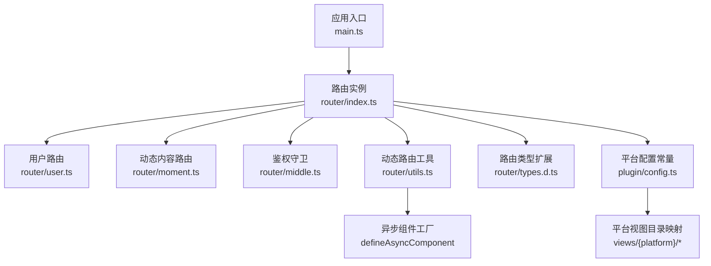
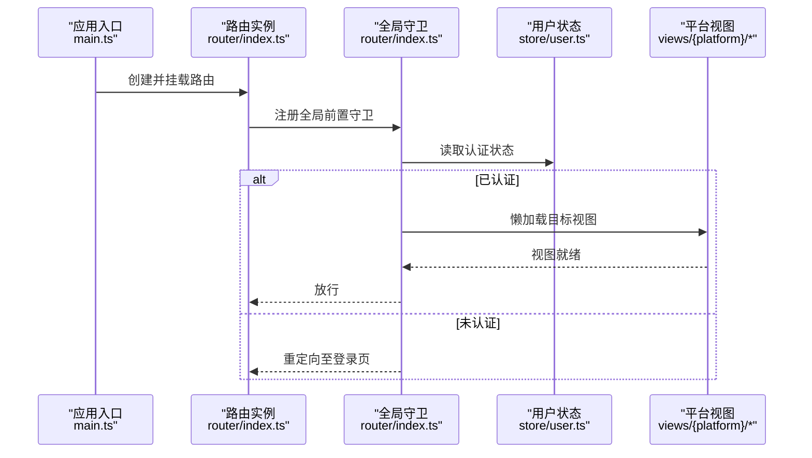
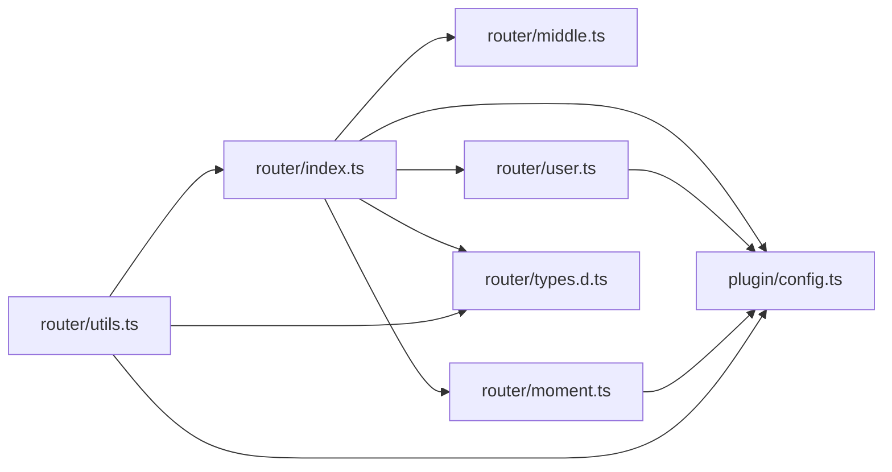

# 路由配置与定义

<cite>
**本文档引用的文件**
- [client/web/src/main.ts](file://client/web/src/main.ts)
- [client/web/src/router/index.ts](file://client/web/src/router/index.ts)
- [client/web/src/router/user.ts](file://client/web/src/router/user.ts)
- [client/web/src/router/moment.ts](file://client/web/src/router/moment.ts)
- [client/web/src/router/middle.ts](file://client/web/src/router/middle.ts)
- [client/web/src/router/utils.ts](file://client/web/src/router/utils.ts)
- [client/web/src/router/enum.ts](file://client/web/src/router/enum.ts)
- [client/web/src/router/types.d.ts](file://client/web/src/router/types.d.ts)
- [client/web/src/plugin/config.ts](file://client/web/src/plugin/config.ts)
</cite>

## 目录
1. [简介](#简介)
2. [项目结构](#项目结构)
3. [核心组件](#核心组件)
4. [架构总览](#架构总览)
5. [详细组件分析](#详细组件分析)
6. [依赖关系分析](#依赖关系分析)
7. [性能考虑](#性能考虑)
8. [故障排查指南](#故障排查指南)
9. [结论](#结论)
10. [附录](#附录)

## 简介
本文件面向Hoper Web前端的Vue3路由体系，系统性阐述路由配置的基本结构、路由记录的定义方式、路由组件的导入机制，以及平台特定视图的动态导入策略。重点覆盖以下主题：
- 路由历史模式选择（Hash History）
- 路由名称命名规范与路径参数配置
- 路由懒加载与异步组件的实现
- 平台特定视图的动态导入策略
- 路由枚举与类型扩展
- 全局前置守卫与鉴权流程
- 服务端渲染支持与最佳实践
- 性能优化与常见问题排查

## 项目结构
Hoper Web的路由相关代码集中在 client/web/src/router 目录，并通过入口文件在应用启动时挂载。关键文件职责如下：
- router/index.ts：路由实例创建、全局前置守卫、基础路由与动态路由合并
- router/user.ts：用户相关路由集合
- router/moment.ts：动态内容路由集合
- router/middle.ts：鉴权导航守卫
- router/utils.ts：动态路由工具、历史模式解析、异步组件工厂
- router/enum.ts：内容类型枚举，用于动态跳转
- router/types.d.ts：扩展RouteMeta类型，强制声明requiresAuth字段
- plugin/config.ts：导出运行时平台常量APP_PLATFORM，驱动视图动态导入
- main.ts：应用入口，挂载路由与状态管理

图表来源
- [client/web/src/main.ts:1-63](file://client/web/src/main.ts#L1-L63)
- [client/web/src/router/index.ts:1-62](file://client/web/src/router/index.ts#L1-L62)
- [client/web/src/router/user.ts:1-23](file://client/web/src/router/user.ts#L1-L23)
- [client/web/src/router/moment.ts:1-15](file://client/web/src/router/moment.ts#L1-L15)
- [client/web/src/router/middle.ts:1-24](file://client/web/src/router/middle.ts#L1-L24)
- [client/web/src/router/utils.ts:1-79](file://client/web/src/router/utils.ts#L1-L79)
- [client/web/src/router/types.d.ts:1-11](file://client/web/src/router/types.d.ts#L1-L11)
- [client/web/src/plugin/config.ts:1-6](file://client/web/src/plugin/config.ts#L1-L6)

章节来源
- [client/web/src/main.ts:1-63](file://client/web/src/main.ts#L1-L63)
- [client/web/src/router/index.ts:1-62](file://client/web/src/router/index.ts#L1-L62)

## 核心组件
- 路由实例与历史模式
  - 使用Hash History作为默认历史模式，确保在无后端支持的静态部署场景下正常工作。
  - 支持通过环境变量或配置字符串解析多种历史模式，包括带base参数的hash与h5模式。
- 路由记录与懒加载
  - 基础路由与业务路由分别定义，最终在路由实例中合并。
  - 组件采用动态导入与defineAsyncComponent实现懒加载，结合平台常量按需加载对应平台视图。
- 鉴权与白名单
  - 全局前置守卫根据用户认证状态与白名单控制访问。
  - 提供两层鉴权守卫：基础鉴权与“资料完整”鉴权，后者在进入受保护路由前拉取用户信息并校验头像等字段。
- 动态路由与历史模式工具
  - 提供addPathMatch添加通配符兜底路由，统一跳转到404页面。
  - 提供getHistoryMode解析历史模式字符串，支持hash与h5两种模式及可选base参数。

章节来源
- [client/web/src/router/index.ts:1-62](file://client/web/src/router/index.ts#L1-L62)
- [client/web/src/router/utils.ts:1-79](file://client/web/src/router/utils.ts#L1-L79)
- [client/web/src/router/middle.ts:1-24](file://client/web/src/router/middle.ts#L1-L24)

## 架构总览
下图展示从应用启动到路由生效的关键交互：

图表来源
- [client/web/src/main.ts:54-60](file://client/web/src/main.ts#L54-L60)
- [client/web/src/router/index.ts:39-59](file://client/web/src/router/index.ts#L39-L59)
- [client/web/src/router/middle.ts:7-23](file://client/web/src/router/middle.ts#L7-L23)

## 详细组件分析

### 路由实例与历史模式
- 历史模式
  - 默认使用Hash History，保证静态部署可用。
  - 支持通过字符串解析切换为H5 History或带base的Hash History。
- 路由合并
  - 将基础路由与用户路由、动态内容路由合并为单一路由表。
- 全局前置守卫
  - 在进入任何路由前检查认证状态，若未认证则重定向至登录页并携带回跳地址。
  - 对已认证用户访问登录页进行拦截并跳回首页。

章节来源
- [client/web/src/router/index.ts:34-37](file://client/web/src/router/index.ts#L34-L37)
- [client/web/src/router/index.ts:39-59](file://client/web/src/router/index.ts#L39-L59)

### 路由记录定义与懒加载
- 基础路由
  - Index、Chat、Home等路由均采用动态导入，结合平台常量按需加载对应视图。
- 用户路由
  - 登录、激活等路由同样采用动态导入，便于按平台差异化加载。
- 动态内容路由
  - 动态内容详情页等路由采用动态导入，减少首屏包体。
- 异步组件
  - 使用defineAsyncComponent包裹动态导入，获得更好的错误处理与加载状态管理能力。

章节来源
- [client/web/src/router/index.ts:13-32](file://client/web/src/router/index.ts#L13-L32)
- [client/web/src/router/user.ts:5-22](file://client/web/src/router/user.ts#L5-L22)
- [client/web/src/router/moment.ts:4-14](file://client/web/src/router/moment.ts#L4-L14)
- [client/web/src/router/utils.ts:29-30](file://client/web/src/router/utils.ts#L29-L30)

### 平台特定视图的动态导入策略
- 平台常量
  - 通过APP_PLATFORM常量决定视图目录，实现同一逻辑在不同平台下的差异化渲染。
- 动态导入
  - 所有视图导入均采用模板字符串拼接平台路径，确保按构建时平台配置加载正确视图。
- 异步组件工厂
  - 提供_import工具函数，封装defineAsyncComponent与平台常量，统一懒加载入口。

章节来源
- [client/web/src/plugin/config.ts:5-5](file://client/web/src/plugin/config.ts#L5-L5)
- [client/web/src/router/index.ts:17-17](file://client/web/src/router/index.ts#L17-L17)
- [client/web/src/router/user.ts:10-10](file://client/web/src/router/user.ts#L10-L10)
- [client/web/src/router/utils.ts:29-30](file://client/web/src/router/utils.ts#L29-L30)

### 鉴权与导航守卫
- 白名单
  - Login与Active路由属于无需登录即可访问的白名单。
- 基础鉴权
  - authenticated：若未认证则重定向至登录页。
- 完整资料鉴权
  - completedAuthenticated：在进入前尝试获取用户信息，要求用户头像等字段完整，否则重定向至登录页。
- 全局守卫
  - 在进入路由前统一检查认证状态与白名单，避免重复逻辑分散。

章节来源
- [client/web/src/router/index.ts:10-11](file://client/web/src/router/index.ts#L10-L11)
- [client/web/src/router/middle.ts:7-23](file://client/web/src/router/middle.ts#L7-L23)

### 动态路由与历史模式工具
- 动态路由
  - jump函数：根据内容类型与ID动态计算目标路由并跳转，同时触发评论事件。
- 异步组件工厂
  - _import：统一懒加载视图，结合平台常量与defineAsyncComponent。
- 通配符兜底
  - addPathMatch：仅在不存在时添加通配符路由，统一跳转到404页面。
- 历史模式解析
  - getHistoryMode：解析字符串形式的历史模式，支持hash、h5与可选base参数，默认回退为Hash History。

章节来源
- [client/web/src/router/utils.ts:20-27](file://client/web/src/router/utils.ts#L20-L27)
- [client/web/src/router/utils.ts:29-30](file://client/web/src/router/utils.ts#L29-L30)
- [client/web/src/router/utils.ts:40-47](file://client/web/src/router/utils.ts#L40-L47)
- [client/web/src/router/utils.ts:51-73](file://client/web/src/router/utils.ts#L51-L73)

### 路由枚举与类型扩展
- 内容类型枚举
  - contentRoute：定义内容类型到路径前缀的映射，配合jump函数生成动态路由。
- 类型扩展
  - 通过模块声明扩展RouteMeta，强制每个路由声明requiresAuth字段，提升类型安全与可维护性。

章节来源
- [client/web/src/router/enum.ts:1-11](file://client/web/src/router/enum.ts#L1-L11)
- [client/web/src/router/types.d.ts:3-10](file://client/web/src/router/types.d.ts#L3-L10)

### 服务端渲染支持
- SSR兼容
  - 应用入口在main.ts中通过getPlatformConfig异步获取平台配置后再挂载路由与状态管理，确保在SSR环境下具备正确的平台上下文。
- 路由守卫
  - 全局前置守卫与鉴权守卫均为客户端侧逻辑，不依赖SSR特有API；在SSR场景下可通过客户端水合阶段完成鉴权与导航。

章节来源
- [client/web/src/main.ts:54-60](file://client/web/src/main.ts#L54-L60)
- [client/web/src/router/index.ts:39-59](file://client/web/src/router/index.ts#L39-L59)

## 依赖关系分析
路由模块内部依赖关系如下：

图表来源
- [client/web/src/router/index.ts:1-62](file://client/web/src/router/index.ts#L1-L62)
- [client/web/src/router/middle.ts:1-24](file://client/web/src/router/middle.ts#L1-L24)
- [client/web/src/router/user.ts:1-23](file://client/web/src/router/user.ts#L1-L23)
- [client/web/src/router/moment.ts:1-15](file://client/web/src/router/moment.ts#L1-L15)
- [client/web/src/router/utils.ts:1-79](file://client/web/src/router/utils.ts#L1-L79)
- [client/web/src/router/types.d.ts:1-11](file://client/web/src/router/types.d.ts#L1-L11)
- [client/web/src/plugin/config.ts:1-6](file://client/web/src/plugin/config.ts#L1-L6)

章节来源
- [client/web/src/router/index.ts:1-62](file://client/web/src/router/index.ts#L1-L62)
- [client/web/src/router/utils.ts:1-79](file://client/web/src/router/utils.ts#L1-L79)

## 性能考虑
- 懒加载与异步组件
  - 通过动态导入与defineAsyncComponent实现按需加载，显著降低首屏包体积。
- 平台视图分离
  - 以APP_PLATFORM为维度拆分视图，避免不必要的跨平台代码打包。
- 通配符兜底
  - 仅在缺失时添加通配符路由，减少无效匹配开销。
- 历史模式选择
  - 默认Hash History避免后端配置成本，适合静态部署；如需SEO或更佳URL语义，可在满足部署条件时切换为H5 History并配置base。
- 全局守卫优化
  - 在进入路由前尽量复用已有认证状态，避免重复请求；对已认证用户访问登录页直接放行或重定向，减少无效渲染。

## 故障排查指南
- 无法进入受保护路由
  - 检查鉴权守卫逻辑与用户状态存储，确认completedAuthenticated是否成功拉取用户信息并满足头像等字段要求。
- 登录后仍被重定向
  - 确认全局守卫中白名单与路由名称一致，且登录页路由名称在白名单中。
- 动态导入失败
  - 检查APP_PLATFORM是否正确传入，确认视图目录存在对应平台文件；核对_define异步组件工厂调用路径。
- 404兜底未生效
  - 确认addPathMatch仅在不存在通配符路由时添加；检查路由表中是否存在同名路由覆盖。
- 历史模式异常
  - 检查getHistoryMode解析字符串格式，确保仅包含合法模式与可选base参数；默认回退为Hash History。

章节来源
- [client/web/src/router/middle.ts:12-23](file://client/web/src/router/middle.ts#L12-L23)
- [client/web/src/router/index.ts:39-59](file://client/web/src/router/index.ts#L39-L59)
- [client/web/src/router/utils.ts:40-47](file://client/web/src/router/utils.ts#L40-L47)
- [client/web/src/router/utils.ts:51-73](file://client/web/src/router/utils.ts#L51-L73)

## 结论
Hoper Web的路由体系以Hash History为基础，结合动态导入与平台常量实现了灵活的多平台视图加载；通过全局前置守卫与鉴权导航守卫保障了访问安全；借助类型扩展与动态路由工具提升了可维护性与可扩展性。在部署层面，该方案兼顾静态部署与未来迁移至H5 History的需求，适合快速迭代与多平台适配。

## 附录
- 最佳实践
  - 明确路由命名规范：使用动宾结构或领域+功能命名，避免重复与歧义。
  - 路径参数命名：使用语义化参数名，配合类型扩展确保参数类型安全。
  - 路由懒加载：优先采用动态导入与defineAsyncComponent，减少首屏体积。
  - 平台视图：通过APP_PLATFORM统一管理平台差异，避免硬编码路径。
  - 鉴权策略：区分基础鉴权与完整资料鉴权，按需在守卫中拉取用户信息。
  - 历史模式：默认Hash History，静态部署友好；如需H5 History，确保后端支持并配置base。
  - 类型安全：通过RouteMeta扩展强制声明requiresAuth，提升可维护性。
  - SSR支持：在入口异步获取平台配置后再挂载路由，确保SSR与CSR一致性。