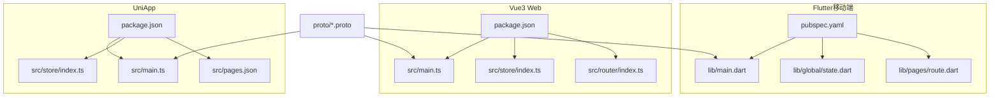
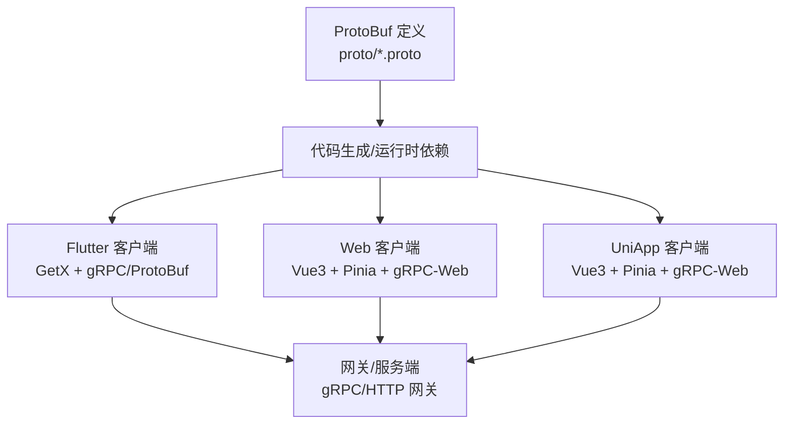
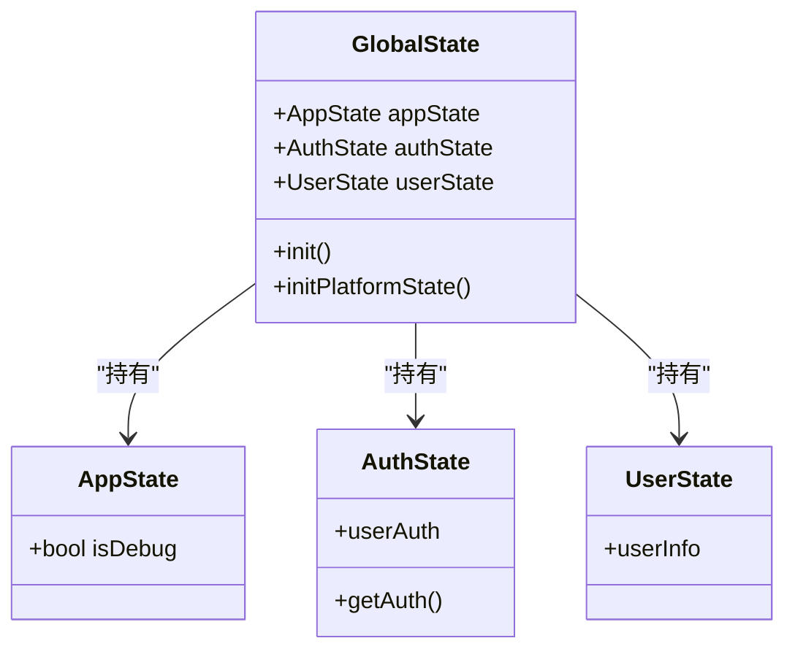
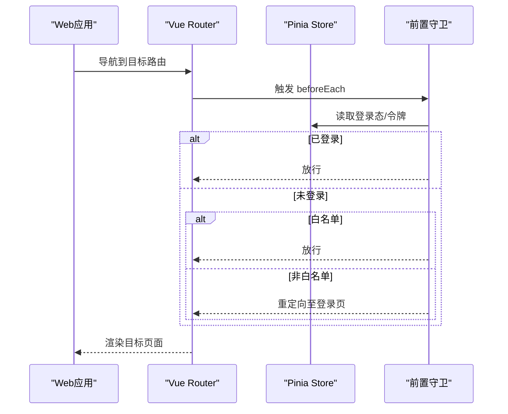
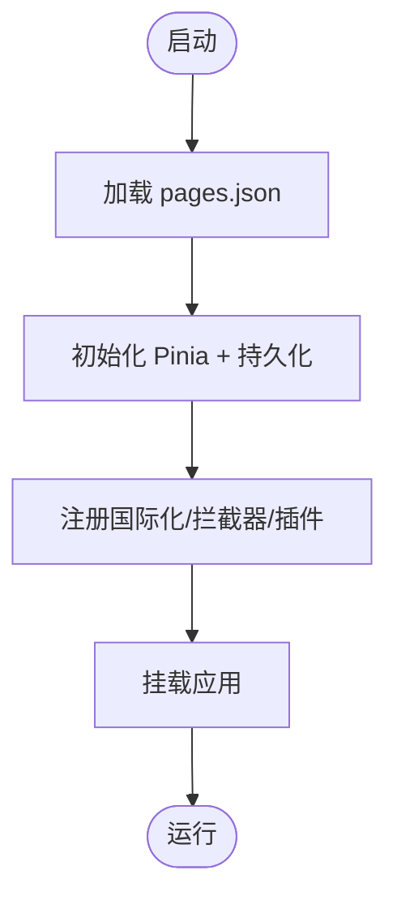
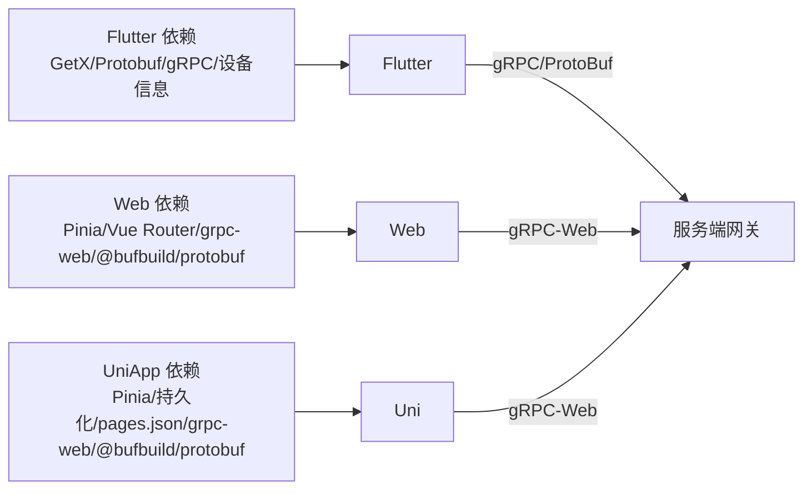

# 前端应用

<cite>
**本文引用的文件**
- [client/app/pubspec.yaml](file://client/app/pubspec.yaml)
- [client/web/package.json](file://client/web/package.json)
- [client/uniapp/package.json](file://client/uniapp/package.json)
- [client/app/lib/main.dart](file://client/app/lib/main.dart)
- [client/web/src/main.ts](file://client/web/src/main.ts)
- [client/uniapp/src/main.ts](file://client/uniapp/src/main.ts)
- [client/app/lib/global/state.dart](file://client/app/lib/global/state.dart)
- [client/web/src/store/index.ts](file://client/web/src/store/index.ts)
- [client/uniapp/src/store/index.ts](file://client/uniapp/src/store/index.ts)
- [client/app/lib/pages/route.dart](file://client/app/lib/pages/route.dart)
- [client/web/src/router/index.ts](file://client/web/src/router/index.ts)
- [client/uniapp/src/pages.json](file://client/uniapp/src/pages.json)
- [proto/README.md](file://proto/README.md)
</cite>

## 目录
1. [简介](#简介)
2. [项目结构](#项目结构)
3. [核心组件](#核心组件)
4. [架构总览](#架构总览)
5. [详细组件分析](#详细组件分析)
6. [依赖关系分析](#依赖关系分析)
7. [性能考虑](#性能考虑)
8. [故障排查指南](#故障排查指南)
9. [结论](#结论)
10. [附录](#附录)

## 简介
本文件面向Hoper前端应用，系统性梳理多端统一架构设计：以Flutter移动端、Vue3 Web应用、UniApp小程序为核心载体，结合共享代码策略、状态管理（GetX/Pinia）、路由与国际化、gRPC/ProtoBuf集成以及实时通信思路，提供从架构到落地的完整说明。文档同时给出性能优化建议、跨平台兼容性要点与用户体验设计原则，帮助开发者高效理解与维护该多端前端体系。

## 项目结构
Hoper前端由三个子工程构成：
- Flutter移动端工程：负责原生能力与高性能UI渲染，采用GetX进行状态与路由管理，并通过本地化资源与主题系统支撑国际化与深浅色切换。
- Vue3 Web工程：基于Vite构建，使用Pinia作为状态管理，Element Plus/Vant等组件库，支持按需引入与平台适配。
- UniApp工程：统一多端（H5/小程序）开发入口，通过pages.json声明页面与TabBar，配合Pinia持久化插件实现跨端一致的状态管理。

图表来源
- [client/app/lib/main.dart:1-70](file://client/app/lib/main.dart#L1-L70)
- [client/app/lib/global/state.dart:1-200](file://client/app/lib/global/state.dart#L1-L200)
- [client/app/lib/pages/route.dart:1-102](file://client/app/lib/pages/route.dart#L1-L102)
- [client/web/src/main.ts:1-63](file://client/web/src/main.ts#L1-L63)
- [client/web/src/store/index.ts:1-10](file://client/web/src/store/index.ts#L1-L10)
- [client/web/src/router/index.ts:1-62](file://client/web/src/router/index.ts#L1-L62)
- [client/uniapp/src/main.ts:1-22](file://client/uniapp/src/main.ts#L1-L22)
- [client/uniapp/src/store/index.ts:1-13](file://client/uniapp/src/store/index.ts#L1-L13)
- [client/uniapp/src/pages.json:1-140](file://client/uniapp/src/pages.json#L1-L140)
- [client/app/pubspec.yaml:1-182](file://client/app/pubspec.yaml#L1-L182)
- [client/web/package.json:1-95](file://client/web/package.json#L1-L95)
- [client/uniapp/package.json:1-174](file://client/uniapp/package.json#L1-L174)

章节来源
- [client/app/lib/main.dart:1-70](file://client/app/lib/main.dart#L1-L70)
- [client/web/src/main.ts:1-63](file://client/web/src/main.ts#L1-L63)
- [client/uniapp/src/main.ts:1-22](file://client/uniapp/src/main.ts#L1-L22)

## 核心组件
- Flutter端
  - 应用入口与国际化：通过主入口配置主题、深浅色模式、本地化委托与路由初始页，统一错误捕获与焦点处理。
  - 全局状态：集中管理应用、认证与用户状态，初始化设备信息并暴露响应式变量供视图层订阅。
  - 路由：基于GetX的命名路由与嵌套路由，支持鉴权拦截与动态参数路由。
- Vue3 Web端
  - 应用入口：按需注册组件库与插件，动态加载平台配置后挂载应用。
  - 状态管理：Pinia全局仓库，结合平台配置与路由守卫实现鉴权与页面级状态隔离。
  - 路由：基于Vue Router的命名路由与异步组件，支持前置守卫与白名单控制。
- UniApp端
  - 应用入口：返回SSR应用实例与Pinia，统一多端生命周期。
  - 状态管理：Pinia + 持久化插件，存储策略适配各端存储API。
  - 页面声明：pages.json集中声明页面、TabBar与中间件，简化多端路由配置。

章节来源
- [client/app/lib/main.dart:17-69](file://client/app/lib/main.dart#L17-L69)
- [client/app/lib/global/state.dart:19-69](file://client/app/lib/global/state.dart#L19-L69)
- [client/app/lib/pages/route.dart:23-100](file://client/app/lib/pages/route.dart#L23-L100)
- [client/web/src/main.ts:16-60](file://client/web/src/main.ts#L16-L60)
- [client/web/src/store/index.ts:1-10](file://client/web/src/store/index.ts#L1-L10)
- [client/web/src/router/index.ts:13-61](file://client/web/src/router/index.ts#L13-L61)
- [client/uniapp/src/main.ts:11-21](file://client/uniapp/src/main.ts#L11-L21)
- [client/uniapp/src/store/index.ts:1-13](file://client/uniapp/src/store/index.ts#L1-L13)
- [client/uniapp/src/pages.json:17-138](file://client/uniapp/src/pages.json#L17-L138)

## 架构总览
多端统一架构的关键在于“共享协议、分层实现”。ProtoBuf模型与服务定义位于proto目录，Flutter/Web/UniApp分别生成对应客户端代码或运行时依赖，围绕以下核心模块协同工作：

图表来源
- [proto/README.md:1-7](file://proto/README.md#L1-L7)
- [client/app/pubspec.yaml:51-52](file://client/app/pubspec.yaml#L51-L52)
- [client/web/package.json:34-46](file://client/web/package.json#L34-L46)
- [client/uniapp/package.json:77-103](file://client/uniapp/package.json#L77-L103)

## 详细组件分析

### Flutter端：GetX状态管理与路由
- 状态管理
  - 全局状态类继承GetX控制器，集中持有应用、认证、用户等子状态，提供初始化流程与设备信息读取。
  - 通过响应式变量驱动UI更新，避免手动刷新。
- 路由
  - 使用GetX命名路由与嵌套路由，支持动态参数与子路由绑定，配合鉴权函数实现受保护页面的访问控制。
- 国际化
  - 配置本地化委托与支持语言列表，主入口中注册翻译器与回退语言，确保多语言体验。

图表来源
- [client/app/lib/global/state.dart:19-46](file://client/app/lib/global/state.dart#L19-L46)

章节来源
- [client/app/lib/global/state.dart:19-199](file://client/app/lib/global/state.dart#L19-L199)
- [client/app/lib/pages/route.dart:23-100](file://client/app/lib/pages/route.dart#L23-L100)
- [client/app/lib/main.dart:29-65](file://client/app/lib/main.dart#L29-L65)

### Vue3 Web端：Pinia状态管理与路由守卫
- 状态管理
  - 创建Pinia实例并注入应用，实现全局状态与模块化仓库的统一接入。
- 路由
  - 基于Vue Router的命名路由与异步组件，结合前置守卫与白名单机制，实现登录态校验与页面跳转控制。
- 组件生态
  - 按需引入Vant组件与插件，结合平台配置与动画插件，提升交互体验。

图表来源
- [client/web/src/router/index.ts:39-59](file://client/web/src/router/index.ts#L39-L59)
- [client/web/src/store/index.ts:1-10](file://client/web/src/store/index.ts#L1-L10)

章节来源
- [client/web/src/main.ts:16-60](file://client/web/src/main.ts#L16-L60)
- [client/web/src/router/index.ts:13-61](file://client/web/src/router/index.ts#L13-L61)
- [client/web/src/store/index.ts:1-10](file://client/web/src/store/index.ts#L1-L10)

### UniApp端：多端路由与状态持久化
- 页面与TabBar
  - 通过pages.json集中声明页面、TabBar与中间件，简化多端路由配置与导航样式。
- 状态管理
  - 使用Pinia并启用持久化插件，存储策略适配uni的同步存储API，保障多端一致性。
- 应用入口
  - 返回SSR应用实例与Pinia，确保多端生命周期与状态管理的一致性。

图表来源
- [client/uniapp/src/pages.json:17-138](file://client/uniapp/src/pages.json#L17-L138)
- [client/uniapp/src/store/index.ts:1-13](file://client/uniapp/src/store/index.ts#L1-L13)
- [client/uniapp/src/main.ts:11-21](file://client/uniapp/src/main.ts#L11-L21)

章节来源
- [client/uniapp/src/pages.json:17-138](file://client/uniapp/src/pages.json#L17-L138)
- [client/uniapp/src/store/index.ts:1-13](file://client/uniapp/src/store/index.ts#L1-L13)
- [client/uniapp/src/main.ts:11-21](file://client/uniapp/src/main.ts#L11-L21)

### gRPC/ProtoBuf集成与实时通信
- 协议与生成
  - ProtoBuf定义位于proto目录，包含通用模型与业务模型/服务定义；README指出gRPC-Gateway与空消息类型的问题与解决方向。
- 客户端集成
  - Flutter端：依赖gRPC与Protobuf库，可直接生成或使用运行时ProtoBuf类型。
  - Web端：依赖grpc-web与@bufbuild/protobuf，可通过脚本生成gRPC-Web客户端代码。
  - UniApp端：依赖grpc-web与@bufbuild/protobuf，与Web端保持一致的gRPC-Web调用方式。
- 实时通信
  - 当前仓库未发现WebSocket/Server-Sent Events的具体实现文件；建议在服务端提供gRPC流式接口或补充WebSocket通道，并在前端以统一的API层封装订阅逻辑，确保多端一致的实时体验。

章节来源
- [proto/README.md:1-7](file://proto/README.md#L1-L7)
- [client/app/pubspec.yaml:51-52](file://client/app/pubspec.yaml#L51-L52)
- [client/web/package.json:26-46](file://client/web/package.json#L26-L46)
- [client/uniapp/package.json:95-103](file://client/uniapp/package.json#L95-L103)

## 依赖关系分析
- Flutter
  - 依赖GetX进行状态与路由管理，依赖Protobuf/gRPC进行网络通信，依赖设备信息插件读取平台信息。
- Vue3 Web
  - 依赖Pinia进行状态管理，依赖Vue Router进行路由，依赖grpc-web与@bufbuild/protobuf进行gRPC-Web通信。
- UniApp
  - 依赖Pinia与持久化插件，依赖pages.json进行页面与TabBar声明，依赖grpc-web与@bufbuild/protobuf进行gRPC-Web通信。

图表来源
- [client/app/pubspec.yaml:23-101](file://client/app/pubspec.yaml#L23-L101)
- [client/web/package.json:25-47](file://client/web/package.json#L25-L47)
- [client/uniapp/package.json:77-103](file://client/uniapp/package.json#L77-L103)

章节来源
- [client/app/pubspec.yaml:23-101](file://client/app/pubspec.yaml#L23-L101)
- [client/web/package.json:25-47](file://client/web/package.json#L25-L47)
- [client/uniapp/package.json:77-103](file://client/uniapp/package.json#L77-L103)

## 性能考虑
- 代码分割与懒加载
  - Web端使用异步组件与路由懒加载，减少首屏体积；Flutter端使用GetX的延迟绑定与按需导入；UniApp端通过pages.json与中间件实现按需加载。
- 状态管理优化
  - Pinia/GetX均支持模块化与细粒度状态拆分，避免全局状态风暴；在Flutter端使用响应式变量替代全量刷新。
- 网络与序列化
  - gRPC-Web与@bufbuild/protobuf具备更小的包体与更快的序列化速度；建议在Web/UniApp端统一使用gRPC-Web，减少HTTP开销。
- 图片与资源
  - Web端使用懒加载与按需组件；Flutter端使用缓存管理与本地数据库；UniApp端利用平台图片组件与分包策略。
- 主题与国际化
  - 统一主题变量与深浅色切换，减少重复计算；国际化采用按需加载语言包，避免一次性加载全部文案。

## 故障排查指南
- Flutter
  - 错误捕获：主入口使用runZonedGuarded与ErrorWidget.builder统一处理异常，便于日志记录与降级提示。
  - 设备信息：initPlatformState根据平台读取不同设备信息，若出现空值，检查设备信息插件初始化顺序。
- Web
  - 路由守卫：若登录态异常，检查前置守卫中对store的读取与令牌状态；确认白名单路由配置正确。
  - gRPC-Web：若请求失败，检查生成的gRPC-Web代码与服务端网关配置，确保跨域与协议匹配。
- UniApp
  - 页面与TabBar：若页面不显示或TabBar异常，检查pages.json中路径与中间件配置；确认组件库按需引入。
  - 状态持久化：若数据未持久化，检查持久化插件的存储API与键名冲突问题。

章节来源
- [client/app/lib/main.dart:17-28](file://client/app/lib/main.dart#L17-L28)
- [client/app/lib/global/state.dart:39-69](file://client/app/lib/global/state.dart#L39-L69)
- [client/web/src/router/index.ts:39-59](file://client/web/src/router/index.ts#L39-L59)
- [client/uniapp/src/pages.json:17-138](file://client/uniapp/src/pages.json#L17-L138)
- [client/uniapp/src/store/index.ts:5-12](file://client/uniapp/src/store/index.ts#L5-L12)

## 结论
Hoper前端通过Flutter/Web/UniApp三端统一的协议与状态管理方案，实现了跨平台的一致体验与高扩展性。GetX与Pinia分别满足移动端与Web端的状态需求，gRPC/ProtoBuf提供高效的序列化与通信基础。未来可在服务端完善实时通信能力，并在前端统一封装订阅逻辑，进一步提升多端一致性与用户体验。

## 附录
- 用户体验设计原则
  - 一致性：三端UI风格与交互行为保持一致，避免认知负担。
  - 可靠性：错误处理与降级提示明确，保证弱网与异常场景下的可用性。
  - 可访问性：遵循无障碍设计，提供键盘导航与屏幕阅读器支持。
  - 性能优先：按需加载、懒执行与缓存策略，降低首屏时间与内存占用。
- 跨平台兼容性要点
  - 平台差异：针对iOS/Android/H5/小程序的权限、存储与网络差异，采用条件编译与平台适配层。
  - 主题与字体：统一主题变量与字体栈，避免平台默认样式的差异影响。
  - 事件与手势：在移动端使用原生手势，在Web端提供鼠标与键盘映射，保持交互自然。