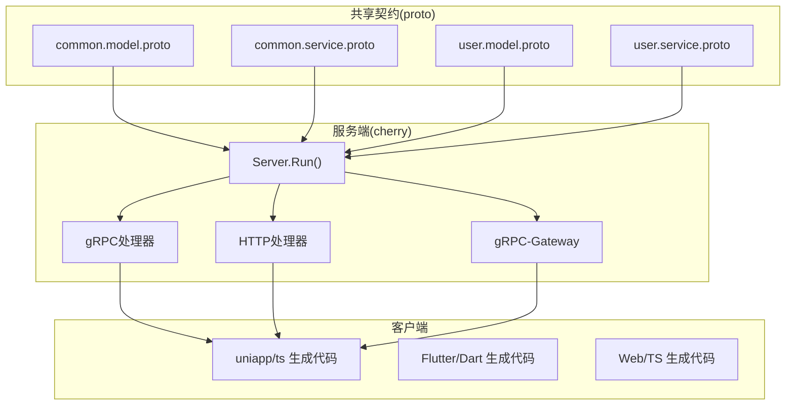
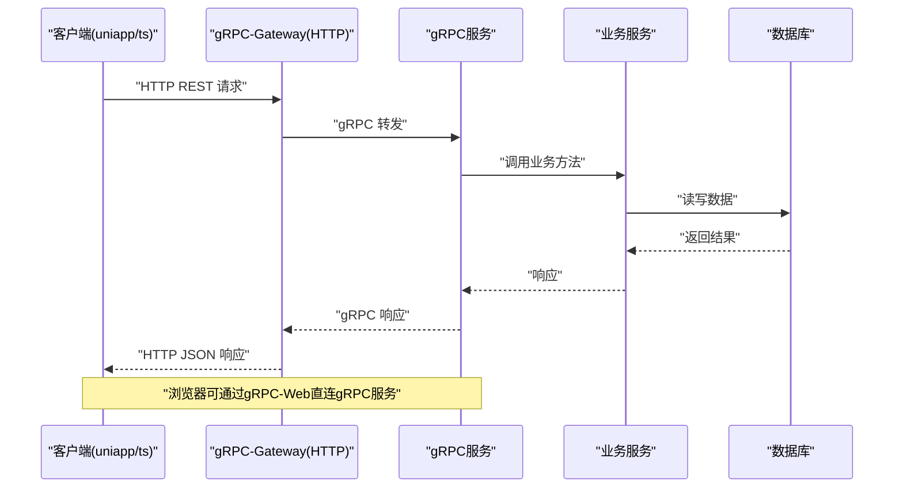
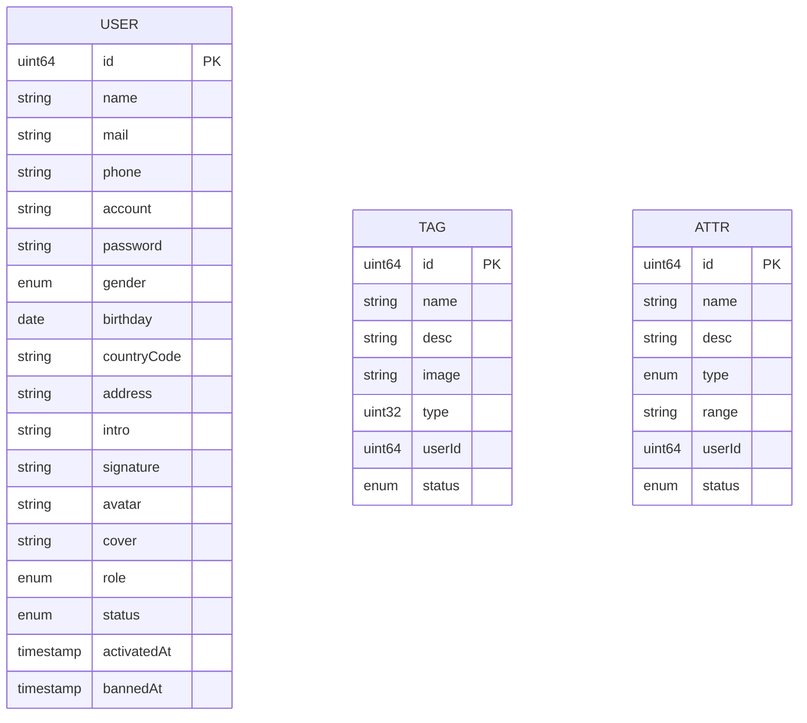
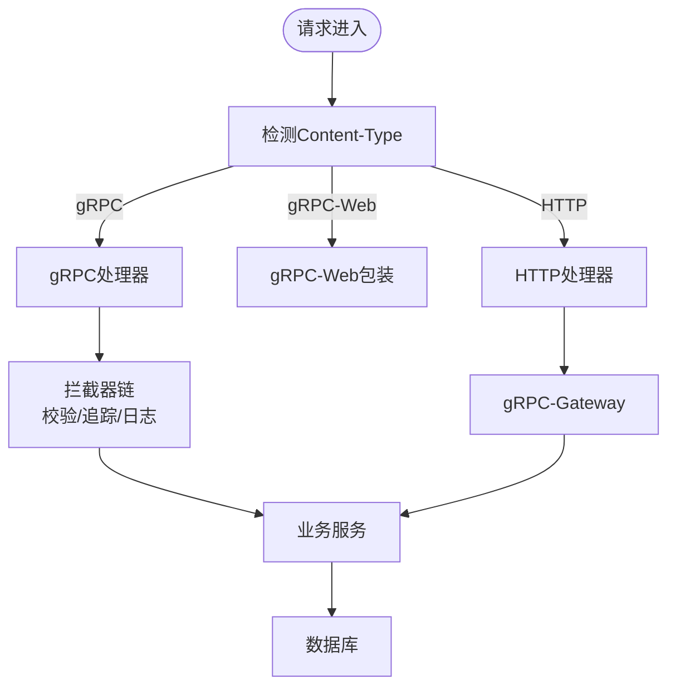
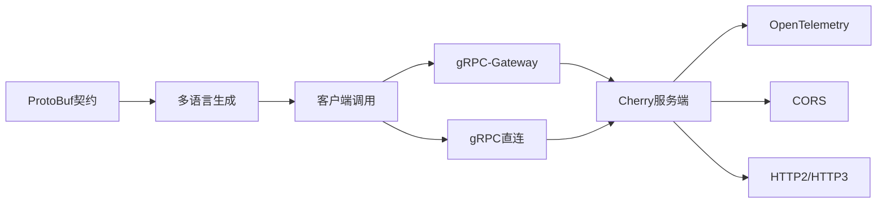

# 跨平台共享机制

<cite>
**本文档引用的文件**
- [proto/README.md](file://proto/README.md)
- [thirdparty/cherry/README.md](file://thirdparty/cherry/README.md)
- [thirdparty/cherry/server.go](file://thirdparty/cherry/server.go)
- [thirdparty/cherry/handler_grpc.go](file://thirdparty/cherry/handler_grpc.go)
- [thirdparty/cherry/handler_http.go](file://thirdparty/cherry/handler_http.go)
- [proto/common/common.model.proto](file://proto/common/common.model.proto)
- [proto/common/common.service.proto](file://proto/common/common.service.proto)
- [proto/user/user.model.proto](file://proto/user/user.model.proto)
- [proto/user/user.service.proto](file://proto/user/user.service.proto)
</cite>

## 目录
1. [简介](#简介)
2. [项目结构](#项目结构)
3. [核心组件](#核心组件)
4. [架构总览](#架构总览)
5. [详细组件分析](#详细组件分析)
6. [依赖关系分析](#依赖关系分析)
7. [性能考虑](#性能考虑)
8. [故障排除指南](#故障排除指南)
9. [结论](#结论)
10. [附录](#附录)

## 简介
本文件面向Hoper跨平台共享机制的技术文档，聚焦以下目标：
- 统一的ProtoBuf数据契约在多平台间的应用
- gRPC客户端集成与实时通信实现
- 跨平台数据同步策略、状态共享机制与组件复用模式
- 平台间数据格式转换、网络通信协议与错误处理机制
- 共享代码库的设计原则、版本兼容性与性能优化策略
- 提供具体集成示例与故障排除指导

## 项目结构
Hoper采用“共享契约 + 多语言生成 + 统一网关”的架构：
- ProtoBuf契约位于proto目录，按领域拆分（common、user、content等）
- 服务端通过cherry库统一承载gRPC/HTTP/HTTP3/可观测性能力
- 客户端通过各语言生成的pb代码进行调用（如uniapp/ts）

**图表来源**
- [proto/common/common.model.proto:1-213](file://proto/common/common.model.proto#L1-L213)
- [proto/common/common.service.proto:1-223](file://proto/common/common.service.proto#L1-L223)
- [proto/user/user.model.proto:1-269](file://proto/user/user.model.proto#L1-L269)
- [proto/user/user.service.proto:1-425](file://proto/user/user.service.proto#L1-L425)
- [thirdparty/cherry/server.go:40-200](file://thirdparty/cherry/server.go#L40-L200)

**章节来源**
- [proto/README.md:1-7](file://proto/README.md#L1-L7)
- [thirdparty/cherry/README.md:1-58](file://thirdparty/cherry/README.md#L1-L58)

## 核心组件
- ProtoBuf数据契约：定义跨平台统一的数据模型与服务接口，支持OpenAPI标注与校验扩展
- Cherry服务端：统一承载gRPC、HTTP、HTTP3、gRPC-Gateway、可观测性（OpenTelemetry）、CORS、HTTP2/HTTP3等
- 客户端生成代码：基于proto生成多语言pb代码，用于gRPC/HTTP调用

关键特性：
- gRPC-Gateway：将gRPC接口映射为REST风格HTTP接口，便于Web/移动端直连
- gRPC-Web：在浏览器环境通过gRPC-Web进行实时通信
- HTTP3/QUIC：提供更快的传输层支持
- 中间件与拦截器：统一接入日志、校验、追踪、访问控制

**章节来源**
- [thirdparty/cherry/server.go:31-200](file://thirdparty/cherry/server.go#L31-L200)
- [thirdparty/cherry/handler_grpc.go:30-164](file://thirdparty/cherry/handler_grpc.go#L30-L164)
- [thirdparty/cherry/handler_http.go:36-84](file://thirdparty/cherry/handler_http.go#L36-L84)

## 架构总览
下图展示从客户端到服务端的典型调用链路，包括gRPC直连、HTTP REST、gRPC-Web与HTTP3。

**图表来源**
- [thirdparty/cherry/server.go:87-108](file://thirdparty/cherry/server.go#L87-L108)
- [thirdparty/cherry/handler_http.go:36-84](file://thirdparty/cherry/handler_http.go#L36-L84)
- [thirdparty/cherry/handler_grpc.go:30-58](file://thirdparty/cherry/handler_grpc.go#L30-L58)

## 详细组件分析

### ProtoBuf数据契约与跨平台统一
- 数据模型：common与user模块定义了统一的实体模型（如User、Attr、Tag等），并引入枚举、时间戳、软删除等通用字段
- 服务接口：通过google.api.annotations与OpenAPI注解，将gRPC映射为REST接口，同时支持GraphQL标注
- 生成配置：proto/README.md指出grpc-gateway对empty.Empty的兼容问题，需手动替换或自定义proto文件

**图表来源**
- [proto/user/user.model.proto:19-50](file://proto/user/user.model.proto#L19-L50)
- [proto/common/common.model.proto:83-93](file://proto/common/common.model.proto#L83-L93)
- [proto/common/common.model.proto:19-29](file://proto/common/common.model.proto#L19-L29)

**章节来源**
- [proto/common/common.model.proto:1-213](file://proto/common/common.model.proto#L1-L213)
- [proto/common/common.service.proto:1-223](file://proto/common/common.service.proto#L1-L223)
- [proto/user/user.model.proto:1-269](file://proto/user/user.model.proto#L1-L269)
- [proto/user/user.service.proto:1-425](file://proto/user/user.service.proto#L1-L425)
- [proto/README.md:1-7](file://proto/README.md#L1-L7)

### gRPC客户端集成与实时通信
- 服务端路由：server.go根据Content-Type自动分流至gRPC或HTTP处理器；支持gRPC-Web与HTTP2/HTTP3
- gRPC拦截器：handler_grpc.go提供统一的拦截器链，内置panic恢复、参数校验、OpenTelemetry追踪、访问日志记录
- HTTP处理器：handler_http.go封装gRPC-Web与OpenAPI文档，提供统一的HTTP入口

**图表来源**
- [thirdparty/cherry/server.go:87-108](file://thirdparty/cherry/server.go#L87-L108)
- [thirdparty/cherry/handler_grpc.go:64-107](file://thirdparty/cherry/handler_grpc.go#L64-L107)
- [thirdparty/cherry/handler_http.go:36-84](file://thirdparty/cherry/handler_http.go#L36-L84)

**章节来源**
- [thirdparty/cherry/server.go:40-200](file://thirdparty/cherry/server.go#L40-L200)
- [thirdparty/cherry/handler_grpc.go:30-164](file://thirdparty/cherry/handler_grpc.go#L30-L164)
- [thirdparty/cherry/handler_http.go:27-84](file://thirdparty/cherry/handler_http.go#L27-L84)

### 跨平台数据同步策略与状态共享
- 同步策略：通过gRPC双向流或服务端推送（结合gRPC-Web）实现增量同步；REST接口用于拉取与幂等更新
- 状态共享：利用OpenTelemetry上下文传播，确保跨服务调用的TraceID一致；中间件记录请求/响应摘要
- 组件复用：公共模型（common.*）与服务（common.CommonService）在多平台共享，减少重复实现

**章节来源**
- [thirdparty/cherry/handler_grpc.go:64-107](file://thirdparty/cherry/handler_grpc.go#L64-L107)
- [thirdparty/cherry/handler_http.go:58-76](file://thirdparty/cherry/handler_http.go#L58-L76)
- [proto/common/common.service.proto:18-136](file://proto/common/common.service.proto#L18-L136)

### 错误处理机制
- gRPC错误：handler_grpc.go对panic进行捕获并转换为Internal状态；对参数校验失败返回InvalidArgument
- HTTP错误：handler_http.go在panic时返回统一错误响应，并设置错误头
- 统一日志：通过zap与OpenTelemetry记录TraceID与Baggage，便于问题定位

**章节来源**
- [thirdparty/cherry/handler_grpc.go:64-107](file://thirdparty/cherry/handler_grpc.go#L64-L107)
- [thirdparty/cherry/handler_http.go:38-76](file://thirdparty/cherry/handler_http.go#L38-L76)

## 依赖关系分析
- 服务端依赖：cherry统一管理gRPC、HTTP、HTTP3、CORS、OpenTelemetry等
- 协议栈：gRPC直连、gRPC-Web（浏览器）、HTTP REST（gRPC-Gateway）、HTTP3（QUIC）
- 生成工具：proto/README.md提示grpc-gateway与empty.Empty的兼容问题，需手动替换或自定义proto

**图表来源**
- [proto/README.md:1-7](file://proto/README.md#L1-L7)
- [thirdparty/cherry/README.md:49-58](file://thirdparty/cherry/README.md#L49-L58)
- [thirdparty/cherry/server.go:116-142](file://thirdparty/cherry/server.go#L116-L142)

**章节来源**
- [proto/README.md:1-7](file://proto/README.md#L1-L7)
- [thirdparty/cherry/README.md:1-58](file://thirdparty/cherry/README.md#L1-L58)

## 性能考虑
- 连接与帧：HTTP2参数（并发流、头部表大小、读写超时）在server.go中集中配置
- 传输层：HTTP3通过QUIC降低握手与队头阻塞延迟
- 观测性：OpenTelemetry与pprof集成，便于性能瓶颈定位
- 缓存与校验：拦截器内统一参数校验，避免重复校验逻辑

**章节来源**
- [thirdparty/cherry/server.go:116-132](file://thirdparty/cherry/server.go#L116-L132)
- [thirdparty/cherry/server.go:144-159](file://thirdparty/cherry/server.go#L144-L159)
- [thirdparty/cherry/README.md:55-57](file://thirdparty/cherry/README.md#L55-L57)

## 故障排除指南
- gRPC-Gateway empty.Empty兼容问题：参考proto/README.md，手动替换gw.go中的empty.Empty为types.Empty或自定义proto文件
- panic与错误响应：handler_grpc.go与handler_http.go均对panic进行捕获并返回系统错误，检查日志中的TraceID以定位根因
- CORS与HTTP3：确认server.go中CORS与HTTP3配置是否正确加载证书与监听地址
- 参数校验失败：handler_grpc.go在拦截器中执行参数校验，InvalidArgument错误通常来自字段校验规则

**章节来源**
- [proto/README.md:1-7](file://proto/README.md#L1-L7)
- [thirdparty/cherry/handler_grpc.go:82-84](file://thirdparty/cherry/handler_grpc.go#L82-L84)
- [thirdparty/cherry/handler_http.go:40-48](file://thirdparty/cherry/handler_http.go#L40-L48)
- [thirdparty/cherry/server.go:55-58](file://thirdparty/cherry/server.go#L55-L58)
- [thirdparty/cherry/server.go:133-142](file://thirdparty/cherry/server.go#L133-L142)

## 结论
Hoper通过统一的ProtoBuf契约与cherry服务端，实现了gRPC、HTTP、HTTP3与gRPC-Web的多协议互通，结合OpenTelemetry与中间件，提供了可观测、可扩展、跨平台的共享机制。客户端通过多语言生成代码，实现一致的数据格式与调用体验。建议在生产环境中优先使用gRPC直连以获得最佳性能，同时通过gRPC-Gateway与gRPC-Web满足Web/移动端的REST与实时通信需求。

## 附录
- 快速开始与生成流程：参考thirdparty/cherry/README.md中的安装与生成步骤
- 服务端运行：参考thirdparty/cherry/server.go的Run方法与选项配置
- 契约示例：参考proto/common与proto/user下的model与service定义

**章节来源**
- [thirdparty/cherry/README.md:11-23](file://thirdparty/cherry/README.md#L11-L23)
- [thirdparty/cherry/server.go:31-50](file://thirdparty/cherry/server.go#L31-L50)
- [proto/common/common.service.proto:18-136](file://proto/common/common.service.proto#L18-L136)
- [proto/user/user.service.proto:26-258](file://proto/user/user.service.proto#L26-L258)