# 后端服务

<cite>
**本文档引用的文件**
- [server/go/main.go](file://server/go/main.go)
- [thirdparty/cherry/server.go](file://thirdparty/cherry/server.go)
- [thirdparty/cherry/handler_grpc.go](file://thirdparty/cherry/handler_grpc.go)
- [thirdparty/cherry/options.go](file://thirdparty/cherry/options.go)
- [server/go/config/config.toml](file://server/go/config/config.toml)
- [server/go/route.yaml](file://server/go/route.yaml)
- [server/go/svc.yaml](file://server/go/svc.yaml)
- [server/go/global/config.go](file://server/go/global/config.go)
- [server/go/user/main.go](file://server/go/user/main.go)
- [server/go/content/api/gin.go](file://server/go/content/api/gin.go)
- [server/go/content/api/grpc.go](file://server/go/content/api/grpc.go)
- [server/go/content/data/db/content.go](file://server/go/content/data/db/content.go)
- [server/go/content/data/redis/dao.go](file://server/go/content/data/redis/dao.go)
- [server/go/file/api/gin.go](file://server/go/file/api/gin.go)
- [server/go/file/service/upload.go](file://server/go/file/service/upload.go)
- [server/go/file/service/rfv.go](file://server/go/file/service/rfv.go)
- [server/go/message/api/gin.go](file://server/go/message/api/gin.go)
- [server/go/message/service/chat.go](file://server/go/message/service/chat.go)
- [server/go/message/service/hub.go](file://server/go/message/service/hub.go)
</cite>

## 目录
1. [引言](#引言)
2. [项目结构](#项目结构)
3. [核心组件](#核心组件)
4. [架构总览](#架构总览)
5. [详细组件分析](#详细组件分析)
6. [依赖分析](#依赖分析)
7. [性能考虑](#性能考虑)
8. [故障排查指南](#故障排查指南)
9. [结论](#结论)
10. [附录](#附录)

## 引言
本文件面向Hoper后端服务，基于Cherry框架构建的微服务架构进行系统性梳理。重点覆盖服务容器配置、中间件机制、gRPC网关实现，以及用户服务、内容服务、文件服务、消息服务等核心业务模块的职责与实现要点。同时阐述服务间通信、数据一致性保障、错误处理策略、服务注册发现、负载均衡与熔断降级建议，并给出监控、日志与性能优化的最佳实践。

## 项目结构
后端采用多模块分层组织：
- 顶层入口：Go主程序负责初始化全局配置、OpenTelemetry、注册各业务API与gRPC处理器，并启动Cherry服务容器。
- Cherry框架：统一的HTTP/gRPC服务容器，内置中间件、CORS、OpenTelemetry集成、HTTP/2与HTTP/3支持、优雅停机等能力。
- 业务服务：
  - 用户服务：提供用户认证、授权相关接口（HTTP与gRPC）。
  - 内容服务：围绕文章、动态、笔记等内容模型，提供增删改查与统计限流等能力。
  - 文件服务：提供文件上传、下载、存储策略与TUS协议支持。
  - 消息服务：提供聊天、消息推送、Hub连接管理等实时通信能力。
- 配置与路由：通过TOML配置中心与Kubernetes/网关路由规则，实现环境差异化配置与外部访问控制。

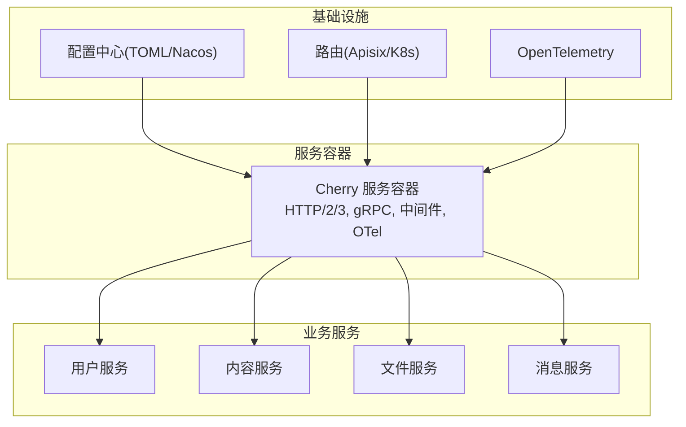

图表来源
- [server/go/main.go:29-68](file://server/go/main.go#L29-L68)
- [thirdparty/cherry/server.go:40-200](file://thirdparty/cherry/server.go#L40-L200)
- [server/go/config/config.toml:1-41](file://server/go/config/config.toml#L1-L41)
- [server/go/route.yaml:1-48](file://server/go/route.yaml#L1-L48)

章节来源
- [server/go/main.go:29-68](file://server/go/main.go#L29-L68)
- [thirdparty/cherry/server.go:40-200](file://thirdparty/cherry/server.go#L40-L200)
- [server/go/config/config.toml:1-41](file://server/go/config/config.toml#L1-L41)
- [server/go/route.yaml:1-48](file://server/go/route.yaml#L1-L48)

## 核心组件
- 服务容器与启动流程
  - 全局初始化：加载配置、设置OpenTelemetry资源属性、注册HTTP与gRPC处理器、启动Cherry服务。
  - Cherry服务容器：统一处理HTTP与gRPC请求分发、中间件链、CORS、OpenTelemetry、HTTP/2与HTTP/3、优雅停机。
- 中间件与拦截器
  - HTTP中间件：统一接入日志、跨域、链路追踪等。
  - gRPC拦截器：参数校验、panic恢复、状态码规范化、访问日志记录、OpenTelemetry指标埋点。
- 配置中心与环境
  - 支持本地TOML与Nacos配置中心，按环境切换（dev/test/prod），支持热更新与模板注入。
- 路由与服务暴露
  - Kubernetes Service与Apisix路由规则，分别暴露HTTP与gRPC端口，支持HTTPS重定向与WebSocket。

章节来源
- [server/go/main.go:29-68](file://server/go/main.go#L29-L68)
- [thirdparty/cherry/server.go:40-200](file://thirdparty/cherry/server.go#L40-L200)
- [thirdparty/cherry/handler_grpc.go:30-164](file://thirdparty/cherry/handler_grpc.go#L30-L164)
- [thirdparty/cherry/options.go:19-86](file://thirdparty/cherry/options.go#L19-L86)
- [server/go/config/config.toml:1-41](file://server/go/config/config.toml#L1-L41)
- [server/go/route.yaml:1-48](file://server/go/route.yaml#L1-L48)
- [server/go/svc.yaml:1-34](file://server/go/svc.yaml#L1-L34)

## 架构总览
下图展示从客户端到服务容器再到各业务服务的整体调用链路，以及Cherry对HTTP/gRPC的统一处理与中间件/拦截器的贯穿。

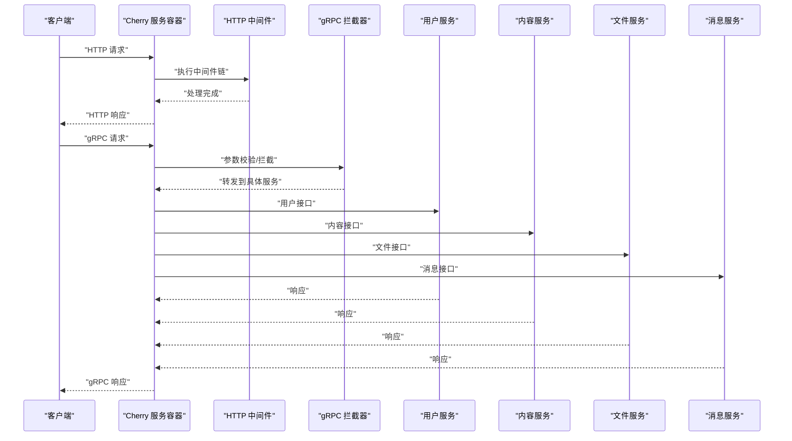

图表来源
- [server/go/main.go:55-67](file://server/go/main.go#L55-L67)
- [thirdparty/cherry/server.go:87-108](file://thirdparty/cherry/server.go#L87-L108)
- [thirdparty/cherry/handler_grpc.go:64-107](file://thirdparty/cherry/handler_grpc.go#L64-L107)

## 详细组件分析

### 服务容器与启动流程
- 初始化与配置
  - 设置OpenTelemetry资源属性，确保服务名与运行环境信息可被追踪系统识别。
  - 注册Pick中间件与各业务服务的HTTP与gRPC处理器。
- 服务启动
  - Cherry容器统一处理HTTP与gRPC请求分发，支持CORS、OpenTelemetry、HTTP/2与HTTP/3。
  - 提供优雅停机与内部管理端口，便于健康检查与指标导出。

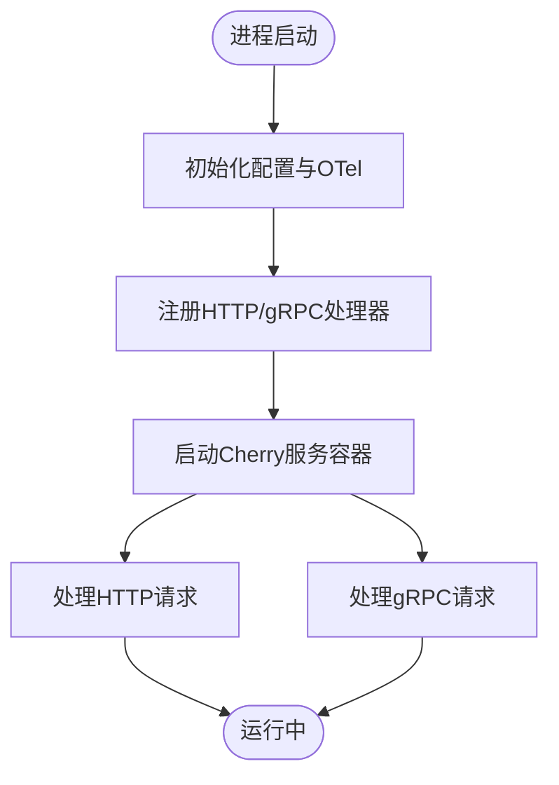

图表来源
- [server/go/main.go:29-68](file://server/go/main.go#L29-L68)
- [thirdparty/cherry/server.go:40-200](file://thirdparty/cherry/server.go#L40-L200)

章节来源
- [server/go/main.go:29-68](file://server/go/main.go#L29-L68)
- [thirdparty/cherry/server.go:40-200](file://thirdparty/cherry/server.go#L40-L200)

### 中间件与拦截器机制
- HTTP中间件
  - 在Cherry容器中以链式方式应用，统一处理跨域、访问日志、链路追踪等。
- gRPC拦截器
  - 统一参数校验、panic恢复、状态码规范化、访问日志记录与OpenTelemetry埋点。
  - 对流式与Unary请求分别处理，确保异常场景返回标准gRPC状态。

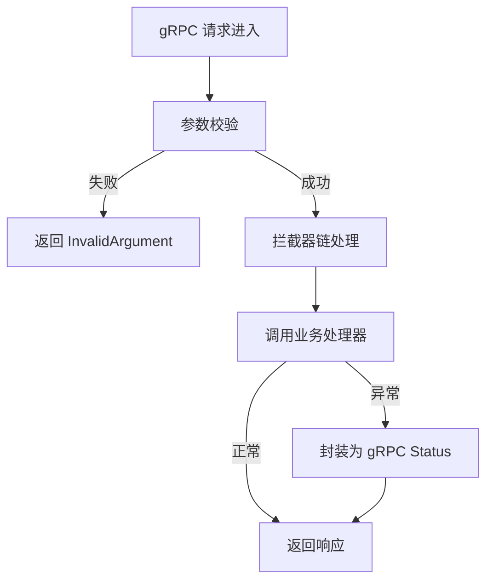

图表来源
- [thirdparty/cherry/handler_grpc.go:64-107](file://thirdparty/cherry/handler_grpc.go#L64-L107)
- [thirdparty/cherry/handler_grpc.go:109-164](file://thirdparty/cherry/handler_grpc.go#L109-L164)

章节来源
- [thirdparty/cherry/handler_grpc.go:30-164](file://thirdparty/cherry/handler_grpc.go#L30-L164)

### 配置中心与环境管理
- 配置格式与来源
  - 支持本地TOML与Nacos配置中心，按环境切换（dev/test/prod）。
  - dev环境支持本地配置文件监听与模板注入；test环境对接Nacos。
- 运行时配置
  - 全局配置包含分页大小、站点URL、上传策略、Token有效期与密钥等。
  - 根据环境自动调整运行模式（如Release模式）。

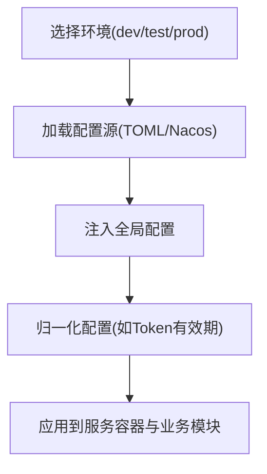

图表来源
- [server/go/config/config.toml:1-41](file://server/go/config/config.toml#L1-L41)
- [server/go/global/config.go:38-68](file://server/go/global/config.go#L38-L68)

章节来源
- [server/go/config/config.toml:1-41](file://server/go/config/config.toml#L1-L41)
- [server/go/global/config.go:38-68](file://server/go/global/config.go#L38-L68)

### 路由与服务暴露
- Kubernetes Service
  - 暴露HTTP与gRPC端口，目标端口统一指向服务容器端口，便于内部流量转发。
- Apisix路由
  - 分别为HTTP与gRPC配置路由规则，支持HTTPS重定向与WebSocket。
  - 通过serviceName与resolveGranularity实现服务发现与负载均衡。

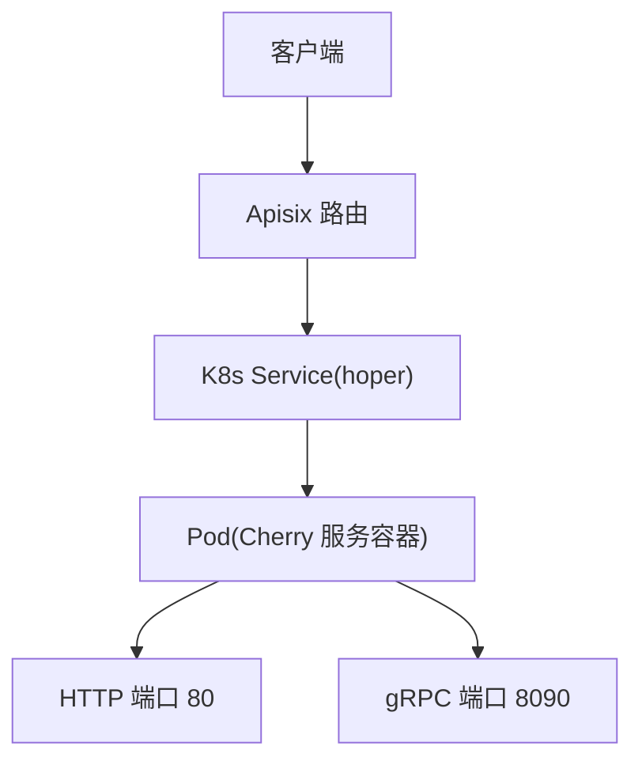

图表来源
- [server/go/route.yaml:1-48](file://server/go/route.yaml#L1-L48)
- [server/go/svc.yaml:1-34](file://server/go/svc.yaml#L1-L34)

章节来源
- [server/go/route.yaml:1-48](file://server/go/route.yaml#L1-L48)
- [server/go/svc.yaml:1-34](file://server/go/svc.yaml#L1-L34)

### 用户服务
- 职责与接口
  - 提供用户认证、授权相关接口，支持HTTP与gRPC两种接入方式。
- 启动方式
  - 单独的用户服务入口，复用Cherry容器与配置中心。

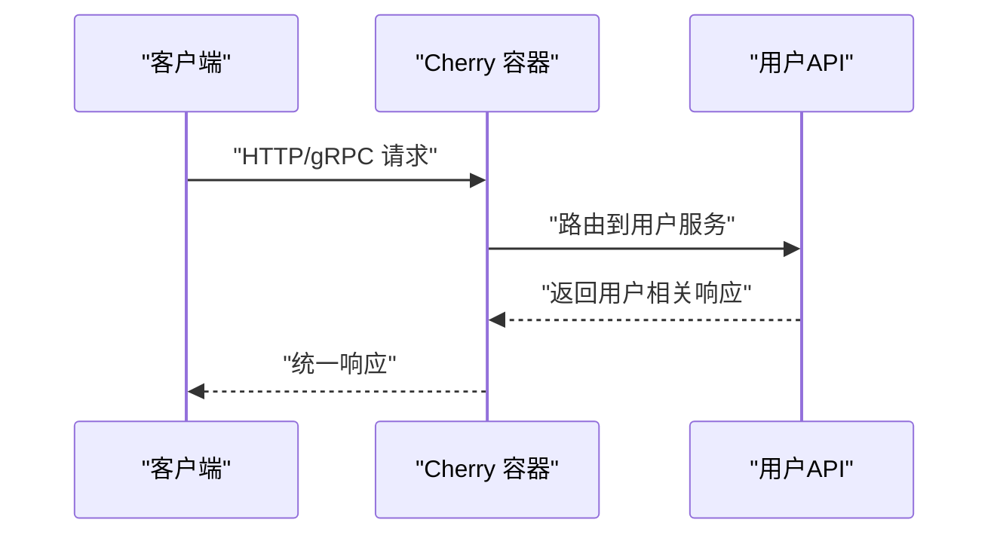

图表来源
- [server/go/user/main.go:10-15](file://server/go/user/main.go#L10-L15)
- [server/go/main.go:58-61](file://server/go/main.go#L58-L61)

章节来源
- [server/go/user/main.go:10-15](file://server/go/user/main.go#L10-L15)
- [server/go/main.go:58-61](file://server/go/main.go#L58-L61)

### 内容服务
- 职责与接口
  - 围绕文章、动态、笔记等内容模型，提供增删改查与统计限流等能力。
  - 提供HTTP与gRPC接口，分别在各自API包中注册。
- 数据层
  - 使用数据库DAO与Redis DAO，分别承载持久化与缓存/限流等能力。
  - 内容模型与DAO分布在content/data/db与content/data/redis目录。

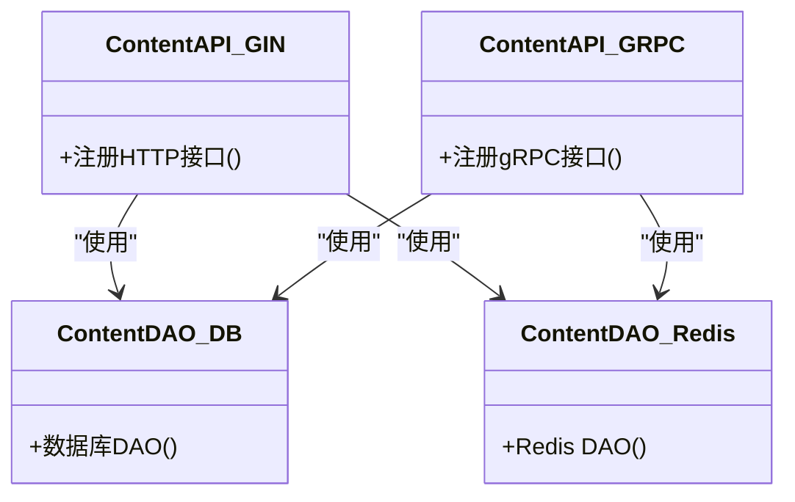

图表来源
- [server/go/content/api/gin.go](file://server/go/content/api/gin.go)
- [server/go/content/api/grpc.go](file://server/go/content/api/grpc.go)
- [server/go/content/data/db/content.go](file://server/go/content/data/db/content.go)
- [server/go/content/data/redis/dao.go](file://server/go/content/data/redis/dao.go)

章节来源
- [server/go/content/api/gin.go](file://server/go/content/api/gin.go)
- [server/go/content/api/grpc.go](file://server/go/content/api/grpc.go)
- [server/go/content/data/db/content.go](file://server/go/content/data/db/content.go)
- [server/go/content/data/redis/dao.go](file://server/go/content/data/redis/dao.go)

### 文件服务
- 职责与接口
  - 提供文件上传、下载、存储策略与TUS协议支持。
  - 提供HTTP接口与上传服务实现。
- 实现要点
  - 支持多种上传策略与RFV（可能指视频/文件处理）能力。
  - 通过全局配置注入上传策略与桶信息。

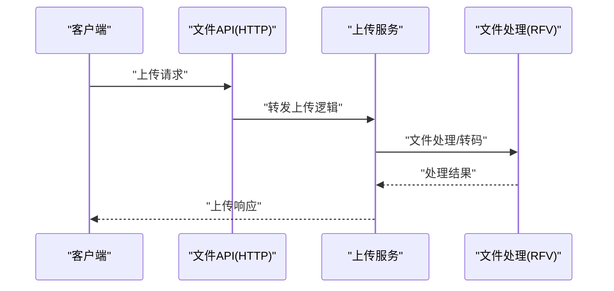

图表来源
- [server/go/file/api/gin.go](file://server/go/file/api/gin.go)
- [server/go/file/service/upload.go](file://server/go/file/service/upload.go)
- [server/go/file/service/rfv.go](file://server/go/file/service/rfv.go)
- [server/go/global/config.go:51-67](file://server/go/global/config.go#L51-L67)

章节来源
- [server/go/file/api/gin.go](file://server/go/file/api/gin.go)
- [server/go/file/service/upload.go](file://server/go/file/service/upload.go)
- [server/go/file/service/rfv.go](file://server/go/file/service/rfv.go)
- [server/go/global/config.go:51-67](file://server/go/global/config.go#L51-L67)

### 消息服务
- 职责与接口
  - 提供聊天、消息推送、Hub连接管理等实时通信能力。
  - 提供HTTP接口与聊天服务实现。
- 实现要点
  - Hub用于管理连接与广播，Chat服务负责消息处理与路由。
  - 与Cherry容器结合，支持WebSocket与gRPC双向通信。

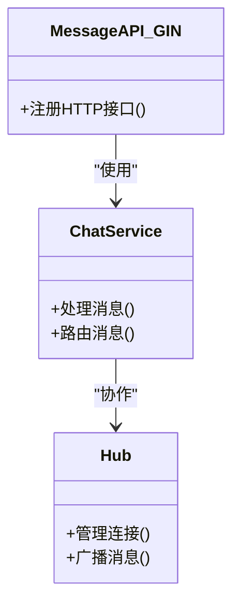

图表来源
- [server/go/message/api/gin.go](file://server/go/message/api/gin.go)
- [server/go/message/service/chat.go](file://server/go/message/service/chat.go)
- [server/go/message/service/hub.go](file://server/go/message/service/hub.go)

章节来源
- [server/go/message/api/gin.go](file://server/go/message/api/gin.go)
- [server/go/message/service/chat.go](file://server/go/message/service/chat.go)
- [server/go/message/service/hub.go](file://server/go/message/service/hub.go)

## 依赖分析
- 服务容器与业务模块
  - 业务模块通过Cherry选项注册HTTP与gRPC处理器，形成松耦合的插件式扩展。
- 中间件与拦截器
  - HTTP中间件与gRPC拦截器在Cherry容器内统一生效，避免重复实现。
- 配置与路由
  - 配置中心与Kubernetes/网关路由共同决定服务发现与负载均衡策略。

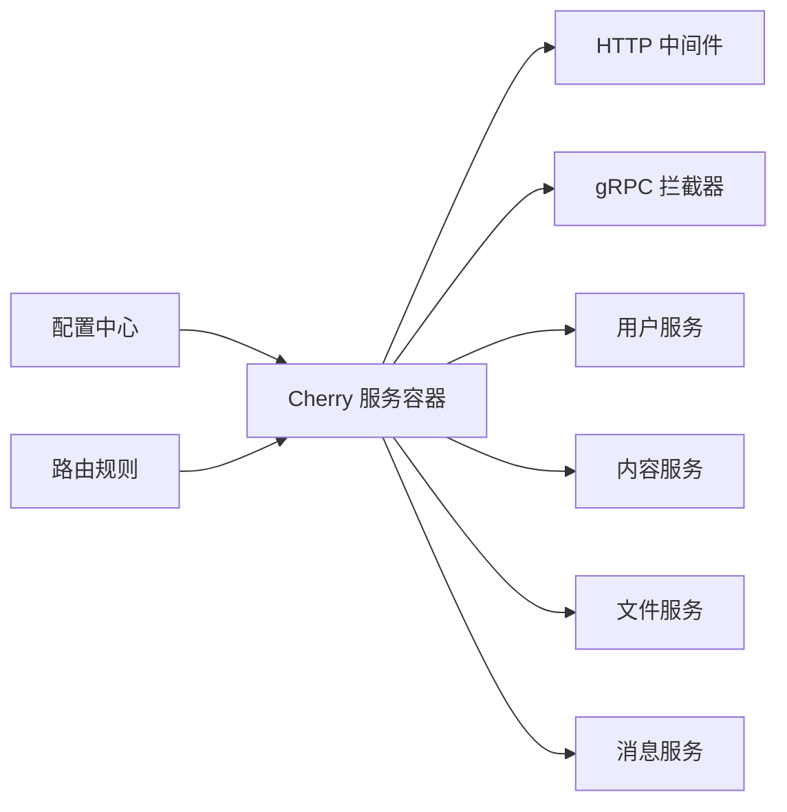

图表来源
- [thirdparty/cherry/options.go:19-86](file://thirdparty/cherry/options.go#L19-L86)
- [server/go/main.go:55-67](file://server/go/main.go#L55-L67)
- [server/go/config/config.toml:1-41](file://server/go/config/config.toml#L1-L41)
- [server/go/route.yaml:1-48](file://server/go/route.yaml#L1-L48)

章节来源
- [thirdparty/cherry/options.go:19-86](file://thirdparty/cherry/options.go#L19-L86)
- [server/go/main.go:55-67](file://server/go/main.go#L55-L67)
- [server/go/config/config.toml:1-41](file://server/go/config/config.toml#L1-L41)
- [server/go/route.yaml:1-48](file://server/go/route.yaml#L1-L48)

## 性能考虑
- 连接与协议
  - 启用HTTP/2与HTTP/3，减少连接开销与提高并发性能。
  - gRPC使用OpenTelemetry统计与追踪，便于定位性能瓶颈。
- 中间件与拦截器
  - 将日志、校验、限流等逻辑前置，避免在业务处理中重复实现。
- 缓存与限流
  - 内容服务使用Redis DAO承载热点数据与限流策略，降低数据库压力。
- 上传与媒体处理
  - 文件服务支持多种上传策略与RFV处理，建议结合CDN与对象存储优化吞吐。
- 配置优化
  - 根据环境调整运行模式与资源限制，生产环境建议开启Release模式与合理的超时配置。

## 故障排查指南
- 常见问题定位
  - gRPC参数校验失败：检查请求体与字段约束，确认拦截器返回InvalidArgument。
  - panic异常：拦截器会捕获panic并返回Internal错误，查看日志定位根因。
  - OpenTelemetry未生效：确认资源属性与OTLP端点配置正确。
- 日志与追踪
  - Cherry容器在中间件与拦截器中统一注入TraceId，便于端到端追踪。
  - 建议在业务关键路径增加结构化日志，配合日志聚合系统进行分析。
- 配置与路由
  - 若出现路由不生效或端口异常，检查Kubernetes Service与Apisix路由配置。
  - 确认环境变量与配置中心连接正常，必要时启用本地配置作为降级方案。

章节来源
- [thirdparty/cherry/handler_grpc.go:64-107](file://thirdparty/cherry/handler_grpc.go#L64-L107)
- [thirdparty/cherry/handler_grpc.go:109-164](file://thirdparty/cherry/handler_grpc.go#L109-L164)
- [server/go/route.yaml:1-48](file://server/go/route.yaml#L1-L48)

## 结论
Hoper后端基于Cherry框架实现了统一的服务容器与中间件体系，结合配置中心与Kubernetes/网关路由，形成了高可用、可观测、易扩展的微服务体系。通过gRPC与HTTP双栈接口、参数校验与拦截器链、Redis缓存与限流策略，有效支撑了用户、内容、文件、消息等核心业务。建议在生产环境中进一步完善服务注册发现、熔断降级与容量规划，并持续优化日志与监控体系以提升运维效率。

## 附录
- 最佳实践清单
  - 服务注册与发现：使用Kubernetes Service与DNS，结合Apisix路由实现灰度与蓝绿发布。
  - 负载均衡：在K8s与网关层面配置轮询或最少连接策略，结合健康检查。
  - 熔断降级：在Cherry拦截器中加入超时与熔断策略，对下游依赖进行保护。
  - 监控与告警：启用OpenTelemetry导出至集中式APM，建立关键指标阈值与告警。
  - 日志：统一结构化日志格式，保留TraceId与SpanId，便于关联分析。
  - 性能：定期评估HTTP/2与HTTP/3效果，结合压测报告优化线程池与连接池参数。