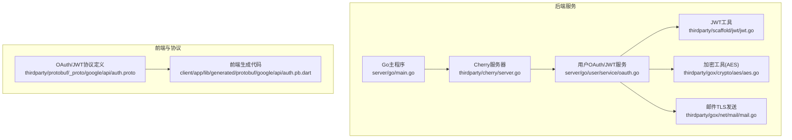
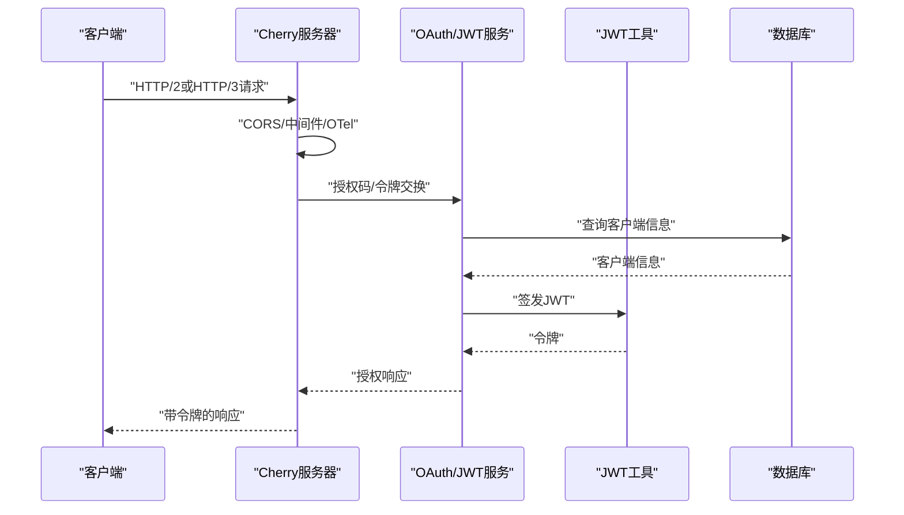
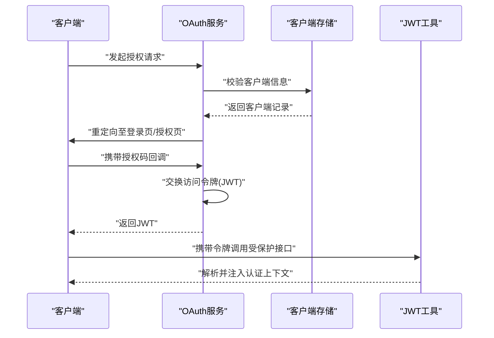
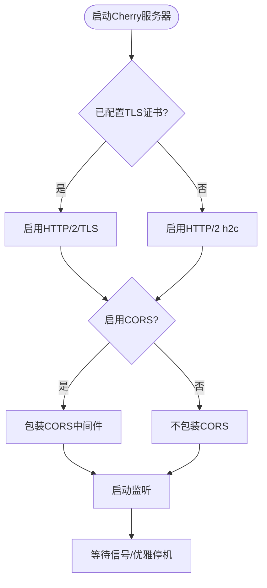
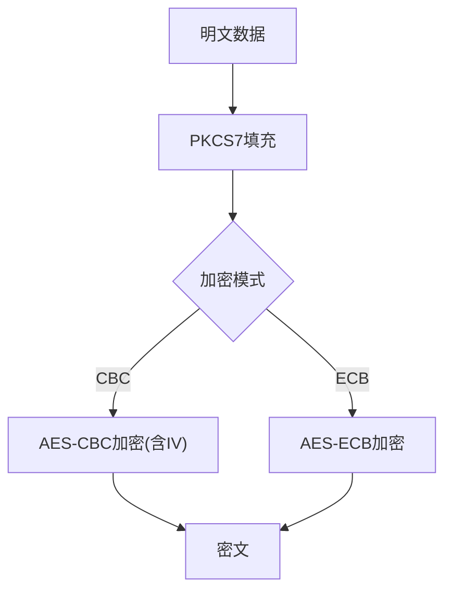
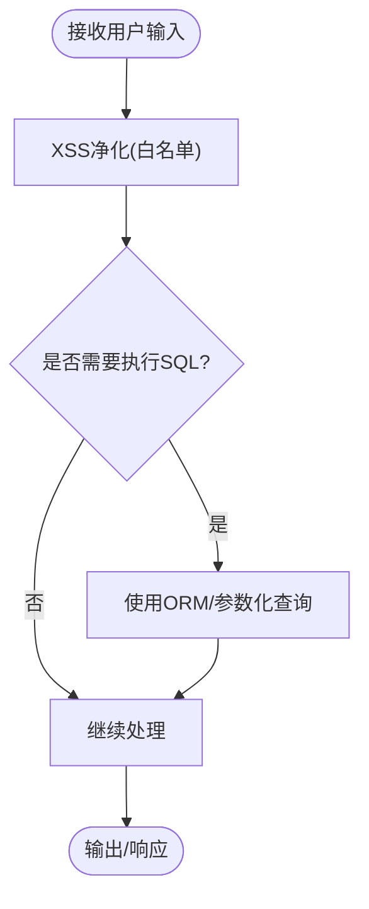
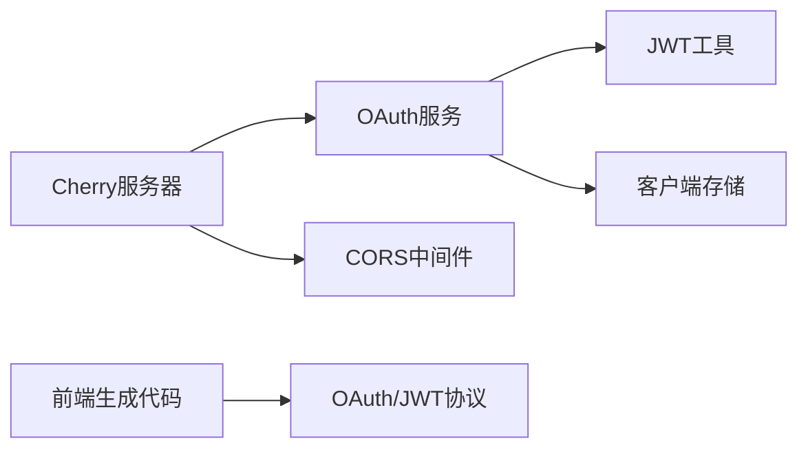

# 安全隐私

<cite>
**本文档引用的文件**
- [server/go/user/service/oauth.go](file://server/go/user/service/oauth.go)
- [thirdparty/scaffold/jwt/jwt.go](file://thirdparty/scaffold/jwt/jwt.go)
- [thirdparty/cherry/server.go](file://thirdparty/cherry/server.go)
- [thirdparty/gox/crypto/aes/aes.go](file://thirdparty/gox/crypto/aes/aes.go)
- [thirdparty/scaffold/voidxss/init.go](file://thirdparty/scaffold/voidxss/init.go)
- [thirdparty/gox/net/mail/mail.go](file://thirdparty/gox/net/mail/mail.go)
- [server/go/main.go](file://server/go/main.go)
- [server/go/config/config.toml](file://server/go/config/config.toml)
- [thirdparty/protobuf/_proto/google/api/auth.proto](file://thirdparty/protobuf/_proto/google/api/auth.proto)
- [client/app/lib/generated/protobuf/google/api/auth.pb.dart](file://client/app/lib/generated/protobuf/google/api/auth.pb.dart)
- [thirdparty/protobuf/_proto/google/api/logging.proto](file://thirdparty/protobuf/_proto/google/api/logging.proto)
- [client/app/lib/generated/protobuf/google/api/logging.pb.dart](file://client/app/lib/generated/protobuf/google/api/logging.pb.dart)
- [thirdparty/protobuf/_proto/google/api/monitoring.proto](file://thirdparty/protobuf/_proto/google/api/monitoring.proto)
- [client/app/lib/generated/protobuf/google/api/monitoring.pb.dart](file://client/app/lib/generated/protobuf/google/api/monitoring.pb.dart)
</cite>

## 目录
1. [简介](#简介)
2. [项目结构](#项目结构)
3. [核心组件](#核心组件)
4. [架构总览](#架构总览)
5. [详细组件分析](#详细组件分析)
6. [依赖分析](#依赖分析)
7. [性能考虑](#性能考虑)
8. [故障排查指南](#故障排查指南)
9. [结论](#结论)
10. [附录](#附录)

## 简介
本文件面向Hoper安全隐私主题，聚焦于认证授权（JWT、OAuth）、权限控制、数据加密与传输安全、存储安全、输入校验与防护（SQL注入、XSS、CSRF）、敏感数据处理与隐私合规、安全审计与监控、以及安全事件响应与应急处置。文档基于仓库现有实现进行梳理与建议，帮助开发者与运维人员建立统一的安全实践。

## 项目结构
围绕安全主题的关键模块分布如下：
- 认证授权与权限控制：Go服务端用户模块的OAuth与JWT实现，配合中间件与元数据传递
- 传输安全：HTTP/2、HTTP/3、TLS配置与CORS策略
- 数据加密与存储：对称加密工具与数据库连接池配置
- 输入与输出安全：XSS净化策略与邮件发送的TLS通道
- 配置与可观测性：OpenTelemetry、日志与监控配置

**图表来源**
- [server/go/main.go:28-68](file://server/go/main.go#L28-L68)
- [thirdparty/cherry/server.go:40-200](file://thirdparty/cherry/server.go#L40-L200)
- [server/go/user/service/oauth.go:30-145](file://server/go/user/service/oauth.go#L30-L145)
- [thirdparty/scaffold/jwt/jwt.go:41-54](file://thirdparty/scaffold/jwt/jwt.go#L41-L54)
- [thirdparty/gox/crypto/aes/aes.go:15-46](file://thirdparty/gox/crypto/aes/aes.go#L15-L46)
- [thirdparty/gox/net/mail/mail.go:97-104](file://thirdparty/gox/net/mail/mail.go#L97-L104)
- [thirdparty/protobuf/_proto/google/api/auth.proto:104-237](file://thirdparty/protobuf/_proto/google/api/auth.proto#L104-L237)
- [client/app/lib/generated/protobuf/google/api/auth.pb.dart:573-602](file://client/app/lib/generated/protobuf/google/api/auth.pb.dart#L573-L602)

**章节来源**
- [server/go/main.go:28-68](file://server/go/main.go#L28-L68)
- [thirdparty/cherry/server.go:40-200](file://thirdparty/cherry/server.go#L40-L200)

## 核心组件
- OAuth与JWT服务：负责授权码流程、访问令牌签发与校验、客户端存储
- JWT工具：从gRPC元数据提取并解析JWT，注入认证上下文
- Cherry服务器：统一HTTP/2/HTTP/3、TLS、CORS、中间件与优雅停机
- 加密工具：提供AES-CBC/ECB加解密与PKCS7填充
- XSS净化：基于bluemonday的UGC白名单策略
- 邮件TLS：SMTP over TLS发送邮件
- 协议与前端：OAuth/JWT协议定义与前端生成代码

**章节来源**
- [server/go/user/service/oauth.go:30-145](file://server/go/user/service/oauth.go#L30-L145)
- [thirdparty/scaffold/jwt/jwt.go:41-54](file://thirdparty/scaffold/jwt/jwt.go#L41-L54)
- [thirdparty/cherry/server.go:40-200](file://thirdparty/cherry/server.go#L40-L200)
- [thirdparty/gox/crypto/aes/aes.go:15-46](file://thirdparty/gox/crypto/aes/aes.go#L15-L46)
- [thirdparty/scaffold/voidxss/init.go:11-49](file://thirdparty/scaffold/voidxss/init.go#L11-L49)
- [thirdparty/gox/net/mail/mail.go:97-104](file://thirdparty/gox/net/mail/mail.go#L97-L104)
- [thirdparty/protobuf/_proto/google/api/auth.proto:104-237](file://thirdparty/protobuf/_proto/google/api/auth.proto#L104-L237)

## 架构总览
下图展示从客户端到后端服务的典型请求路径，涵盖认证授权、传输安全与中间件处理。

**图表来源**
- [thirdparty/cherry/server.go:87-108](file://thirdparty/cherry/server.go#L87-L108)
- [server/go/user/service/oauth.go:103-144](file://server/go/user/service/oauth.go#L103-L144)
- [thirdparty/scaffold/jwt/jwt.go:41-54](file://thirdparty/scaffold/jwt/jwt.go#L41-L54)

## 详细组件分析

### 认证授权机制（JWT、OAuth、权限控制）
- 授权流程
  - 使用OAuth2授权码模式，服务端初始化管理器与内存令牌存储，采用HS512签名生成JWT访问令牌
  - 用户授权回调与令牌发放由OAuth服务器处理，支持自定义错误处理器
- 权限控制
  - 通过UserAuthorizationHandler解析访问令牌，提取用户标识；结合业务角色/权限模型进行细粒度授权
  - JWT工具从gRPC元数据中读取令牌并解析，将认证信息注入上下文供后续处理
- 协议与前端
  - 协议定义了JWT位置、颁发者、受众等参数，前端生成代码对应这些字段，确保前后端一致

**图表来源**
- [server/go/user/service/oauth.go:30-70](file://server/go/user/service/oauth.go#L30-L70)
- [server/go/user/service/oauth.go:103-144](file://server/go/user/service/oauth.go#L103-L144)
- [thirdparty/scaffold/jwt/jwt.go:41-54](file://thirdparty/scaffold/jwt/jwt.go#L41-L54)

**章节来源**
- [server/go/user/service/oauth.go:30-145](file://server/go/user/service/oauth.go#L30-L145)
- [thirdparty/scaffold/jwt/jwt.go:41-54](file://thirdparty/scaffold/jwt/jwt.go#L41-L54)
- [thirdparty/protobuf/_proto/google/api/auth.proto:104-237](file://thirdparty/protobuf/_proto/google/api/auth.proto#L104-L237)
- [client/app/lib/generated/protobuf/google/api/auth.pb.dart:573-602](file://client/app/lib/generated/protobuf/google/api/auth.pb.dart#L573-L602)

### 传输安全（TLS、HTTP/2、HTTP/3、CORS）
- TLS与证书
  - 支持加载证书与私钥，启用HTTP/2；HTTP/3可选启用并加载证书
- CORS
  - 可配置允许的源、方法与头；默认宽松策略，生产环境应收紧
- 中间件与优雅停机
  - 统一注册中间件，捕获信号实现优雅关闭

**图表来源**
- [thirdparty/cherry/server.go:133-159](file://thirdparty/cherry/server.go#L133-L159)
- [thirdparty/cherry/server.go:56-58](file://thirdparty/cherry/server.go#L56-L58)
- [thirdparty/cherry/server.go:182-191](file://thirdparty/cherry/server.go#L182-L191)

**章节来源**
- [thirdparty/cherry/server.go:133-159](file://thirdparty/cherry/server.go#L133-L159)
- [thirdparty/cherry/server.go:56-58](file://thirdparty/cherry/server.go#L56-L58)
- [thirdparty/cherry/server.go:182-191](file://thirdparty/cherry/server.go#L182-L191)

### 数据加密与存储安全
- 对称加密
  - 提供AES-CBC与AES-ECB加解密，PKCS7填充；CBC模式需正确提供IV
- 存储与连接
  - 数据库连接池参数可配置最大空闲/活跃连接数与生命周期，有助于资源与安全隔离

**图表来源**
- [thirdparty/gox/crypto/aes/aes.go:15-46](file://thirdparty/gox/crypto/aes/aes.go#L15-L46)

**章节来源**
- [thirdparty/gox/crypto/aes/aes.go:15-46](file://thirdparty/gox/crypto/aes/aes.go#L15-L46)
- [thirdparty/initialize/dao/gormdb/gorm.go:137-157](file://thirdparty/initialize/dao/gormdb/gorm.go#L137-L157)

### 输入校验与防护（SQL注入、XSS、CSRF）
- SQL注入防护
  - 使用ORM进行查询与迁移，避免原生SQL拼接；如需原生SQL，请使用参数化查询或ORM提供的安全接口
- XSS防护
  - 使用bluemonday的UGC策略，仅允许白名单元素与属性，并强制外部链接新窗口打开、添加nofollow
- CSRF防护
  - 当前未见显式的CSRF令牌实现；建议在表单与关键接口引入CSRF令牌与SameSite Cookie策略

**图表来源**
- [thirdparty/scaffold/voidxss/init.go:11-49](file://thirdparty/scaffold/voidxss/init.go#L11-L49)

**章节来源**
- [thirdparty/scaffold/voidxss/init.go:11-49](file://thirdparty/scaffold/voidxss/init.go#L11-L49)

### 敏感数据处理、隐私保护与合规
- 敏感数据
  - JWT密钥、数据库凭据、证书与私钥等应通过配置中心或环境变量注入，避免硬编码
- 隐私与合规
  - 日志与监控配置遵循最小化原则，避免记录敏感字段；审计日志应可追溯但不冗余
- 协议与前端
  - OAuth/JWT协议定义了令牌位置、受众等，前端生成代码与后端保持一致，确保跨端一致性

**章节来源**
- [server/go/config/config.toml:1-41](file://server/go/config/config.toml#L1-L41)
- [thirdparty/protobuf/_proto/google/api/logging.proto:25-81](file://thirdparty/protobuf/_proto/google/api/logging.proto#L25-L81)
- [client/app/lib/generated/protobuf/google/api/logging.pb.dart:90-130](file://client/app/lib/generated/protobuf/google/api/logging.pb.dart#L90-L130)
- [thirdparty/protobuf/_proto/google/api/monitoring.proto:25-107](file://thirdparty/protobuf/_proto/google/api/monitoring.proto#L25-L107)
- [client/app/lib/generated/protobuf/google/api/monitoring.pb.dart:92-155](file://client/app/lib/generated/protobuf/google/api/monitoring.pb.dart#L92-L155)

### 安全审计、漏洞扫描与监控
- 安全审计
  - 通过OpenTelemetry采集指标与追踪，结合日志与监控配置，形成闭环审计
- 漏洞扫描
  - 建议定期扫描依赖与配置，关注TLS版本、密码学强度与CORS策略
- 监控
  - 生产环境启用严格CORS与TLS，限制允许源与方法；结合Prometheus与日志聚合进行告警

**章节来源**
- [server/go/main.go:48-54](file://server/go/main.go#L48-L54)
- [thirdparty/cherry/server.go:66-85](file://thirdparty/cherry/server.go#L66-L85)
- [thirdparty/protobuf/_proto/google/api/logging.proto:25-81](file://thirdparty/protobuf/_proto/google/api/logging.proto#L25-L81)
- [thirdparty/protobuf/_proto/google/api/monitoring.proto:25-107](file://thirdparty/protobuf/_proto/google/api/monitoring.proto#L25-L107)

### 安全事件响应与应急处理
- 应急流程
  - 发现异常立即隔离受影响实例，回滚最近变更，检查TLS证书与密钥有效性，审查日志与追踪
- 通知与恢复
  - 通过钉钉/企业微信等渠道通知相关团队；修复后验证授权流程、加密与传输层安全

**章节来源**
- [thirdparty/cherry/server.go:182-191](file://thirdparty/cherry/server.go#L182-L191)

## 依赖分析
- 组件耦合
  - OAuth服务依赖JWT工具与客户端存储；Cherry服务器统一路由与中间件；前端生成代码与协议强绑定
- 外部依赖
  - OAuth2库、JWT库、TLS、CORS、OTel等

**图表来源**
- [server/go/user/service/oauth.go:30-70](file://server/go/user/service/oauth.go#L30-L70)
- [thirdparty/scaffold/jwt/jwt.go:41-54](file://thirdparty/scaffold/jwt/jwt.go#L41-L54)
- [thirdparty/cherry/server.go:56-58](file://thirdparty/cherry/server.go#L56-L58)
- [thirdparty/protobuf/_proto/google/api/auth.proto:104-237](file://thirdparty/protobuf/_proto/google/api/auth.proto#L104-L237)

**章节来源**
- [server/go/user/service/oauth.go:30-70](file://server/go/user/service/oauth.go#L30-L70)
- [thirdparty/scaffold/jwt/jwt.go:41-54](file://thirdparty/scaffold/jwt/jwt.go#L41-L54)
- [thirdparty/cherry/server.go:56-58](file://thirdparty/cherry/server.go#L56-L58)
- [thirdparty/protobuf/_proto/google/api/auth.proto:104-237](file://thirdparty/protobuf/_proto/google/api/auth.proto#L104-L237)

## 性能考虑
- 连接池与超时
  - 合理设置数据库连接池大小与生命周期，避免资源耗尽
- 传输层
  - 启用HTTP/2/HTTP/3与TLS可提升性能；注意TLS握手成本与证书链长度
- 中间件
  - 控制中间件数量与顺序，避免重复解析与转换

**章节来源**
- [thirdparty/initialize/dao/gormdb/gorm.go:137-157](file://thirdparty/initialize/dao/gormdb/gorm.go#L137-L157)
- [thirdparty/cherry/server.go:117-142](file://thirdparty/cherry/server.go#L117-L142)

## 故障排查指南
- OAuth/JWT问题
  - 检查令牌签名算法与密钥一致性；确认UserAuthorizationHandler解析逻辑与客户端存储
- 传输安全问题
  - 确认TLS证书与私钥路径；核对CORS配置与浏览器控制台错误
- 加密问题
  - 校验IV长度与填充方式；区分CBC与ECB模式适用场景
- XSS问题
  - 确认bluemonday策略是否覆盖所需元素与属性
- 邮件发送问题
  - 校验SMTP地址与TLS握手；确认认证扩展可用

**章节来源**
- [server/go/user/service/oauth.go:49-67](file://server/go/user/service/oauth.go#L49-L67)
- [thirdparty/cherry/server.go:133-159](file://thirdparty/cherry/server.go#L133-L159)
- [thirdparty/gox/crypto/aes/aes.go:15-46](file://thirdparty/gox/crypto/aes/aes.go#L15-L46)
- [thirdparty/scaffold/voidxss/init.go:11-49](file://thirdparty/scaffold/voidxss/init.go#L11-L49)
- [thirdparty/gox/net/mail/mail.go:97-104](file://thirdparty/gox/net/mail/mail.go#L97-L104)

## 结论
本项目在认证授权、传输安全与输入输出安全方面具备基础能力，建议在生产环境中进一步强化：
- 强化CSRF防护与CORS策略
- 将敏感配置与密钥集中管理
- 完善日志与监控的隐私合规
- 建立自动化漏洞扫描与应急响应流程

## 附录
- 配置示例与最佳实践
  - 开发/测试/生产环境分离；TLS证书与私钥路径明确；CORS白名单最小化
- 协议与前端一致性
  - 前后端均使用协议定义的JWT位置与受众字段，确保跨端一致

**章节来源**
- [server/go/config/config.toml:1-41](file://server/go/config/config.toml#L1-L41)
- [thirdparty/protobuf/_proto/google/api/auth.proto:104-237](file://thirdparty/protobuf/_proto/google/api/auth.proto#L104-L237)
- [client/app/lib/generated/protobuf/google/api/auth.pb.dart:573-602](file://client/app/lib/generated/protobuf/google/api/auth.pb.dart#L573-L602)