# IDE开发环境配置

<cite>
**本文引用的文件**
- [awesome/devenv/devtool/vscode.md](file://awesome/devenv/devtool/vscode.md)
- [awesome/devenv/devtool/idea.md](file://awesome/devenv/devtool/idea.md)
- [awesome/devenv/devtool/ide.md](file://awesome/devenv/devtool/ide.md)
- [awesome/devenv/devenv.md](file://awesome/devenv/devenv.md)
- [awesome/devenv/devtool/zsh.md](file://awesome/devenv/devtool/zsh.md)
- [awesome/devenv/devtool/vim.md](file://awesome/devenv/devtool/vim.md)
- [awesome/lang/go/config.toml](file://awesome/lang/go/config.toml)
- [awesome/lang/go/config.dev.toml](file://awesome/lang/go/config.dev.toml)
- [client/app/pubspec.yaml](file://client/app/pubspec.yaml)
- [client/uniapp/package.json](file://client/uniapp/package.json)
- [client/web/package.json](file://client/web/package.json)
- [awesome/lang/ts/package.json](file://awesome/lang/ts/package.json)
- [awesome/lang/node.md](file://awesome/lang/node.md)
- [awesome/lang/python.md](file://awesome/lang/python.md)
</cite>

## 目录
1. [简介](#简介)
2. [项目结构](#项目结构)
3. [核心组件](#核心组件)
4. [架构总览](#架构总览)
5. [详细组件分析](#详细组件分析)
6. [依赖分析](#依赖分析)
7. [性能考虑](#性能考虑)
8. [故障排除指南](#故障排除指南)
9. [结论](#结论)
10. [附录](#附录)

## 简介
本指南面向IDE开发环境配置，覆盖VS Code、IntelliJ IDEA等主流开发工具的安装、插件推荐、代码格式化、调试配置、快捷键设置等。同时提供针对Go、Dart/Flutter、TypeScript/Vue3、UniApp等语言与框架的特定配置要点，涵盖代码质量工具集成、Git集成配置与团队协作设置，并给出开发环境快速搭建脚本与常见问题排查建议。

## 项目结构
本仓库包含IDE与开发环境配置、语言与工具链配置、客户端应用与服务端工程等多类内容。与IDE配置直接相关的核心位置如下：
- 开发环境与IDE工具：awesome/devenv/devtool 下的 VS Code、IDEA、zsh、vim 等配置说明
- 通用开发环境：awesome/devenv/devenv.md 提供Go、Rust、SSH、Gradle/Maven、Helm等工具链安装与配置要点
- Go配置模板：awesome/lang/go 下的 config.toml、config.dev.toml
- Dart/Flutter工程：client/app/pubspec.yaml
- TypeScript/Vue3工程：client/web/package.json、awesome/lang/ts/package.json
- UniApp工程：client/uniapp/package.json
- Node与Python工具链：awesome/lang/node.md、awesome/lang/python.md

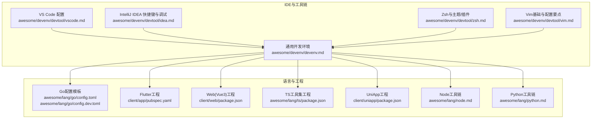

图表来源
- [awesome/devenv/devtool/vscode.md:1-30](file://awesome/devenv/devtool/vscode.md#L1-L30)
- [awesome/devenv/devtool/idea.md:1-135](file://awesome/devenv/devtool/idea.md#L1-L135)
- [awesome/devenv/devtool/zsh.md:1-99](file://awesome/devenv/devtool/zsh.md#L1-L99)
- [awesome/devenv/devtool/vim.md:1-198](file://awesome/devenv/devtool/vim.md#L1-L198)
- [awesome/devenv/devenv.md:1-100](file://awesome/devenv/devenv.md#L1-L100)
- [awesome/lang/go/config.toml:1-11](file://awesome/lang/go/config.toml#L1-L11)
- [awesome/lang/go/config.dev.toml:1-45](file://awesome/lang/go/config.dev.toml#L1-L45)
- [client/app/pubspec.yaml:1-182](file://client/app/pubspec.yaml#L1-L182)
- [client/web/package.json:1-95](file://client/web/package.json#L1-L95)
- [awesome/lang/ts/package.json:1-40](file://awesome/lang/ts/package.json#L1-L40)
- [client/uniapp/package.json:1-174](file://client/uniapp/package.json#L1-L174)
- [awesome/lang/node.md:1-20](file://awesome/lang/node.md#L1-L20)
- [awesome/lang/python.md:1-26](file://awesome/lang/python.md#L1-L26)

章节来源
- [awesome/devenv/devtool/vscode.md:1-30](file://awesome/devenv/devtool/vscode.md#L1-L30)
- [awesome/devenv/devtool/idea.md:1-135](file://awesome/devenv/devtool/idea.md#L1-L135)
- [awesome/devenv/devtool/zsh.md:1-99](file://awesome/devenv/devtool/zsh.md#L1-L99)
- [awesome/devenv/devtool/vim.md:1-198](file://awesome/devenv/devtool/vim.md#L1-L198)
- [awesome/devenv/devenv.md:1-100](file://awesome/devenv/devenv.md#L1-L100)

## 核心组件
- VS Code远程开发与Server配置：支持通过Remote-SSH在远端容器或服务器上开发，包含Dockerfile与code-server启动方式
- IntelliJ IDEA快捷键与调试：覆盖常用编辑、重构、查找、断点与运行流程
- 通用开发环境：Go、Rust、SSH、Gradle/Maven、Helm等工具链安装与配置
- Go配置模板：dev/test/prod环境、日志与数据库连接参数示例
- Dart/Flutter工程：依赖管理、构建与发布配置
- TypeScript/Vue3工程：Vite、ESLint、Stylelint、Prettier、单元测试等
- UniApp工程：多端构建脚本、依赖与类型检查
- Node与Python工具链：nvm、pnpm、pdm、uv等工具链配置与缓存路径

章节来源
- [awesome/devenv/devtool/vscode.md:1-30](file://awesome/devenv/devtool/vscode.md#L1-L30)
- [awesome/devenv/devtool/idea.md:83-135](file://awesome/devenv/devtool/idea.md#L83-L135)
- [awesome/devenv/devenv.md:6-67](file://awesome/devenv/devenv.md#L6-L67)
- [awesome/lang/go/config.toml:1-11](file://awesome/lang/go/config.toml#L1-L11)
- [awesome/lang/go/config.dev.toml:1-45](file://awesome/lang/go/config.dev.toml#L1-L45)
- [client/app/pubspec.yaml:1-182](file://client/app/pubspec.yaml#L1-L182)
- [client/web/package.json:1-95](file://client/web/package.json#L1-L95)
- [awesome/lang/ts/package.json:1-40](file://awesome/lang/ts/package.json#L1-L40)
- [client/uniapp/package.json:1-174](file://client/uniapp/package.json#L1-L174)
- [awesome/lang/node.md:1-20](file://awesome/lang/node.md#L1-L20)
- [awesome/lang/python.md:1-26](file://awesome/lang/python.md#L1-L26)

## 架构总览
下图展示IDE配置与各语言工程之间的关系，以及通用开发环境工具链的支撑作用。

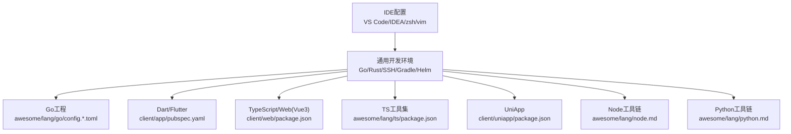

图表来源
- [awesome/devenv/devtool/vscode.md:1-30](file://awesome/devenv/devtool/vscode.md#L1-L30)
- [awesome/devenv/devtool/idea.md:1-135](file://awesome/devenv/devtool/idea.md#L1-L135)
- [awesome/devenv/devtool/zsh.md:1-99](file://awesome/devenv/devtool/zsh.md#L1-L99)
- [awesome/devenv/devtool/vim.md:1-198](file://awesome/devenv/devtool/vim.md#L1-L198)
- [awesome/devenv/devenv.md:1-100](file://awesome/devenv/devenv.md#L1-L100)
- [awesome/lang/go/config.toml:1-11](file://awesome/lang/go/config.toml#L1-L11)
- [awesome/lang/go/config.dev.toml:1-45](file://awesome/lang/go/config.dev.toml#L1-L45)
- [client/app/pubspec.yaml:1-182](file://client/app/pubspec.yaml#L1-L182)
- [client/web/package.json:1-95](file://client/web/package.json#L1-L95)
- [awesome/lang/ts/package.json:1-40](file://awesome/lang/ts/package.json#L1-L40)
- [client/uniapp/package.json:1-174](file://client/uniapp/package.json#L1-L174)
- [awesome/lang/node.md:1-20](file://awesome/lang/node.md#L1-L20)
- [awesome/lang/python.md:1-26](file://awesome/lang/python.md#L1-L26)

## 详细组件分析

### VS Code 远程开发与Server配置
- Remote-SSH连接与主机别名配置
- 远端Docker容器部署code-server并对外提供服务
- 适用于Linux服务器或容器环境的远程开发工作流

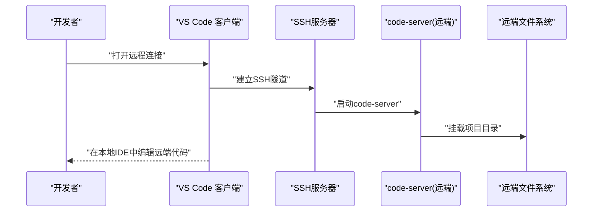

图表来源
- [awesome/devenv/devtool/vscode.md:1-30](file://awesome/devenv/devtool/vscode.md#L1-L30)

章节来源
- [awesome/devenv/devtool/vscode.md:1-30](file://awesome/devenv/devtool/vscode.md#L1-L30)

### IntelliJ IDEA 快捷键与调试
- 编辑与重构：语句完成、否定完成、导入包、格式化、优化导入、重构重命名等
- 查找与替换：全局/路径查找、高亮用法、替换结构
- 调试与运行：断点、步过/步入、强制运行、运行至光标处、编译与运行
- 视图与布局：隐藏/恢复窗口、切换代码视图、项目面板、默认布局

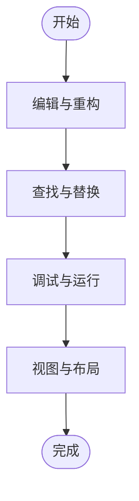

图表来源
- [awesome/devenv/devtool/idea.md:1-135](file://awesome/devenv/devtool/idea.md#L1-L135)

章节来源
- [awesome/devenv/devtool/idea.md:1-135](file://awesome/devenv/devtool/idea.md#L1-L135)

### 通用开发环境工具链
- Go：下载、安装、GOPROXY、GOPRIVATE、protoc等
- Rust：rustup安装与工具链管理
- SSH：Windows能力、连接参数、端口转发、保持连接
- Gradle/Maven：阿里云镜像源配置
- Helm：安装与仓库添加
- Linux：环境变量、历史控制、网络工具、FTP服务

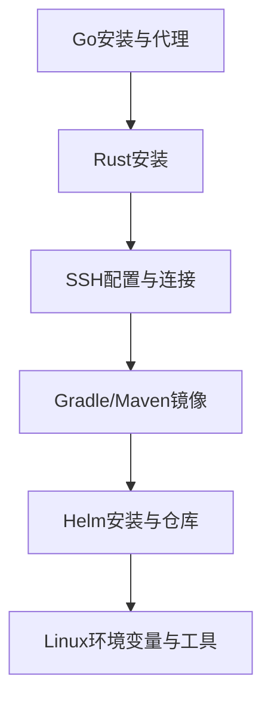

图表来源
- [awesome/devenv/devenv.md:6-67](file://awesome/devenv/devenv.md#L6-L67)

章节来源
- [awesome/devenv/devenv.md:1-100](file://awesome/devenv/devenv.md#L1-L100)

### Go 配置模板
- 环境：dev/test/prod
- 日志与数据库连接参数示例（含慢查询阈值、命名策略等）

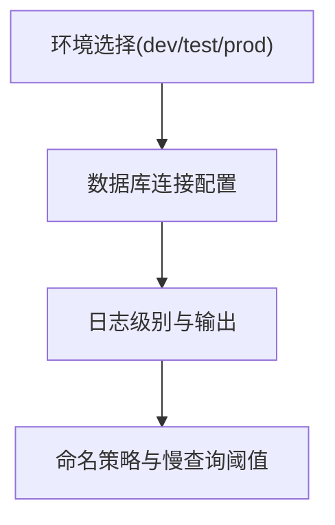

图表来源
- [awesome/lang/go/config.toml:1-11](file://awesome/lang/go/config.toml#L1-L11)
- [awesome/lang/go/config.dev.toml:1-45](file://awesome/lang/go/config.dev.toml#L1-L45)

章节来源
- [awesome/lang/go/config.toml:1-11](file://awesome/lang/go/config.toml#L1-L11)
- [awesome/lang/go/config.dev.toml:1-45](file://awesome/lang/go/config.dev.toml#L1-L45)

### Dart/Flutter 工程配置
- SDK版本约束与依赖管理
- 构建与发布配置、图标与启动页、国际化资源

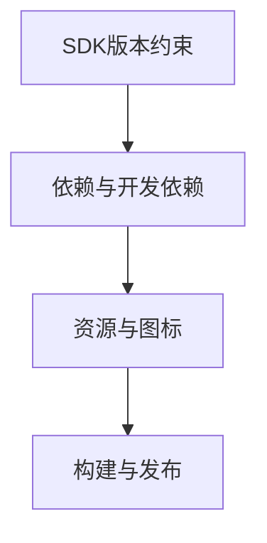

图表来源
- [client/app/pubspec.yaml:20-182](file://client/app/pubspec.yaml#L20-L182)

章节来源
- [client/app/pubspec.yaml:1-182](file://client/app/pubspec.yaml#L1-L182)

### TypeScript/Vue3 工程配置
- Vite开发与构建、ESLint、Stylelint、Prettier、单元测试
- 依赖与开发依赖、类型检查、打包与可视化

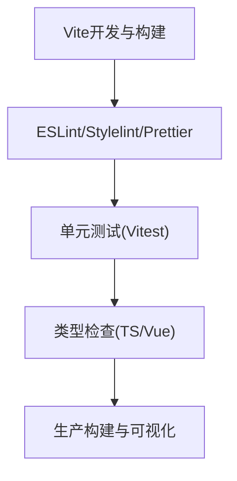

图表来源
- [client/web/package.json:12-95](file://client/web/package.json#L12-L95)

章节来源
- [client/web/package.json:1-95](file://client/web/package.json#L1-L95)

### UniApp 工程配置
- 多端开发与构建脚本（H5、小程序、App等）
- 依赖与开发依赖、类型检查、链接第三方包

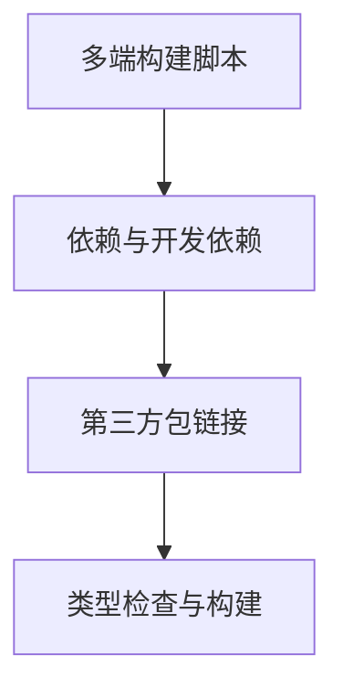

图表来源
- [client/uniapp/package.json:18-174](file://client/uniapp/package.json#L18-L174)

章节来源
- [client/uniapp/package.json:1-174](file://client/uniapp/package.json#L1-L174)

### TS工具集工程
- NAPI绑定、WASM配置、OpenCV JS等依赖
- 文档站点与构建脚本

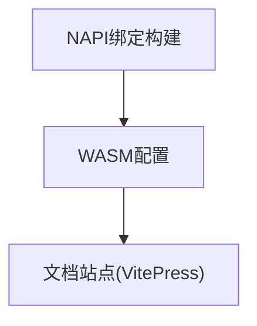

图表来源
- [awesome/lang/ts/package.json:21-40](file://awesome/lang/ts/package.json#L21-L40)

章节来源
- [awesome/lang/ts/package.json:1-40](file://awesome/lang/ts/package.json#L1-L40)

### Node工具链配置
- nvm安装与版本管理
- pnpm启用与镜像源、全局目录与缓存目录配置

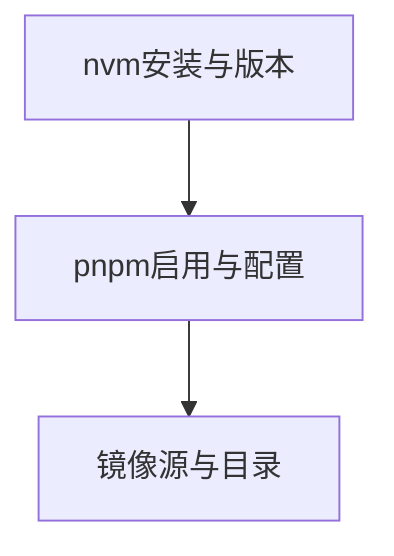

图表来源
- [awesome/lang/node.md:1-20](file://awesome/lang/node.md#L1-L20)

章节来源
- [awesome/lang/node.md:1-20](file://awesome/lang/node.md#L1-L20)

### Python工具链配置
- pdm安装与全局项目、缓存、日志、Python安装根目录、虚拟环境位置
- uv同步依赖

图表来源
- [awesome/lang/python.md:1-26](file://awesome/lang/python.md#L1-L26)

章节来源
- [awesome/lang/python.md:1-26](file://awesome/lang/python.md#L1-L26)

## 依赖分析
- VS Code与IDEA分别面向不同平台与语言生态，VS Code侧重远程开发与跨语言工作流，IDEA侧重Java/Android与强类型语言的深度集成
- Go与Rust工具链为后端与系统编程提供基础，Node与Python工具链服务于前端与数据科学场景
- Dart/Flutter与TypeScript/Vue3/UniApp构成移动端与Web端的完整前端栈

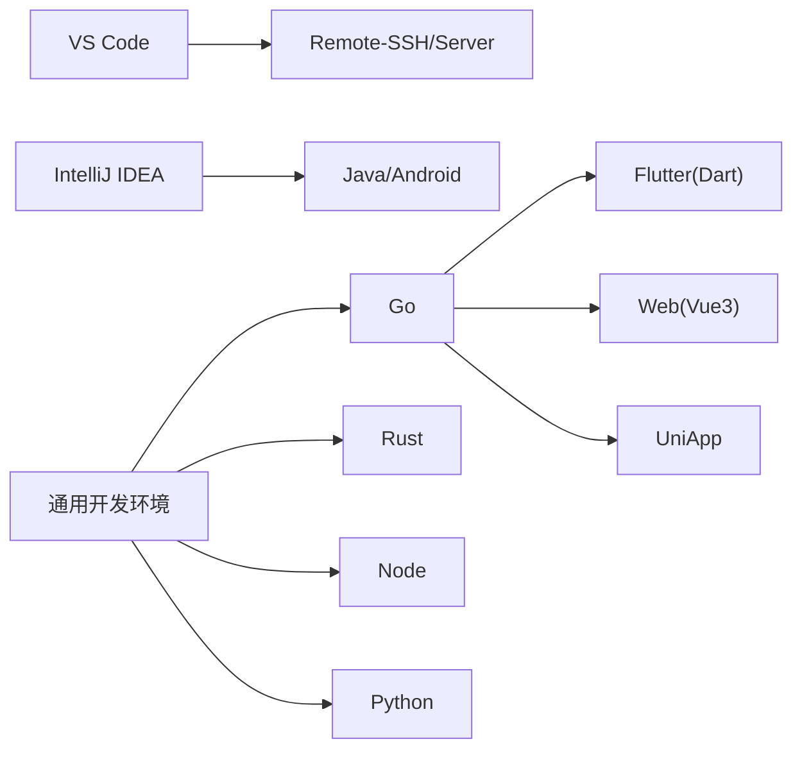

图表来源
- [awesome/devenv/devtool/vscode.md:1-30](file://awesome/devenv/devtool/vscode.md#L1-L30)
- [awesome/devenv/devtool/idea.md:1-135](file://awesome/devenv/devtool/idea.md#L1-L135)
- [awesome/devenv/devenv.md:1-100](file://awesome/devenv/devenv.md#L1-L100)
- [client/app/pubspec.yaml:1-182](file://client/app/pubspec.yaml#L1-L182)
- [client/web/package.json:1-95](file://client/web/package.json#L1-L95)
- [client/uniapp/package.json:1-174](file://client/uniapp/package.json#L1-L174)
- [awesome/lang/node.md:1-20](file://awesome/lang/node.md#L1-L20)
- [awesome/lang/python.md:1-26](file://awesome/lang/python.md#L1-L26)

## 性能考虑
- 远程开发时优先使用SSD与稳定网络，减少传输开销
- 合理配置IDE缓存与索引目录，避免频繁重建
- 前端工程启用增量构建与按需加载，减少冷启动时间
- 使用pnpm等高效包管理器，结合缓存目录与镜像源提升安装速度
- Go与Rust工程启用并行编译与增量构建，减少等待时间

## 故障排除指南
- SSH密钥权限问题：私钥文件权限需严格控制，避免被系统忽略
- VS Code远程SSH无法保存密码：建议使用IdentityFile与SSH Agent转发
- Windows SSH客户端：确保已启用OpenSSH客户端能力
- Linux vsftpd配置：正确设置本地根目录、允许可写、chroot与pam服务名
- zsh数字键失效：根据终端类型映射键位，修复数字小键盘行为
- Vim模式切换：命令模式、插入模式、底线命令模式的按键与用途

章节来源
- [awesome/devenv/devtool/ide.md:33-46](file://awesome/devenv/devtool/ide.md#L33-L46)
- [awesome/devenv/devtool/vscode.md:33-37](file://awesome/devenv/devtool/vscode.md#L33-L37)
- [awesome/devenv/devenv.md:24-32](file://awesome/devenv/devenv.md#L24-L32)
- [awesome/devenv/devenv.md:73-100](file://awesome/devenv/devenv.md#L73-L100)
- [awesome/devenv/devtool/zsh.md:78-99](file://awesome/devenv/devtool/zsh.md#L78-L99)
- [awesome/devenv/devtool/vim.md:1-198](file://awesome/devenv/devtool/vim.md#L1-L198)

## 结论
通过本指南，您可以基于VS Code与IntelliJ IDEA快速搭建跨语言开发环境，结合Go、Dart/Flutter、TypeScript/Vue3、UniApp等工程的配置要点，配合Node与Python工具链，形成从本地到远端、从后端到前端的完整开发流水线。建议在团队内统一IDE快捷键、代码格式化与调试流程，以提升协作效率与代码质量。

## 附录
- 快速搭建脚本与命令参考请参阅各工具链文档与工程配置文件
- 团队协作建议：统一Git提交规范、代码审查流程与CI/CD集成