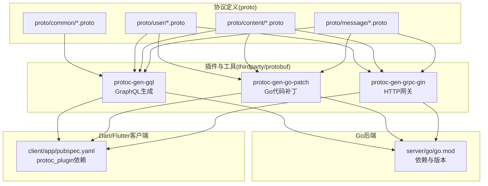
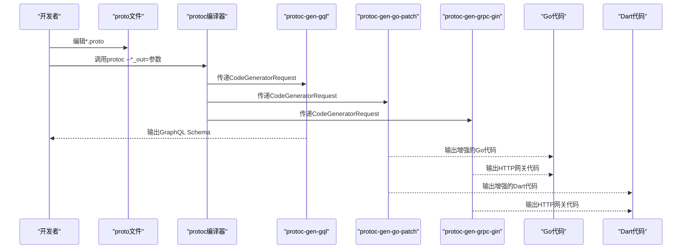
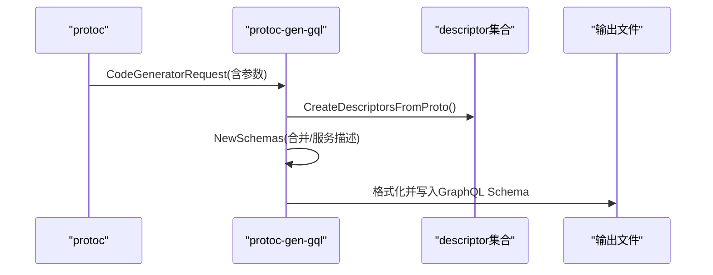
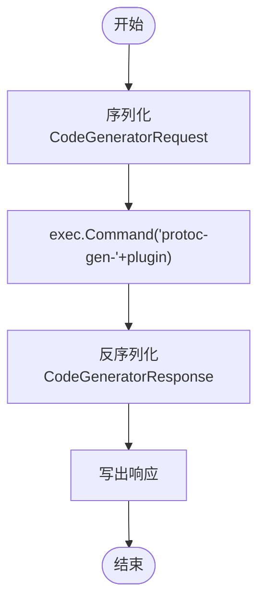
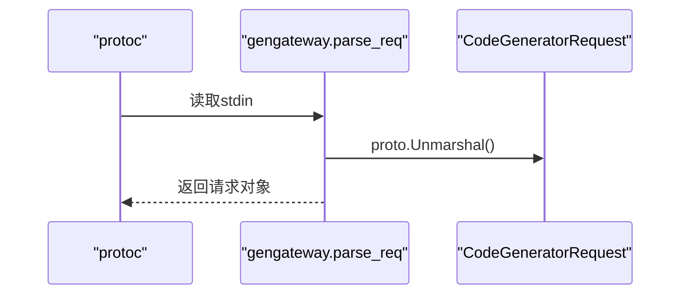
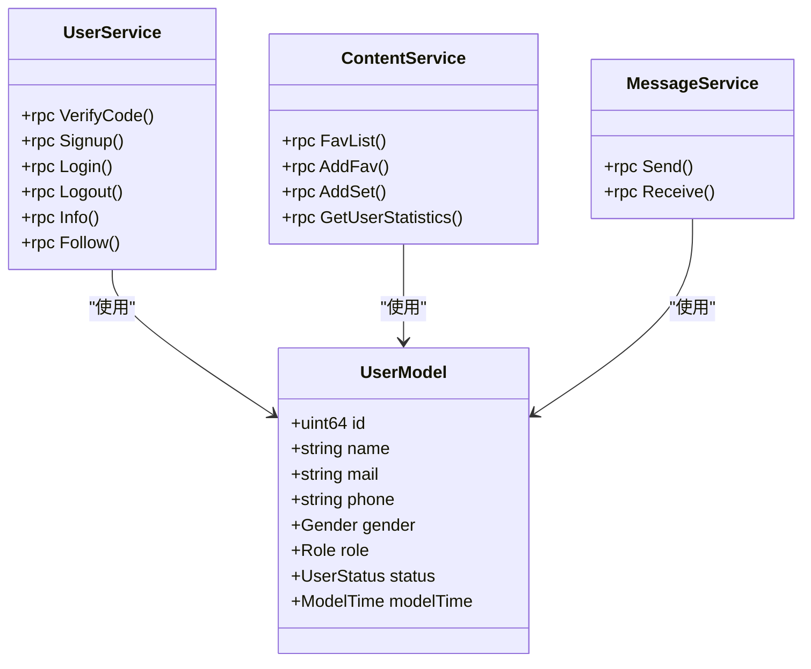
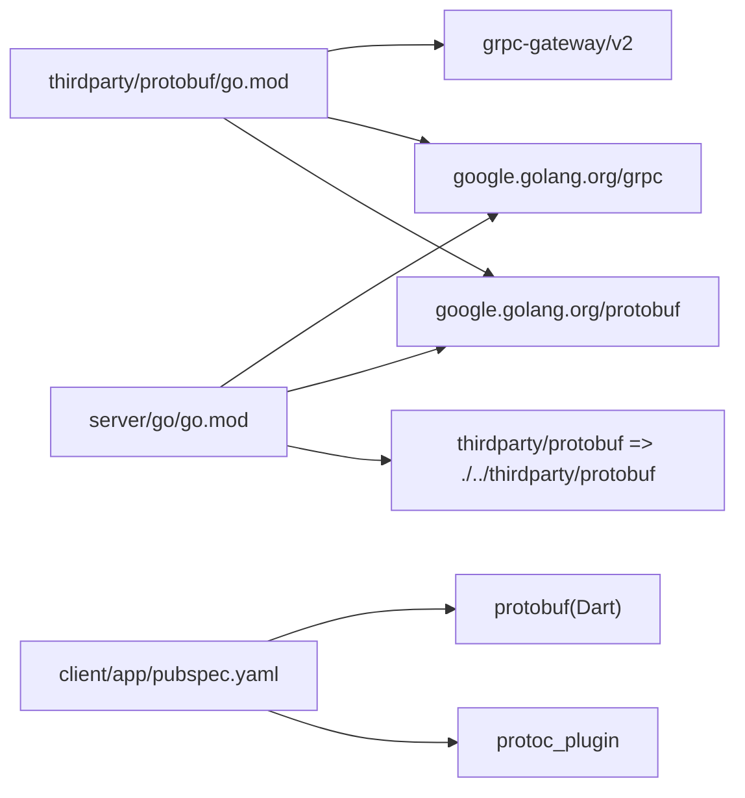

# ProtoBuf代码生成器

<cite>
**本文档引用的文件**
- [proto/README.md](file://proto/README.md)
- [proto/common/common.model.proto](file://proto/common/common.model.proto)
- [proto/user/user.model.proto](file://proto/user/user.model.proto)
- [proto/user/user.service.proto](file://proto/user/user.service.proto)
- [proto/content/content.service.proto](file://proto/content/content.service.proto)
- [proto/message/message.proto](file://proto/message/message.proto)
- [thirdparty/protobuf/go.mod](file://thirdparty/protobuf/go.mod)
- [thirdparty/cherry/_example/proto/user/user.proto](file://thirdparty/cherry/_example/proto/user/user.proto)
- [client/app/pubspec.yaml](file://client/app/pubspec.yaml)
- [thirdparty/protobuf/tools/protoc-gen-gql/main.go](file://thirdparty/protobuf/tools/protoc-gen-gql/main.go)
- [thirdparty/protobuf/tools/protoc-gen-gql/generator/utils.go](file://thirdparty/protobuf/tools/protoc-gen-gql/generator/utils.go)
- [thirdparty/protobuf/tools/protoc-gen-go-patch/patch/plugin.go](file://thirdparty/protobuf/tools/protoc-gen-go-patch/patch/plugin.go)
- [thirdparty/protobuf/tools/protoc-gen-grpc-gin/gengateway/parse_req.go](file://thirdparty/protobuf/tools/protoc-gen-grpc-gin/gengateway/parse_req.go)
- [server/go/go.mod](file://server/go/go.mod)
</cite>

## 目录
1. [简介](#简介)
2. [项目结构](#项目结构)
3. [核心组件](#核心组件)
4. [架构总览](#架构总览)
5. [详细组件分析](#详细组件分析)
6. [依赖关系分析](#依赖关系分析)
7. [性能考虑](#性能考虑)
8. [故障排查指南](#故障排查指南)
9. [结论](#结论)
10. [附录](#附录)

## 简介
本指南面向希望基于ProtoBuf进行跨语言代码生成与服务集成的开发者，覆盖从proto数据契约定义到Go、TypeScript/Dart等多语言代码自动生成的完整流程。文档重点说明：
- protoc编译器与常用插件的安装与配置
- 自定义插件（如GraphQL、Go补丁、网关）的使用方式
- 代码生成模板与参数定制
- 开发工作流（从proto定义到代码集成）
- 版本兼容性管理与升级建议

## 项目结构
本仓库采用“多模块并行”的组织方式，ProtoBuf相关资产主要分布在以下位置：
- proto/：业务proto定义与生成产物目录
- thirdparty/protobuf/：自研与第三方protoc插件及依赖
- client/app/：Flutter/Dart侧proto生成与依赖
- server/go/：Go后端服务与依赖
- thirdparty/cherry/_example/proto/user/user.proto：示例proto

图表来源
- [proto/common/common.model.proto:1-213](file://proto/common/common.model.proto#L1-L213)
- [proto/user/user.service.proto:1-425](file://proto/user/user.service.proto#L1-L425)
- [thirdparty/protobuf/tools/protoc-gen-gql/main.go:39-95](file://thirdparty/protobuf/tools/protoc-gen-gql/main.go#L39-L95)
- [thirdparty/protobuf/tools/protoc-gen-go-patch/patch/plugin.go:37-69](file://thirdparty/protobuf/tools/protoc-gen-go-patch/patch/plugin.go#L37-L69)
- [thirdparty/protobuf/tools/protoc-gen-grpc-gin/gengateway/parse_req.go:1-23](file://thirdparty/protobuf/tools/protoc-gen-grpc-gin/gengateway/parse_req.go#L1-L23)
- [client/app/pubspec.yaml:110-111](file://client/app/pubspec.yaml#L110-L111)
- [server/go/go.mod:1-192](file://server/go/go.mod#L1-L192)

章节来源
- [proto/README.md:1-7](file://proto/README.md#L1-L7)
- [proto/common/common.model.proto:1-213](file://proto/common/common.model.proto#L1-L213)
- [proto/user/user.service.proto:1-425](file://proto/user/user.service.proto#L1-L425)
- [thirdparty/protobuf/go.mod:1-97](file://thirdparty/protobuf/go.mod#L1-L97)
- [client/app/pubspec.yaml:110-111](file://client/app/pubspec.yaml#L110-L111)
- [server/go/go.mod:1-192](file://server/go/go.mod#L1-L192)

## 核心组件
- 数据契约层（proto）
  - 通过proto3语法定义消息与服务，结合扩展选项（如OpenAPI、GraphQL、GORM标签）实现跨语言一致性与增强能力。
  - 示例：用户模型与服务、内容服务、消息协议等。

- protoc编译器与插件生态
  - 插件包括：protoc-gen-gql（GraphQL Schema生成）、protoc-gen-go-patch（Go代码补丁/增强）、protoc-gen-grpc-gin（HTTP网关）。
  - 插件参数通过protoc --*_out=参数传入，支持开关与扩展名等配置。

- 多语言代码生成
  - Go：由官方protoc-gen-go与grpc插件生成，配合自定义补丁插件增强。
  - Dart/Flutter：通过protoc_plugin与protobuf库生成Dart代码，便于在移动端与Web使用。

- 版本与依赖管理
  - Go后端与第三方模块统一管理google.golang.org/protobuf、google.golang.org/grpc等核心依赖版本。
  - 客户端Flutter通过pubspec.yaml引入protoc_plugin与protobuf库。

章节来源
- [proto/common/common.model.proto:1-213](file://proto/common/common.model.proto#L1-L213)
- [proto/user/user.model.proto:1-269](file://proto/user/user.model.proto#L1-L269)
- [proto/user/user.service.proto:1-425](file://proto/user/user.service.proto#L1-L425)
- [proto/content/content.service.proto:1-144](file://proto/content/content.service.proto#L1-L144)
- [proto/message/message.proto:1-74](file://proto/message/message.proto#L1-L74)
- [thirdparty/protobuf/tools/protoc-gen-gql/main.go:39-95](file://thirdparty/protobuf/tools/protoc-gen-gql/main.go#L39-L95)
- [thirdparty/protobuf/tools/protoc-gen-go-patch/patch/plugin.go:37-69](file://thirdparty/protobuf/tools/protoc-gen-go-patch/patch/plugin.go#L37-L69)
- [thirdparty/protobuf/tools/protoc-gen-grpc-gin/gengateway/parse_req.go:1-23](file://thirdparty/protobuf/tools/protoc-gen-grpc-gin/gengateway/parse_req.go#L1-L23)
- [client/app/pubspec.yaml:110-111](file://client/app/pubspec.yaml#L110-L111)
- [server/go/go.mod:1-192](file://server/go/go.mod#L1-L192)

## 架构总览
下图展示从proto定义到多语言代码生成与服务集成的关键路径：

图表来源
- [thirdparty/protobuf/tools/protoc-gen-gql/main.go:39-95](file://thirdparty/protobuf/tools/protoc-gen-gql/main.go#L39-L95)
- [thirdparty/protobuf/tools/protoc-gen-go-patch/patch/plugin.go:37-69](file://thirdparty/protobuf/tools/protoc-gen-go-patch/patch/plugin.go#L37-L69)
- [thirdparty/protobuf/tools/protoc-gen-grpc-gin/gengateway/parse_req.go:1-23](file://thirdparty/protobuf/tools/protoc-gen-grpc-gin/gengateway/parse_req.go#L1-L23)
- [client/app/pubspec.yaml:110-111](file://client/app/pubspec.yaml#L110-L111)

## 详细组件分析

### 组件A：GraphQL代码生成（protoc-gen-gql）
- 功能概述
  - 基于proto文件生成GraphQL Schema，支持合并与服务描述生成。
  - 支持通过参数控制输出格式与扩展名。

- 关键流程
  - 解析protoc参数，构建descriptor集合。
  - 生成GraphQL Schema并格式化输出。

图表来源
- [thirdparty/protobuf/tools/protoc-gen-gql/main.go:48-95](file://thirdparty/protobuf/tools/protoc-gen-gql/main.go#L48-L95)
- [thirdparty/protobuf/tools/protoc-gen-gql/generator/utils.go:61-124](file://thirdparty/protobuf/tools/protoc-gen-gql/generator/utils.go#L61-L124)

章节来源
- [thirdparty/protobuf/tools/protoc-gen-gql/main.go:39-95](file://thirdparty/protobuf/tools/protoc-gen-gql/main.go#L39-L95)
- [thirdparty/protobuf/tools/protoc-gen-gql/generator/utils.go:61-124](file://thirdparty/protobuf/tools/protoc-gen-gql/generator/utils.go#L61-L124)

### 组件B：Go代码补丁（protoc-gen-go-patch）
- 功能概述
  - 作为通用插件运行器，调用其他protoc-gen-*插件，并对参数进行裁剪与组合。
  - 提供标准的请求/响应序列化与执行流程。

- 关键流程
  - 序列化请求，调用外部插件，反序列化响应并写出。

图表来源
- [thirdparty/protobuf/tools/protoc-gen-go-patch/patch/plugin.go:37-69](file://thirdparty/protobuf/tools/protoc-gen-go-patch/patch/plugin.go#L37-L69)

章节来源
- [thirdparty/protobuf/tools/protoc-gen-go-patch/patch/plugin.go:1-79](file://thirdparty/protobuf/tools/protoc-gen-go-patch/patch/plugin.go#L1-L79)

### 组件C：HTTP网关（protoc-gen-grpc-gin）
- 功能概述
  - 解析protoc插件请求，用于生成基于gin的HTTP网关代码，便于将gRPC服务暴露为RESTful API。

- 关键流程
  - 读取并解码请求，返回解析后的请求对象。

图表来源
- [thirdparty/protobuf/tools/protoc-gen-grpc-gin/gengateway/parse_req.go:1-23](file://thirdparty/protobuf/tools/protoc-gen-grpc-gin/gengateway/parse_req.go#L1-L23)

章节来源
- [thirdparty/protobuf/tools/protoc-gen-grpc-gin/gengateway/parse_req.go:1-23](file://thirdparty/protobuf/tools/protoc-gen-grpc-gin/gengateway/parse_req.go#L1-L23)

### 组件D：数据契约与服务定义（proto）
- 数据契约层
  - 使用option与扩展选项（如OpenAPI、GraphQL、GORM标签）增强消息与字段的元信息。
  - 示例：用户模型、服务、内容服务、消息协议等。

- 服务定义层
  - 通过google.api.annotations定义HTTP映射，结合OpenAPI注解生成Swagger文档。
  - GraphQL注解用于查询/变更类型标注。

图表来源
- [proto/user/user.model.proto:19-50](file://proto/user/user.model.proto#L19-L50)
- [proto/user/user.service.proto:26-258](file://proto/user/user.service.proto#L26-L258)
- [proto/content/content.service.proto:18-94](file://proto/content/content.service.proto#L18-L94)
- [proto/message/message.proto:28-74](file://proto/message/message.proto#L28-L74)

章节来源
- [proto/common/common.model.proto:1-213](file://proto/common/common.model.proto#L1-L213)
- [proto/user/user.model.proto:1-269](file://proto/user/user.model.proto#L1-L269)
- [proto/user/user.service.proto:1-425](file://proto/user/user.service.proto#L1-L425)
- [proto/content/content.service.proto:1-144](file://proto/content/content.service.proto#L1-L144)
- [proto/message/message.proto:1-74](file://proto/message/message.proto#L1-L74)

### 组件E：多语言代码生成配置
- Go后端
  - 依赖google.golang.org/protobuf、google.golang.org/grpc等，版本在go.mod中集中管理。
  - 通过protoc-gen-go与protoc-gen-go-grpc生成Go代码；配合自定义补丁插件增强。

- Dart/Flutter客户端
  - 通过protoc_plugin与protobuf库生成Dart代码，便于在移动端与Web使用。
  - pubspec.yaml中声明protoc_plugin与protobuf依赖。

章节来源
- [server/go/go.mod:1-192](file://server/go/go.mod#L1-L192)
- [client/app/pubspec.yaml:110-111](file://client/app/pubspec.yaml#L110-L111)

## 依赖关系分析
- 第三方protobuf模块
  - 统一管理gRPC、OpenAPI、GraphQL相关依赖，确保插件生态稳定。
  - 关键依赖：google.golang.org/protobuf、google.golang.org/grpc、grpc-gateway等。

- Go后端依赖
  - 通过replace指向本地thirdparty模块，保证版本一致性与可维护性。

- 客户端依赖
  - protoc_plugin与protobuf库用于Dart代码生成与运行时支持。

图表来源
- [thirdparty/protobuf/go.mod:1-97](file://thirdparty/protobuf/go.mod#L1-L97)
- [server/go/go.mod:184-191](file://server/go/go.mod#L184-L191)
- [client/app/pubspec.yaml:110-111](file://client/app/pubspec.yaml#L110-L111)

章节来源
- [thirdparty/protobuf/go.mod:1-97](file://thirdparty/protobuf/go.mod#L1-L97)
- [server/go/go.mod:184-191](file://server/go/go.mod#L184-L191)
- [client/app/pubspec.yaml:110-111](file://client/app/pubspec.yaml#L110-L111)

## 性能考虑
- 插件执行开销
  - 多插件链式执行会增加编译时间，建议按需启用必要插件。
- 生成文件规模
  - 合理拆分proto文件，避免单文件过大导致生成与编译耗时增加。
- 依赖版本锁定
  - 通过go.mod与pubspec.yaml锁定关键依赖版本，减少因版本漂移导致的性能波动。

## 故障排查指南
- 常见问题与定位
  - 插件未找到：确认已安装对应protoc-gen-*插件且在PATH中。
  - 参数解析失败：检查protoc --*_out=参数格式与拼写。
  - 依赖冲突：核对thirdparty/protobuf与server/go中的版本声明是否一致。

- 推荐排查步骤
  - 验证protoc版本与插件版本兼容性。
  - 逐步启用插件，定位具体插件引发的问题。
  - 对比thirdparty/protobuf与server/go的依赖声明，确保版本一致。

章节来源
- [thirdparty/protobuf/tools/protoc-gen-go-patch/patch/plugin.go:37-69](file://thirdparty/protobuf/tools/protoc-gen-go-patch/patch/plugin.go#L37-L69)
- [thirdparty/protobuf/tools/protoc-gen-gql/main.go:48-95](file://thirdparty/protobuf/tools/protoc-gen-gql/main.go#L48-L95)
- [server/go/go.mod:184-191](file://server/go/go.mod#L184-L191)

## 结论
本项目通过标准化的proto数据契约与完善的插件生态，实现了跨语言的一致性代码生成与服务集成。遵循本文档的安装、配置与工作流建议，可高效完成从proto定义到多语言代码生成与上线的全流程。

## 附录

### A. 开发工作流程（最佳实践）
- 定义与评审proto
  - 在proto/目录下新增或修改*.proto文件，确保消息与服务命名清晰、注释完整。
- 生成Go代码
  - 使用protoc-gen-go与protoc-gen-go-grpc生成Go代码；如需增强，配合protoc-gen-go-patch。
- 生成Dart代码
  - 使用protoc_plugin与protobuf库生成Dart代码，集成到Flutter工程。
- 集成与测试
  - 在server/go与client/app中分别集成生成代码，进行单元与端到端测试。
- 文档与发布
  - 基于OpenAPI注解生成Swagger文档，发布到API文档平台。

### B. 版本兼容性与升级指南
- Go后端
  - 升级google.golang.org/protobuf与google.golang.org/grpc时，同步更新thirdparty/protobuf中的依赖版本。
  - 使用replace确保本地模块版本与上游保持一致。

- 客户端
  - 升级protoc_plugin与protobuf时，确保Dart侧生成代码与运行时库版本匹配。

- 插件生态
  - 升级protoc-gen-gql、protoc-gen-go-patch、protoc-gen-grpc-gin时，先在测试环境验证兼容性再推广到生产。

章节来源
- [server/go/go.mod:1-192](file://server/go/go.mod#L1-L192)
- [thirdparty/protobuf/go.mod:1-97](file://thirdparty/protobuf/go.mod#L1-L97)
- [client/app/pubspec.yaml:110-111](file://client/app/pubspec.yaml#L110-L111)