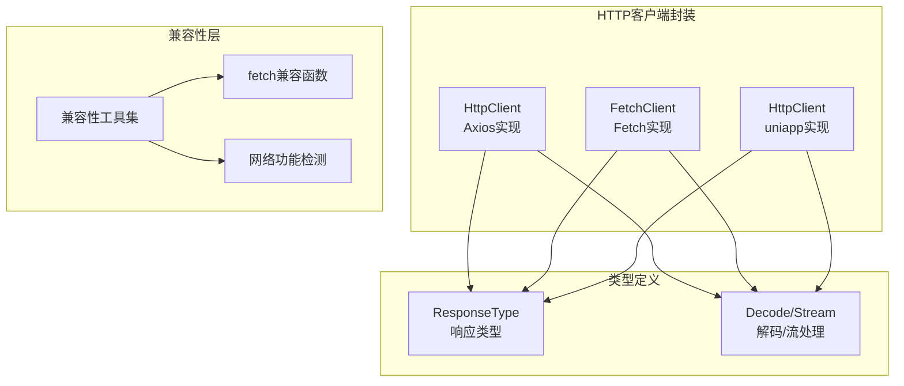
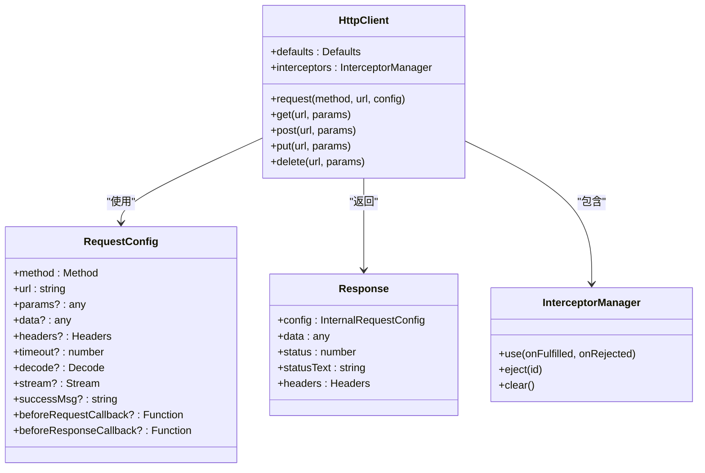

# HTTP客户端封装

<cite>
**本文档引用的文件**
- [index.ts](file://thirdparty/diamond/src/utils/httpclient/index.ts)
- [type.ts](file://thirdparty/diamond/src/utils/httpclient/type.ts)
- [axios.ts](file://thirdparty/diamond/src/utils/httpclient/axios.ts)
- [fetch.ts](file://thirdparty/diamond/src/utils/httpclient/fetch.ts)
- [httpclient.ts](file://thirdparty/diamond/src/utils/uniapp/httpclient.ts)
- [http.d.ts](file://thirdparty/diamond/src/utils/types/http.d.ts)
- [index.d.ts](file://thirdparty/diamond/src/utils/types/index.d.ts)
- [compatible/index.ts](file://thirdparty/diamond/src/utils/compatible/index.ts)
- [compatible/fetch.ts](file://thirdparty/diamond/src/utils/compatible/fetch.ts)
- [compatible/net.ts](file://thirdparty/diamond/src/utils/compatible/net.ts)
- [package.json](file://thirdparty/diamond/package.json)
</cite>

## 目录
1. [简介](#简介)
2. [项目结构](#项目结构)
3. [核心组件](#核心组件)
4. [架构概览](#架构概览)
5. [详细组件分析](#详细组件分析)
6. [依赖关系分析](#依赖关系分析)
7. [性能考虑](#性能考虑)
8. [故障排除指南](#故障排除指南)
9. [结论](#结论)
10. [附录](#附录)

## 简介
本文件为diamond项目中的HTTP客户端封装提供详细的API文档。该封装提供了三种HTTP客户端实现：基于Axios的HttpClient、基于原生fetch的FetchClient，以及针对uniapp平台的HttpClient。这些客户端统一了请求配置、拦截器机制、错误处理和响应数据处理，支持多种响应类型（JSON、Blob、ArrayBuffer、FormData等），并提供了灵活的解码和流处理能力。

## 项目结构
diamond项目的HTTP客户端封装位于thirdparty/diamond/src/utils/httpclient目录下，采用模块化设计，支持多平台运行环境。



**图表来源**
- [index.ts:1-3](file://thirdparty/diamond/src/utils/httpclient/index.ts#L1-L3)
- [type.ts:1-10](file://thirdparty/diamond/src/utils/httpclient/type.ts#L1-L10)
- [axios.ts:60-146](file://thirdparty/diamond/src/utils/httpclient/axios.ts#L60-L146)
- [fetch.ts:32-199](file://thirdparty/diamond/src/utils/httpclient/fetch.ts#L32-L199)
- [httpclient.ts:27-170](file://thirdparty/diamond/src/utils/uniapp/httpclient.ts#L27-L170)

**章节来源**
- [index.ts:1-3](file://thirdparty/diamond/src/utils/httpclient/index.ts#L1-L3)
- [axios.ts:1-146](file://thirdparty/diamond/src/utils/httpclient/axios.ts#L1-L146)
- [fetch.ts:1-199](file://thirdparty/diamond/src/utils/httpclient/fetch.ts#L1-L199)
- [httpclient.ts:1-170](file://thirdparty/diamond/src/utils/uniapp/httpclient.ts#L1-L170)

## 核心组件
HTTP客户端封装包含三个主要组件，每个都实现了统一的接口规范：

### 响应类型系统
系统定义了完整的响应类型枚举，支持多种数据格式：
- arraybuffer: 二进制数组缓冲区
- blob: 二进制大对象
- bytes: 字节数据
- json: JSON格式数据
- text: 文本数据
- stream: 流数据
- formdata: 表单数据

### 解码和流处理接口
通过Decode和Stream接口提供灵活的数据处理能力：
- Decode: 支持函数式或对象式解码器
- Stream: 支持ReadableStream的异步处理

**章节来源**
- [type.ts:1-10](file://thirdparty/diamond/src/utils/httpclient/type.ts#L1-L10)
- [http.d.ts:1-4](file://thirdparty/diamond/src/utils/types/http.d.ts#L1-L4)

## 架构概览
三种HTTP客户端实现遵循相同的架构模式，提供一致的API体验。



**图表来源**
- [axios.ts:25-82](file://thirdparty/diamond/src/utils/httpclient/axios.ts#L25-L82)
- [axios.ts:60-146](file://thirdparty/diamond/src/utils/httpclient/axios.ts#L60-L146)

## 详细组件分析

### Axios HTTP客户端 (HttpClient)
基于axios库构建的企业级HTTP客户端，提供完整的拦截器机制和错误处理。

#### 核心特性
- **完整拦截器支持**: 同时支持请求和响应拦截器
- **类型安全**: 完整的TypeScript类型定义
- **灵活配置**: 支持全局默认配置和单次请求配置
- **错误扩展**: 扩展AxiosError支持取消请求标记

#### 配置选项
- **基础配置**: method、url、params、data、headers
- **超时控制**: timeout毫秒数
- **解码处理**: decode函数用于特殊数据格式
- **流处理**: stream函数用于流式数据处理
- **回调函数**: beforeRequestCallback、beforeResponseCallback

#### 使用示例
```typescript
// 基础GET请求
const data = await httpClient.get('/api/users')

// 带参数请求
const userData = await httpClient.post('/api/users', {
  data: { name: 'John' },
  headers: { 'Authorization': 'Bearer token' }
})

// 自定义解码
const binaryData = await httpClient.get('/api/download', {
  responseType: 'arraybuffer',
  decode: (buffer) => new Uint8Array(buffer)
})
```

**章节来源**
- [axios.ts:25-37](file://thirdparty/diamond/src/utils/httpclient/axios.ts#L25-L37)
- [axios.ts:84-142](file://thirdparty/diamond/src/utils/httpclient/axios.ts#L84-L142)

### Fetch HTTP客户端 (FetchClient)
基于原生fetch API构建的轻量级HTTP客户端，支持现代浏览器特性。

#### 核心特性
- **原生fetch**: 利用浏览器内置fetch API
- **超时控制**: 内置AbortController支持
- **查询参数**: 支持query对象自动转换
- **响应类型**: 完整支持所有响应类型
- **拦截器链**: 请求和响应拦截器链式调用

#### 配置选项
- **baseUrl**: 基础URL前缀
- **timeout**: 超时时间（毫秒）
- **responseType**: 响应数据类型
- **headers**: 默认请求头
- **query**: 查询参数对象

#### 错误处理机制
- **响应拦截**: 可以在响应阶段进行统一处理
- **错误拦截**: 捕获并处理请求异常
- **状态码检查**: 支持根据HTTP状态码进行分支处理

**章节来源**
- [fetch.ts:39-45](file://thirdparty/diamond/src/utils/httpclient/fetch.ts#L39-L45)
- [fetch.ts:67-171](file://thirdparty/diamond/src/utils/httpclient/fetch.ts#L67-L171)

### uniapp HTTP客户端 (HttpClient)
专为uniapp跨平台应用设计的HTTP客户端，支持多端统一开发。

#### 平台特性
- **多端支持**: 支持微信小程序、H5、App等多平台
- **平台差异**: 针对不同平台的特性进行适配
- **统一接口**: 提供一致的API体验

#### 配置差异
- **dataType**: JSON数据类型
- **responseType**: 不同平台默认响应类型不同
- **header合并**: 支持header和headers的智能合并

**章节来源**
- [httpclient.ts:34-44](file://thirdparty/diamond/src/utils/uniapp/httpclient.ts#L34-L44)
- [httpclient.ts:66-142](file://thirdparty/diamond/src/utils/uniapp/httpclient.ts#L66-L142)

## 依赖关系分析

```mermaid
graph TD
subgraph "外部依赖"
AX[axios ^1.15.0]
QS[qs ^6.15.0]
UA[@dcloudio/uni-app ^3.0.0]
end
subgraph "内部模块"
HC[HttpClient]
FC[FetchClient]
UC[uniapp HttpClient]
TY[类型定义]
CP[兼容性工具]
end
AX --> HC
QS --> HC
QS --> FC
UA --> UC
HC --> TY
FC --> TY
UC --> TY
HC --> CP
FC --> CP
UC --> CP
```

**图表来源**
- [package.json:48-61](file://thirdparty/diamond/package.json#L48-L61)
- [axios.ts:1-9](file://thirdparty/diamond/src/utils/httpclient/axios.ts#L1-L9)
- [fetch.ts:1-4](file://thirdparty/diamond/src/utils/httpclient/fetch.ts#L1-L4)

**章节来源**
- [package.json:48-61](file://thirdparty/diamond/package.json#L48-L61)

## 性能考虑
HTTP客户端封装在设计时充分考虑了性能优化：

### 缓存策略
- **响应缓存**: 可通过拦截器实现响应数据缓存
- **连接复用**: axios实例支持HTTP连接复用
- **内存管理**: 流式处理避免大文件内存占用

### 并发控制
- **请求队列**: 可通过外部队列管理并发请求数量
- **超时控制**: 内置超时机制防止请求堆积
- **错误重试**: 支持基于拦截器的重试逻辑

### 传输优化
- **压缩支持**: 可通过headers配置Accept-Encoding
- **分块传输**: 流式API支持大文件分块传输
- **二进制处理**: 直接处理ArrayBuffer避免字符串转换开销

## 故障排除指南

### 常见问题诊断
1. **跨域问题**: 检查CORS配置和预检请求处理
2. **超时问题**: 调整timeout配置或实现重试机制
3. **数据格式问题**: 确认Content-Type和Accept头设置
4. **编码问题**: 使用decode函数正确处理二进制数据

### 调试工具
- **拦截器日志**: 在请求和响应拦截器中添加日志输出
- **网络监控**: 使用浏览器开发者工具监控网络请求
- **错误追踪**: 利用Promise.catch捕获和记录错误

**章节来源**
- [axios.ts:13-19](file://thirdparty/diamond/src/utils/httpclient/axios.ts#L13-L19)
- [fetch.ts:162-169](file://thirdparty/diamond/src/utils/httpclient/fetch.ts#L162-L169)

## 结论
diamond项目的HTTP客户端封装提供了企业级的网络通信解决方案，具有以下优势：

1. **多实现支持**: 同时支持Axios、原生fetch和uniapp三种实现
2. **类型安全**: 完整的TypeScript类型定义确保开发体验
3. **灵活配置**: 支持全局和局部配置，满足不同场景需求
4. **强大扩展**: 完善的拦截器机制支持复杂业务逻辑
5. **性能优化**: 针对不同平台和场景的性能优化

该封装适合构建高性能、可维护的Web应用和跨平台移动应用。

## 附录

### API参考表

#### HttpClient方法
| 方法 | 参数 | 返回值 | 描述 |
|------|------|--------|------|
| request | method, url, config | Promise<T> | 通用请求方法 |
| get | url, params | Promise<T> | GET请求 |
| post | url, params | Promise<T> | POST请求 |
| put | url, params | Promise<T> | PUT请求 |
| delete | url, params | Promise<T> | DELETE请求 |

#### 配置选项
| 选项 | 类型 | 默认值 | 描述 |
|------|------|--------|------|
| method | Method | - | HTTP方法 |
| url | string | - | 请求URL |
| timeout | number | 30000 | 超时时间(ms) |
| responseType | ResponseType | 'json' | 响应数据类型 |
| headers | Headers | {} | 请求头 |
| decode | Decode | - | 数据解码函数 |
| stream | Stream | - | 流处理函数 |

### 使用示例

#### 基础请求
```typescript
// GET请求
const users = await httpClient.get<User[]>('/api/users')

// POST请求
const newUser = await httpClient.post<User>('/api/users', {
  data: { name: 'Alice', email: 'alice@example.com' }
})
```

#### 高级配置
```typescript
// 带超时和错误处理
const result = await httpClient.request<any>('POST', '/api/upload', {
  data: formData,
  timeout: 60000,
  headers: { 'Authorization': `Bearer ${token}` },
  beforeRequestCallback: (req) => {
    console.log('发送请求:', req.url)
  },
  beforeResponseCallback: (res) => {
    console.log('收到响应:', res.status)
  }
})
```

#### 流式处理
```typescript
// 大文件下载
await httpClient.get('/api/download', {
  responseType: 'stream',
  stream: async (stream) => {
    const reader = stream.getReader()
    const chunks = []
    while(true) {
      const { done, value } = await reader.read()
      if (done) break
      chunks.push(value)
    }
    // 处理完整个文件
  }
})
```