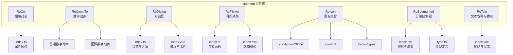
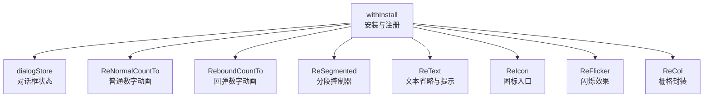
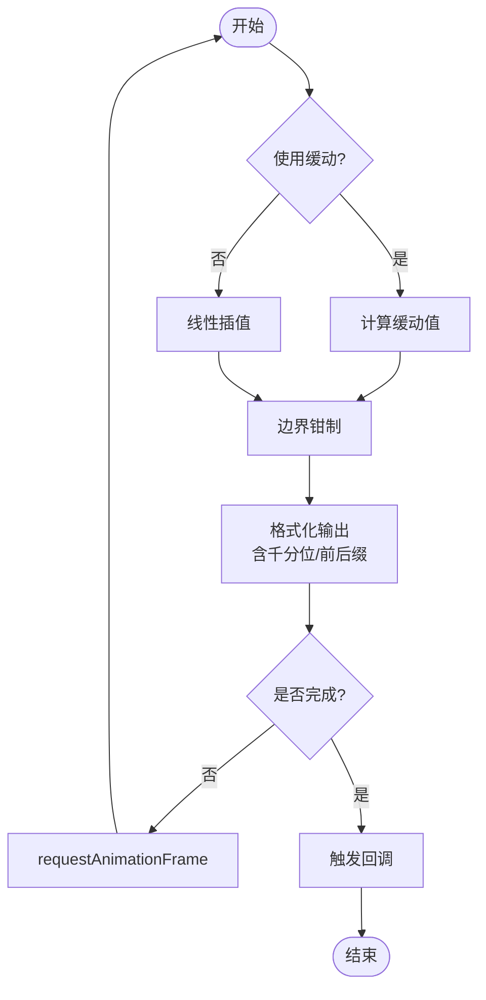
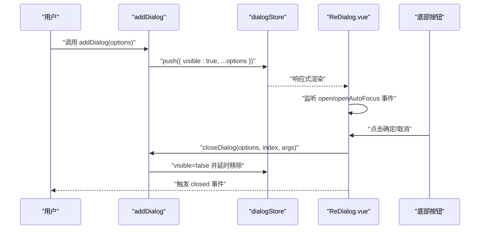
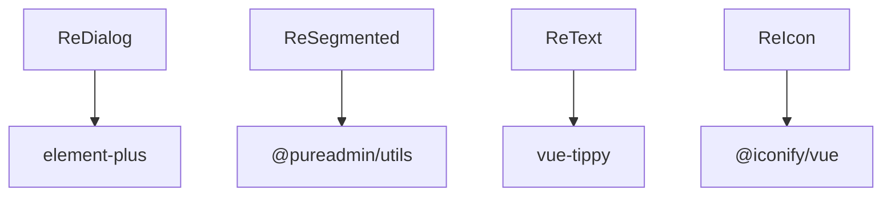

# Vue组件库

<cite>
**本文档引用的文件**
- [ReCol/index.ts](file://thirdparty/diamond/src/vue/ReCol/index.ts)
- [ReCountTo/index.ts](file://thirdparty/diamond/src/vue/ReCountTo/index.ts)
- [ReCountTo/src/normal/index.tsx](file://thirdparty/diamond/src/vue/ReCountTo/src/normal/index.tsx)
- [ReCountTo/src/normal/props.ts](file://thirdparty/diamond/src/vue/ReCountTo/src/normal/props.ts)
- [ReCountTo/src/rebound/index.tsx](file://thirdparty/diamond/src/vue/ReCountTo/src/rebound/index.tsx)
- [ReCountTo/src/rebound/props.ts](file://thirdparty/diamond/src/vue/ReCountTo/src/rebound/props.ts)
- [ReDialog/index.ts](file://thirdparty/diamond/src/vue/ReDialog/index.ts)
- [ReDialog/index.vue](file://thirdparty/diamond/src/vue/ReDialog/index.vue)
- [ReDialog/type.ts](file://thirdparty/diamond/src/vue/ReDialog/type.ts)
- [ReFlicker/index.ts](file://thirdparty/diamond/src/vue/ReFlicker/index.ts)
- [ReFlicker/index.css](file://thirdparty/diamond/src/vue/ReFlicker/index.css)
- [ReIcon/index.ts](file://thirdparty/diamond/src/vue/ReIcon/index.ts)
- [ReIcon/src/iconfont.ts](file://thirdparty/diamond/src/vue/ReIcon/src/iconfont.ts)
- [ReIcon/src/iconifyIconOffline.ts](file://thirdparty/diamond/src/vue/ReIcon/src/iconifyIconOffline.ts)
- [ReIcon/src/hooks.ts](file://thirdparty/diamond/src/vue/ReIcon/src/hooks.ts)
- [ReIcon/src/types.ts](file://thirdparty/diamond/src/vue/ReIcon/src/types.ts)
- [ReSegmented/index.ts](file://thirdparty/diamond/src/vue/ReSegmented/index.ts)
- [ReSegmented/src/index.tsx](file://thirdparty/diamond/src/vue/ReSegmented/src/index.tsx)
- [ReSegmented/src/type.ts](file://thirdparty/diamond/src/vue/ReSegmented/src/type.ts)
- [ReText/index.ts](file://thirdparty/diamond/src/vue/ReText/index.ts)
- [ReText/src/index.vue](file://thirdparty/diamond/src/vue/ReText/src/index.vue)
</cite>

## 目录
1. [简介](#简介)
2. [项目结构](#项目结构)
3. [核心组件](#核心组件)
4. [架构总览](#架构总览)
5. [组件详解](#组件详解)
6. [依赖关系分析](#依赖关系分析)
7. [性能考量](#性能考量)
8. [故障排查指南](#故障排查指南)
9. [结论](#结论)
10. [附录](#附录)

## 简介
本文件为 diamond Vue 组件库的核心组件使用文档，覆盖以下组件：ReCol 栅格布局、ReCountTo 数字动画（普通/回弹）、ReDialog 对话框、ReFlicker 闪烁效果、ReIcon 图标、ReSegmented 分段控制器、ReText 文本省略与提示。文档从架构、属性配置、事件与插槽、样式定制与响应式设计等方面进行系统阐述，并提供使用示例与最佳实践建议。

## 项目结构
diamond 组件库采用按功能模块划分的组织方式，核心组件位于 thirdparty/diamond/src/vue 下，每个组件独立目录，内部包含入口文件、实现文件与样式文件。ReDialog 采用组合式 API 与渲染函数结合的方式；ReCountTo 提供两种动画风格；ReSegmented 自带响应式布局与深浅主题适配；ReText 基于 Element Plus 的文本组件并集成 Tooltip 提示；ReIcon 提供多种图标来源封装；ReFlicker 提供纯 CSS 动画的闪烁点；ReCol 对 Element Plus 的 Col 进行轻量封装。

图示来源
- [ReCol/index.ts:1-30](file://thirdparty/diamond/src/vue/ReCol/index.ts#L1-L30)
- [ReCountTo/index.ts:1-12](file://thirdparty/diamond/src/vue/ReCountTo/index.ts#L1-L12)
- [ReDialog/index.ts:1-67](file://thirdparty/diamond/src/vue/ReDialog/index.ts#L1-L67)
- [ReDialog/index.vue:1-207](file://thirdparty/diamond/src/vue/ReDialog/index.vue#L1-L207)
- [ReIcon/index.ts:1-14](file://thirdparty/diamond/src/vue/ReIcon/index.ts#L1-L14)
- [ReIcon/src/iconfont.ts:1-49](file://thirdparty/diamond/src/vue/ReIcon/src/iconfont.ts#L1-L49)
- [ReIcon/src/iconifyIconOffline.ts:1-31](file://thirdparty/diamond/src/vue/ReIcon/src/iconifyIconOffline.ts#L1-L31)
- [ReIcon/src/hooks.ts](file://thirdparty/diamond/src/vue/ReIcon/src/hooks.ts)
- [ReIcon/src/types.ts](file://thirdparty/diamond/src/vue/ReIcon/src/types.ts)
- [ReSegmented/index.ts:1-9](file://thirdparty/diamond/src/vue/ReSegmented/index.ts#L1-L9)
- [ReSegmented/src/index.tsx:1-217](file://thirdparty/diamond/src/vue/ReSegmented/src/index.tsx#L1-L217)
- [ReSegmented/src/type.ts](file://thirdparty/diamond/src/vue/ReSegmented/src/type.ts)
- [ReText/index.ts:1-7](file://thirdparty/diamond/src/vue/ReText/index.ts#L1-L7)
- [ReText/src/index.vue:1-67](file://thirdparty/diamond/src/vue/ReText/src/index.vue#L1-L67)
- [ReFlicker/index.ts:1-45](file://thirdparty/diamond/src/vue/ReFlicker/index.ts#L1-L45)
- [ReFlicker/index.css](file://thirdparty/diamond/src/vue/ReFlicker/index.css)

章节来源
- [ReCol/index.ts:1-30](file://thirdparty/diamond/src/vue/ReCol/index.ts#L1-L30)
- [ReCountTo/index.ts:1-12](file://thirdparty/diamond/src/vue/ReCountTo/index.ts#L1-L12)
- [ReDialog/index.ts:1-67](file://thirdparty/diamond/src/vue/ReDialog/index.ts#L1-L67)
- [ReDialog/index.vue:1-207](file://thirdparty/diamond/src/vue/ReDialog/index.vue#L1-L207)
- [ReIcon/index.ts:1-14](file://thirdparty/diamond/src/vue/ReIcon/index.ts#L1-L14)
- [ReIcon/src/iconfont.ts:1-49](file://thirdparty/diamond/src/vue/ReIcon/src/iconfont.ts#L1-L49)
- [ReIcon/src/iconifyIconOffline.ts:1-31](file://thirdparty/diamond/src/vue/ReIcon/src/iconifyIconOffline.ts#L1-L31)
- [ReIcon/src/hooks.ts](file://thirdparty/diamond/src/vue/ReIcon/src/hooks.ts)
- [ReIcon/src/types.ts](file://thirdparty/diamond/src/vue/ReIcon/src/types.ts)
- [ReSegmented/index.ts:1-9](file://thirdparty/diamond/src/vue/ReSegmented/index.ts#L1-L9)
- [ReSegmented/src/index.tsx:1-217](file://thirdparty/diamond/src/vue/ReSegmented/src/index.tsx#L1-L217)
- [ReSegmented/src/type.ts](file://thirdparty/diamond/src/vue/ReSegmented/src/type.ts)
- [ReText/index.ts:1-7](file://thirdparty/diamond/src/vue/ReText/index.ts#L1-L7)
- [ReText/src/index.vue:1-67](file://thirdparty/diamond/src/vue/ReText/src/index.vue#L1-L67)
- [ReFlicker/index.ts:1-45](file://thirdparty/diamond/src/vue/ReFlicker/index.ts#L1-L45)
- [ReFlicker/index.css](file://thirdparty/diamond/src/vue/ReFlicker/index.css)

## 核心组件
- ReCol：对 Element Plus 的 Col 进行轻量封装，统一栅格断点值，支持透传原生属性与插槽。
- ReCountTo：提供两种数字动画风格，普通风格基于 requestAnimationFrame 实现，回弹风格基于 CSS 动画与 SVG 模糊滤镜。
- ReDialog：多实例对话框管理，支持延迟打开/关闭、全屏切换、确认前钩子、按钮渲染器与内容渲染器。
- ReFlicker：纯 CSS 动画的闪烁点，支持宽高、圆角、背景色、缩放范围等参数化控制。
- ReIcon：统一图标入口，支持 Iconify 离线、iconfont 字体图标等多种来源。
- ReSegmented：分段控制器，支持块级宽度、尺寸、禁用、响应式布局与深浅主题适配。
- ReText：基于 Element Plus 的文本组件，自动检测省略并提供 Tooltip 提示。

章节来源
- [ReCol/index.ts:1-30](file://thirdparty/diamond/src/vue/ReCol/index.ts#L1-L30)
- [ReCountTo/index.ts:1-12](file://thirdparty/diamond/src/vue/ReCountTo/index.ts#L1-L12)
- [ReDialog/index.ts:1-67](file://thirdparty/diamond/src/vue/ReDialog/index.ts#L1-L67)
- [ReDialog/index.vue:1-207](file://thirdparty/diamond/src/vue/ReDialog/index.vue#L1-L207)
- [ReFlicker/index.ts:1-45](file://thirdparty/diamond/src/vue/ReFlicker/index.ts#L1-L45)
- [ReIcon/index.ts:1-14](file://thirdparty/diamond/src/vue/ReIcon/index.ts#L1-L14)
- [ReSegmented/index.ts:1-9](file://thirdparty/diamond/src/vue/ReSegmented/index.ts#L1-L9)
- [ReText/index.ts:1-7](file://thirdparty/diamond/src/vue/ReText/index.ts#L1-L7)

## 架构总览
组件库通过统一的导出入口与工具函数（如 withInstall）实现安装与注册；对话框组件采用集中式状态管理与渲染器模式，实现高度可配置；数字动画组件拆分为普通与回弹两类实现，分别满足不同场景；分段控制器内置响应式观测与深浅主题适配；文本组件基于 Element Plus 并集成 Tooltip；图标组件提供多种来源的统一封装。

图示来源
- [ReCountTo/index.ts:1-12](file://thirdparty/diamond/src/vue/ReCountTo/index.ts#L1-L12)
- [ReDialog/index.ts:1-67](file://thirdparty/diamond/src/vue/ReDialog/index.ts#L1-L67)
- [ReSegmented/index.ts:1-9](file://thirdparty/diamond/src/vue/ReSegmented/index.ts#L1-L9)
- [ReText/index.ts:1-7](file://thirdparty/diamond/src/vue/ReText/index.ts#L1-L7)
- [ReIcon/index.ts:1-14](file://thirdparty/diamond/src/vue/ReIcon/index.ts#L1-L14)
- [ReFlicker/index.ts:1-45](file://thirdparty/diamond/src/vue/ReFlicker/index.ts#L1-L45)
- [ReCol/index.ts:1-30](file://thirdparty/diamond/src/vue/ReCol/index.ts#L1-L30)

## 组件详解

### ReCol 栅格布局组件
- 功能概述
  - 对 Element Plus 的 Col 进行轻量封装，统一设置 xs/sm/md/lg/xl 断点为同一值，简化常用场景下的栅格配置。
  - 透传原生属性与插槽，保持与 Element Plus 的一致体验。
- 关键属性
  - value：Number 类型，默认 24，表示栅格跨度。
- 插槽
  - default：默认插槽，放置栅格内的内容。
- 使用示例
  - 在容器中使用 ReCol 包裹内容，设置 value 即可实现等宽栅格。
- 最佳实践
  - 在需要统一断点的场景优先使用 ReCol，避免重复设置多个断点。
  - 与其他栅格组件混用时注意断点一致性。

章节来源
- [ReCol/index.ts:1-30](file://thirdparty/diamond/src/vue/ReCol/index.ts#L1-L30)

### ReCountTo 数字动画组件
- 功能概述
  - 提供两种风格：普通数字动画与回弹数字动画。
  - 普通风格：基于 requestAnimationFrame 的平滑动画，支持起止值、持续时间、缓动函数、千分位分隔符、前缀后缀等。
  - 回弹风格：基于 CSS 动画与 SVG 模糊滤镜，适配 Safari 浏览器差异。
- 普通数字动画（ReNormalCountTo）
  - 关键属性（节选）
    - startVal：起始值
    - endVal：结束值
    - duration：动画时长
    - autoplay：是否自动播放
    - decimals：小数位数
    - decimal：小数点分隔符
    - separator：千分位分隔符
    - prefix/suffix：前后缀
    - useEasing/easingFn：缓动开关与自定义缓动函数
    - color/fontSize：颜色与字号
  - 事件
    - mounted：组件挂载完成
    - callback：动画完成回调
  - 使用示例
    - 在需要展示递增/递减数值动画的场景使用，如统计面板、倒计时等。
  - 最佳实践
    - 合理设置 duration 与缓动函数，避免过长或过短影响用户体验。
    - 使用回调触发后续逻辑，如刷新数据或执行下一步操作。
- 回弹数字动画（ReboundCountTo）
  - 关键属性（节选）
    - i：滚动位数
    - delay：延迟秒数
    - blur：模糊强度
  - 兼容性
    - Safari 浏览器特殊处理，避免动画异常。
  - 使用示例
    - 在强调“回弹”视觉效果的场景使用，如金额变化、评分等。
  - 最佳实践
    - 注意 Safari 兼容性，必要时提供降级策略。
    - 控制 blur 与 delay 的取值，避免过度模糊影响可读性。

图示来源
- [ReCountTo/src/normal/index.tsx:93-141](file://thirdparty/diamond/src/vue/ReCountTo/src/normal/index.tsx#L93-L141)
- [ReCountTo/src/normal/props.ts](file://thirdparty/diamond/src/vue/ReCountTo/src/normal/props.ts)

章节来源
- [ReCountTo/index.ts:1-12](file://thirdparty/diamond/src/vue/ReCountTo/index.ts#L1-L12)
- [ReCountTo/src/normal/index.tsx:1-180](file://thirdparty/diamond/src/vue/ReCountTo/src/normal/index.tsx#L1-L180)
- [ReCountTo/src/normal/props.ts](file://thirdparty/diamond/src/vue/ReCountTo/src/normal/props.ts)
- [ReCountTo/src/rebound/index.tsx:1-73](file://thirdparty/diamond/src/vue/ReCountTo/src/rebound/index.tsx#L1-L73)
- [ReCountTo/src/rebound/props.ts](file://thirdparty/diamond/src/vue/ReCountTo/src/rebound/props.ts)

### ReDialog 对话框组件
- 功能概述
  - 多实例对话框管理，支持延迟打开/关闭、全屏切换、确认前钩子、按钮与内容渲染器。
  - 内置默认底部按钮（取消/确定），支持气泡确认与加载态。
- 关键 API
  - addDialog(options)：添加新对话框
  - closeDialog(options, index, args?)：关闭指定对话框
  - updateDialog(value, key?, index?)：更新指定对话框属性
  - closeAllDialog()：关闭全部对话框
  - dialogStore：当前显示的对话框列表
- 选项（节选）
  - openDelay/closeDelay：打开/关闭延迟
  - fullscreen：是否全屏
  - title/contentRenderer/headerRenderer/footerRenderer：标题与渲染器
  - footerButtons：自定义底部按钮
  - beforeSure/beforeCancel：确认/取消前钩子
  - hideFooter：隐藏底部区域
  - props：透传到 el-dialog 的属性
  - sureBtnLoading：确定按钮加载态
  - popconfirm：按钮气泡确认配置
- 事件
  - open/openAutoFocus/closeAutoFocus/closed：生命周期与焦点事件
- 使用示例
  - 调用 addDialog 传入 options，即可在页面中渲染对应对话框。
  - 通过 footerButtons 或 footerRenderer 自定义底部按钮与布局。
- 最佳实践
  - 使用 beforeSure/beforeCancel 在关键操作前进行二次确认。
  - 合理设置 openDelay/closeDelay，避免频繁开关造成抖动。
  - 使用 contentRenderer 与 headerRenderer 实现复杂内容与头部自定义。

图示来源
- [ReDialog/index.ts:15-37](file://thirdparty/diamond/src/vue/ReDialog/index.ts#L15-L37)
- [ReDialog/index.vue:108-206](file://thirdparty/diamond/src/vue/ReDialog/index.vue#L108-L206)
- [ReDialog/type.ts](file://thirdparty/diamond/src/vue/ReDialog/type.ts)

章节来源
- [ReDialog/index.ts:1-67](file://thirdparty/diamond/src/vue/ReDialog/index.ts#L1-L67)
- [ReDialog/index.vue:1-207](file://thirdparty/diamond/src/vue/ReDialog/index.vue#L1-L207)
- [ReDialog/type.ts](file://thirdparty/diamond/src/vue/ReDialog/type.ts)

### ReFlicker 闪烁效果组件
- 功能概述
  - 提供圆点/方形闪烁动画，支持宽高、圆角、背景色、缩放范围等参数化控制。
  - 通过 CSS 变量实现样式定制，无需额外类名。
- 关键参数（节选）
  - width/height：宽高
  - borderRadius：圆角，传 0 为方形，传 50% 或不传为圆形
  - background：闪烁颜色
  - scale：闪烁范围，默认 2
- 使用示例
  - 在需要引导注意力或提示状态的场景使用，如加载中、提醒等。
- 最佳实践
  - 合理设置 scale 与 background，确保在不同背景下具备足够对比度。
  - 控制闪烁频率与持续时间，避免引起视觉疲劳。

章节来源
- [ReFlicker/index.ts:1-45](file://thirdparty/diamond/src/vue/ReFlicker/index.ts#L1-L45)
- [ReFlicker/index.css](file://thirdparty/diamond/src/vue/ReFlicker/index.css)

### ReIcon 图标组件
- 功能概述
  - 统一图标入口，支持 Iconify 离线、iconfont 字体图标等多种来源。
  - 提供 hooks 与 types，便于扩展与类型约束。
- 组件（节选）
  - IconifyIconOffline：Iconify 离线图标
  - IconifyIconOnline：Iconify 在线图标
  - FontIcon：iconfont 字体图标，支持 unicode、font-class、symbol 三种引用模式
- 使用示例
  - 根据部署环境选择离线/在线图标源；在需要自定义样式的场景使用 FontIcon 并传入 iconType。
- 最佳实践
  - 内网环境优先使用离线图标，减少网络请求。
  - 使用 hooks 统一生成图标组件，便于复用与维护。

章节来源
- [ReIcon/index.ts:1-14](file://thirdparty/diamond/src/vue/ReIcon/index.ts#L1-L14)
- [ReIcon/src/iconfont.ts:1-49](file://thirdparty/diamond/src/vue/ReIcon/src/iconfont.ts#L1-L49)
- [ReIcon/src/iconifyIconOffline.ts:1-31](file://thirdparty/diamond/src/vue/ReIcon/src/iconifyIconOffline.ts#L1-L31)
- [ReIcon/src/hooks.ts](file://thirdparty/diamond/src/vue/ReIcon/src/hooks.ts)
- [ReIcon/src/types.ts](file://thirdparty/diamond/src/vue/ReIcon/src/types.ts)

### ReSegmented 分段控制器
- 功能概述
  - 支持块级宽度、尺寸、禁用、响应式布局与深浅主题适配。
  - 内置鼠标悬停与选中态样式，支持图标与提示信息。
- 关键属性（节选）
  - options：选项数组，支持 label/icon/tip/disabled 等
  - modelValue：当前选中项（支持 number/string）
  - block：是否占满父容器宽度
  - size：small/default/large
  - disabled：全局禁用
  - resize：开启容器尺寸变化监听并自适应
- 事件
  - change：选中项变更
  - update:modelValue：双向绑定事件
- 使用示例
  - 在需要分组切换的场景使用，如筛选器、标签页等。
- 最佳实践
  - 使用 resize 在容器宽度变化时自动重算选中指示条位置。
  - 在深色/浅色主题下保持对比度，确保可读性。

章节来源
- [ReSegmented/index.ts:1-9](file://thirdparty/diamond/src/vue/ReSegmented/index.ts#L1-L9)
- [ReSegmented/src/index.tsx:1-217](file://thirdparty/diamond/src/vue/ReSegmented/src/index.tsx#L1-L217)
- [ReSegmented/src/type.ts](file://thirdparty/diamond/src/vue/ReSegmented/src/type.ts)

### ReText 文本组件
- 功能概述
  - 基于 Element Plus 的文本组件，自动检测单行或多行省略，并在悬停时通过 Tooltip 显示完整内容。
- 关键属性（节选）
  - lineClamp：省略行数（字符串/数字）
  - tippyProps：Tooltip 配置对象
- 插槽
  - default：默认插槽
- 使用示例
  - 在表格列、卡片描述等需要省略与提示的场景使用。
- 最佳实践
  - 合理设置 lineClamp，避免过早省略影响信息传达。
  - 通过 tippyProps 自定义 Tooltip 的触发时机与定位。

章节来源
- [ReText/index.ts:1-7](file://thirdparty/diamond/src/vue/ReText/index.ts#L1-L7)
- [ReText/src/index.vue:1-67](file://thirdparty/diamond/src/vue/ReText/src/index.vue#L1-L67)

## 依赖关系分析
- 组件间耦合
  - ReDialog 与 Element Plus 的 el-dialog 强耦合，通过集中式状态管理实现多实例控制。
  - ReSegmented 依赖 @pureadmin/utils 的主题与尺寸工具，以及 useResizeObserver 实现响应式布局。
  - ReText 依赖 vue-tippy 实现 Tooltip 提示。
  - ReIcon 依赖 @iconify/vue 与 iconfont 资源。
- 外部依赖
  - @pureadmin/utils：安装函数、类型与工具函数
  - element-plus：栅格、对话框、按钮等基础组件
  - vue-tippy：Tooltip 提示
  - @iconify/vue：图标渲染

图示来源
- [ReDialog/index.ts:1-11](file://thirdparty/diamond/src/vue/ReDialog/index.ts#L1-L11)
- [ReSegmented/src/index.tsx:1-19](file://thirdparty/diamond/src/vue/ReSegmented/src/index.tsx#L1-L19)
- [ReText/src/index.vue:1-4](file://thirdparty/diamond/src/vue/ReText/src/index.vue#L1-L4)
- [ReIcon/src/iconifyIconOffline.ts:1-31](file://thirdparty/diamond/src/vue/ReIcon/src/iconifyIconOffline.ts#L1-L31)

章节来源
- [ReDialog/index.ts:1-11](file://thirdparty/diamond/src/vue/ReDialog/index.ts#L1-L11)
- [ReSegmented/src/index.tsx:1-19](file://thirdparty/diamond/src/vue/ReSegmented/src/index.tsx#L1-L19)
- [ReText/src/index.vue:1-4](file://thirdparty/diamond/src/vue/ReText/src/index.vue#L1-L4)
- [ReIcon/src/iconifyIconOffline.ts:1-31](file://thirdparty/diamond/src/vue/ReIcon/src/iconifyIconOffline.ts#L1-L31)

## 性能考量
- ReCountTo
  - 普通风格使用 requestAnimationFrame，帧率稳定；建议合理设置 duration 与 decimals，避免频繁格式化。
  - 回弹风格使用 CSS 动画，Safari 兼容性已内置处理，注意 blur 与 delay 的取值范围。
- ReDialog
  - 采用集中式状态管理，避免重复渲染；通过 openDelay/closeDelay 减少频繁开关带来的抖动。
  - 使用渲染器模式将复杂内容延迟到需要时再渲染，降低初始开销。
- ReSegmented
  - 使用 ResizeObserver 监听容器尺寸变化，仅在必要时重算位置；建议在大量选项场景下启用 resize。
- ReText
  - 仅在出现省略时启用 Tooltip，避免不必要的初始化与计算。
- ReIcon
  - 离线图标按需添加，避免一次性加载过多图标资源。

## 故障排查指南
- 对话框无法关闭或重复渲染
  - 检查 closeDelay 设置是否过短，导致实例被提前移除。
  - 确认 beforeCancel/beforeSure 中未阻塞 closeDialog 的执行。
- 数字动画不生效
  - 普通风格：检查 autoplay 与 startVal/endVal 是否正确设置。
  - 回弹风格：确认 Safari 特殊处理逻辑是否生效，适当调整 delay 与 blur。
- 分段控制器样式异常
  - 检查 resize 是否开启，容器尺寸变化后是否重新计算位置。
  - 确认 modelValue 类型与选项数量匹配，避免索引越界。
- 文本省略与 Tooltip 不显示
  - 确认 lineClamp 设置是否正确，以及内容是否确实存在省略。
  - 检查 tippyProps 的配置，确保内容插槽有效。
- 图标不显示
  - 离线图标需确保 icon 对象已添加至 Iconify；字体图标需正确设置 iconType 与引用方式。

章节来源
- [ReDialog/index.ts:33-37](file://thirdparty/diamond/src/vue/ReDialog/index.ts#L33-L37)
- [ReDialog/index.vue:169-173](file://thirdparty/diamond/src/vue/ReDialog/index.vue#L169-L173)
- [ReCountTo/src/normal/index.tsx:53-62](file://thirdparty/diamond/src/vue/ReCountTo/src/normal/index.tsx#L53-L62)
- [ReCountTo/src/rebound/index.tsx:18-34](file://thirdparty/diamond/src/vue/ReCountTo/src/rebound/index.tsx#L18-L34)
- [ReSegmented/src/index.tsx:108-114](file://thirdparty/diamond/src/vue/ReSegmented/src/index.tsx#L108-L114)
- [ReText/src/index.vue:25-33](file://thirdparty/diamond/src/vue/ReText/src/index.vue#L25-L33)
- [ReIcon/src/iconifyIconOffline.ts:14-14](file://thirdparty/diamond/src/vue/ReIcon/src/iconifyIconOffline.ts#L14-L14)

## 结论
diamond Vue 组件库围绕常用业务场景提供了高可用、可定制的组件集合。ReCol、ReCountTo、ReDialog、ReFlicker、ReIcon、ReSegmented、ReText 在功能与易用性之间取得良好平衡，配合统一的安装与注册机制，能够快速集成到各类前端项目中。建议在实际使用中结合业务需求选择合适的组件风格，并遵循本文的最佳实践以获得更佳的用户体验与开发效率。

## 附录
- 快速上手
  - 安装与注册：通过 withInstall 导出的组件进行安装与全局注册。
  - 对话框：使用 addDialog 添加实例，通过 dialogStore 控制显示与隐藏。
  - 数字动画：根据场景选择普通或回弹风格，合理配置起止值与缓动。
  - 分段控制器：通过 options 配置选项，使用 resize 自适应容器宽度。
  - 文本省略：设置 lineClamp 并通过 tippyProps 自定义提示行为。
  - 图标：根据部署环境选择离线/在线图标源，或使用 FontIcon 支持多种引用模式。
- 响应式与主题
  - ReSegmented 内置深浅主题适配，可在暗色/亮色环境下自动切换样式。
  - ReDialog 与 ReText 支持通过属性与插槽灵活定制外观与交互。