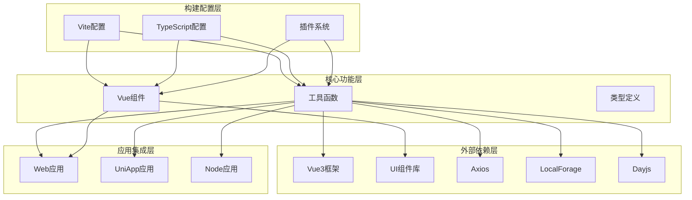
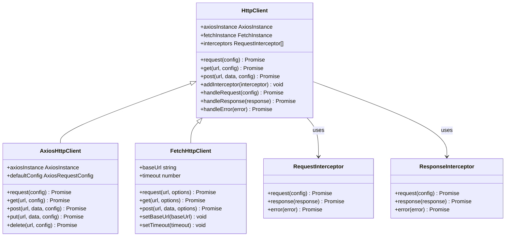
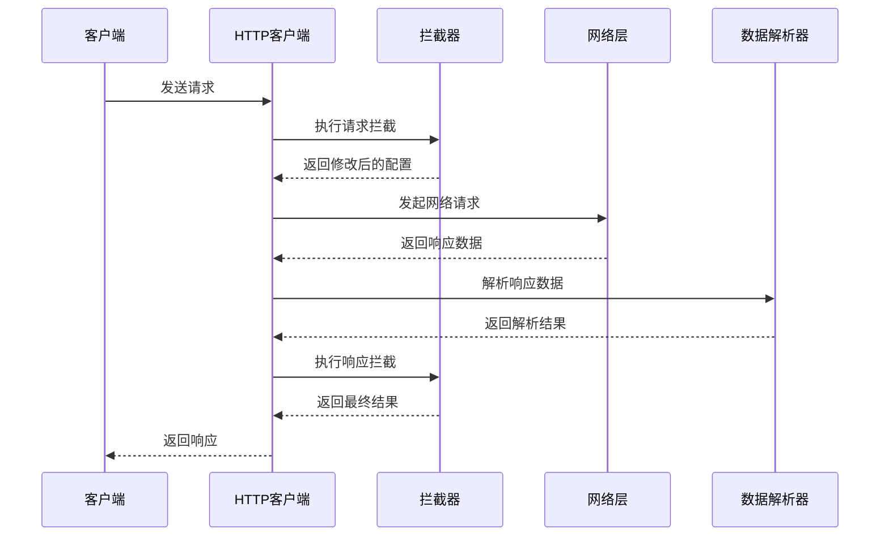
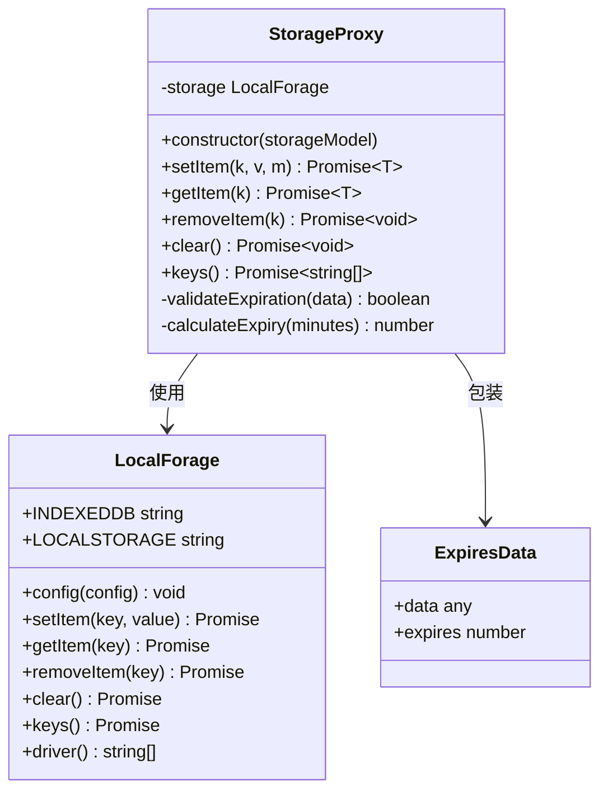
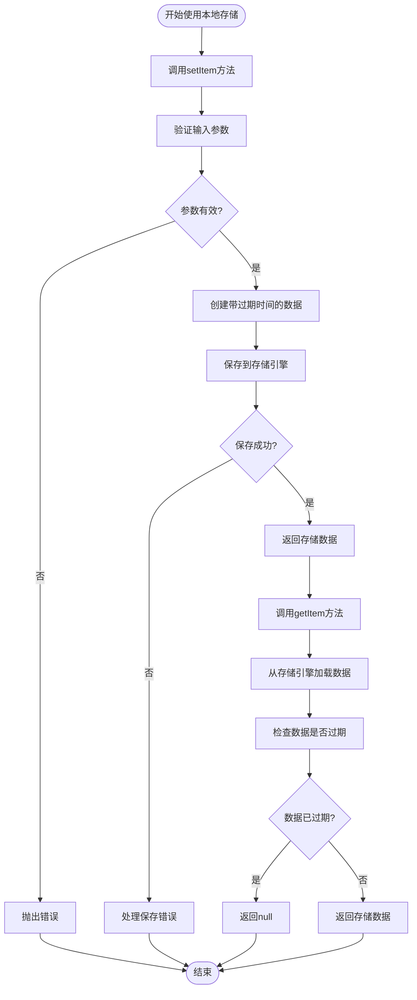
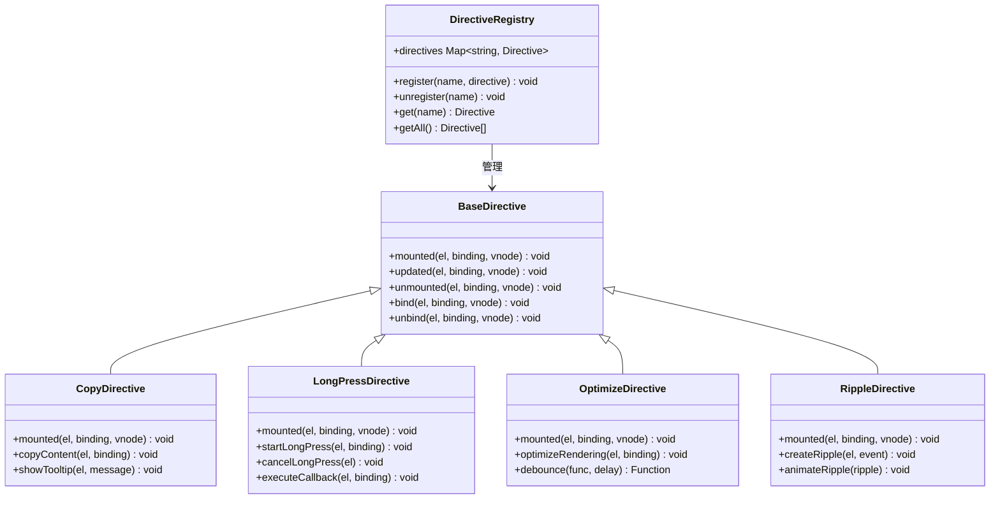
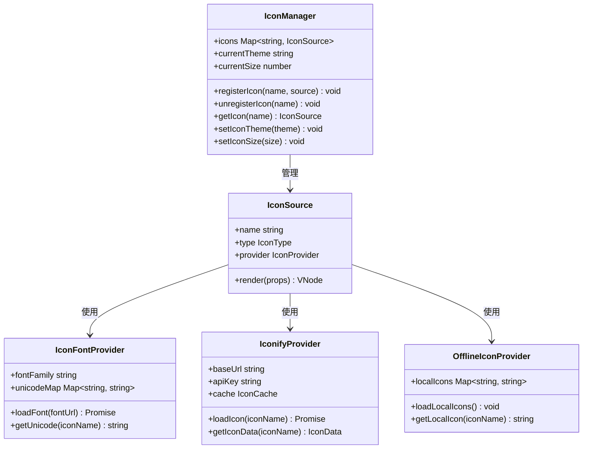
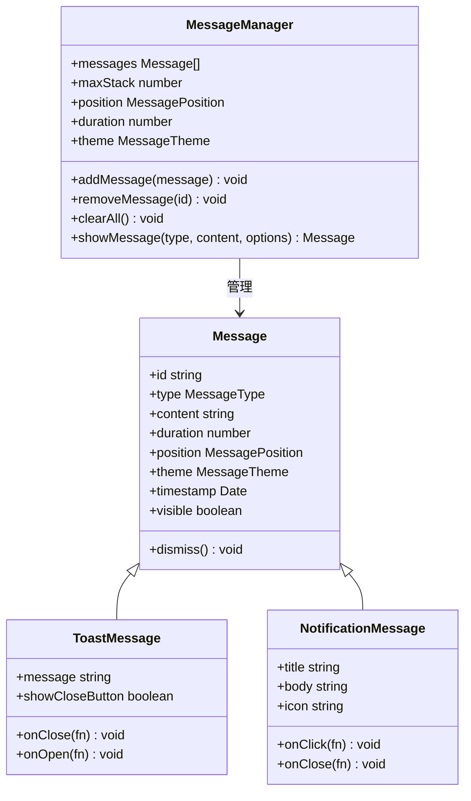

# diamond前端库

<cite>
**本文档引用的文件**
- [package.json](file://thirdparty/diamond/package.json)
- [README.md](file://thirdparty/diamond/README.md)
- [vite.config.ts](file://thirdparty/diamond/vite.config.ts)
- [tsconfig.json](file://thirdparty/diamond/tsconfig.json)
- [tsconfig.utils.json](file://thirdparty/diamond/tsconfig.utils.json)
- [tsconfig.vue.json](file://thirdparty/diamond/tsconfig.vue.json)
- [tsconfig.node.json](file://thirdparty/diamond/tsconfig.node.json)
- [index.ts](file://thirdparty/diamond/src/utils/index.ts)
- [index.ts](file://thirdparty/diamond/src/vue/index.ts)
- [index.ts](file://thirdparty/diamond/src/utils/httpclient/index.ts)
- [axios.ts](file://thirdparty/diamond/src/utils/httpclient/axios.ts)
- [fetch.ts](file://thirdparty/diamond/src/utils/httpclient/fetch.ts)
- [type.ts](file://thirdparty/diamond/src/utils/httpclient/type.ts)
- [index.ts](file://thirdparty/diamond/src/utils/localforage/index.ts)
- [types.d.ts](file://thirdparty/diamond/src/utils/localforage/types.d.ts)
- [index.ts](file://thirdparty/diamond/src/utils/validator/index.ts)
- [validator.ts](file://thirdparty/diamond/src/utils/validator/validator.ts)
- [index.ts](file://thirdparty/diamond/src/utils/math/index.ts)
- [number.js](file://thirdparty/diamond/src/utils/math/number.js)
- [random.ts](file://thirdparty/diamond/src/utils/math/random.ts)
- [index.ts](file://thirdparty/diamond/src/utils/time/index.ts)
- [time.ts](file://thirdparty/diamond/src/utils/time/time.ts)
- [date.ts](file://thirdparty/diamond/src/utils/time/date.ts)
- [index.ts](file://thirdparty/diamond/src/utils/crypto/index.ts)
- [compatible.js](file://thirdparty/diamond/src/utils/crypto/compatible.js)
- [crypto.js](file://thirdparty/diamond/src/utils/crypto/crypto.js)
- [node.js](file://thirdparty/diamond/src/utils/crypto/node.js)
- [index.ts](file://thirdparty/diamond/src/vue/plugin/index.ts)
- [interceptor.ts](file://thirdparty/diamond/src/vue/plugin/interceptor.ts)
- [index.ts](file://thirdparty/diamond/src/vue/message/index.ts)
- [message.ts](file://thirdparty/diamond/src/vue/message/message.ts)
- [index.ts](file://thirdparty/diamond/src/vue/directives/index.ts)
- [copy/index.ts](file://thirdparty/diamond/src/vue/directives/copy/index.ts)
- [longpress/index.ts](file://thirdparty/diamond/src/vue/directives/longpress/index.ts)
- [optimize/index.ts](file://thirdparty/diamond/src/vue/directives/optimize/index.ts)
- [ripple/index.ts](file://thirdparty/diamond/src/vue/directives/ripple/index.ts)
- [index.ts](file://thirdparty/diamond/src/vue/ReIcon/index.ts)
- [hooks.ts](file://thirdparty/diamond/src/vue/ReIcon/src/hooks.ts)
- [iconfont.ts](file://thirdparty/diamond/src/vue/ReIcon/src/iconfont.ts)
- [iconifyIconOffline.ts](file://thirdparty/diamond/src/vue/ReIcon/src/iconifyIconOffline.ts)
- [iconifyIconOnline.ts](file://thirdparty/diamond/src/vue/ReIcon/src/iconifyIconOnline.ts)
- [offlineIcon.ts](file://thirdparty/diamond/src/vue/ReIcon/src/offlineIcon.ts)
- [types.ts](file://thirdparty/diamond/src/vue/ReIcon/src/types.ts)
- [index.ts](file://thirdparty/diamond/src/vue/ReDialog/index.ts)
- [index.vue](file://thirdparty/diamond/src/vue/ReDialog/index.vue)
- [type.ts](file://thirdparty/diamond/src/vue/ReDialog/type.ts)
- [index.ts](file://thirdparty/diamond/src/vue/ReCol/index.ts)
- [index.ts](file://thirdparty/diamond/src/vue/ReCountTo/index.ts)
- [index.ts](file://thirdparty/diamond/src/vue/ReFlicker/index.ts)
- [index.css](file://thirdparty/diamond/src/vue/ReFlicker/index.css)
- [index.ts](file://thirdparty/diamond/src/vue/ReSegmented/index.ts)
- [index.ts](file://thirdparty/diamond/src/vue/ReText/index.ts)
- [index.ts](file://thirdparty/diamond/src/utils/enum/index.ts)
- [platform.ts](file://thirdparty/diamond/src/utils/enum/platform.ts)
- [index.ts](file://thirdparty/diamond/src/utils/uniapp/index.ts)
- [api.ts](file://thirdparty/diamond/src/utils/uniapp/api.ts)
- [httpclient.ts](file://thirdparty/diamond/src/utils/uniapp/httpclient.ts)
- [page.ts](file://thirdparty/diamond/src/utils/uniapp/page.ts)
- [index.ts](file://thirdparty/diamond/src/utils/types/index.d.ts)
- [common.d.ts](file://thirdparty/diamond/src/utils/types/common.d.ts)
- [http.d.ts](file://thirdparty/diamond/src/utils/types/http.d.ts)
- [vue.d.ts](file://thirdparty/diamond/src/utils/types/vue.d.ts)
- [global.d.ts](file://thirdparty/diamond/src/utils/types/global.d.ts)
- [directives.d.ts](file://thirdparty/diamond/src/utils/types/directives.d.ts)
- [crypto.d.ts](file://thirdparty/diamond/src/utils/types/crypto.d.ts)
</cite>

## 目录
1. [简介](#简介)
2. [项目结构](#项目结构)
3. [核心组件](#核心组件)
4. [架构总览](#架构总览)
5. [详细组件分析](#详细组件分析)
6. [依赖关系分析](#依赖关系分析)
7. [性能考虑](#性能考虑)
8. [故障排除指南](#故障排除指南)
9. [结论](#结论)
10. [附录](#附录)

## 简介
diamond是一个基于Vue3的前端工具库，提供通用工具函数、组件库、状态管理工具、HTTP客户端封装、国际化支持、文件处理工具等能力。该库采用模块化组织，通过Vite进行构建，支持ESM与CJS两种格式输出，并提供完善的TypeScript类型定义。

## 项目结构
diamond库采用清晰的模块化组织方式，主要分为以下几大模块：

```mermaid
graph TB
subgraph "核心模块"
Utils[工具函数模块]
Vue[Vue组件模块]
Types[类型定义模块]
end
subgraph "工具函数子模块"
Http[HTTP客户端]
Crypto[加密解密]
Math[数学运算]
Time[时间处理]
Validator[验证器]
Localforage[本地存储]
UniApp[UniApp适配]
Enum[枚举类型]
Browser[浏览器工具]
FileSystem[文件系统]
Image[图像处理]
SVG[SVG工具]
Wopan[特定业务]
end
subgraph "Vue组件子模块"
Directives[指令集]
Message[消息组件]
Icons[图标组件]
Dialog[对话框]
Layout[布局组件]
CountTo[数字动画]
Flicker[闪烁效果]
Segmented[分段控件]
Text[文本组件]
end
Utils --> Http
Utils --> Crypto
Utils --> Math
Utils --> Time
Utils --> Validator
Utils --> Localforage
Utils --> UniApp
Utils --> Enum
Utils --> Browser
Utils --> FileSystem
Utils --> Image
Utils --> SVG
Utils --> Wopan
Vue --> Directives
Vue --> Message
Vue --> Icons
Vue --> Dialog
Vue --> Layout
Vue --> CountTo
Vue --> Flicker
Vue --> Segmented
Vue --> Text
```



**图表来源**
- [vite.config.ts:10-28](file://thirdparty/diamond/vite.config.ts#L10-L28)
- [package.json:10-18](file://thirdparty/diamond/package.json#L10-L18)

**章节来源**
- [vite.config.ts:10-28](file://thirdparty/diamond/vite.config.ts#L10-L28)
- [package.json:10-18](file://thirdparty/diamond/package.json#L10-L18)

## 核心组件
diamond库的核心功能围绕以下几个方面展开：

### HTTP客户端封装
提供基于axios和原生fetch的HTTP客户端，支持拦截器、错误处理、超时控制等功能。

### 本地存储增强
基于localforage提供带过期时间的本地存储解决方案，支持IndexedDB和localStorage双引擎。

### Vue组件生态
包含丰富的UI组件和指令，涵盖基础交互、视觉效果、布局控制等多个维度。

### 工具函数集合
提供数学运算、时间处理、加密解密、文件处理等实用工具函数。

**章节来源**
- [index.ts:1-3](file://thirdparty/diamond/src/utils/httpclient/index.ts#L1-L3)
- [index.ts:1-110](file://thirdparty/diamond/src/utils/localforage/index.ts#L1-L110)
- [index.ts](file://thirdparty/diamond/src/vue/index.ts)

## 架构总览
diamond库采用分层架构设计，通过模块化的方式组织代码，确保各功能模块的独立性和可维护性。



**图表来源**
- [vite.config.ts:57-138](file://thirdparty/diamond/vite.config.ts#L57-L138)
- [package.json:48-61](file://thirdparty/diamond/package.json#L48-L61)

**章节来源**
- [vite.config.ts:57-138](file://thirdparty/diamond/vite.config.ts#L57-L138)
- [package.json:48-61](file://thirdparty/diamond/package.json#L48-L61)

## 详细组件分析

### HTTP客户端组件分析
HTTP客户端是diamond库的重要组成部分，提供了统一的网络请求接口。



**图表来源**
- [index.ts:1-3](file://thirdparty/diamond/src/utils/httpclient/index.ts#L1-L3)
- [axios.ts](file://thirdparty/diamond/src/utils/httpclient/axios.ts)
- [fetch.ts](file://thirdparty/diamond/src/utils/httpclient/fetch.ts)
- [type.ts](file://thirdparty/diamond/src/utils/httpclient/type.ts)

HTTP客户端的工作流程如下：



**图表来源**
- [axios.ts](file://thirdparty/diamond/src/utils/httpclient/axios.ts)
- [interceptor.ts](file://thirdparty/diamond/src/vue/plugin/interceptor.ts)

**章节来源**
- [index.ts:1-3](file://thirdparty/diamond/src/utils/httpclient/index.ts#L1-L3)
- [axios.ts](file://thirdparty/diamond/src/utils/httpclient/axios.ts)
- [fetch.ts](file://thirdparty/diamond/src/utils/httpclient/fetch.ts)
- [type.ts](file://thirdparty/diamond/src/utils/httpclient/type.ts)

### 本地存储组件分析
本地存储组件基于localforage提供增强功能，支持数据过期机制。



**图表来源**
- [index.ts:1-110](file://thirdparty/diamond/src/utils/localforage/index.ts#L1-L110)
- [types.d.ts](file://thirdparty/diamond/src/utils/localforage/types.d.ts)

本地存储的使用流程：



**图表来源**
- [index.ts:21-54](file://thirdparty/diamond/src/utils/localforage/index.ts#L21-L54)

**章节来源**
- [index.ts:1-110](file://thirdparty/diamond/src/utils/localforage/index.ts#L1-L110)
- [types.d.ts](file://thirdparty/diamond/src/utils/localforage/types.d.ts)

### Vue指令组件分析
指令系统提供了丰富的DOM操作和交互增强功能。



**图表来源**
- [index.ts](file://thirdparty/diamond/src/vue/directives/index.ts)
- [copy/index.ts](file://thirdparty/diamond/src/vue/directives/copy/index.ts)
- [longpress/index.ts](file://thirdparty/diamond/src/vue/directives/longpress/index.ts)
- [optimize/index.ts](file://thirdparty/diamond/src/vue/directives/optimize/index.ts)
- [ripple/index.ts](file://thirdparty/diamond/src/vue/directives/ripple/index.ts)

**章节来源**
- [index.ts](file://thirdparty/diamond/src/vue/directives/index.ts)
- [copy/index.ts](file://thirdparty/diamond/src/vue/directives/copy/index.ts)
- [longpress/index.ts](file://thirdparty/diamond/src/vue/directives/longpress/index.ts)
- [optimize/index.ts](file://thirdparty/diamond/src/vue/directives/optimize/index.ts)
- [ripple/index.ts](file://thirdparty/diamond/src/vue/directives/ripple/index.ts)

### 图标组件分析
图标组件提供了灵活的图标管理系统，支持多种图标源。



**图表来源**
- [index.ts](file://thirdparty/diamond/src/vue/ReIcon/index.ts)
- [hooks.ts](file://thirdparty/diamond/src/vue/ReIcon/src/hooks.ts)
- [iconfont.ts](file://thirdparty/diamond/src/vue/ReIcon/src/iconfont.ts)
- [iconifyIconOffline.ts](file://thirdparty/diamond/src/vue/ReIcon/src/iconifyIconOffline.ts)
- [iconifyIconOnline.ts](file://thirdparty/diamond/src/vue/ReIcon/src/iconifyIconOnline.ts)
- [offlineIcon.ts](file://thirdparty/diamond/src/vue/ReIcon/src/offlineIcon.ts)
- [types.ts](file://thirdparty/diamond/src/vue/ReIcon/src/types.ts)

**章节来源**
- [index.ts](file://thirdparty/diamond/src/vue/ReIcon/index.ts)
- [hooks.ts](file://thirdparty/diamond/src/vue/ReIcon/src/hooks.ts)
- [iconfont.ts](file://thirdparty/diamond/src/vue/ReIcon/src/iconfont.ts)
- [iconifyIconOffline.ts](file://thirdparty/diamond/src/vue/ReIcon/src/iconifyIconOffline.ts)
- [iconifyIconOnline.ts](file://thirdparty/diamond/src/vue/ReIcon/src/iconifyIconOnline.ts)
- [offlineIcon.ts](file://thirdparty/diamond/src/vue/ReIcon/src/offlineIcon.ts)
- [types.ts](file://thirdparty/diamond/src/vue/ReIcon/src/types.ts)

### 消息组件分析
消息组件提供了统一的消息提示和通知机制。



**图表来源**
- [index.ts:1-1](file://thirdparty/diamond/src/vue/message/index.ts#L1-L1)
- [message.ts](file://thirdparty/diamond/src/vue/message/message.ts)

**章节来源**
- [index.ts:1-1](file://thirdparty/diamond/src/vue/message/index.ts#L1-L1)
- [message.ts](file://thirdparty/diamond/src/vue/message/message.ts)

## 依赖关系分析
diamond库的依赖关系体现了其模块化设计和对外部库的整合策略。

```mermaid
graph TB
subgraph "运行时依赖"
Vue[Vue 3.5.32]
ElementPlus[Element Plus 2.13.7]
Axios[Axios 1.15.0]
LocalForage[LocalForage 1.10.0]
Dayjs[Dayjs 1.11.20]
SparkMD5[Spark MD5 3.0.2]
Mitt[Mitt 3.0.1]
VueUse[VueUse 14.2.1]
PureAdmin[PureAdmin Utils 2.6.4]
UniApp[@dcloudio/uni-app 3.0.0-alpha]
VueTippy[Vue Tippy 6.7.1]
end
subgraph "开发时依赖"
Vite[Vite 8.0.8]
TypeScript[TypeScript 6.0.2]
TailwindCSS[TailwindCSS 4.2.2]
VueTSConfig[Vue TSConfig 0.9.1]
Vitest[Vitest 4.1.4]
VueTSC[Vue TSC 3.2.6]
PostCSS[PostCSS 8.5.9]
Sass[Sass 1.99.0]
NAPI[NAPI CLI 3.6.1]
end
subgraph "构建产物"
ESM[ESM模块]
CJS[CJS模块]
DTS[TypeScript声明]
CSS[样式文件]
end
Vue --> ElementPlus
Vue --> VueUse
Vue --> Mitt
Vue --> VueTippy
ESM --> Vue
ESM --> ElementPlus
ESM --> Axios
ESM --> LocalForage
ESM --> Dayjs
ESM --> SparkMD5
CJS --> Vue
CJS --> ElementPlus
CJS --> Axios
CJS --> LocalForage
CJS --> Dayjs
CJS --> SparkMD5
DTS --> TypeScript
CSS --> TailwindCSS
```

**图表来源**
- [package.json:48-91](file://thirdparty/diamond/package.json#L48-L91)
- [vite.config.ts:57-138](file://thirdparty/diamond/vite.config.ts#L57-L138)

**章节来源**
- [package.json:48-91](file://thirdparty/diamond/package.json#L48-L91)
- [vite.config.ts:57-138](file://thirdparty/diamond/vite.config.ts#L57-L138)

## 性能考虑
diamond库在设计时充分考虑了性能优化，采用了多种策略来提升运行效率和用户体验：

### 模块化加载
- 采用ESM和CJS双重格式输出，支持Tree Shaking
- 按需导入减少包体积
- 组件按需注册避免全量引入

### 缓存策略
- 本地存储支持过期时间控制
- 图标资源支持离线缓存
- HTTP请求支持缓存配置

### 渲染优化
- 指令系统提供渲染优化功能
- 数字动画组件使用硬件加速
- 图标组件支持懒加载

### 构建优化
- Vite构建工具提供快速开发体验
- TypeScript声明文件分离
- CSS按需提取和压缩

## 故障排除指南
在使用diamond库过程中可能遇到的问题及解决方案：

### 常见问题1：模块导入失败
**症状**：TypeScript编译时报错，无法找到模块定义
**解决方案**：
1. 确认安装了正确的依赖版本
2. 检查tsconfig.json配置
3. 验证类型声明文件是否存在

### 常见问题2：HTTP请求异常
**症状**：网络请求失败或响应异常
**解决方案**：
1. 检查拦截器配置
2. 验证API端点地址
3. 查看错误日志信息

### 常见问题3：图标显示异常
**症状**：图标不显示或显示错误
**解决方案**：
1. 检查图标源配置
2. 验证图标名称拼写
3. 确认网络连接状态

**章节来源**
- [index.ts:1-3](file://thirdparty/diamond/src/utils/httpclient/index.ts#L1-L3)
- [index.ts:1-110](file://thirdparty/diamond/src/utils/localforage/index.ts#L1-L110)

## 结论
diamond前端库通过模块化的设计理念，为Vue3应用提供了完整而高效的工具集。其核心优势包括：

1. **完整的功能覆盖**：从基础工具到高级组件，满足各种开发需求
2. **优秀的性能表现**：通过模块化和优化策略确保高效运行
3. **良好的开发体验**：完善的TypeScript支持和构建配置
4. **灵活的集成方式**：支持多种应用场景和框架

该库特别适合需要快速构建现代化前端应用的开发团队，能够显著提升开发效率和代码质量。

## 附录

### API参考文档
由于本库采用模块化设计，API文档按照功能模块进行组织，每个模块都提供详细的接口说明和使用示例。

### 集成指南
- Web应用集成：通过npm或yarn安装，直接在项目中导入所需模块
- UniApp集成：支持多端开发，提供专门的适配层
- Node.js集成：提供服务端使用的工具函数和HTTP客户端

### 最佳实践
- 优先使用按需导入，避免全量引入
- 合理配置TypeScript类型，获得更好的开发体验
- 利用拦截器机制统一处理网络请求
- 适当使用缓存策略提升性能