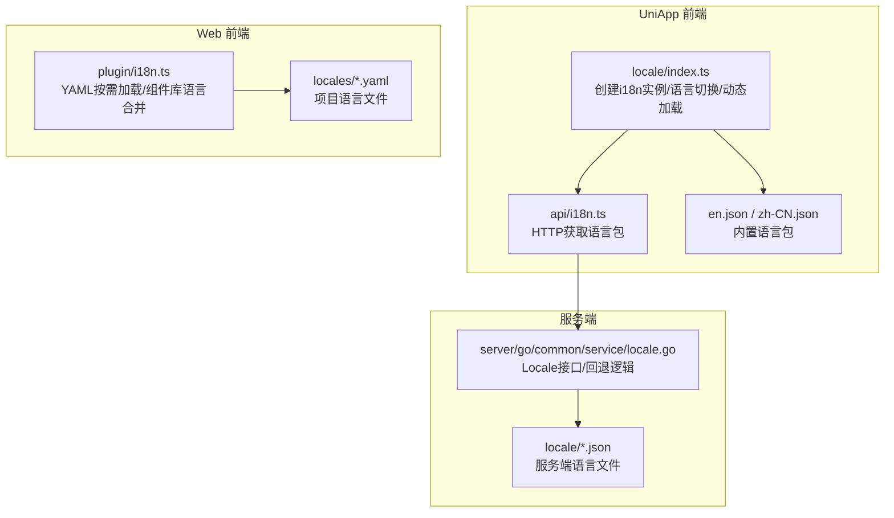
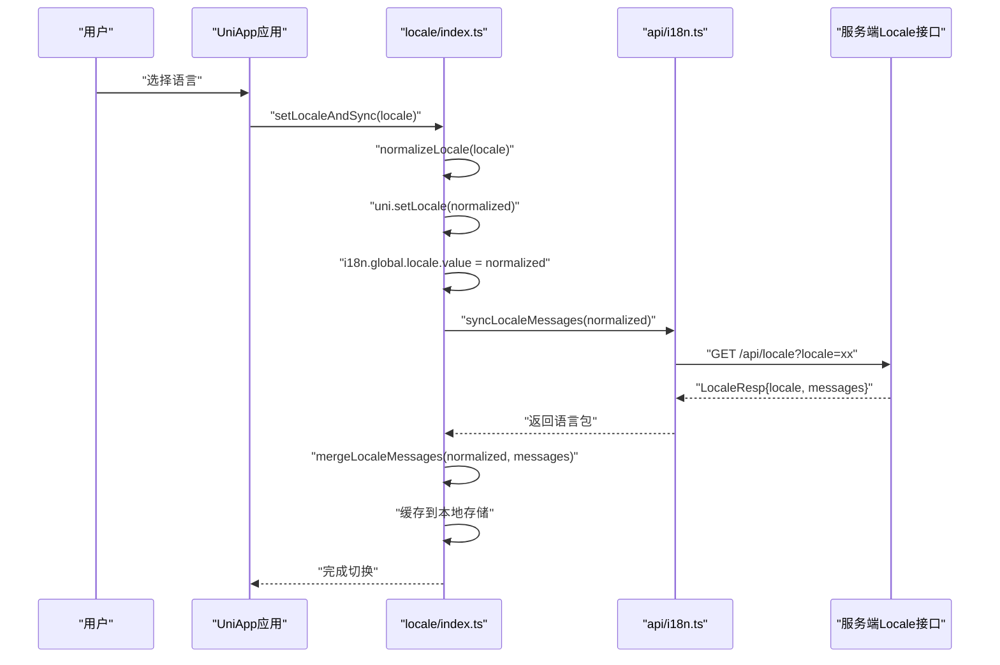
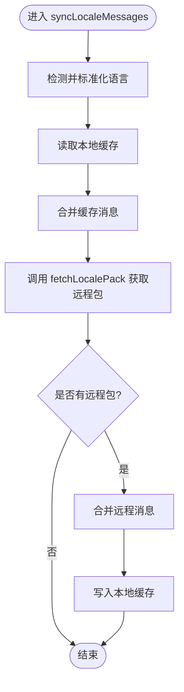
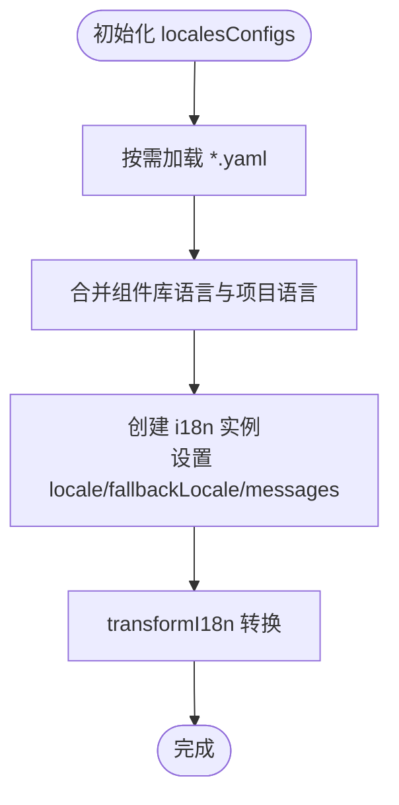
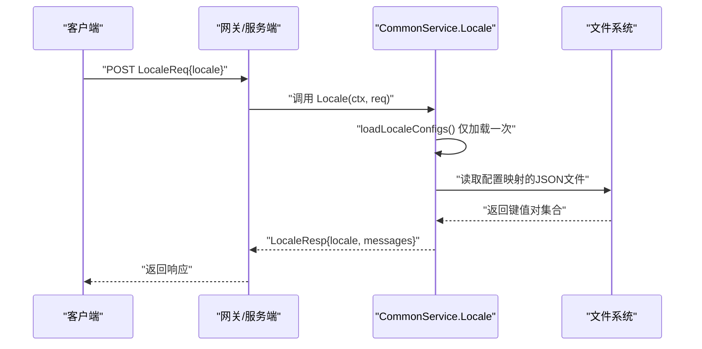
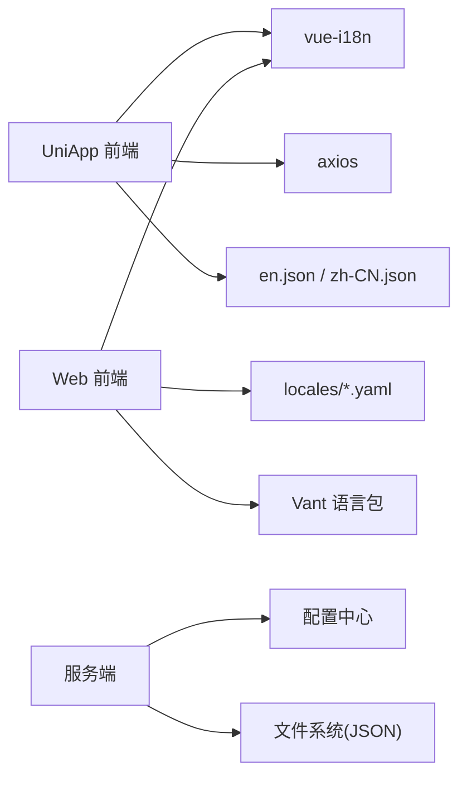

# 国际化支持

<cite>
**本文引用的文件**
- [package.json](file://thirdparty/diamond/package.json)
- [README.md](file://thirdparty/diamond/README.md)
- [index.ts](file://client/uniapp/src/locale/index.ts)
- [en.json](file://client/uniapp/src/locale/en.json)
- [zh-CN.json](file://client/uniapp/src/locale/zh-CN.json)
- [README.md](file://client/uniapp/src/locale/README.md)
- [i18n.ts](file://client/web/src/plugin/i18n.ts)
- [en.yaml](file://client/web/locales/en.yaml)
- [zh-CN.yaml](file://client/web/locales/zh-CN.yaml)
- [i18n.ts](file://client/uniapp/src/api/i18n.ts)
- [locale.go](file://server/go/common/service/locale.go)
</cite>

## 目录
1. [简介](#简介)
2. [项目结构](#项目结构)
3. [核心组件](#核心组件)
4. [架构总览](#架构总览)
5. [详细组件分析](#详细组件分析)
6. [依赖关系分析](#依赖关系分析)
7. [性能考量](#性能考量)
8. [故障排查指南](#故障排查指南)
9. [结论](#结论)
10. [附录](#附录)

## 简介
本指南面向diamond国际化模块，系统性阐述多语言资源管理、本地化配置、语言切换机制与文化适配能力。内容覆盖翻译文件格式、动态加载策略、回退语言处理与语言检测机制，并提供i18n工具函数的使用方法与最佳实践，包括日期时间格式化、数字格式化与货币显示等常用场景的建议与实现思路。

## 项目结构
diamond国际化支持在前端与服务端分别实现：
- UniApp端：基于vue-i18n，内置基础语言包，支持运行时从服务端拉取增量翻译并缓存。
- Web端：基于vue-i18n，通过Vite按需加载YAML语言文件，支持组件库多语言与项目自定义语言包合并。
- 服务端：提供统一的Locale接口，按请求语言加载本地JSON配置并回退至默认语言。

图表来源
- [index.ts:1-116](file://client/uniapp/src/locale/index.ts#L1-L116)
- [i18n.ts:1-13](file://client/uniapp/src/api/i18n.ts#L1-L13)
- [en.json:1-50](file://client/uniapp/src/locale/en.json#L1-L50)
- [zh-CN.json:1-51](file://client/uniapp/src/locale/zh-CN.json#L1-L51)
- [i18n.ts:1-115](file://client/web/src/plugin/i18n.ts#L1-L115)
- [en.yaml:1-282](file://client/web/locales/en.yaml#L1-L282)
- [zh-CN.yaml:1-285](file://client/web/locales/zh-CN.yaml#L1-L285)
- [locale.go:1-53](file://server/go/common/service/locale.go#L1-L53)

章节来源
- [index.ts:1-116](file://client/uniapp/src/locale/index.ts#L1-L116)
- [i18n.ts:1-115](file://client/web/src/plugin/i18n.ts#L1-L115)
- [locale.go:1-53](file://server/go/common/service/locale.go#L1-L53)

## 核心组件
- UniApp端国际化
  - i18n实例创建与回退语言配置
  - 语言标准化与切换
  - 本地缓存与远程同步
  - 翻译工具函数与占位符格式化
- Web端国际化
  - YAML语言文件按需加载
  - 组件库语言与项目语言合并
  - 国际化转换工具函数
- 服务端Locale接口
  - 语言文件加载与回退
  - 统一响应格式

章节来源
- [index.ts:1-116](file://client/uniapp/src/locale/index.ts#L1-L116)
- [i18n.ts:1-115](file://client/web/src/plugin/i18n.ts#L1-L115)
- [locale.go:1-53](file://server/go/common/service/locale.go#L1-L53)

## 架构总览
以下序列图展示UniApp端语言切换与动态加载流程：

图表来源
- [index.ts:45-64](file://client/uniapp/src/locale/index.ts#L45-L64)
- [i18n.ts:10-13](file://client/uniapp/src/api/i18n.ts#L10-L13)
- [locale.go:19-28](file://server/go/common/service/locale.go#L19-L28)

章节来源
- [index.ts:45-64](file://client/uniapp/src/locale/index.ts#L45-L64)
- [i18n.ts:10-13](file://client/uniapp/src/api/i18n.ts#L10-L13)
- [locale.go:19-28](file://server/go/common/service/locale.go#L19-L28)

## 详细组件分析

### UniApp端国际化组件
- i18n实例与回退语言
  - 使用Composition API模式，初始locale来自设备语言，fallbackLocale设为简体中文。
  - 内置语言包作为回退消息源，确保首次渲染稳定。
- 语言标准化与切换
  - normalizeLocale将“zh”“zh-CN”等映射为“zh-CN”，保证键名一致性。
  - setLocaleAndSync负责设置设备语言、更新全局locale并触发同步。
- 动态加载与缓存
  - syncLocaleMessages优先读取本地缓存，再异步拉取远程语言包，成功后写入缓存。
  - fetchLocalePack通过HTTP接口获取语言包，接口参数包含locale。
- 翻译工具函数
  - translate在无匹配时回退为原始key，避免空白输出。
  - formatString与formatI18n提供占位符替换能力，支持数组索引与对象路径。
- 语言文件
  - en.json与zh-CN.json采用扁平键值结构，便于直接映射。

图表来源
- [index.ts:45-57](file://client/uniapp/src/locale/index.ts#L45-L57)
- [i18n.ts:10-13](file://client/uniapp/src/api/i18n.ts#L10-L13)

章节来源
- [index.ts:1-116](file://client/uniapp/src/locale/index.ts#L1-L116)
- [en.json:1-50](file://client/uniapp/src/locale/en.json#L1-L50)
- [zh-CN.json:1-51](file://client/uniapp/src/locale/zh-CN.json#L1-L51)
- [README.md:1-13](file://client/uniapp/src/locale/README.md#L1-L13)

### Web端国际化组件
- YAML语言文件与按需加载
  - 通过import.meta.glob按语言代码加载locales/*.yaml，生成localesConfigs。
  - 组件库语言（如Vant）与项目语言合并，确保UI文案一致。
- 国际化转换工具
  - transformI18n支持嵌套键与非嵌套键两种写法；当传入对象时按当前locale取值。
  - tr为便捷的翻译函数，$t用于IDE智能提示。
- 回退策略
  - i18n实例fallbackLocale设为英文，保证兜底可用。

图表来源
- [i18n.ts:12-36](file://client/web/src/plugin/i18n.ts#L12-L36)
- [i18n.ts:77-99](file://client/web/src/plugin/i18n.ts#L77-L99)
- [i18n.ts:104-112](file://client/web/src/plugin/i18n.ts#L104-L112)

章节来源
- [i18n.ts:1-115](file://client/web/src/plugin/i18n.ts#L1-L115)
- [en.yaml:1-282](file://client/web/locales/en.yaml#L1-L282)
- [zh-CN.yaml:1-285](file://client/web/locales/zh-CN.yaml#L1-L285)

### 服务端Locale接口
- 接口职责
  - 根据请求locale加载对应语言文件，若未找到则回退至配置的默认语言。
  - 返回包含locale与messages的响应，供前端动态合并。
- 文件加载
  - 通过配置项映射locale到具体JSON文件路径，一次性加载并缓存。
  - JSON格式为键值对，键为翻译键，值为对应语言文本。

图表来源
- [locale.go:19-28](file://server/go/common/service/locale.go#L19-L28)
- [locale.go:30-52](file://server/go/common/service/locale.go#L30-L52)

章节来源
- [locale.go:1-53](file://server/go/common/service/locale.go#L1-L53)

## 依赖关系分析
- 前端依赖
  - UniApp端依赖vue-i18n、本地JSON语言包与HTTP客户端。
  - Web端依赖vue-i18n、组件库语言包与Vite按需加载能力。
- 服务端依赖
  - 依赖配置中心提供的语言文件映射与默认语言配置。
- 包管理
  - diamond包管理依赖项包含vue、axios、dayjs等，为国际化与网络请求提供基础能力。

图表来源
- [package.json:48-61](file://thirdparty/diamond/package.json#L48-L61)
- [index.ts:1-30](file://client/uniapp/src/locale/index.ts#L1-L30)
- [i18n.ts:8-10](file://client/web/src/plugin/i18n.ts#L8-L10)
- [locale.go:30-38](file://server/go/common/service/locale.go#L30-L38)

章节来源
- [package.json:1-93](file://thirdparty/diamond/package.json#L1-L93)
- [index.ts:1-30](file://client/uniapp/src/locale/index.ts#L1-L30)
- [i18n.ts:8-10](file://client/web/src/plugin/i18n.ts#L8-L10)
- [locale.go:30-38](file://server/go/common/service/locale.go#L30-L38)

## 性能考量
- 本地缓存与按需加载
  - UniApp端优先使用本地缓存，减少网络请求；仅在缓存缺失时拉取远程包。
  - Web端通过Vite按需加载，避免一次性引入全部语言文件。
- 一次性加载与缓存
  - 服务端仅在首次访问时加载语言文件，后续复用内存缓存，降低IO与解析成本。
- 回退策略
  - 明确的fallbackLocale与内置语言包，避免因网络异常或文件缺失导致的渲染阻塞。

[本节为通用指导，不直接分析具体文件]

## 故障排查指南
- UniApp端常见问题
  - 语言包未生效：检查locale文件夹命名与JSON文件名是否符合uniapp约定；确认normalizeLocale映射正确。
  - 动态加载失败：检查fetchLocalePack的HTTP接口连通性与返回格式；查看控制台错误日志。
  - 本地缓存异常：确认本地存储键名一致且未被意外清理。
- Web端常见问题
  - YAML未生效：确认locales目录与文件命名符合约定；检查Vite按需加载路径。
  - 组件库语言不一致：确认localesConfigs中已合并组件库语言包。
- 服务端常见问题
  - 语言文件未加载：检查配置中心的语言文件映射与文件路径；确认JSON格式正确。
  - 回退无效：确认默认语言配置存在且可读。

章节来源
- [README.md:1-13](file://client/uniapp/src/locale/README.md#L1-L13)
- [index.ts:45-57](file://client/uniapp/src/locale/index.ts#L45-L57)
- [i18n.ts:12-25](file://client/web/src/plugin/i18n.ts#L12-L25)
- [locale.go:30-38](file://server/go/common/service/locale.go#L30-L38)

## 结论
diamond国际化模块在前端与服务端形成完整的闭环：前端负责语言切换、动态加载与本地缓存，服务端提供统一的Locale接口与回退机制。通过明确的文件格式、标准化的键名与清晰的回退策略，系统在易用性与性能之间取得平衡。建议在实际项目中遵循本文档的配置与最佳实践，确保多语言体验稳定一致。

[本节为总结性内容，不直接分析具体文件]

## 附录

### 翻译文件格式与示例
- UniApp端
  - 文件：en.json、zh-CN.json
  - 格式：键值对，键为点号分隔的层级键，值为翻译文本。
  - 示例键：tabbar.home、auth.login、auth.err.account。
- Web端
  - 文件：locales/en.yaml、locales/zh-CN.yaml
  - 格式：YAML，支持嵌套结构，便于组织与维护。
  - 示例键：buttons.pureLogin、login.pureUsername、menus.pureHome。

章节来源
- [en.json:1-50](file://client/uniapp/src/locale/en.json#L1-L50)
- [zh-CN.json:1-51](file://client/uniapp/src/locale/zh-CN.json#L1-L51)
- [en.yaml:1-282](file://client/web/locales/en.yaml#L1-L282)
- [zh-CN.yaml:1-285](file://client/web/locales/zh-CN.yaml#L1-L285)

### 动态加载策略与回退语言
- 动态加载
  - UniApp：本地缓存优先，远程拉取兜底；成功后写入缓存。
  - Web：按需加载YAML；组件库语言与项目语言合并。
- 回退语言
  - UniApp：fallbackLocale为zh-CN；translate在无匹配时回退原key。
  - Web：fallbackLocale为en；transformI18n根据当前locale取值。

章节来源
- [index.ts:25-30](file://client/uniapp/src/locale/index.ts#L25-L30)
- [index.ts:45-57](file://client/uniapp/src/locale/index.ts#L45-L57)
- [i18n.ts:104-112](file://client/web/src/plugin/i18n.ts#L104-L112)
- [i18n.ts:77-99](file://client/web/src/plugin/i18n.ts#L77-L99)

### 语言检测与切换机制
- 设备语言检测
  - UniApp：通过uni.getLocale()获取当前语言；normalizeLocale标准化。
  - Web：通过storage读取上次选择的语言，默认为zh。
- 语言切换
  - UniApp：setLocaleAndSync同时更新设备语言与全局i18n实例。
  - Web：i18n.global.locale直接赋值，随后触发组件更新。

章节来源
- [index.ts:16-21](file://client/uniapp/src/locale/index.ts#L16-L21)
- [index.ts:59-64](file://client/uniapp/src/locale/index.ts#L59-L64)
- [i18n.ts:104-112](file://client/web/src/plugin/i18n.ts#L104-L112)

### i18n工具函数使用方法与最佳实践
- 翻译与回退
  - translate：在无匹配时回退原始key，避免空白输出。
- 占位符格式化
  - formatString：支持数组索引{0}、{1}等。
  - formatI18n：支持对象路径{detail.height}等。
- 国际化转换
  - transformI18n：支持嵌套键与非嵌套键；支持对象动态路由title。
- 最佳实践
  - 键名保持稳定，避免频繁变更；统一使用点号分隔的层级键。
  - 对于复杂模板，优先使用formatI18n以提升可读性与可维护性。
  - 在Web端，确保locales目录与文件命名符合约定，避免按需加载失败。

章节来源
- [index.ts:70-77](file://client/uniapp/src/locale/index.ts#L70-L77)
- [index.ts:85-92](file://client/uniapp/src/locale/index.ts#L85-L92)
- [index.ts:101-113](file://client/uniapp/src/locale/index.ts#L101-L113)
- [i18n.ts:77-99](file://client/web/src/plugin/i18n.ts#L77-L99)

### 日期时间、数字与货币格式化建议
- 日期时间格式化
  - 建议结合dayjs或浏览器Intl.DateTimeFormat进行本地化格式化，避免硬编码。
- 数字格式化
  - 使用Intl.NumberFormat进行千分位、小数位与精度控制。
- 货币显示
  - 使用Intl.NumberFormat的style: 'currency'，并指定合适的货币代码与最小/最大小数位。

[本节为通用指导，不直接分析具体文件]