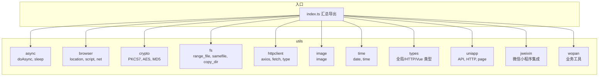
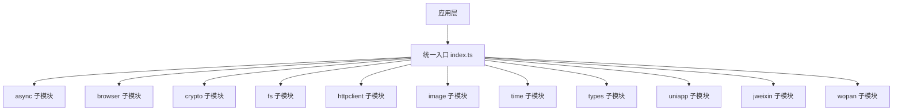
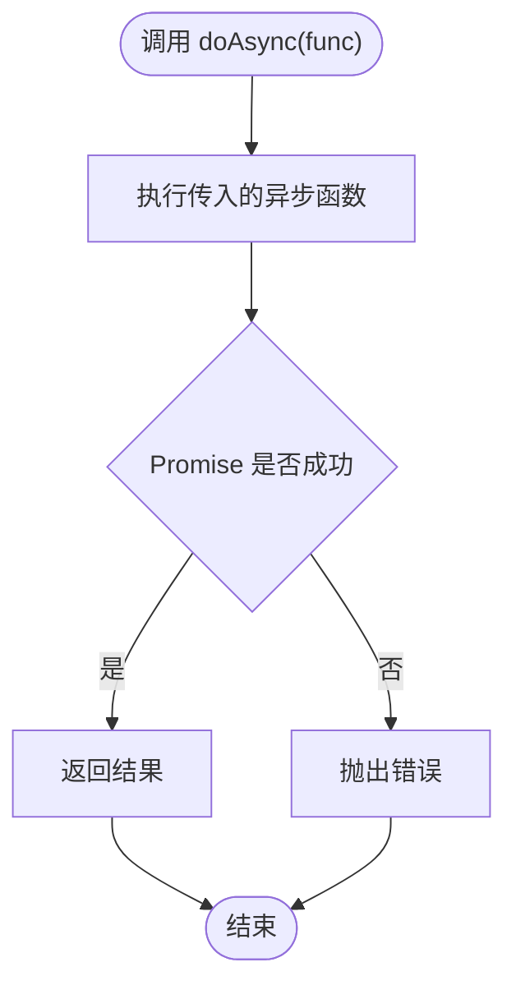
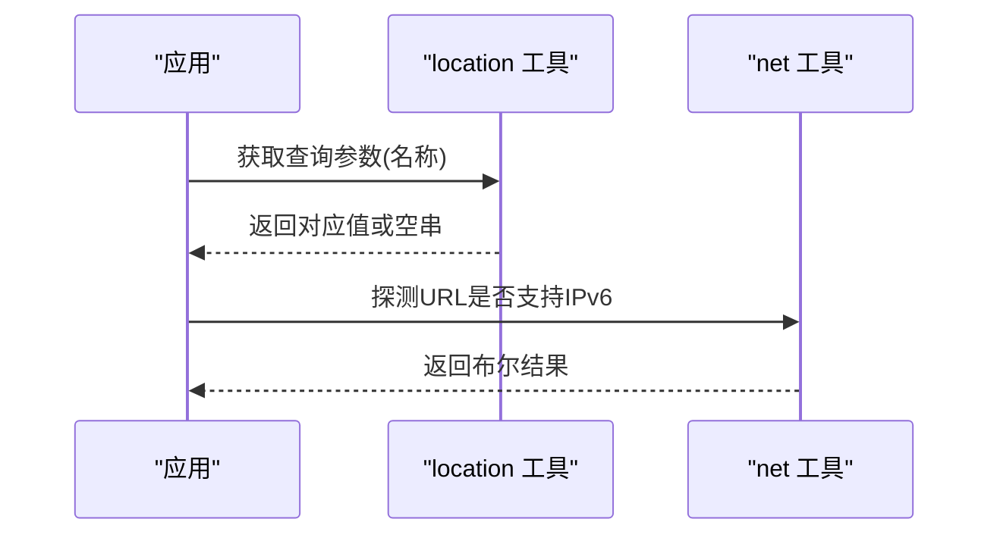
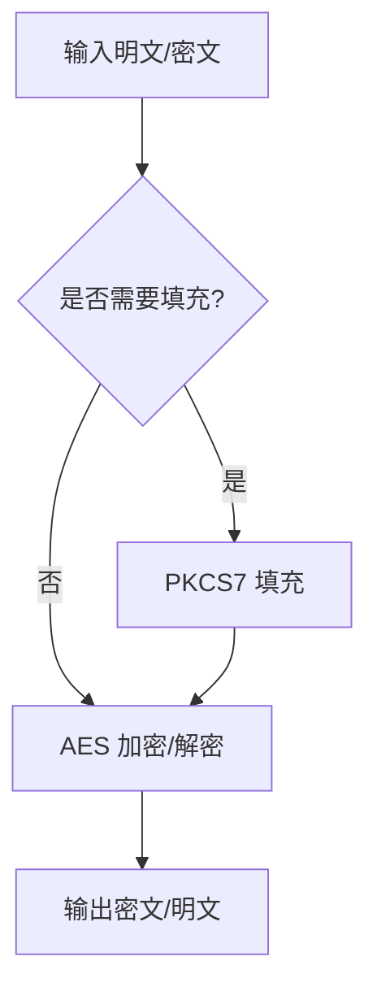
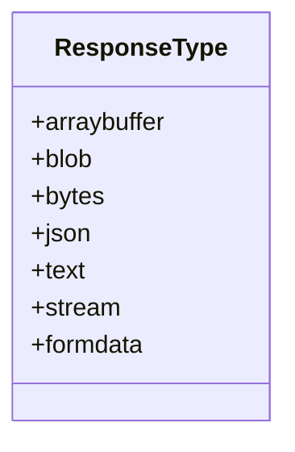
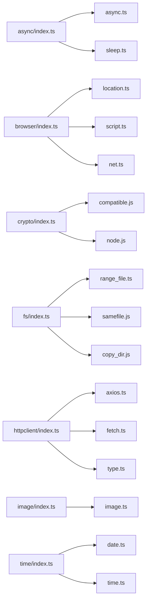

# 工具函数库

<cite>
**本文档引用的文件**
- [async.ts](file://thirdparty/diamond/src/utils/async/async.ts)
- [sleep.ts](file://thirdparty/diamond/src/utils/async/sleep.ts)
- [index.ts](file://thirdparty/diamond/src/utils/async/index.ts)
- [location.ts](file://thirdparty/diamond/src/utils/browser/location.ts)
- [script.ts](file://thirdparty/diamond/src/utils/browser/script.ts)
- [net.ts](file://thirdparty/diamond/src/utils/browser/net.ts)
- [index.ts](file://thirdparty/diamond/src/utils/browser/index.ts)
- [compatible.js](file://thirdparty/diamond/src/utils/crypto/compatible.js)
- [crypto.js](file://thirdparty/diamond/src/utils/crypto/crypto.js)
- [node.js](file://thirdparty/diamond/src/utils/crypto/node.js)
- [index.ts](file://thirdparty/diamond/src/utils/crypto/index.ts)
- [range_file.ts](file://thirdparty/diamond/src/utils/fs/range_file.ts)
- [samefile.js](file://thirdparty/diamond/src/utils/fs/samefile.js)
- [copy_dir.js](file://thirdparty/diamond/src/utils/fs/copy_dir.js)
- [index.ts](file://thirdparty/diamond/src/utils/fs/index.ts)
- [axios.ts](file://thirdparty/diamond/src/utils/httpclient/axios.ts)
- [fetch.ts](file://thirdparty/diamond/src/utils/httpclient/fetch.ts)
- [type.ts](file://thirdparty/diamond/src/utils/httpclient/type.ts)
- [index.ts](file://thirdparty/diamond/src/utils/httpclient/index.ts)
- [image.ts](file://thirdparty/diamond/src/utils/image/image.ts)
- [index.ts](file://thirdparty/diamond/src/utils/image/index.ts)
- [date.ts](file://thirdparty/diamond/src/utils/time/date.ts)
- [time.ts](file://thirdparty/diamond/src/utils/time/time.ts)
- [index.ts](file://thirdparty/diamond/src/utils/time/index.ts)
</cite>

## 目录
1. [简介](#简介)
2. [项目结构](#项目结构)
3. [核心组件](#核心组件)
4. [架构总览](#架构总览)
5. [详细组件分析](#详细组件分析)
6. [依赖关系分析](#依赖关系分析)
7. [性能考量](#性能考量)
8. [故障排查指南](#故障排查指南)
9. [结论](#结论)
10. [附录](#附录)

## 简介
本文件为 diamond 工具函数库的详细 API 文档，覆盖以下能力域：
- 异步处理：统一执行异步函数、延迟等待
- 浏览器兼容：URL 查询参数解析、动态脚本加载、网络能力探测（IPv6）
- 加密解密：PKCS7 填充/去填充、AES-128/256-CBC 加解密、MD5 哈希
- 文件系统：范围读取、跨平台同文件检测、目录复制
- HTTP 客户端封装：Axios/Fetch 封装与响应类型定义
- 图像处理：图像相关工具
- 时间处理：日期与时间工具
- 类型检查：常用类型定义与约束
- 微信小程序集成：JWEIIN 集成入口

本库采用模块化组织，按功能域划分子目录，每个子目录通过 index.ts 汇总导出，便于按需引入。

## 项目结构
diamond 工具库位于 thirdparty/diamond/src 下，核心目录与职责如下：
- utils/async：异步工具（doAsync、sleep）
- utils/browser：浏览器环境工具（location、script、net 等）
- utils/crypto：加密解密工具（PKCS7、Node AES/MD5）
- utils/fs：文件系统工具（range_file、samefile、copy_dir）
- utils/httpclient：HTTP 客户端封装（axios、fetch、type）
- utils/image：图像处理工具
- utils/time：时间处理工具（date、time）
- utils/types：类型定义（全局、HTTP、Vue 等）
- utils/uniapp：UniApp 平台适配（API、HTTP、页面跳转）
- utils/jweixin：微信小程序集成入口
- utils/wopan：特定业务工具（用户、家庭设备等）

图表来源
- [index.ts](file://thirdparty/diamond/src/utils/async/index.ts)
- [index.ts](file://thirdparty/diamond/src/utils/browser/index.ts)
- [index.ts](file://thirdparty/diamond/src/utils/crypto/index.ts)
- [index.ts](file://thirdparty/diamond/src/utils/fs/index.ts)
- [index.ts](file://thirdparty/diamond/src/utils/httpclient/index.ts)
- [index.ts](file://thirdparty/diamond/src/utils/image/index.ts)
- [index.ts](file://thirdparty/diamond/src/utils/time/index.ts)

章节来源
- [index.ts](file://thirdparty/diamond/src/utils/async/index.ts)
- [index.ts](file://thirdparty/diamond/src/utils/browser/index.ts)
- [index.ts](file://thirdparty/diamond/src/utils/crypto/index.ts)
- [index.ts](file://thirdparty/diamond/src/utils/fs/index.ts)
- [index.ts](file://thirdparty/diamond/src/utils/httpclient/index.ts)
- [index.ts](file://thirdparty/diamond/src/utils/image/index.ts)
- [index.ts](file://thirdparty/diamond/src/utils/time/index.ts)

## 核心组件
本节概述各工具域的主要能力与设计理念：
- 异步处理：提供统一的异步执行器与轻量级 sleep，简化并发控制与延时逻辑
- 浏览器兼容：提供历史模式/哈希模式查询解析、动态脚本加载、网络能力探测，增强跨路由与网络环境的兼容性
- 加密解密：支持 PKCS7 填充与 Node 环境下的 AES-128/256-CBC 加解密及 MD5 哈希，满足常见安全需求
- 文件系统：提供范围读取、同文件检测与目录复制，兼顾性能与可移植性
- HTTP 客户端：封装 Axios/Fetch，并定义标准化响应类型，统一错误处理与数据格式
- 图像处理：提供图像相关工具，便于前端展示与预处理
- 时间处理：提供日期与时间工具，便于格式化与计算
- 类型检查：提供全局与平台特定类型定义，提升开发体验与类型安全
- 微信小程序集成：提供 JWEIIN 集成入口，便于在小程序中调用相关能力

章节来源
- [async.ts](file://thirdparty/diamond/src/utils/async/async.ts)
- [sleep.ts](file://thirdparty/diamond/src/utils/async/sleep.ts)
- [location.ts](file://thirdparty/diamond/src/utils/browser/location.ts)
- [script.ts](file://thirdparty/diamond/src/utils/browser/script.ts)
- [net.ts](file://thirdparty/diamond/src/utils/browser/net.ts)
- [crypto.js](file://thirdparty/diamond/src/utils/crypto/crypto.js)
- [node.js](file://thirdparty/diamond/src/utils/crypto/node.js)
- [range_file.ts](file://thirdparty/diamond/src/utils/fs/range_file.ts)
- [samefile.js](file://thirdparty/diamond/src/utils/fs/samefile.js)
- [copy_dir.js](file://thirdparty/diamond/src/utils/fs/copy_dir.js)
- [axios.ts](file://thirdparty/diamond/src/utils/httpclient/axios.ts)
- [fetch.ts](file://thirdparty/diamond/src/utils/httpclient/fetch.ts)
- [type.ts](file://thirdparty/diamond/src/utils/httpclient/type.ts)
- [image.ts](file://thirdparty/diamond/src/utils/image/image.ts)
- [date.ts](file://thirdparty/diamond/src/utils/time/date.ts)
- [time.ts](file://thirdparty/diamond/src/utils/time/time.ts)

## 架构总览
diamond 采用“按功能域分层 + 统一入口导出”的架构设计，便于按需引入与维护。各模块内部保持低耦合，通过 index.ts 聚合导出，减少上层调用方的导入复杂度。

图表来源
- [index.ts](file://thirdparty/diamond/src/utils/async/index.ts)
- [index.ts](file://thirdparty/diamond/src/utils/browser/index.ts)
- [index.ts](file://thirdparty/diamond/src/utils/crypto/index.ts)
- [index.ts](file://thirdparty/diamond/src/utils/fs/index.ts)
- [index.ts](file://thirdparty/diamond/src/utils/httpclient/index.ts)
- [index.ts](file://thirdparty/diamond/src/utils/image/index.ts)
- [index.ts](file://thirdparty/diamond/src/utils/time/index.ts)

## 详细组件分析

### 异步处理工具
- doAsync：接收一个返回 Promise 的函数，尝试执行并抛出异常；当前实现存在同步抛错逻辑，建议结合 try/catch 使用或改为 await
- sleep：基于 setTimeout 的延迟函数，返回 Promise，常用于重试、节流或 UI 动画

图表来源
- [async.ts](file://thirdparty/diamond/src/utils/async/async.ts)

章节来源
- [async.ts](file://thirdparty/diamond/src/utils/async/async.ts)
- [sleep.ts](file://thirdparty/diamond/src/utils/async/sleep.ts)

### 浏览器兼容工具
- URL 查询参数解析：支持历史模式（history）、哈希模式（hash）与普通查询字符串解析；提供按名称获取与整体解析函数
- 动态脚本加载：在 head 中插入 script 标签，支持 onload 回调
- IPv6 能力探测：通过 XMLHttpRequest HEAD 请求探测目标地址是否支持 IPv6

图表来源
- [location.ts](file://thirdparty/diamond/src/utils/browser/location.ts)
- [net.ts](file://thirdparty/diamond/src/utils/browser/net.ts)

章节来源
- [location.ts](file://thirdparty/diamond/src/utils/browser/location.ts)
- [script.ts](file://thirdparty/diamond/src/utils/browser/script.ts)
- [net.ts](file://thirdparty/diamond/src/utils/browser/net.ts)

### 加密解密工具
- PKCS7 填充/去填充：提供标准填充与去填充函数，便于块加密前的数据对齐
- AES-128/256-CBC 加解密：基于 Node 的 crypto 模块，支持 128 与 256 位密钥长度
- MD5 哈希：生成十六进制摘要

图表来源
- [crypto.js](file://thirdparty/diamond/src/utils/crypto/crypto.js)
- [node.js](file://thirdparty/diamond/src/utils/crypto/node.js)

章节来源
- [crypto.js](file://thirdparty/diamond/src/utils/crypto/crypto.js)
- [node.js](file://thirdparty/diamond/src/utils/crypto/node.js)

### 文件系统工具
- 范围读取：支持按字节范围读取文件，适用于断点续传与大文件分片
- 同文件检测：跨平台判断两个路径是否指向同一文件
- 目录复制：递归复制目录内容

章节来源
- [range_file.ts](file://thirdparty/diamond/src/utils/fs/range_file.ts)
- [samefile.js](file://thirdparty/diamond/src/utils/fs/samefile.js)
- [copy_dir.js](file://thirdparty/diamond/src/utils/fs/copy_dir.js)

### HTTP 客户端封装
- axios.ts：Axios 封装（具体实现未在上下文中展开）
- fetch.ts：Fetch 封装（具体实现未在上下文中展开）
- type.ts：标准化响应类型枚举，涵盖 arraybuffer、blob、bytes、json、text、stream、formdata

图表来源
- [type.ts](file://thirdparty/diamond/src/utils/httpclient/type.ts)

章节来源
- [axios.ts](file://thirdparty/diamond/src/utils/httpclient/axios.ts)
- [fetch.ts](file://thirdparty/diamond/src/utils/httpclient/fetch.ts)
- [type.ts](file://thirdparty/diamond/src/utils/httpclient/type.ts)

### 图像处理工具
- image.ts：图像相关工具（具体实现未在上下文中展开）

章节来源
- [image.ts](file://thirdparty/diamond/src/utils/image/image.ts)

### 时间处理工具
- date.ts：日期相关工具（具体实现未在上下文中展开）
- time.ts：时间相关工具（具体实现未在上下文中展开）

章节来源
- [date.ts](file://thirdparty/diamond/src/utils/time/date.ts)
- [time.ts](file://thirdparty/diamond/src/utils/time/time.ts)

## 依赖关系分析
diamond 通过各子模块的 index.ts 进行统一导出，避免上层直接依赖具体实现文件，降低耦合度。例如：
- utils/async/index.ts 汇总导出 async 与 sleep
- utils/browser/index.ts 汇总导出 location、script、net 等
- utils/crypto/index.ts 汇总导出 compatible 与 node
- utils/fs/index.ts 汇总导出 range_file、samefile、copy_dir
- utils/httpclient/index.ts 汇总导出 axios、fetch、type
- utils/image/index.ts 汇总导出 image
- utils/time/index.ts 汇总导出 date 与 time

图表来源
- [index.ts](file://thirdparty/diamond/src/utils/async/index.ts)
- [index.ts](file://thirdparty/diamond/src/utils/browser/index.ts)
- [index.ts](file://thirdparty/diamond/src/utils/crypto/index.ts)
- [index.ts](file://thirdparty/diamond/src/utils/fs/index.ts)
- [index.ts](file://thirdparty/diamond/src/utils/httpclient/index.ts)
- [index.ts](file://thirdparty/diamond/src/utils/image/index.ts)
- [index.ts](file://thirdparty/diamond/src/utils/time/index.ts)

章节来源
- [index.ts](file://thirdparty/diamond/src/utils/async/index.ts)
- [index.ts](file://thirdparty/diamond/src/utils/browser/index.ts)
- [index.ts](file://thirdparty/diamond/src/utils/crypto/index.ts)
- [index.ts](file://thirdparty/diamond/src/utils/fs/index.ts)
- [index.ts](file://thirdparty/diamond/src/utils/httpclient/index.ts)
- [index.ts](file://thirdparty/diamond/src/utils/image/index.ts)
- [index.ts](file://thirdparty/diamond/src/utils/time/index.ts)

## 性能考量
- 异步处理：doAsync 当前存在同步抛错逻辑，建议在调用处使用 await 或 try/catch，避免阻塞主线程
- 文件系统：范围读取适合大文件场景，注意磁盘 IO 与内存占用平衡；同文件检测在 Windows 与类 Unix 上行为可能不同，需结合平台特性使用
- HTTP 客户端：Axios/Fetch 封装应统一错误处理策略与超时配置，避免重复请求与资源浪费
- 加密解密：PKCS7 填充与 AES 加解密涉及字符串编码转换，确保前后端一致；MD5 仅用于非安全场景

## 故障排查指南
- doAsync 执行失败：确认传入函数已正确返回 Promise；在调用处使用 try/catch 捕获异常
- sleep 不生效：检查 delay 参数是否为正数毫秒值；确认事件循环未被阻塞
- URL 查询解析为空：确认路由模式（history/hash）与查询字符串格式；优先使用 location 提供的解析函数
- 动态脚本加载失败：检查回调函数是否正确绑定；关注 onload 时机与 readyState
- IPv6 探测超时：调整 timeout 配置；考虑网络环境与 DNS 解析延迟
- AES 加解密报错：核对 key/iv 长度与编码格式；确保前后端一致
- MD5 结果不一致：确认输入数据编码与大小写

章节来源
- [async.ts](file://thirdparty/diamond/src/utils/async/async.ts)
- [sleep.ts](file://thirdparty/diamond/src/utils/async/sleep.ts)
- [location.ts](file://thirdparty/diamond/src/utils/browser/location.ts)
- [script.ts](file://thirdparty/diamond/src/utils/browser/script.ts)
- [net.ts](file://thirdparty/diamond/src/utils/browser/net.ts)
- [node.js](file://thirdparty/diamond/src/utils/crypto/node.js)

## 结论
diamond 工具函数库以模块化方式组织，覆盖异步、浏览器、加密、文件系统、HTTP、图像、时间、类型与小程序集成等关键领域。通过统一入口导出与清晰的职责划分，降低了上层调用复杂度。建议在实际使用中结合平台特性与性能要求，合理选择工具并遵循最佳实践。

## 附录
- 最佳实践
  - 异步：优先使用 await/async，避免在 doAsync 中直接抛错
  - 浏览器：优先使用 location 提供的解析函数，避免手写正则
  - 加密：前后端统一编码与填充策略；MD5 仅用于非安全场景
  - 文件系统：大文件使用范围读取；跨平台注意路径分隔符
  - HTTP：统一错误处理与超时配置；根据场景选择 Axios 或 Fetch
  - 图像：在展示前进行必要的尺寸与格式处理
  - 时间：统一时区与格式化策略
  - 类型：充分利用类型定义提升开发效率与安全性
  - 小程序：遵循平台限制与权限申请流程