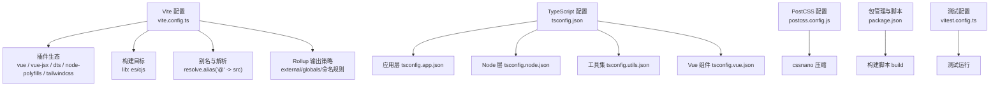
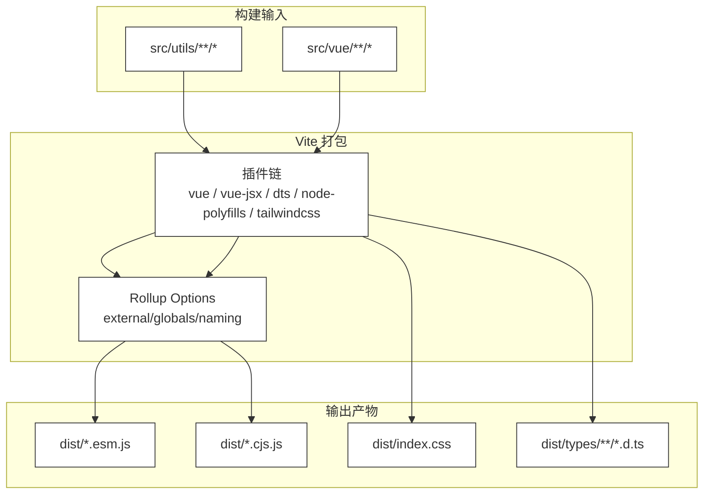
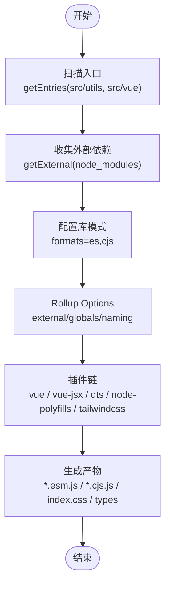
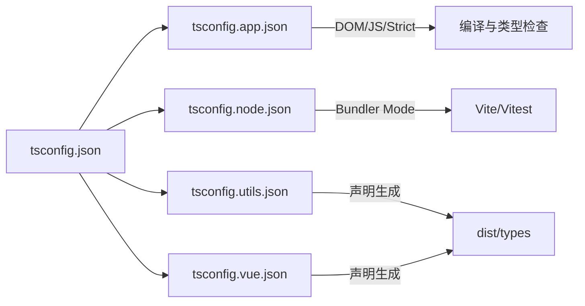
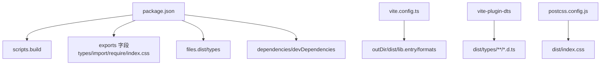

# 构建配置

<cite>
**本文引用的文件**
- [vite.config.ts](file://thirdparty/diamond/vite.config.ts)
- [postcss.config.js](file://thirdparty/diamond/postcss.config.js)
- [tsconfig.json](file://thirdparty/diamond/tsconfig.json)
- [tsconfig.app.json](file://thirdparty/diamond/tsconfig.app.json)
- [tsconfig.node.json](file://thirdparty/diamond/tsconfig.node.json)
- [tsconfig.utils.json](file://thirdparty/diamond/tsconfig.utils.json)
- [tsconfig.vue.json](file://thirdparty/diamond/tsconfig.vue.json)
- [package.json](file://thirdparty/diamond/package.json)
- [vitest.config.ts](file://thirdparty/diamond/vitest.config.ts)
</cite>

## 目录
1. [简介](#简介)
2. [项目结构](#项目结构)
3. [核心组件](#核心组件)
4. [架构总览](#架构总览)
5. [详细组件分析](#详细组件分析)
6. [依赖关系分析](#依赖关系分析)
7. [性能考虑](#性能考虑)
8. [故障排查指南](#故障排查指南)
9. [结论](#结论)
10. [附录](#附录)

## 简介
本文件面向 diamond 的构建配置，系统性梳理 Vite 构建工具配置、PostCSS 预处理、TypeScript 编译体系与多入口库打包策略，并结合实际代码对开发服务器、生产构建优化、代码分割与资源打包规则进行深入解读。同时提供构建性能优化建议、热重载配置要点以及自定义插件开发指南，帮助读者在多项目场景下高效落地与维护构建体系。

## 项目结构
diamond 构建子工程位于 thirdparty/diamond，采用“多入口库”模式输出 ES 与 CJS 两种格式，配合类型声明生成与 TailwindCSS 集成，形成可复用的前端工具与组件库能力。其核心配置由 Vite、TypeScript 与 PostCSS 共同构成，分别负责打包、类型与样式管线。

图表来源
- [vite.config.ts:57-138](file://thirdparty/diamond/vite.config.ts#L57-L138)
- [tsconfig.json:1-8](file://thirdparty/diamond/tsconfig.json#L1-L8)
- [tsconfig.app.json:1-21](file://thirdparty/diamond/tsconfig.app.json#L1-L21)
- [tsconfig.node.json:1-26](file://thirdparty/diamond/tsconfig.node.json#L1-L26)
- [tsconfig.utils.json:1-17](file://thirdparty/diamond/tsconfig.utils.json#L1-L17)
- [tsconfig.vue.json:1-18](file://thirdparty/diamond/tsconfig.vue.json#L1-L18)
- [postcss.config.js:1-9](file://thirdparty/diamond/postcss.config.js#L1-L9)
- [package.json:19-27](file://thirdparty/diamond/package.json#L19-L27)
- [vitest.config.ts:1-8](file://thirdparty/diamond/vitest.config.ts#L1-L8)

章节来源
- [vite.config.ts:1-142](file://thirdparty/diamond/vite.config.ts#L1-L142)
- [tsconfig.json:1-8](file://thirdparty/diamond/tsconfig.json#L1-L8)
- [tsconfig.app.json:1-21](file://thirdparty/diamond/tsconfig.app.json#L1-L21)
- [tsconfig.node.json:1-26](file://thirdparty/diamond/tsconfig.node.json#L1-L26)
- [tsconfig.utils.json:1-17](file://thirdparty/diamond/tsconfig.utils.json#L1-L17)
- [tsconfig.vue.json:1-18](file://thirdparty/diamond/tsconfig.vue.json#L1-L18)
- [postcss.config.js:1-9](file://thirdparty/diamond/postcss.config.js#L1-L9)
- [package.json:1-93](file://thirdparty/diamond/package.json#L1-L93)
- [vitest.config.ts:1-8](file://thirdparty/diamond/vitest.config.ts#L1-L8)

## 核心组件
- Vite 构建配置：定义多入口扫描、外部依赖排除、Rollup 输出策略（命名、全局变量映射）、插件链路与别名解析。
- TypeScript 配置：通过复合 tsconfig 管理应用层、Node 层、工具集与 Vue 组件的编译上下文，确保类型与路径一致。
- PostCSS 配置：集成 cssnano 进行生产环境 CSS 压缩。
- 测试配置：基于 Vitest 的全局测试环境与匹配规则。

章节来源
- [vite.config.ts:57-138](file://thirdparty/diamond/vite.config.ts#L57-L138)
- [tsconfig.app.json:1-21](file://thirdparty/diamond/tsconfig.app.json#L1-L21)
- [tsconfig.node.json:1-26](file://thirdparty/diamond/tsconfig.node.json#L1-L26)
- [tsconfig.utils.json:1-17](file://thirdparty/diamond/tsconfig.utils.json#L1-L17)
- [tsconfig.vue.json:1-18](file://thirdparty/diamond/tsconfig.vue.json#L1-L18)
- [postcss.config.js:1-9](file://thirdparty/diamond/postcss.config.js#L1-L9)
- [vitest.config.ts:1-8](file://thirdparty/diamond/vitest.config.ts#L1-L8)

## 架构总览
diamond 的构建体系围绕“多入口库 + 类型声明 + 样式压缩”的目标展开。Vite 负责将 src/utils 与 src/vue 下的模块打包为 ES 与 CJS 两套产物；TypeScript 配置确保类型生成与路径别名一致；PostCSS 在生产阶段对 CSS 进行压缩；测试配置提供统一的单元测试执行环境。

图表来源
- [vite.config.ts:57-138](file://thirdparty/diamond/vite.config.ts#L57-L138)
- [tsconfig.utils.json:1-17](file://thirdparty/diamond/tsconfig.utils.json#L1-L17)
- [tsconfig.vue.json:1-18](file://thirdparty/diamond/tsconfig.vue.json#L1-L18)

## 详细组件分析

### Vite 构建配置（多入口库）
- 多入口扫描：通过 getEntries 动态扫描 src/utils 与 src/vue 下的入口文件，支持 index.ts/js，自动解析为 Rollup entry。
- 外部依赖排除：getExternal 自动遍历 node_modules，按包名与命名空间（@scope）收集外部依赖，避免将第三方库打入产物。
- 库模式输出：lib.formats 指定 es 与 cjs；Rollup 输出命名规则保证文件名稳定且可识别；CSS 资源统一输出为 index.css。
- 全局变量映射：globals 映射 spark-md5、dayjs、vue、element-plus、pure-admin/table 等，便于在非模块环境中消费。
- 插件链路：vue、vue-jsx、tailwindcss、vite-plugin-dts（两次调用分别针对 utils 与 vue）、vite-plugin-node-polyfills。

图表来源
- [vite.config.ts:10-28](file://thirdparty/diamond/vite.config.ts#L10-L28)
- [vite.config.ts:30-46](file://thirdparty/diamond/vite.config.ts#L30-L46)
- [vite.config.ts:57-138](file://thirdparty/diamond/vite.config.ts#L57-L138)

章节来源
- [vite.config.ts:10-28](file://thirdparty/diamond/vite.config.ts#L10-L28)
- [vite.config.ts:30-46](file://thirdparty/diamond/vite.config.ts#L30-L46)
- [vite.config.ts:49-56](file://thirdparty/diamond/vite.config.ts#L49-L56)
- [vite.config.ts:57-138](file://thirdparty/diamond/vite.config.ts#L57-L138)

### TypeScript 编译配置
- 复合配置：根 tsconfig.json 通过 references 引入应用层、Node 层、工具集与 Vue 组件的独立 tsconfig。
- 应用层 tsconfig.app.json：启用 DOM 与 ESNext 能力，开启严格模式与未使用检测，引入 @dcloudio/types 与 element-plus/global 类型，支持 JS 兼容与 sourceMap。
- Node 层 tsconfig.node.json：Bundler 模式，强制 moduleDetection 与 noEmit，仅用于 Vite/Vitest 等工具层配置。
- 工具集 tsconfig.utils.json：针对 src/utils 的声明生成与排除测试文件。
- Vue 组件 tsconfig.vue.json：针对 src/vue 与类型共享目录的声明生成。

图表来源
- [tsconfig.json:1-8](file://thirdparty/diamond/tsconfig.json#L1-L8)
- [tsconfig.app.json:1-21](file://thirdparty/diamond/tsconfig.app.json#L1-L21)
- [tsconfig.node.json:1-26](file://thirdparty/diamond/tsconfig.node.json#L1-L26)
- [tsconfig.utils.json:1-17](file://thirdparty/diamond/tsconfig.utils.json#L1-L17)
- [tsconfig.vue.json:1-18](file://thirdparty/diamond/tsconfig.vue.json#L1-L18)

章节来源
- [tsconfig.json:1-8](file://thirdparty/diamond/tsconfig.json#L1-L8)
- [tsconfig.app.json:1-21](file://thirdparty/diamond/tsconfig.app.json#L1-L21)
- [tsconfig.node.json:1-26](file://thirdparty/diamond/tsconfig.node.json#L1-L26)
- [tsconfig.utils.json:1-17](file://thirdparty/diamond/tsconfig.utils.json#L1-L17)
- [tsconfig.vue.json:1-18](file://thirdparty/diamond/tsconfig.vue.json#L1-L18)

### PostCSS 预处理配置
- 生产环境压缩：通过 postcss.config.js 启用 cssnano 对 CSS 进行压缩与优化，减少产物体积。
- 集成方式：与 TailwindCSS 插件共同工作，先生成样式再进行压缩。

章节来源
- [postcss.config.js:1-9](file://thirdparty/diamond/postcss.config.js#L1-L9)

### 测试配置（Vitest）
- 全局测试环境：启用 globals，便于直接使用测试 API。
- 匹配规则：包含 src 下以 .spec 或 .test 结尾的 TS/JS 文件。

章节来源
- [vitest.config.ts:1-8](file://thirdparty/diamond/vitest.config.ts#L1-L8)

## 依赖关系分析
diamond 构建配置与包管理脚本紧密耦合，构建脚本与导出字段共同决定产物可用性与消费方式。

图表来源
- [package.json:19-34](file://thirdparty/diamond/package.json#L19-L34)
- [package.json:10-18](file://thirdparty/diamond/package.json#L10-L18)
- [vite.config.ts:112-138](file://thirdparty/diamond/vite.config.ts#L112-L138)
- [postcss.config.js:1-9](file://thirdparty/diamond/postcss.config.js#L1-9)

章节来源
- [package.json:1-93](file://thirdparty/diamond/package.json#L1-L93)
- [vite.config.ts:112-138](file://thirdparty/diamond/vite.config.ts#L112-L138)
- [postcss.config.js:1-9](file://thirdparty/diamond/postcss.config.js#L1-L9)

## 性能考虑
- 外部化策略：通过 getExternal 自动收集 node_modules 中的包与命名空间，避免将第三方库打入产物，显著降低体积与重复依赖。
- 产物命名：entryFileNames 与 chunkFileNames 使用稳定命名规则，利于缓存与 CDN 分发。
- 类型声明：分模块生成 d.ts，避免全量声明带来的编译与打包压力。
- CSS 压缩：生产阶段启用 cssnano，进一步减小样式体积。
- 并行与增量：Vite 默认热更新与快速打包；在大型项目中可结合预构建与依赖拆分优化启动速度。

## 故障排查指南
- 无法识别的模块或类型错误
  - 检查 tsconfig.app.json 的 paths 与 @ 别名是否与实际目录一致。
  - 确认 types 字段包含必要的全局类型（如 element-plus/global）。
- 第三方库被打包进产物
  - 检查 getExternal 是否正确识别到该包；确认 node_modules 中是否存在命名空间包。
- CSS 未被压缩或样式缺失
  - 确认 postcss.config.js 已启用 cssnano；检查 Rollup 输出的 CSS 文件名与导出映射。
- 类型声明不完整
  - 确认 vite-plugin-dts 的 entryRoot 与 tsconfig 对应模块范围一致；检查 copyDtsFiles 与 beforeWriteFile 的路径转换逻辑。
- 测试无法运行
  - 确认 vitest.config.ts 的 include 规则覆盖到目标测试文件；确保 scripts.test 正确指向 vitest。

章节来源
- [tsconfig.app.json:8-11](file://thirdparty/diamond/tsconfig.app.json#L8-L11)
- [tsconfig.app.json:6](file://thirdparty/diamond/tsconfig.app.json#L6)
- [vite.config.ts:30-46](file://thirdparty/diamond/vite.config.ts#L30-L46)
- [postcss.config.js:6](file://thirdparty/diamond/postcss.config.js#L6)
- [vite.config.ts:62-93](file://thirdparty/diamond/vite.config.ts#L62-L93)
- [vitest.config.ts:4-7](file://thirdparty/diamond/vitest.config.ts#L4-L7)

## 结论
diamond 的构建配置以“多入口库 + 类型声明 + 样式压缩”为核心，通过 Vite 的灵活插件生态与 TypeScript 的复合配置体系，实现了高内聚、低耦合的可复用工具与组件库产出。配合合理的外部化策略、稳定的命名规则与生产期 CSS 压缩，能够在多项目场景下提供一致、高效的构建体验。

## 附录
- 开发服务器与热重载
  - Vite 默认提供开发服务器与热重载能力；可在本地开发时直接运行 Vite，无需额外配置。
- 自定义插件开发
  - 可参考现有插件链路，在 vite.config.ts 的 plugins 数组中添加自定义插件；注意与 dts、node-polyfills、tailwindcss 的顺序与兼容性。
- 多项目构建策略
  - 将公共工具与组件收敛至 diamond 子工程，其他项目通过包管理器安装并消费其导出；通过 exports 字段与 dist/types 确保类型与运行时一致性。