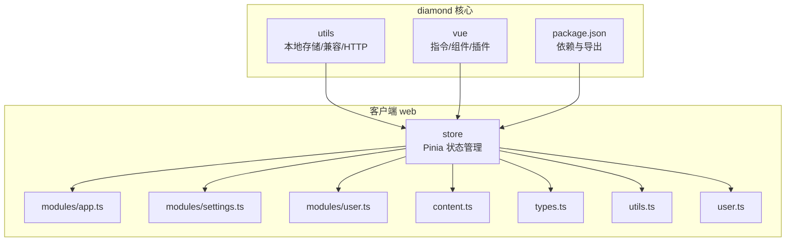
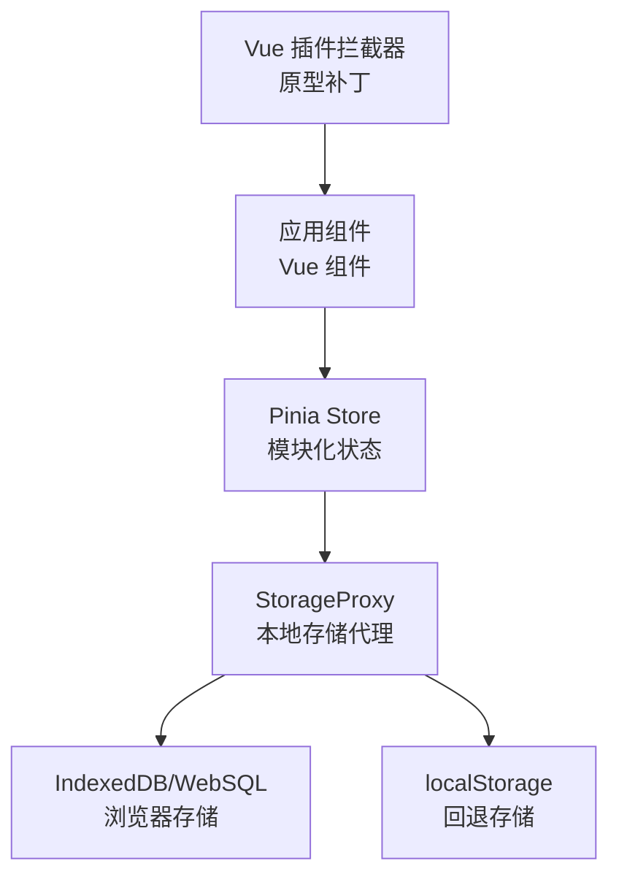
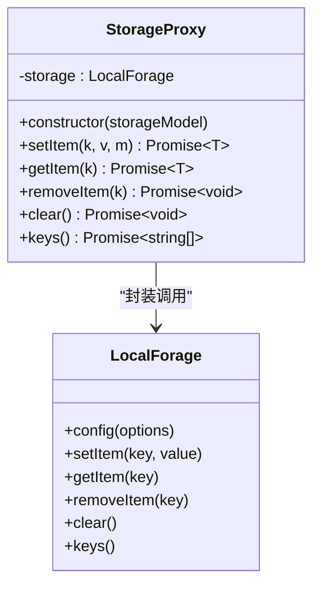
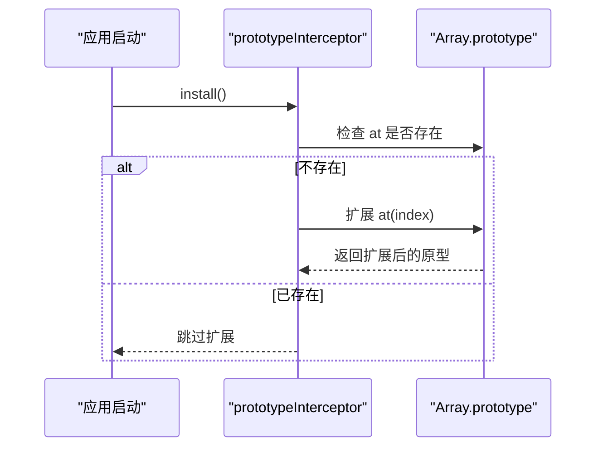
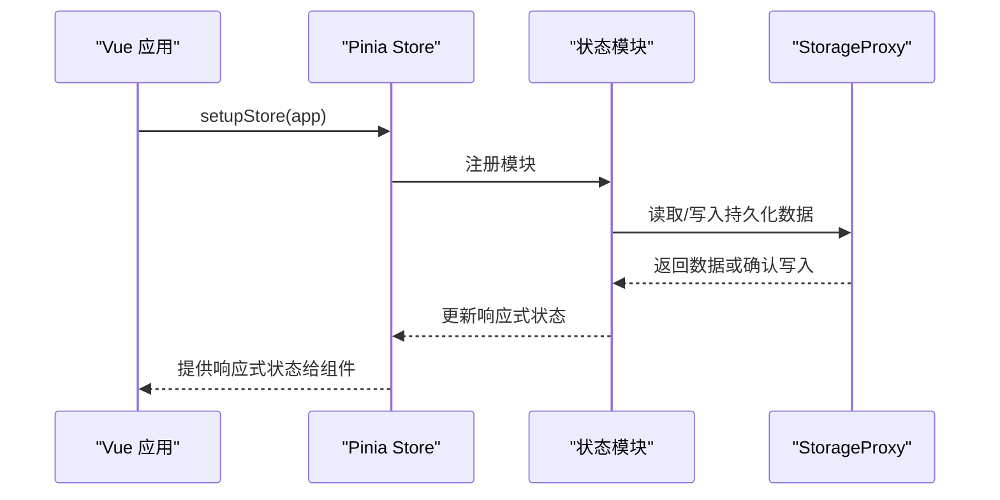
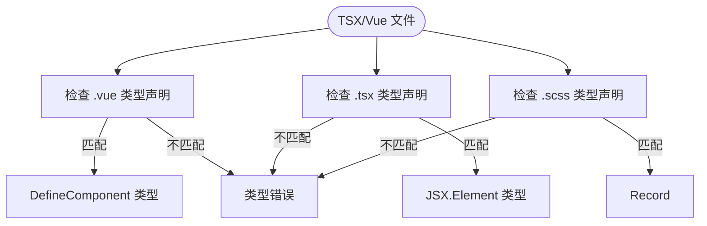
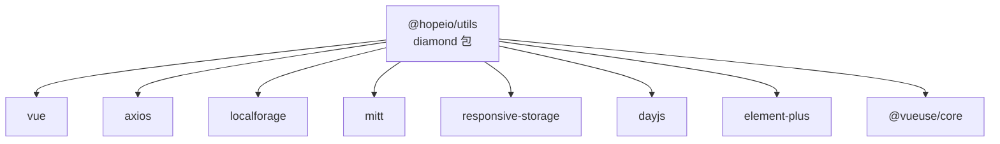

# 状态管理工具

<cite>
**本文档引用的文件**
- [package.json](file://thirdparty/diamond/package.json)
- [README.md](file://thirdparty/diamond/README.md)
- [interceptor.ts](file://thirdparty/diamond/src/vue/plugin/interceptor.ts)
- [index.ts](file://thirdparty/diamond/src/vue/plugin/index.ts)
- [index.ts](file://thirdparty/diamond/src/vue/vue/index.ts)
- [index.ts](file://thirdparty/diamond/src/utils/localforage/index.ts)
- [vue.d.ts](file://thirdparty/diamond/src/utils/types/vue.d.ts)
- [index.ts](file://client/web/src/store/index.ts)
- [app.ts](file://client/web/src/store/modules/app.ts)
- [settings.ts](file://client/web/src/store/modules/settings.ts)
- [user.ts](file://client/web/src/store/modules/user.ts)
- [content.ts](file://client/web/src/store/content.ts)
- [types.ts](file://client/web/src/store/types.ts)
- [utils.ts](file://client/web/src/store/utils.ts)
- [user.ts](file://client/web/src/store/user.ts)
</cite>

## 目录
1. [简介](#简介)
2. [项目结构](#项目结构)
3. [核心组件](#核心组件)
4. [架构总览](#架构总览)
5. [详细组件分析](#详细组件分析)
6. [依赖关系分析](#依赖关系分析)
7. [性能考虑](#性能考虑)
8. [故障排除指南](#故障排除指南)
9. [结论](#结论)
10. [附录](#附录)

## 简介
本指南面向使用 diamond 状态管理工具的开发者，系统讲解全局状态管理、本地存储解决方案、响应式存储工具以及 Vue 插件系统的实现与使用方法。文档覆盖状态持久化策略、跨页面状态共享、存储适配器配置与插件扩展机制，并提供最佳实践与性能优化建议。

## 项目结构
diamond 位于 thirdparty/diamond 目录，采用模块化组织方式：
- utils：通用工具集，包含本地存储封装、兼容性处理、HTTP 客户端等
- vue：Vue 生态相关组件与插件，包括指令、消息组件、插件拦截器等
- 测试与示例：用于验证工具与组件的行为

客户端 web 项目（client/web）采用 Pinia 进行全局状态管理，配合 diamond 的本地存储工具实现持久化。

**图表来源**
- [package.json:1-93](file://thirdparty/diamond/package.json#L1-L93)
- [index.ts:1-110](file://thirdparty/diamond/src/utils/localforage/index.ts#L1-L110)
- [index.ts:1-1](file://thirdparty/diamond/src/vue/plugin/index.ts#L1-L1)
- [index.ts:1-10](file://client/web/src/store/index.ts#L1-L10)

**章节来源**
- [package.json:1-93](file://thirdparty/diamond/package.json#L1-L93)
- [README.md:1-6](file://thirdparty/diamond/README.md#L1-L6)

## 核心组件
- 本地存储代理（localforage 封装）：提供带过期时间的异步存储能力，自动在 IndexedDB 与 localStorage 间降级
- Vue 插件拦截器：对原生原型进行兼容性增强（如数组 at 方法），确保低端设备稳定运行
- Pinia 全局状态：在客户端 web 中集中管理应用状态，模块化拆分业务域
- 类型声明：为 TSX/Vue 文件提供 JSX 与组件类型支持

**章节来源**
- [index.ts:1-110](file://thirdparty/diamond/src/utils/localforage/index.ts#L1-L110)
- [interceptor.ts:1-14](file://thirdparty/diamond/src/vue/plugin/interceptor.ts#L1-L14)
- [index.ts:1-1](file://thirdparty/diamond/src/vue/plugin/index.ts#L1-L1)
- [index.ts:1-10](file://client/web/src/store/index.ts#L1-L10)
- [vue.d.ts:1-34](file://thirdparty/diamond/src/utils/types/vue.d.ts#L1-L34)

## 架构总览
diamond 的状态管理由三层构成：
- 存储层：基于 localforage 的 StorageProxy，负责键值读写、过期控制与驱动选择
- 状态层：Pinia Store，提供模块化状态与响应式更新
- 插件层：Vue 插件拦截器，保证运行环境兼容性

**图表来源**
- [index.ts:1-110](file://thirdparty/diamond/src/utils/localforage/index.ts#L1-L110)
- [index.ts:1-10](file://client/web/src/store/index.ts#L1-L10)
- [interceptor.ts:1-14](file://thirdparty/diamond/src/vue/plugin/interceptor.ts#L1-L14)

## 详细组件分析

### 本地存储代理（StorageProxy）
StorageProxy 对 localforage 进行二次封装，提供以下能力：
- 驱动优先级：优先使用 IndexedDB，不支持时自动降级至 localStorage
- 过期控制：写入时附带过期时间，读取时校验并过滤过期数据
- 异步接口：统一 Promise 化的 set/get/remove/clear/keys 操作

**图表来源**
- [index.ts:1-110](file://thirdparty/diamond/src/utils/localforage/index.ts#L1-L110)

**章节来源**
- [index.ts:1-110](file://thirdparty/diamond/src/utils/localforage/index.ts#L1-L110)

### Vue 插件拦截器（prototypeInterceptor）
该拦截器在应用启动时执行，解决低端设备不支持 Array.prototype.at 的问题，通过向原生原型添加方法实现兼容。

**图表来源**
- [interceptor.ts:1-14](file://thirdparty/diamond/src/vue/plugin/interceptor.ts#L1-L14)

**章节来源**
- [interceptor.ts:1-14](file://thirdparty/diamond/src/vue/plugin/interceptor.ts#L1-L14)
- [index.ts:1-1](file://thirdparty/diamond/src/vue/plugin/index.ts#L1-L1)

### Pinia 全局状态（客户端 web）
客户端 web 使用 Pinia 提供全局状态管理，入口文件负责安装 store 并导出实例；模块按业务域拆分，便于跨页面共享状态。

**图表来源**
- [index.ts:1-10](file://client/web/src/store/index.ts#L1-L10)
- [app.ts](file://client/web/src/store/modules/app.ts)
- [settings.ts](file://client/web/src/store/modules/settings.ts)
- [user.ts](file://client/web/src/store/modules/user.ts)
- [content.ts](file://client/web/src/store/content.ts)
- [types.ts](file://client/web/src/store/types.ts)
- [utils.ts](file://client/web/src/store/utils.ts)
- [user.ts](file://client/web/src/store/user.ts)

**章节来源**
- [index.ts:1-10](file://client/web/src/store/index.ts#L1-L10)
- [app.ts](file://client/web/src/store/modules/app.ts)
- [settings.ts](file://client/web/src/store/modules/settings.ts)
- [user.ts](file://client/web/src/store/modules/user.ts)
- [content.ts](file://client/web/src/store/content.ts)
- [types.ts](file://client/web/src/store/types.ts)
- [utils.ts](file://client/web/src/store/utils.ts)
- [user.ts](file://client/web/src/store/user.ts)

### 类型声明与 Vue 集成
diamond 提供 TypeScript 类型声明，确保：
- *.vue 文件可被正确识别为组件
- *.tsx 文件具备 JSX 类型支持
- SCSS 模块映射为字符串记录

**图表来源**
- [vue.d.ts:1-34](file://thirdparty/diamond/src/utils/types/vue.d.ts#L1-L34)

**章节来源**
- [vue.d.ts:1-34](file://thirdparty/diamond/src/utils/types/vue.d.ts#L1-L34)

## 依赖关系分析
diamond 通过 package.json 声明核心依赖，其中包含：
- Vue 3 与相关生态（如 VueUse、Element Plus）
- HTTP 客户端（axios）
- 本地存储（localforage）
- 事件总线（mitt）
- 响应式存储（responsive-storage）

**图表来源**
- [package.json:48-61](file://thirdparty/diamond/package.json#L48-L61)

**章节来源**
- [package.json:1-93](file://thirdparty/diamond/package.json#L1-L93)

## 性能考虑
- 存储驱动选择：StorageProxy 优先使用 IndexedDB，容量更大且支持复杂数据类型；localStorage 作为回退，适合轻量数据
- 过期策略：合理设置缓存过期时间，避免无限制增长；定期清理过期数据
- 状态粒度：Pinia 模块按业务域拆分，避免不必要的响应式更新
- 插件兼容：仅在需要时启用拦截器，减少对原生原型的修改
- 异步操作：统一使用 Promise 化接口，避免阻塞主线程

## 故障排除指南
- 低端设备报错：确认 prototypeInterceptor 已在应用启动阶段安装，确保 Array.prototype.at 可用
- 存储异常：检查浏览器是否支持 IndexedDB；若不支持，确认 localStorage 正常工作
- 类型错误：确保 TSX/Vue 文件遵循类型声明规范，必要时引入 vue.d.ts
- 状态未更新：检查 Pinia 模块是否正确注册，组件是否使用响应式 getter/setter

**章节来源**
- [interceptor.ts:1-14](file://thirdparty/diamond/src/vue/plugin/interceptor.ts#L1-L14)
- [index.ts:1-110](file://thirdparty/diamond/src/utils/localforage/index.ts#L1-L110)
- [vue.d.ts:1-34](file://thirdparty/diamond/src/utils/types/vue.d.ts#L1-L34)
- [index.ts:1-10](file://client/web/src/store/index.ts#L1-L10)

## 结论
diamond 提供了从本地存储到 Vue 插件的完整状态管理基础设施。通过 StorageProxy 实现可靠的持久化，借助 Pinia 实现模块化与响应式状态，再以插件拦截器保障运行环境兼容性。结合合理的过期策略与模块拆分，可在多页面场景下高效共享状态并保持良好性能。

## 附录
- 开发与发布：参考 diamond 的 README 与 package.json 脚本，完成本地链接与发布流程
- 最佳实践清单
  - 使用 StorageProxy 管理持久化数据，设置合理过期时间
  - 将状态按业务域拆分为多个 Pinia 模块
  - 在应用启动时安装 Vue 插件拦截器
  - 为复杂组件提供明确的类型声明

**章节来源**
- [README.md:1-6](file://thirdparty/diamond/README.md#L1-L6)
- [package.json:19-27](file://thirdparty/diamond/package.json#L19-L27)