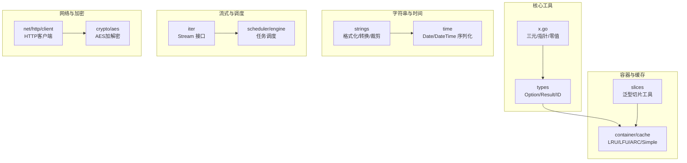
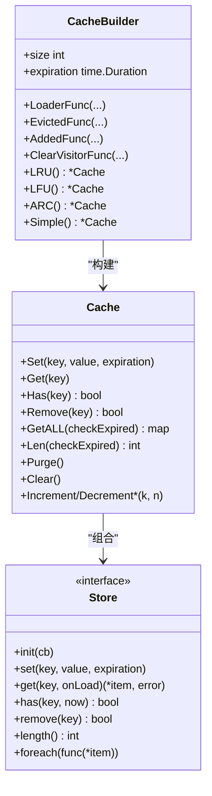
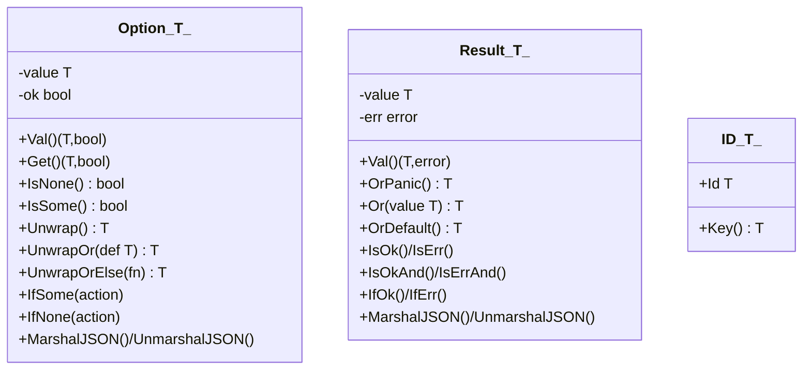
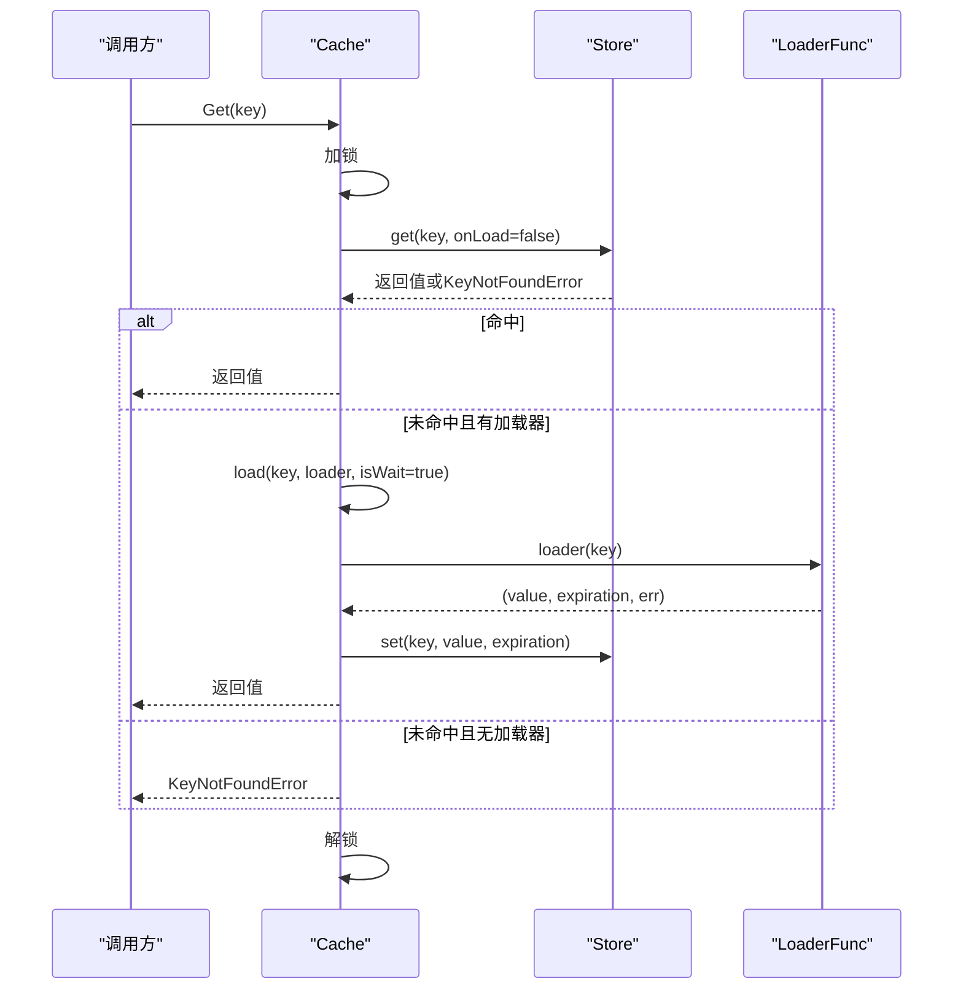
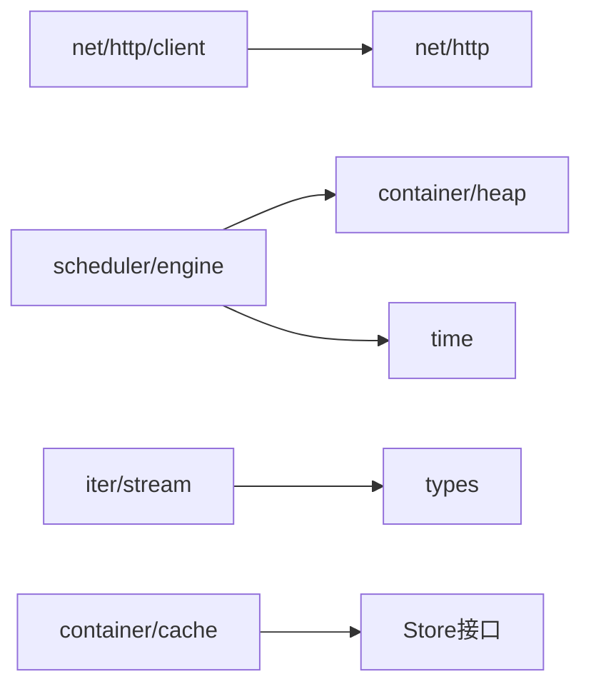

# gox核心库

<cite>
**本文档引用的文件**
- [x.go](file://thirdparty/gox/x.go)
- [README.md](file://thirdparty/gox/README.md)
- [go.mod](file://thirdparty/gox/go.mod)
- [types.go](file://thirdparty/gox/types/types.go)
- [cache.go](file://thirdparty/gox/container/cache/cache.go)
- [aes.go](file://thirdparty/gox/crypto/aes/aes.go)
- [strings.go](file://thirdparty/gox/strings/strings.go)
- [datetime.go](file://thirdparty/gox/time/datetime.go)
- [slice.go](file://thirdparty/gox/slices/slice.go)
- [stream.go](file://thirdparty/gox/iter/stream.go)
- [engine.go](file://thirdparty/gox/scheduler/engine/engine.go)
- [client.go](file://thirdparty/gox/net/http/client/client.go)
- [option.go](file://thirdparty/gox/types/option.go)
- [result.go](file://thirdparty/gox/types/result.go)
</cite>

## 目录
1. [简介](#简介)
2. [项目结构](#项目结构)
3. [核心组件](#核心组件)
4. [架构总览](#架构总览)
5. [详细组件分析](#详细组件分析)
6. [依赖分析](#依赖分析)
7. [性能考量](#性能考量)
8. [故障排查指南](#故障排查指南)
9. [结论](#结论)
10. [附录](#附录)

## 简介
gox是一个面向通用场景的Go语言工具库，旨在提供标准库之外的常用能力扩展，覆盖基础工具函数、容器数据结构、网络工具、加密解密、字符串处理、时间处理、任务调度、流式迭代、类型封装等多个领域。库采用泛型设计，强调易用性与性能兼顾，并在部分关键路径上进行内存优化与并发安全设计。

## 项目结构
gox以模块化方式组织代码，按功能域划分目录，便于按需引入与维护：
- 基础工具：x.go 提供三元运算、指针与零值辅助函数
- 类型封装：types 提供 Option/Result 等函数式风格类型
- 容器与缓存：container/cache 提供多策略缓存实现
- 字符串处理：strings 提供驼峰/蛇形转换、裁剪、编码等
- 时间处理：time 提供日期/时间的序列化与数据库集成
- 切片工具：slices 提供泛型切片操作与内存优化
- 流式迭代：iter 提供基于标准库iter的流式API
- 调度引擎：scheduler/engine 提供任务调度框架
- 网络HTTP客户端：net/http/client 提供可配置HTTP客户端
- 加密解密：crypto/aes 提供AES加解密与填充
- 其他：log、math、encoding、reflect、sync、unsafe 等

图表来源
- [x.go:1-35](file://thirdparty/gox/x.go#L1-L35)
- [types.go:1-35](file://thirdparty/gox/types/types.go#L1-L35)
- [cache.go:1-200](file://thirdparty/gox/container/cache/cache.go#L1-L200)
- [strings.go:1-200](file://thirdparty/gox/strings/strings.go#L1-L200)
- [datetime.go:1-214](file://thirdparty/gox/time/datetime.go#L1-L214)
- [slice.go:1-268](file://thirdparty/gox/slices/slice.go#L1-L268)
- [stream.go:1-172](file://thirdparty/gox/iter/stream.go#L1-L172)
- [engine.go:1-242](file://thirdparty/gox/scheduler/engine/engine.go#L1-L242)
- [client.go:1-290](file://thirdparty/gox/net/http/client/client.go#L1-L290)
- [aes.go:1-149](file://thirdparty/gox/crypto/aes/aes.go#L1-L149)

章节来源
- [README.md:1-23](file://thirdparty/gox/README.md#L1-L23)
- [go.mod:1-144](file://thirdparty/gox/go.mod#L1-L144)

## 核心组件
本节概述各模块的关键能力与设计理念：
- 基础工具：提供三元运算、指针构造、零值与nil辅助，简化常见模式
- 类型封装：Option/Result 提供安全的可选值与错误传播，避免裸指针与空值误用
- 容器与缓存：统一Store接口与多策略实现，支持加载器、淘汰回调、清理访问器、过期管理
- 字符串处理：提供驼峰/蛇形互转、裁剪、编码、正则过滤、哈希等实用函数
- 时间处理：Date/DateTime 封装，支持JSON/文本/二进制/Gob/SQL驱动序列化
- 切片工具：泛型切片操作、原地过滤、二维/三维切片、指针数组、求和等
- 流式迭代：基于标准库iter的Stream接口，支持过滤、映射、排序、去重、限长等
- 调度引擎：支持优先级、限速、速率限制、错误处理、监控与停止回调
- HTTP客户端：可配置超时、代理、认证、重试、日志、响应处理与原始流读取
- 加密解密：AES CBC/ECB加解密与PKCS7填充，适配常见业务场景

章节来源
- [x.go:1-35](file://thirdparty/gox/x.go#L1-L35)
- [types.go:1-35](file://thirdparty/gox/types/types.go#L1-L35)
- [cache.go:1-200](file://thirdparty/gox/container/cache/cache.go#L1-L200)
- [strings.go:1-200](file://thirdparty/gox/strings/strings.go#L1-L200)
- [datetime.go:1-214](file://thirdparty/gox/time/datetime.go#L1-L214)
- [slice.go:1-268](file://thirdparty/gox/slices/slice.go#L1-L268)
- [stream.go:1-172](file://thirdparty/gox/iter/stream.go#L1-L172)
- [engine.go:1-242](file://thirdparty/gox/scheduler/engine/engine.go#L1-L242)
- [client.go:1-290](file://thirdparty/gox/net/http/client/client.go#L1-L290)
- [aes.go:1-149](file://thirdparty/gox/crypto/aes/aes.go#L1-L149)

## 架构总览
gox采用“模块化+泛型”的设计，核心思想：
- 统一抽象：容器缓存通过Store接口抽象，策略可插拔
- 易组合：HTTP客户端通过选项函数与回调链路组合，满足复杂场景
- 安全封装：Option/Result减少空值与错误处理的样板代码
- 性能优先：切片工具与流式API在保证易用的同时尽量减少分配与拷贝

图表来源
- [cache.go:32-171](file://thirdparty/gox/container/cache/cache.go#L32-L171)

## 详细组件分析

### 基础工具（x.go）
- 功能要点
  - 三元运算与匹配：提供泛型三元/匹配函数，简化条件赋值
  - 指针与零值：Pointer构造指针；Zero/Nil分别返回零值与nil指针
  - 设计理念：通过泛型消除重复代码，保持类型安全与简洁调用

章节来源
- [x.go:1-35](file://thirdparty/gox/x.go#L1-L35)

### 类型封装（Option/Result/ID）
- Option[T]
  - 表达“可能为空”的值，提供获取、映射、条件分支与JSON编解码
  - 使用建议：优先返回Option而非nil，避免空指针
- Result[T]
  - 表达“可能出错”的计算结果，提供分支处理与JSON编解码
  - 使用建议：错误路径显式处理，避免忽略错误
- ID[T]
  - 通用ID封装，配合约束类型实现键提取

图表来源
- [option.go:14-100](file://thirdparty/gox/types/option.go#L14-L100)
- [result.go:13-97](file://thirdparty/gox/types/result.go#L13-L97)
- [types.go:25-35](file://thirdparty/gox/types/types.go#L25-L35)

章节来源
- [option.go:1-192](file://thirdparty/gox/types/option.go#L1-L192)
- [result.go:1-102](file://thirdparty/gox/types/result.go#L1-L102)
- [types.go:1-35](file://thirdparty/gox/types/types.go#L1-L35)

### 容器与缓存（container/cache）
- 核心接口与对象
  - Store接口：抽象存储行为（初始化、增删改查、遍历）
  - Cache：带锁、加载器、淘汰回调、清理访问器、过期管理、Janitor清理线程
  - CacheBuilder：链式配置缓存策略（LRU/LFU/ARC/Simple）与回调
- 关键流程
  - Get/GetWithExpiration：命中直接返回，未命中且存在加载器则异步加载并写入
  - Set/SetNX：支持默认过期与独立过期
  - Purge/Clear：过期清理与完全清空
  - 增量操作：整数/浮点递增/递减，支持多种数值类型

图表来源
- [cache.go:254-355](file://thirdparty/gox/container/cache/cache.go#L254-L355)

章节来源
- [cache.go:1-959](file://thirdparty/gox/container/cache/cache.go#L1-L959)

### 字符串处理（strings）
- 主要能力
  - 大小写与命名转换：CamelToSnake、SnakeToCamel、LowerCaseFirst、UpperCaseFirst
  - 裁剪与分割：CutPart/ReverseCutPart、Cut/ReverseCut、BracketsIntervals
  - 过滤与替换：RemoveRunes、ReplaceBytes/ReplaceBytesEmpty、CommonRuneHandler
  - 编码与校验：IsNumber、DJB33哈希、Emoji/Han过滤
  - 连接：Join/JoinIndexFunc/JoinValueFunc/JoinFunc
- 设计特点
  - 高效缓冲与最小分配策略，避免中间字符串频繁拷贝
  - 支持Unicode与UTF-8语义

章节来源
- [strings.go:1-753](file://thirdparty/gox/strings/strings.go#L1-L753)

### 时间处理（time）
- 数据模型
  - Date：按天粒度的日期封装，支持JSON/文本/二进制/Gob/SQL驱动序列化
  - DateTime：按秒粒度的时间戳封装，支持多格式解析与序列化
- 集成能力
  - 实现sql.Scanner/sql.Valuer、json.Marshaler/json.Unmarshaler、encoding.TextMarshaler/TextUnmarshaler
  - 支持GORM类型与GraphQL编码

章节来源
- [datetime.go:1-214](file://thirdparty/gox/time/datetime.go#L1-L214)

### 切片工具（slices）
- 核心函数
  - 遍历与聚合：Every/Some/ForEach/Map/Filter/Reduce/Sum
  - 结构转换：Zip/Deduplicate/ToMap/Classify/GroupBy
  - 内存优化：FilterPlace（原地过滤）、GuardSlice（容量增长策略）、PtrToSlicePtr（指针转换）
  - 安全转换：Convert（反射/unsafe/接口转换）
- 性能考量
  - 小数组走线性查找，大数组走哈希去重
  - 原地操作减少额外分配

章节来源
- [slice.go:1-268](file://thirdparty/gox/slices/slice.go#L1-L268)

### 流式迭代（iter）
- Stream接口
  - Filter/Map/FlatMap/Peek/Sorted/Distinct/Limit/Until/Skip
  - ForEach/Collect/All/Any/Reduce/Fold/First/Count/Sum
  - 与标准库iter.Seq无缝衔接
- 设计价值
  - 函数式风格的链式调用，提升可读性与可组合性

章节来源
- [stream.go:1-172](file://thirdparty/gox/iter/stream.go#L1-L172)

### 调度引擎（scheduler/engine）
- 引擎特性
  - Worker池、优先级队列、限速与速率限制、错误处理器、监控间隔
  - 支持按Kind分组限速与随机区间限速
  - 支持停止回调与历史执行日志清理
- 使用场景
  - 并发任务调度、爬虫调度、批量数据处理

章节来源
- [engine.go:1-242](file://thirdparty/gox/scheduler/engine/engine.go#L1-L242)

### HTTP客户端（net/http/client）
- 客户端能力
  - 默认API/下载/上传三类客户端配置
  - 可配置超时、代理、认证、重试次数与间隔、日志级别
  - 自定义请求选项、响应处理、响应体处理与反序列化
  - 支持原始字节与流式读取
- 设计原则
  - 非并发安全，适合按需Clone或复用；通过选项函数与回调链路实现高扩展性

章节来源
- [client.go:1-290](file://thirdparty/gox/net/http/client/client.go#L1-L290)

### 加密解密（crypto/aes）
- 加解密能力
  - AES CBC/ECB加解密，PKCS7填充与去填充
  - ECB内部实现基于BlockMode，支持固定块大小处理
- 使用建议
  - 生产环境优先使用CBC并提供IV；注意密钥长度与IV一致性

章节来源
- [aes.go:1-149](file://thirdparty/gox/crypto/aes/aes.go#L1-L149)

## 依赖分析
- 外部依赖概览（节选）
  - HTTP与gRPC生态：gin、gRPC、protobuf
  - 校验与国际化：validator、locales、universal-translator
  - 日志与可观测性：zap、otel
  - 数据库与ORM：gorm、gen
  - 并发与限流：ristretto、rate
  - 图像与视频：gocv、ffmpeg
  - 其他：excelize、chromedp、aws-sdk等
- 内部模块耦合
  - iter/stream 依赖 types 的谓词与函数类型
  - scheduler/engine 依赖 container/heap 与 time 工具
  - net/http/client 依赖 net/http 与内部header工具

图表来源
- [go.mod:1-144](file://thirdparty/gox/go.mod#L1-L144)
- [engine.go:1-242](file://thirdparty/gox/scheduler/engine/engine.go#L1-L242)
- [stream.go:1-172](file://thirdparty/gox/iter/stream.go#L1-L172)
- [cache.go:1-200](file://thirdparty/gox/container/cache/cache.go#L1-L200)

章节来源
- [go.mod:1-144](file://thirdparty/gox/go.mod#L1-L144)

## 性能考量
- 泛型与内联
  - 大量使用泛型减少重复代码与装箱成本
  - 部分函数标注nosplit，降低栈分配与上下文切换
- 内存优化
  - GuardSlice与PtrToSlicePtr在切片扩容与指针转换时减少拷贝
  - Deduplicate根据数组规模选择线性或哈希策略
- 并发与锁
  - Cache使用读写锁分离读写压力；Janitor清理线程避免阻塞主流程
- I/O与序列化
  - HTTP客户端支持自定义响应处理与原始流读取，降低中间层开销
  - 时间类型实现多种序列化格式，兼顾体积与兼容性

## 故障排查指南
- 缓存相关
  - KeyNotFoundError：确认是否配置LoaderFunc或键已过期
  - Purge后仍可见：检查过期判定逻辑与当前时间传递
- HTTP客户端
  - 超时/代理问题：检查Timeout与Proxy设置；必要时Clone新客户端实例
  - 重试无效：确认RetryTimes与RetryInterval配置及RetryHandler逻辑
- 切片与转换
  - Convert失败：核对类型可转换性或使用Map进行显式转换
- 时间序列化
  - JSON解析异常：确认输入格式与边界值（毫秒/秒）

章节来源
- [cache.go:254-426](file://thirdparty/gox/container/cache/cache.go#L254-L426)
- [client.go:155-213](file://thirdparty/gox/net/http/client/client.go#L155-L213)
- [slice.go:144-170](file://thirdparty/gox/slices/slice.go#L144-L170)
- [datetime.go:162-188](file://thirdparty/gox/time/datetime.go#L162-L188)

## 结论
gox以模块化与泛型为核心，提供了从基础工具到复杂系统的完整能力谱系。其设计强调“安全、易用、高性能”，在容器缓存、字符串处理、时间建模、流式迭代、任务调度与HTTP客户端等方面形成体系化解决方案。建议在实际项目中按需引入模块，结合Option/Result提升错误处理质量，并充分利用缓存与限流机制保障稳定性。

## 附录
- 最佳实践
  - 使用Option/Result替代nil与error裸返回
  - 缓存键设计遵循唯一性与生命周期明确性
  - 字符串处理优先使用内置高效实现，避免正则滥用
  - HTTP客户端按场景选择配置，避免全局共享状态
  - 切片操作优先考虑原地过滤与容量预估，减少分配