# AES对称加密

<cite>
**本文档引用的文件**
- [aes.go](file://thirdparty/gox/crypto/aes/aes.go)
- [aes_test.go](file://thirdparty/gox/crypto/aes/aes_test.go)
- [go.mod](file://thirdparty/gox/go.mod)
</cite>

## 目录
1. [简介](#简介)
2. [项目结构](#项目结构)
3. [核心组件](#核心组件)
4. [架构概览](#架构概览)
5. [详细组件分析](#详细组件分析)
6. [依赖关系分析](#依赖关系分析)
7. [性能考虑](#性能考虑)
8. [故障排除指南](#故障排除指南)
9. [结论](#结论)

## 简介

本项目提供了基于Go标准库的AES对称加密实现，支持CBC（密码块链接）和ECB（电子密码本）两种工作模式。该模块实现了PKCS7填充机制，确保数据在AES块大小边界上的正确处理，并提供了完整的加密和解密功能。

AES（Advanced Encryption Standard）是美国国家标准与技术研究院（NIST）在2001年发布的一种对称加密标准，取代了DES成为新的加密标准。它支持128、192和256位密钥长度，具有高效、安全的特点。

## 项目结构

AES加密模块位于Go扩展库（gox）中，采用简洁的单文件架构设计：

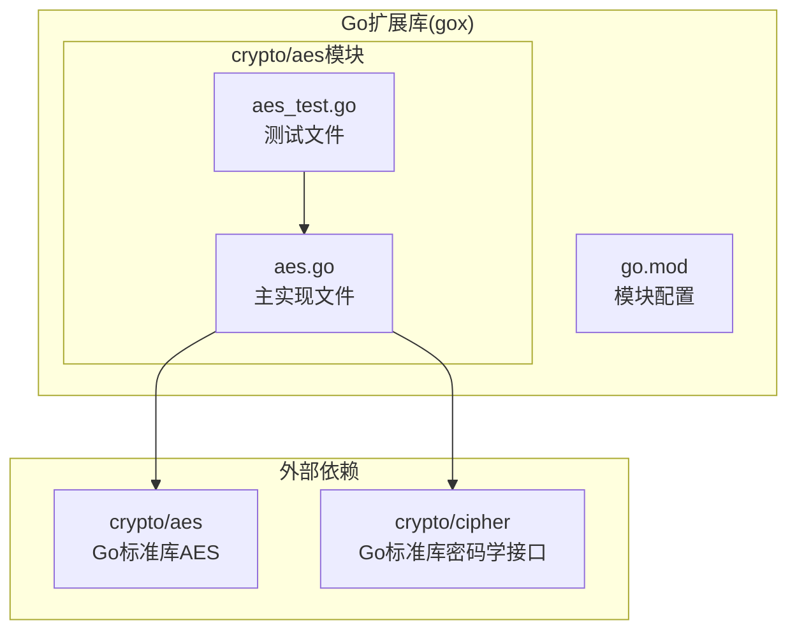

**图表来源**
- [aes.go:1-149](file://thirdparty/gox/crypto/aes/aes.go#L1-L149)
- [go.mod:1-144](file://thirdparty/gox/go.mod#L1-L144)

**章节来源**
- [aes.go:1-149](file://thirdparty/gox/crypto/aes/aes.go#L1-L149)
- [go.mod:1-144](file://thirdparty/gox/go.mod#L1-L144)

## 核心组件

### 主要API函数

该模块提供了四个核心加密解密函数：

1. **CBCEncrypt** - CBC模式加密
2. **CBCDecrypt** - CBC模式解密  
3. **ECBEncrypt** - ECB模式加密
4. **ECBDecrypt** - ECB模式解密

### 数据填充机制

实现了PKCS7填充算法，确保明文数据长度能够被AES块大小整除：

- **Pkcs7Padding** - PKCS7填充函数
- **UnPadding** - 去除填充函数
- **Pkcs5Padding** - PKCS5填充函数（针对8字节块）

### ECB模式自定义实现

由于Go标准库未直接提供ECB模式的BlockMode实现，模块实现了自定义的ECB加密解密器：

- **NewECBEncrypter** - 创建ECB加密器
- **NewECBDecrypter** - 创建ECB解密器

**章节来源**
- [aes.go:15-92](file://thirdparty/gox/crypto/aes/aes.go#L15-L92)
- [aes.go:48-67](file://thirdparty/gox/crypto/aes/aes.go#L48-L67)
- [aes.go:94-148](file://thirdparty/gox/crypto/aes/aes.go#L94-L148)

## 架构概览

AES加密模块采用分层架构设计，清晰分离了加密算法、填充机制和模式实现：

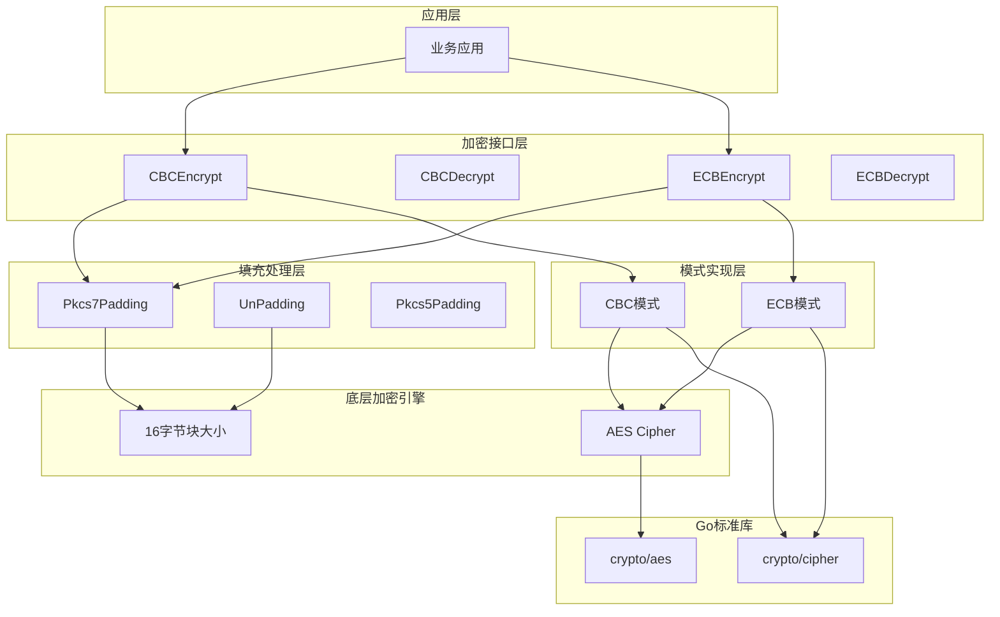

**图表来源**
- [aes.go:15-92](file://thirdparty/gox/crypto/aes/aes.go#L15-L92)
- [aes.go:48-67](file://thirdparty/gox/crypto/aes/aes.go#L48-L67)
- [aes.go:94-148](file://thirdparty/gox/crypto/aes/aes.go#L94-L148)

## 详细组件分析

### CBC模式实现

CBC（密码块链接）模式通过将前一个密文块与当前明文块进行异或操作，确保相同的明文块会产生不同的密文块，提高了安全性。

#### CBCEncrypt函数分析

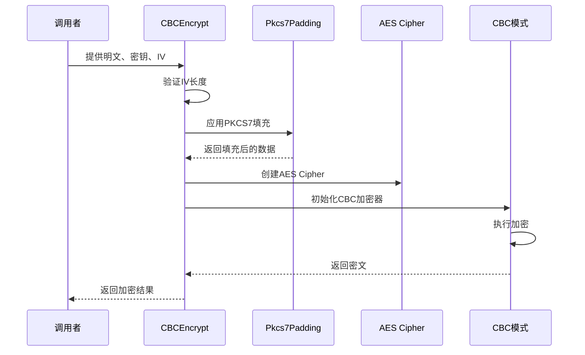

**图表来源**
- [aes.go:15-29](file://thirdparty/gox/crypto/aes/aes.go#L15-L29)
- [aes.go:48-52](file://thirdparty/gox/crypto/aes/aes.go#L48-L52)

#### CBCDecrypt函数分析

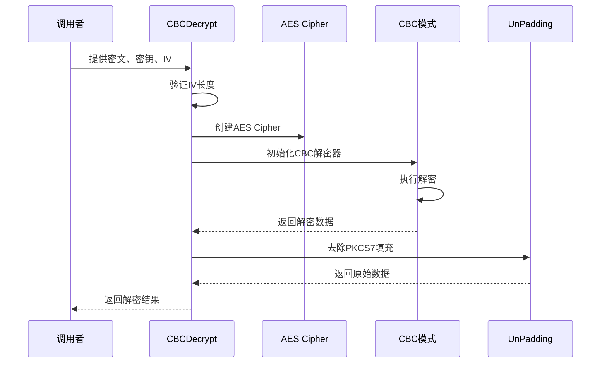

**图表来源**
- [aes.go:31-46](file://thirdparty/gox/crypto/aes/aes.go#L31-L46)
- [aes.go:54-63](file://thirdparty/gox/crypto/aes/aes.go#L54-L63)

**章节来源**
- [aes.go:15-46](file://thirdparty/gox/crypto/aes/aes.go#L15-L46)

### ECB模式实现

ECB（电子密码本）模式是最简单的AES实现方式，每个明文字节块独立加密。虽然实现简单，但存在安全性问题，不推荐用于生产环境。

#### ECBEncrypt函数分析

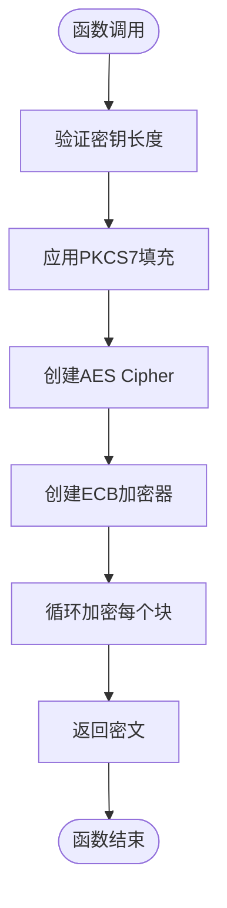

**图表来源**
- [aes.go:69-80](file://thirdparty/gox/crypto/aes/aes.go#L69-L80)

#### ECBDecrypt函数分析

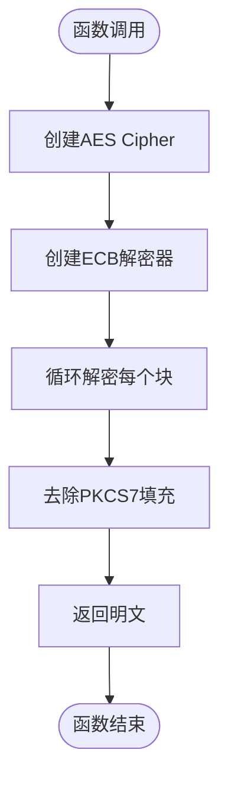

**图表来源**
- [aes.go:82-92](file://thirdparty/gox/crypto/aes/aes.go#L82-L92)

**章节来源**
- [aes.go:69-92](file://thirdparty/gox/crypto/aes/aes.go#L69-L92)

### 填充机制实现

#### PKCS7填充算法

PKCS7填充算法确保数据长度能够被块大小整除，填充字节数等于需要填充的字节数：

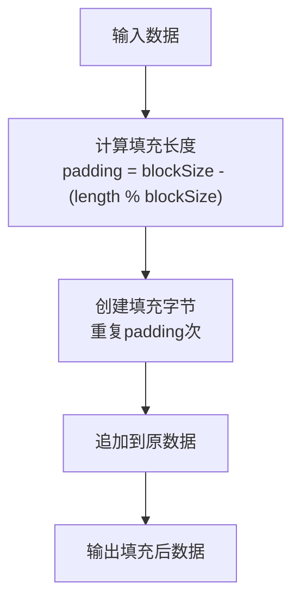

**图表来源**
- [aes.go:48-52](file://thirdparty/gox/crypto/aes/aes.go#L48-L52)

#### 去填充算法

去填充算法从数据末尾读取填充字节的数值，然后移除相应数量的字节：

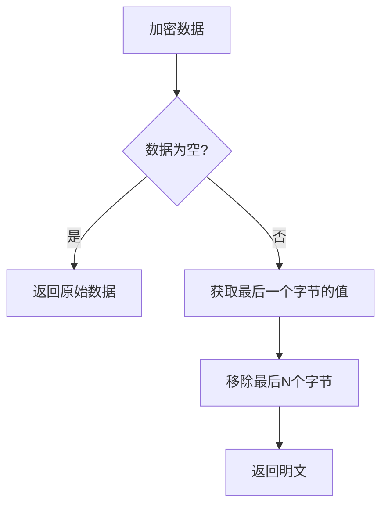

**图表来源**
- [aes.go:54-63](file://thirdparty/gox/crypto/aes/aes.go#L54-L63)

**章节来源**
- [aes.go:48-67](file://thirdparty/gox/crypto/aes/aes.go#L48-L67)

### ECB模式自定义实现

由于Go标准库未提供ECB模式的BlockMode实现，模块实现了自定义的ECB加密解密器：

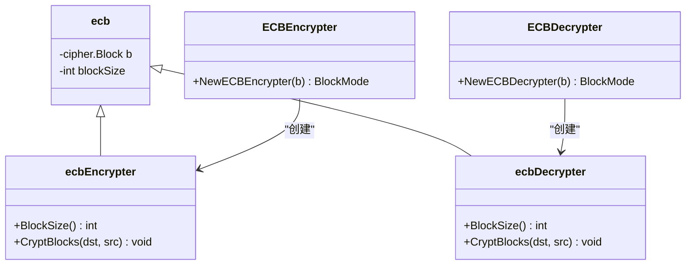

**图表来源**
- [aes.go:94-148](file://thirdparty/gox/crypto/aes/aes.go#L94-L148)

**章节来源**
- [aes.go:94-148](file://thirdparty/gox/crypto/aes/aes.go#L94-L148)

## 依赖关系分析

### 外部依赖

AES模块依赖Go标准库的两个核心包：

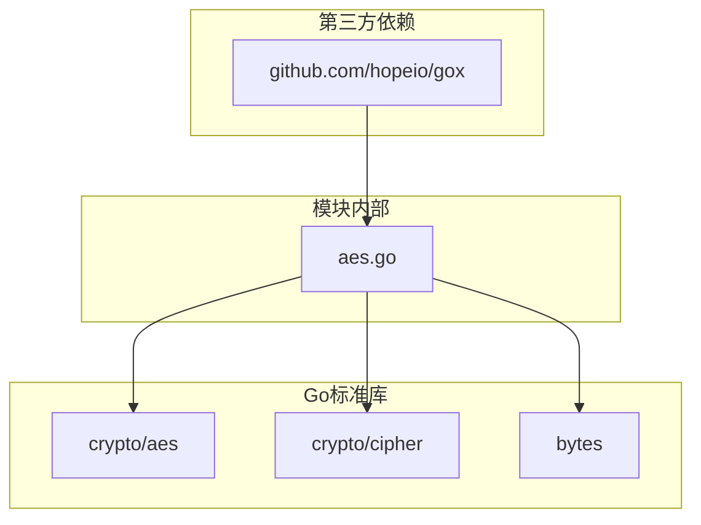

**图表来源**
- [aes.go:9-13](file://thirdparty/gox/crypto/aes/aes.go#L9-L13)
- [go.mod:1-144](file://thirdparty/gox/go.mod#L1-L144)

### 内部依赖关系

模块内部各函数之间的调用关系：

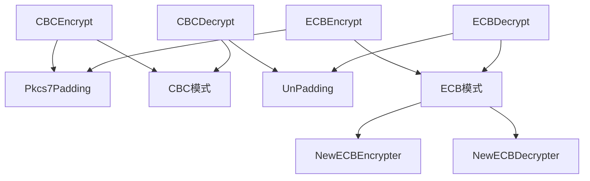

**图表来源**
- [aes.go:15-92](file://thirdparty/gox/crypto/aes/aes.go#L15-L92)

**章节来源**
- [aes.go:9-13](file://thirdparty/gox/crypto/aes/aes.go#L9-L13)
- [go.mod:1-144](file://thirdparty/gox/go.mod#L1-L144)

## 性能考虑

### 内存管理

1. **预分配缓冲区**：所有加密解密函数都预先分配足够大小的缓冲区，避免多次内存分配
2. **零拷贝优化**：使用`make([]byte, size)`创建缓冲区，减少不必要的数据复制
3. **批量处理**：ECB模式的`CryptBlocks`方法采用循环处理，避免递归调用

### 算法复杂度

- **时间复杂度**：O(n)，其中n为数据长度
- **空间复杂度**：O(n)，用于存储结果数据
- **填充开销**：最多增加15字节（对于16字节块大小）

### 安全性考虑

1. **密钥长度**：支持128、192、256位密钥长度
2. **IV向量**：CBC模式需要16字节IV，可选与密钥相同
3. **填充安全**：PKCS7填充提供标准的安全填充机制

## 故障排除指南

### 常见错误及解决方案

#### 1. IV向量长度错误

**问题**：IV向量长度不足16字节
**解决方案**：确保IV向量至少16字节，或留空让函数自动使用密钥作为IV

#### 2. 密钥长度错误

**问题**：密钥长度不是16、24或32字节
**解决方案**：使用标准的AES密钥长度（128、192、256位）

#### 3. 数据长度不完整

**问题**：ECB模式下数据长度不是块大小的整数倍
**解决方案**：确保数据经过PKCS7填充或长度符合块大小要求

#### 4. 解密失败

**问题**：解密后数据无法正确去填充
**解决方案**：检查密钥、IV和数据完整性

**章节来源**
- [aes.go:15-46](file://thirdparty/gox/crypto/aes/aes.go#L15-L46)
- [aes.go:69-92](file://thirdparty/gox/crypto/aes/aes.go#L69-L92)

## 结论

本AES对称加密模块提供了完整且安全的加密解密功能，具有以下特点：

1. **完整的API覆盖**：支持CBC和ECB两种模式的加密解密
2. **标准填充机制**：实现PKCS7填充，确保数据完整性
3. **简洁的架构设计**：清晰的分层结构，易于理解和维护
4. **良好的性能表现**：优化的内存管理和批量处理
5. **完善的错误处理**：标准的Go错误返回机制

该模块适合在需要对称加密的场景中使用，特别是在需要与Go标准库兼容的环境中。对于生产环境，建议优先使用CBC模式并妥善管理密钥和IV向量的安全性。