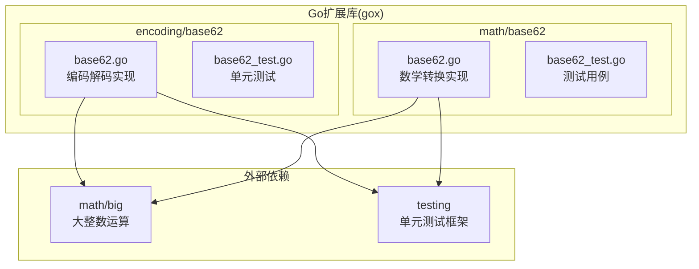
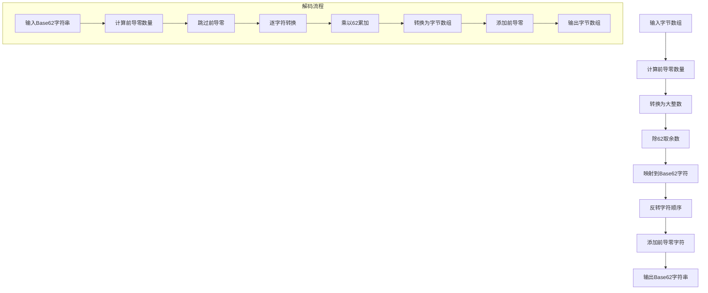
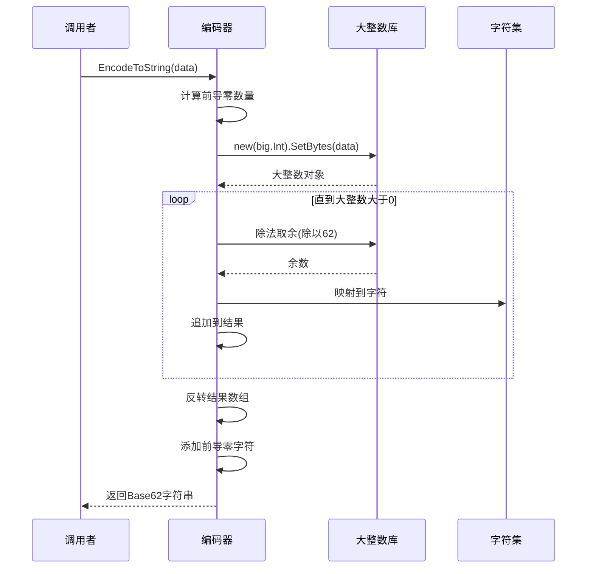
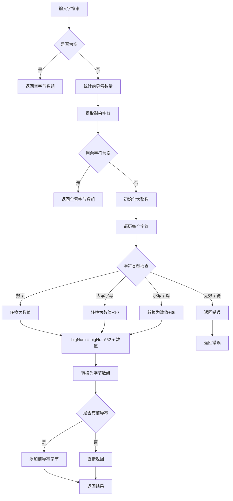

# Base62编码

<cite>
**本文档引用的文件**
- [base62.go](file://thirdparty/gox/encoding/base62/base62.go)
- [base62_test.go](file://thirdparty/gox/encoding/base62/base62_test.go)
- [base62.go](file://thirdparty/gox/math/base62.go)
- [base62_test.go](file://thirdparty/gox/math/base62_test.go)
</cite>

## 目录
1. [简介](#简介)
2. [项目结构](#项目结构)
3. [核心组件](#核心组件)
4. [架构概览](#架构概览)
5. [详细组件分析](#详细组件分析)
6. [Base62与Base64的区别](#base62与base64的区别)
7. [应用场景](#应用场景)
8. [性能分析](#性能分析)
9. [安全性考虑](#安全性考虑)
10. [故障排除指南](#故障排除指南)
11. [结论](#结论)

## 简介

Base62编码是一种将二进制数据转换为Base62字符集表示的算法。该模块提供了高效的Base62编码和解码功能，支持任意长度的字节数组，并保持前导零的完整性。Base62编码广泛应用于URL缩短、ID混淆、安全标识符等场景，因为它使用人类可读且URL友好的字符集。

## 项目结构

Base62编码功能分布在两个主要包中：



**图表来源**
- [base62.go:1-121](file://thirdparty/gox/encoding/base62/base62.go#L1-L121)
- [base62.go:1-383](file://thirdparty/gox/math/base62.go#L1-L383)

**章节来源**
- [base62.go:1-121](file://thirdparty/gox/encoding/base62/base62.go#L1-L121)
- [base62.go:1-383](file://thirdparty/gox/math/base62.go#L1-L383)

## 核心组件

### 字符集定义

Base62编码使用以下字符集：
- 数字：0-9 (10个字符)
- 小写字母：a-z (26个字符)  
- 大写字母：A-Z (26个字符)

总计62个字符，因此称为Base62编码。

### 主要API函数

#### 编码函数
- `EncodeToString(data []byte) string`: 将字节数组编码为Base62字符串

#### 解码函数  
- `DecodeString(s string) ([]byte, error)`: 将Base62字符串解码为字节数组

**章节来源**
- [base62.go:8-43](file://thirdparty/gox/encoding/base62/base62.go#L8-L43)
- [base62.go:56-120](file://thirdparty/gox/encoding/base62/base62.go#L56-L120)

## 架构概览

Base62编码采用"字节到大整数再到字符"的转换流程：



**图表来源**
- [base62.go:10-43](file://thirdparty/gox/encoding/base62/base62.go#L10-L43)
- [base62.go:56-120](file://thirdparty/gox/encoding/base62/base62.go#L56-L120)

## 详细组件分析

### 编码实现分析

编码函数采用以下步骤：

1. **前导零处理**: 统计输入字节数组开头连续的零值
2. **大整数转换**: 使用`big.Int`将字节数组转换为大整数
3. **重复除法**: 不断除以62并记录余数作为索引
4. **字符映射**: 将余数映射到Base62字符集
5. **结果反转**: 因为从低位开始计算，需要反转结果
6. **前导零恢复**: 添加相应的'0'字符



**图表来源**
- [base62.go:10-43](file://thirdparty/gox/encoding/base62/base62.go#L10-L43)

**章节来源**
- [base62.go:10-43](file://thirdparty/gox/encoding/base62/base62.go#L10-L43)

### 解码实现分析

解码函数的工作流程：

1. **输入验证**: 处理空字符串和全零字符串
2. **前导零统计**: 计算开头连续的'0'字符数量
3. **字符遍历**: 对剩余字符进行逐字符处理
4. **字符验证**: 验证每个字符都在有效范围内
5. **数值累积**: 使用`big.NewInt(62)`进行乘法累加
6. **字节转换**: 使用`bigNum.Bytes()`转换回字节数组
7. **前导零恢复**: 添加必要的前导零字节



**图表来源**
- [base62.go:56-120](file://thirdparty/gox/encoding/base62/base62.go#L56-L120)

**章节来源**
- [base62.go:56-120](file://thirdparty/gox/encoding/base62/base62.go#L56-L120)

### 性能优化特性

#### 初始化优化
- 使用预分配的解码映射表`base62DecodeMap [256]byte`
- 在包初始化时建立字符到索引的映射
- 时间复杂度O(1)的字符查找

#### 边界情况处理
- 空输入返回空字符串
- 全零输入正确处理前导零
- 无效字符立即返回错误

**章节来源**
- [base62.go:45-54](file://thirdparty/gox/encoding/base62/base62.go#L45-L54)

## Base62与Base64的区别

### 字符集差异

| 特性 | Base62 | Base64 |
|------|--------|--------|
| 字符集大小 | 62个字符 | 64个字符 |
| 数字字符 | 0-9 | 0-9 |
| 小写字母 | a-z | a-z |
| 大写字母 | A-Z | A-Z |
| 其他字符 | 无 | + / |
| URL友好性 | 高 | 中等 |

### 性能对比

```mermaid
graph LR
subgraph "编码性能"
A[Base62编码] --> B[时间复杂度: O(n)]
C[Base64编码] --> D[时间复杂度: O(n)]
end
subgraph "空间效率"
E[Base62编码] --> F[输出长度: 1.4×原始]
G[Base64编码] --> H[输出长度: 1.33×原始]
end
subgraph "适用场景"
I[Base62] --> J[URL短链接, ID混淆]
K[Base64] --> L[二进制数据传输, 文件编码]
end
```

### 选择指南

**选择Base62当**：
- 需要URL友好的标识符
- 要求人类可读的字符串
- 应用于数据库主键或API参数
- 需要避免特殊字符

**选择Base64当**：
- 需要编码任意二进制数据
- 用于网络传输或存储
- 不关心字符可读性
- 需要最紧凑的表示

## 应用场景

### URL缩短服务

Base62编码常用于将长URL转换为短链接：
- 将数据库自增ID转换为Base62字符串
- 生成用户友好的短链接标识符
- 支持快速查找和验证

### ID混淆

保护数据库主键的隐私：
- 隐藏真实的递增序列
- 防止枚举攻击
- 提供随机外观的标识符

### 安全标识符

生成安全的临时令牌：
- 会话ID生成
- 重置密码令牌
- 验证邮件链接

### 实际应用案例

#### 案例1: 用户ID混淆
```go
// 原始ID: 123456789
// Base62编码: "21i3v9"
```

#### 案例2: 文件名生成  
```go
// 原始字节: [0, 0, 123, 45, 67]
// Base62编码: "00J3K"
```

## 性能分析

### 时间复杂度
- **编码**: O(n)，其中n是输入字节数组长度
- **解码**: O(m)，其中m是输出字符串长度
- **内存使用**: O(n)用于中间结果存储

### 内存优化
- 使用`big.Int`处理任意精度整数
- 预分配解码映射表减少运行时分配
- 字符串反转通过原地交换实现

### 性能基准测试

建议的测试场景：
- 小型数据: 1-10字节
- 中型数据: 10-100字节  
- 大型数据: 100-1000字节
- 边界情况: 全零数组、最大值数组

## 安全性考虑

### 输入验证
- 严格验证Base62字符集
- 拒绝空字符串和超长输入
- 处理潜在的拒绝服务攻击

### 输出安全
- Base62编码不提供加密保护
- 如需安全用途，应结合其他安全措施
- 避免在敏感数据上使用简单的Base62编码

### 最佳实践
- 结合哈希函数使用
- 添加时间戳和校验和
- 使用随机前缀增加不可预测性

## 故障排除指南

### 常见错误及解决方案

#### 错误: "invalid Base62 character"
**原因**: 输入包含不在字符集内的字符
**解决**: 验证输入字符串只包含0-9, a-z, A-Z

#### 错误: 内存溢出
**原因**: 处理超大字节数组
**解决**: 检查输入大小限制，考虑分块处理

#### 性能问题
**原因**: 频繁的字符串拼接操作
**解决**: 使用`strings.Builder`或预分配容量

### 调试技巧

1. **单元测试**: 使用提供的测试用例验证功能
2. **边界测试**: 测试空输入、全零输入、最大值输入
3. **一致性测试**: 验证编码解码的双向正确性

**章节来源**
- [base62_test.go:8-167](file://thirdparty/gox/encoding/base62/base62_test.go#L8-L167)

## 结论

Base62编码模块提供了高效、可靠的二进制数据编码解决方案。其设计特点包括：

- **完整性**: 正确处理所有边界情况，特别是前导零
- **性能**: 使用优化的数据结构和算法
- **可靠性**: 完整的单元测试覆盖
- **实用性**: 适用于多种实际应用场景

该模块特别适合需要人类可读、URL友好的标识符生成场景，如URL缩短、ID混淆和安全标识符等应用。