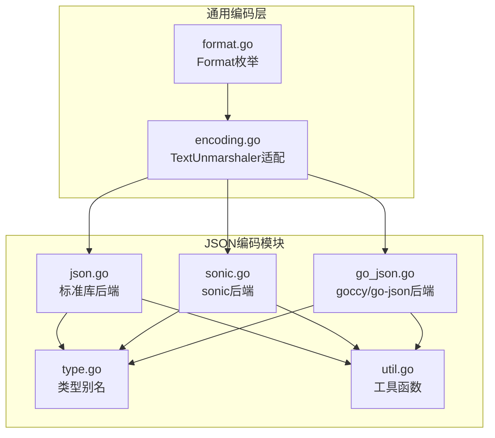
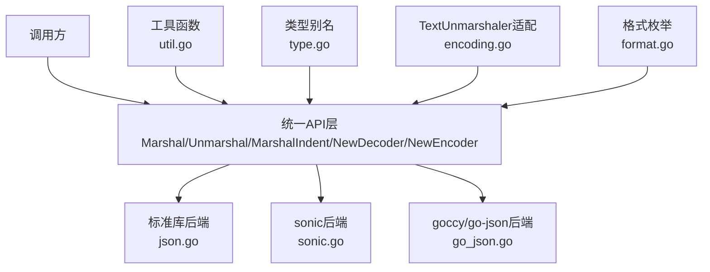
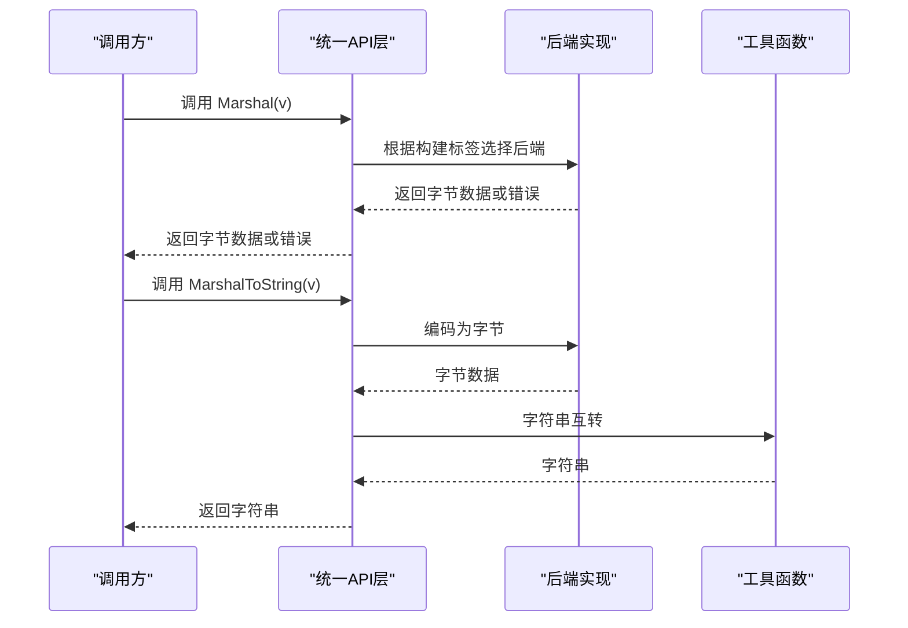
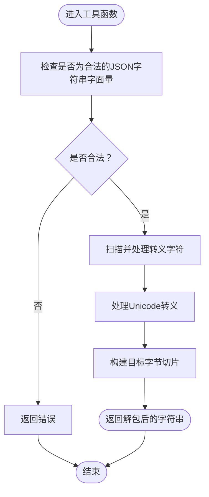
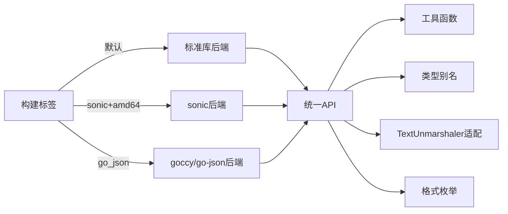

# JSON编码

<cite>
**本文档引用的文件**
- [json.go](file://thirdparty/gox/encoding/json/json.go)
- [sonic.go](file://thirdparty/gox/encoding/json/sonic.go)
- [go_json.go](file://thirdparty/gox/encoding/json/go_json.go)
- [type.go](file://thirdparty/gox/encoding/json/type.go)
- [util.go](file://thirdparty/gox/encoding/json/util.go)
- [util_test.go](file://thirdparty/gox/encoding/json/util_test.go)
- [json_test.go](file://thirdparty/gox/encoding/json/json_test.go)
- [encoding.go](file://thirdparty/gox/encoding/encoding.go)
- [format.go](file://thirdparty/gox/encoding/format.go)
</cite>

## 目录
1. [简介](#简介)
2. [项目结构](#项目结构)
3. [核心组件](#核心组件)
4. [架构总览](#架构总览)
5. [详细组件分析](#详细组件分析)
6. [依赖关系分析](#依赖关系分析)
7. [性能考量](#性能考量)
8. [故障排查指南](#故障排查指南)
9. [结论](#结论)
10. [附录](#附录)

## 简介
本文件为 JSON 编码模块的详细 API 文档，覆盖以下内容：
- 标准库与高性能库（sonic、goccy/go-json）的选择与使用场景
- 序列化与反序列化 API 的完整参考（含数据转换、错误处理）
- 高级特性：JSON 标签映射、类型转换、嵌套结构处理
- 内存优化、大对象处理与错误恢复最佳实践

该模块通过构建标签在不同后端之间切换，统一对外提供一致的 API 表面，同时保留对底层库的直接访问能力。

## 项目结构
JSON 编码模块位于 thirdparty/gox/encoding/json 下，主要文件如下：
- json.go：默认使用标准库的导出 API 与便捷函数
- sonic.go：启用 sonic 后端的导出 API 与 Reader 输出
- go_json.go：启用 goccy/go-json 后端的导出 API 与便捷函数
- type.go：别名类型定义（Number、RawMessage）
- util.go：字符串解包、基础数值解码等工具函数
- encoding.go、format.go：通用编码接口与格式枚举（用于跨多种编码格式）

图表来源
- [json.go:1-34](file://thirdparty/gox/encoding/json/json.go#L1-L34)
- [sonic.go:1-37](file://thirdparty/gox/encoding/json/sonic.go#L1-L37)
- [go_json.go:1-36](file://thirdparty/gox/encoding/json/go_json.go#L1-L36)
- [type.go:1-13](file://thirdparty/gox/encoding/json/type.go#L1-L13)
- [util.go:1-204](file://thirdparty/gox/encoding/json/util.go#L1-L204)
- [encoding.go:1-29](file://thirdparty/gox/encoding/encoding.go#L1-L29)
- [format.go:1-20](file://thirdparty/gox/encoding/format.go#L1-L20)

章节来源
- [json.go:1-34](file://thirdparty/gox/encoding/json/json.go#L1-L34)
- [sonic.go:1-37](file://thirdparty/gox/encoding/json/sonic.go#L1-L37)
- [go_json.go:1-36](file://thirdparty/gox/encoding/json/go_json.go#L1-L36)
- [type.go:1-13](file://thirdparty/gox/encoding/json/type.go#L1-L13)
- [util.go:1-204](file://thirdparty/gox/encoding/json/util.go#L1-L204)
- [encoding.go:1-29](file://thirdparty/gox/encoding/encoding.go#L1-L29)
- [format.go:1-20](file://thirdparty/gox/encoding/format.go#L1-L20)

## 核心组件
- 标准库后端（默认）：通过 json.go 导出 Marshal、Unmarshal、MarshalIndent、NewDecoder、NewEncoder，并提供 MarshalToString、UnmarshalFromString 便捷函数。
- sonic 后端：通过 sonic.go 导出与标准库相同的 API，并新增 MarshalReader，适合流式输出。
- goccy/go-json 后端：通过 go_json.go 导出与标准库相同的 API，并提供 MarshalToString、UnmarshalFromString 便捷函数。
- 类型别名：type.go 定义 Number 与 RawMessage 的别名，便于跨后端一致性使用。
- 工具函数：util.go 提供字符串解包（Unquote）、基础数值解码（DecodeInt/DecodeFloat/DecodeString/DecodeBool）等，适用于自定义解析场景。
- 通用编码接口：encoding.go 提供 TextUnmarshaler 的文本解析适配；format.go 定义多格式枚举，便于扩展到 YAML/TOML 等。

章节来源
- [json.go:11-33](file://thirdparty/gox/encoding/json/json.go#L11-L33)
- [sonic.go:13-28](file://thirdparty/gox/encoding/json/sonic.go#L13-L28)
- [go_json.go:13-35](file://thirdparty/gox/encoding/json/go_json.go#L13-L35)
- [type.go:11-12](file://thirdparty/gox/encoding/json/type.go#L11-L12)
- [util.go:22-203](file://thirdparty/gox/encoding/json/util.go#L22-L203)
- [encoding.go:8-28](file://thirdparty/gox/encoding/encoding.go#L8-L28)
- [format.go:9-19](file://thirdparty/gox/encoding/format.go#L9-L19)

## 架构总览
模块通过构建标签在不同后端间切换，统一对外 API，内部保持一致的类型与工具函数。下图展示了 API 层与后端的关系：

图表来源
- [json.go:11-33](file://thirdparty/gox/encoding/json/json.go#L11-L33)
- [sonic.go:13-28](file://thirdparty/gox/encoding/json/sonic.go#L13-L28)
- [go_json.go:13-35](file://thirdparty/gox/encoding/json/go_json.go#L13-L35)
- [util.go:22-203](file://thirdparty/gox/encoding/json/util.go#L22-L203)
- [type.go:11-12](file://thirdparty/gox/encoding/json/type.go#L11-L12)
- [encoding.go:8-28](file://thirdparty/gox/encoding/encoding.go#L8-L28)
- [format.go:9-19](file://thirdparty/gox/encoding/format.go#L9-L19)

## 详细组件分析

### 统一API与后端选择
- 标准库后端（默认）：导出与标准库完全一致的 API，并提供字符串互转的便捷函数，便于在字符串与字节间快速转换。
- sonic 后端：在 amd64 平台上启用，提供与标准库一致的 API，并新增 MarshalReader，适合将编码结果直接作为 io.Reader 使用，减少中间缓冲。
- goccy/go-json 后端：在 go_json 构建标签下启用，提供与标准库一致的 API，并提供字符串互转的便捷函数。

图表来源
- [json.go:23-33](file://thirdparty/gox/encoding/json/json.go#L23-L33)
- [sonic.go:30-36](file://thirdparty/gox/encoding/json/sonic.go#L30-L36)
- [go_json.go:25-35](file://thirdparty/gox/encoding/json/go_json.go#L25-L35)

章节来源
- [json.go:11-33](file://thirdparty/gox/encoding/json/json.go#L11-L33)
- [sonic.go:13-28](file://thirdparty/gox/encoding/json/sonic.go#L13-L28)
- [go_json.go:13-35](file://thirdparty/gox/encoding/json/go_json.go#L13-L35)

### 类型别名与兼容性
- Number：用于表示 JSON 数值的原始类型，便于在解析后进行二次处理。
- RawMessage：用于延迟解析或原样存储 JSON 片段，避免重复编码/解码。

章节来源
- [type.go:11-12](file://thirdparty/gox/encoding/json/type.go#L11-L12)

### 工具函数详解
- 字符串解包（Unquote）：将带引号的 JSON 字符串字面量转换为实际字符串，支持常见的转义字符与 Unicode 转义。
- 基础数值解码（DecodeInt/DecodeFloat/DecodeString/DecodeBool）：从字节数组中解析出对应类型的值及剩余数据，适用于自定义解析流程。

图表来源
- [util.go:22-142](file://thirdparty/gox/encoding/json/util.go#L22-L142)

章节来源
- [util.go:22-203](file://thirdparty/gox/encoding/json/util.go#L22-L203)

### 通用编码接口与格式枚举
- TextUnmarshaler 适配：encoding.go 提供对 encoding.TextUnmarshaler 的统一解析适配，便于将文本形式的数据解析为任意类型。
- 格式枚举：format.go 定义了多种格式常量，便于在多编码格式间切换或扩展。

章节来源
- [encoding.go:8-28](file://thirdparty/gox/encoding/encoding.go#L8-L28)
- [format.go:9-19](file://thirdparty/gox/encoding/format.go#L9-L19)

### 测试与示例
- 单元测试：json_test.go 展示了基本的序列化与反序列化流程，验证字段映射与空值处理。
- 工具函数测试：util_test.go 展示了字符串解包的使用方式。

章节来源
- [json_test.go:15-31](file://thirdparty/gox/encoding/json/json_test.go#L15-L31)
- [util_test.go:14-17](file://thirdparty/gox/encoding/json/util_test.go#L14-L17)

## 依赖关系分析
- 构建标签控制后端选择：
  - 默认：!(sonic && amd64) && !go_json → 使用标准库后端（json.go）
  - sonic && amd64：使用 sonic 后端（sonic.go）
  - go_json：使用 goccy/go-json 后端（go_json.go）
- 工具函数与类型别名被所有后端共享，确保行为一致性。
- 通用编码层（encoding.go、format.go）独立于具体后端，便于扩展其他编码格式。

图表来源
- [json.go:1](file://thirdparty/gox/encoding/json/json.go#L1)
- [sonic.go:1](file://thirdparty/gox/encoding/json/sonic.go#L1)
- [go_json.go:1](file://thirdparty/gox/encoding/json/go_json.go#L1)
- [util.go:22-203](file://thirdparty/gox/encoding/json/util.go#L22-L203)
- [type.go:11-12](file://thirdparty/gox/encoding/json/type.go#L11-L12)
- [encoding.go:8-28](file://thirdparty/gox/encoding/encoding.go#L8-L28)
- [format.go:9-19](file://thirdparty/gox/encoding/format.go#L9-L19)

章节来源
- [json.go:1-34](file://thirdparty/gox/encoding/json/json.go#L1-L34)
- [sonic.go:1-37](file://thirdparty/gox/encoding/json/sonic.go#L1-L37)
- [go_json.go:1-36](file://thirdparty/gox/encoding/json/go_json.go#L1-L36)

## 性能考量
- 后端选择建议：
  - 标准库：兼容性好、功能稳定，适合一般场景。
  - sonic：在 amd64 平台具备更高性能，适合高吞吐量与低延迟要求的场景。
  - goccy/go-json：在某些特定场景下可能提供更好的性能或更丰富的选项。
- Reader 输出：sonic.go 提供 MarshalReader，可避免额外的内存拷贝，适合流式传输。
- 字符串互转：MarshalToString/UnmarshalFromString 在需要字符串与字节互转时减少显式转换开销。
- 工具函数：对于自定义解析场景，使用 util.go 中的解码函数可减少不必要的解析成本。

章节来源
- [sonic.go:30-36](file://thirdparty/gox/encoding/json/sonic.go#L30-L36)
- [json.go:23-33](file://thirdparty/gox/encoding/json/json.go#L23-L33)
- [go_json.go:25-35](file://thirdparty/gox/encoding/json/go_json.go#L25-L35)
- [util.go:22-203](file://thirdparty/gox/encoding/json/util.go#L22-L203)

## 故障排查指南
- 错误处理：
  - 所有后端的 Marshal/Unmarshal 均返回 error，调用方应始终检查错误并进行相应处理。
  - MarshalToString/UnmarshalFromString 在编码失败时返回空结果与错误；在解码失败时返回错误。
- 字符串解包异常：
  - Unquote 对不合法的 JSON 字符串字面量会返回错误，需确保输入符合 JSON 规范。
- 自定义解析：
  - 使用 DecodeInt/DecodeFloat/DecodeString/DecodeBool 时，注意输入数据格式与分隔符，确保解析位置正确。
- 兼容性问题：
  - 当切换后端时，若出现行为差异，优先检查类型别名（Number、RawMessage）与工具函数的使用方式。

章节来源
- [json.go:23-33](file://thirdparty/gox/encoding/json/json.go#L23-L33)
- [sonic.go:30-36](file://thirdparty/gox/encoding/json/sonic.go#L30-L36)
- [go_json.go:25-35](file://thirdparty/gox/encoding/json/go_json.go#L25-L35)
- [util.go:22-203](file://thirdparty/gox/encoding/json/util.go#L22-L203)

## 结论
该 JSON 编码模块通过构建标签实现了对标准库、sonic 与 goccy/go-json 的无缝切换，统一了 API 表面并提供了丰富的工具函数与类型别名。结合 Reader 输出与字符串互转能力，可在保证兼容性的前提下满足高性能与灵活处理的需求。建议根据部署平台与性能需求选择合适的后端，并在错误处理与内存优化方面遵循本文的最佳实践。

## 附录
- 使用建议：
  - 高并发/低延迟：优先考虑 sonic（amd64）。
  - 跨平台稳定性：使用标准库后端。
  - 特定场景优化：尝试 goccy/go-json。
- 最佳实践：
  - 始终检查错误返回值。
  - 大对象处理时优先使用流式输出（如 MarshalReader）。
  - 需要字符串互转时使用内置便捷函数，避免重复转换。
  - 自定义解析场景使用工具函数以降低解析成本。