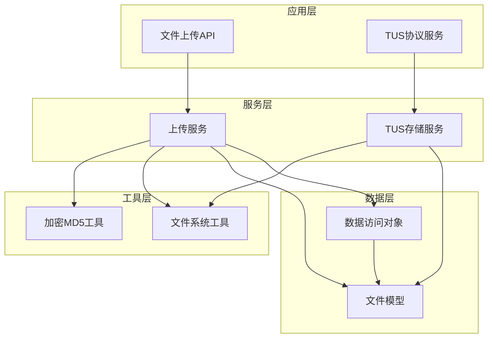
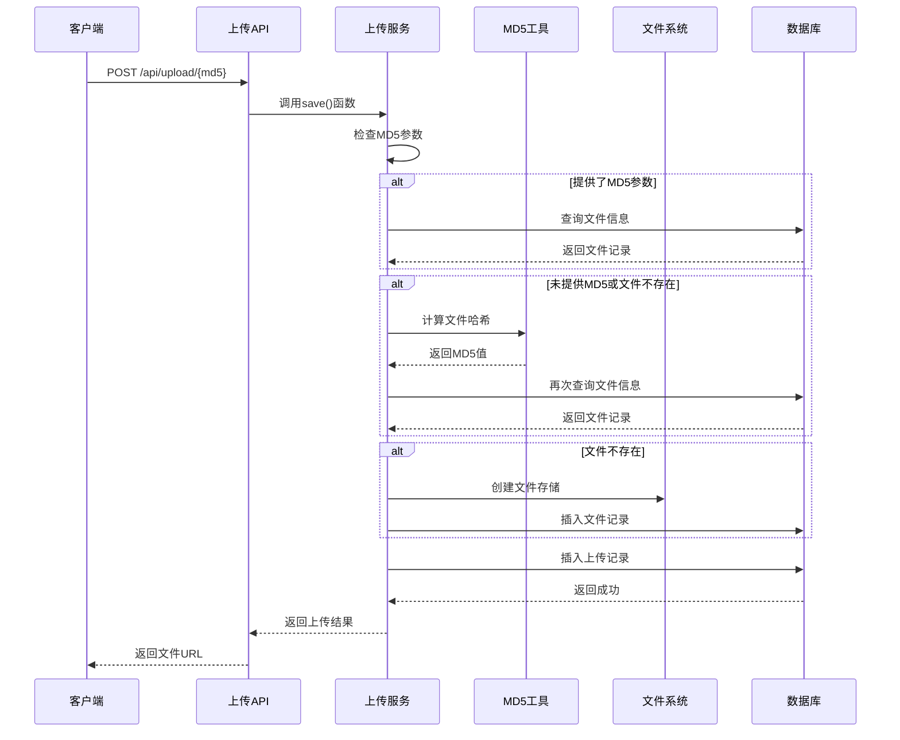
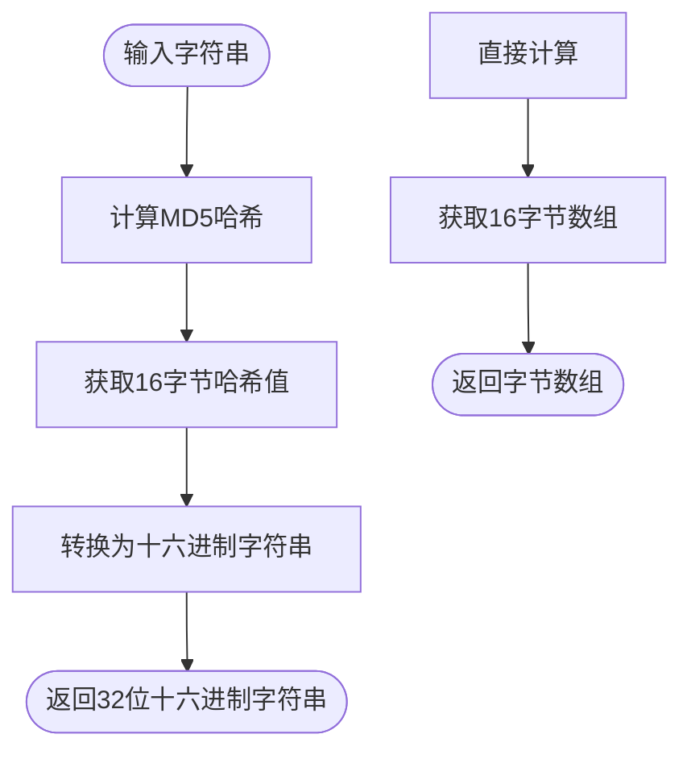
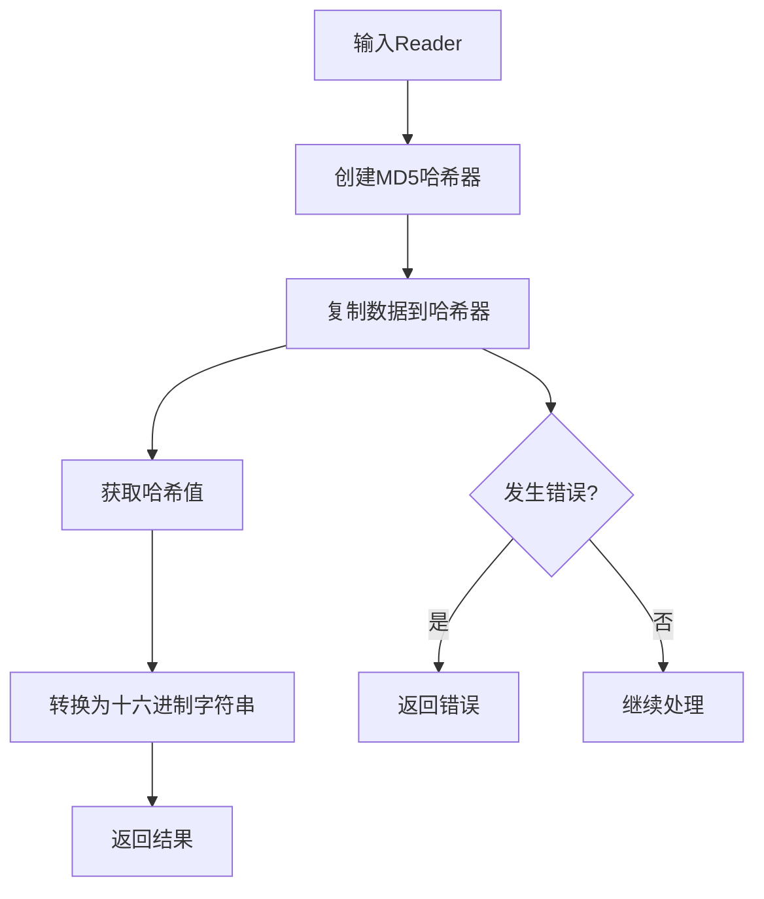
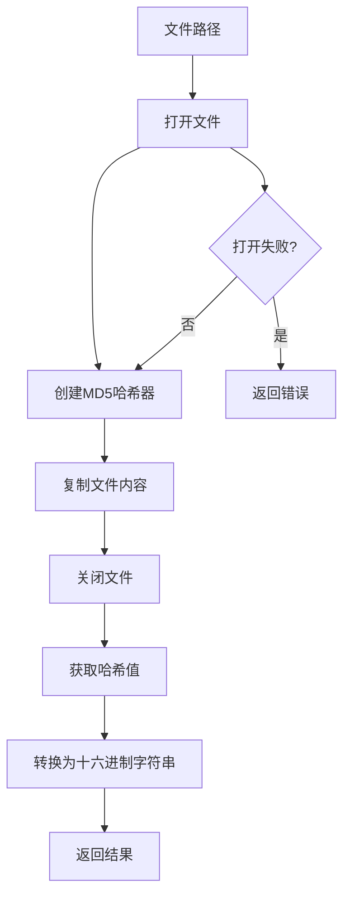
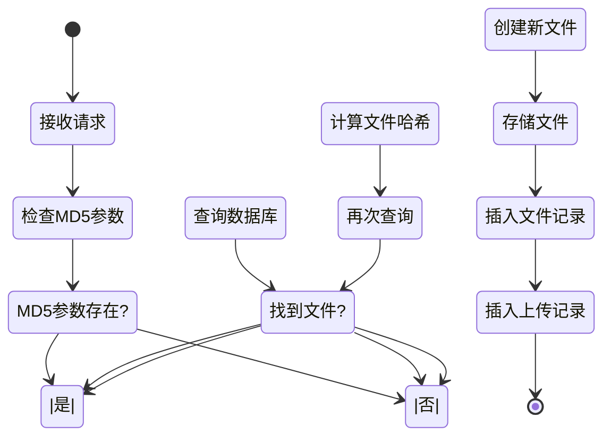
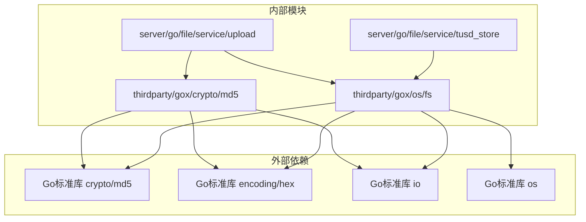

# MD5哈希

<cite>
**本文档引用的文件**
- [thirdparty/gox/crypto/md5/md5.go](file://thirdparty/gox/crypto/md5/md5.go)
- [thirdparty/gox/crypto/md5/md5_test.go](file://thirdparty/gox/crypto/md5/md5_test.go)
- [thirdparty/gox/os/fs/util.go](file://thirdparty/gox/os/fs/util.go)
- [server/go/file/service/upload.go](file://server/go/file/service/upload.go)
- [server/go/file/service/tusd_store.go](file://server/go/file/service/tusd_store.go)
- [server/go/file/model/upload.go](file://server/go/file/model/upload.go)
- [server/go/file/data/db.go](file://server/go/file/data/db.go)
</cite>

## 目录
1. [简介](#简介)
2. [项目结构](#项目结构)
3. [核心组件](#核心组件)
4. [架构概览](#架构概览)
5. [详细组件分析](#详细组件分析)
6. [依赖关系分析](#依赖关系分析)
7. [性能考虑](#性能考虑)
8. [故障排除指南](#故障排除指南)
9. [结论](#结论)

## 简介

MD5（Message-Digest Algorithm 5）是一种广泛使用的哈希算法，由Ron Rivest在1991年设计。该算法将任意长度的数据转换为128位（16字节）的哈希值，通常以32位十六进制字符串表示。

### 算法原理

MD5哈希算法的核心特性包括：
- **确定性**：相同输入总是产生相同输出
- **雪崩效应**：输入的微小变化会产生完全不同的输出
- **单向性**：从哈希值推导原始输入在计算上不可行
- **抗碰撞性**：找到两个产生相同哈希值的不同输入在计算上困难

### 应用场景

在本项目中，MD5主要用于以下场景：
1. **文件完整性验证** - 确保文件在传输过程中未被篡改
2. **去重存储** - 通过哈希值识别重复文件
3. **缓存键生成** - 作为缓存条目的唯一标识符
4. **数据索引** - 快速查找和匹配数据记录

## 项目结构

MD5功能在项目中分布在多个层次：



**图表来源**
- [server/go/file/service/upload.go:1-215](file://server/go/file/service/upload.go#L1-215)
- [server/go/file/service/tusd_store.go:1-295](file://server/go/file/service/tusd_store.go#L1-295)
- [thirdparty/gox/crypto/md5/md5.go:1-48](file://thirdparty/gox/crypto/md5/md5.go#L1-48)

**章节来源**
- [server/go/file/service/upload.go:1-215](file://server/go/file/service/upload.go#L1-215)
- [server/go/file/service/tusd_store.go:1-295](file://server/go/file/service/tusd_store.go#L1-295)
- [thirdparty/gox/crypto/md5/md5.go:1-48](file://thirdparty/gox/crypto/md5/md5.go#L1-48)

## 核心组件

### MD5工具模块

项目提供了两个MD5工具模块，分别针对不同的使用场景：

#### 加密MD5工具 (thirdparty/gox/crypto/md5/)
专门用于字符串和字节数组的哈希计算，提供多种输出格式。

#### 文件系统MD5工具 (thirdparty/gox/os/fs/)
专门用于文件内容的哈希计算，支持大文件的流式处理。

### 文件上传服务

文件上传服务是MD5应用的核心业务逻辑，实现了智能的重复检测和存储优化。

**章节来源**
- [thirdparty/gox/crypto/md5/md5.go:15-47](file://thirdparty/gox/crypto/md5/md5.go#L15-47)
- [thirdparty/gox/os/fs/util.go:32-49](file://thirdparty/gox/os/fs/util.go#L32-49)
- [server/go/file/service/upload.go:72-169](file://server/go/file/service/upload.go#L72-169)

## 架构概览



**图表来源**
- [server/go/file/service/upload.go:36-169](file://server/go/file/service/upload.go#L36-169)

**章节来源**
- [server/go/file/service/upload.go:36-169](file://server/go/file/service/upload.go#L36-169)

## 详细组件分析

### MD5工具函数API参考

#### 字符串哈希函数



**图表来源**
- [thirdparty/gox/crypto/md5/md5.go:15-23](file://thirdparty/gox/crypto/md5/md5.go#L15-23)

##### EncodeString(value string) string
- **功能**：对输入字符串进行MD5哈希并返回十六进制字符串
- **参数**：`value` - 输入字符串
- **返回**：`string` - 32位十六进制字符串
- **复杂度**：O(n)，其中n为字符串长度
- **用途**：快速生成字符串的唯一标识符

##### Encode(value string) []byte
- **功能**：对输入字符串进行MD5哈希并返回字节数组
- **参数**：`value` - 输入字符串
- **返回**：`[]byte` - 16字节MD5值
- **复杂度**：O(n)
- **用途**：需要原始字节数据的场景

##### ToString(md5 []byte) string
- **功能**：将MD5字节数组转换为十六进制字符串
- **参数**：`md5` - 16字节MD5值
- **返回**：`string` - 32位十六进制字符串
- **复杂度**：O(1)
- **用途**：格式化输出或数据库存储

**章节来源**
- [thirdparty/gox/crypto/md5/md5.go:15-27](file://thirdparty/gox/crypto/md5/md5.go#L15-27)

#### 流式文件哈希函数



**图表来源**
- [thirdparty/gox/crypto/md5/md5.go:29-47](file://thirdparty/gox/crypto/md5/md5.go#L29-47)

##### EncodeReader(r io.Reader) ([]byte, error)
- **功能**：对Reader中的数据进行MD5哈希计算
- **参数**：`r` - io.Reader接口
- **返回**：`[]byte` - 16字节MD5值，`error` - 错误信息
- **复杂度**：O(n)，n为数据量
- **用途**：处理大文件或网络流数据

##### EncodeReaderString(r io.Reader) (string, error)
- **功能**：对Reader中的数据进行MD5哈希并返回十六进制字符串
- **参数**：`r` - io.Reader接口
- **返回**：`string` - 32位十六进制字符串，`error` - 错误信息
- **复杂度**：O(n)
- **用途**：需要字符串格式的哈希值

**章节来源**
- [thirdparty/gox/crypto/md5/md5.go:29-47](file://thirdparty/gox/crypto/md5/md5.go#L29-47)

### 文件系统MD5工具

#### 文件哈希计算



**图表来源**
- [thirdparty/gox/os/fs/util.go:32-49](file://thirdparty/gox/os/fs/util.go#L32-49)

##### Md5(path string) (string, error)
- **功能**：计算指定文件的MD5哈希值
- **参数**：`path` - 文件完整路径
- **返回**：`string` - 32位十六进制字符串，`error` - 错误信息
- **复杂度**：O(n)，n为文件大小
- **用途**：文件完整性验证和去重检测

##### Md5Equal(path1, path2 string) (bool, error)
- **功能**：比较两个文件的内容是否相同
- **参数**：`path1, path2` - 两个文件路径
- **返回**：`bool` - 是否相等，`error` - 错误信息
- **复杂度**：O(n1+n2)
- **用途**：文件内容比较和同步验证

**章节来源**
- [thirdparty/gox/os/fs/util.go:32-61](file://thirdparty/gox/os/fs/util.go#L32-61)

### 文件上传服务集成

#### 智能重复检测机制



**图表来源**
- [server/go/file/service/upload.go:72-169](file://server/go/file/service/upload.go#L72-169)

**章节来源**
- [server/go/file/service/upload.go:72-169](file://server/go/file/service/upload.go#L72-169)

### 数据模型设计

#### 文件信息模型

| 字段名 | 类型 | 长度 | 约束 | 描述 |
|--------|------|------|------|------|
| Id | string | 主键 | - | 文件唯一标识符 |
| Name | string | 100 | NOT NULL | 文件原始名称 |
| MD5 | string | 32 | - | 文件MD5哈希值 |
| Path | string | - | - | 文件存储路径 |
| Size | int64 | - | - | 文件大小（字节） |
| SizeIsDeferred | bool | - | - | 是否延迟指定大小 |
| Offset | int64 | - | - | 当前偏移量 |
| MetaData | jsonb | - | - | 元数据信息 |
| IsPartial | bool | - | - | 是否为部分上传 |
| IsFinal | bool | - | - | 是否为最终上传 |
| PartialUploads | string[] | - | - | 部分上传ID列表 |
| Storage | jsonb | - | - | 存储配置信息 |
| CreatedAt | datetime | - | - | 创建时间 |
| FinishedAt | datetime | - | - | 完成时间 |
| UpdatedAt | datetime | - | - | 更新时间 |

**章节来源**
- [server/go/file/model/upload.go:22-49](file://server/go/file/model/upload.go#L22-49)

## 依赖关系分析



**图表来源**
- [thirdparty/gox/crypto/md5/md5.go:9-13](file://thirdparty/gox/crypto/md5/md5.go#L9-13)
- [thirdparty/gox/os/fs/util.go:9-20](file://thirdparty/gox/os/fs/util.go#L9-20)

### 组件耦合度分析

- **低耦合设计**：MD5工具模块独立于业务逻辑，便于复用
- **清晰职责分离**：加密MD5用于内存数据，文件系统MD5用于磁盘文件
- **可测试性**：每个函数都有明确的输入输出，易于单元测试

**章节来源**
- [thirdparty/gox/crypto/md5/md5.go:1-48](file://thirdparty/gox/crypto/md5/md5.go#L1-48)
- [thirdparty/gox/os/fs/util.go:1-246](file://thirdparty/gox/os/fs/util.go#L1-246)

## 性能考虑

### 时间复杂度分析

所有MD5计算函数的时间复杂度均为O(n)，其中n为输入数据的大小。对于大文件处理，建议：

1. **流式处理**：使用`EncodeReader`或`Md5`函数避免内存溢出
2. **并发处理**：在批量文件处理时考虑并发优化
3. **缓存策略**：对频繁访问的文件结果进行缓存

### 空间复杂度分析

- **字符串哈希**：O(1)额外空间（除了输出字符串）
- **文件哈希**：O(1)额外空间（流式处理）
- **内存占用**：MD5算法本身的空间开销很小

### 性能优化建议

1. **批量处理**：对于大量文件，考虑批处理策略
2. **预分配**：对于已知大小的文件，可以预分配缓冲区
3. **异步处理**：在高并发场景下使用异步处理模式

## 故障排除指南

### 常见问题及解决方案

#### 1. 文件哈希计算失败

**症状**：`Md5()`函数返回错误
**可能原因**：
- 文件权限不足
- 文件不存在
- 磁盘空间不足

**解决方法**：
```go
md5Val, err := fs.Md5(filePath)
if err != nil {
    // 处理错误
    log.Printf("计算MD5失败: %v", err)
    return
}
```

#### 2. 重复检测不准确

**症状**：相同文件被识别为不同文件
**可能原因**：
- 文件内容确实不同
- 编码差异
- 文件元数据变化

**解决方法**：
```go
// 使用Md5Equal进行精确比较
equal, err := fs.Md5Equal(file1, file2)
if err != nil {
    log.Printf("比较失败: %v", err)
    return
}
```

#### 3. 内存使用过高

**症状**：处理大文件时内存占用过高
**解决方法**：
- 使用流式MD5计算函数
- 分块处理大文件
- 及时释放资源

**章节来源**
- [thirdparty/gox/os/fs/util.go:32-61](file://thirdparty/gox/os/fs/util.go#L32-61)
- [server/go/file/service/upload.go:95-104](file://server/go/file/service/upload.go#L95-104)

## 结论

MD5哈希模块在本项目中提供了高效、可靠的哈希计算能力，主要体现在：

### 优势特点
1. **简单易用**：API设计简洁直观
2. **性能优秀**：流式处理支持大文件
3. **应用广泛**：适用于多种业务场景
4. **代码质量**：良好的错误处理和边界检查

### 适用场景
- **文件完整性验证**：确保文件传输正确性
- **重复文件检测**：节省存储空间
- **缓存键生成**：提高数据检索效率
- **日志分析**：快速定位重复事件

### 局限性说明

需要注意的是，MD5算法存在以下安全局限：

1. **碰撞攻击**：已被证明存在数学上的碰撞可能性
2. **安全性不足**：不适合密码存储等安全敏感场景
3. **性能权衡**：相比SHA-256等算法，安全性更高但性能略低

### 最佳实践建议

对于非安全敏感的应用场景，MD5仍然是一个可靠的选择。但在以下情况下建议使用更安全的算法：

- **密码存储**：使用bcrypt、scrypt或Argon2
- **数字签名**：使用SHA-256或更高强度的哈希
- **证书验证**：使用SHA-256或更强的算法
- **区块链应用**：使用SHA-3或其他现代哈希算法

通过合理选择和使用MD5哈希算法，可以在保证性能的同时满足大多数应用场景的需求。