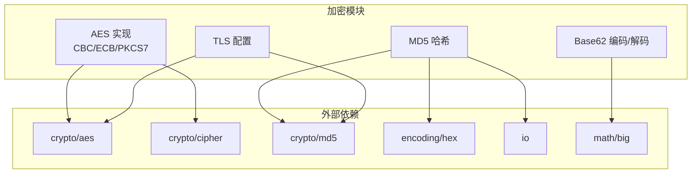
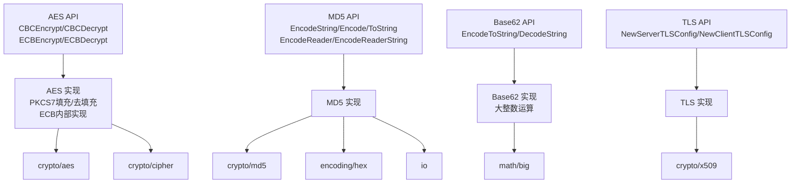
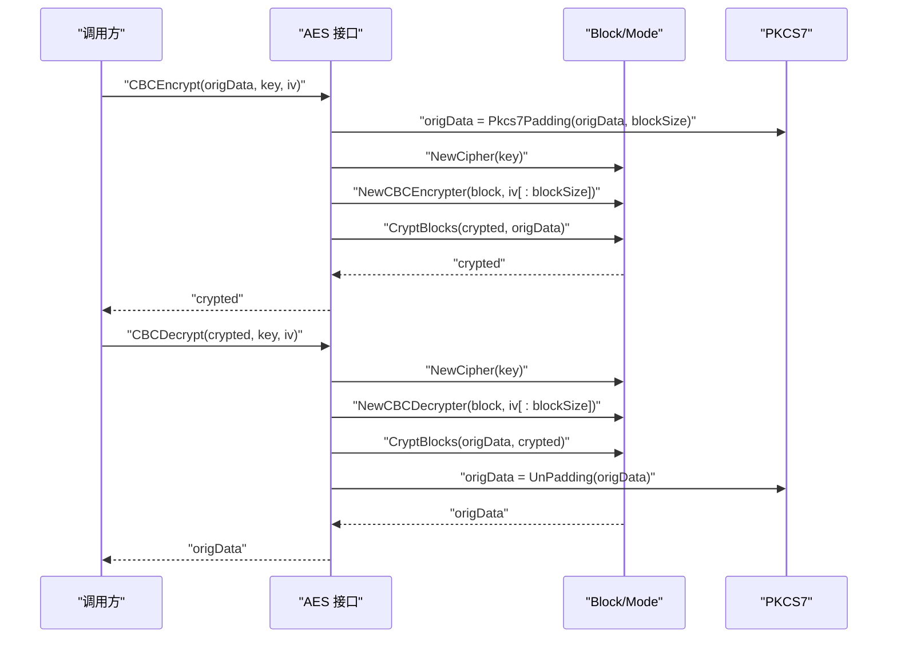
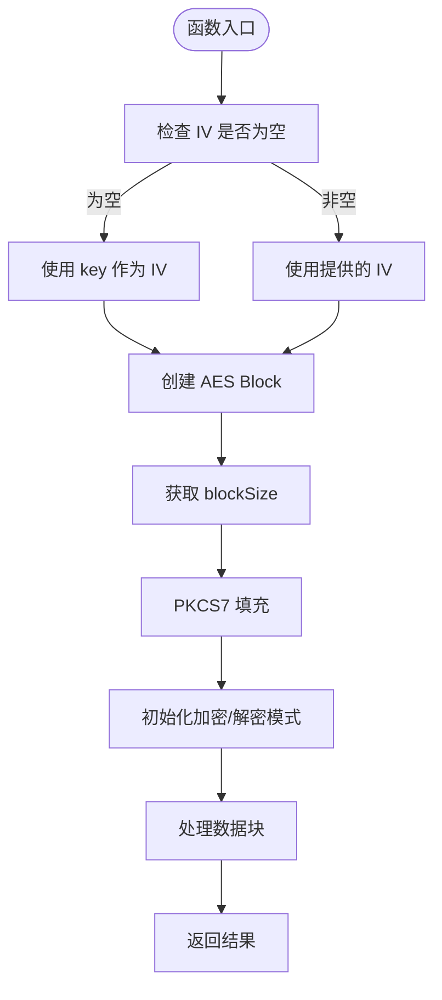
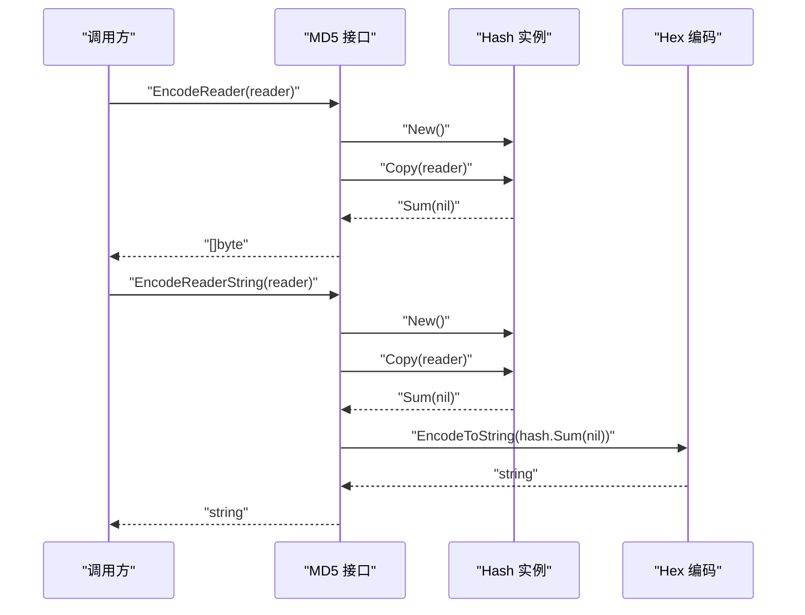
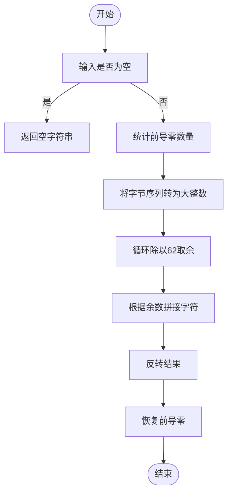
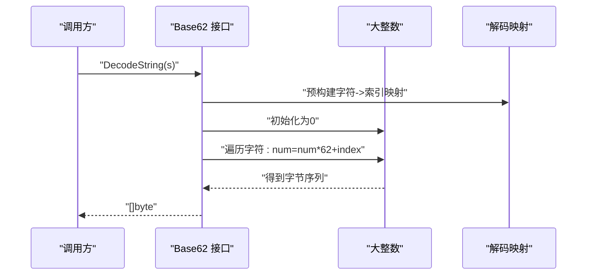
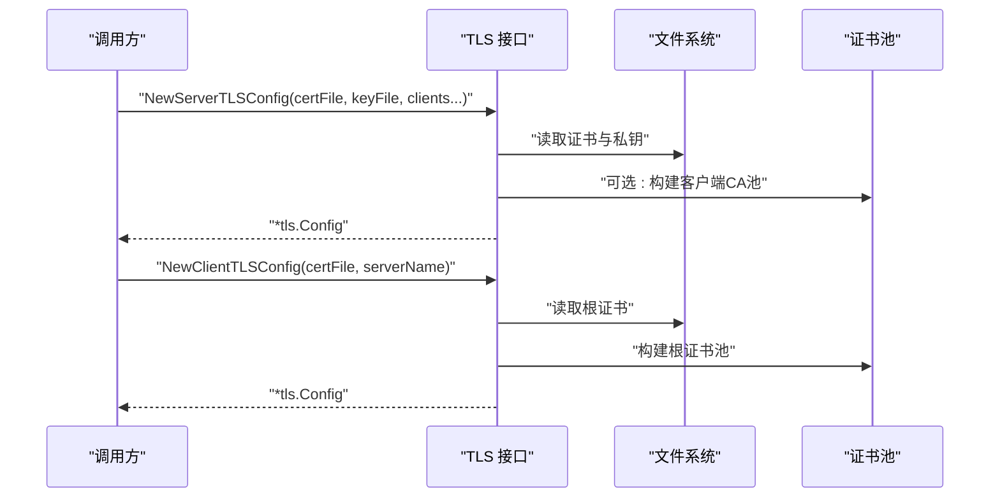
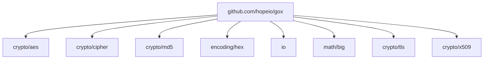

# 加密编码

<cite>
**本文档引用的文件**
- [thirdparty/gox/crypto/aes/aes.go](file://thirdparty/gox/crypto/aes/aes.go)
- [thirdparty/gox/crypto/aes/aes_test.go](file://thirdparty/gox/crypto/aes/aes_test.go)
- [thirdparty/gox/crypto/md5/md5.go](file://thirdparty/gox/crypto/md5/md5.go)
- [thirdparty/gox/crypto/md5/md5_test.go](file://thirdparty/gox/crypto/md5/md5_test.go)
- [thirdparty/gox/encoding/base62/base62.go](file://thirdparty/gox/encoding/base62/base62.go)
- [thirdparty/gox/encoding/base62/base62_test.go](file://thirdparty/gox/encoding/base62/base62_test.go)
- [thirdparty/gox/crypto/tls/tls.go](file://thirdparty/gox/crypto/tls/tls.go)
- [thirdparty/gox/go.mod](file://thirdparty/gox/go.mod)
</cite>

## 目录
1. [简介](#简介)
2. [项目结构](#项目结构)
3. [核心组件](#核心组件)
4. [架构总览](#架构总览)
5. [详细组件分析](#详细组件分析)
6. [依赖分析](#依赖分析)
7. [性能考虑](#性能考虑)
8. [故障排查指南](#故障排查指南)
9. [结论](#结论)
10. [附录](#附录)

## 简介
本文件为加密编码模块的详细API文档，覆盖以下能力：
- 对称加密：AES（CBC模式、ECB模式）
- 哈希：MD5
- 编码：Base62
- 安全传输：TLS配置（服务端/客户端）

文档内容包括各算法的API参考、安全性与性能特征、适用场景、密钥/IV/盐值等安全实现要点、最佳实践（性能优化、内存安全、错误处理），并辅以流程图与时序图帮助理解。

## 项目结构
加密编码相关代码主要位于 thirdparty/gox/crypto 与 thirdparty/gox/encoding 下，分别提供对称加密、哈希与编码功能；同时提供 TLS 配置工具用于安全传输层初始化。

图表来源
- [thirdparty/gox/crypto/aes/aes.go:1-149](file://thirdparty/gox/crypto/aes/aes.go#L1-L149)
- [thirdparty/gox/crypto/md5/md5.go:1-48](file://thirdparty/gox/crypto/md5/md5.go#L1-L48)
- [thirdparty/gox/encoding/base62/base62.go:1-121](file://thirdparty/gox/encoding/base62/base62.go#L1-L121)
- [thirdparty/gox/crypto/tls/tls.go:1-63](file://thirdparty/gox/crypto/tls/tls.go#L1-L63)

章节来源
- [thirdparty/gox/crypto/aes/aes.go:1-149](file://thirdparty/gox/crypto/aes/aes.go#L1-L149)
- [thirdparty/gox/crypto/md5/md5.go:1-48](file://thirdparty/gox/crypto/md5/md5.go#L1-L48)
- [thirdparty/gox/encoding/base62/base62.go:1-121](file://thirdparty/gox/encoding/base62/base62.go#L1-L121)
- [thirdparty/gox/crypto/tls/tls.go:1-63](file://thirdparty/gox/crypto/tls/tls.go#L1-L63)

## 核心组件
- AES 对称加密：提供 CBC/ECB 加密与解密，内置 PKCS7 填充与去填充逻辑；支持可选 IV，若未提供则默认使用 key 作为 IV。
- MD5 哈希：支持字符串、字节切片、Reader 的哈希计算，并提供十六进制字符串输出。
- Base62 编码：支持字节切片到 Base62 字符串的编码与解码，内部使用大整数运算保证精度。
- TLS 配置：提供服务端与客户端 TLS 配置构建，支持双向认证与根证书池配置。

章节来源
- [thirdparty/gox/crypto/aes/aes.go:15-149](file://thirdparty/gox/crypto/aes/aes.go#L15-L149)
- [thirdparty/gox/crypto/md5/md5.go:15-47](file://thirdparty/gox/crypto/md5/md5.go#L15-L47)
- [thirdparty/gox/encoding/base62/base62.go:10-120](file://thirdparty/gox/encoding/base62/base62.go#L10-L120)
- [thirdparty/gox/crypto/tls/tls.go:18-62](file://thirdparty/gox/crypto/tls/tls.go#L18-L62)

## 架构总览
下图展示加密编码模块与Go标准库的交互关系，以及模块内组件之间的调用关系。

图表来源
- [thirdparty/gox/crypto/aes/aes.go:15-149](file://thirdparty/gox/crypto/aes/aes.go#L15-L149)
- [thirdparty/gox/crypto/md5/md5.go:15-47](file://thirdparty/gox/crypto/md5/md5.go#L15-L47)
- [thirdparty/gox/encoding/base62/base62.go:10-120](file://thirdparty/gox/encoding/base62/base62.go#L10-L120)
- [thirdparty/gox/crypto/tls/tls.go:18-62](file://thirdparty/gox/crypto/tls/tls.go#L18-L62)

## 详细组件分析

### AES 对称加密
- 支持模式
  - CBC：带 IV 的分组加密，推荐用于大多数场景。
  - ECB：电子密码本，不推荐在生产使用，除非明确了解其局限性。
- 填充
  - 使用 PKCS7 填充，确保明文长度为块大小的整数倍。
- IV 处理
  - 若未提供 IV，实现会回退使用 key 作为 IV（不建议）；实际应用中应显式提供随机且唯一的 IV。
- 错误处理
  - 初始化 Cipher 失败或加密/解密过程中出现输入长度不合法等情况会返回错误。

图表来源
- [thirdparty/gox/crypto/aes/aes.go:15-46](file://thirdparty/gox/crypto/aes/aes.go#L15-L46)
- [thirdparty/gox/crypto/aes/aes.go:48-63](file://thirdparty/gox/crypto/aes/aes.go#L48-L63)

图表来源
- [thirdparty/gox/crypto/aes/aes.go:15-46](file://thirdparty/gox/crypto/aes/aes.go#L15-L46)

章节来源
- [thirdparty/gox/crypto/aes/aes.go:15-149](file://thirdparty/gox/crypto/aes/aes.go#L15-L149)
- [thirdparty/gox/crypto/aes/aes_test.go:13-29](file://thirdparty/gox/crypto/aes/aes_test.go#L13-L29)

### MD5 哈希
- 功能
  - 字符串与字节切片直接哈希。
  - Reader 流式哈希，适合大文件或网络流。
  - 提供字节数组到十六进制字符串的转换。
- 性能
  - 基于标准库 crypto/md5，性能稳定；流式接口避免一次性加载全部数据。
- 安全性
  - MD5 已不适用于安全敏感场景（易碰撞）。仅用于非安全用途（如校验、索引、缓存键）。

图表来源
- [thirdparty/gox/crypto/md5/md5.go:29-47](file://thirdparty/gox/crypto/md5/md5.go#L29-L47)

章节来源
- [thirdparty/gox/crypto/md5/md5.go:15-47](file://thirdparty/gox/crypto/md5/md5.go#L15-L47)
- [thirdparty/gox/crypto/md5/md5_test.go:15-53](file://thirdparty/gox/crypto/md5/md5_test.go#L15-L53)

### Base62 编码
- 功能
  - 字节切片编码为 Base62 字符串，保留前导零语义。
  - 字符串解码为字节数组，支持前导零还原。
- 实现要点
  - 内部使用大整数运算，保证任意长度字节序列的精确转换。
  - 解码时通过映射表快速定位字符索引，避免重复扫描。
- 性能
  - 时间复杂度 O(n)，n 为字节长度；空间复杂度 O(n)。

图表来源
- [thirdparty/gox/encoding/base62/base62.go:10-43](file://thirdparty/gox/encoding/base62/base62.go#L10-L43)

图表来源
- [thirdparty/gox/encoding/base62/base62.go:56-120](file://thirdparty/gox/encoding/base62/base62.go#L56-L120)

章节来源
- [thirdparty/gox/encoding/base62/base62.go:10-120](file://thirdparty/gox/encoding/base62/base62.go#L10-L120)
- [thirdparty/gox/encoding/base62/base62_test.go:8-167](file://thirdparty/gox/encoding/base62/base62_test.go#L8-L167)

### TLS 配置
- 服务端配置
  - 加载服务端证书与私钥；可选配置客户端 CA，启用双向认证。
- 客户端配置
  - 加载根证书，可设置 ServerName 进行 SNI。
- 错误处理
  - 文件读取失败、证书池构建失败等均返回错误。

图表来源
- [thirdparty/gox/crypto/tls/tls.go:18-62](file://thirdparty/gox/crypto/tls/tls.go#L18-L62)

章节来源
- [thirdparty/gox/crypto/tls/tls.go:18-62](file://thirdparty/gox/crypto/tls/tls.go#L18-L62)

## 依赖分析
- 标准库依赖
  - AES/分组模式：crypto/aes、crypto/cipher
  - MD5：crypto/md5、encoding/hex、io
  - Base62：math/big
  - TLS：crypto/tls、crypto/x509、os
- 模块依赖
  - 第三方依赖由 go.mod 统一管理，模块名为 github.com/hopeio/gox。

图表来源
- [thirdparty/gox/go.mod:1-62](file://thirdparty/gox/go.mod#L1-L62)
- [thirdparty/gox/crypto/aes/aes.go:9-13](file://thirdparty/gox/crypto/aes/aes.go#L9-L13)
- [thirdparty/gox/crypto/md5/md5.go:9-13](file://thirdparty/gox/crypto/md5/md5.go#L9-L13)
- [thirdparty/gox/encoding/base62/base62.go:3-6](file://thirdparty/gox/encoding/base62/base62.go#L3-L6)
- [thirdparty/gox/crypto/tls/tls.go:9-16](file://thirdparty/gox/crypto/tls/tls.go#L9-L16)

章节来源
- [thirdparty/gox/go.mod:1-144](file://thirdparty/gox/go.mod#L1-L144)

## 性能考虑
- AES
  - CBC/ECB 模式均为常数时间复杂度 O(n)，其中 n 为数据块数。
  - PKCS7 填充与去填充为线性开销，通常可忽略。
  - 建议使用固定长度密钥（16/24/32字节）与随机 IV，避免重复使用。
- MD5
  - 流式哈希适合大文件，避免一次性内存占用过高。
  - 对于高并发场景，注意复用 Hash 实例或使用连接池。
- Base62
  - 编码/解码为 O(n)，大整数运算成本与字节长度成正比。
  - 对于超长字节序列，建议分段处理或使用缓冲区。
- TLS
  - 证书加载与解析为一次性开销；建议在进程启动时完成配置并缓存。

## 故障排查指南
- AES
  - 输入长度不合法：ECB 加密要求输入长度为块大小整数倍，否则触发断言或错误。
  - IV 长度不足：CBC 模式会截取 IV 至 blockSize，可能导致解密失败。
  - 密钥长度错误：AES 要求 16/24/32 字节，否则初始化 Cipher 失败。
- MD5
  - Reader 读取失败：检查底层资源状态与权限。
  - 输出格式异常：确认是否需要十六进制编码。
- Base62
  - 解码非法字符：输入包含不在字母表内的字符时返回错误。
  - 前导零丢失：确保解码后正确还原前导零。
- TLS
  - 证书/私钥文件为空：检查路径与权限。
  - 客户端校验证失败：确认根证书与 ServerName 设置。

章节来源
- [thirdparty/gox/crypto/aes/aes.go:114-126](file://thirdparty/gox/crypto/aes/aes.go#L114-L126)
- [thirdparty/gox/crypto/aes/aes.go:136-148](file://thirdparty/gox/crypto/aes/aes.go#L136-L148)
- [thirdparty/gox/crypto/md5/md5.go:29-47](file://thirdparty/gox/crypto/md5/md5.go#L29-L47)
- [thirdparty/gox/encoding/base62/base62.go:56-120](file://thirdparty/gox/encoding/base62/base62.go#L56-L120)
- [thirdparty/gox/crypto/tls/tls.go:18-62](file://thirdparty/gox/crypto/tls/tls.go#L18-L62)

## 结论
本模块提供了简洁稳定的加密编码能力：
- AES：满足常见对称加密需求，推荐 CBC 模式并配合随机 IV。
- MD5：适合非安全场景的哈希与校验。
- Base62：适合短 ID、URL 友好编码等场景。
- TLS：提供服务端与客户端配置工具，便于快速建立安全连接。

在生产环境中，请结合业务安全策略选择合适算法与参数，并遵循密钥管理、IV/盐值随机性、证书轮换等最佳实践。

## 附录

### API 参考（按模块）

- AES
  - CBCEncrypt(origData, key, iv) -> ([]byte, error)
  - CBCDecrypt(crypted, key, iv) -> ([]byte, error)
  - ECBEncrypt(data, key) -> ([]byte, error)
  - ECBDecrypt(crypted, key) -> ([]byte, error)
  - Pkcs7Padding(cipherText, blockSize) -> []byte
  - UnPadding(origData) -> []byte
  - Pkcs5Padding(cipherText, blockSize) -> []byte
  - NewECBEncrypter(block) -> cipher.BlockMode
  - NewECBDecrypter(block) -> cipher.BlockMode
- MD5
  - EncodeString(value string) -> string
  - Encode(value string) -> []byte
  - ToString(md5 []byte) -> string
  - EncodeReader(r io.Reader) -> ([]byte, error)
  - EncodeReaderString(r io.Reader) -> (string, error)
- Base62
  - EncodeToString(data []byte) -> string
  - DecodeString(s string) -> ([]byte, error)
- TLS
  - NewServerTLSConfig(certFile, keyFile string, clients ...string) -> (*tls.Config, error)
  - NewClientTLSConfig(certFile, serverName string) -> (*tls.Config, error)

章节来源
- [thirdparty/gox/crypto/aes/aes.go:15-149](file://thirdparty/gox/crypto/aes/aes.go#L15-L149)
- [thirdparty/gox/crypto/md5/md5.go:15-47](file://thirdparty/gox/crypto/md5/md5.go#L15-L47)
- [thirdparty/gox/encoding/base62/base62.go:10-120](file://thirdparty/gox/encoding/base62/base62.go#L10-L120)
- [thirdparty/gox/crypto/tls/tls.go:18-62](file://thirdparty/gox/crypto/tls/tls.go#L18-L62)