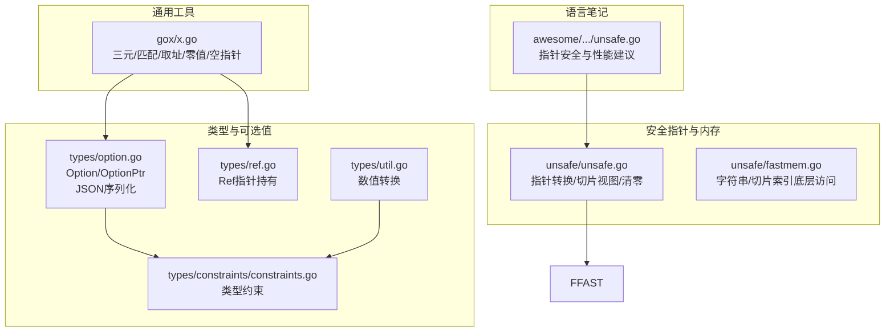
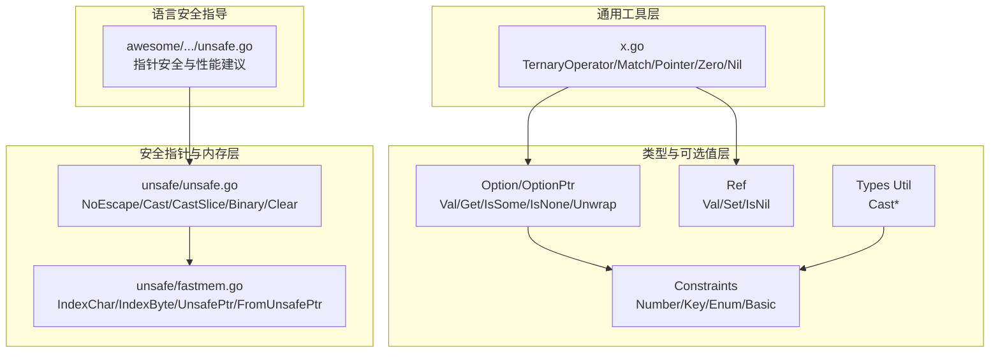
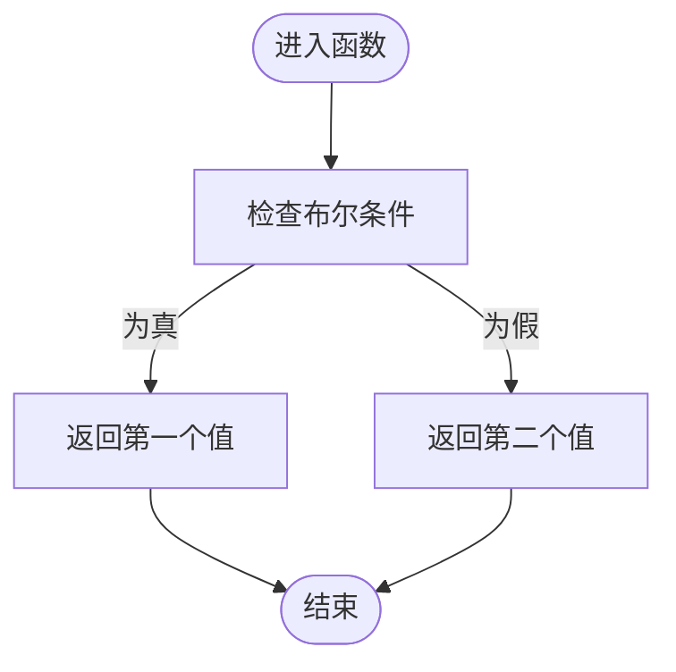
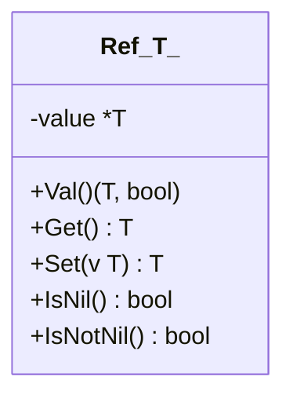
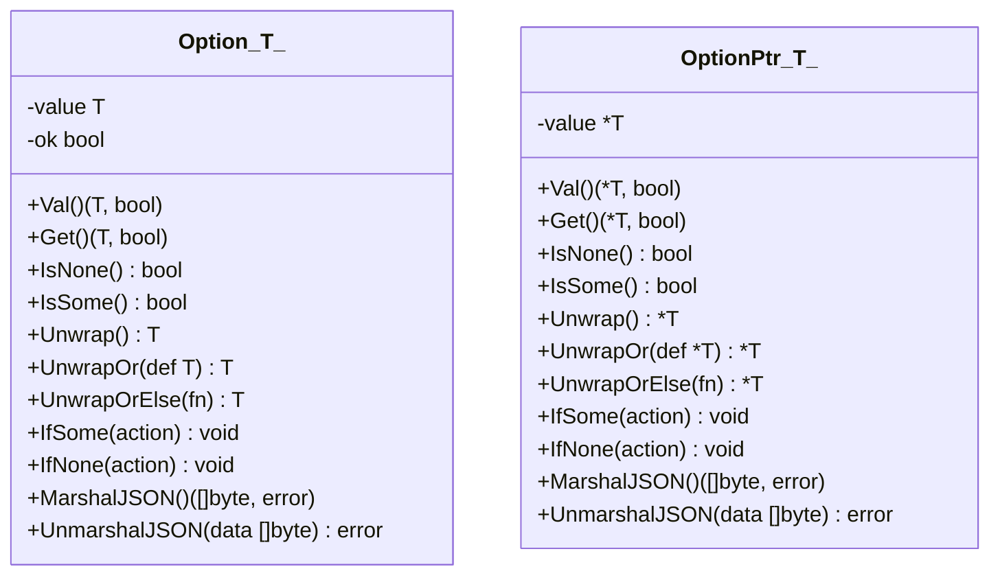
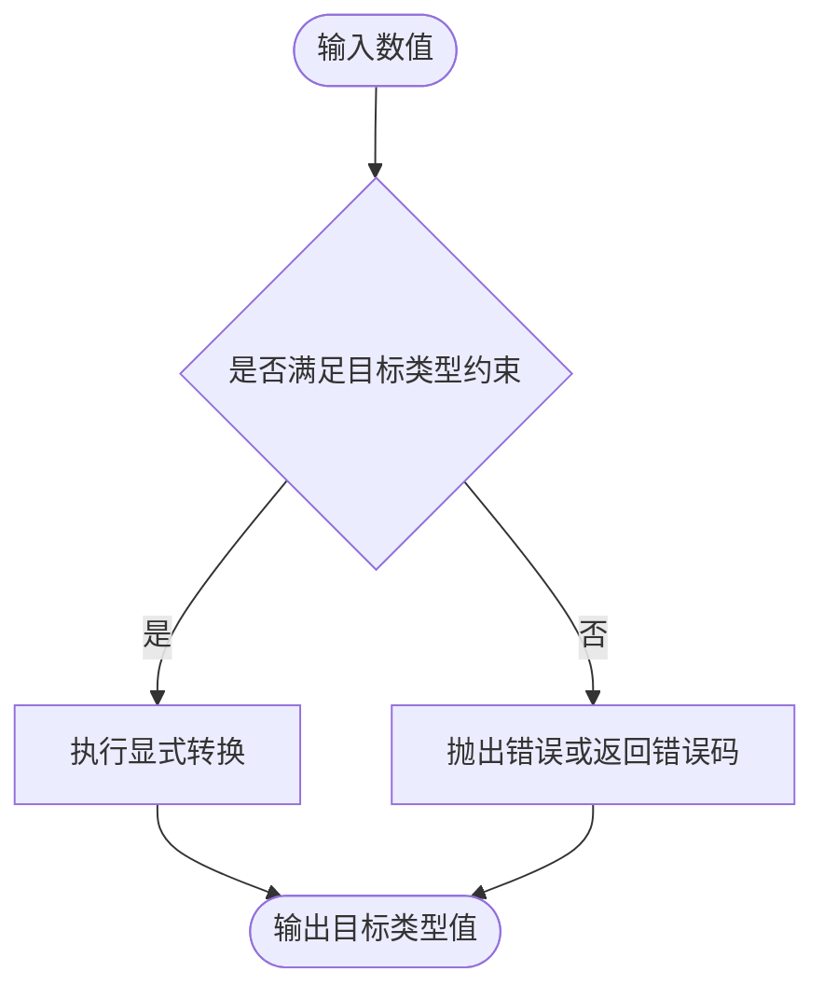
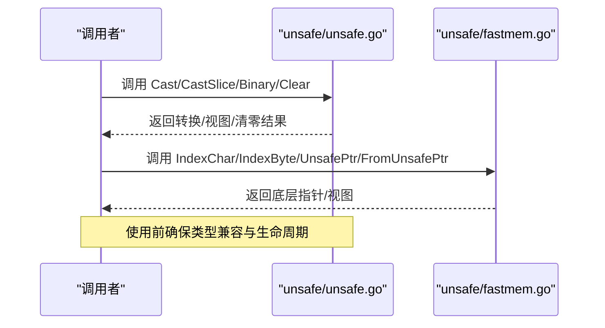
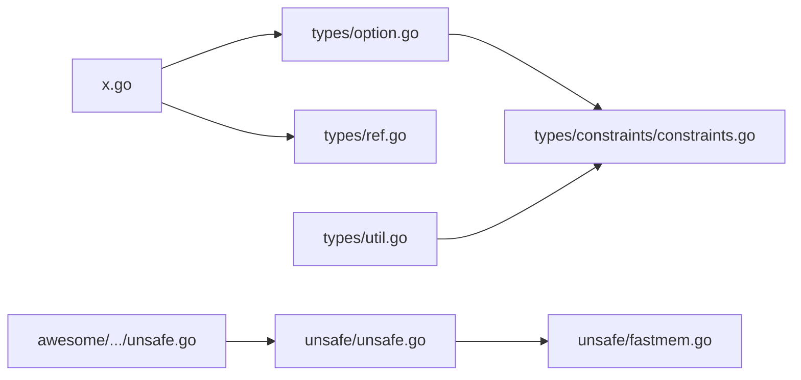

# 基础工具函数

<cite>
**本文档引用的文件**
- [x.go](file://thirdparty/gox/x.go)
- [option.go](file://thirdparty/gox/types/option.go)
- [ref.go](file://thirdparty/gox/types/ref.go)
- [constraints.go](file://thirdparty/gox/types/constraints/constraints.go)
- [util.go](file://thirdparty/gox/types/util.go)
- [unsafe.go](file://thirdparty/gox/unsafe/unsafe.go)
- [fastmem.go](file://thirdparty/gox/unsafe/fastmem.go)
- [unsafe.go（语言笔记）](file://awesome/lang/go/lang/unsafe/unsafe.go)
- [option_test.go](file://thirdparty/gox/types/option_test.go)
</cite>

## 目录
1. [简介](#简介)
2. [项目结构](#项目结构)
3. [核心组件](#核心组件)
4. [架构总览](#架构总览)
5. [详细组件分析](#详细组件分析)
6. [依赖分析](#依赖分析)
7. [性能考量](#性能考量)
8. [故障排查指南](#故障排查指南)
9. [结论](#结论)
10. [附录](#附录)

## 简介
本文件聚焦于基础工具函数模块，系统性梳理并解释以下核心能力：
- 三元运算符与条件匹配：提供类型安全的布尔分支选择工具，简化条件赋值与分支逻辑。
- 指针操作：封装安全的取址、空指针构造与零值指针获取，配合 Ref 类型实现可选的指针持有语义。
- 零值处理：提供多种零值构造方式，覆盖值语义与指针语义的零值需求。
- 泛型支持与类型安全：所有工具函数均为泛型实现，结合约束接口确保类型安全与可扩展性。
- 指针操作安全性与内存管理最佳实践：在 unsafe 包与反射辅助下，提供高性能但需谨慎使用的底层能力。

本模块广泛应用于配置、模型、序列化与高性能计算等场景，帮助开发者以更简洁、安全的方式表达常见编程模式。

## 项目结构
基础工具函数分布在以下子模块：
- 通用工具：位于 gox/x.go，提供三元运算符、条件匹配、取址、零值与空指针等基础能力。
- 类型与可选值：位于 gox/types，包含 Option、OptionPtr、Ref 等，用于表达“存在/缺失”的语义，并提供 JSON 序列化支持。
- 类型约束：位于 gox/types/constraints，定义数字、键、枚举等约束，支撑泛型的类型安全。
- 类型转换工具：位于 gox/types/util.go，提供数值类型之间的显式转换。
- 安全指针与内存：位于 gox/unsafe，提供指针转换、切片视图、二进制视图与内存清零等能力；配合 fastmem 提供字符串/切片索引的底层访问。
- 语言笔记与安全提示：位于 awesome/lang/go/lang/unsafe/unsafe.go，强调指针安全与性能权衡。

**图表来源**
- [x.go:1-35](file://thirdparty/gox/x.go#L1-L35)
- [option.go:1-192](file://thirdparty/gox/types/option.go#L1-L192)
- [ref.go:1-41](file://thirdparty/gox/types/ref.go#L1-L41)
- [constraints.go:1-44](file://thirdparty/gox/types/constraints/constraints.go#L1-L44)
- [util.go:1-33](file://thirdparty/gox/types/util.go#L1-L33)
- [unsafe.go:1-34](file://thirdparty/gox/unsafe/unsafe.go#L1-L34)
- [fastmem.go:1-36](file://thirdparty/gox/unsafe/fastmem.go#L1-L36)
- [unsafe.go（语言笔记）:64-105](file://awesome/lang/go/lang/unsafe/unsafe.go#L64-L105)

**章节来源**
- [x.go:1-35](file://thirdparty/gox/x.go#L1-L35)
- [option.go:1-192](file://thirdparty/gox/types/option.go#L1-L192)
- [ref.go:1-41](file://thirdparty/gox/types/ref.go#L1-L41)
- [constraints.go:1-44](file://thirdparty/gox/types/constraints/constraints.go#L1-L44)
- [util.go:1-33](file://thirdparty/gox/types/util.go#L1-L33)
- [unsafe.go:1-34](file://thirdparty/gox/unsafe/unsafe.go#L1-L34)
- [fastmem.go:1-36](file://thirdparty/gox/unsafe/fastmem.go#L1-L36)
- [unsafe.go（语言笔记）:64-105](file://awesome/lang/go/lang/unsafe/unsafe.go#L64-L105)

## 核心组件
本节从设计目的、使用场景、性能特点与类型安全角度，逐一解析关键工具函数。

- 三元运算符与条件匹配
  - 设计目的：提供类型安全的布尔分支选择，替代冗长的 if-else 或显式的条件赋值，提升可读性与一致性。
  - 使用场景：根据布尔条件在两个同类型值之间选择，常用于默认值选择、策略切换与条件赋值。
  - 性能特点：纯内联逻辑，无额外分配；分支预测友好。
  - 类型安全：泛型约束确保 a、b、返回值类型一致，避免类型不匹配。
  - 示例路径：[x.go:3-15](file://thirdparty/gox/x.go#L3-L15)

- 指针操作
  - 设计目的：统一取址、空指针与零值指针的构造方式，便于与 OptionPtr 协作表达“可空”语义。
  - 使用场景：需要指针语义的场景（如可选值、共享状态、避免大对象拷贝）。
  - 性能特点：取址与空指针构造为 O(1)，无额外分配；注意避免悬垂指针与竞态。
  - 类型安全：泛型确保指针与值类型一致；配合 Ref 提供可选的指针持有与读写控制。
  - 示例路径：[x.go:17-28](file://thirdparty/gox/x.go#L17-L28), [ref.go:13-40](file://thirdparty/gox/types/ref.go#L13-L40)

- 零值处理
  - 设计目的：提供多种零值构造方式，满足值语义与指针语义的零值需求。
  - 使用场景：初始化、默认值填充、占位与对比。
  - 性能特点：Zero 与 Nil 为纯零值构造，zero 通过 new 分配但立即置零，适合需要指针的零值。
  - 类型安全：泛型确保返回值类型正确。
  - 示例路径：[x.go:21-32](file://thirdparty/gox/x.go#L21-L32)

- 可选值（Option/OptionPtr）
  - 设计目的：表达“存在/缺失”，避免使用 nil 带来的空指针风险，提供安全的解包与默认值处理。
  - 使用场景：数据库查询结果、可选配置、解析/转换流程中的失败分支。
  - 性能特点：Option 为值类型，可能产生多次拷贝；OptionPtr 仅持有指针，避免值拷贝但需注意生命周期。
  - 类型安全：泛型与约束确保类型一致；提供 JSON 序列化支持，便于跨层传输。
  - 示例路径：[option.go:14-100](file://thirdparty/gox/types/option.go#L14-L100), [option.go:102-192](file://thirdparty/gox/types/option.go#L102-L192)

- 数值转换工具
  - 设计目的：在整数、浮点、有符号/无符号等数值类型间进行显式转换，避免隐式精度损失或截断。
  - 使用场景：输入校验、协议字段转换、统计计算前的数据规整。
  - 性能特点：纯类型转换，O(1) 时间与空间。
  - 类型安全：通过约束接口限制可转换的类型集合。
  - 示例路径：[util.go:14-32](file://thirdparty/gox/types/util.go#L14-L32), [constraints.go:19-35](file://thirdparty/gox/types/constraints/constraints.go#L19-L35)

- 安全指针与内存操作
  - 设计目的：在严格边界与安全的前提下，提供高性能的指针转换、切片视图与内存清零能力。
  - 使用场景：高性能序列化、内存映射、缓冲区操作与零拷贝视图。
  - 性能特点：Cast/CastSlice/Binary 提供零拷贝视图；Clear 清零内存块；unsafe 操作需谨慎。
  - 类型安全：依赖调用方确保类型兼容与生命周期；NoEscape 用于逃逸控制。
  - 示例路径：[unsafe.go:13-34](file://thirdparty/gox/unsafe/unsafe.go#L13-L34), [fastmem.go:15-35](file://thirdparty/gox/unsafe/fastmem.go#L15-L35)

**章节来源**
- [x.go:3-32](file://thirdparty/gox/x.go#L3-L32)
- [option.go:14-192](file://thirdparty/gox/types/option.go#L14-L192)
- [ref.go:9-41](file://thirdparty/gox/types/ref.go#L9-L41)
- [util.go:14-32](file://thirdparty/gox/types/util.go#L14-L32)
- [constraints.go:15-44](file://thirdparty/gox/types/constraints/constraints.go#L15-L44)
- [unsafe.go:13-34](file://thirdparty/gox/unsafe/unsafe.go#L13-L34)
- [fastmem.go:15-35](file://thirdparty/gox/unsafe/fastmem.go#L15-L35)

## 架构总览
下图展示了基础工具函数模块的整体关系与交互：

**图表来源**
- [x.go:3-32](file://thirdparty/gox/x.go#L3-L32)
- [option.go:14-192](file://thirdparty/gox/types/option.go#L14-L192)
- [ref.go:9-41](file://thirdparty/gox/types/ref.go#L9-L41)
- [constraints.go:19-44](file://thirdparty/gox/types/constraints/constraints.go#L19-L44)
- [util.go:14-32](file://thirdparty/gox/types/util.go#L14-L32)
- [unsafe.go:13-34](file://thirdparty/gox/unsafe/unsafe.go#L13-L34)
- [fastmem.go:15-35](file://thirdparty/gox/unsafe/fastmem.go#L15-L35)
- [unsafe.go（语言笔记）:64-105](file://awesome/lang/go/lang/unsafe/unsafe.go#L64-L105)

## 详细组件分析

### 三元运算符与条件匹配
- 功能要点
  - TernaryOperator：基于布尔条件在两个同类型值间选择，适合默认值与策略切换。
  - Match：与三元运算符等价，命名更强调“匹配”语义。
  - 设计思想：以最小抽象表达分支逻辑，减少样板代码。
- 使用建议
  - 优先用于简单分支与默认值场景；复杂逻辑建议拆分为独立函数以保持可读性。
  - 与泛型结合，确保 a、b 与返回值类型一致，避免隐式转换。
- 示例路径
  - [x.go:3-15](file://thirdparty/gox/x.go#L3-L15)

**图表来源**
- [x.go:3-15](file://thirdparty/gox/x.go#L3-L15)

**章节来源**
- [x.go:3-15](file://thirdparty/gox/x.go#L3-L15)

### 指针操作与零值处理
- 功能要点
  - Pointer：对任意值取址，返回其指针；适合需要指针语义的场景。
  - Zero/Nil/zero：提供三种零值构造方式，分别对应值零、指针零与通过 new 初始化的零值。
  - Ref：封装 *T 的持有与读写，提供 Val/Get/Set/IsNil 等方法，便于可选指针语义。
- 安全性与最佳实践
  - 避免悬垂指针：确保被取址对象的生命周期覆盖指针使用期。
  - 控制可变性：优先使用不可变引用，必要时再使用 Ref/Set。
  - 与 OptionPtr 协作：在需要“可空”语义时，优先使用 OptionPtr 并通过 IsSome/IsNone 显式判断。
- 示例路径
  - [x.go:17-32](file://thirdparty/gox/x.go#L17-L32)
  - [ref.go:13-40](file://thirdparty/gox/types/ref.go#L13-L40)

**图表来源**
- [ref.go:9-41](file://thirdparty/gox/types/ref.go#L9-L41)

**章节来源**
- [x.go:17-32](file://thirdparty/gox/x.go#L17-L32)
- [ref.go:13-40](file://thirdparty/gox/types/ref.go#L13-L40)

### 可选值（Option 与 OptionPtr）
- 功能要点
  - Option：值类型的可选值容器，包含值与存在标记；提供 Val/Get/IsSome/IsNone/Unwrap/UnwrapOr/UnwrapOrElse/MapOption/IfSome/IfNone/MarshalJSON/UnmarshalJSON。
  - OptionPtr：指针类型的可选值容器，适合避免值拷贝的场景；提供与 Option 对应的方法族。
- 使用建议
  - 优先使用 Option 表达“存在/缺失”，在需要零拷贝或共享所有权时使用 OptionPtr。
  - 使用 MapOption/MapOptionPtr 进行链式转换，避免深层 if-else。
  - 通过 JSON 序列化支持，便于跨服务传输。
- 示例路径
  - [option.go:14-100](file://thirdparty/gox/types/option.go#L14-L100)
  - [option.go:102-192](file://thirdparty/gox/types/option.go#L102-L192)
  - [option_test.go:11-23](file://thirdparty/gox/types/option_test.go#L11-L23)

**图表来源**
- [option.go:14-192](file://thirdparty/gox/types/option.go#L14-L192)

**章节来源**
- [option.go:14-192](file://thirdparty/gox/types/option.go#L14-L192)
- [option_test.go:11-23](file://thirdparty/gox/types/option_test.go#L11-L23)

### 数值转换工具
- 功能要点
  - CastSigned/CastFloat/CastUnsigned/CastInteger/CastNumber：在数值类型间进行显式转换，受约束接口保护。
  - 约束接口：Number/Basic/Ordered/Enum 等，限定可转换的类型范围。
- 使用建议
  - 明确转换方向与精度损失风险；在边界值处进行校验。
  - 优先使用显式转换而非隐式，提升可读性与可维护性。
- 示例路径
  - [util.go:14-32](file://thirdparty/gox/types/util.go#L14-L32)
  - [constraints.go:19-44](file://thirdparty/gox/types/constraints/constraints.go#L19-L44)

**图表来源**
- [util.go:14-32](file://thirdparty/gox/types/util.go#L14-L32)
- [constraints.go:19-44](file://thirdparty/gox/types/constraints/constraints.go#L19-L44)

**章节来源**
- [util.go:14-32](file://thirdparty/gox/types/util.go#L14-L32)
- [constraints.go:19-44](file://thirdparty/gox/types/constraints/constraints.go#L19-L44)

### 安全指针与内存操作
- 功能要点
  - NoEscape：防止指针逃逸，常用于性能敏感路径。
  - Cast/CastSlice/Binary/Clear：提供指针转换、切片视图与内存清零。
  - FastMem：IndexChar/IndexByte/UnsafePtr/FromUnsafePtr，提供字符串/切片底层索引访问。
- 安全性与最佳实践
  - 严格遵守类型兼容性与生命周期；避免越界访问。
  - 在高并发场景下，注意内存屏障与原子操作。
  - 结合语言笔记中的建议，平衡性能与安全性。
- 示例路径
  - [unsafe.go:13-34](file://thirdparty/gox/unsafe/unsafe.go#L13-L34)
  - [fastmem.go:15-35](file://thirdparty/gox/unsafe/fastmem.go#L15-L35)
  - [unsafe.go（语言笔记）:64-105](file://awesome/lang/go/lang/unsafe/unsafe.go#L64-L105)

**图表来源**
- [unsafe.go:13-34](file://thirdparty/gox/unsafe/unsafe.go#L13-L34)
- [fastmem.go:15-35](file://thirdparty/gox/unsafe/fastmem.go#L15-L35)

**章节来源**
- [unsafe.go:13-34](file://thirdparty/gox/unsafe/unsafe.go#L13-L34)
- [fastmem.go:15-35](file://thirdparty/gox/unsafe/fastmem.go#L15-L35)
- [unsafe.go（语言笔记）:64-105](file://awesome/lang/go/lang/unsafe/unsafe.go#L64-L105)

## 依赖分析
- 组件耦合
  - 通用工具层与类型层松耦合，通过泛型与约束接口连接。
  - Option/OptionPtr 依赖约束接口以确保类型安全。
  - 安全指针层与语言笔记层相互补充，前者提供能力，后者提供安全建议。
- 外部依赖
  - 类型约束依赖 golang.org/x/exp/constraints。
  - JSON 序列化依赖 encoding/json（通过中间层）。
- 循环依赖
  - 各模块自顶向下组织，未见循环依赖迹象。

**图表来源**
- [x.go:3-32](file://thirdparty/gox/x.go#L3-L32)
- [option.go:14-192](file://thirdparty/gox/types/option.go#L14-L192)
- [ref.go:13-40](file://thirdparty/gox/types/ref.go#L13-L40)
- [constraints.go:19-44](file://thirdparty/gox/types/constraints/constraints.go#L19-L44)
- [util.go:14-32](file://thirdparty/gox/types/util.go#L14-L32)
- [unsafe.go:13-34](file://thirdparty/gox/unsafe/unsafe.go#L13-L34)
- [fastmem.go:15-35](file://thirdparty/gox/unsafe/fastmem.go#L15-L35)
- [unsafe.go（语言笔记）:64-105](file://awesome/lang/go/lang/unsafe/unsafe.go#L64-L105)

**章节来源**
- [x.go:3-32](file://thirdparty/gox/x.go#L3-L32)
- [option.go:14-192](file://thirdparty/gox/types/option.go#L14-L192)
- [ref.go:13-40](file://thirdparty/gox/types/ref.go#L13-L40)
- [constraints.go:19-44](file://thirdparty/gox/types/constraints/constraints.go#L19-L44)
- [util.go:14-32](file://thirdparty/gox/types/util.go#L14-L32)
- [unsafe.go:13-34](file://thirdparty/gox/unsafe/unsafe.go#L13-L34)
- [fastmem.go:15-35](file://thirdparty/gox/unsafe/fastmem.go#L15-L35)
- [unsafe.go（语言笔记）:64-105](file://awesome/lang/go/lang/unsafe/unsafe.go#L64-L105)

## 性能考量
- 泛型内联与分支预测：三元运算符与条件匹配为纯内联逻辑，分支预测友好，适合高频路径。
- 值类型 vs 指针类型：Option 为值类型，可能带来拷贝成本；OptionPtr 仅持有指针，避免拷贝但需关注生命周期。
- unsafe 操作：Cast/CastSlice/Binary 提供零拷贝视图，但需确保类型兼容与边界安全；Clear 提供批量清零，适合初始化场景。
- 指针与缓存：按值传递通常具有更好的局部性；仅在需要所有权与可变性时使用指针，遵循语言笔记中的安全建议。

[本节为通用性能讨论，无需特定文件来源]

## 故障排查指南
- 空指针解包
  - 症状：调用 Unwrap/UnwrapOr/UnwrapOrElse 时触发异常。
  - 排查：先调用 IsSome/IsNone 判断是否存在值；或使用 UnwrapOrElse 提供回退逻辑。
  - 参考路径：[option.go:46-65](file://thirdparty/gox/types/option.go#L46-L65), [option.go:139-158](file://thirdparty/gox/types/option.go#L139-L158)
- 指针生命周期问题
  - 症状：读取到脏数据或崩溃。
  - 排查：确认被取址对象的生命周期覆盖指针使用期；避免悬垂指针。
  - 参考路径：[x.go:17-19](file://thirdparty/gox/x.go#L17-L19), [ref.go:24-32](file://thirdparty/gox/types/ref.go#L24-L32)
- unsafe 操作越界
  - 症状：内存访问异常或数据损坏。
  - 排查：严格校验索引与长度；确保类型兼容；必要时添加边界检查。
  - 参考路径：[fastmem.go:16-23](file://thirdparty/gox/unsafe/fastmem.go#L16-L23), [unsafe.go:20-26](file://thirdparty/gox/unsafe/unsafe.go#L20-L26)
- JSON 序列化/反序列化异常
  - 症状：序列化为 null 或反序列化失败。
  - 排查：检查 Option/OptionPtr 的存在状态；确认数据格式与类型匹配。
  - 参考路径：[option.go:86-100](file://thirdparty/gox/types/option.go#L86-L100), [option.go:179-191](file://thirdparty/gox/types/option.go#L179-L191)

**章节来源**
- [option.go:46-65](file://thirdparty/gox/types/option.go#L46-L65)
- [option.go:139-158](file://thirdparty/gox/types/option.go#L139-L158)
- [x.go:17-19](file://thirdparty/gox/x.go#L17-L19)
- [ref.go:24-32](file://thirdparty/gox/types/ref.go#L24-L32)
- [fastmem.go:16-23](file://thirdparty/gox/unsafe/fastmem.go#L16-L23)
- [unsafe.go:20-26](file://thirdparty/gox/unsafe/unsafe.go#L20-L26)
- [option.go:86-100](file://thirdparty/gox/types/option.go#L86-L100)
- [option.go:179-191](file://thirdparty/gox/types/option.go#L179-L191)

## 结论
基础工具函数模块通过泛型与约束接口实现了类型安全与可扩展性，覆盖了三元运算、条件匹配、指针操作与零值处理等核心场景。结合 Option/OptionPtr 的可选值语义与 JSON 支持，能够有效降低空指针风险并提升跨层通信的稳定性。在高性能场景下，unsafe 与 fastmem 提供了强大的底层能力，但需严格遵循安全建议与生命周期管理。整体而言，该模块为构建健壮、可维护且高性能的应用提供了坚实的基础。

[本节为总结性内容，无需特定文件来源]

## 附录
- 实际项目使用建议
  - 简单分支：优先使用 TernaryOperator/Match。
  - 可选值：优先使用 Option；需要零拷贝时使用 OptionPtr。
  - 指针语义：仅在需要所有权与可变性时使用 Pointer/Ref；否则按值传递。
  - 数值转换：明确转换方向与精度，使用 Cast* 显式转换。
  - unsafe 操作：仅在充分测试与边界检查的前提下使用，并记录风险与替代方案。

[本节为通用建议，无需特定文件来源]