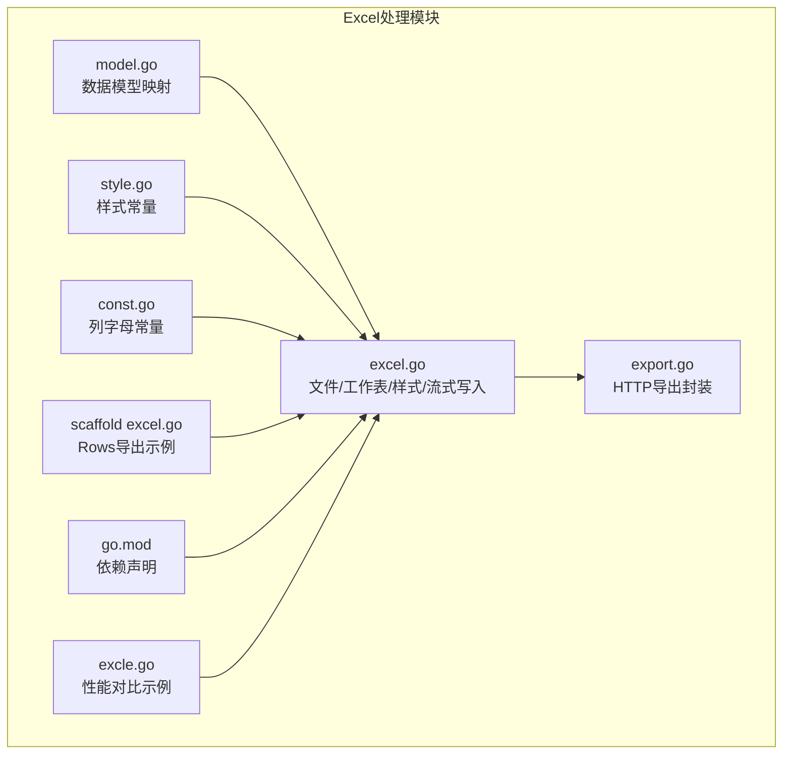
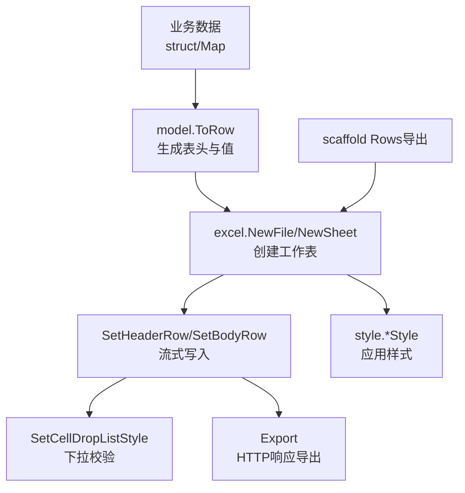
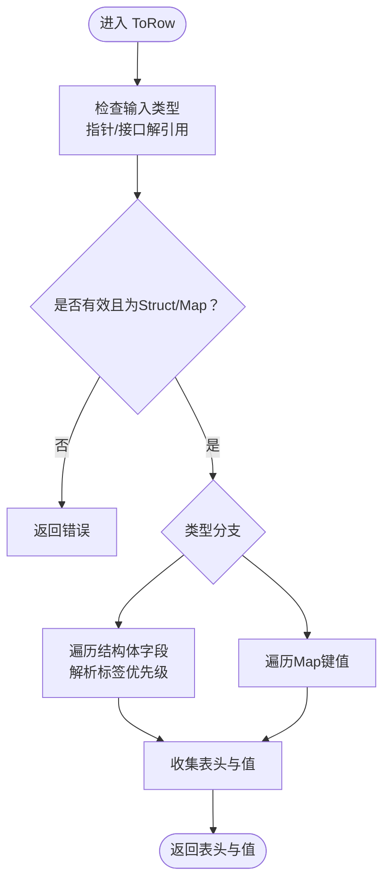
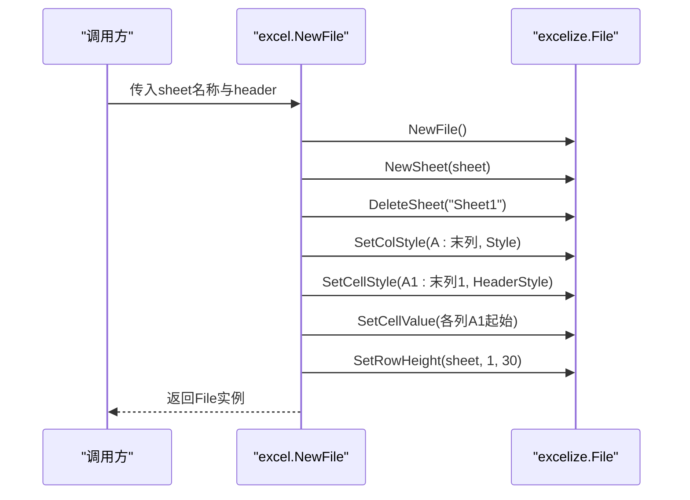
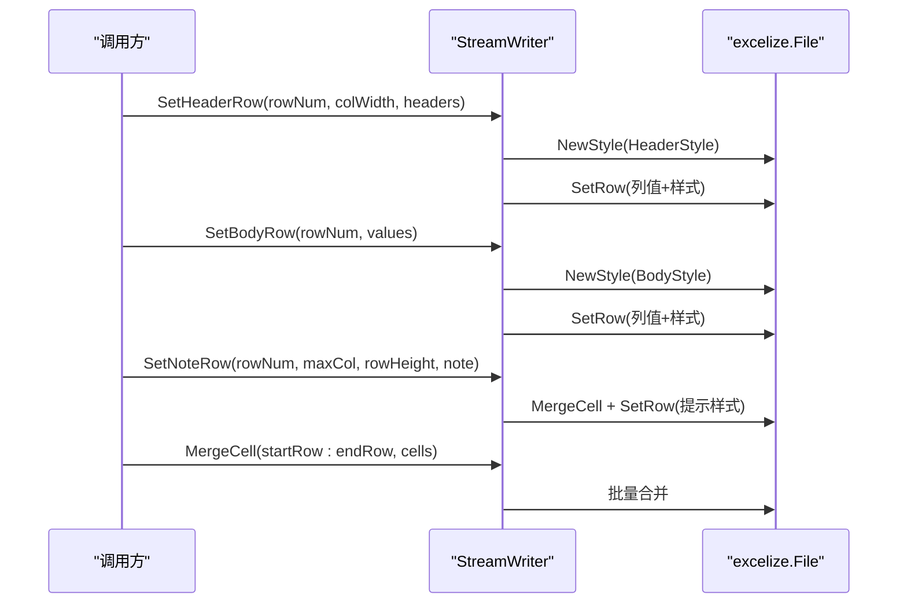
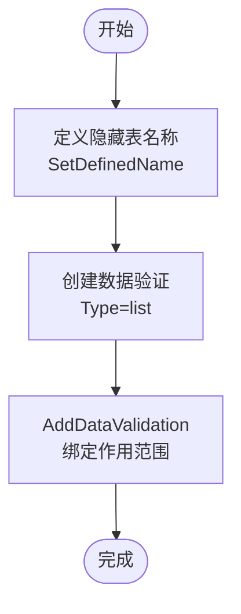
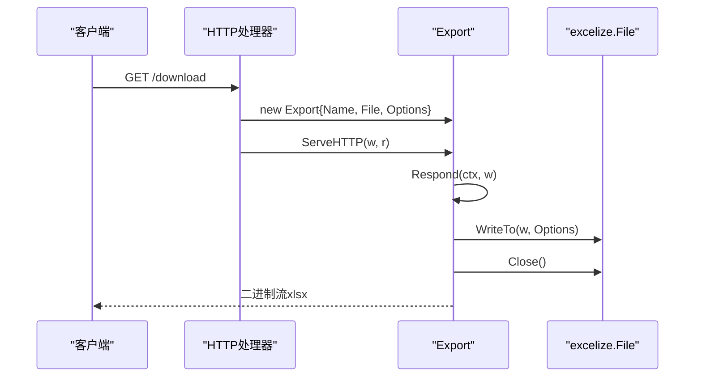
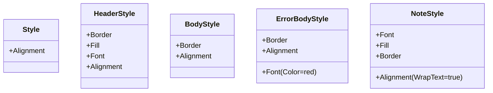
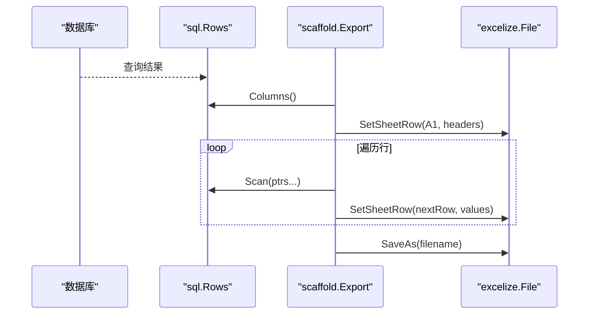

# Excel处理

<cite>
**本文档引用的文件**
- [excel.go](file://thirdparty/gox/encoding/excel/excel.go)
- [style.go](file://thirdparty/gox/encoding/excel/style.go)
- [export.go](file://thirdparty/gox/encoding/excel/export.go)
- [const.go](file://thirdparty/gox/encoding/excel/const.go)
- [model.go](file://thirdparty/gox/encoding/excel/model.go)
- [excel.go](file://thirdparty/scaffold/export/excel/excel.go)
- [go.mod](file://thirdparty/gox/go.mod)
- [excle.go](file://awesome/lang/go/custom/excel/excle.go)
</cite>

## 目录
1. [简介](#简介)
2. [项目结构](#项目结构)
3. [核心组件](#核心组件)
4. [架构总览](#架构总览)
5. [详细组件分析](#详细组件分析)
6. [依赖关系分析](#依赖关系分析)
7. [性能考虑](#性能考虑)
8. [故障排查指南](#故障排查指南)
9. [结论](#结论)
10. [附录](#附录)

## 简介
本模块提供完整的Excel处理能力，覆盖数据模型映射、单元格与样式操作、流式写入、批量导出、下拉校验、合并单元格等核心功能。支持以结构体或Map形式将数据转为表格行，并通过统一的样式体系保证输出一致性；同时提供HTTP响应式导出能力，便于在Web服务中直接下载。

## 项目结构
Excel处理相关代码主要位于第三方库模块中，核心文件包括：
- 数据模型与行转换：model.go
- 文件与工作表操作：excel.go
- 样式常量与预设：style.go
- 导出封装（HTTP响应）：export.go
- 列字母常量与编号：const.go
- Scaffold导出示例：excel.go（数据库Rows导出）
- 依赖声明：go.mod
- 性能对比示例：excle.go



**图表来源**
- [excel.go:1-180](file://thirdparty/gox/encoding/excel/excel.go#L1-L180)
- [style.go:1-136](file://thirdparty/gox/encoding/excel/style.go#L1-L136)
- [export.go:1-41](file://thirdparty/gox/encoding/excel/export.go#L1-L41)
- [const.go:1-53](file://thirdparty/gox/encoding/excel/const.go#L1-L53)
- [model.go:1-52](file://thirdparty/gox/encoding/excel/model.go#L1-L52)
- [excel.go:1-59](file://thirdparty/scaffold/export/excel/excel.go#L1-L59)
- [go.mod:1-144](file://thirdparty/gox/go.mod#L1-L144)
- [excle.go:1-106](file://awesome/lang/go/custom/excel/excle.go#L1-L106)

**章节来源**
- [excel.go:1-180](file://thirdparty/gox/encoding/excel/excel.go#L1-L180)
- [style.go:1-136](file://thirdparty/gox/encoding/excel/style.go#L1-L136)
- [export.go:1-41](file://thirdparty/gox/encoding/excel/export.go#L1-L41)
- [const.go:1-53](file://thirdparty/gox/encoding/excel/const.go#L1-L53)
- [model.go:1-52](file://thirdparty/gox/encoding/excel/model.go#L1-L52)
- [excel.go:1-59](file://thirdparty/scaffold/export/excel/excel.go#L1-L59)
- [go.mod:1-144](file://thirdparty/gox/go.mod#L1-L144)
- [excle.go:1-106](file://awesome/lang/go/custom/excel/excle.go#L1-L106)

## 核心组件
- 数据模型映射：将结构体或Map转换为表头与值，支持标签优先级（excel > json > comment > 字段名）。
- 文件与工作表：创建新文件、新增工作表、设置表头、行高、列宽、样式应用。
- 流式写入：提供StreamWriter封装，支持表头、正文、提示行的批量写入与样式应用。
- 样式体系：内置通用样式、表头样式、正文样式、错误样式、提示样式等。
- 下拉校验：通过隐藏工作表与数据验证实现大列表下拉。
- HTTP导出：封装为可写入HTTP响应的Export类型，自动设置Content-Type与Content-Disposition。
- 列字母常量：提供列字母映射，支持至“AC”列范围。

**章节来源**
- [model.go:15-51](file://thirdparty/gox/encoding/excel/model.go#L15-L51)
- [excel.go:16-52](file://thirdparty/gox/encoding/excel/excel.go#L16-L52)
- [excel.go:54-180](file://thirdparty/gox/encoding/excel/excel.go#L54-L180)
- [style.go:5-136](file://thirdparty/gox/encoding/excel/style.go#L5-L136)
- [export.go:13-41](file://thirdparty/gox/encoding/excel/export.go#L13-L41)
- [const.go:9-53](file://thirdparty/gox/encoding/excel/const.go#L9-L53)

## 架构总览
Excel处理模块围绕excelize库构建，提供高层封装：
- model层负责数据到行的转换；
- excel层负责文件/工作表/样式/流式写入；
- style层提供样式常量；
- export层提供HTTP导出；
- const层提供列字母映射；
- scaffold示例展示从数据库Rows导出的用法；
- go.mod声明依赖版本。



**图表来源**
- [excel.go:16-180](file://thirdparty/gox/encoding/excel/excel.go#L16-L180)
- [style.go:5-136](file://thirdparty/gox/encoding/excel/style.go#L5-L136)
- [export.go:13-41](file://thirdparty/gox/encoding/excel/export.go#L13-L41)
- [excel.go:18-59](file://thirdparty/scaffold/export/excel/excel.go#L18-L59)

## 详细组件分析

### 数据模型映射（model.ToRow）
- 支持结构体与Map两种输入；
- 优先解析excel标签，其次json标签，再次comment标签，最后回退字段名；
- 返回表头字符串数组与对应值数组，用于后续写入。



**图表来源**
- [model.go:15-51](file://thirdparty/gox/encoding/excel/model.go#L15-L51)

**章节来源**
- [model.go:15-51](file://thirdparty/gox/encoding/excel/model.go#L15-L51)

### 文件与工作表（excel.NewFile/NewSheet）
- 创建新文件并删除默认Sheet；
- 自动设置列样式与首行样式；
- 写入表头并设置首行高度；
- 提供新增工作表能力。



**图表来源**
- [excel.go:16-52](file://thirdparty/gox/encoding/excel/excel.go#L16-L52)

**章节来源**
- [excel.go:16-52](file://thirdparty/gox/encoding/excel/excel.go#L16-L52)

### 流式写入与样式（SetHeaderRow/SetBodyRow/SetNoteRow）
- SetHeaderRow：设置表头行，支持列宽控制与样式；
- SetBodyRow：设置正文行，统一应用正文样式；
- SetNoteRow：设置提示行，合并单元格并应用提示样式；
- SetBodyRow2：支持按列索引标记错误样式；
- MergeCell：按列范围合并单元格。



**图表来源**
- [excel.go:54-180](file://thirdparty/gox/encoding/excel/excel.go#L54-L180)

**章节来源**
- [excel.go:54-180](file://thirdparty/gox/encoding/excel/excel.go#L54-L180)

### 下拉校验（SetCellDropListStyle）
- 将下拉列表枚举写入隐藏工作表；
- 定义名称引用该隐藏表；
- 应用数据验证，限制单元格输入为下拉列表值。



**图表来源**
- [excel.go:117-140](file://thirdparty/gox/encoding/excel/excel.go#L117-L140)

**章节来源**
- [excel.go:117-140](file://thirdparty/gox/encoding/excel/excel.go#L117-L140)

### HTTP导出（Export）
- 封装excelize.File为可写入HTTP响应的对象；
- 自动设置Content-Type与Content-Disposition；
- 支持ServeHTTP与Respond方法。



**图表来源**
- [export.go:13-41](file://thirdparty/gox/encoding/excel/export.go#L13-L41)

**章节来源**
- [export.go:13-41](file://thirdparty/gox/encoding/excel/export.go#L13-L41)

### 样式体系（style.*Style）
- 通用样式：居中对齐；
- 表头样式：加粗、边框、填充、居中、换行；
- 正文样式：边框、居中、换行；
- 错误样式：红色字体；
- 提示样式：浅色背景、白色字体、加粗、边框。



**图表来源**
- [style.go:5-136](file://thirdparty/gox/encoding/excel/style.go#L5-L136)

**章节来源**
- [style.go:5-136](file://thirdparty/gox/encoding/excel/style.go#L5-L136)

### 列字母常量（ColumnLetter）
- 提供列字母映射，支持A到AC；
- 提供列编号到字母的转换辅助。

**章节来源**
- [const.go:9-53](file://thirdparty/gox/encoding/excel/const.go#L9-L53)

### Scaffold导出示例（Rows导出）
- 从sql.Rows读取列名与行数据；
- 使用NullString包装避免空值问题；
- 写入表头与逐行数据；
- 保存为文件。



**图表来源**
- [excel.go:18-59](file://thirdparty/scaffold/export/excel/excel.go#L18-L59)

**章节来源**
- [excel.go:18-59](file://thirdparty/scaffold/export/excel/excel.go#L18-L59)

## 依赖关系分析
- 模块依赖excelize/v2进行底层Excel操作；
- gox内部其他子模块提供反射工具（如DerefValue）辅助模型映射；
- 示例代码展示了与数据库Rows的集成方式。

```mermaid
graph LR
gox["gox模块"] --> excelize["github.com/xuri/excelize/v2"]
model["model.go"] --> reflectx["reflect工具"]
excel["excel.go"] --> excelize
style["style.go"] --> excelize
export["export.go"] --> excelize
```

**图表来源**
- [go.mod:13-13](file://thirdparty/gox/go.mod#L13-L13)
- [model.go:7-7](file://thirdparty/gox/encoding/excel/model.go#L7-L7)
- [excel.go:13-13](file://thirdparty/gox/encoding/excel/excel.go#L13-L13)
- [style.go:3-3](file://thirdparty/gox/encoding/excel/style.go#L3-L3)
- [export.go:10-10](file://thirdparty/gox/encoding/excel/export.go#L10-L10)

**章节来源**
- [go.mod:1-144](file://thirdparty/gox/go.mod#L1-L144)

## 性能考虑
- 流式写入优于逐个单元格设置，建议在大数据量场景使用SetHeaderRow/SetBodyRow系列方法；
- 合理设置列宽与行高，避免频繁调整；
- 对于超长下拉列表，采用隐藏Sheet + 数据验证的方式，避免直接AddDataValidation带来的开销；
- 示例代码对比了单次循环与两次循环的性能差异，可参考其思路优化批量写入流程。

**章节来源**
- [excle.go:39-106](file://awesome/lang/go/custom/excel/excle.go#L39-L106)

## 故障排查指南
- 类型错误：ToRow仅支持Struct与Map，非有效类型会返回错误；
- 样式应用失败：确保先创建样式ID再应用；
- 下拉校验无效：确认隐藏表名称定义正确且作用范围匹配；
- HTTP导出无响应：检查Content-Type与Content-Disposition是否成功设置；
- Rows导出空值：使用NullString包装避免nil导致的异常。

**章节来源**
- [model.go:21-24](file://thirdparty/gox/encoding/excel/model.go#L21-L24)
- [excel.go:65-73](file://thirdparty/gox/encoding/excel/excel.go#L65-L73)
- [excel.go:10-16](file://thirdparty/scaffold/export/excel/excel.go#L10-L16)
- [export.go:27-39](file://thirdparty/gox/encoding/excel/export.go#L27-L39)

## 结论
本模块提供了从数据模型映射到文件输出的完整链路，结合统一样式体系与流式写入，能够高效地满足批量导出、模板生成与格式转换等需求。通过HTTP导出封装与下拉校验等高级特性，可在Web服务中便捷地提供Excel下载能力。

## 附录
- 实际应用场景建议
  - 批量数据导出：使用Rows导出或流式写入，结合样式与合并单元格；
  - 模板生成：先创建表头与样式，再按批次写入正文；
  - 格式转换：利用SetCellDropListStyle与数据验证实现输入约束；
  - 性能优化：优先采用流式写入与合理的列宽/行高设置。
- 相关文件路径
  - 数据模型映射：[model.go:15-51](file://thirdparty/gox/encoding/excel/model.go#L15-L51)
  - 文件/工作表/样式/流式写入：[excel.go:16-180](file://thirdparty/gox/encoding/excel/excel.go#L16-L180)
  - 样式常量：[style.go:5-136](file://thirdparty/gox/encoding/excel/style.go#L5-L136)
  - HTTP导出封装：[export.go:13-41](file://thirdparty/gox/encoding/excel/export.go#L13-L41)
  - 列字母常量：[const.go:9-53](file://thirdparty/gox/encoding/excel/const.go#L9-L53)
  - Rows导出示例：[excel.go:18-59](file://thirdparty/scaffold/export/excel/excel.go#L18-L59)
  - 依赖声明：[go.mod:1-144](file://thirdparty/gox/go.mod#L1-L144)
  - 性能对比示例：[excle.go:1-106](file://awesome/lang/go/custom/excel/excle.go#L1-L106)