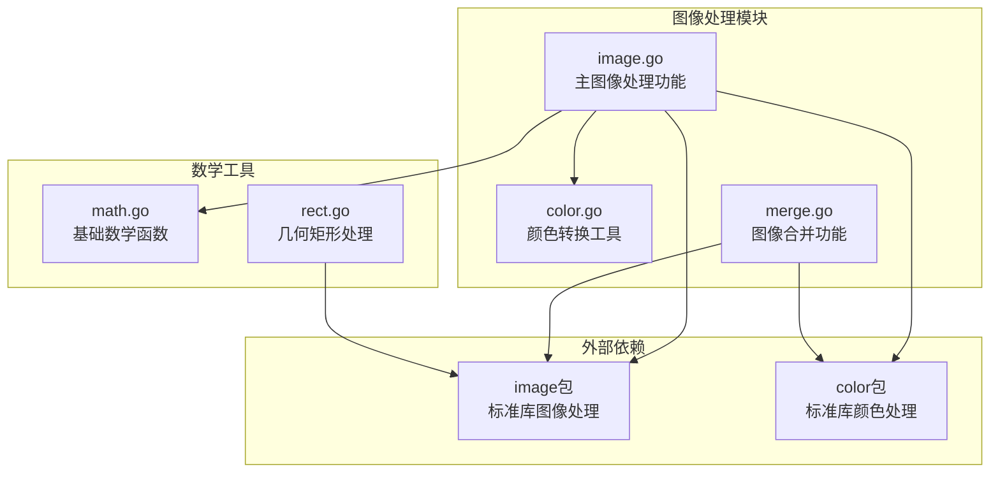
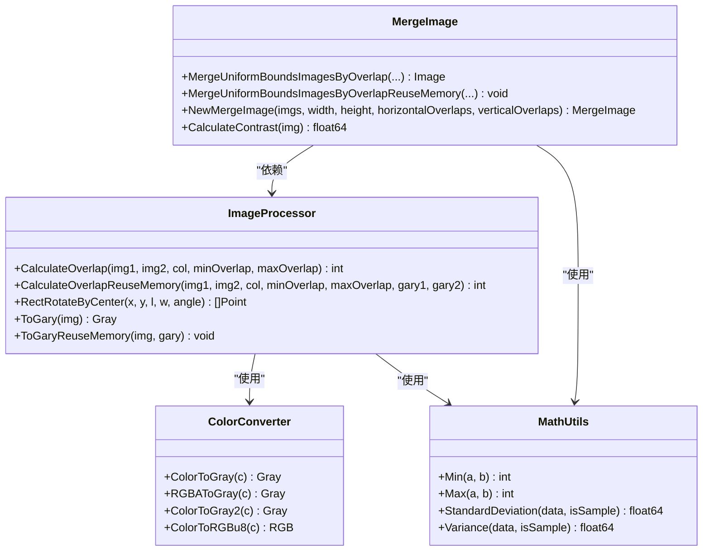
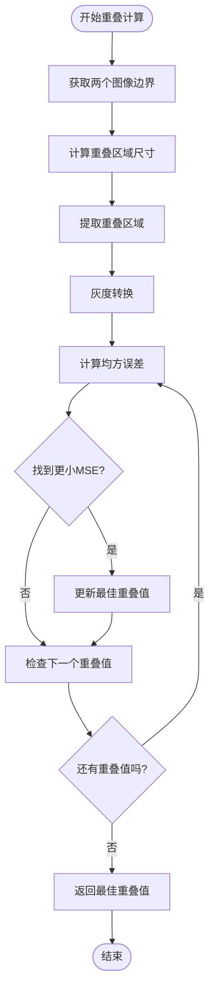
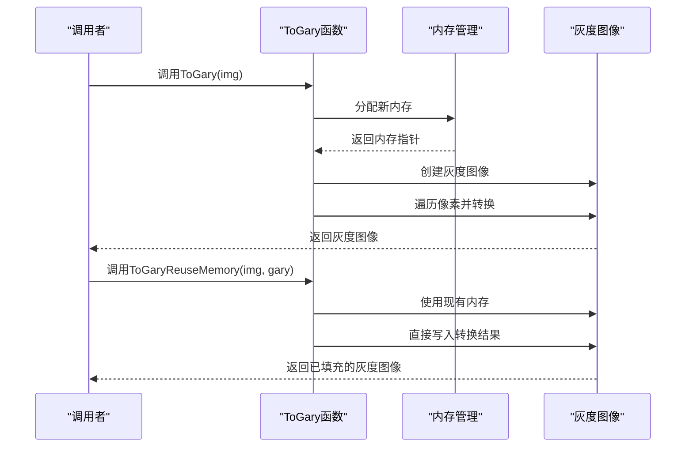
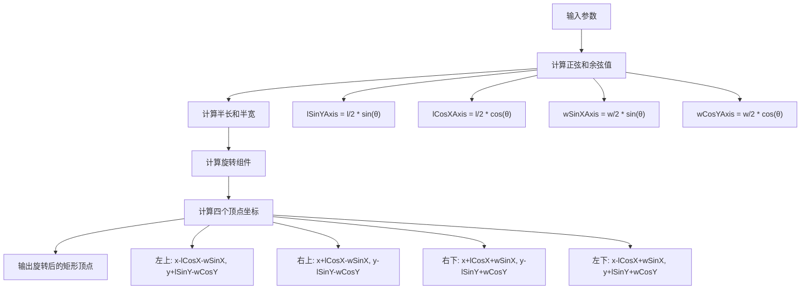
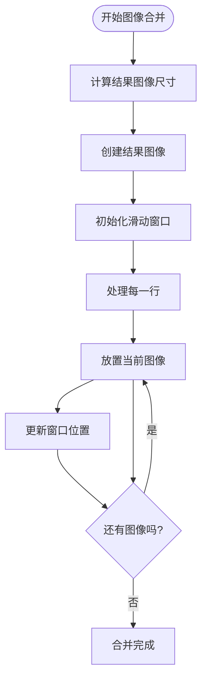
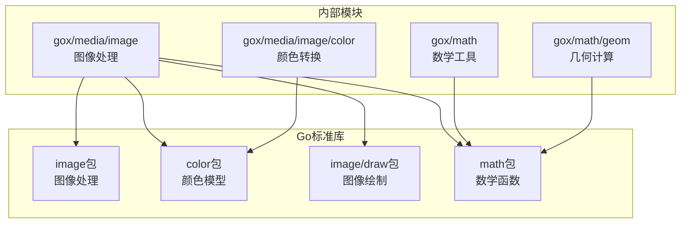

# 图像处理

<cite>
**本文档引用的文件**
- [image.go](file://thirdparty/gox/media/image/image.go)
- [color.go](file://thirdparty/gox/media/image/color/color.go)
- [merge.go](file://thirdparty/gox/media/image/merge.go)
- [math.go](file://thirdparty/gox/math/math.go)
- [rect.go](file://thirdparty/gox/math/geom/rect.go)
</cite>

## 目录
1. [简介](#简介)
2. [项目结构](#项目结构)
3. [核心组件](#核心组件)
4. [架构概览](#架构概览)
5. [详细组件分析](#详细组件分析)
6. [依赖关系分析](#依赖关系分析)
7. [性能考虑](#性能考虑)
8. [故障排除指南](#故障排除指南)
9. [结论](#结论)

## 简介

本项目提供了专业的图像处理功能集合，专注于高性能的图像重叠计算、灰度转换、矩形旋转以及图像合并等核心功能。该模块采用Go语言实现，具有以下特点：

- **高性能计算**：使用内存复用优化策略，减少垃圾回收压力
- **算法精确性**：基于标准灰度转换公式和均方误差计算
- **内存友好**：提供重用内存版本的函数，避免重复分配
- **几何变换**：支持矩形中心旋转和坐标变换

## 项目结构

图像处理模块位于 `thirdparty/gox/media/image/` 目录下，包含以下核心文件：

**图表来源**
- [image.go:1-202](file://thirdparty/gox/media/image/image.go#L1-L202)
- [color.go:1-49](file://thirdparty/gox/media/image/color/color.go#L1-L49)
- [merge.go:1-215](file://thirdparty/gox/media/image/merge.go#L1-L215)

**章节来源**
- [image.go:1-202](file://thirdparty/gox/media/image/image.go#L1-L202)
- [color.go:1-49](file://thirdparty/gox/media/image/color/color.go#L1-L49)
- [merge.go:1-215](file://thirdparty/gox/media/image/merge.go#L1-L215)

## 核心组件

### 图像重叠计算模块

提供两种图像重叠检测算法：
- **标准版本**：自动分配内存，适合一次性使用
- **重用内存版本**：支持外部内存池，提高性能

### 灰度转换模块

提供多种灰度转换方法：
- **独立转换**：创建新的灰度图像
- **重用内存转换**：在现有图像缓冲区上进行转换
- **颜色模型转换**：支持不同颜色空间的转换

### 几何变换模块

提供矩形旋转功能：
- **中心旋转**：基于矩形中心点的旋转计算
- **坐标变换**：支持角度制和弧度制转换

**章节来源**
- [image.go:16-87](file://thirdparty/gox/media/image/image.go#L16-L87)
- [image.go:89-163](file://thirdparty/gox/media/image/image.go#L89-L163)
- [image.go:179-201](file://thirdparty/gox/media/image/image.go#L179-L201)

## 架构概览

**图表来源**
- [image.go:16-201](file://thirdparty/gox/media/image/image.go#L16-L201)
- [color.go:11-48](file://thirdparty/gox/media/image/color/color.go#L11-L48)
- [merge.go:17-215](file://thirdparty/gox/media/image/merge.go#L17-L215)
- [math.go:57-91](file://thirdparty/gox/math/math.go#L57-L91)

## 详细组件分析

### CalculateOverlap 函数详解

#### 算法原理

该函数实现了基于均方误差（MSE）的图像重叠检测算法：

**图表来源**
- [image.go:17-87](file://thirdparty/gox/media/image/image.go#L17-L87)

#### 技术细节

1. **重叠区域计算**：
   - 自动计算两个图像的重叠边界
   - 支持横向和纵向重叠检测
   - 动态调整重叠范围

2. **灰度转换**：
   - 使用标准权重系数：R: 0.299, G: 0.587, B: 0.114
   - 采用16位精度计算，确保转换精度
   - 支持颜色模型优化

3. **均方误差比较**：
   - 计算对应像素的差值平方
   - 归一化处理，避免溢出
   - 实时更新最优解

**章节来源**
- [image.go:17-87](file://thirdparty/gox/media/image/image.go#L17-L87)
- [color.go:11-28](file://thirdparty/gox/media/image/color/color.go#L11-L28)

### ToGary 系列函数

#### 内存复用优化策略

**图表来源**
- [image.go:179-201](file://thirdparty/gox/media/image/image.go#L179-L201)

#### 优化策略

1. **内存预分配**：首次调用时分配所需内存
2. **零拷贝转换**：直接写入目标缓冲区
3. **批量处理**：按行处理，减少函数调用开销
4. **缓存友好的访问模式**：连续内存访问提高缓存命中率

**章节来源**
- [image.go:179-201](file://thirdparty/gox/media/image/image.go#L179-L201)

### RectRotateByCenter 函数

#### 几何变换实现

该函数实现了基于矩形中心点的旋转计算：

**图表来源**
- [image.go:165-177](file://thirdparty/gox/media/image/image.go#L165-L177)

#### 数学原理

使用标准的二维旋转矩阵：
- 旋转中心：矩形中心点 (x, y)
- 旋转角度：θ 弧度
- 矩形参数：长度 l，宽度 w

**章节来源**
- [image.go:165-177](file://thirdparty/gox/media/image/image.go#L165-L177)

### 图像合并功能

#### 合并算法流程

**图表来源**
- [merge.go:18-57](file://thirdparty/gox/media/image/merge.go#L18-L57)

**章节来源**
- [merge.go:18-101](file://thirdparty/gox/media/image/merge.go#L18-L101)

## 依赖关系分析

### 外部依赖

**图表来源**
- [image.go:9-14](file://thirdparty/gox/media/image/image.go#L9-L14)
- [color.go:9](file://thirdparty/gox/media/image/color/color.go#L9)

### 内部模块耦合

模块间依赖关系清晰，遵循单一职责原则：

- **image.go**：主要功能模块，依赖 color 和 math 工具
- **color.go**：纯工具模块，无外部依赖
- **merge.go**：组合功能模块，依赖 image 和 color
- **math.go**：通用数学工具，被多个模块使用

**章节来源**
- [image.go:9-14](file://thirdparty/gox/media/image/image.go#L9-L14)
- [color.go:9](file://thirdparty/gox/media/image/color/color.go#L9)

## 性能考虑

### 时间复杂度分析

1. **CalculateOverlap**：O(n×m×k)，其中 n、m 为图像尺寸，k 为重叠范围
2. **ToGary**：O(w×h)，w、h 为图像宽度和高度
3. **RectRotateByCenter**：O(1)，常数时间复杂度
4. **MergeUniformBoundsImages**：O(R×C×w×h)，R、C 为行列数量

### 内存优化策略

1. **内存复用**：重用内存版本避免重复分配
2. **批量处理**：连续内存访问提高缓存效率
3. **延迟计算**：按需计算，避免不必要的中间结果

### 并发安全性

- 所有函数都是纯函数，无状态共享
- 线程安全，可安全并发调用
- 内存复用版本需要调用者保证线程安全

## 故障排除指南

### 常见问题及解决方案

#### 图像重叠计算异常

**问题**：CalculateOverlap 返回意外的重叠值
**原因**：
- 输入图像边界不正确
- 重叠范围参数设置不当
- 灰度转换错误

**解决方案**：
1. 验证图像边界：`img.Bounds()`
2. 检查重叠范围：确保 `minOverlap ≤ maxOverlap`
3. 确认图像格式兼容性

#### 内存使用过高

**问题**：ToGary 函数导致内存峰值过高
**原因**：
- 频繁调用标准版本
- 大图像处理未使用重用内存版本

**解决方案**：
1. 使用 `ToGaryReuseMemory` 版本
2. 复用灰度图像缓冲区
3. 及时释放不再使用的图像

#### 几何变换结果错误

**问题**：RectRotateByCenter 返回坐标不正确
**原因**：
- 角度单位错误（度vs弧度）
- 旋转中心点计算错误
- 坐标系差异

**解决方案**：
1. 确保角度为度数制，函数内部自动转换
2. 验证旋转中心点坐标
3. 检查图像坐标系方向

**章节来源**
- [image.go:17-87](file://thirdparty/gox/media/image/image.go#L17-L87)
- [image.go:179-201](file://thirdparty/gox/media/image/image.go#L179-L201)
- [image.go:165-177](file://thirdparty/gox/media/image/image.go#L165-L177)

## 结论

本图像处理模块提供了完整而高效的图像处理功能集，具有以下优势：

1. **高性能**：通过内存复用和优化的数据访问模式实现高效处理
2. **准确性**：基于标准算法和数学公式，确保计算精度
3. **易用性**：提供简洁的API接口，支持多种使用场景
4. **扩展性**：模块化设计便于功能扩展和维护

推荐使用场景：
- 图像拼接和合并
- 图像匹配和对齐
- 实时图像处理应用
- 高性能图像分析系统