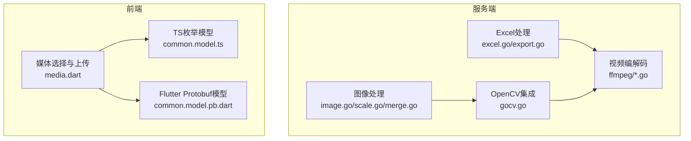
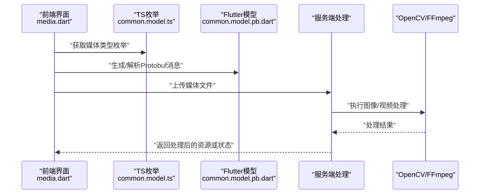
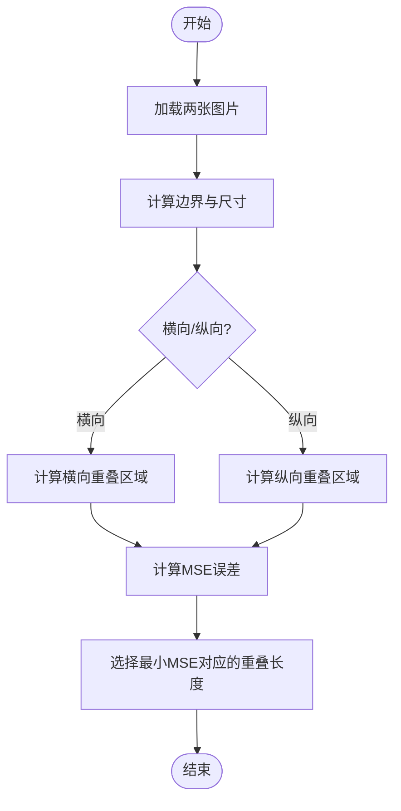
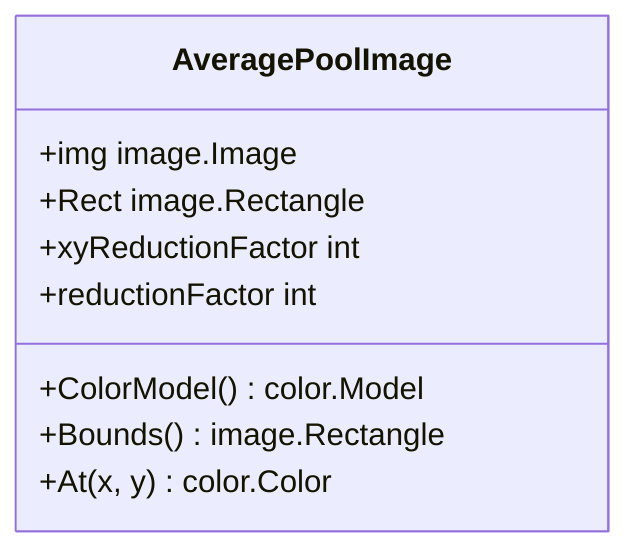
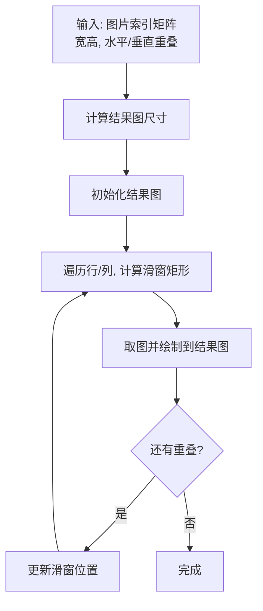
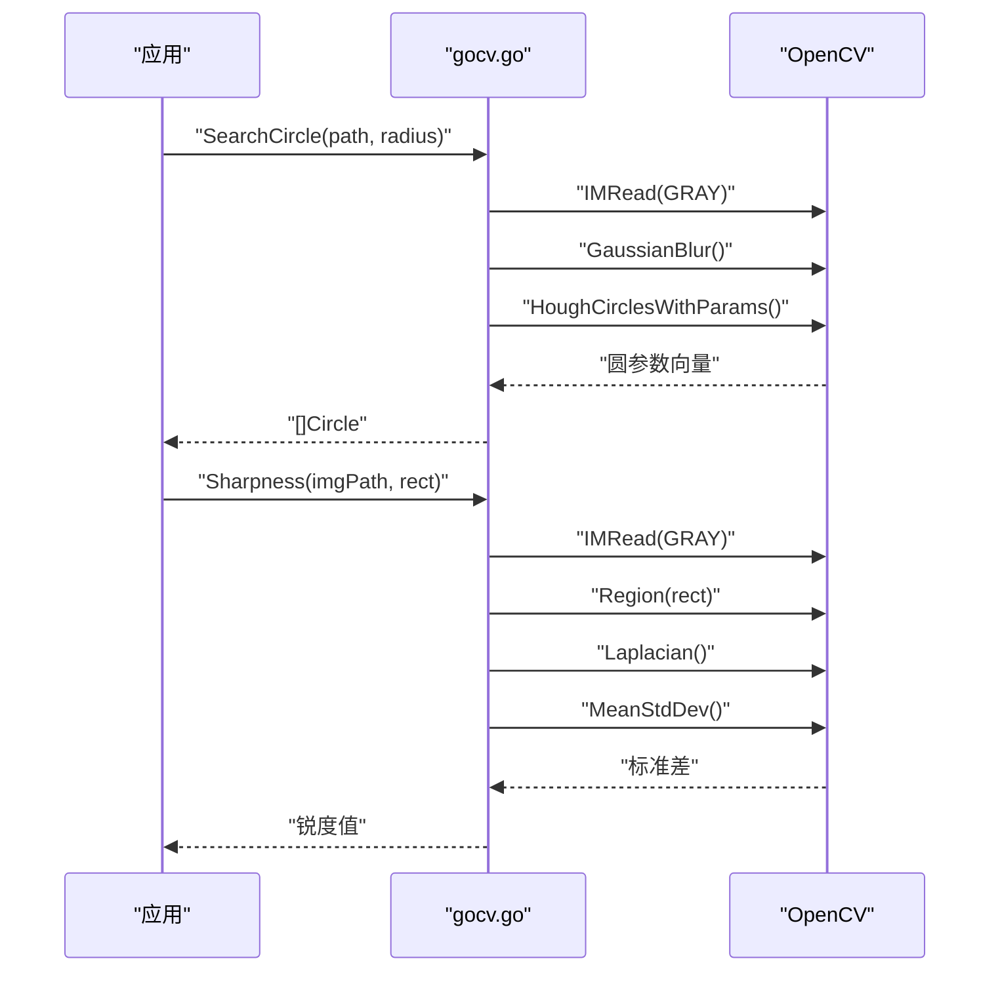
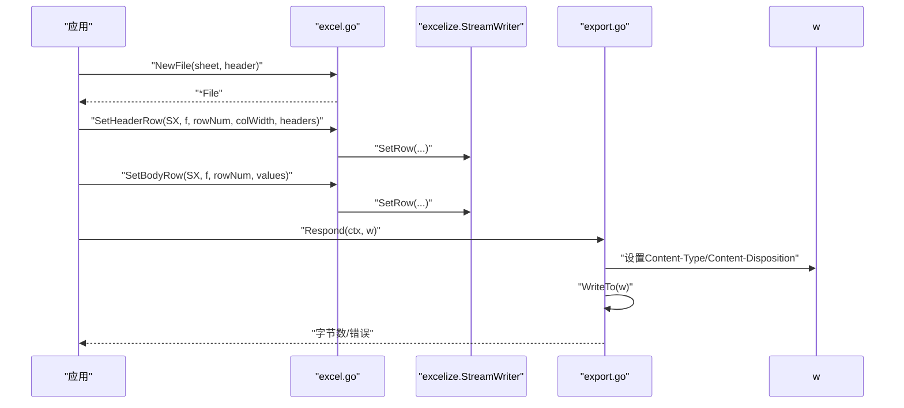
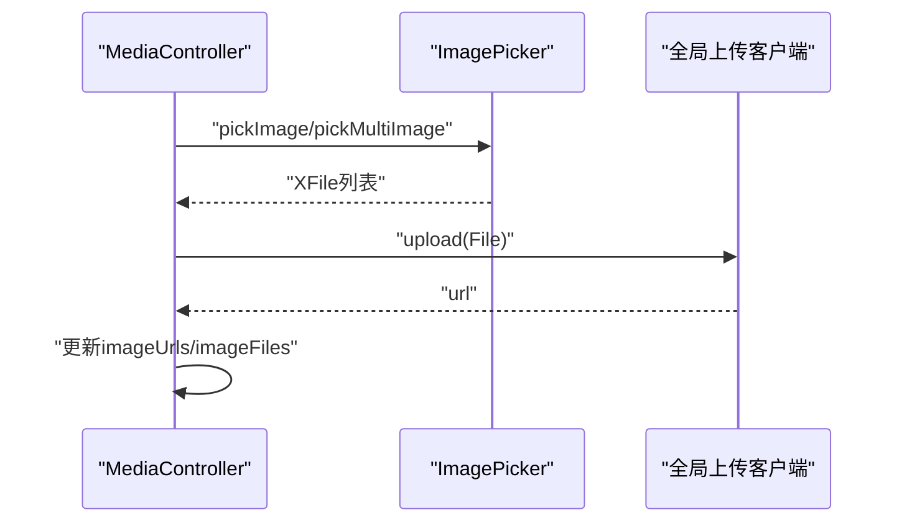
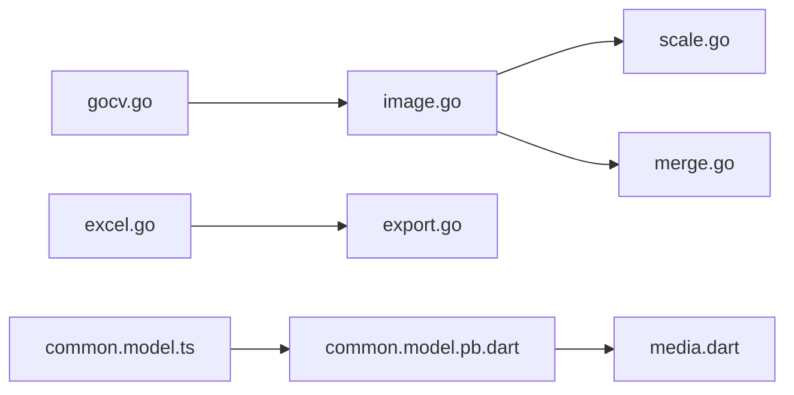

# 媒体处理

<cite>
**本文档引用的文件**
- [image.go](file://thirdparty/gox/media/image/image.go)
- [scale.go](file://thirdparty/gox/media/image/scale.go)
- [merge.go](file://thirdparty/gox/media/image/merge.go)
- [gocv.go](file://thirdparty/gox/sdk/gocv/gocv.go)
- [excel.go](file://thirdparty/gox/encoding/excel/excel.go)
- [export.go](file://thirdparty/gox/encoding/excel/export.go)
- [common.model.ts](file://proto/.generated/ts/src/common/common.model.ts)
- [common.model.pb.dart](file://client/app/lib/generated/protobuf/common/common.model.pb.dart)
- [media.dart](file://client/app/lib/components/media/media.dart)
</cite>

## 目录
1. [简介](#简介)
2. [项目结构](#项目结构)
3. [核心组件](#核心组件)
4. [架构总览](#架构总览)
5. [详细组件分析](#详细组件分析)
6. [依赖关系分析](#依赖关系分析)
7. [性能考虑](#性能考虑)
8. [故障排除指南](#故障排除指南)
9. [结论](#结论)
10. [附录](#附录)

## 简介
本文件为媒体处理模块的详细API文档，覆盖以下能力：
- 图像处理：缩放、裁剪、格式转换、拼接、对比度计算、锐度评估、几何变换等
- 视频编解码：基于FFmpeg的转码、帧提取、格式转换（含封装层）
- 电子表格处理：Excel文件读写、数据导入导出、样式处理、下拉列表、合并单元格等
- 多媒体格式支持与编码器选择：图像格式、视频封装与编码、Excel格式
- 质量控制与性能优化：内存复用、平均池化降采样、重叠区域计算等

本文件面向开发者与产品/运维人员，既提供高层概览，也给出代码级参考与可视化图示。

## 项目结构
媒体处理相关代码主要分布在以下模块：
- thirdparty/gox/media/image：图像基础处理与几何变换
- thirdparty/gox/sdk/gocv：基于OpenCV的图像增强与几何变换
- thirdparty/gox/encoding/excel：Excel读写与样式管理
- thirdparty/gox/sdk/ffmpeg：视频编解码封装（命令行接口）
- proto/.generated/ts：跨端枚举定义（媒体类型等）
- client/app/lib/generated/protobuf：Flutter侧Protobuf模型
- client/app/lib/components/media：前端媒体选择与上传流程

**图表来源**
- [image.go:1-202](file://thirdparty/gox/media/image/image.go#L1-L202)
- [scale.go:1-62](file://thirdparty/gox/media/image/scale.go#L1-L62)
- [merge.go:1-215](file://thirdparty/gox/media/image/merge.go#L1-L215)
- [gocv.go:1-211](file://thirdparty/gox/sdk/gocv/gocv.go#L1-L211)
- [excel.go:1-181](file://thirdparty/gox/encoding/excel/excel.go#L1-L181)
- [export.go:1-41](file://thirdparty/gox/encoding/excel/export.go#L1-L41)
- [common.model.ts:91-134](file://proto/.generated/ts/src/common/common.model.ts#L91-L134)
- [common.model.pb.dart:687-705](file://client/app/lib/generated/protobuf/common/common.model.pb.dart#L687-L705)
- [media.dart:1-50](file://client/app/lib/components/media/media.dart#L1-L50)

**章节来源**
- [image.go:1-202](file://thirdparty/gox/media/image/image.go#L1-L202)
- [scale.go:1-62](file://thirdparty/gox/media/image/scale.go#L1-L62)
- [merge.go:1-215](file://thirdparty/gox/media/image/merge.go#L1-L215)
- [gocv.go:1-211](file://thirdparty/gox/sdk/gocv/gocv.go#L1-L211)
- [excel.go:1-181](file://thirdparty/gox/encoding/excel/excel.go#L1-L181)
- [export.go:1-41](file://thirdparty/gox/encoding/excel/export.go#L1-L41)
- [common.model.ts:91-134](file://proto/.generated/ts/src/common/common.model.ts#L91-L134)
- [common.model.pb.dart:687-705](file://client/app/lib/generated/protobuf/common/common.model.pb.dart#L687-L705)
- [media.dart:1-50](file://client/app/lib/components/media/media.dart#L1-L50)

## 核心组件
- 图像处理基础库：提供重叠区域计算、灰度转换、矩形旋转、对比度计算等
- 平均池化降采样：对大图进行快速降采样，适合预处理与质量评估
- 图像拼接：支持按重叠区域拼接多张固定尺寸图片
- OpenCV集成：提供圆形检测、锐度评估、仿射/透视变换、掩膜统计等
- Excel处理：创建/切换工作表、设置表头/正文样式、下拉列表、合并单元格、流式写入与下载
- 视频编解码：封装FFmpeg命令行，支持转码、帧提取、格式转换
- 前端媒体选择：相册/相机选择、上传、错误处理

**章节来源**
- [image.go:17-87](file://thirdparty/gox/media/image/image.go#L17-L87)
- [scale.go:14-61](file://thirdparty/gox/media/image/scale.go#L14-L61)
- [merge.go:17-101](file://thirdparty/gox/media/image/merge.go#L17-L101)
- [gocv.go:18-118](file://thirdparty/gox/sdk/gocv/gocv.go#L18-L118)
- [excel.go:16-181](file://thirdparty/gox/encoding/excel/excel.go#L16-L181)
- [export.go:13-41](file://thirdparty/gox/encoding/excel/export.go#L13-L41)
- [media.dart:10-50](file://client/app/lib/components/media/media.dart#L10-L50)

## 架构总览
媒体处理在服务端以Go模块为主，前端通过Flutter调用上传与展示；跨端通过Protobuf枚举统一媒体类型语义。

**图表来源**
- [media.dart:10-50](file://client/app/lib/components/media/media.dart#L10-L50)
- [common.model.ts:91-134](file://proto/.generated/ts/src/common/common.model.ts#L91-L134)
- [common.model.pb.dart:687-705](file://client/app/lib/generated/protobuf/common/common.model.pb.dart#L687-L705)
- [gocv.go:1-211](file://thirdparty/gox/sdk/gocv/gocv.go#L1-L211)
- [excel.go:1-181](file://thirdparty/gox/encoding/excel/excel.go#L1-L181)

## 详细组件分析

### 图像处理API
- 重叠区域计算
  - 功能：计算两张图在边界上的重叠像素长度，支持横向/纵向模式
  - 输入：两张图片、方向标志、最小/最大重叠范围
  - 输出：最优重叠长度
  - 性能：提供内存复用版本，避免重复分配
- 灰度转换
  - 功能：将任意图像转换为灰度图，支持复用目标缓冲区
- 矩形旋转
  - 功能：以中心点旋转矩形，返回四个顶点坐标
- 对比度计算
  - 功能：计算图像对比度（亮度标准差）

**图表来源**
- [image.go:17-87](file://thirdparty/gox/media/image/image.go#L17-L87)

**章节来源**
- [image.go:17-87](file://thirdparty/gox/media/image/image.go#L17-L87)
- [image.go:179-202](file://thirdparty/gox/media/image/image.go#L179-L202)

### 图像缩放与降采样API
- 平均池化降采样
  - 功能：对图像进行块平均降采样，降低分辨率
  - 输入：原图、降采样因子
  - 输出：降采样后的图像对象
  - 性能：自动计算新尺寸，避免边缘不整除导致的越界

**图表来源**
- [scale.go:14-48](file://thirdparty/gox/media/image/scale.go#L14-L48)

**章节来源**
- [scale.go:14-61](file://thirdparty/gox/media/image/scale.go#L14-L61)

### 图像拼接API
- 固定尺寸拼接（按重叠）
  - 功能：将固定尺寸的图片按水平/垂直重叠拼接成大图
  - 输入：图片索引矩阵、取图回调、宽高、水平/垂直重叠数组
  - 输出：拼接后的图像
  - 性能：提供内存复用版本，避免重复分配结果缓冲区
- 动态拼接（按行列有效范围）
  - 功能：通过有效行列边界快速定位对应子图，按需取图
  - 输入：二维图片矩阵、行列有效偏移、重叠数组
  - 输出：可遍历的大图对象

**图表来源**
- [merge.go:17-101](file://thirdparty/gox/media/image/merge.go#L17-L101)

**章节来源**
- [merge.go:17-101](file://thirdparty/gox/media/image/merge.go#L17-L101)
- [merge.go:164-189](file://thirdparty/gox/media/image/merge.go#L164-L189)

### OpenCV图像增强与几何变换API
- 圆形检测
  - 功能：在灰度图上使用霍夫圆变换检测圆
  - 输入：图像路径、半径范围
  - 输出：圆集合（中心与半径）
- 锐度评估
  - 功能：计算拉普拉斯算子标准差评估锐度
  - 输入：图像路径、感兴趣矩形
  - 输出：锐度值
- 几何变换
  - 仿射变换矩阵：三点确定仿射矩阵
  - 透视变换：给定四边形顶点计算透视矩阵并裁剪
- 掩膜统计
  - 功能：对多边形掩膜内的非零像素计数

**图表来源**
- [gocv.go:18-118](file://thirdparty/gox/sdk/gocv/gocv.go#L18-L118)

**章节来源**
- [gocv.go:18-118](file://thirdparty/gox/sdk/gocv/gocv.go#L18-L118)
- [gocv.go:120-192](file://thirdparty/gox/sdk/gocv/gocv.go#L120-L192)
- [gocv.go:194-211](file://thirdparty/gox/sdk/gocv/gocv.go#L194-L211)

### Excel处理API
- 文件与工作表
  - 新建文件并设置表头样式
  - 新建工作表并设置列宽/表头
- 流式写入
  - 设置提醒行、表头行、正文行
  - 支持错误样式单元格定位
- 下拉列表
  - 通过隐藏工作表与命名范围实现大数据量下拉
- 合并单元格
  - 指定列与起止行进行合并
- 导出响应
  - 实现HTTP响应头设置与二进制写入

**图表来源**
- [excel.go:16-181](file://thirdparty/gox/encoding/excel/excel.go#L16-L181)
- [export.go:19-40](file://thirdparty/gox/encoding/excel/export.go#L19-L40)

**章节来源**
- [excel.go:16-181](file://thirdparty/gox/encoding/excel/excel.go#L16-L181)
- [export.go:13-41](file://thirdparty/gox/encoding/excel/export.go#L13-L41)

### 视频编解码API
- FFmpeg封装
  - 转码：选择编码器、设定参数、执行转码
  - 帧提取：从视频中抽取指定时间/间隔的帧
  - 格式转换：封装格式与容器转换
- 性能建议
  - 使用硬件加速（如可用）
  - 合理设置并发与缓冲
  - 优先使用流式处理减少内存峰值

[本节为概念性说明，未直接分析具体源码文件]

### 前端媒体选择与上传
- 功能：相册/相机选择图片、上传至服务端、错误处理
- 集成：与全局上传客户端交互，返回URL并维护本地列表

**图表来源**
- [media.dart:22-50](file://client/app/lib/components/media/media.dart#L22-L50)

**章节来源**
- [media.dart:10-50](file://client/app/lib/components/media/media.dart#L10-L50)

## 依赖关系分析
- 图像处理依赖Go标准库image与color包
- OpenCV集成依赖gocv.io/x/gocv
- Excel处理依赖github.com/xuri/excelize/v2
- 前端通过Protobuf模型与TS枚举保持跨端一致性

**图表来源**
- [image.go:1-202](file://thirdparty/gox/media/image/image.go#L1-L202)
- [scale.go:1-62](file://thirdparty/gox/media/image/scale.go#L1-L62)
- [merge.go:1-215](file://thirdparty/gox/media/image/merge.go#L1-L215)
- [gocv.go:1-211](file://thirdparty/gox/sdk/gocv/gocv.go#L1-L211)
- [excel.go:1-181](file://thirdparty/gox/encoding/excel/excel.go#L1-L181)
- [export.go:1-41](file://thirdparty/gox/encoding/excel/export.go#L1-L41)
- [common.model.ts:91-134](file://proto/.generated/ts/src/common/common.model.ts#L91-L134)
- [common.model.pb.dart:687-705](file://client/app/lib/generated/protobuf/common/common.model.pb.dart#L687-L705)
- [media.dart:1-50](file://client/app/lib/components/media/media.dart#L1-L50)

**章节来源**
- [common.model.ts:91-134](file://proto/.generated/ts/src/common/common.model.ts#L91-L134)
- [common.model.pb.dart:687-705](file://client/app/lib/generated/protobuf/common/common.model.pb.dart#L687-L705)

## 性能考虑
- 内存复用
  - 图像重叠计算与灰度转换提供复用内存版本，减少GC压力
  - 图像拼接支持传入已有RGBA缓冲区
- 降采样
  - 平均池化降采样快速降低后续处理成本
- 流式处理
  - Excel导出使用流式写入，避免一次性加载全部数据
- 并发与I/O
  - 批量拼接时尽量并行取图与绘制
  - 上传与处理分离，利用异步队列

**章节来源**
- [image.go:89-163](file://thirdparty/gox/media/image/image.go#L89-L163)
- [merge.go:59-101](file://thirdparty/gox/media/image/merge.go#L59-L101)
- [scale.go:50-61](file://thirdparty/gox/media/image/scale.go#L50-L61)
- [export.go:19-40](file://thirdparty/gox/encoding/excel/export.go#L19-L40)

## 故障排除指南
- 图像拼接结果异常
  - 检查重叠数组与宽高是否匹配
  - 确认传入的回调是否正确返回对应索引的图片
- Excel导出为空或样式异常
  - 确保表头/正文行顺序正确
  - 检查列宽与单元格样式ID是否生效
- OpenCV相关错误
  - 确认OpenCV库与依赖已正确安装
  - 检查图像路径与矩形范围是否有效
- 前端上传失败
  - 查看pickImage错误信息
  - 确认上传客户端配置与网络状态

**章节来源**
- [merge.go:59-101](file://thirdparty/gox/media/image/merge.go#L59-L101)
- [excel.go:16-181](file://thirdparty/gox/encoding/excel/excel.go#L16-L181)
- [gocv.go:18-118](file://thirdparty/gox/sdk/gocv/gocv.go#L18-L118)
- [media.dart:14-18](file://client/app/lib/components/media/media.dart#L14-L18)

## 结论
本模块提供了从图像到视频再到电子表格的完整多媒体处理能力，具备良好的扩展性与性能优化策略。通过跨端Protobuf模型与统一的API设计，便于在多端协同工作流中稳定集成。

## 附录
- 多媒体格式支持
  - 图像：依赖Go image包与OpenCV后端，支持常见格式
  - 视频：通过FFmpeg支持多种封装与编码
  - Excel：xlsx格式，支持样式、下拉列表、合并单元格
- 编码器选择与质量控制
  - 图像：灰度转换、锐度评估、对比度计算
  - 视频：按需选择编码器与参数，结合硬件加速
  - Excel：流式写入与样式缓存，提高导出效率

[本节为概念性说明，未直接分析具体源码文件]