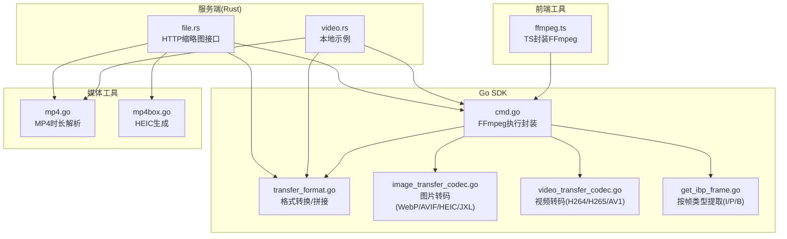
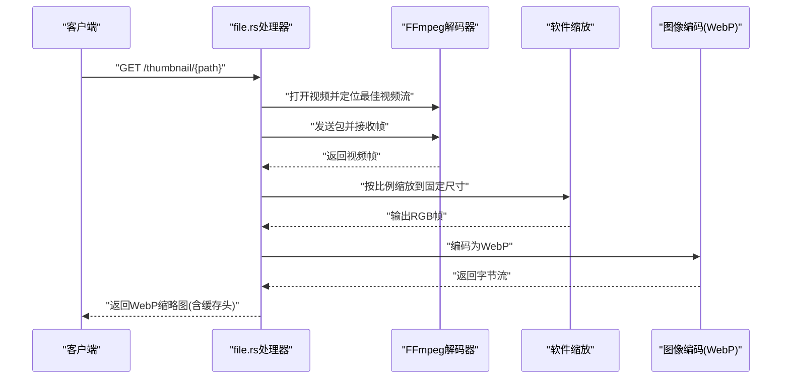
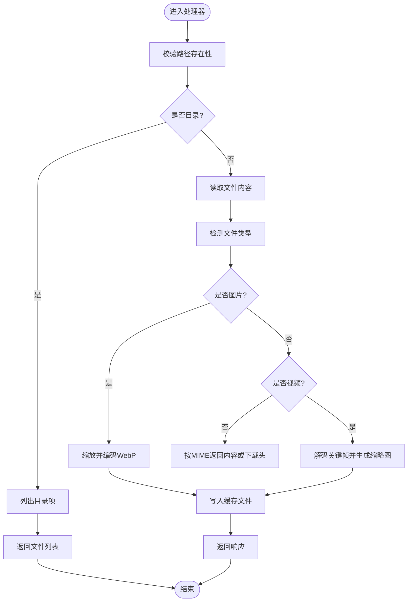
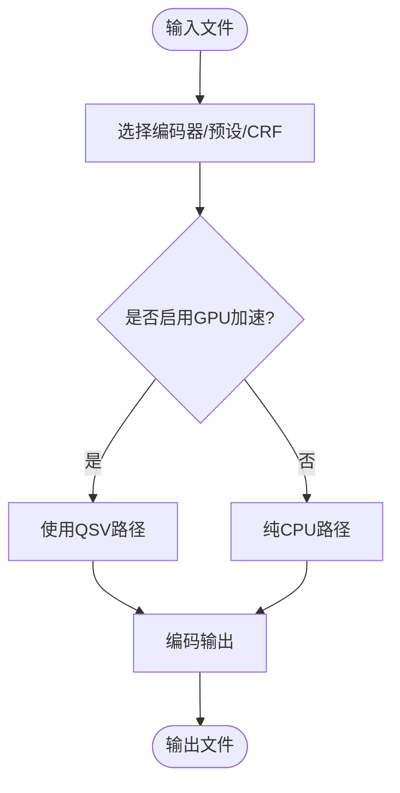
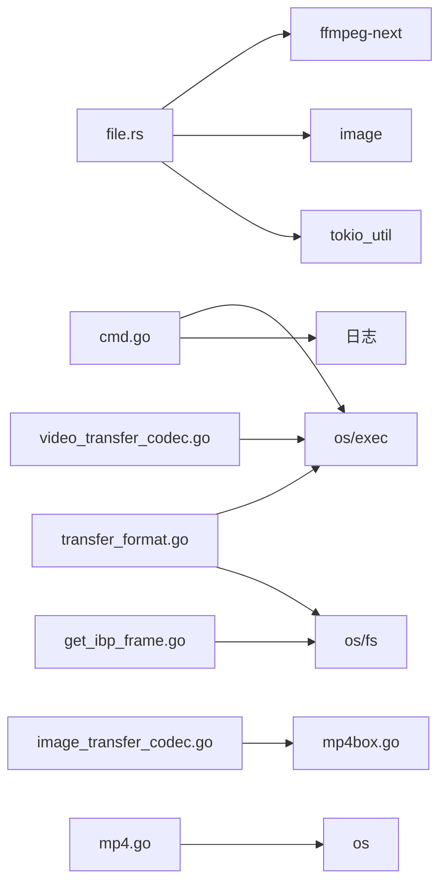

# 视频处理

<cite>
**本文引用的文件**
- [server/rust/rfv/src/file.rs](file://server/rust/rfv/src/file.rs)
- [server/rust/rfv/src/bin/video.rs](file://server/rust/rfv/src/bin/video.rs)
- [thirdparty/gox/sdk/ffmpeg/cmd.go](file://thirdparty/gox/sdk/ffmpeg/cmd.go)
- [thirdparty/gox/sdk/ffmpeg/transfer_format.go](file://thirdparty/gox/sdk/ffmpeg/transfer_format.go)
- [thirdparty/gox/sdk/ffmpeg/image_transfer_codec.go](file://thirdparty/gox/sdk/ffmpeg/image_transfer_codec.go)
- [thirdparty/gox/sdk/ffmpeg/video_transfer_codec.go](file://thirdparty/gox/sdk/ffmpeg/video_transfer_codec.go)
- [thirdparty/gox/sdk/ffmpeg/get_ibp_frame.go](file://thirdparty/gox/sdk/ffmpeg/get_ibp_frame.go)
- [thirdparty/gox/media/video/mp4.go](file://thirdparty/gox/media/video/mp4.go)
- [thirdparty/gox/sdk/mp4box/mp4box.go](file://thirdparty/gox/sdk/mp4box/mp4box.go)
- [thirdparty/diamond/src/utils/ffmpeg/ffmpeg.ts](file://thirdparty/diamond/src/utils/ffmpeg/ffmpeg.ts)
</cite>

## 目录
1. [简介](#简介)
2. [项目结构](#项目结构)
3. [核心组件](#核心组件)
4. [架构总览](#架构总览)
5. [详细组件分析](#详细组件分析)
6. [依赖分析](#依赖分析)
7. [性能考虑](#性能考虑)
8. [故障排查指南](#故障排查指南)
9. [结论](#结论)
10. [附录](#附录)

## 简介
本文件面向“视频处理模块”的API与实现，聚焦于MP4视频文件的处理能力，包括但不限于：
- 视频编解码与格式转换
- 帧提取与缩略图生成
- 元数据解析与视频时长获取
- 高级功能：转码、压缩优化、质量控制
- 编码器选择与性能优化策略
- 实际使用示例与最佳实践

该模块在服务端通过Rust集成FFmpeg进行视频帧解码与缩略图生成，在Go侧提供FFmpeg封装与常用转码/拼接/格式转换能力，并辅以MP4盒结构解析与时长计算。

## 项目结构
围绕视频处理的相关代码主要分布在以下位置：
- Rust服务端：提供HTTP接口，基于FFmpeg解码视频并生成缩略图
- Go SDK：封装FFmpeg命令执行、转码、拼接、格式转换、帧提取、图片编解码
- MP4解析工具：解析MP4盒结构，快速获取时长
- MP4Box工具：辅助生成HEIC等容器
- 前端FFmpeg工具：TS封装的FFmpeg命令执行工具

图表来源
- [server/rust/rfv/src/file.rs:1-283](file://server/rust/rfv/src/file.rs#L1-283)
- [server/rust/rfv/src/bin/video.rs:1-83](file://server/rust/rfv/src/bin/video.rs#L1-83)
- [thirdparty/gox/sdk/ffmpeg/cmd.go:1-35](file://thirdparty/gox/sdk/ffmpeg/cmd.go#L1-35)
- [thirdparty/gox/sdk/ffmpeg/transfer_format.go:1-63](file://thirdparty/gox/sdk/ffmpeg/transfer_format.go#L1-63)
- [thirdparty/gox/sdk/ffmpeg/image_transfer_codec.go:1-90](file://thirdparty/gox/sdk/ffmpeg/image_transfer_codec.go#L1-90)
- [thirdparty/gox/sdk/ffmpeg/video_transfer_codec.go:1-73](file://thirdparty/gox/sdk/ffmpeg/video_transfer_codec.go#L1-73)
- [thirdparty/gox/sdk/ffmpeg/get_ibp_frame.go:1-45](file://thirdparty/gox/sdk/ffmpeg/get_ibp_frame.go#L1-45)
- [thirdparty/gox/media/video/mp4.go:1-78](file://thirdparty/gox/media/video/mp4.go#L1-78)
- [thirdparty/gox/sdk/mp4box/mp4box.go:1-19](file://thirdparty/gox/sdk/mp4box/mp4box.go#L1-19)
- [thirdparty/diamond/src/utils/ffmpeg/ffmpeg.ts:1-18](file://thirdparty/diamond/src/utils/ffmpeg/ffmpeg.ts#L1-18)

章节来源
- [server/rust/rfv/src/file.rs:1-283](file://server/rust/rfv/src/file.rs#L1-283)
- [thirdparty/gox/sdk/ffmpeg/cmd.go:1-35](file://thirdparty/gox/sdk/ffmpeg/cmd.go#L1-35)

## 核心组件
- HTTP缩略图接口（Rust）
  - 负责根据请求路径生成或返回视频缩略图，内部使用FFmpeg解码视频帧并缩放编码为WebP
  - 支持缓存与MIME类型推断
- FFmpeg执行封装（Go）
  - 统一的命令拼接与执行入口，支持自定义可执行文件路径
- 视频转码与格式转换（Go）
  - 提供H264/H265/AV1等编码器的转码方法，以及GPU加速路径
  - 提供格式复制、拼接等无损/低延迟转换
- 图片编解码（Go）
  - 支持WebP、AVIF、HEIC、JXL等现代图片格式的转换
- 帧提取（Go）
  - 支持按帧类型（I/P/B）提取帧序列
- MP4时长解析（Go）
  - 基于MP4盒结构解析，快速获取视频时长
- MP4Box辅助（Go）
  - 通过外部工具生成HEIC容器

章节来源
- [server/rust/rfv/src/file.rs:81-282](file://server/rust/rfv/src/file.rs#L81-282)
- [thirdparty/gox/sdk/ffmpeg/cmd.go:17-34](file://thirdparty/gox/sdk/ffmpeg/cmd.go#L17-L34)
- [thirdparty/gox/sdk/ffmpeg/transfer_format.go:19-62](file://thirdparty/gox/sdk/ffmpeg/transfer_format.go#L19-L62)
- [thirdparty/gox/sdk/ffmpeg/video_transfer_codec.go:13-73](file://thirdparty/gox/sdk/ffmpeg/video_transfer_codec.go#L13-L73)
- [thirdparty/gox/sdk/ffmpeg/image_transfer_codec.go:15-90](file://thirdparty/gox/sdk/ffmpeg/image_transfer_codec.go#L15-L90)
- [thirdparty/gox/sdk/ffmpeg/get_ibp_frame.go:16-44](file://thirdparty/gox/sdk/ffmpeg/get_ibp_frame.go#L16-L44)
- [thirdparty/gox/media/video/mp4.go:22-78](file://thirdparty/gox/media/video/mp4.go#L22-L78)
- [thirdparty/gox/sdk/mp4box/mp4box.go:14-19](file://thirdparty/gox/sdk/mp4box/mp4box.go#L14-L19)

## 架构总览
下图展示从HTTP请求到视频解码、帧提取、缩放与编码的整体流程。

图表来源
- [server/rust/rfv/src/file.rs:157-242](file://server/rust/rfv/src/file.rs#L157-L242)

章节来源
- [server/rust/rfv/src/file.rs:81-282](file://server/rust/rfv/src/file.rs#L81-282)

## 详细组件分析

### HTTP缩略图接口（Rust）
- 功能
  - 接收路径参数，优先返回已生成的缩略图缓存；若不存在则实时生成
  - 对图片与视频分别处理：图片直接缩放编码为WebP；视频通过FFmpeg解码关键帧并生成缩略图
  - 支持缓存控制头与MIME类型推断
- 关键流程
  - 路径校验与目录枚举
  - 文件类型判定（图片/视频/其他）
  - 视频：定位最佳视频流、解码帧、缩放、编码
  - 图片：直接缩放编码
  - 返回响应并写入缓存

图表来源
- [server/rust/rfv/src/file.rs:41-282](file://server/rust/rfv/src/file.rs#L41-282)

章节来源
- [server/rust/rfv/src/file.rs:41-282](file://server/rust/rfv/src/file.rs#L41-282)

### FFmpeg执行封装（Go）
- 功能
  - 统一拼接FFmpeg命令，支持自定义可执行文件路径
  - 日志记录与错误传播
- 使用方式
  - 在各转码/拼接/提取函数中拼接具体子命令，再调用Run执行

章节来源
- [thirdparty/gox/sdk/ffmpeg/cmd.go:17-34](file://thirdparty/gox/sdk/ffmpeg/cmd.go#L17-L34)

### 视频转码与格式转换（Go）
- 能力
  - H264/H265/AV1等编码器转码
  - GPU加速路径（Intel QSV）示例
  - 无损复制与拼接（基于文件列表）
- 参数与策略
  - CRF、预设、CPU使用度等影响质量与速度
  - 拼接时需准备file.txt清单

图表来源
- [thirdparty/gox/sdk/ffmpeg/video_transfer_codec.go:30-70](file://thirdparty/gox/sdk/ffmpeg/video_transfer_codec.go#L30-L70)
- [thirdparty/gox/sdk/ffmpeg/transfer_format.go:19-38](file://thirdparty/gox/sdk/ffmpeg/transfer_format.go#L19-L38)

章节来源
- [thirdparty/gox/sdk/ffmpeg/video_transfer_codec.go:13-73](file://thirdparty/gox/sdk/ffmpeg/video_transfer_codec.go#L13-L73)
- [thirdparty/gox/sdk/ffmpeg/transfer_format.go:19-62](file://thirdparty/gox/sdk/ffmpeg/transfer_format.go#L19-L62)

### 图片编解码（Go）
- 能力
  - WebP（支持无损与质量参数）
  - AVIF（CRF与CPU使用度）
  - HEIC（通过MP4Box生成容器）
  - JXL（JPEG XL）
- 注意事项
  - 颜色空间与像素格式对质量的影响
  - HEIC生成需后续容器封装

章节来源
- [thirdparty/gox/sdk/ffmpeg/image_transfer_codec.go:15-90](file://thirdparty/gox/sdk/ffmpeg/image_transfer_codec.go#L15-L90)
- [thirdparty/gox/sdk/mp4box/mp4box.go:14-19](file://thirdparty/gox/sdk/mp4box/mp4box.go#L14-L19)

### 帧提取（Go）
- 能力
  - 按帧类型（I/P/B）提取帧序列
  - 使用过滤器与可变帧率输出
- 应用场景
  - 视频分析、抽帧、质量检查

章节来源
- [thirdparty/gox/sdk/ffmpeg/get_ibp_frame.go:16-44](file://thirdparty/gox/sdk/ffmpeg/get_ibp_frame.go#L16-L44)

### MP4时长解析（Go）
- 能力
  - 解析MP4盒结构，定位moov，读取timeScale与Duration，换算时长
- 性能
  - 仅读取必要区域，避免全文件扫描

章节来源
- [thirdparty/gox/media/video/mp4.go:22-78](file://thirdparty/gox/media/video/mp4.go#L22-L78)

### 前端FFmpeg工具（TS）
- 能力
  - 设置FFmpeg可执行路径
  - 同步执行命令并继承标准IO

章节来源
- [thirdparty/diamond/src/utils/ffmpeg/ffmpeg.ts:1-18](file://thirdparty/diamond/src/utils/ffmpeg/ffmpeg.ts#L1-L18)

## 依赖分析
- Rust侧
  - 依赖ffmpeg-next进行解码与缩放
  - 依赖image进行图像编码
  - 依赖tokio_util进行流式响应
- Go侧
  - 依赖os/exec执行外部命令
  - 依赖os/fs进行文件操作
  - 依赖第三方SDK（如MP4Box）进行HEIC生成

图表来源
- [server/rust/rfv/src/file.rs:1-23](file://server/rust/rfv/src/file.rs#L1-L23)
- [thirdparty/gox/sdk/ffmpeg/cmd.go:9-12](file://thirdparty/gox/sdk/ffmpeg/cmd.go#L9-L12)
- [thirdparty/gox/sdk/ffmpeg/transfer_format.go:9-17](file://thirdparty/gox/sdk/ffmpeg/transfer_format.go#L9-L17)
- [thirdparty/gox/sdk/ffmpeg/image_transfer_codec.go:9-13](file://thirdparty/gox/sdk/ffmpeg/image_transfer_codec.go#L9-L13)
- [thirdparty/gox/sdk/mp4box/mp4box.go:9-11](file://thirdparty/gox/sdk/mp4box/mp4box.go#L9-L11)
- [thirdparty/gox/media/video/mp4.go:9-13](file://thirdparty/gox/media/video/mp4.go#L9-L13)

章节来源
- [server/rust/rfv/src/file.rs:1-23](file://server/rust/rfv/src/file.rs#L1-L23)
- [thirdparty/gox/sdk/ffmpeg/cmd.go:9-12](file://thirdparty/gox/sdk/ffmpeg/cmd.go#L9-L12)

## 性能考虑
- 缩略图生成
  - 限制最大边长，减少缩放与编码成本
  - 使用WebP编码，兼顾体积与质量
- 视频解码
  - 仅解码关键帧并设定最大尝试帧数，降低CPU占用
  - 采用软件缩放（BILINEAR），平衡质量与性能
- 转码与拼接
  - 优先使用GPU加速（Intel QSV）以降低CPU压力
  - 无损复制（-c copy）用于快速拼接与格式转换
- 图片编解码
  - WebP质量参数与AVIF CRF需权衡；HEIC需注意颜色空间一致性
- I/P/B抽帧
  - 通过过滤器与可变帧率输出，避免全量抽取

章节来源
- [server/rust/rfv/src/file.rs:78-242](file://server/rust/rfv/src/file.rs#L78-L242)
- [thirdparty/gox/sdk/ffmpeg/video_transfer_codec.go:30-70](file://thirdparty/gox/sdk/ffmpeg/video_transfer_codec.go#L30-L70)
- [thirdparty/gox/sdk/ffmpeg/transfer_format.go:19-38](file://thirdparty/gox/sdk/ffmpeg/transfer_format.go#L19-L38)
- [thirdparty/gox/sdk/ffmpeg/image_transfer_codec.go:15-90](file://thirdparty/gox/sdk/ffmpeg/image_transfer_codec.go#L15-L90)
- [thirdparty/gox/sdk/ffmpeg/get_ibp_frame.go:36-44](file://thirdparty/gox/sdk/ffmpeg/get_ibp_frame.go#L36-L44)

## 故障排查指南
- 视频文件未找到
  - 现象：返回“视频文件未找到”
  - 排查：确认路径存在且包含视频流
- 解码失败或无帧
  - 现象：解码循环未捕获到有效帧
  - 排查：检查输入文件完整性与编码格式；适当增加最大尝试帧数
- 缩放或编码异常
  - 现象：缩放或编码步骤报错
  - 排查：确认像素格式与目标格式兼容；检查输出路径权限
- 转码/拼接失败
  - 现象：FFmpeg命令执行失败
  - 排查：核对命令拼接与可执行文件路径；查看日志输出
- HEIC生成失败
  - 现象：HEIC容器生成失败
  - 排查：确认MP4Box可用；检查中间文件生成状态

章节来源
- [server/rust/rfv/src/file.rs:157-200](file://server/rust/rfv/src/file.rs#L157-L200)
- [thirdparty/gox/sdk/ffmpeg/cmd.go:25-34](file://thirdparty/gox/sdk/ffmpeg/cmd.go#L25-L34)
- [thirdparty/gox/sdk/mp4box/mp4box.go:16-19](file://thirdparty/gox/sdk/mp4box/mp4box.go#L16-L19)

## 结论
该视频处理模块以Rust+FFmpeg为核心，结合Go侧丰富的转码与工具链，覆盖了MP4视频的解析、缩略图生成、帧提取、格式转换与图片编解码等关键能力。通过GPU加速、无损复制与合理的质量参数配置，可在保证质量的同时显著提升性能。建议在生产环境中统一管理FFmpeg可执行路径、严格控制输入文件类型，并针对不同业务场景选择合适的编码器与参数组合。

## 附录

### API与使用示例（路径指引）
- HTTP缩略图接口
  - 请求：GET /thumbnail/{path}
  - 行为：返回WebP缩略图，支持缓存头
  - 参考：[file_thumbnail_handler:81-282](file://server/rust/rfv/src/file.rs#L81-L282)
- FFmpeg执行封装
  - 方法：Run(cmd)
  - 参考：[Run:25-34](file://thirdparty/gox/sdk/ffmpeg/cmd.go#L25-L34)
- 视频转码（H264/H265/AV1）
  - 示例：H264ToH265ByIntelGPU / ToH264ByXlib264 / ToH265ByXlib265 / ToAV1ByLibaomav1
  - 参考：[video_transfer_codec.go:30-70](file://thirdparty/gox/sdk/ffmpeg/video_transfer_codec.go#L30-L70)
- 格式转换与拼接
  - 示例：TransferFormat / TransferFormatGPU / Concat / ConcatByFile
  - 参考：[transfer_format.go:19-38](file://thirdparty/gox/sdk/ffmpeg/transfer_format.go#L19-L38)
- 图片编解码（WebP/AVIF/HEIC/JXL）
  - 示例：ImgToWebp / ImgToWebpLossless / ImgToAvif / ImgToHeic / ImgToJxl
  - 参考：[image_transfer_codec.go:15-90](file://thirdparty/gox/sdk/ffmpeg/image_transfer_codec.go#L15-L90)
- 帧提取（I/P/B）
  - 示例：GetFrame(path, outDir, FrameType)
  - 参考：[get_ibp_frame.go:36-44](file://thirdparty/gox/sdk/ffmpeg/get_ibp_frame.go#L36-L44)
- MP4时长解析
  - 示例：GetMP4Duration(filepath)
  - 参考：[mp4.go:22-64](file://thirdparty/gox/media/video/mp4.go#L22-L64)
- HEIC容器生成
  - 示例：Heic(mp4, dst)
  - 参考：[mp4box.go:14-19](file://thirdparty/gox/sdk/mp4box/mp4box.go#L14-L19)
- 前端FFmpeg工具
  - 示例：setExecPath / ffmpegCmd
  - 参考：[ffmpeg.ts:7-18](file://thirdparty/diamond/src/utils/ffmpeg/ffmpeg.ts#L7-L18)