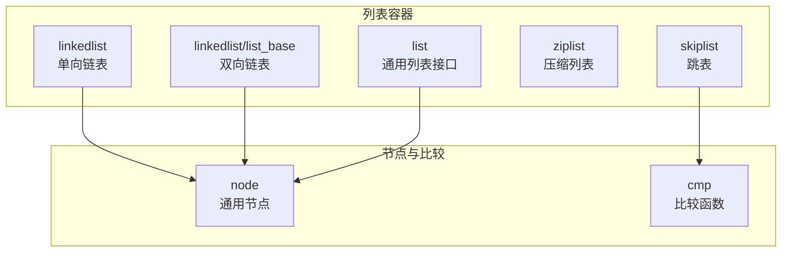
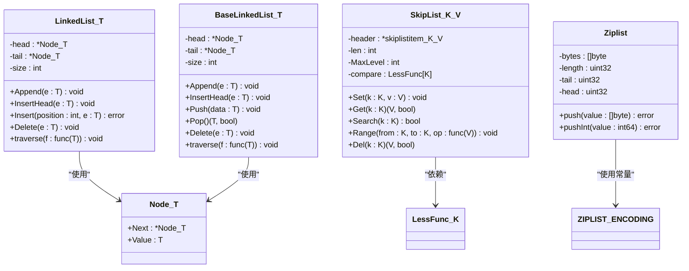
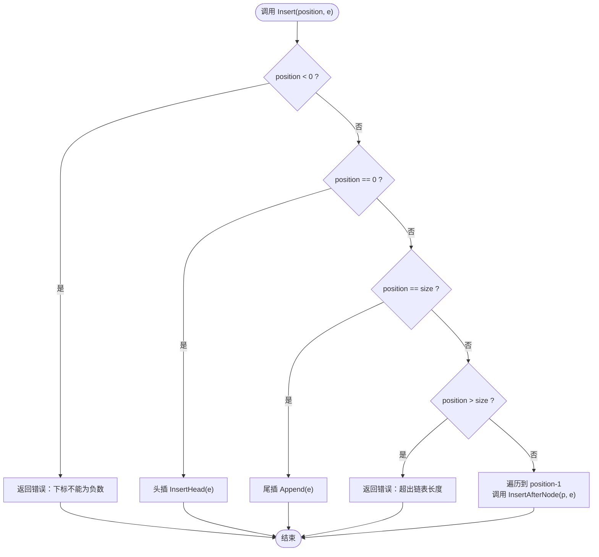
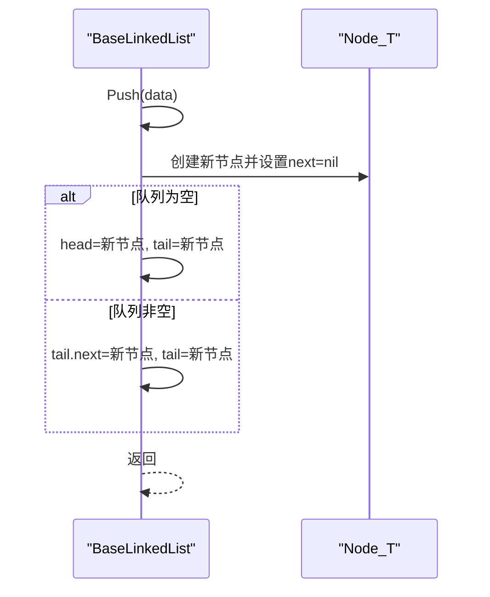
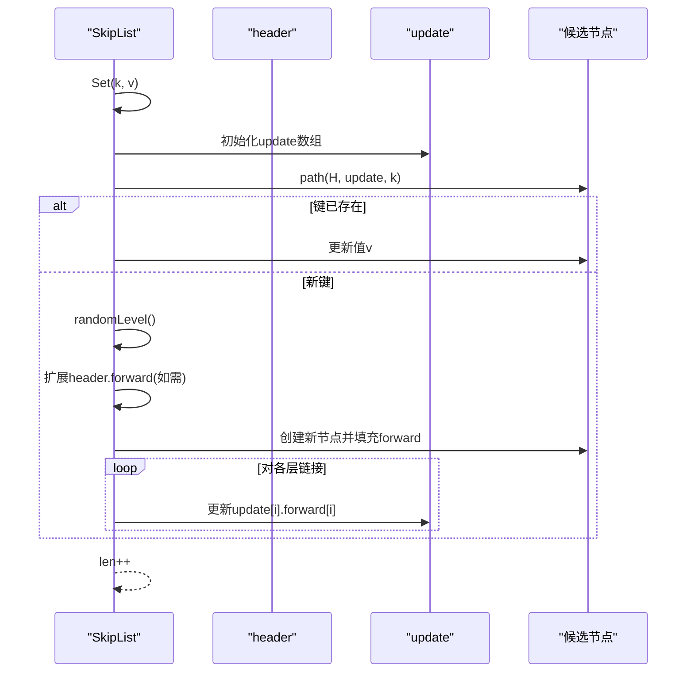
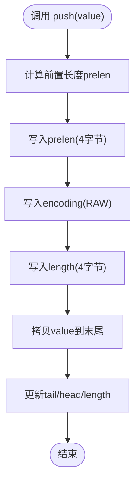
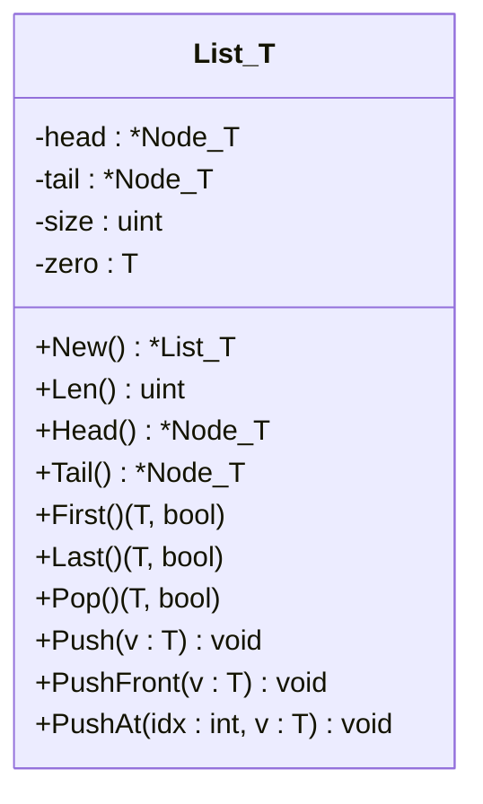
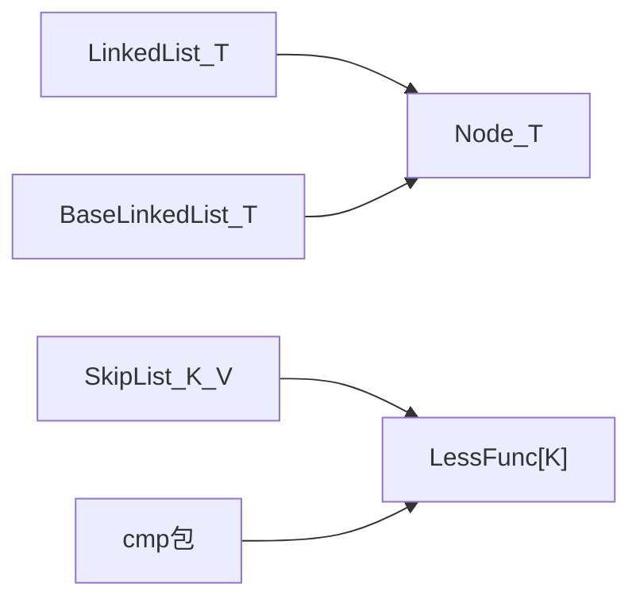

# 列表容器

<cite>
**本文档引用的文件**
- [thirdparty/gox/container/list/list.go](file://thirdparty/gox/container/list/list.go)
- [thirdparty/gox/container/list/linkedlist/list.go](file://thirdparty/gox/container/list/linkedlist/list.go)
- [thirdparty/gox/container/list/linkedlist/list_base.go](file://thirdparty/gox/container/list/linkedlist/list_base.go)
- [thirdparty/gox/container/list/skiplist/skiplist.go](file://thirdparty/gox/container/list/skiplist/skiplist.go)
- [thirdparty/gox/container/list/ziplist/ziplist.go](file://thirdparty/gox/container/list/ziplist/ziplist.go)
- [thirdparty/gox/container/node/node.go](file://thirdparty/gox/container/node/node.go)
- [thirdparty/gox/cmp/compare.go](file://thirdparty/gox/cmp/compare.go)
- [thirdparty/gox/cmp/compare_func.go](file://thirdparty/gox/cmp/compare_func.go)
- [thirdparty/gox/cmp/compare_iface.go](file://thirdparty/gox/cmp/compare_iface.go)
</cite>

## 目录
1. [简介](#简介)
2. [项目结构](#项目结构)
3. [核心组件](#核心组件)
4. [架构总览](#架构总览)
5. [详细组件分析](#详细组件分析)
6. [依赖关系分析](#依赖关系分析)
7. [性能考量](#性能考量)
8. [故障排查指南](#故障排查指南)
9. [结论](#结论)
10. [附录](#附录)

## 简介
本文件为列表容器模块的详细API文档，覆盖以下三种列表实现：
- 链表（LinkedList）
- 跳表（SkipList）
- 压缩列表（ZipList）

内容涵盖数据结构原理、内存布局、随机访问性能、适用场景、完整API参考（Append、Prepend、Insert、Delete、Get、Set等）、遍历方式、内存优化策略、有序列表维护，以及不同实现的性能对比与选型建议。

## 项目结构
列表容器位于第三方库模块中，采用按功能域划分的组织方式：
- 链表实现：包含基础双向链表与单向链表两种形态
- 跳表实现：基于多层索引的有序列表
- 压缩列表：紧凑内存布局的字节数组列表
- 节点与比较工具：提供通用节点类型与比较函数接口

图表来源
- [thirdparty/gox/container/list/linkedlist/list.go:1-205](file://thirdparty/gox/container/list/linkedlist/list.go#L1-L205)
- [thirdparty/gox/container/list/linkedlist/list_base.go:1-248](file://thirdparty/gox/container/list/linkedlist/list_base.go#L1-L248)
- [thirdparty/gox/container/list/skiplist/skiplist.go:1-161](file://thirdparty/gox/container/list/skiplist/skiplist.go#L1-L161)
- [thirdparty/gox/container/list/ziplist/ziplist.go:1-136](file://thirdparty/gox/container/list/ziplist/ziplist.go#L1-L136)
- [thirdparty/gox/container/node/node.go:1-44](file://thirdparty/gox/container/node/node.go#L1-L44)
- [thirdparty/gox/cmp/compare.go:1-74](file://thirdparty/gox/cmp/compare.go#L1-L74)

章节来源
- [thirdparty/gox/container/list/list.go:1-123](file://thirdparty/gox/container/list/list.go#L1-L123)
- [thirdparty/gox/container/list/linkedlist/list.go:1-205](file://thirdparty/gox/container/list/linkedlist/list.go#L1-L205)
- [thirdparty/gox/container/list/linkedlist/list_base.go:1-248](file://thirdparty/gox/container/list/linkedlist/list_base.go#L1-L248)
- [thirdparty/gox/container/list/skiplist/skiplist.go:1-161](file://thirdparty/gox/container/list/skiplist/skiplist.go#L1-L161)
- [thirdparty/gox/container/list/ziplist/ziplist.go:1-136](file://thirdparty/gox/container/list/ziplist/ziplist.go#L1-L136)
- [thirdparty/gox/container/node/node.go:1-44](file://thirdparty/gox/container/node/node.go#L1-L44)
- [thirdparty/gox/cmp/compare.go:1-74](file://thirdparty/gox/cmp/compare.go#L1-L74)
- [thirdparty/gox/cmp/compare_func.go:1-20](file://thirdparty/gox/cmp/compare_func.go#L1-L20)
- [thirdparty/gox/cmp/compare_iface.go:1-42](file://thirdparty/gox/cmp/compare_iface.go#L1-L42)

## 核心组件
- 单向链表（LinkedList）
  - 支持在头部/尾部追加、在任意位置插入、删除指定值或节点、遍历
  - 时间复杂度：插入/删除/查找为O(n)，遍历O(n)
- 双向链表（BaseLinkedList）
  - 提供Push、Pop队列语义，支持在头部/尾部快速插入与出队
  - 时间复杂度：Push/Pop为O(1)，其他操作为O(n)
- 跳表（SkipList）
  - 维护键值对的有序集合，支持Set、Get、Search、Range、Del
  - 平均时间复杂度：插入/查询/删除为O(log n)
- 压缩列表（ZipList）
  - 紧凑内存布局，支持字符串与整数编码，提供push/pushInt等写入能力
  - 内存局部性好，适合小规模短列表

章节来源
- [thirdparty/gox/container/list/linkedlist/list.go:1-205](file://thirdparty/gox/container/list/linkedlist/list.go#L1-L205)
- [thirdparty/gox/container/list/linkedlist/list_base.go:1-248](file://thirdparty/gox/container/list/linkedlist/list_base.go#L1-L248)
- [thirdparty/gox/container/list/skiplist/skiplist.go:1-161](file://thirdparty/gox/container/list/skiplist/skiplist.go#L1-L161)
- [thirdparty/gox/container/list/ziplist/ziplist.go:1-136](file://thirdparty/gox/container/list/ziplist/ziplist.go#L1-L136)

## 架构总览
列表容器模块通过统一的节点类型与比较接口，将不同数据结构抽象为可复用的容器组件。跳表依赖比较函数以维持有序性；链表提供灵活的插入/删除能力；压缩列表专注于内存效率。

图表来源
- [thirdparty/gox/container/list/linkedlist/list.go:1-205](file://thirdparty/gox/container/list/linkedlist/list.go#L1-L205)
- [thirdparty/gox/container/list/linkedlist/list_base.go:1-248](file://thirdparty/gox/container/list/linkedlist/list_base.go#L1-L248)
- [thirdparty/gox/container/list/skiplist/skiplist.go:1-161](file://thirdparty/gox/container/list/skiplist/skiplist.go#L1-L161)
- [thirdparty/gox/container/list/ziplist/ziplist.go:1-136](file://thirdparty/gox/container/list/ziplist/ziplist.go#L1-L136)
- [thirdparty/gox/container/node/node.go:1-44](file://thirdparty/gox/container/node/node.go#L1-L44)
- [thirdparty/gox/cmp/compare_func.go:1-20](file://thirdparty/gox/cmp/compare_func.go#L1-L20)

## 详细组件分析

### 链表（LinkedList）
- 数据结构与内存布局
  - 单向链表由节点组成，每个节点保存下一个节点的指针与值
  - 支持头插、尾插、按位置插入、按值删除、按节点删除
- 随机访问性能
  - 不支持随机访问；按位置访问需从头遍历，平均O(n)
- 适用场景
  - 插入/删除频繁但不需要随机访问的场景
- API参考
  - Append：在尾部追加元素
  - InsertHead：在头部插入元素
  - Insert(position, e)：在指定位置插入元素（越界返回错误）
  - Delete(e)：删除首次出现的元素
  - DeleteNode(node)：删除指定节点
  - traverse(f)：遍历执行回调
- 遍历方式
  - 迭代遍历，支持传入回调函数处理每个元素
- 内存优化策略
  - 使用指针连接，避免大块内存复制
  - 合理控制链表长度，及时删除不再使用的节点
- 有序列表维护
  - 该实现不保证有序；如需有序，请结合外部排序或使用跳表

图表来源
- [thirdparty/gox/container/list/linkedlist/list.go:126-153](file://thirdparty/gox/container/list/linkedlist/list.go#L126-L153)

章节来源
- [thirdparty/gox/container/list/linkedlist/list.go:1-205](file://thirdparty/gox/container/list/linkedlist/list.go#L1-L205)

### 双向链表（BaseLinkedList）
- 数据结构与内存布局
  - 节点包含前后指针与值，支持从两端高效操作
- 随机访问性能
  - 不支持随机访问；队列语义下的Push/Pop为O(1)
- 适用场景
  - 需要频繁在两端插入/删除的队列或栈场景
- API参考
  - Append：尾插
  - InsertHead：头插
  - Push(data)：尾插（队列语义）
  - Pop()：头出队（返回值与布尔标志）
  - Delete(e)：删除首次出现的元素
  - DeleteNode(node)：删除指定节点
  - traverse(f)：遍历执行回调
- 遍历方式
  - 顺序遍历，支持回调处理
- 内存优化策略
  - 双向链表占用额外指针空间；在频繁随机访问场景不推荐
- 有序列表维护
  - 该实现不保证有序；如需有序，请结合外部排序或使用跳表

图表来源
- [thirdparty/gox/container/list/linkedlist/list_base.go:221-233](file://thirdparty/gox/container/list/linkedlist/list_base.go#L221-L233)

章节来源
- [thirdparty/gox/container/list/linkedlist/list_base.go:1-248](file://thirdparty/gox/container/list/linkedlist/list_base.go#L1-L248)

### 跳表（SkipList）
- 数据结构与内存布局
  - 多层索引结构，header作为最高层起点，每层节点通过forward数组连接
  - 键类型需提供LessFunc比较函数
- 随机访问性能
  - 平均O(log n)时间复杂度完成查找、插入、删除
- 适用场景
  - 需要维护有序且频繁更新的键值对集合
- API参考
  - Set(k, v)：插入或更新键值
  - Get(k)：获取值（返回值与存在标志）
  - Search(k)：检查键是否存在
  - Range(from, to, op)：范围遍历
  - Del(k)：删除键并返回旧值与存在标志
- 遍历方式
  - Range支持闭区间范围遍历
- 内存优化策略
  - 随机层数生成，期望层数较低；MaxLevel限制最大层数
- 有序列表维护
  - 通过LessFunc保证键的有序性

图表来源
- [thirdparty/gox/container/list/skiplist/skiplist.go:36-65](file://thirdparty/gox/container/list/skiplist/skiplist.go#L36-L65)

章节来源
- [thirdparty/gox/container/list/skiplist/skiplist.go:1-161](file://thirdparty/gox/container/list/skiplist/skiplist.go#L1-L161)
- [thirdparty/gox/cmp/compare.go:15-35](file://thirdparty/gox/cmp/compare.go#L15-L35)
- [thirdparty/gox/cmp/compare_func.go:9-19](file://thirdparty/gox/cmp/compare_func.go#L9-L19)

### 压缩列表（ZipList）
- 数据结构与内存布局
  - 底层为字节切片，每个条目包含前置长度、编码类型、长度字段与数据
  - 支持RAW与INT两种编码，尾部以特殊结束标记标识
- 随机访问性能
  - 不支持随机访问；访问需顺序扫描，平均O(n)
- 适用场景
  - 小规模短列表、内存敏感场景
- API参考
  - push(value)：写入字节串
  - pushInt(value)：写入整数
- 遍历方式
  - 顺序扫描条目，读取编码与长度字段
- 内存优化策略
  - 紧凑存储减少指针开销；根据数据大小选择编码以节省空间
- 有序列表维护
  - 该实现不保证有序；如需有序，请结合外部排序或使用跳表

图表来源
- [thirdparty/gox/container/list/ziplist/ziplist.go:72-102](file://thirdparty/gox/container/list/ziplist/ziplist.go#L72-L102)

章节来源
- [thirdparty/gox/container/list/ziplist/ziplist.go:1-136](file://thirdparty/gox/container/list/ziplist/ziplist.go#L1-L136)

### 通用列表接口（List）
- 数据结构与内存布局
  - 基于通用节点类型，维护头尾指针与长度
- 随机访问性能
  - 不支持随机访问；操作主要在两端进行
- 适用场景
  - 需要统一接口的链表容器
- API参考
  - New：创建空列表
  - Len：获取长度
  - Head/Tail：获取首尾节点
  - First/Last：获取首尾元素与存在标志
  - Pop：头出队
  - Push/PushFront：尾插/头插
  - PushAt(idx, v)：按索引插入（越界抛panic）
- 遍历方式
  - 通过节点指针顺序遍历
- 内存优化策略
  - 使用泛型节点减少重复代码
- 有序列表维护
  - 该实现不保证有序；如需有序，请结合外部排序或使用跳表

图表来源
- [thirdparty/gox/container/list/list.go:13-122](file://thirdparty/gox/container/list/list.go#L13-L122)
- [thirdparty/gox/container/node/node.go:11-14](file://thirdparty/gox/container/node/node.go#L11-L14)

章节来源
- [thirdparty/gox/container/list/list.go:1-123](file://thirdparty/gox/container/list/list.go#L1-L123)
- [thirdparty/gox/container/node/node.go:1-44](file://thirdparty/gox/container/node/node.go#L1-L44)

## 依赖关系分析
- 节点依赖
  - 链表实现依赖通用节点类型，提供Next与Value字段
- 比较依赖
  - 跳表依赖LessFunc比较函数，确保键的有序性
- 接口与工具
  - 比较接口与工具函数提供Less/Greater/Equal/Compare等基础能力

图表来源
- [thirdparty/gox/container/list/linkedlist/list.go:1-205](file://thirdparty/gox/container/list/linkedlist/list.go#L1-L205)
- [thirdparty/gox/container/list/linkedlist/list_base.go:1-248](file://thirdparty/gox/container/list/linkedlist/list_base.go#L1-L248)
- [thirdparty/gox/container/list/skiplist/skiplist.go:1-161](file://thirdparty/gox/container/list/skiplist/skiplist.go#L1-L161)
- [thirdparty/gox/container/node/node.go:1-44](file://thirdparty/gox/container/node/node.go#L1-L44)
- [thirdparty/gox/cmp/compare_func.go:9-19](file://thirdparty/gox/cmp/compare_func.go#L9-L19)

章节来源
- [thirdparty/gox/cmp/compare.go:1-74](file://thirdparty/gox/cmp/compare.go#L1-L74)
- [thirdparty/gox/cmp/compare_func.go:1-20](file://thirdparty/gox/cmp/compare_func.go#L1-L20)
- [thirdparty/gox/cmp/compare_iface.go:1-42](file://thirdparty/gox/cmp/compare_iface.go#L1-L42)

## 性能考量
- 时间复杂度对比
  - 单向链表：插入/删除/查找O(n)，遍历O(n)
  - 双向链表：Push/PopO(1)，其他O(n)
  - 跳表：Set/Get/Search/Del平均O(log n)，Range线性遍历
  - 压缩列表：写入O(1)，读取O(n)
- 空间复杂度对比
  - 单向/双向链表：每个节点额外指针开销
  - 跳表：多层forward数组，空间开销随层数增加
  - 压缩列表：紧凑存储，无指针开销
- 适用场景建议
  - 频繁两端操作：优先双向链表（Push/Pop）
  - 需要有序且频繁更新：优先跳表
  - 小规模短列表与内存敏感：优先压缩列表
  - 一般插入/删除：单向链表即可

## 故障排查指南
- 下标越界
  - 单向链表Insert与通用列表PushAt在越界时返回错误或抛panic，应先校验位置
- 删除失败
  - 删除指定值时若不存在对应节点，操作无效果；可先使用Search/Exist确认
- 遍历异常
  - 遍历时注意空链表与空节点情况，确保回调函数正确处理
- 跳表键冲突
  - Set会更新已有键的值；如需唯一性，应在上层逻辑控制

章节来源
- [thirdparty/gox/container/list/linkedlist/list.go:126-153](file://thirdparty/gox/container/list/linkedlist/list.go#L126-L153)
- [thirdparty/gox/container/list/list.go:94-114](file://thirdparty/gox/container/list/list.go#L94-L114)

## 结论
- 若需要两端高效插入/删除，优先双向链表
- 若需要维护有序且频繁更新，优先跳表
- 若需要小规模短列表与内存效率，优先压缩列表
- 若仅需简单插入/删除与顺序遍历，单向链表足够

## 附录
- API速查
  - 单向链表：Append、InsertHead、Insert、Delete、DeleteNode、traverse
  - 双向链表：Append、InsertHead、Push、Pop、Delete、DeleteNode、traverse
  - 跳表：Set、Get、Search、Range、Del
  - 压缩列表：push、pushInt
  - 通用列表：Len、Head、Tail、First、Last、Pop、Push、PushFront、PushAt