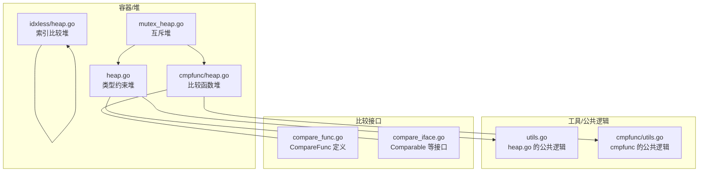
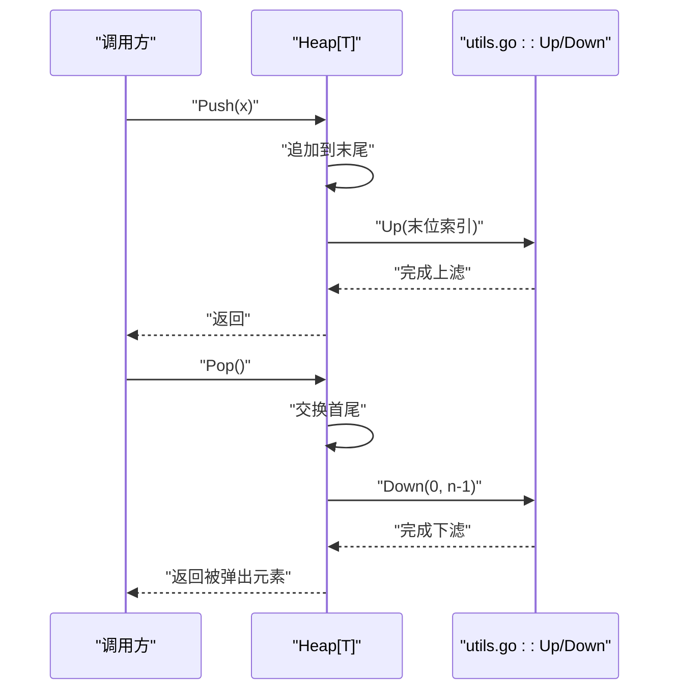
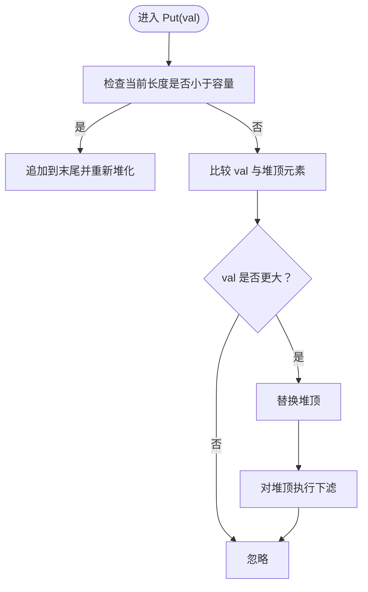
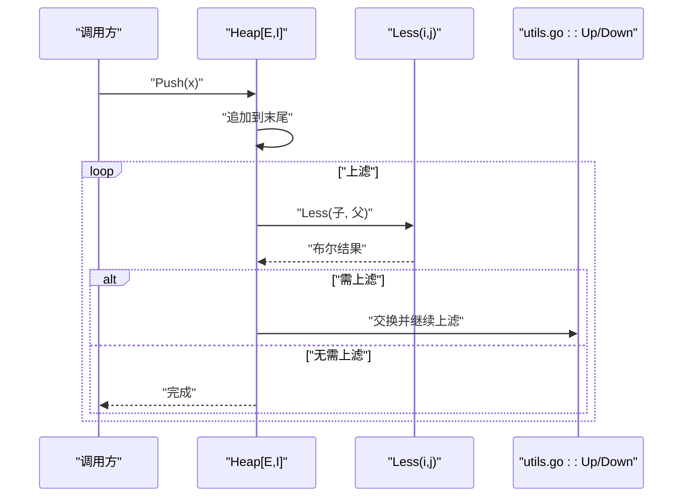
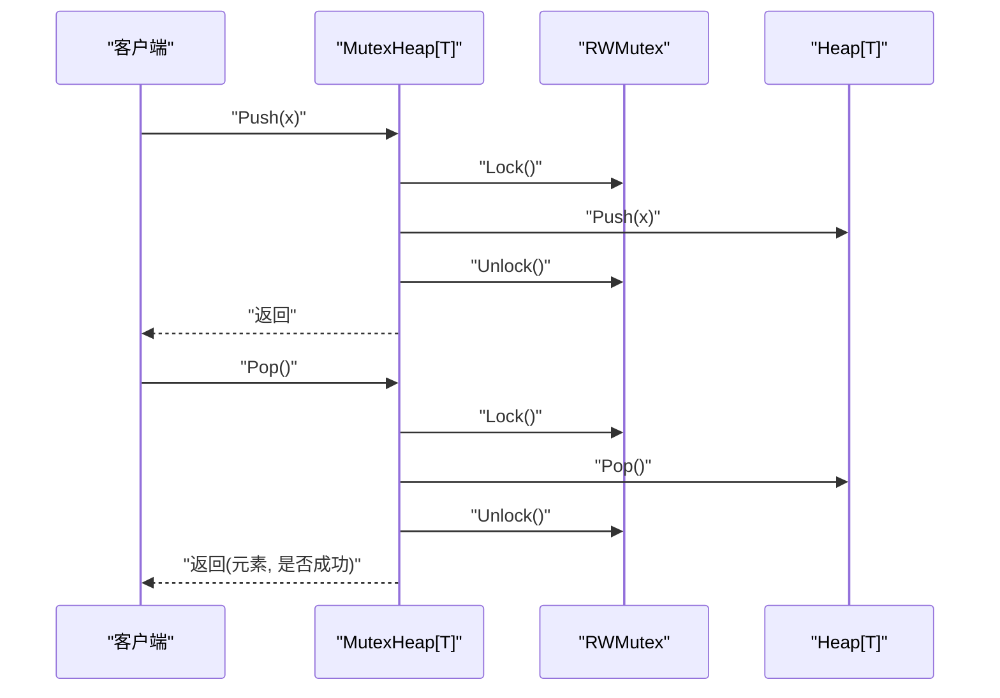
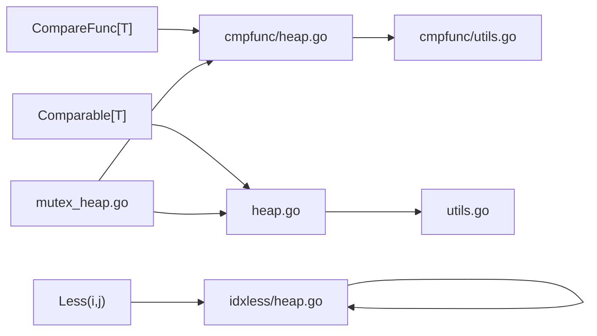

# 堆容器

<cite>
**本文档引用的文件**
- [thirdparty/gox/container/heap/heap.go](file://thirdparty/gox/container/heap/heap.go)
- [thirdparty/gox/container/heap/utils.go](file://thirdparty/gox/container/heap/utils.go)
- [thirdparty/gox/container/heap/heap_test.go](file://thirdparty/gox/container/heap/heap_test.go)
- [thirdparty/gox/container/heap/cmpfunc/heap.go](file://thirdparty/gox/container/heap/cmpfunc/heap.go)
- [thirdparty/gox/container/heap/cmpfunc/utils.go](file://thirdparty/gox/container/heap/cmpfunc/utils.go)
- [thirdparty/gox/container/heap/idxless/heap.go](file://thirdparty/gox/container/heap/idxless/heap.go)
- [thirdparty/gox/container/heap/idxless/heap_test.go](file://thirdparty/gox/container/heap/idxless/heap_test.go)
- [thirdparty/gox/sync/heap/mutex_heap.go](file://thirdparty/gox/sync/heap/mutex_heap.go)
- [thirdparty/gox/cmp/compare_func.go](file://thirdparty/gox/cmp/compare_func.go)
- [thirdparty/gox/cmp/compare_iface.go](file://thirdparty/gox/cmp/compare_iface.go)
</cite>

## 目录
1. [简介](#简介)
2. [项目结构](#项目结构)
3. [核心组件](#核心组件)
4. [架构总览](#架构总览)
5. [详细组件分析](#详细组件分析)
6. [依赖关系分析](#依赖关系分析)
7. [性能考量](#性能考量)
8. [故障排查指南](#故障排查指南)
9. [结论](#结论)
10. [附录：API 参考](#附录api-参考)

## 简介
本文件为堆容器模块的详细技术文档，覆盖以下内容：
- 最小堆与最大堆的实现方式与差异
- 比较函数（cmpfunc）与索引比较（idxless）两种策略
- 堆的数据结构原理、堆化（heapify）、上滤（up）、下滤（down）流程
- 插入、删除、取顶、更新等操作的时间复杂度与使用场景
- 自定义比较函数的接入方法、堆排序与优先队列应用示例
- 并发安全堆（互斥堆）的封装与适用场景

## 项目结构
堆容器模块位于 thirdparty/gox/container/heap 下，按功能分为三类实现：
- 基于类型约束的堆（基于元素自身 Compare 方法）
- 基于比较函数的堆（通过 CompareFunc 注入比较逻辑）
- 基于索引比较的堆（通过 Less 接口对数组索引进行比较）

此外，thirdparty/gox/sync/heap 提供了互斥包装的并发安全堆。



图表来源
- [thirdparty/gox/container/heap/heap.go:1-81](file://thirdparty/gox/container/heap/heap.go#L1-L81)
- [thirdparty/gox/container/heap/utils.go:1-91](file://thirdparty/gox/container/heap/utils.go#L1-L91)
- [thirdparty/gox/container/heap/cmpfunc/heap.go:1-120](file://thirdparty/gox/container/heap/cmpfunc/heap.go#L1-L120)
- [thirdparty/gox/container/heap/cmpfunc/utils.go:1-91](file://thirdparty/gox/container/heap/cmpfunc/utils.go#L1-L91)
- [thirdparty/gox/container/heap/idxless/heap.go:1-138](file://thirdparty/gox/container/heap/idxless/heap.go#L1-L138)
- [thirdparty/gox/sync/heap/mutex_heap.go:1-101](file://thirdparty/gox/sync/heap/mutex_heap.go#L1-L101)
- [thirdparty/gox/cmp/compare_func.go:1-20](file://thirdparty/gox/cmp/compare_func.go#L1-L20)
- [thirdparty/gox/cmp/compare_iface.go:1-42](file://thirdparty/gox/cmp/compare_iface.go#L1-L42)

章节来源
- [thirdparty/gox/container/heap/heap.go:1-81](file://thirdparty/gox/container/heap/heap.go#L1-L81)
- [thirdparty/gox/container/heap/utils.go:1-91](file://thirdparty/gox/container/heap/utils.go#L1-L91)
- [thirdparty/gox/container/heap/cmpfunc/heap.go:1-120](file://thirdparty/gox/container/heap/cmpfunc/heap.go#L1-L120)
- [thirdparty/gox/container/heap/cmpfunc/utils.go:1-91](file://thirdparty/gox/container/heap/cmpfunc/utils.go#L1-L91)
- [thirdparty/gox/container/heap/idxless/heap.go:1-138](file://thirdparty/gox/container/heap/idxless/heap.go#L1-L138)
- [thirdparty/gox/sync/heap/mutex_heap.go:1-101](file://thirdparty/gox/sync/heap/mutex_heap.go#L1-L101)
- [thirdparty/gox/cmp/compare_func.go:1-20](file://thirdparty/gox/cmp/compare_func.go#L1-L20)
- [thirdparty/gox/cmp/compare_iface.go:1-42](file://thirdparty/gox/cmp/compare_iface.go#L1-L42)

## 核心组件
- 类型约束堆（heap.go）
  - 使用元素自身的 Compare 方法进行比较，适用于实现了 Comparable[T] 的类型
  - 支持 New、NewFromArray、Init、Push、Pop、First、Last、Remove 等操作
- 比较函数堆（cmpfunc/heap.go）
  - 通过 CompareFunc[T] 注入比较逻辑，适合无 Compare 方法或需要自定义比较规则的场景
  - 支持 New、NewFromArray、Init、Push、Put、Pop、Remove、First、Last、Fix 等
- 索引比较堆（idxless/heap.go）
  - 通过 Interface[E, I] 中的 Less(i, j) 对数组索引进行比较，适合已有切片并希望直接复用其比较逻辑
  - 支持 New、NewFromArray、Init、Push、Put、Pop、Remove、First、Size 等
- 互斥堆（sync/heap/mutex_heap.go）
  - 在堆操作上加读写锁，提供并发安全的堆接口

章节来源
- [thirdparty/gox/container/heap/heap.go:13-81](file://thirdparty/gox/container/heap/heap.go#L13-L81)
- [thirdparty/gox/container/heap/cmpfunc/heap.go:13-120](file://thirdparty/gox/container/heap/cmpfunc/heap.go#L13-L120)
- [thirdparty/gox/container/heap/idxless/heap.go:9-138](file://thirdparty/gox/container/heap/idxless/heap.go#L9-L138)
- [thirdparty/gox/sync/heap/mutex_heap.go:16-101](file://thirdparty/gox/sync/heap/mutex_heap.go#L16-L101)

## 架构总览
堆容器采用“策略分离”的设计：
- 公共逻辑（上滤/下滤/堆化/修复）在 utils 中统一实现
- 三种堆实现分别通过不同比较策略复用这些公共逻辑
- 互斥堆以组合方式封装任意一种堆实现，提供并发安全保障

```mermaid
classDiagram
class Heap_T {
+New(l int) Heap[T]
+NewFromArray(arr []T) Heap[T]
+Init() void
+Push(x T) void
+Pop() (T,bool)
+First() (T,bool)
+Last() (T,bool)
+Remove(i int) (T,bool)
}
class HeapAnyCmp {
-arr []T
-cmp CompareFunc[T]
-zero T
+New(l int, cmp) *Heap[T]
+NewFromArray(arr, cmp) *Heap[T]
+Init() void
+Push(x T) void
+Put(val T) void
+Pop() (T,bool)
+Remove(i int) (T,bool)
+First() (T,bool)
+Last() (T,bool)
+Fix(i int) void
}
class HeapIdxLess[E,I] {
+New(capacity int) Heap[E,I]
+NewFromArray(arr I) Heap[E,I]
+Init() void
+Push(x E) void
+Put(val E) void
+Pop() (E,bool)
+Remove(i int) (E,bool)
+First() (E,bool)
+Size() int
}
class MutexHeap[T] {
-mu RWMutex
-data []T
-zero T
+New(l int) MutexHeap[T]
+NewFromArray(arr []T) MutexHeap[T]
+Init() void
+Push(x T) void
+Pop() (T,bool)
+First() (T,bool)
+Last() (T,bool)
+Remove(i int) (T,bool)
}
Heap_T --> Utils : "复用"
HeapAnyCmp --> CmpFuncUtils : "复用"
HeapIdxLess --> HeapIdxLess : "内部实现"
MutexHeap --> Heap_T : "组合封装"
MutexHeap --> HeapAnyCmp : "组合封装"
```

图表来源
- [thirdparty/gox/container/heap/heap.go:13-81](file://thirdparty/gox/container/heap/heap.go#L13-L81)
- [thirdparty/gox/container/heap/utils.go:13-91](file://thirdparty/gox/container/heap/utils.go#L13-L91)
- [thirdparty/gox/container/heap/cmpfunc/heap.go:13-120](file://thirdparty/gox/container/heap/cmpfunc/heap.go#L13-L120)
- [thirdparty/gox/container/heap/cmpfunc/utils.go:13-91](file://thirdparty/gox/container/heap/cmpfunc/utils.go#L13-L91)
- [thirdparty/gox/container/heap/idxless/heap.go:14-138](file://thirdparty/gox/container/heap/idxless/heap.go#L14-L138)
- [thirdparty/gox/sync/heap/mutex_heap.go:16-101](file://thirdparty/gox/sync/heap/mutex_heap.go#L16-L101)

## 详细组件分析

### 类型约束堆（heap.go）
- 数据结构：基于切片的完全二叉堆，元素顺序由元素自身的 Compare 决定
- 关键操作
  - 初始化：Init 对半叶节点起自底向上执行下滤
  - 上滤：Up 从子节点向上交换到父节点直至满足堆序
  - 下滤：Down 从父节点向下交换至合适位置
  - 插入：Push 将元素追加到末尾并执行上滤
  - 删除：Pop 交换首尾元素后对首元素执行下滤，并截断末尾
  - 取顶：First 返回堆顶元素；Last 返回最后一个元素（非堆性质）
  - 删除指定索引：Remove 支持 O(log n) 删除
- 时间复杂度
  - Push/Pop/First/Remove：O(log n)
  - Init：O(n)
  - First/Last：O(1)



图表来源
- [thirdparty/gox/container/heap/heap.go:31-49](file://thirdparty/gox/container/heap/heap.go#L31-L49)
- [thirdparty/gox/container/heap/utils.go:21-51](file://thirdparty/gox/container/heap/utils.go#L21-L51)

章节来源
- [thirdparty/gox/container/heap/heap.go:13-81](file://thirdparty/gox/container/heap/heap.go#L13-L81)
- [thirdparty/gox/container/heap/utils.go:13-91](file://thirdparty/gox/container/heap/utils.go#L13-L91)

### 比较函数堆（cmpfunc/heap.go）
- 设计要点
  - 通过 CompareFunc[T] 注入比较逻辑，支持任意类型
  - Put 用于固定容量场景：当新元素比堆顶更“大”（根据比较规则）时替换堆顶并下滤
- 关键操作
  - New/NewFromArray：构造堆并可选择堆化
  - Init：自底向上堆化
  - Push：追加后上滤
  - Put：容量受限的“顶堆”维护
  - Pop/Remove/First/Last/Fix：与通用逻辑一致
- 时间复杂度
  - Push/Put/Pop/Remove/Fix：O(log n)
  - Init：O(n)



图表来源
- [thirdparty/gox/container/heap/cmpfunc/heap.go:52-65](file://thirdparty/gox/container/heap/cmpfunc/heap.go#L52-L65)
- [thirdparty/gox/container/heap/cmpfunc/utils.go:21-51](file://thirdparty/gox/container/heap/cmpfunc/utils.go#L21-L51)

章节来源
- [thirdparty/gox/container/heap/cmpfunc/heap.go:13-120](file://thirdparty/gox/container/heap/cmpfunc/heap.go#L13-L120)
- [thirdparty/gox/container/heap/cmpfunc/utils.go:13-91](file://thirdparty/gox/container/heap/cmpfunc/utils.go#L13-L91)

### 索引比较堆（idxless/heap.go）
- 设计要点
  - 通过 Interface[E, I] 的 Less(i, j) 对数组索引进行比较，适合已有切片并希望直接利用其比较逻辑
  - Put 同样支持固定容量的“顶堆”维护
- 关键操作
  - New/NewFromArray：构造堆并堆化
  - Init：自底向上堆化
  - Push/Put/Pop/Remove/First/Size：与通用逻辑一致
- 时间复杂度
  - Push/Put/Pop/Remove：O(log n)
  - Init：O(n)



图表来源
- [thirdparty/gox/container/heap/idxless/heap.go:36-40](file://thirdparty/gox/container/heap/idxless/heap.go#L36-L40)
- [thirdparty/gox/container/heap/idxless/heap.go:103-113](file://thirdparty/gox/container/heap/idxless/heap.go#L103-L113)

章节来源
- [thirdparty/gox/container/heap/idxless/heap.go:9-138](file://thirdparty/gox/container/heap/idxless/heap.go#L9-L138)

### 互斥堆（sync/heap/mutex_heap.go）
- 设计要点
  - 组合任意一种堆实现，并在每次操作前后加读写锁
  - 读多写少场景建议使用 RLock，写少但需要严格顺序时使用 Lock
- 关键操作
  - Init/Push/Pop/First/Last/Remove：在临界区内调用对应堆操作
- 注意事项
  - 锁粒度为单次操作级别，避免在锁内执行耗时操作
  - Pop/Remove 返回值与对应堆一致



图表来源
- [thirdparty/gox/sync/heap/mutex_heap.go:50-70](file://thirdparty/gox/sync/heap/mutex_heap.go#L50-L70)
- [thirdparty/gox/container/heap/heap.go:31-49](file://thirdparty/gox/container/heap/heap.go#L31-L49)

章节来源
- [thirdparty/gox/sync/heap/mutex_heap.go:16-101](file://thirdparty/gox/sync/heap/mutex_heap.go#L16-L101)

## 依赖关系分析
- 比较接口
  - Comparable[T]：要求元素实现 Compare(T) int，用于类型约束堆
  - CompareFunc[T]：函数式比较，用于比较函数堆
  - Less(i, j)：索引比较接口，用于索引比较堆
- 公共逻辑
  - Up/Down/Fix/Init/AdjustUp/AdjustDown：在 utils 中统一实现，三类堆各自封装调用
- 并发安全
  - 互斥堆通过组合任意堆实现，提供线程安全访问



图表来源
- [thirdparty/gox/cmp/compare_func.go:13-20](file://thirdparty/gox/cmp/compare_func.go#L13-L20)
- [thirdparty/gox/cmp/compare_iface.go:13-15](file://thirdparty/gox/cmp/compare_iface.go#L13-L15)
- [thirdparty/gox/container/heap/cmpfunc/heap.go:13-24](file://thirdparty/gox/container/heap/cmpfunc/heap.go#L13-L24)
- [thirdparty/gox/container/heap/heap.go:13-17](file://thirdparty/gox/container/heap/heap.go#L13-L17)
- [thirdparty/gox/container/heap/idxless/heap.go:9-12](file://thirdparty/gox/container/heap/idxless/heap.go#L9-L12)
- [thirdparty/gox/container/heap/cmpfunc/utils.go:13-57](file://thirdparty/gox/container/heap/cmpfunc/utils.go#L13-L57)
- [thirdparty/gox/container/heap/utils.go:13-57](file://thirdparty/gox/container/heap/utils.go#L13-L57)
- [thirdparty/gox/sync/heap/mutex_heap.go:16-101](file://thirdparty/gox/sync/heap/mutex_heap.go#L16-L101)

章节来源
- [thirdparty/gox/cmp/compare_func.go:1-20](file://thirdparty/gox/cmp/compare_func.go#L1-L20)
- [thirdparty/gox/cmp/compare_iface.go:1-42](file://thirdparty/gox/cmp/compare_iface.go#L1-L42)
- [thirdparty/gox/container/heap/cmpfunc/utils.go:13-91](file://thirdparty/gox/container/heap/cmpfunc/utils.go#L13-L91)
- [thirdparty/gox/container/heap/utils.go:13-91](file://thirdparty/gox/container/heap/utils.go#L13-L91)

## 性能考量
- 时间复杂度
  - Push/Pop/Remove/Fix：O(log n)
  - Init：O(n)
  - First/Last：O(1)
- 空间复杂度
  - 基于切片存储，空间开销为 O(n)，支持 cap 预分配减少扩容次数
- 实践建议
  - 固定容量场景优先使用 Put（比较函数堆/索引比较堆），以避免频繁扩容
  - 需要并发安全时使用互斥堆，注意锁竞争与临界区内的耗时操作
  - 自定义比较函数时确保比较关系满足全序关系（自反、反对称、传递）

## 故障排查指南
- 比较函数不一致
  - 现象：堆化后 Pop 顺序异常
  - 排查：确认 CompareFunc 或 Less 的语义与预期一致（如“更大即优先级更高”）
- 索引越界
  - 现象：Remove/Pop/First/Last 报错或返回空
  - 排查：检查索引合法性与堆长度变化（Pop 后长度减一）
- Put 未生效
  - 现象：固定容量堆未替换堆顶
  - 排查：确认 Put 的比较条件与堆性质一致（例如“仅当新元素更大时替换堆顶”）
- 并发问题
  - 现象：读写冲突或死锁
  - 排查：检查锁的持有时间与调用方是否在锁内执行耗时操作

章节来源
- [thirdparty/gox/container/heap/cmpfunc/heap.go:52-65](file://thirdparty/gox/container/heap/cmpfunc/heap.go#L52-L65)
- [thirdparty/gox/container/heap/idxless/heap.go:42-57](file://thirdparty/gox/container/heap/idxless/heap.go#L42-L57)
- [thirdparty/gox/sync/heap/mutex_heap.go:33-100](file://thirdparty/gox/sync/heap/mutex_heap.go#L33-L100)

## 结论
堆容器模块提供了三种灵活的实现策略：
- 类型约束堆：最简洁，适用于已实现 Compare 的类型
- 比较函数堆：最灵活，适用于任意类型与自定义比较规则
- 索引比较堆：最贴合已有切片场景，减少额外封装成本
配合互斥堆，可在并发环境下稳定使用。通过统一的上滤/下滤/堆化逻辑，保证了实现的一致性与可维护性。

## 附录：API 参考

### 类型约束堆（heap.go）
- New(l int) Heap[T]
  - 功能：创建指定容量的空堆
- NewFromArray(arr []T) Heap[T]
  - 功能：从数组构建堆（逐个上滤）
- Init() void
  - 功能：自底向上堆化
- Push(x T) void
  - 功能：插入元素并上滤
- Pop() (T, bool)
  - 功能：弹出堆顶元素并下滤
- First() (T, bool)
  - 功能：读取堆顶元素
- Last() (T, bool)
  - 功能：读取最后一个元素（非堆性质）
- Remove(i int) (T, bool)
  - 功能：删除指定索引元素并修复堆序

章节来源
- [thirdparty/gox/container/heap/heap.go:15-81](file://thirdparty/gox/container/heap/heap.go#L15-L81)

### 比较函数堆（cmpfunc/heap.go）
- New(l int, cmp CompareFunc[T]) *Heap[T]
  - 功能：创建带比较函数的堆
- NewFromArray(arr []T, cmp CompareFunc[T]) *Heap[T]
  - 功能：从数组构建堆（逐个上滤）
- Init() void
  - 功能：自底向上堆化
- Push(x T) void
  - 功能：插入元素并上滤
- Put(val T) void
  - 功能：固定容量场景下的“顶堆”维护
- Pop() (T, bool)
  - 功能：弹出堆顶元素并下滤
- Remove(i int) (T, bool)
  - 功能：删除指定索引元素并修复堆序
- First() (T, bool)
  - 功能：读取堆顶元素
- Last() (T, bool)
  - 功能：读取最后一个元素（非堆性质）
- Fix(i int) void
  - 功能：在指定位置进行修复（先下滤，再上滤）

章节来源
- [thirdparty/gox/container/heap/cmpfunc/heap.go:19-120](file://thirdparty/gox/container/heap/cmpfunc/heap.go#L19-L120)

### 索引比较堆（idxless/heap.go）
- New[E, I](capacity int) Heap[E, I]
  - 功能：创建指定容量的索引比较堆
- NewFromArray[E, I](arr I) Heap[E, I]
  - 功能：从实现了 Less 的切片构建堆
- Init() void
  - 功能：自底向上堆化
- Push(x E) void
  - 功能：插入元素并上滤
- Put(val E) void
  - 功能：固定容量场景下的“顶堆”维护
- Pop() (E, bool)
  - 功能：弹出堆顶元素并下滤
- Remove(i int) (E, bool)
  - 功能：删除指定索引元素并修复堆序
- First() (E, bool)
  - 功能：读取堆顶元素
- Size() int
  - 功能：返回堆大小

章节来源
- [thirdparty/gox/container/heap/idxless/heap.go:16-138](file://thirdparty/gox/container/heap/idxless/heap.go#L16-L138)

### 互斥堆（sync/heap/mutex_heap.go）
- New(l int) MutexHeap[T]
  - 功能：创建并发安全堆
- NewFromArray(arr []T) MutexHeap[T]
  - 功能：从数组创建并发安全堆
- Init() void
  - 功能：初始化堆化（加锁）
- Push(x T) void
  - 功能：插入元素（加锁）
- Pop() (T, bool)
  - 功能：弹出堆顶（加锁）
- First() (T, bool)
  - 功能：读取堆顶（加锁）
- Last() (T, bool)
  - 功能：读取最后一个元素（加锁）
- Remove(i int) (T, bool)
  - 功能：删除指定索引元素（加锁）

章节来源
- [thirdparty/gox/sync/heap/mutex_heap.go:22-101](file://thirdparty/gox/sync/heap/mutex_heap.go#L22-L101)

### 比较接口（cmp）
- CompareFunc[T]
  - 定义：func(T, T) int
  - 用途：比较函数堆的比较逻辑
- Comparable[T]
  - 定义：Compare(T) int
  - 用途：类型约束堆的元素必须实现
- Less(i, j) bool
  - 用途：索引比较堆的比较逻辑

章节来源
- [thirdparty/gox/cmp/compare_func.go:13-20](file://thirdparty/gox/cmp/compare_func.go#L13-L20)
- [thirdparty/gox/cmp/compare_iface.go:13-15](file://thirdparty/gox/cmp/compare_iface.go#L13-L15)
- [thirdparty/gox/cmp/compare_iface.go:22-29](file://thirdparty/gox/cmp/compare_iface.go#L22-L29)

### 常见用法与示例

- 自定义比较函数（比较函数堆）
  - 场景：对结构体按字段排序，或实现最大堆
  - 步骤：定义 CompareFunc[T]，调用 New/Init/Push/Pop
  - 参考路径：[thirdparty/gox/container/heap/cmpfunc/heap.go:19-43](file://thirdparty/gox/container/heap/cmpfunc/heap.go#L19-L43)

- 堆排序（类型约束堆）
  - 思路：先 Init 建堆，然后重复 Pop 输出有序序列
  - 参考路径：[thirdparty/gox/container/heap/heap_test.go:20-41](file://thirdparty/gox/container/heap/heap_test.go#L20-L41)

- 优先队列（索引比较堆）
  - 思路：实现 Less(i, j) 表达优先级，Push/Pop 即可
  - 参考路径：[thirdparty/gox/container/heap/idxless/heap_test.go:24-39](file://thirdparty/gox/container/heap/idxless/heap_test.go#L24-L39)

- 固定容量顶堆（比较函数堆）
  - 思路：使用 Put 维护前 K 大/前 K 小
  - 参考路径：[thirdparty/gox/container/heap/cmpfunc/heap.go:52-65](file://thirdparty/gox/container/heap/cmpfunc/heap.go#L52-L65)

- 并发安全堆
  - 思路：在高并发场景下使用 MutexHeap 包装任意堆实现
  - 参考路径：[thirdparty/gox/sync/heap/mutex_heap.go:50-70](file://thirdparty/gox/sync/heap/mutex_heap.go#L50-L70)